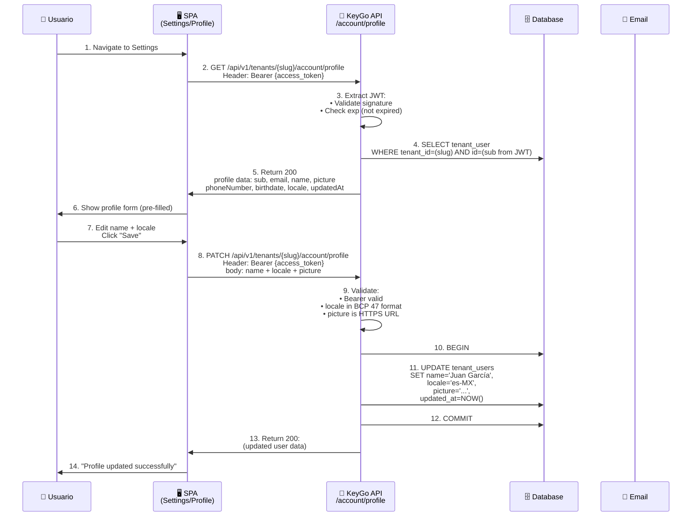
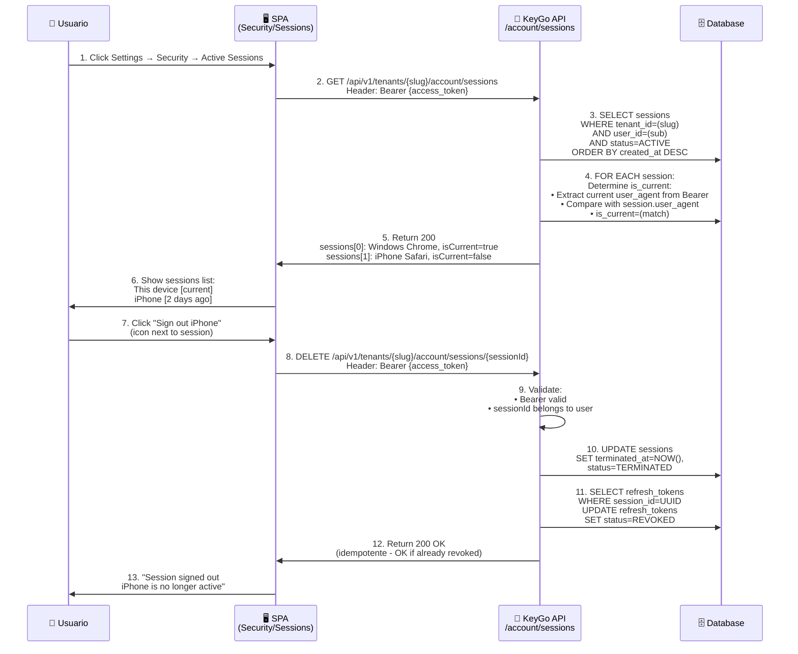
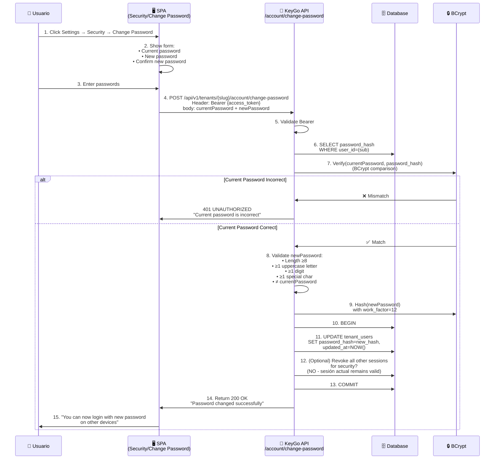
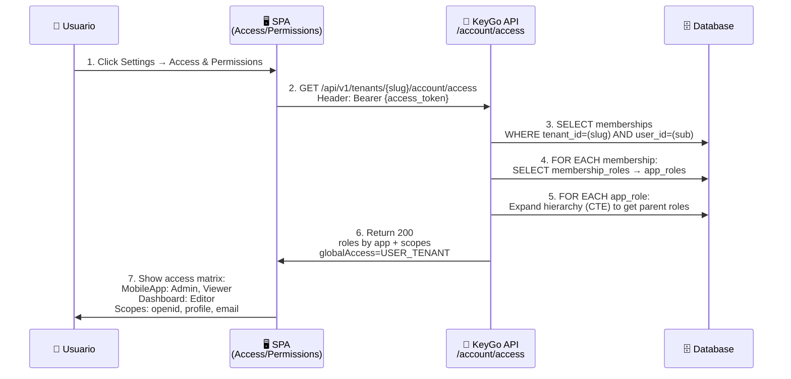
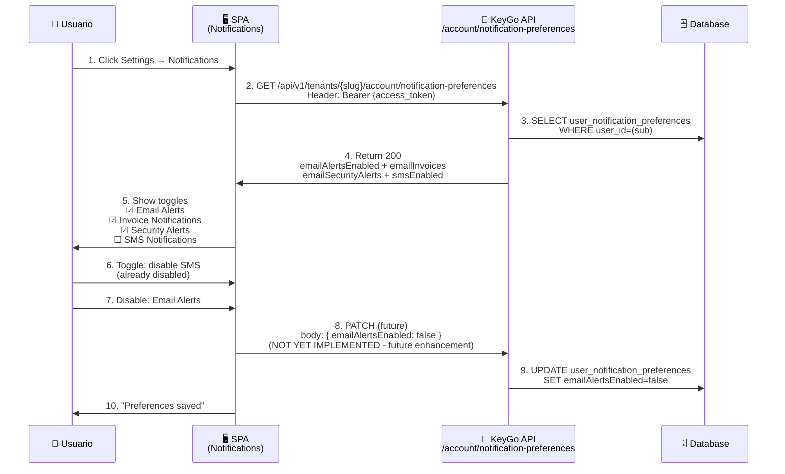
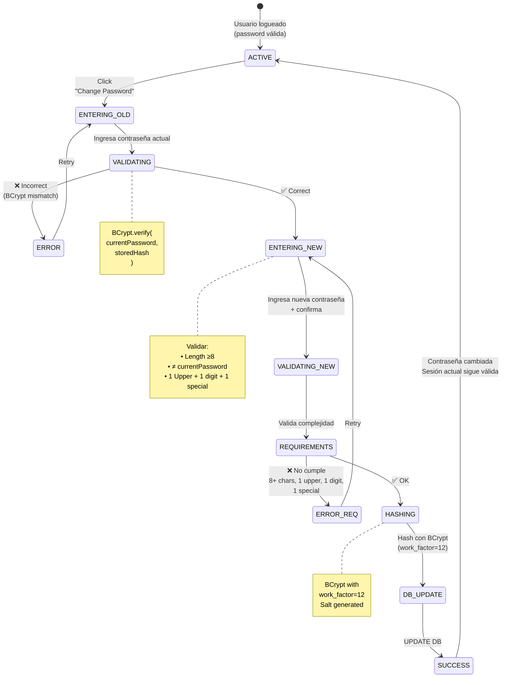

# Flujo de Account — Self-Service Usuario

> **Descripción:** Operaciones self-service del usuario autenticado: perfil, sesiones, cambio de contraseña, acceso/roles.

**Fecha:** 2026-04-05

---

## 1. Flujo Completo: Vista + Edición de Perfil

---

## 2. Gestión de Sesiones (Devices)

---

## 3. Cambio de Contraseña (Autenticado)

---

## 4. Ver Acceso / Permisos (Roles en Apps)

---

## 5. Vista de Preferencias de Notificación

---

## 6. Estados de Cambio de Contraseña

---

## 7. Tabla Resumida: Operaciones Account

| Operación | Endpoint | Método | Auth | Mutante |
|---|---|---|---|---|
| Ver perfil | `/account/profile` | GET | Bearer | No |
| Editar perfil | `/account/profile` | PATCH | Bearer | Sí |
| Listar sesiones | `/account/sessions` | GET | Bearer | No |
| Revocar sesión | `/account/sessions/{id}` | DELETE | Bearer | Sí |
| Ver acceso/roles | `/account/access` | GET | Bearer | No |
| Ver notificaciones | `/account/notification-preferences` | GET | Bearer | No |
| Cambiar contraseña | `/account/change-password` | POST | Bearer | Sí |
| Forgot password | `/account/forgot-password` | POST | Público | Sí |
| Recover password | `/account/recover-password` | POST | Público | Sí |
| Reset password | `/account/reset-password` | POST | Público | Sí |

---

**Última actualización:** 2026-04-05  
**Próximos:** Diagramas de Secuencia (DIAGRAMAS/SECUENCIAS/) y Máquinas de Estado (DIAGRAMAS/ESTADOS/)
