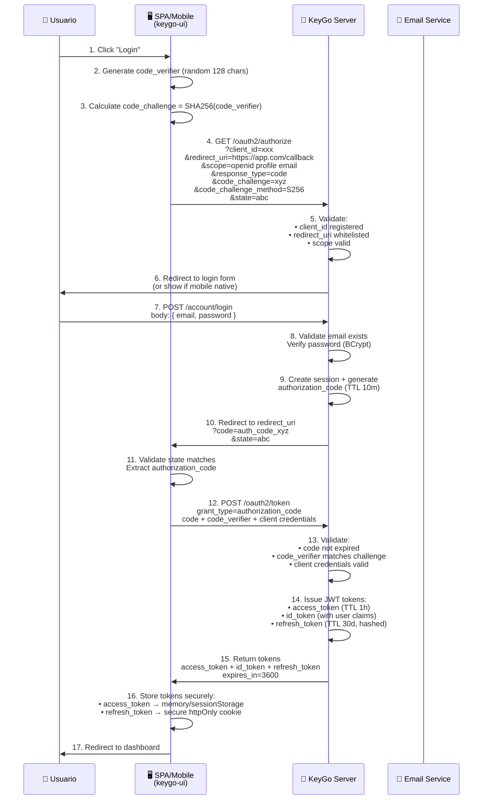
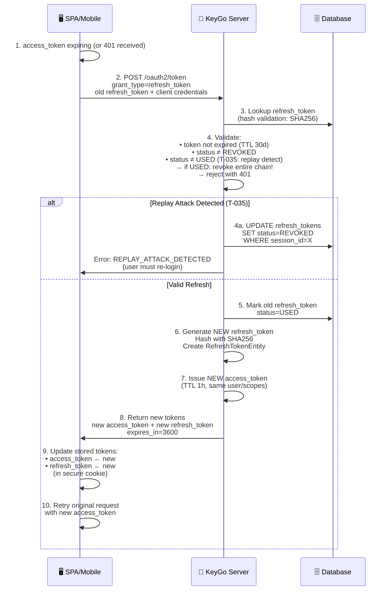
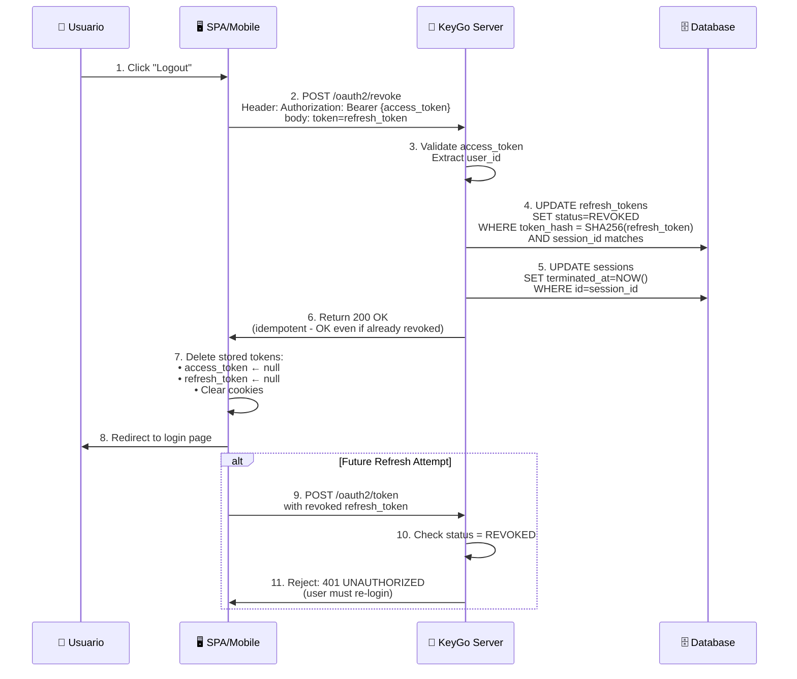
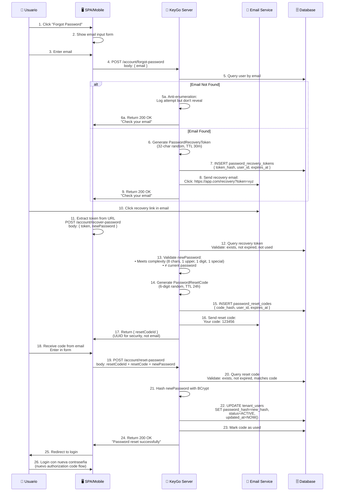
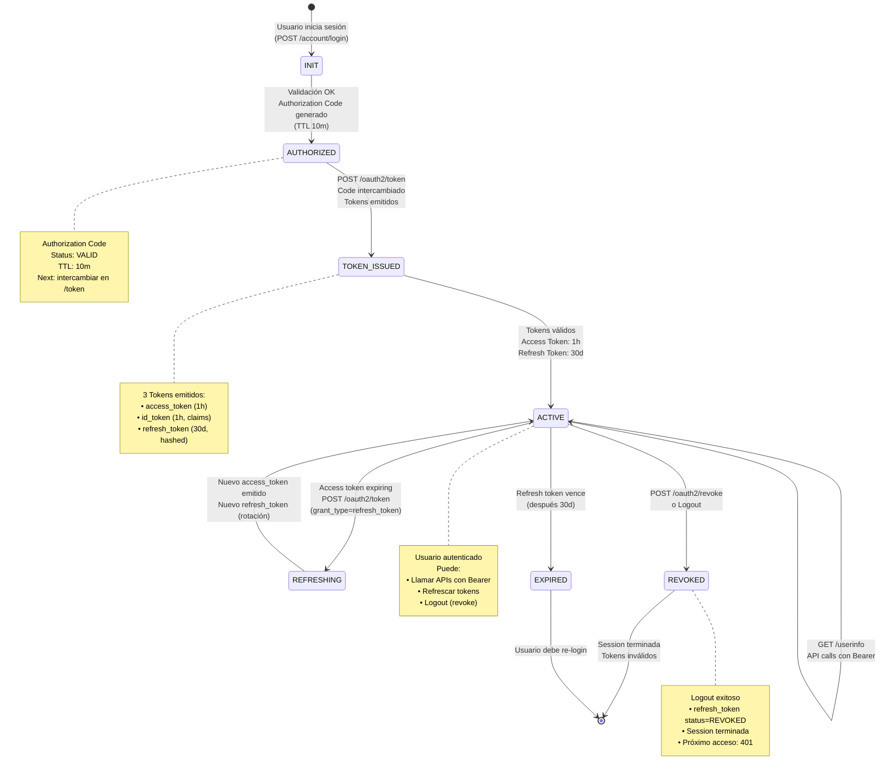
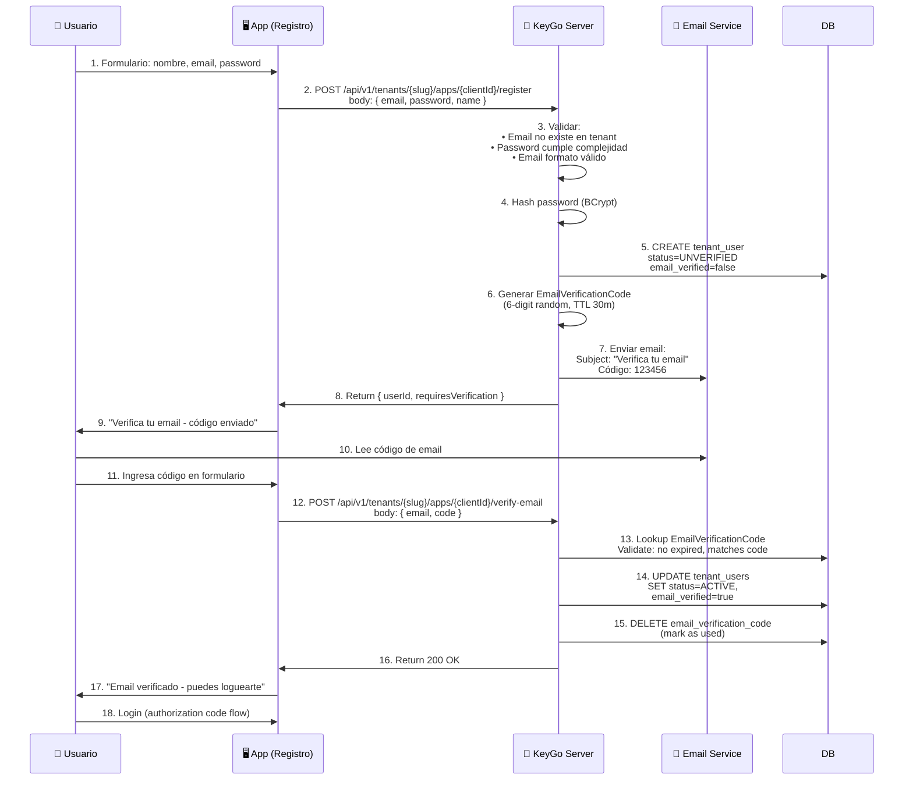

# Flujo de Autenticación — OAuth2/OIDC Completo

> **Descripción:** Diagramas de flujo del proceso completo de autenticación en KeyGo (Authorization Code + PKCE, Refresh Token, Logout, Reset Password).

**Fecha:** 2026-04-05

---

## 1. Authorization Code Flow + PKCE (Login)



---

## 2. Refresh Token Rotation (Token Expiration)



---

## 3. Token Revocation (Logout)



---

## 4. Password Reset Flow



---

## 5. Estado de Transiciones (Sesión y Tokens)



---

## 6. Claims en JWT (Access Token vs ID Token)

### **Access Token (autoriza API calls)**

```json
{
  "sub": "user-uuid",
  "iss": "https://keygo.local/tenants/acme",
  "aud": "client-id-mobile-app",
  "exp": 1712416800,
  "iat": 1712413200,
  "scope": "openid profile email",
  "roles": ["ADMIN_TENANT"],
  "oid": "acme"  // tenant_slug
}
```

### **ID Token (identifica usuario)**

```json
{
  "sub": "user-uuid",
  "iss": "https://keygo.local/tenants/acme",
  "aud": "client-id-mobile-app",
  "exp": 1712416800,
  "iat": 1712413200,
  "nonce": "random-nonce-from-authorize",
  "email": "user@acme.com",
  "name": "John Doe",
  "picture": "https://...",
  "locale": "es-MX"
}
```

---

## 7. Flujo de Verificación de Email (Registro)



---

## 8. Resumen: Flujos Críticos

| Flujo | Duración | Tokens Emitidos | Seguridad Clave |
|---|---|---|---|
| **Authorization Code + PKCE** | ~2-3 min | access + id + refresh | PKCE previene code interception |
| **Refresh Token Rotation** | ~100 ms | access + refresh (nuevo) | SHA256 hash, replay detection (T-035) |
| **Logout/Revoke** | ~50 ms | ninguno | Marca refresh como REVOKED |
| **Password Reset** | ~5-10 min | ninguno | Recovery token (30m) + Reset code (24h) |
| **Email Verification** | ~5 min | ninguno | 6-digit code (30m TTL) |

---

**Última actualización:** 2026-04-05  
**Próximo:** FLUJO_TENANT_MANAGEMENT.md (creación y gestión de tenants)
