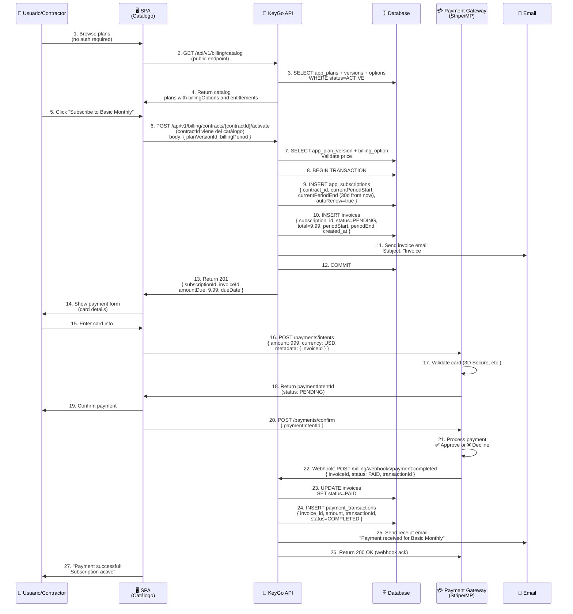
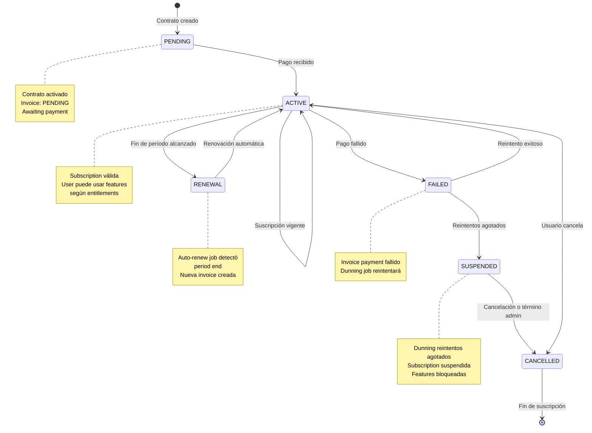
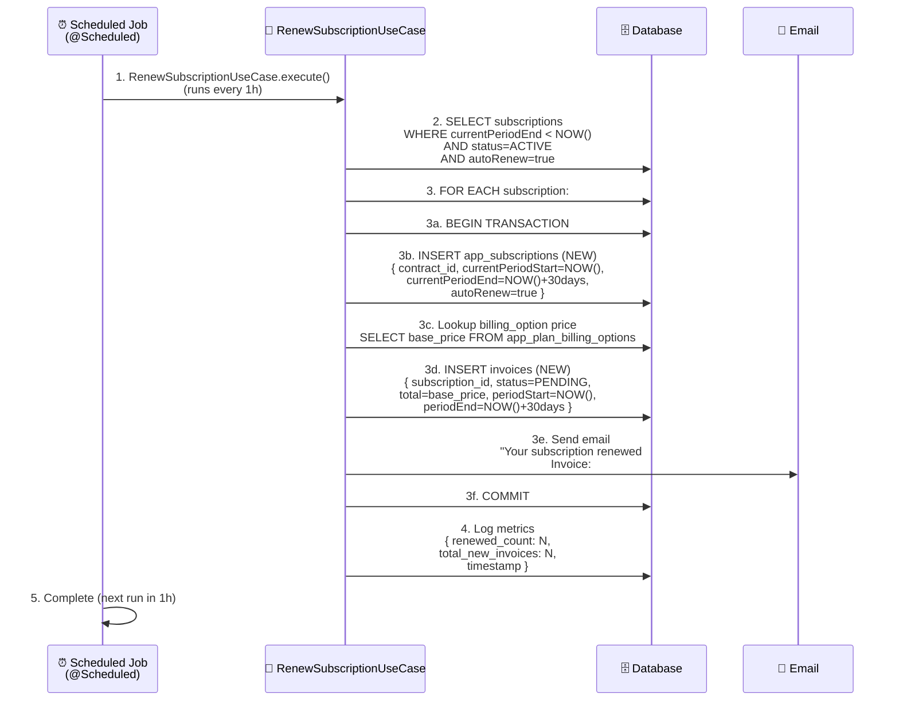
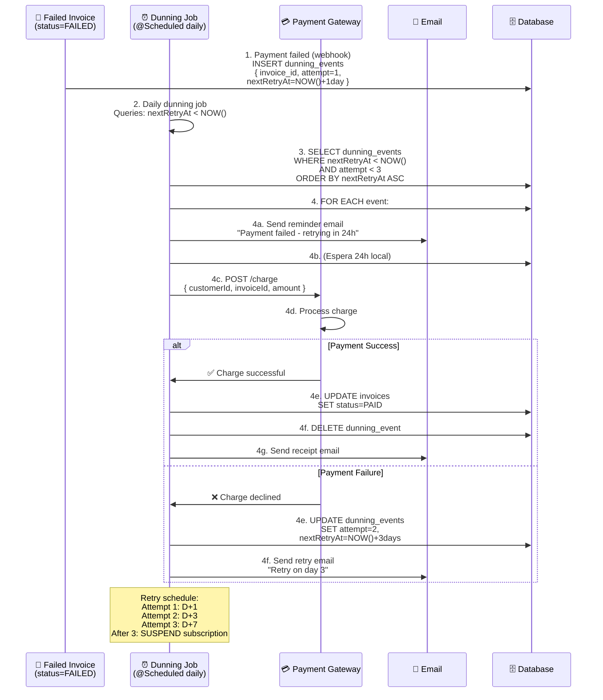
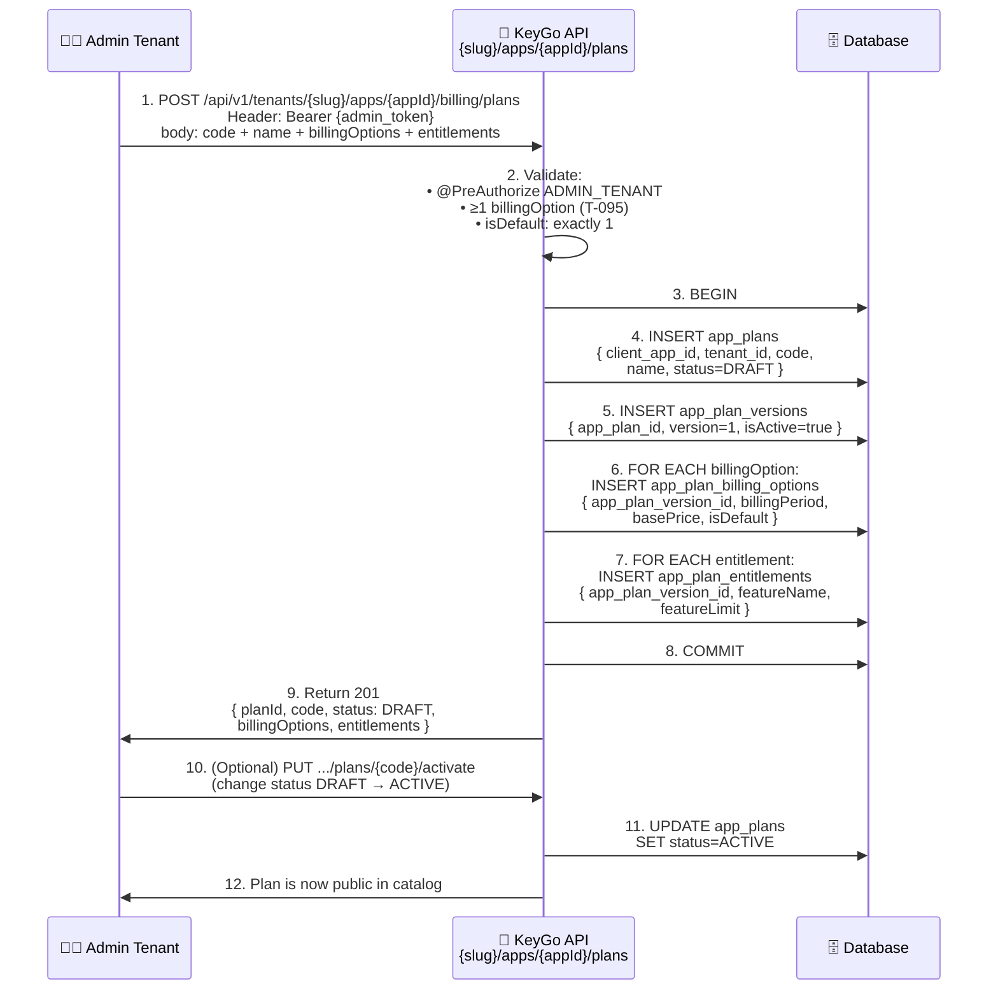
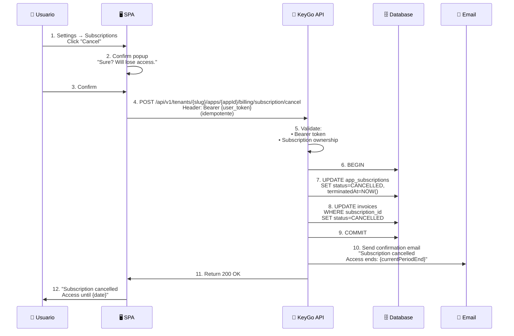

# Flujo de Billing — Suscripciones y Facturación

> **Descripción:** Flujos de catálogo de planes, activación de suscripciones, generación de facturas y pagos.

**Fecha:** 2026-04-05

---

## 1. Flujo Completo: Catálogo → Suscripción → Pago → Factura

---

## 2. Estados de Suscripción

---

## 3. Flujo de Renovación Automática (T-085)

---

## 4. Flujo de Dunning (Reintentos de Pago)

---

## 5. Flujo: Admin Crea Plan

---

## 6. Matriz de Estados: Invoice

| Estado | Significado | Acción | Próximo |
|---|---|---|---|
| **PENDING** | Generada, awaiting payment | Mostrar en dashboard | PAID o FAILED |
| **PAID** | Pago recibido | Usar acceso a features | EXPIRED (30+ días) |
| **FAILED** | Pago rechazado | Iniciar dunning (T-090) | PAID (retry) o SUSPENDED |
| **EXPIRED** | Vencida (30+ días sin pagar) | Bloquear features | CANCELLED |
| **CANCELLED** | Cancelada | Histórico solo | (terminal) |

---

## 7. Flujo: Usuario Cancela Suscripción

---

**Última actualización:** 2026-04-05  
**Próximo:** FLUJO_ACCOUNT.md (self-service usuario)
