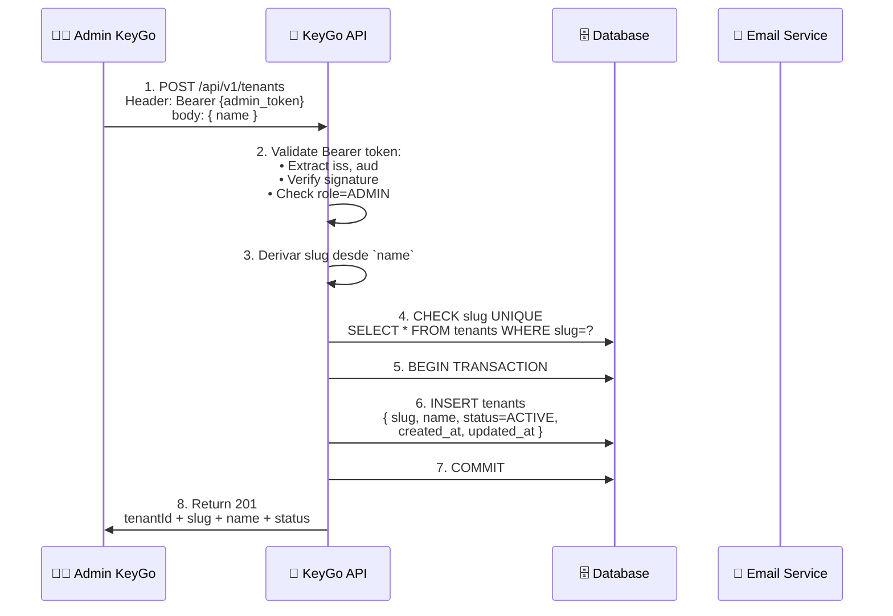
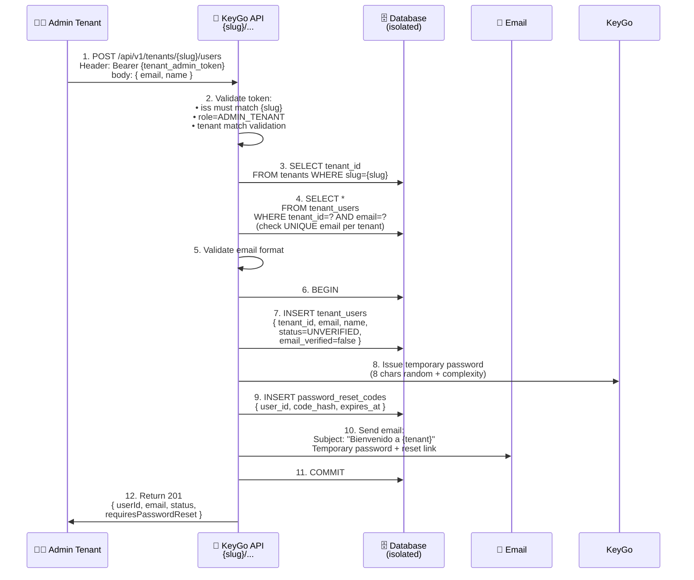
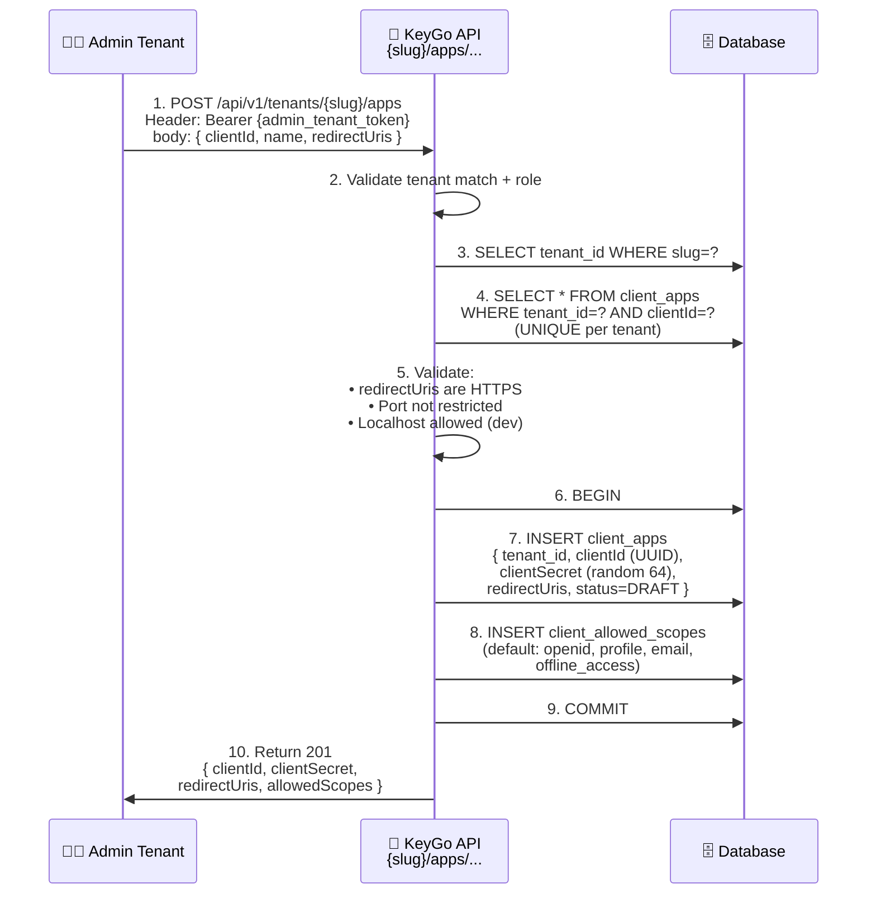
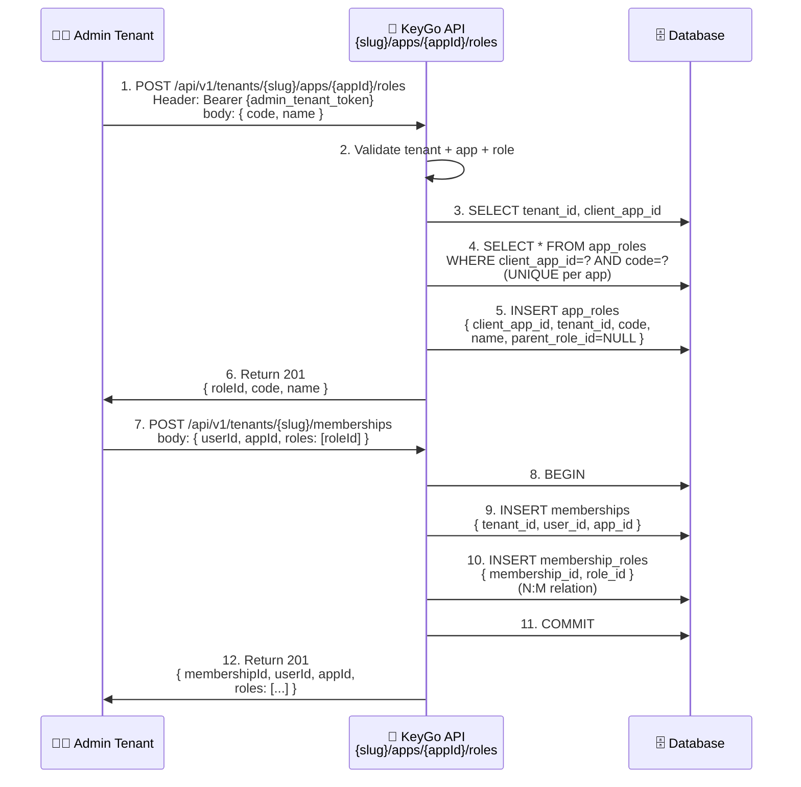
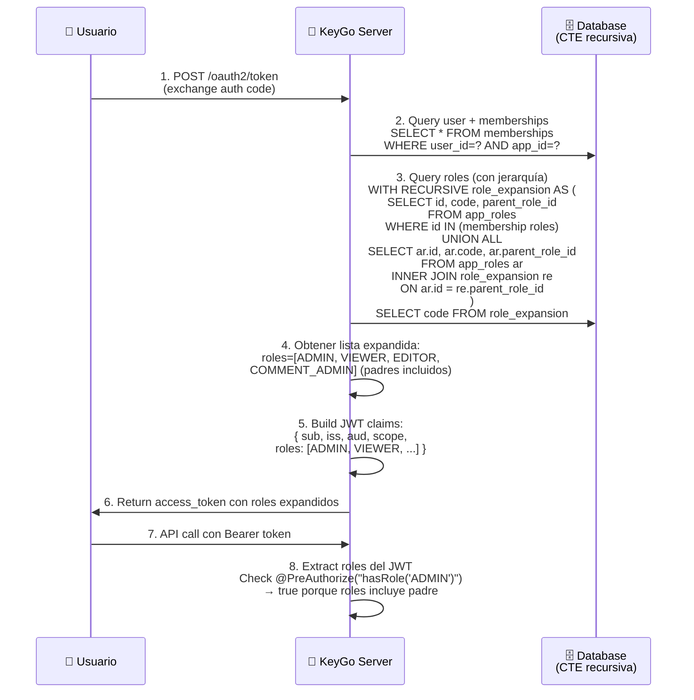
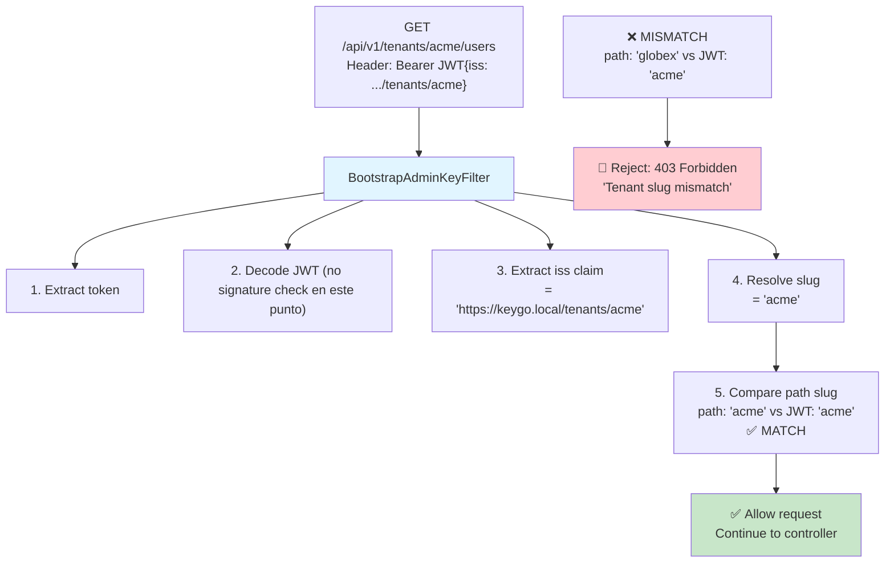
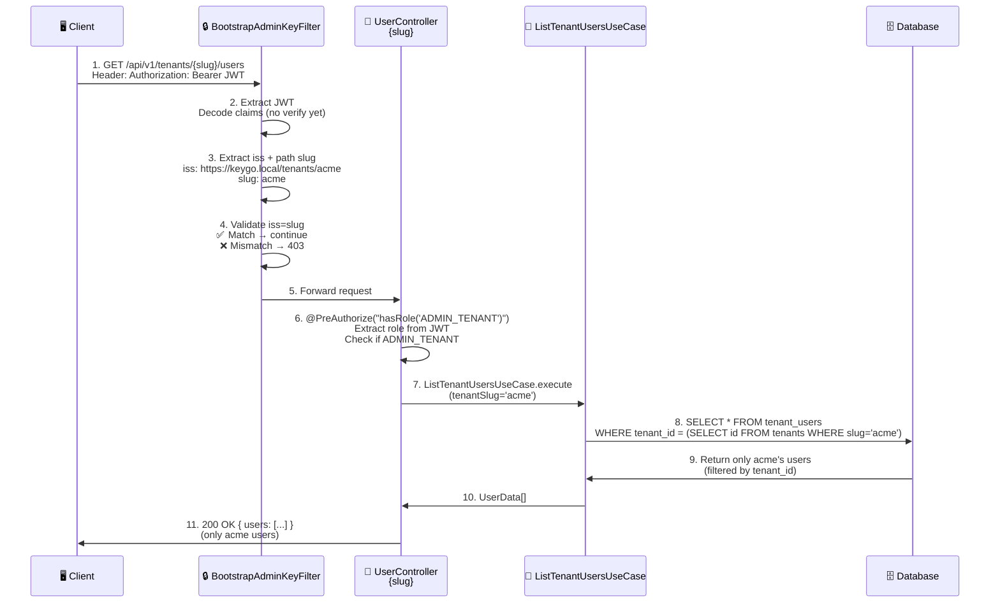

# Flujo de Gestión de Tenants — Multi-Tenant Isolation

> **Descripción:** Flujos de creación y gestión de tenants, usuarios, apps, roles y memberships con aislamiento completo por tenant.

**Fecha:** 2026-04-05

---

## 1. Creación de Tenant (Onboarding)



---

## 2. Crear Usuario en Tenant



---

## 3. Crear App (OAuth2) en Tenant



---

## 4. Crear Rol en App + Asignar a Usuario (Membership)



---

## 5. Expansión de Roles Jerárquicos en JWT (T-107)



---

## 6. Estados de Transición: Tenant y Usuario

```mermaid
stateDiagram-v2
    [*] --> ONBOARDING: Admin crea tenant<br/>(POST /tenants)
    
    ONBOARDING --> ACTIVE: Tenant ready<br/>Apps registradas
    
    ACTIVE --> ACTIVE: Admin gestiona:<br/>• Crear usuarios<br/>• Crear apps<br/>• Asignar roles
    
    ACTIVE --> SUSPENDED: Admin suspende<br/>(PUT /suspend)
    
    SUSPENDED --> ACTIVE: Admin activa<br/>(PUT /activate)
    
    SUSPENDED --> [*]: Borrado (futuro)
    
    note right of ONBOARDING
        Tenant creado
        Signing keys: ✅
        Default roles: ✅
        Status: ACTIVE
    end note
    
    note right of ACTIVE
        Usuarios pueden loguearse
        Apps autorizan con OAuth2
        Roles asignados a memberships
    end note
    
    note right of SUSPENDED
        Usuarios: 401 bloqueado
        Apps: revocación
        Data: íntegra (no delete)
    end note

    ---

    [*] --> UNVERIFIED: Usuario creado<br/>(POST /users)
    
    UNVERIFIED --> ACTIVE: Email verificado<br/>Password reset
    
    ACTIVE --> ACTIVE: Usuario logueado<br/>Opera normalmente
    
    ACTIVE --> RESET_PASSWORD: Admin resetea<br/>Password temporal enviado
    
    RESET_PASSWORD --> ACTIVE: Usuario cambia password
    
    ACTIVE --> SUSPENDED: Admin suspende
    
    SUSPENDED --> ACTIVE: Admin activa
    
    SUSPENDED --> [*]: Borrado (futuro)
    
    note right of UNVERIFIED
        Email no verificado
        No puede loguearse
        Código 6-dígito (30m)
    end note
    
    note right of RESET_PASSWORD
        Temporary password: 24h TTL
        Reset code: 24h TTL
        Usuario debe cambiar password
    end note
```

---

## 7. Aislamiento Multi-Tenant en BD

```
┌─────────────────────────────────────────────────┐
│            PostgreSQL Database                  │
├─────────────────────────────────────────────────┤
│                                                 │
│  TENANTS TABLE                                  │
│  ├─ id=1, slug='acme'         ← Tenant A      │
│  └─ id=2, slug='globex'       ← Tenant B      │
│                                                 │
│  TENANT_USERS TABLE                             │
│  ├─ id=10, tenant_id=1, email='john@acme'     │
│  ├─ id=11, tenant_id=1, email='alice@acme'    │
│  ├─ id=20, tenant_id=2, email='john@globex'   │  (different person!)
│  └─ id=21, tenant_id=2, email='bob@globex'    │
│                                                 │
│  CLIENT_APPS TABLE                              │
│  ├─ id=100, tenant_id=1, clientId='....'      │ (Acme's app)
│  └─ id=200, tenant_id=2, clientId='....'      │ (Globex's app)
│                                                 │
│  APP_ROLES TABLE                                │
│  ├─ id=1000, tenant_id=1, client_app_id=100   │
│  └─ id=2000, tenant_id=2, client_app_id=200   │
│                                                 │
│  MEMBERSHIPS TABLE                              │
│  ├─ id=9000, tenant_id=1, user_id=10, app_id=100
│  └─ id=9001, tenant_id=2, user_id=20, app_id=200
│                                                 │
└─────────────────────────────────────────────────┘

QUERY RULE:
SELECT * FROM tenant_users 
WHERE tenant_id = 1  ← SIEMPRE filtrar por tenant_id
    AND email = 'john@...'

Nunca:
SELECT * FROM tenant_users WHERE email = 'john@...'
              ↑ puede retornar usuario de otro tenant!
```

---

## 8. Path Variable Validation (Tenant Resolution)



---

## 9. Flujo: Validación de Token por Tenant



---

**Última actualización:** 2026-04-05  
**Próximo:** FLUJO_BILLING.md (suscripciones y facturas)
