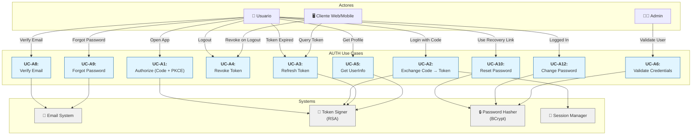
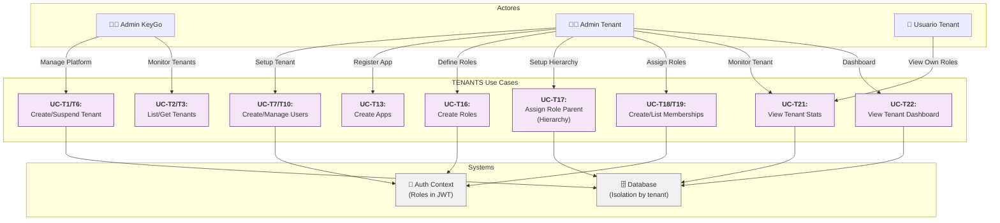
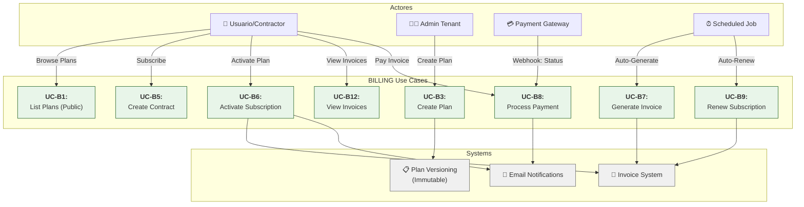
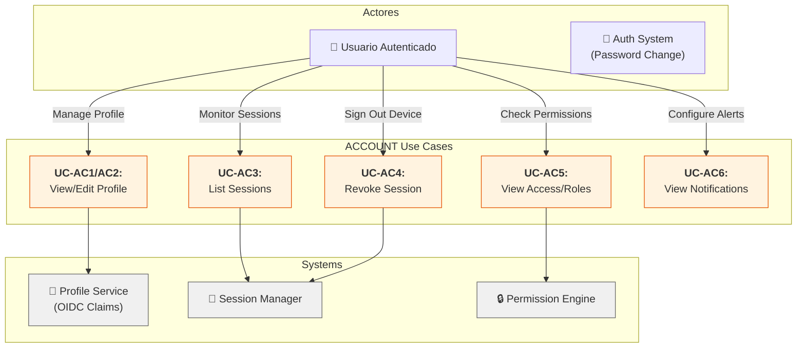

# Diagrama de Casos de Uso — KeyGo Server

> **Descripción:** Mapa visual de actores y sus interacciones con el sistema, organizados por Bounded Context.

**Fecha:** 2026-04-05

---

## 1. Mapa General (Todos los Contextos)

```mermaid
graph TB
    subgraph "Actores Externos"
        User["👤 Usuario (no auth)"]
        Admin["👨‍💼 Admin KeyGo"]
        AdminTenant["👨‍💼 Admin Tenant"]
        Service["🔌 Servicio Backend<br/>(M2M)"]
        Gateway["💳 Payment Gateway<br/>(Stripe/MercadoPago)"]
    end

    subgraph "AUTH Context"
        UC_Auth["<b>UC-A: Authentication</b>"]
        AuthorizeCode["Authorize with Code"]
        ExchangeToken["Exchange Token"]
        RefreshToken["Refresh Token"]
        RevokeToken["Revoke Token"]
        UserInfo["Get UserInfo"]
        VerifyEmail["Verify Email"]
        ResetPassword["Reset Password"]
        LoginCreds["Validate Credentials"]
    end

    subgraph "TENANTS Context"
        UC_Tenant["<b>UC-T: Tenant Management</b>"]
        CreateTenant["Create Tenant"]
        ManageUsers["Manage Users"]
        ManageApps["Manage Apps"]
        ManageRoles["Manage Roles"]
        ManageMemberships["Manage Memberships"]
        ViewStats["View Stats"]
    end

    subgraph "BILLING Context"
        UC_Bill["<b>UC-B: Billing</b>"]
        ViewCatalog["View Catalog"]
        ActivateContract["Activate Subscription"]
        VerifyEmail_Bill["Verify Email (Contract)"]
        ViewInvoices["View Invoices"]
        ProcessPayment["Process Payment"]
        RenewSubscription["Renew Subscription"]
    end

    subgraph "ACCOUNT Context"
        UC_Acc["<b>UC-AC: Account</b>"]
        ViewProfile["View/Edit Profile"]
        ManageSessions["Manage Sessions"]
        ChangePassword["Change Password"]
        ViewAccess["View Access/Roles"]
    end

    %% User (no auth)
    User -->|"Authorize + Login"| AuthorizeCode
    User -->|"Forgot Password"| ResetPassword
    User -->|"Register"| VerifyEmail
    User -->|"Activate Plan"| ActivateContract
    User -->|"Verify Email"| VerifyEmail_Bill
    User -->|"Pay"| ProcessPayment

    %% User (authenticated)
    User -->|"Refresh Access"| RefreshToken
    User -->|"Logout"| RevokeToken
    User -->|"Get Info"| UserInfo
    User -->|"View/Edit Profile"| ViewProfile
    User -->|"Manage Sessions"| ManageSessions
    User -->|"Change Password"| ChangePassword
    User -->|"View Permissions"| ViewAccess
    User -->|"View Invoices"| ViewInvoices

    %% Admin
    Admin -->|"Create Tenant"| CreateTenant
    Admin -->|"Manage All Tenants"| ManageApps
    Admin -->|"View Platform Stats"| ViewStats

    %% Admin Tenant
    AdminTenant -->|"Manage Users"| ManageUsers
    AdminTenant -->|"Create Apps"| ManageApps
    AdminTenant -->|"Create Roles"| ManageRoles
    AdminTenant -->|"Assign Memberships"| ManageMemberships
    AdminTenant -->|"Create Plans"| ViewCatalog
    AdminTenant -->|"View Tenant Stats"| ViewStats

    %% Service (M2M)
    Service -->|"Get Platform Stats"| ViewStats
    Service -->|"Call APIs"| UserInfo

    %% Gateway
    Gateway -->|"Webhook: Payment Status"| ProcessPayment

    %% Styling
    classDef auth fill:#e1f5ff,stroke:#01579b
    classDef tenant fill:#f3e5f5,stroke:#4a148c
    classDef billing fill:#e8f5e9,stroke:#1b5e20
    classDef account fill:#fff3e0,stroke:#e65100
    
    class UC_Auth auth
    class AuthorizeCode,ExchangeToken,RefreshToken,RevokeToken,UserInfo,VerifyEmail,ResetPassword,LoginCreds auth
    class UC_Tenant tenant
    class CreateTenant,ManageUsers,ManageApps,ManageRoles,ManageMemberships,ViewStats tenant
    class UC_Bill billing
    class ViewCatalog,ActivateContract,VerifyEmail_Bill,ViewInvoices,ProcessPayment,RenewSubscription billing
    class UC_Acc account
    class ViewProfile,ManageSessions,ChangePassword,ViewAccess account
```

---

## 2. AUTH Context — Casos de Uso Detallados

---

## 3. TENANTS Context — Casos de Uso Detallados

---

## 4. BILLING Context — Casos de Uso Detallados

---

## 5. ACCOUNT Context — Casos de Uso Detallados

---

## 6. Matriz de Actores vs. Contextos

| Actor | Auth | Tenants | Billing | Account |
|---|---|---|---|---|
| **Usuario (no auth)** | ✅ Login, Reset Password, Verify Email | ❌ | ✅ View Catalog, Activate Plan, Pay | ❌ |
| **Usuario (authenticated)** | ✅ Logout, Refresh, UserInfo | ❌ (view only) | ✅ View Invoices | ✅ Full self-service |
| **Admin KeyGo** | ✅ (system admin) | ✅ Create/Suspend Tenants | ✅ (system level) | ❌ |
| **Admin Tenant** | ❌ (pero gestiona usuarios) | ✅ Users, Apps, Roles, Memberships | ✅ Create Plans | ❌ (pero ve usuarios) |
| **Servicio Backend (M2M)** | ✅ Client Credentials | ✅ System access | ✅ Webhooks | ❌ |
| **Payment Gateway** | ❌ | ❌ | ✅ Payment Status | ❌ |
| **Scheduled Jobs** | ❌ | ❌ | ✅ Renewal, Cleanup | ❌ |

---

**Última actualización:** 2026-04-05  
**Próximo:** FLUJO_AUTENTICACION.md (flujo OAuth2/OIDC detallado)
