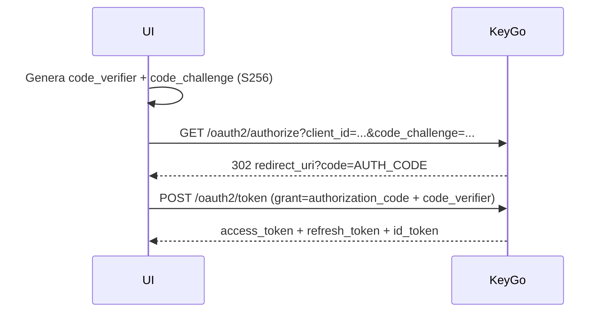

# Autenticación — OAuth2 Authorization Code + PKCE

## Flujo general



## Endpoints OAuth2

| Acción | Método | Path |
|---|---|---|
| Iniciar login | `GET` | `/oauth2/authorize` |
| Canjear código | `POST` | `/oauth2/token` |
| Renovar token | `POST` | `/oauth2/token` (grant=refresh_token) |
| Revocar token | `POST` | `/oauth2/revoke` |
| Info del usuario | `GET` | `/oauth2/userinfo` |
| JWKS público | `GET` | `/.well-known/jwks.json` |
| Metadata OIDC | `GET` | `/.well-known/openid-configuration` |

> Prefijo completo: `http://localhost:8080/keygo-server` (no `/api/v1`).

## Hosted login de plataforma

En el flujo hosted login de plataforma existe un paso previo a credenciales para decidir si
el usuario continúa por login o por onboarding:

| Acción | Método | Path | Resultado esperado |
|---|---|---|---|
| Verificar email de platform user | `POST` | `/api/v1/platform/account/check-email` | `200 PLATFORM_USER_EMAIL_FOUND`, `404 PLATFORM_USER_EMAIL_NOT_FOUND`, `401 AUTHENTICATION_REQUIRED` |

Notas:

- Debe llamarse **después** de `GET /api/v1/platform/oauth2/authorize`.
- Requiere conservar la cookie de sesión (`JSESSIONID`) creada por `authorize`.
- `401` indica que la sesión no existe o expiró; la UI debe reiniciar el flujo desde `authorize`.
- `data` viene `null`; la decisión se toma por HTTP status + `ResponseCode`.

## Implementación: OAuthService

```typescript
// src/services/oauth.ts
import { generateCodeChallenge, generateCodeVerifier } from 'pkce-gen';

export class OAuthService {
  constructor(private config: OAuthConfig) {}

  async startLogin(): Promise<void> {
    const verifier = generateCodeVerifier();
    const challenge = await generateCodeChallenge(verifier);
    sessionStorage.setItem('pkce_verifier', verifier);

    const url = new URL(`${this.config.issuer}/oauth2/authorize`);
    url.searchParams.set('client_id', this.config.clientId);
    url.searchParams.set('redirect_uri', this.config.redirectUri);
    url.searchParams.set('response_type', 'code');
    url.searchParams.set('code_challenge', challenge);
    url.searchParams.set('code_challenge_method', 'S256');
    url.searchParams.set('scope', 'openid profile email');
    window.location.href = url.toString();
  }

  async handleCallback(code: string): Promise<TokenResponse> {
    const verifier = sessionStorage.getItem('pkce_verifier');
    if (!verifier) throw new Error('PKCE verifier not found');

    const res = await fetch(`${this.config.issuer}/oauth2/token`, {
      method: 'POST',
      headers: { 'Content-Type': 'application/x-www-form-urlencoded' },
      body: new URLSearchParams({
        grant_type: 'authorization_code',
        code,
        client_id: this.config.clientId,
        redirect_uri: this.config.redirectUri,
        code_verifier: verifier,
      }),
    });

    if (!res.ok) throw new Error(`Token exchange failed: ${res.status}`);
    sessionStorage.removeItem('pkce_verifier');
    return res.json();
  }

  async refreshToken(refreshToken: string): Promise<TokenResponse> {
    const res = await fetch(`${this.config.issuer}/oauth2/token`, {
      method: 'POST',
      headers: { 'Content-Type': 'application/x-www-form-urlencoded' },
      body: new URLSearchParams({
        grant_type: 'refresh_token',
        refresh_token: refreshToken,
        client_id: this.config.clientId,
      }),
    });
    if (!res.ok) throw new Error('Token refresh failed');
    return res.json();
  }

  async revoke(token: string): Promise<void> {
    await fetch(`${this.config.issuer}/oauth2/revoke`, {
      method: 'POST',
      headers: { 'Content-Type': 'application/x-www-form-urlencoded' },
      body: new URLSearchParams({ token, client_id: this.config.clientId }),
    });
  }
}

interface OAuthConfig { clientId: string; redirectUri: string; issuer: string; }

interface TokenResponse {
  access_token: string;
  refresh_token: string;
  id_token?: string;
  expires_in: number;
  token_type: 'Bearer';
}
```

## Auth Store (Zustand)

```typescript
// src/store/auth.ts
import { create } from 'zustand';
import { OAuthService } from '../services/oauth';

const oauth = new OAuthService({
  clientId: import.meta.env.VITE_OAUTH_CLIENT_ID,
  redirectUri: import.meta.env.VITE_OAUTH_REDIRECT_URI,
  issuer: import.meta.env.VITE_OAUTH_ISSUER,
});

interface AuthState {
  accessToken: string | null;
  refreshToken: string | null;
  handleCallback: (code: string) => Promise<void>;
  refreshAccessToken: () => Promise<void>;
  logout: () => Promise<void>;
}

export const useAuthStore = create<AuthState>((set, get) => ({
  accessToken: sessionStorage.getItem('access_token'),
  refreshToken: sessionStorage.getItem('refresh_token'),

  handleCallback: async (code) => {
    const tokens = await oauth.handleCallback(code);
    sessionStorage.setItem('access_token', tokens.access_token);
    sessionStorage.setItem('refresh_token', tokens.refresh_token);
    set({ accessToken: tokens.access_token, refreshToken: tokens.refresh_token });
  },

  refreshAccessToken: async () => {
    const { refreshToken } = get();
    if (!refreshToken) throw new Error('No refresh token');
    const tokens = await oauth.refreshToken(refreshToken);
    sessionStorage.setItem('access_token', tokens.access_token);
    set({ accessToken: tokens.access_token });
  },

  logout: async () => {
    const { accessToken } = get();
    if (accessToken) await oauth.revoke(accessToken).catch(() => {});
    sessionStorage.clear();
    set({ accessToken: null, refreshToken: null });
  },
}));
```

## Almacenamiento de tokens

| Opción | Seguridad | Persistencia | Recomendación |
|---|---|---|---|
| `sessionStorage` | Media | Por pestaña | Preferida para access token |
| `memory` (variable JS) | Alta | Por carga de página | Preferida para acceso M2M |
| `localStorage` | Baja | Permanente | **Evitar** — vulnerable a XSS |

> El `refresh_token` puede guardarse en `sessionStorage` si el flujo lo requiere. Nunca en `localStorage`.

## Claims del access token

```typescript
interface KeyGoAccessToken {
  sub: string;          // userId
  iss: string;          // issuer (tenant URL)
  aud: string;          // clientId
  exp: number;          // expiración (Unix)
  iat: number;          // emisión (Unix)
  roles: string[];      // autoridades Spring Security
  tenant_slug: string;  // slug del tenant
  scope: string;        // scopes concedidos
}
```
