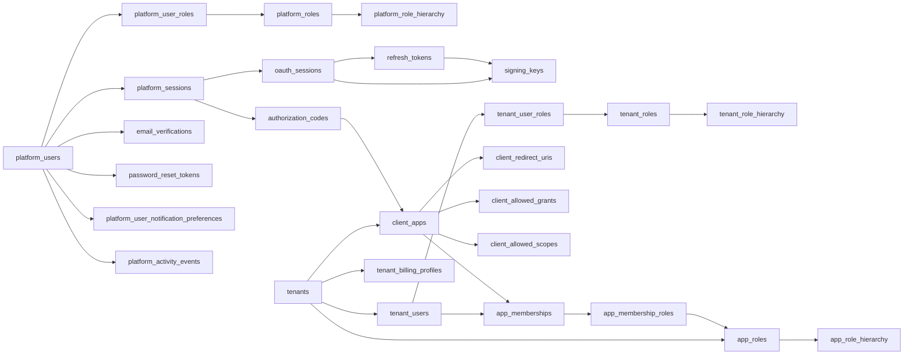
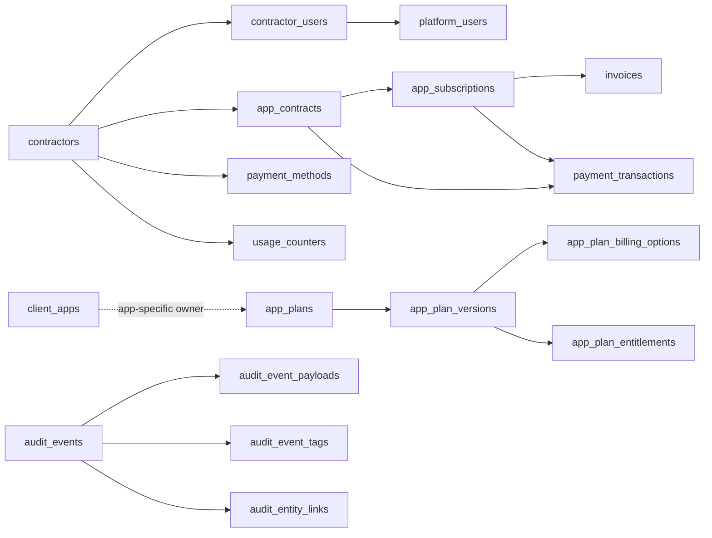

# Database Schema — KeyGo Server

> **Ultima actualizacion:** 2026-04-13  
> **Fuente de verdad fisica:** `keygo-supabase/src/main/resources/db/migration/`  
> **Baseline activo:** `V1`–`V20`  
> **Referencia de versiones:** `../08-reference/data/migrations.md`

**Proposito:** documentar la vista canonica del schema PostgreSQL vigente. Este documento describe el
modelo actual del baseline activo; no reemplaza a Flyway ni al DDL real.

---

## Regla operativa

- Cuando haya conflicto entre codigo, documentacion y schema, **manda Flyway**.
- El baseline activo del remake es `V1`–`V20`.
- El arbol `keygo-supabase/src/main/resources/db/backup_20260409_v33/` es **historico** y no debe
  usarse como schema vigente.
- `hibernate.ddl-auto=validate` debe seguir siendo coherente con este baseline.

---

## Vista general del baseline

| Rango | Dominio | Resultado principal |
|---|---|---|
| `V1`–`V2` | Foundation | bootstrap del schema, extensiones `pgcrypto` y `citext`, helpers `update_updated_at_column()` y `prevent_append_only_mutation()` |
| `V3`–`V10` | Identity / Access / OAuth | `platform_users`, `tenants`, `tenant_users`, `client_apps`, RBAC separado, `platform_sessions`, `oauth_sessions`, tokens, signing keys, verificacion y actividad |
| `V11` | Audit | ledger append-only `audit_events` con payloads, tags y entity links |
| `V12`–`V15` | Billing | `contractors`, catalogo comercial, contratos, suscripciones, pagos, facturas, uso y perfiles fiscales |
| `V16`–`V17` | Seeds | datos de desarrollo y caso base de billing |
| `V18`–`V20` | Billing evolution | onboarding de contratos y catalogo publico de plataforma |

---

## Entity Relationship Diagram (ERD)

### Identity, tenants, apps and auth

### Billing and audit

---

## Canonical model by domain

### 1. Foundation

`V2__foundation.sql` instala:

- `pgcrypto` para UUIDs y utilidades criptograficas;
- `citext` para comparaciones case-insensitive;
- `update_updated_at_column()` para tablas mutables con `updated_at`;
- `prevent_append_only_mutation()` para tablas append-only del ledger de auditoria.

### 2. Identity root and tenant participation

| Tabla | Rol | Claves / invariantes |
|---|---|---|
| `platform_users` | identidad global raiz | email unico case-insensitive; `password_hash`; estado global `PENDING`, `ACTIVE`, `SUSPENDED`, `RESET_PASSWORD`, `DELETED` |
| `tenants` | frontera organizacional | `slug` unico; `contractor_id` opcional; `is_internal_reserved` distingue tenants reservados |
| `tenant_users` | pertenencia de un `platform_user` a un tenant | unique `(tenant_id, platform_user_id)`; `local_username` opcional por tenant; no persiste credenciales globales |

**Regla:** una persona se modela primero en `platform_users`; su participacion en tenants vive en
`tenant_users`.

### 3. OAuth clients and app access

| Tabla | Rol | Claves / invariantes |
|---|---|---|
| `client_apps` | cliente OAuth/OIDC poseido por un tenant | `id` es PK tecnica; `client_id` es identificador publico globalmente unico; `type` = `PUBLIC` o `CONFIDENTIAL` |
| `client_redirect_uris` | allowlist exacta de redirects | unique `(client_app_id, uri)`; wildcard prohibido |
| `client_allowed_grants` | grants habilitados por app | unique `(client_app_id, grant_type)` |
| `client_allowed_scopes` | scopes habilitados por app | unique `(client_app_id, scope)` |
| `app_memberships` | acceso de un `tenant_user` a una app del mismo tenant | unique `(tenant_user_id, client_app_id)`; FK compuesta con tenant para impedir cruces invalidos |
| `app_membership_roles` | roles de app asignados a una membership | PK `(membership_id, role_id)` y FK compuesta por app |

**Regla:** el acceso a aplicaciones se modela con `app_memberships`, no con `tenant_users`
directamente.

### 4. RBAC in three scopes

#### Platform RBAC

- `platform_roles`
- `platform_role_hierarchy`
- `platform_user_roles`

`platform_user_roles.scope_type` distingue `GLOBAL`, `CONTRACTOR` y `TENANT`. Los campos
`contractor_id` y `tenant_id` se validan con esa semantica.

#### Tenant RBAC

- `tenant_roles`
- `tenant_role_hierarchy`
- `tenant_user_roles`

La integridad se mantiene con FKs compuestas por tenant, evitando asignaciones cross-tenant.

#### App RBAC

- `app_roles`
- `app_role_hierarchy`
- `app_membership_roles`

Los roles de app viven aislados del RBAC de plataforma y tenant. Todas las asignaciones dependen del
`client_app_id` tecnico, no del `client_id` protocolario.

#### Jerarquias

Las tres jerarquias usan una forma de arbol simple:

- un solo padre por hijo;
- sin ciclos;
- profundidad maxima de cinco niveles;
- validacion en trigger.

### 5. Sessions, OAuth artifacts and keys

| Tabla | Rol | Invariantes destacadas |
|---|---|---|
| `platform_sessions` | sesion global de cuenta | pertenece a `platform_user`; status `ACTIVE`, `TERMINATED`, `EXPIRED`; registra device, UA e IP |
| `signing_keys` | claves JWK/JWT | `kid` unico y publico; `tenant_id = NULL` implica clave global de plataforma |
| `oauth_sessions` | sesion contextual tenant/app | referencia `platform_session`, `platform_user`, `tenant`, `tenant_user?`, `client_app`, `signing_key?`; trigger valida contexto exacto |
| `authorization_codes` | auth codes hashados | validan `platform_session`, `platform_user`, `tenant`, `tenant_user?`, `client_app` y `redirect_uri` existente |
| `refresh_tokens` | refresh tokens hashados | trigger exige match exacto con el contexto de `oauth_sessions`; soporta reemplazo via `replaced_by_id` |

**Reglas clave:**

- `platform_sessions` y `oauth_sessions` reemplazan al viejo `sessions`;
- `client_apps.id` es la FK interna en artefactos OAuth; `client_id` se resuelve antes, en el borde
  protocolario;
- `tenant_user_id` puede ser `NULL` en `oauth_sessions` solo para clientes internos en tenants
  reservados;
- `authorization_codes` y `refresh_tokens` nunca persisten el secreto plano.

### 6. Identity support and account activity

| Tabla | Rol |
|---|---|
| `email_verifications` | codigos de verificacion de email por `platform_user` |
| `password_reset_tokens` | tokens hashados para forgot/recover password |
| `platform_user_notification_preferences` | preferencias globales de notificaciones por cuenta |
| `platform_activity_events` | feed de actividad autoconsultable de la cuenta global |

Estas tablas pertenecen al contexto de identidad global y no a un tenant especifico.

### 7. Audit ledger

| Tabla | Rol | Invariantes |
|---|---|---|
| `audit_events` | ledger principal | append-only; puede referenciar actor de plataforma, actor tenant, contractor, tenant, app y sesiones |
| `audit_event_payloads` | payloads pesados | 1:1 con `audit_events`; append-only |
| `audit_event_tags` | tags de busqueda | PK compuesta `(audit_event_id, tag)`; append-only |
| `audit_entity_links` | links a entidades impactadas | append-only |

**Regla:** la auditoria no se actualiza ni se borra. Los triggers de `prevent_append_only_mutation()`
bloquean `UPDATE` y `DELETE`.

### 8. Billing anchored in contractors

#### Billing root

| Tabla | Rol |
|---|---|
| `contractors` | entidad comercial propietaria de contratos y suscripciones |
| `contractor_users` | administradores del contractor basados en `platform_users` |

#### Catalog

| Tabla | Rol |
|---|---|
| `app_plans` | planes comerciales por app o de plataforma (`client_app_id = NULL`) |
| `app_plan_versions` | snapshot versionado del plan |
| `app_plan_billing_options` | periodos de cobro (`MONTHLY`, `YEARLY`, `ONE_TIME`) |
| `app_plan_entitlements` | limites/flags/rates por version |

#### Contracts and recurring state

| Tabla | Rol |
|---|---|
| `app_contracts` | lifecycle comercial antes y durante activacion, incluyendo snapshot de contacto/empresa del onboarding |
| `contract_email_verifications` | verificacion de email del onboarding del contrato antes de provisionar cuenta |
| `app_subscriptions` | estado recurrente activo o pendiente por contractor y app |

#### Billing execution

| Tabla | Rol |
|---|---|
| `payment_transactions` | cobros y reembolsos |
| `invoices` | snapshots historicos de facturacion |
| `usage_counters` | medicion por contractor, app, metrica y periodo |
| `tenant_billing_profiles` | perfil fiscal por tenant |
| `payment_methods` | referencias externas de pago; nunca PAN/CVV |

**Regla:** el billing se ancla en `contractors` y `platform_users`, no en identidades locales del
tenant `keygo`. `app_plans.client_app_id = NULL` representa catalogo publico de plataforma ofrecido
por KeyGo; cuando viene informado, el plan pertenece a una `client_app` especifica. En onboarding,
`app_contracts.contractor_id` puede permanecer `NULL` hasta que el pago mock/aprobado dispare el
provisionamiento final; la validación de email previa vive en `contract_email_verifications`, y los
datos capturados del formulario (`contractor_first_name`, `contractor_last_name`, `company_*`)
quedan persistidos como snapshot del proceso.

---

## Cross-cutting invariants

1. **Identidad raiz:** `platform_users` es la identidad global; `tenant_users` solo representa
   pertenencia.
2. **Acceso a apps:** un usuario accede a una app mediante `app_memberships`; los roles de app se
   asignan a la membership, no al `tenant_user` directamente.
3. **PK tecnica vs identificador funcional:**
   - PK tecnica: `id`
   - funcional/protocolario: `platform_users.email`, `tenants.slug`, `client_apps.client_id`,
     `signing_keys.kid`
4. **Integridad multitenant fuerte:** varias tablas usan FKs compuestas para impedir relaciones
   cross-tenant o cross-app.
5. **Jerarquias validadas en DB:** platform, tenant y app RBAC usan triggers para ciclos y profundidad.
6. **Auth artefacts hashados:** `authorization_codes`, `refresh_tokens` y `password_reset_tokens`
   almacenan hashes o tokens opacos, nunca secretos planos.
7. **Auditoria append-only:** `audit_events` y sus tablas satelite no admiten update/delete.
8. **Estados explicitos:** el baseline actual usa enums de negocio y constraints `CHECK`; no depende
   del patron de soft delete generico del schema anterior.

---

## Integrity and indexing highlights

| Area | Mecanismo |
|---|---|
| Mutabilidad controlada | `update_updated_at_column()` en tablas mutables |
| Append-only | `prevent_append_only_mutation()` en auditoria |
| Identidad global | `platform_users.email` unico con `CITEXT` |
| Tenant participation | unique `(tenant_id, platform_user_id)` en `tenant_users` |
| Client resolution | `client_apps.client_id` globalmente unico |
| Integridad por tenant/app | FKs compuestas en `app_roles`, `app_memberships`, `oauth_sessions`, `authorization_codes`, `refresh_tokens` |
| Jerarquias RBAC | triggers de validacion de ciclo y profundidad |
| Refresh token rotation | `replaced_by_id` y validacion contra `oauth_sessions` |
| Facturacion activa | uniques parciales para contrato/suscripcion activos por contractor y app |
| Default records | uniques parciales para `tenant_billing_profiles.is_default` y `payment_methods.is_default` |

---

## Seeds, analytics and related artifacts

- Las migraciones `V16` y `V17` agregan datos de desarrollo y billing de ejemplo sobre este schema.
- `keygo-run/src/main/resources/data-local.sql` debe mantenerse alineado con este baseline.
- Las consultas analiticas viven fuera de Flyway en `sql/platform_dashboards/`, pero deben consultar
  las tablas vigentes de este documento.

---

## Referencias

| Aspecto | Ubicacion |
|---|---|
| Flyway baseline activo | `keygo-supabase/src/main/resources/db/migration/` |
| Inventario de migraciones | `../08-reference/data/migrations.md` |
| Referencia de datos | `../08-reference/data/` |
| RFC del refactor DDL | `../04-decisions/rfcs/ddl-full-refactor/README.md` |
