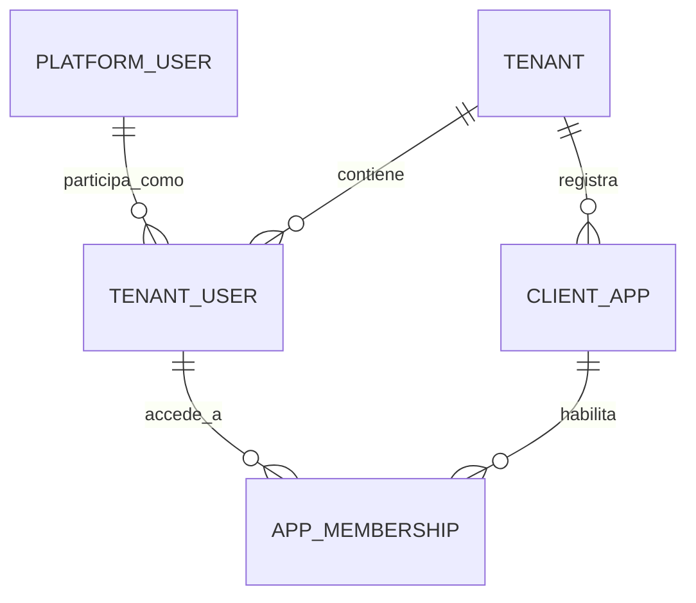
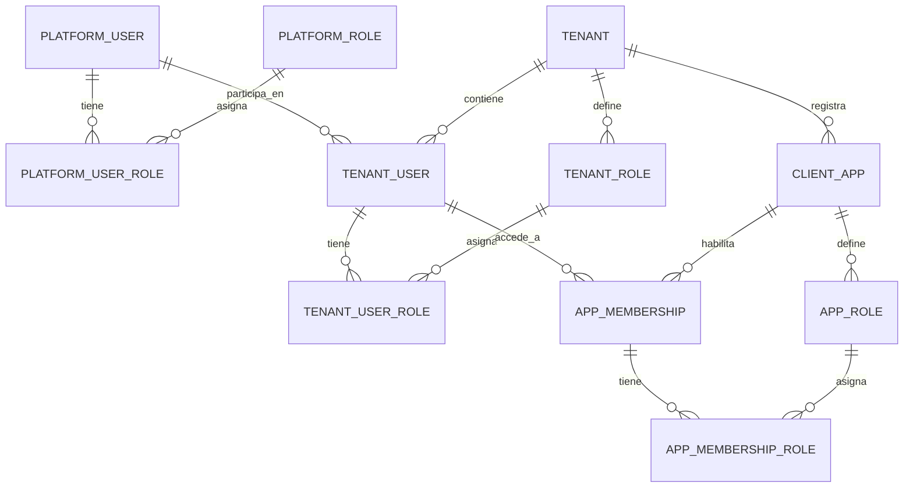
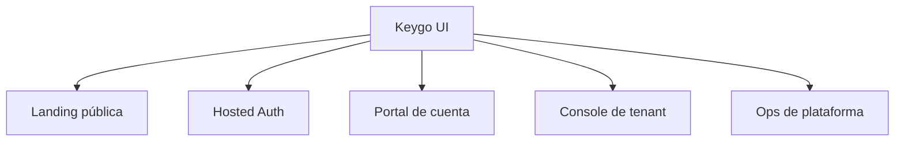
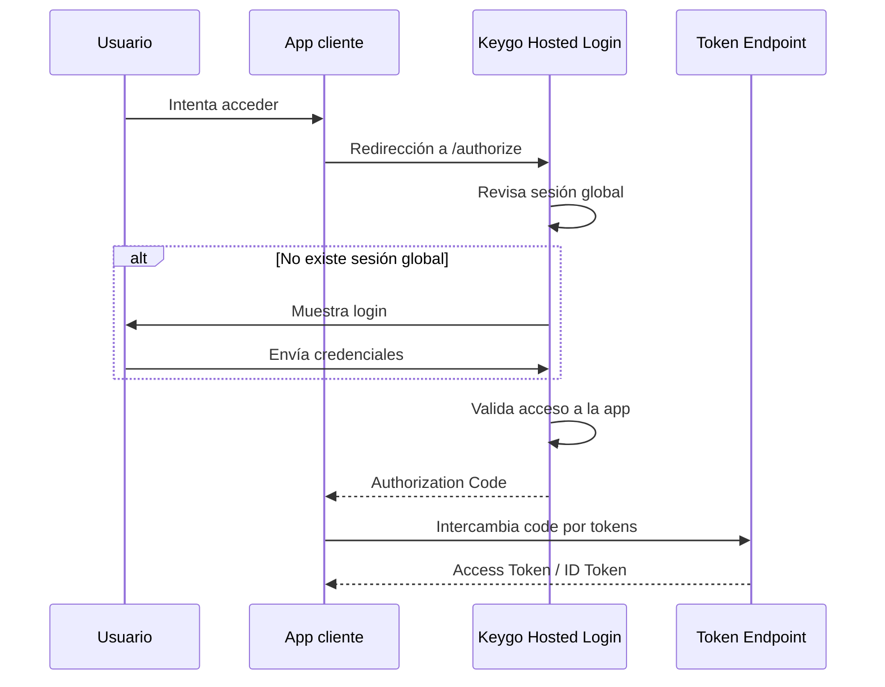
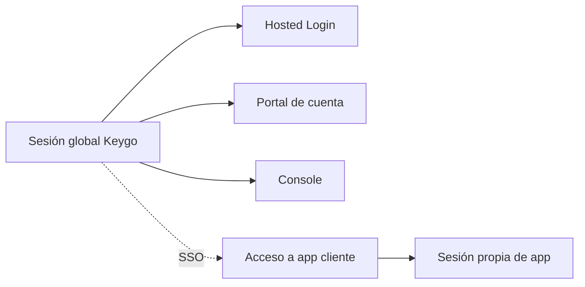
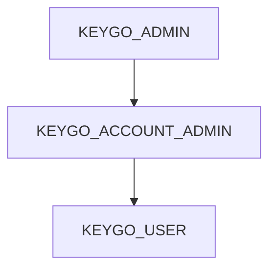
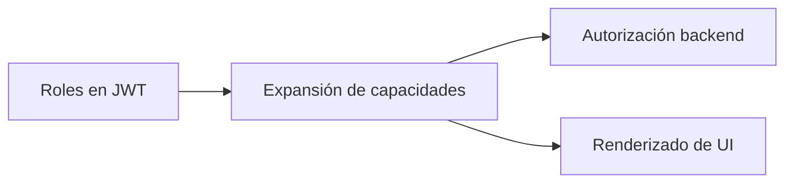
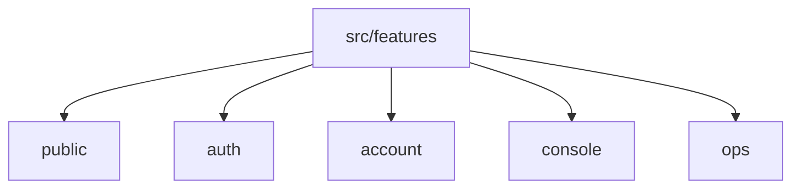
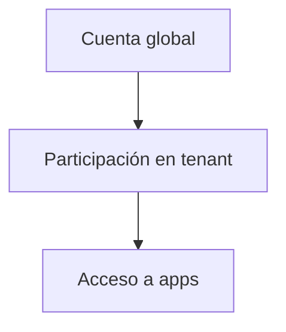

# 08. Diagramas Mermaid

## Objetivo

Reunir los diagramas base para explicar la propuesta en presentaciones, README técnicos o documentación interna.

---

## 1. Modelo conceptual principal

### Lectura
- `PLATFORM_USER` es la cuenta global.
- `TENANT_USER` representa la presencia dentro de una organización.
- `APP_MEMBERSHIP` representa el acceso efectivo a una app.

---

## 2. Modelo extendido con roles por ámbito

### Lectura
Este diagrama muestra tres ámbitos de autorización:

1. plataforma,
2. tenant,
3. app.

---

## 3. Superficies lógicas de `keygo-ui`

### Lectura
Hay una sola superficie web física, pero varias superficies lógicas claramente diferenciadas.

---

## 4. Flujo de autenticación con hosted login

### Lectura
La app cliente delega autenticación en Keygo.  
La sesión global puede reutilizarse, pero la app mantiene su propio contexto de acceso.

---

## 5. Separación entre sesión global y sesión de app

### Lectura
La sesión global habilita SSO, pero no reemplaza la sesión local de cada app.

---

## 6. Jerarquía de roles de Keygo

### Lectura
El rol superior implica las capacidades del inferior.

---

## 7. Relación recomendada entre roles y autorización

### Lectura
El JWT entrega información compacta; la expansión a permisos efectivos se resuelve fuera del token.

---

## 8. Arquitectura conceptual de frontend

### Lectura
Una única aplicación frontend puede mantenerse ordenada si se estructura por superficies funcionales.

---

## 9. Idea central resumida

### Lectura
Esta es la síntesis del modelo recomendado para Keygo.
