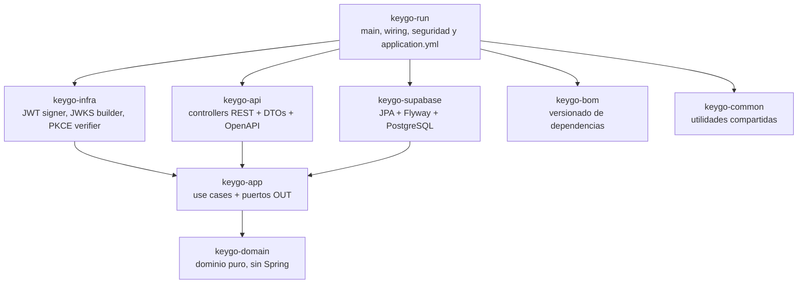

# AGENTS - KeyGo Server

Quick-start técnico para agentes que trabajan en este repositorio.

## Leer primero

1. [ai-context.md](ai-context.md)
2. [architecture.md](../03-architecture/architecture.md)
3. [doc/README.md](../README.md)
4. [agent-operations.md](agent-operations.md)

## Mapa de módulos



## Reglas críticas

- Las respuestas del agente deben limitarse a lo justo: concisas, precisas y sin verborrea innecesaria. Esta regla aplica siempre a la conversación, no al código.
- Nunca agregar Spring a `keygo-domain`.
- No cruzar dependencias hacia atrás entre módulos.
- En dominio, todo campo nullable debe exponerse como `Optional<T>`.
- Al crear un agregado nuevo persistible, no setear `id`.
- Jackson 3 usa `tools.jackson.databind.*`.
- Evitar `Object`, `Object[]` y genéricos crudos con `Object` en firmas públicas o internas relevantes; preferir contratos tipados explícitos (`record`, DTO, proyección, VO o interfaz dedicada).
- Los atributos JSON de request body y response body deben escribirse en `snake_case`, no `camelCase`.
- Entidades JPA: `@Getter @Setter @Builder`, nunca `@Data`.
- Columnas JSONB: `@JdbcTypeCode(SqlTypes.JSON)` + `@Column(columnDefinition = "jsonb")`.
- **Identificadores primarios en parámetros:** controllers y orchestradores **nunca** reciben nombres, códigos u otras referencias como parámetros para relacionar entidades. El controller obtiene el `id` primario (UUID/Long/UserId/etc) consultando el puerto correspondiente **antes** de pasar al use case/orquestador. Esto mantiene la separación entre presentación y aplicación clara.
- `context-path` activo: `/keygo-server`.
- Seguridad admin vigente: `Authorization: Bearer <jwt>`.
- Diagramas: Mermaid primero, PlantUML si Mermaid no aplica, ASCII solo como último recurso.

## Comandos útiles

```bash
./mvnw clean package
./mvnw test
./mvnw verify
./mvnw -pl keygo-api test
./mvnw spring-boot:run -pl keygo-run
```

## Fuentes de verdad

| Tema | Documento |
|---|---|
| Política documental | [doc/README.md](../README.md) |
| Arquitectura | [03-architecture/architecture.md](../03-architecture/architecture.md) |
| Seguridad de rutas | [03-architecture/security/bootstrap-filter.md](../03-architecture/security/bootstrap-filter.md) |
| Flujos OAuth2/OIDC | [02-functional/authentication-flow.md](../02-functional/authentication-flow.md) |
| Migraciones | [08-reference/data/migrations.md](../08-reference/data/migrations.md) |
| Modelo de datos | [08-reference/data/data-model.md](../08-reference/data/data-model.md) |
| Relaciones de entidades | [08-reference/data/entity-relationships.md](../08-reference/data/entity-relationships.md) |
| Setup local | [07-operations/environment-setup.md](../07-operations/environment-setup.md) |
| Guía frontend | [02-functional/frontend/frontend-developer-guide.md](../02-functional/frontend/frontend-developer-guide.md) |
| Roadmap | [05-delivery/roadmap.md](../05-delivery/roadmap.md) |

## Mantenimiento documental obligatorio

- Nuevo endpoint o cambio de contrato: OpenAPI + Postman + guía frontend.
- Nueva migración Flyway: `migrations.md` + `data-model.md` + `entity-relationships.md`.
- Cambio de reglas o quick-start para agentes: `agents.md` + `agents-change-log.md`.
- Inconsistencia doc-código: crear `inconsistencies/INC-NNN-<slug>.md` y registrar en `inconsistencies/README.md`.
- Todo feedback UI↔Backend marcado como `🟢 Resuelto` debe referenciar la tarea, RFC o artefacto que materializó la resolución.
- **Uso de `/plan`:** siempre documentar antes de cerrar el modo plan, sin esperar instrucción explícita:
  1. Crear `doc/09-ai/tasks/T-NNN-<slug>.md` con: requisito, solución propuesta, pasos ordenados con estado `PENDING`/`APPLIED` y guía de verificación.
  2. Registrar la nueva entrada en `doc/09-ai/tasks/README.md`.
- No toda iniciativa nace como tarea: si el cambio entra directo por RFC, el RFC pasa a ser el artefacto primario del flujo general y debe llevar además su control interno de fases y subtareas.
- En un RFC, las subtareas se revisan y se marcan como aprobadas, replanteadas o descartadas; solo cuando el conjunto implementable queda aprobado se ejecutan una a una.
- En un RFC, la implementacion secuencial de subtareas ocurre bajo `🔵 En desarrollo`, y la verificacion del RFC completo ocurre bajo `🔄 En revisión`.
- `🛂 Control de cambio` tambien puede aplicar a RFC o tarea en `🔄 En revisión` aunque no haya dependencia UI.
- Si un RFC vuelve a `🔵 En desarrollo`, el ajuste debe asociarse a una fase/subtarea existente o crear una nueva dentro de la fase correcta; no se agrega como cambio suelto.
- Si una tarea `🧩 Pendiente integración UI` recibe cambios pedidos desde UI o negocio, primero pasa a `🛂 Control de cambio`; solo con aprobación explícita vuelve a `🔵 En desarrollo`.
- Si el control de cambio no se aprueba para la tarea original, esta se cierra y el nuevo alcance se registra como tarea derivada nueva.
