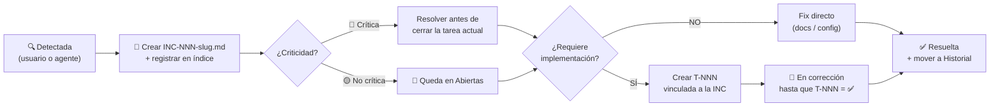

# Inconsistencias — KeyGo Server

Registro de inconsistencias detectadas entre documentación, código, DB y especificaciones.
Cada inconsistencia tiene su propio archivo `INC-NNN-<slug>.md` o `INC-HNN-<slug>.md`.
Ciclo de vida definido en [workflow.md](../workflow.md#ciclo-de-vida-de-inconsistencias-inc-nnn).

---

## Índice — Abiertas

| Archivo | Nombre | Categoría | Criticidad | Estado | Detectada | Tarea |
|---|---|---|---|---|---|---|
| [INC-001-signing-key-duplicate.md](INC-001-signing-key-duplicate.md) | Dos inicializadores de signing key en perfil `supabase` | Configuración | 🟡 No crítica | 🔲 Pendiente | 2026-03-25 | — |

---

## Historial — Resueltas

| Archivo | Nombre | Categoría | Criticidad | Detectada | Resuelta |
|---|---|---|---|---|---|
| [INC-H01-data-model-v1-v9.md](INC-H01-data-model-v1-v9.md) | 12 inconsistencias modelo de datos V1–V9 | Datos | 🔴 Crítica | 2026-03-22 | 2026-03-22 |
| [INC-H02-membership-tables-singular.md](INC-H02-membership-tables-singular.md) | Tablas V7 en singular — requirió migración V10 | Datos | 🔴 Crítica | 2026-03-22 | 2026-03-22 |
| [INC-H03-multitenant-login-flow.md](INC-H03-multitenant-login-flow.md) | Flujo login multi-tenant ambiguo en AUTH_FLOW y FRONTEND_GUIDE | Docs | 🟡 No crítica | 2026-03-26 | 2026-03-26 |
| [INC-H06-billing-b2c-tenant-id.md](INC-H06-billing-b2c-tenant-id.md) | Flujo B2C billing crea TenantUser sin tenant_id | Datos | 🔴 Crítica | 2026-03-30 | 2026-03-30 |
| [INC-H04-admin-bearer-auth-docs.md](INC-H04-admin-bearer-auth-docs.md) | Docs admin describen X-KEYGO-ADMIN como mecanismo vigente | Seguridad | 🟡 No crítica | 2026-03-26 | 2026-04-09 |
| [INC-H05-doc-drift-reorganization.md](INC-H05-doc-drift-reorganization.md) | Drift documental post-reorganización | Docs | 🟡 No crítica | 2026-04-09 | 2026-04-09 |

---

## Proceso



---

## Reglas para el agente

1. **Al detectar una inconsistencia** → crear `INC-NNN-<slug>.md` y registrar en la tabla **Abiertas**.
2. **Inconsistencias 🔴 Críticas** → deben resolverse antes de cerrar la tarea que las detectó.
3. **Inconsistencias 🟡 No críticas** → pueden quedar pendientes; priorizar en `roadmap.md` si el esfuerzo es alto.
4. **Al corregir directamente** → actualizar `**Estado:** ✅ Resuelta`, completar `**Resuelta:** YYYY-MM-DD`, mover la fila de Abiertas a Historial.
5. **Si la INC tiene tarea vinculada** → al cerrar la tarea (`✅ Completada`), marcar automáticamente la INC como resuelta y actualizar el Historial.
6. **Para convertir una INC en tarea** → usar prompt definido en `workflow.md`.

### Categorías válidas

| Categoría | Alcance |
|---|---|
| `datos` | Modelo de datos, schema DB, migraciones Flyway |
| `api` | Contratos REST, DTOs, endpoints documentados vs. implementados |
| `tests` | Tests que no reflejan el comportamiento real |
| `seguridad` | Filtros, autenticación, autorización |
| `configuración` | application.yml, properties, valores incorrectos |
| `docs` | Documentación desactualizada o contradictoria |

---

## Plantilla para nuevos archivos

```markdown
# INC-NNN — <título corto>

**Categoría:** datos / api / tests / seguridad / configuración / docs
**Criticidad:** 🔴 Crítica | 🟡 No crítica
**Estado:** 🔲 Pendiente | 🔧 En corrección | ✅ Resuelta
**Detectada:** YYYY-MM-DD
**Resuelta:** YYYY-MM-DD | —
**Tarea relacionada:** [T-NNN](../tasks/T-NNN-slug.md) | —

## Descripción

<qué está mal y dónde se detectó>

## Esperado vs. Real

| | Esperado | Real |
|---|---|---|
| ... | ... | ... |

## Corrección

_Pendiente._

<!-- Al corregir: describir qué se hizo y en qué commit/tarea -->
```
