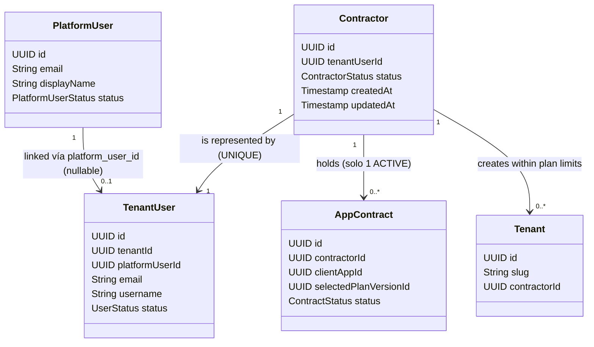
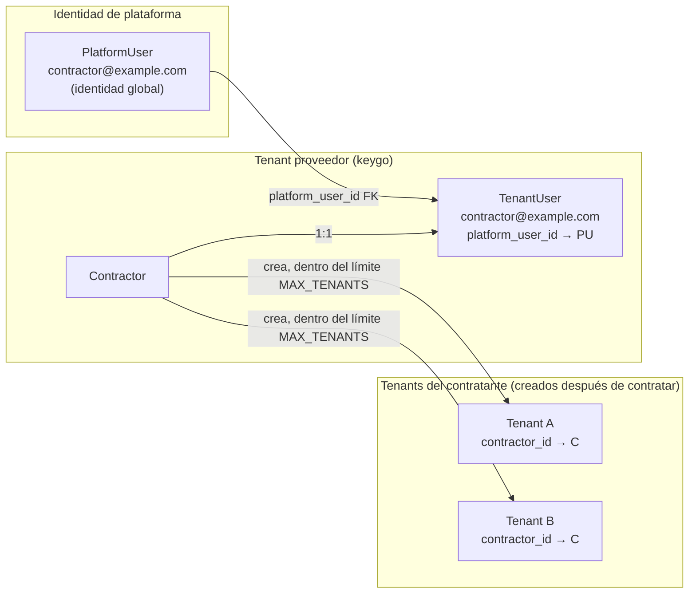
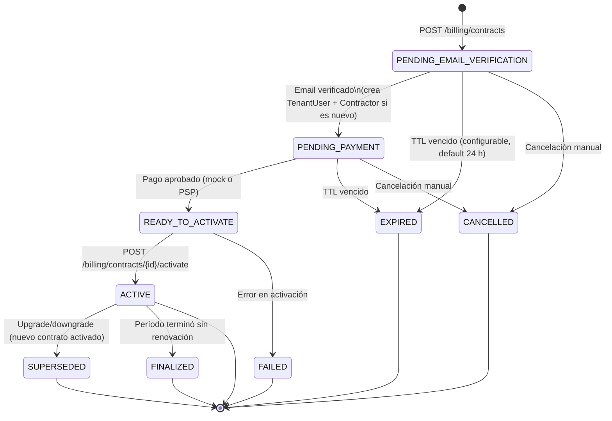
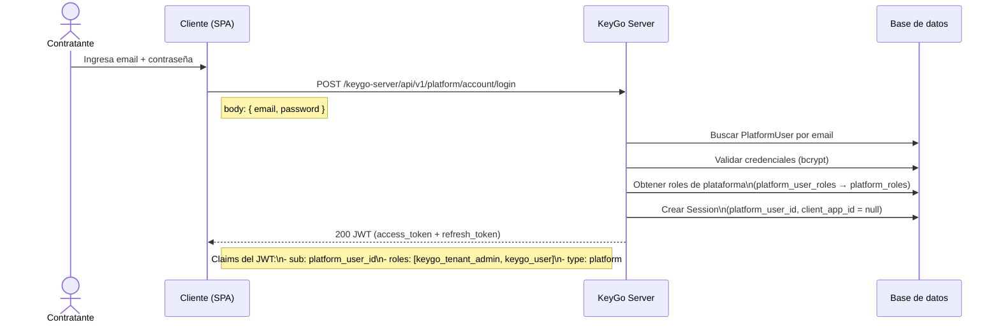
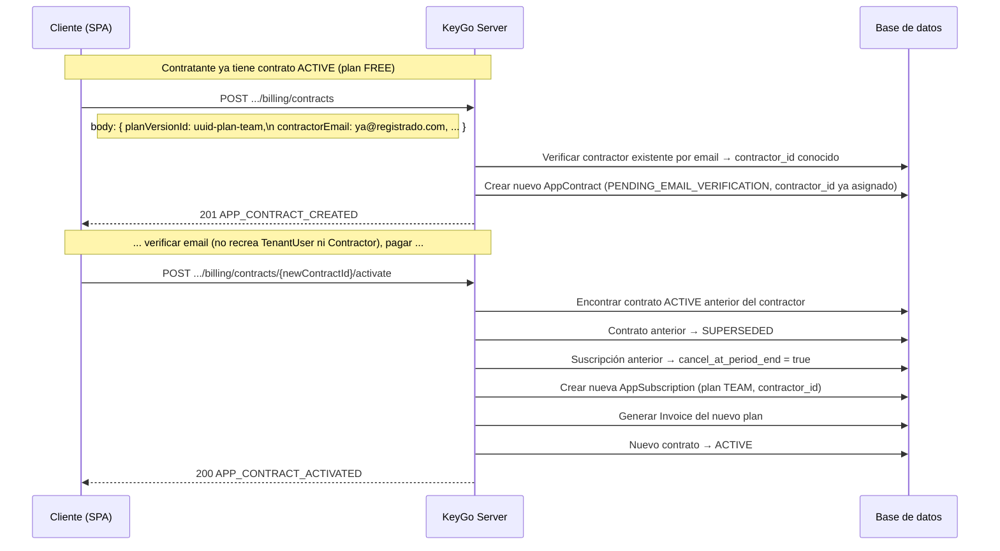
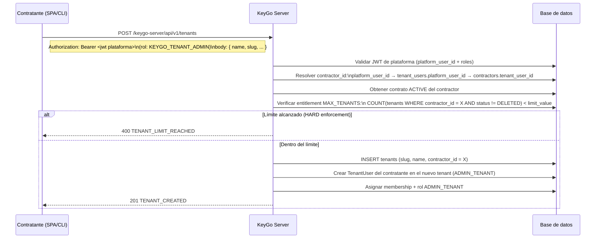
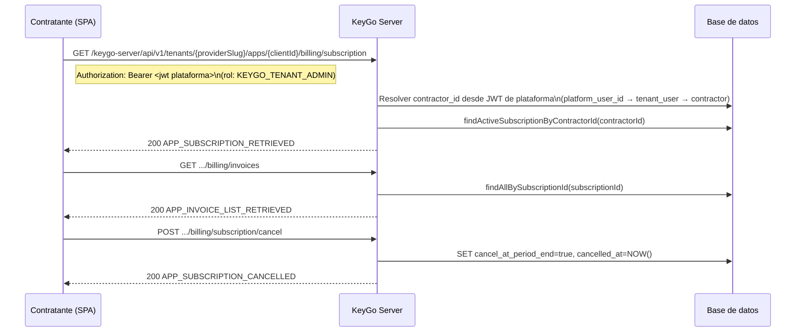
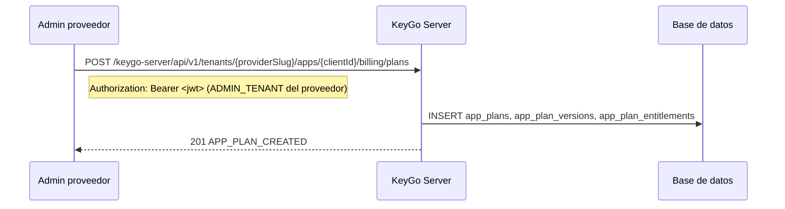
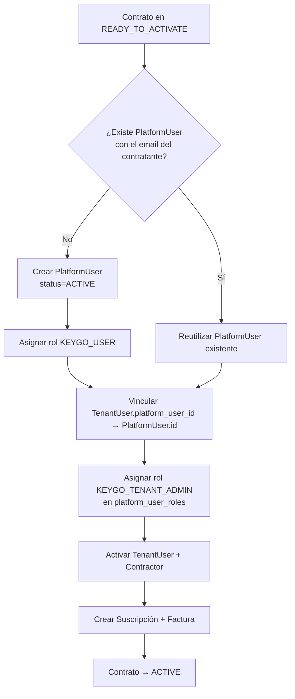

# Flujo de Contratación y Billing — KeyGo Server

> Guía de referencia del modelo de billing: concepto de contratante, ciclo de vida de contratos,
> gestión de tenants por plan y flujos de activación / upgrade.
>
> Fecha de actualización: **2026-04-07** | Estado: **Modelo v2 — rediseño estructural + identidad de plataforma**

---

## Tabla de contenidos

1. [Resumen de cambios respecto al modelo anterior](#resumen-de-cambios-respecto-al-modelo-anterior)
2. [Concepto central: El Contratante](#concepto-central-el-contratante)
3. [Modelo de suscriptor único](#modelo-de-suscriptor-único)
4. [Estados del contrato](#estados-del-contrato)
5. [Restricción: un solo contrato vigente](#restricción-un-solo-contrato-vigente)
6. [Seguridad de endpoints](#seguridad-de-endpoints)
7. [Autenticación del contratante](#autenticación-del-contratante)
8. [Flujo principal: primer contrato (onboarding)](#flujo-principal-primer-contrato-onboarding)
9. [Flujo de upgrade de plan](#flujo-de-upgrade-de-plan)
10. [Creación de tenants por el contratante](#creación-de-tenants-por-el-contratante)
11. [Gestión post-activación](#gestión-post-activación)
12. [Gestión de catálogo (admin proveedor)](#gestión-de-catálogo-admin-proveedor)
13. [Referencia de endpoints](#referencia-de-endpoints)
14. [Cuerpos de request y respuesta](#cuerpos-de-request-y-respuesta)
15. [Manejo de errores](#manejo-de-errores)
16. [Integración con identidad de plataforma (Fase I)](#integración-con-identidad-de-plataforma-fase-i)
17. [Referencias cruzadas](#referencias-cruzadas)

---

## Resumen de cambios respecto al modelo anterior

| Aspecto | Modelo anterior (v1) | Modelo actual (v2) |
|---|---|---|
| Suscriptor B2C | `TenantUser` creado sin `tenant_id` ❌ | `Contractor` con `TenantUser` en el tenant proveedor ✅ |
| Suscriptor B2B | Tenant + TenantUser auto-creados al activar | Contractor crea sus propios tenants después ✅ |
| Creación de tenants | Automática al activar contrato | Manual: el contratante los crea dentro del límite del plan |
| `company_slug` | Necesario para crear el tenant B2B | Eliminado: ya no hay auto-creación de tenant |
| Contrato vigente | Sin control de "uno vigente por persona" | Constraint: solo 1 contrato en estado `ACTIVE` por contratante |
| Upgrade de plan | No modelado | Nuevo contrato → cierra el anterior (`SUPERSEDED`) |
| `subscriber_type` en contrato | `TENANT` (B2B) o `TENANT_USER` (B2C) | Eliminado del contrato; se conserva en el plan para compatibilidad |
| Relación suscripción ↔ suscriptor | `subscriber_tenant_id` / `subscriber_tenant_user_id` | `contractor_id` en `app_subscriptions` |
| Tenants creados por contratante | Sin FK al contratante | `tenants.contractor_id` → `contractors.id` |

---

## Concepto central: El Contratante



Un **contratante** (`contractor`) es la persona física o entidad que firma contratos con la plataforma KeyGo.

La **cadena completa de identidad** del contratante es:

```
PlatformUser (identidad global KeyGo)
  ↓ platform_user_id FK (nullable)
TenantUser (cuenta en tenant proveedor, p. ej. "keygo")
  ↓ tenant_user_id FK (UNIQUE)
Contractor (entidad de billing)
  ↓ contractor_id FK
AppContract → AppSubscription → Invoice
```

| Propiedad | Descripción |
|---|---|
| Identidad global | Tiene un registro `PlatformUser` en `platform_users` (identidad global KeyGo). |
| Identidad en tenant proveedor | Tiene una cuenta (`TenantUser`) **en el tenant del proveedor** (p. ej. tenant `keygo`), vinculada al `PlatformUser` vía `platform_user_id`. |
| Relación 1:1 | `contractors.tenant_user_id` tiene constraint `UNIQUE` — un contratante, una cuenta. |
| Historial de contratos | Puede tener muchos contratos a lo largo del tiempo. |
| Contrato vigente | **Solo uno puede estar `ACTIVE`** en cualquier momento. |
| Tenants propios | Crea sus propios tenants **después** de contratar, dentro del límite `MAX_TENANTS` del plan. |
| Upgrade | Nuevo contrato → el anterior pasa a `SUPERSEDED`. |
| Roles de plataforma | Al activar su primer contrato recibe automáticamente el rol `KEYGO_TENANT_ADMIN` en `platform_user_roles`. |

### Relación con el tenant proveedor



El contratante es principalmente un **usuario de plataforma** (`PlatformUser`) con identidad global en KeyGo. Esta identidad global se vincula a un `TenantUser` en el **tenant del proveedor** (quien ofrece los planes, p. ej. `keygo`) mediante la FK `platform_user_id`. El registro `Contractor` (entidad de billing) se vincula 1:1 a ese `TenantUser`.

Cuando el contratante crea sus propios tenants, el sistema automáticamente le crea un `TenantUser` en cada uno con rol `ADMIN_TENANT`.

---

## Modelo de suscriptor único

El modelo v2 elimina la distinción B2B/B2C a nivel de contrato. **El suscriptor es siempre el `Contractor`**.

La distinción `subscriber_type` se conserva **solo en los planes** (`app_plans.subscriber_type`) para validar compatibilidad plan-contrato:

| `subscriber_type` en el plan | Interpretación |
|---|---|
| `TENANT` | Plan orientado a quien gestiona múltiples organizaciones/tenants (dev, agencias). Mayor límite `MAX_TENANTS`. |
| `TENANT_USER` | Plan orientado a usuarios finales con uso personal. Menor límite `MAX_TENANTS`. |

---

## Estados del contrato



| Estado | Significado | Terminal |
|---|---|---|
| `PENDING_EMAIL_VERIFICATION` | Estado inicial; esperando verificación de email | No |
| `PENDING_PAYMENT` | Email verificado; esperando pago | No |
| `READY_TO_ACTIVATE` | Pago aprobado; listo para activar | No |
| `ACTIVE` | Contrato vigente; suscripción activa | No (puede pasar a SUPERSEDED/FINALIZED) |
| `SUPERSEDED` | Reemplazado por un nuevo contrato (upgrade/downgrade) | Sí |
| `FINALIZED` | Terminado al fin del período sin renovación | Sí |
| `EXPIRED` | TTL superado antes de activar | Sí |
| `CANCELLED` | Cancelado manualmente | Sí |
| `FAILED` | Error irrecuperable en activación | Sí |

---

## Restricción: un solo contrato vigente

Un `Contractor` **puede tener máximo 1 contrato en estado `ACTIVE`** en cualquier momento.

| Nivel | Mecanismo |
|---|---|
| Aplicación | El use case de activación verifica inexistencia de contrato `ACTIVE` para ese `contractor_id`. |
| Base de datos | Índice único parcial: `UNIQUE(contractor_id) WHERE status = 'ACTIVE'` en `app_contracts`. |

Al hacer un upgrade:
1. Se crea un nuevo contrato `PENDING_EMAIL_VERIFICATION`.
2. Al activar el nuevo contrato, el use case mueve el anterior `ACTIVE` → `SUPERSEDED`.
3. La suscripción anterior se marca `cancel_at_period_end = true`.
4. El nuevo contrato pasa a `ACTIVE` y crea una nueva `AppSubscription`.

---

## Seguridad de endpoints

| Endpoint | Auth requerida |
|---|---|
| `GET /billing/catalog` | **Público** |
| `GET /billing/catalog/{planCode}` | **Público** |
| `POST /billing/contracts` | **Público** — autoservicio |
| `GET /billing/contracts/{contractId}` | **Público** — por UUID |
| `POST /billing/contracts/{contractId}/verify-email` | **Público** |
| `POST /billing/contracts/{contractId}/mock-approve-payment` | **Público (solo DEV)** — `keygo.billing.mock-payment-enabled=true` |
| `POST /billing/contracts/{contractId}/activate` | **Público** — contrato en `READY_TO_ACTIVATE` |
| `GET /billing/subscription` | **Bearer plataforma** — rol `KEYGO_TENANT_ADMIN` o `ADMIN_TENANT` |
| `POST /billing/subscription/cancel` | **Bearer plataforma** — rol `KEYGO_TENANT_ADMIN` o `ADMIN_TENANT` |
| `GET /billing/invoices` | **Bearer plataforma** — rol `KEYGO_TENANT_ADMIN` o `ADMIN_TENANT` |
| `POST /billing/plans` | **Bearer plataforma** — rol `KEYGO_ADMIN` o `ADMIN_TENANT` del proveedor |

> Los sufijos `/billing/catalog` y `/billing/contracts` están declarados como públicos en `KeyGoBootstrapProperties`.

> **Nota:** Los endpoints protegidos de billing validan roles de plataforma (`KEYGO_TENANT_ADMIN`, `KEYGO_ADMIN`)
> provenientes del JWT emitido por el flujo de autenticación de plataforma. Los roles legacy (`ADMIN_TENANT`, `ADMIN`)
> se aceptan por compatibilidad con `@PreAuthorize("hasAnyRole('ADMIN','ADMIN_TENANT','KEYGO_ADMIN','KEYGO_TENANT_ADMIN')")`.

---

## Autenticación del contratante

El contratante se autentica mediante el **flujo de autenticación de plataforma**, independiente del flujo OAuth2 multi-tenant.

### Flujo de autenticación



### JWT del contratante

El JWT emitido por `POST /api/v1/platform/account/login` contiene:

| Claim | Valor | Descripción |
|---|---|---|
| `sub` | UUID del `PlatformUser` | Identifica al usuario de plataforma |
| `email` | Email del `PlatformUser` | Email global del contratante |
| `roles` | `["keygo_tenant_admin", "keygo_user"]` | Roles de plataforma asignados |
| `type` | `"platform"` | Distingue de tokens OAuth2 multi-tenant |

### Diferencia con OAuth2 multi-tenant

| Aspecto | Auth plataforma (billing) | OAuth2 multi-tenant (apps) |
|---|---|---|
| Endpoint de login | `POST /api/v1/platform/account/login` | `POST /api/v1/tenants/{slug}/account/login` |
| Identidad | `PlatformUser` (global) | `TenantUser` (scoped a un tenant) |
| Roles en JWT | Roles de plataforma: `keygo_user`, `keygo_tenant_admin`, `keygo_admin` | Roles de app: `admin_tenant`, `user_tenant`, etc. |
| Sesión | `sessions.platform_user_id` = UUID, `client_app_id` = null | `sessions.tenant_user_id` = UUID, `client_app_id` = UUID |
| Uso principal | Gestión de billing, contratos, suscripciones | Acceso a aplicaciones multi-tenant |

### Roles de plataforma relevantes para billing

| Rol | Asignación | Permisos de billing |
|---|---|---|
| `KEYGO_USER` | Automático al crear `PlatformUser` | Consultar catálogo (público), iniciar contrato |
| `KEYGO_TENANT_ADMIN` | Automático al activar primer contrato | Gestionar suscripción, facturas, crear tenants, cancelar suscripción |
| `KEYGO_ADMIN` | Solo asignación manual | Gestión completa de catálogo, planes, dashboard admin |

> **⚠️ Importante:** El contratante **no** usa el flujo OAuth2 de un tenant (`/tenants/{slug}/oauth2/authorize`)
> para acceder a funcionalidades de billing. Usa exclusivamente el flujo de plataforma.

---

## Flujo principal: primer contrato (onboarding)

```mermaid
sequenceDiagram
    actor U as Contratante (browser)
    participant C as Cliente (SPA)
    participant K as KeyGo Server
    participant DB as Base de datos
    participant EMAIL as SMTP

    Note over C,K: Paso 1 — Explorar catálogo (público)
    C->>K: GET /keygo-server/api/v1/tenants/{providerSlug}/apps/{clientId}/billing/catalog
    K->>DB: SELECT app_plans JOIN app_plan_versions WHERE is_public=true AND status=ACTIVE
    K-->>C: 200 APP_PLAN_CATALOG_RETRIEVED

    Note over U,C: Paso 2 — Selección de plan
    U->>C: Elige plan → planVersionId = uuid-v1

    Note over U,C: Paso 3 — Datos del contratante
    U->>C: Nombre, apellido, email, datos de facturación opcionales
    C->>K: POST /keygo-server/api/v1/tenants/{providerSlug}/apps/{clientId}/billing/contracts
    Note right of C: body: { planVersionId, billingPeriod,\n contractorEmail, contractorFirstName, contractorLastName,\n companyName?, companyTaxId?, companyAddress? }
    K->>DB: Validar planVersionId; crear AppContract PENDING_EMAIL_VERIFICATION
    K->>DB: Guardar verification_code + verification_code_expires_at (default 30 min)
    K->>EMAIL: Enviar código 6 dígitos a contractorEmail
    K-->>C: 201 APP_CONTRACT_CREATED (contractId, status=PENDING_EMAIL_VERIFICATION)

    Note over U,C: Paso 4 — Verificación de email
    U->>C: Ingresa código del email
    C->>K: POST .../billing/contracts/{contractId}/verify-email
    Note right of C: body: { "code": "123456" }
    K->>DB: Validar código + expiración
    K->>DB: Si contratante nuevo: Crear TenantUser en tenant proveedor (status=PENDING)\n              + Crear Contractor (status=PENDING)\n              + SET contracts.contractor_id
    K->>DB: SET email_verified_at = NOW(), status = PENDING_PAYMENT
    K-->>C: 200 APP_CONTRACT_EMAIL_VERIFIED

    Note over C,K: Paso 5 — Pago
    C->>K: POST .../billing/contracts/{contractId}/mock-approve-payment
    K->>DB: INSERT payment_transactions (status=APPROVED)
    K->>DB: Contrato → READY_TO_ACTIVATE
    K-->>C: 200 APP_CONTRACT_PAYMENT_APPROVED

    Note over C,K: Paso 6 — Activación
    C->>K: POST .../billing/contracts/{contractId}/activate
    K->>DB: Verificar: contractor sin contrato ACTIVE previo
    K->>DB: Crear/vincular PlatformUser (si no existe) con email del contratante
    K->>DB: Asignar rol KEYGO_USER al PlatformUser (si es nuevo)
    K->>DB: Vincular TenantUser.platform_user_id → PlatformUser.id
    K->>DB: TenantUser.status → ACTIVE
    K->>DB: Contractor.status → ACTIVE
    K->>DB: Asignar rol KEYGO_TENANT_ADMIN al PlatformUser (platform_user_roles)
    K->>DB: Crear AppSubscription (status=ACTIVE, contractor_id)
    K->>DB: Generar Invoice (status=ISSUED, INV-XXXXXXXX)
    K->>DB: Contrato → ACTIVE
    K-->>C: 200 APP_CONTRACT_ACTIVATED (contractId, contractorId, subscriptionId)
```

### Qué crea la activación (onboarding inicial)

| Entidad | Descripción |
|---|---|
| `PlatformUser` | Identidad global del contratante en KeyGo. Si no existía, se crea con `status → ACTIVE`. Si ya existía (upgrade), se reutiliza. |
| `platform_user_roles` | Asignación del rol `KEYGO_TENANT_ADMIN` al `PlatformUser` (además del `KEYGO_USER` base). |
| `TenantUser` (tenant proveedor) | Cuenta del contratante. `status → ACTIVE`. Se vincula al `PlatformUser` vía `platform_user_id`. |
| `Contractor` | Entidad de billing 1:1 con el `TenantUser`. `status → ACTIVE`. |
| `AppSubscription` | Suscripción activa vinculada a `contractor_id`. |
| `Invoice` | Primera factura del período. |

> ⚠️ **Lo que ya NO ocurre al activar:** no se crea ningún `Tenant` propio del contratante.
> Los tenants los crea el contratante mismo posteriormente, dentro del límite `MAX_TENANTS` del plan.
>
> 🚧 **Fase I (pendiente de implementación):** La creación automática de `PlatformUser` y la asignación
> de `KEYGO_TENANT_ADMIN` durante la activación del contrato es el **comportamiento objetivo** documentado
> aquí. La implementación actual puede no incluir estos pasos aún. Ver sección
> [Integración con identidad de plataforma (Fase I)](#integración-con-identidad-de-plataforma-fase-i).

---

## Flujo de upgrade de plan



> El contratante puede iniciar el nuevo contrato con un contrato `ACTIVE` previo. La restricción
> "un solo ACTIVE" se aplica **al momento de activar** el nuevo contrato.

---

## Creación de tenants por el contratante

Una vez con contrato `ACTIVE`, el contratante crea tenants usando el endpoint estándar de tenants.



| Regla | Descripción |
|---|---|
| Entitlement | `MAX_TENANTS` en `app_plan_entitlements` define el límite numérico. |
| Conteo | `COUNT(*) FROM tenants WHERE contractor_id = :contractorId AND status != 'DELETED'` |
| Sin contrato activo | Si el contratante no tiene contrato `ACTIVE`, la operación se rechaza. |
| Enforcement `HARD` | Rechaza la operación con `400 TENANT_LIMIT_REACHED`. |
| Enforcement `SOFT` | Permite pero emite alerta (log + notificación). |

---

## Gestión post-activación



---

## Gestión de catálogo (admin proveedor)



---

## Referencia de endpoints

> En todos los endpoints, `{slug}` y `{clientId}` referencian el **tenant y app del PROVEEDOR**.

| Método | Endpoint (sin context-path) | Auth | ResponseCode OK | Descripción |
|---|---|---|---|---|
| GET | `/api/v1/tenants/{slug}/apps/{clientId}/billing/catalog` | Público | `APP_PLAN_CATALOG_RETRIEVED` | Catálogo público de planes |
| GET | `/api/v1/tenants/{slug}/apps/{clientId}/billing/catalog/{planCode}` | Público | `APP_PLAN_RETRIEVED` | Detalle de un plan |
| POST | `/api/v1/tenants/{slug}/apps/{clientId}/billing/plans` | Bearer ADMIN_TENANT (proveedor) | `APP_PLAN_CREATED` | Crear plan + versión + entitlements |
| POST | `/api/v1/tenants/{slug}/apps/{clientId}/billing/contracts` | Público | `APP_CONTRACT_CREATED` | Iniciar contrato |
| GET | `/api/v1/tenants/{slug}/apps/{clientId}/billing/contracts/{contractId}` | Público | `APP_CONTRACT_RETRIEVED` | Estado del contrato |
| POST | `/api/v1/tenants/{slug}/apps/{clientId}/billing/contracts/{contractId}/verify-email` | Público | `APP_CONTRACT_EMAIL_VERIFIED` | Verificar código → crea TenantUser + Contractor si es nuevo |
| POST | `/api/v1/tenants/{slug}/apps/{clientId}/billing/contracts/{contractId}/mock-approve-payment` | Público (DEV) | `APP_CONTRACT_PAYMENT_APPROVED` | Simular pago |
| POST | `/api/v1/tenants/{slug}/apps/{clientId}/billing/contracts/{contractId}/activate` | Público | `APP_CONTRACT_ACTIVATED` | Activar → suscripción + factura; supercede contrato anterior si lo hay |
| GET | `/api/v1/tenants/{slug}/apps/{clientId}/billing/subscription` | Bearer plataforma (`KEYGO_TENANT_ADMIN`) | `APP_SUBSCRIPTION_RETRIEVED` | Suscripción activa del contratante |
| POST | `/api/v1/tenants/{slug}/apps/{clientId}/billing/subscription/cancel` | Bearer plataforma (`KEYGO_TENANT_ADMIN`) | `APP_SUBSCRIPTION_CANCELLED` | Cancelar al fin del período |
| GET | `/api/v1/tenants/{slug}/apps/{clientId}/billing/invoices` | Bearer plataforma (`KEYGO_TENANT_ADMIN`) | `APP_INVOICE_LIST_RETRIEVED` | Lista de facturas |

---

## Cuerpos de request y respuesta

### POST `/billing/contracts` — request

```json
{
  "planVersionId": "uuid-version-plan",
  "billingPeriod": "MONTHLY",
  "contractorEmail": "carlos@ejemplo.com",
  "contractorFirstName": "Carlos",
  "contractorLastName": "Martínez",
  "companyName": "Acme Corp",
  "companyTaxId": "RFC123456XYZ",
  "companyAddress": "Av. Reforma 300, CDMX"
}
```

> `companyName`, `companyTaxId`, `companyAddress` son opcionales (datos de facturación).  
> Los campos `companySlug` y `subscriberType` **ya no existen** — los tenants se crean después,
> no al contratar; y el tipo de suscriptor se infiere del plan.

### POST `/billing/contracts` — respuesta exitosa

```json
{
  "date": "2026-03-30T10:00:00Z",
  "success": {
    "code": "APP_CONTRACT_CREATED",
    "message": "App contract created successfully"
  },
  "data": {
    "id": "contract-uuid",
    "clientAppId": "app-uuid",
    "selectedPlanVersionId": "version-uuid",
    "billingPeriod": "MONTHLY",
    "status": "PENDING_EMAIL_VERIFICATION",
    "contractorEmail": "carlos@ejemplo.com",
    "contractorFirstName": "Carlos",
    "contractorLastName": "Martínez",
    "emailVerified": false,
    "paymentVerified": false,
    "expiresAt": "2026-03-31T10:00:00Z",
    "createdAt": "2026-03-30T10:00:00Z"
  }
}
```

### POST `/billing/contracts/{id}/verify-email` — request

```json
{ "code": "123456" }
```

### POST `/billing/contracts/{id}/activate` — respuesta exitosa

```json
{
  "date": "2026-03-30T10:10:00Z",
  "success": {
    "code": "APP_CONTRACT_ACTIVATED",
    "message": "App contract activated successfully"
  },
  "data": {
    "id": "contract-uuid",
    "status": "ACTIVE",
    "contractorId": "contractor-uuid",
    "subscriptionId": "subscription-uuid",
    "activatedAt": "2026-03-30T10:10:00Z"
  }
}
```

### GET `/billing/subscription` — respuesta

```json
{
  "date": "2026-03-30T10:00:00Z",
  "success": {
    "code": "APP_SUBSCRIPTION_RETRIEVED",
    "message": "App subscription retrieved successfully"
  },
  "data": {
    "id": "subscription-uuid",
    "clientAppId": "app-uuid",
    "appPlanVersionId": "version-uuid",
    "contractorId": "contractor-uuid",
    "status": "ACTIVE",
    "currentPeriodStart": "2026-03-30T10:00:00Z",
    "currentPeriodEnd": "2026-04-30T10:00:00Z",
    "cancelAtPeriodEnd": false,
    "nextBillingAt": "2026-04-30T10:00:00Z",
    "autoRenew": true,
    "createdAt": "2026-03-30T10:00:00Z"
  }
}
```

### GET `/billing/invoices` — respuesta

```json
{
  "date": "2026-03-30T10:00:00Z",
  "success": {
    "code": "APP_INVOICE_LIST_RETRIEVED",
    "message": "App invoice list retrieved successfully"
  },
  "data": [
    {
      "id": "invoice-uuid",
      "subscriptionId": "subscription-uuid",
      "invoiceNumber": "INV-A1B2C3D4",
      "status": "ISSUED",
      "issueDate": "2026-03-30",
      "dueDate": "2026-04-29",
      "periodStart": "2026-03-30",
      "periodEnd": "2026-04-30",
      "currency": "MXN",
      "subtotal": 299.00,
      "taxAmount": 0.00,
      "total": 299.00,
      "billingNameSnapshot": "Carlos Martínez",
      "planVersionSnapshot": "1.0",
      "pdfUrl": null,
      "createdAt": "2026-03-30T10:00:00Z"
    }
  ]
}
```

---

## Manejo de errores

| `failure.code` | HTTP | Causa típica |
|---|---|---|
| `APP_PLAN_NOT_FOUND` | 404 | Plan no existe o no es público |
| `APP_PLAN_VERSION_NOT_FOUND` | 404 | `planVersionId` inválido o deprecado |
| `APP_CONTRACT_NOT_FOUND` | 404 | `contractId` no existe |
| `APP_CONTRACT_NOT_READY` | 400 | Contrato no está en `READY_TO_ACTIVATE` |
| `APP_CONTRACT_ALREADY_ACTIVE` | 409 | El contratante ya tiene un contrato `ACTIVE`; debe hacer upgrade |
| `APP_SUBSCRIPTION_NOT_FOUND` | 404 | Sin suscripción activa para ese contratante + app |
| `APP_INVOICE_NOT_FOUND` | 404 | Factura no encontrada |
| `TENANT_LIMIT_REACHED` | 400 | `MAX_TENANTS` alcanzado según entitlement del plan activo |
| `INVALID_INPUT` | 400 | Datos inválidos (email, planVersionId, etc.) |
| `RESOURCE_NOT_FOUND` | 404 | Tenant proveedor o ClientApp no existe |
| `AUTHENTICATION_REQUIRED` | 401 | Bearer token faltante o inválido |
| `INSUFFICIENT_PERMISSIONS` | 403 | Rol insuficiente |
| `OPERATION_FAILED` | 500 | Error interno en activación |

---

## Integración con identidad de plataforma (Fase I)

> 🚧 **Estado: Pendiente de implementación.** Esta sección documenta el comportamiento objetivo
> una vez completada la Fase I del RFC `restructure-multitenant`.

### Cambios planificados en `ActivateAppContractUseCase`

La activación del contrato (`POST /billing/contracts/{id}/activate`) incorporará los siguientes pasos adicionales:



### Cambios planificados en `CreateAppContractUseCase`

Al crear el contrato (`POST /billing/contracts`), se auto-creará un `PlatformUser` si no existe uno con el email proporcionado:

| Paso | Acción | Condición |
|---|---|---|
| 1 | Buscar `PlatformUser` por `contractorEmail` | Siempre |
| 2 | Crear `PlatformUser` con `status=PENDING` | Solo si no existe |
| 3 | Asignar rol `KEYGO_USER` | Solo si se creó nuevo |
| 4 | Continuar flujo normal de contrato | Siempre |

### Modelo de sesión para billing

Las sesiones de plataforma (billing) se distinguen de las sesiones OAuth2 multi-tenant:

| Campo en `sessions` | Sesión de plataforma (billing) | Sesión OAuth2 (multi-tenant) |
|---|---|---|
| `platform_user_id` | UUID del `PlatformUser` | `null` |
| `tenant_user_id` | `null` | UUID del `TenantUser` |
| `client_app_id` | `null` (contexto global) | UUID de la `ClientApp` |
| `tenant_id` | `null` o tenant proveedor | UUID del tenant |

### Puertos nuevos requeridos

| Puerto | Módulo | Descripción |
|---|---|---|
| `FindPlatformUserPort` | `keygo-app` | Buscar `PlatformUser` por email o ID |
| `SavePlatformUserPort` | `keygo-app` | Crear/actualizar `PlatformUser` |
| `AssignPlatformRolePort` | `keygo-app` | Asignar rol de plataforma a un `PlatformUser` |

### Compatibilidad hacia atrás

- Los endpoints protegidos de billing aceptan **tanto** roles de plataforma (`KEYGO_TENANT_ADMIN`) como roles legacy (`ADMIN_TENANT`) durante la transición.
- El `@PreAuthorize` usa `hasAnyRole('ADMIN','ADMIN_TENANT','KEYGO_ADMIN','KEYGO_TENANT_ADMIN')` para garantizar compatibilidad.
- Una vez completada la migración a Fase I, los roles legacy se deprecarán gradualmente.

---

## Referencias cruzadas

| Documento | Ruta | Relevancia |
|---|---|---|
| Flujo de Autenticación | `docs/api/AUTH_FLOW.md` | Prerequisito para endpoints con Bearer |
| Identidad de Plataforma | RFC `restructure-multitenant` | Modelo `platform_users` + `platform_roles` + flujo de auth de plataforma |
| Guía Frontend | `docs/keygo-ui/FRONTEND_DEVELOPER_GUIDE.md` | Sección §14.3 — inventario de endpoints de billing |
| Modelo de datos | `docs/data/DATA_MODEL.md` | Diccionario de `contractors`, `app_contracts`, `app_subscriptions`, `platform_users` |
| Relaciones E/R | `docs/data/ENTITY_RELATIONSHIPS.md` | Contexto 9 — diagrama de billing |
| Migraciones | `docs/data/MIGRATIONS.md` | V19+ — schema de billing v2 |
| Colección Postman | `docs/postman/KeyGo-Server.postman_collection.json` | Requests con scripts de test |


