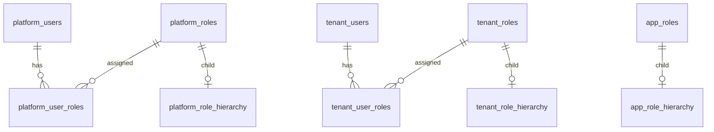
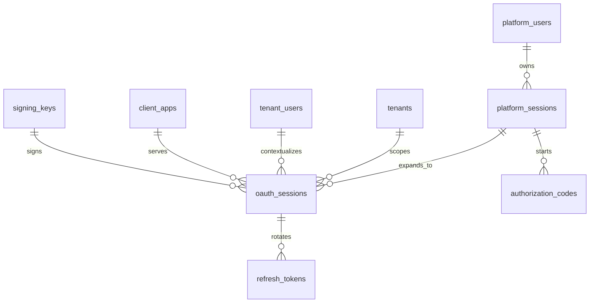
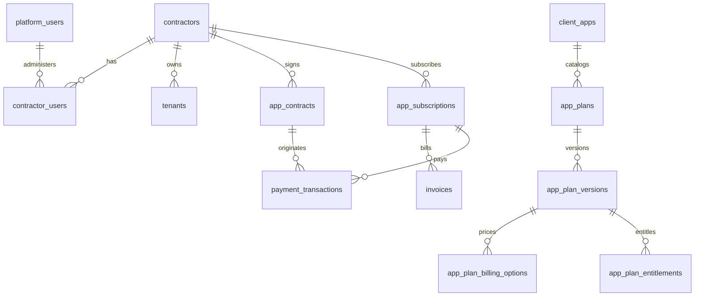
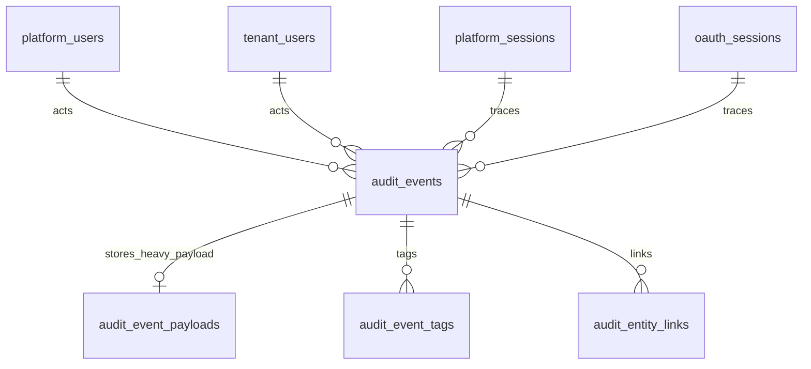

# Entity Relationships (Consolidated)

⚠️ **This documentation has been consolidated.**

**See:** [`../design/DATABASE_SCHEMA.md`](../design/DATABASE_SCHEMA.md#entity-relationship-diagram-erd) for complete Entity-Relationship Diagram and table relationships.

This file is maintained for backward compatibility only. All updates are made to the canonical `DATABASE_SCHEMA.md`.
    app_roles ||--o{ app_membership_roles : assigned
```

Invariantes:

- `app_memberships` usa `(tenant_user_id, tenant_id)` y `(client_app_id, tenant_id)`
- `app_membership_roles` usa `(membership_id, client_app_id)` y `(role_id, client_app_id)`
- no se permiten relaciones cross-tenant ni cross-app

### RBAC separado por ámbito



Notas:

- plataforma, tenant y app no comparten tablas de roles
- las jerarquías son árboles simples con profundidad máxima cinco

### Sesiones y OAuth



Invariantes:

- `oauth_sessions.platform_user_id` debe coincidir con `platform_sessions.platform_user_id`
- `tenant_user_id` solo puede ser null en apps internas de tenants reservados
- `authorization_codes.redirect_uri` debe existir para la app
- `refresh_tokens` hereda el contexto exacto de `oauth_sessions`

### Billing



Claves:

- `contractors` depende de identidad global
- `tenant_billing_profiles` es por tenant
- `payment_methods` es por contractor

### Auditoría



Características:

- `audit_events` es append-only
- payloads grandes salen de la tabla principal
- el modelo soporta agregación y drill-down

## Eventos auditables modelados

Categorías esperadas en reporting:

- `AUTH`
- `PLATFORM`
- `TENANT_ADMIN`
- `APP_ADMIN`
- `BILLING`
- `SECURITY`
- `UI`

Tipos esperados:

- `LOGIN_SUCCESS`
- `LOGIN_FAILURE`
- `PASSWORD_RESET_REQUESTED`
- `PASSWORD_RESET_COMPLETED`
- `SESSION_TERMINATED`
- `ACCESS_DENIED`
- `CONTRACT_ACTIVATED`
- `PAYMENT_APPROVED`
- `INVOICE_OVERDUE`
- `SCREEN_VIEWED`

## Relación con dashboards

La explotación analítica del modelo no vive en Flyway.

Ubicación:

- `docs/sql/platform_dashboards/common/`
- `docs/sql/platform_dashboards/keygo_admin/`
- `docs/sql/platform_dashboards/keygo_account_admin/`
- `docs/sql/platform_dashboards/keygo_user/`

Regla:

- cada agregado relevante tiene una query detalle asociada
