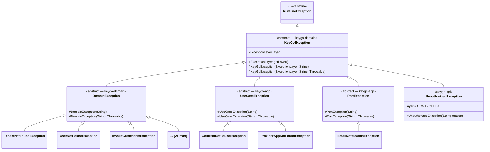

# EXCEPTION_HIERARCHY (Archived)

⚠️ **This document is archived and no longer maintained.**

Error handling is now documented in:
- [`./api/ERROR_CATALOG.md`](./api/ERROR_CATALOG.md) — Complete error code reference
- [`./patterns/PATTERNS.md`](./patterns/PATTERNS.md) — Design patterns section

Archived in: [`../archive/deprecated/`](../archive/deprecated/)
|-------------------------------|---------------------------------------------------------------------------------------------------------------------------------------------------|
| Sin jerarquía de capas        | Las 24 excepciones de dominio extienden `RuntimeException` directamente — no hay distinción de capa                                               |
| Use cases usan genéricas      | `VerifyContractEmailUseCase`, entre otros, lanza `IllegalArgumentException` / `IllegalStateException` — sin tipo ni capa                          |
| `ErrorData` sin campo `layer` | El consumer no puede saber si el error viene de dominio, un use case o un puerto sin leer la excepción técnica (solo disponible en `local`/`dev`) |
| Mensajes inconsistentes       | Algunas excepciones reciben el mensaje completo desde el caller; otras lo construyen internamente — sin estándar                                  |

---

## 2. Jerarquía propuesta



---

## 3. Enum `ExceptionLayer`

**Módulo:** `keygo-domain`
**Ruta:** `src/main/java/io/cmartinezs/keygo/domain/shared/exception/ExceptionLayer.java`

```java
public enum ExceptionLayer {
    DOMAIN,      // Reglas de negocio puras — keygo-domain
    USE_CASE,    // Orquestación de casos de uso — keygo-app
    PORT,        // Fallo de puerto de salida (repo, email, etc.) — keygo-app
    CONTROLLER   // Capa HTTP / entrada — keygo-api
}
```

---

## 4. Clases base

### 4.1 `KeyGoException` (raíz)

**Módulo:** `keygo-domain`
**Ruta:** `src/main/java/io/cmartinezs/keygo/domain/shared/exception/KeyGoException.java`

```java
public abstract class KeyGoException extends RuntimeException {

    private final ExceptionLayer layer;

    protected KeyGoException(ExceptionLayer layer, String message) {
        super(message);
        this.layer = layer;
    }

    protected KeyGoException(ExceptionLayer layer, String message, Throwable cause) {
        super(message, cause);
        this.layer = layer;
    }

    public ExceptionLayer getLayer() {
        return layer;
    }
}
```

### 4.2 `DomainException`

**Módulo:** `keygo-domain`
**Ruta:** `src/main/java/io/cmartinezs/keygo/domain/shared/exception/DomainException.java`

```java
public abstract class DomainException extends KeyGoException {

    protected DomainException(String message) {
        super(ExceptionLayer.DOMAIN, message);
    }

    protected DomainException(String message, Throwable cause) {
        super(ExceptionLayer.DOMAIN, message, cause);
    }
}
```

### 4.3 `UseCaseException`

**Módulo:** `keygo-app`
**Ruta:** `src/main/java/io/cmartinezs/keygo/app/shared/exception/UseCaseException.java`

```java
public abstract class UseCaseException extends KeyGoException {

    protected UseCaseException(String message) {
        super(ExceptionLayer.USE_CASE, message);
    }

    protected UseCaseException(String message, Throwable cause) {
        super(ExceptionLayer.USE_CASE, message, cause);
    }
}
```

### 4.4 `PortException`

**Módulo:** `keygo-app`
**Ruta:** `src/main/java/io/cmartinezs/keygo/app/shared/exception/PortException.java`

```java
public abstract class PortException extends KeyGoException {

    protected PortException(String message) {
        super(ExceptionLayer.PORT, message);
    }

    protected PortException(String message, Throwable cause) {
        super(ExceptionLayer.PORT, message, cause);
    }
}
```

### 4.5 `UnauthorizedException` (existente — migrar)

**Módulo:** `keygo-api`
Cambiar `extends RuntimeException` → `extends KeyGoException` con `layer = CONTROLLER`.

---

## 5. Convención de mensajes en el constructor

> **Regla:** el mensaje vive en la excepción, el caller solo pasa valores. Nunca se construye el string desde fuera.

```java
// ✅ Correcto — el caller pasa valores tipados
throw new UserNotFoundException("username", "cmartinez");
// Mensaje generado internamente: "User not found by username: cmartinez"

// ❌ Incorrecto — el caller construye el string
throw new UserNotFoundException("User not found: " + username);
```

### Patrones de constructor

#### Patrón A — `(String field, String value)` → entidades con múltiples campos de búsqueda

```java
public class UserNotFoundException extends DomainException {
    public UserNotFoundException(String field, String value) {
        super("User not found by %s: %s".formatted(field, value));
    }
}
// Uso: new UserNotFoundException("username", "cmartinez")
//      new UserNotFoundException("email", "user@example.com")
```

#### Patrón B — `(String value)` → entidades con un único campo de búsqueda natural

```java
public class TenantNotFoundException extends DomainException {
    public TenantNotFoundException(String slug) {
        super("Tenant not found by slug: %s".formatted(slug));
    }
}
// Uso: new TenantNotFoundException("keygo-platform")
```

#### Patrón C — `(String reason)` → errores de validación o seguridad con razón variable

```java
public class ClientAuthenticationException extends DomainException {
    public ClientAuthenticationException(String reason) {
        super("Client authentication failed: %s".formatted(reason));
    }
}
// Uso: new ClientAuthenticationException("client_secret is incorrect")
```

#### Patrón D — sin parámetros → mensaje fijo y autoexplicativo

```java
public class InvalidCredentialsException extends DomainException {
    public InvalidCredentialsException() {
        super("Invalid credentials provided");
    }
}
// Uso: new InvalidCredentialsException()
```

---

## 6. Inventario de excepciones de dominio (migración)

### 6.1 Dominio `tenant`

| Clase | Patrón | Constructor propuesto | Mensaje generado |
|---|---|---|---|
| `TenantNotFoundException` | B | `(String slug)` | `"Tenant not found by slug: {slug}"` |
| `TenantSuspendedException` | B | `(String slug)` | `"Tenant is suspended: {slug}"` |

### 6.2 Dominio `user`

| Clase | Patrón | Constructor propuesto | Mensaje generado |
|---|---|---|---|
| `UserNotFoundException` | A | `(String field, String value)` | `"User not found by {field}: {value}"` |
| `UserSuspendedException` | B | `(String username)` | `"User account is suspended: {username}"` |
| `UserPendingVerificationException` | B | `(String email)` | `"User pending email verification: {email}"` |
| `DuplicateUserException` | A | `(String field, String value)` ✅ ya existe | `"User already exists with {field}: {value}"` |
| `InvalidCredentialsException` | D | sin params ✅ ya existe | `"Invalid credentials provided"` |
| `EmailVerificationExpiredException` | B | `(String email)` ✅ ya existe | `"Email verification code has expired for: {email}"` |
| `EmailVerificationInvalidException` | B | `(String email)` ✅ ya existe | `"Email verification code is invalid or already used for: {email}"` |
| `EmailVerificationStillActiveException` | B | `(String email)` ✅ ya existe | `"Email verification code is still active for: {email} ..."` |

### 6.3 Dominio `clientapp`

| Clase | Patrón | Constructor propuesto | Mensaje generado |
|---|---|---|---|
| `ClientAppNotFoundException` | B | `(String clientId)` | `"Client app not found by clientId: {clientId}"` |
| `ClientAuthenticationException` | C | `(String reason)` | `"Client authentication failed: {reason}"` |
| `InvalidRedirectUriException` | B | `(String uri)` | `"Invalid redirect URI: {uri}"` |
| `UnsupportedGrantTypeException` | B | `(String grantType)` | `"Unsupported grant type: {grantType}"` |

### 6.4 Dominio `membership`

| Clase | Patrón | Constructor propuesto | Mensaje generado |
|---|---|---|---|
| `MembershipNotFoundException` | A | `(String field, String value)` | `"Membership not found by {field}: {value}"` |
| `MembershipInactiveException` | A | `(String field, String value)` | `"Membership is inactive for {field}: {value}"` |
| `InvalidRoleAssignmentException` | C | `(String reason)` | `"Invalid role assignment: {reason}"` |

### 6.5 Dominio `auth`

| Clase | Patrón | Constructor propuesto | Mensaje generado |
|---|---|---|---|
| `InvalidAuthorizationCodeException` | D | sin params | `"Authorization code is invalid or already used"` |
| `AuthorizationCodeExpiredException` | D | sin params | `"Authorization code has expired"` |
| `InvalidPkceVerificationException` | D | sin params | `"PKCE code verifier does not match the challenge"` |
| `ScopeNotGrantedException` | B | `(String scope)` | `"Scope not granted: {scope}"` |
| `NoActiveSigningKeyException` | D | sin params | `"No active signing key available"` |
| `InvalidRefreshTokenException` | D | sin params | `"Invalid refresh token"` |
| `RefreshTokenExpiredException` | D | sin params | `"Refresh token has expired"` |

---

## 7. Nuevas excepciones en `keygo-app`

### 7.1 Excepciones de use case (`UseCaseException`)

**Ruta base:** `keygo-app/src/main/java/io/cmartinezs/keygo/app/<dominio>/exception/`

| Clase | Módulo | Constructor | Mensaje | Reemplaza |
|---|---|---|---|---|
| `ContractNotFoundException` | `billing/contracting` | `(UUID contractId)` | `"Contract not found by id: {contractId}"` | `IllegalArgumentException` en `VerifyContractEmailUseCase:77` |
| `ProviderAppNotFoundException` | `billing/contracting` | `(UUID clientAppId)` | `"Provider client app not found by id: {clientAppId}"` | `IllegalStateException` en `VerifyContractEmailUseCase:91` |

> Conforme se identifiquen más use cases con `IllegalArgumentException` / `IllegalStateException`, se añadirán entradas aquí.

### 7.2 Excepciones de puerto (`PortException`)

**Ruta base:** `keygo-app/src/main/java/io/cmartinezs/keygo/app/<dominio>/exception/`

| Clase | Puerto | Constructor | Mensaje |
|---|---|---|---|
| `EmailNotificationException` | `EmailNotificationPort` | `(String recipient, String reason)` | `"Failed to send email to {recipient}: {reason}"` |

---

## 8. Cambios en `ErrorData` (`keygo-api`)

### 8.1 Nuevo campo `layer`

```java
@Getter
@Builder
@RegisterReflectionForBinding
@JsonInclude(JsonInclude.Include.NON_NULL)
public class ErrorData {
    private final String code;
    private final String layer;           // "DOMAIN" | "USE_CASE" | "PORT" | "CONTROLLER" | null
    private final ApiErrorOrigin origin;
    private final ApiClientRequestCause clientRequestCause;
    private final String clientMessage;
    private final String detail;          // solo local/dev
    private final String exception;       // solo local/dev
}
```

> `layer` es **siempre visible** (no solo en `local`/`dev`) porque permite al consumer categorizar el error sin exponer detalles internos.

### 8.2 Actualización de `ApiErrorDataFactory`

```java
// Extraer layer desde KeyGoException — siempre presente
String layer = throwable instanceof KeyGoException kge
    ? kge.getLayer().name()
    : null;

// Agregar al builder
builder.layer(layer);
```

---

## 9. Cambios en `GlobalExceptionHandler` (`keygo-api`)

Agregar dos handlers base para capturar use case y port errors no específicos.
Spring usa el handler más específico primero — los handlers existentes no cambian.

```java
// Catch-all para UseCaseException no manejadas específicamente → 500
@ExceptionHandler(UseCaseException.class)
public ResponseEntity<BaseResponse<ErrorData>> handleUseCaseException(UseCaseException ex) {
    log.error("Use case error: {}", ex.getMessage(), ex);
    return error(HttpStatus.INTERNAL_SERVER_ERROR, ResponseCode.OPERATION_FAILED, ex);
}

// Catch-all para PortException → 503 (infraestructura no disponible)
@ExceptionHandler(PortException.class)
public ResponseEntity<BaseResponse<ErrorData>> handlePortException(PortException ex) {
    log.error("Port error: {}", ex.getMessage(), ex);
    return error(HttpStatus.SERVICE_UNAVAILABLE, ResponseCode.EXTERNAL_SERVICE_ERROR, ex);
}
```

> Los handlers específicos de dominio (`TenantNotFoundException`, `UserNotFoundException`, etc.) se agregan individualmente para el `ResponseCode` y HTTP status correcto — exactamente igual que hoy.

---

## 10. Nuevas entradas en `ResponseCode` (`keygo-api`)

```java
// Billing — Contracting errors
CONTRACT_NOT_FOUND("CONTRACT_NOT_FOUND", "Contract not found"),
PROVIDER_APP_NOT_FOUND("PROVIDER_APP_NOT_FOUND", "Provider application not found"),
```

> Se agregarán más entradas conforme se identifiquen use cases adicionales con excepciones genéricas.

---

## 11. Respuesta de error resultante

### Ejemplo: contrato no encontrado (producción)

```json
{
  "date": "2026-04-01T12:00:00Z",
  "failure": {
    "code": "CONTRACT_NOT_FOUND",
    "message": "Contract not found"
  },
  "data": {
    "code": "CONTRACT_NOT_FOUND",
    "layer": "USE_CASE",
    "origin": "CLIENT_REQUEST",
    "clientRequestCause": "CLIENT_TECHNICAL",
    "clientMessage": "No encontramos el recurso solicitado."
  }
}
```

### Ejemplo: usuario no encontrado (entorno local/dev — incluye detalle técnico)

```json
{
  "date": "2026-04-01T12:00:00Z",
  "failure": {
    "code": "RESOURCE_NOT_FOUND",
    "message": "Requested resource was not found"
  },
  "data": {
    "code": "RESOURCE_NOT_FOUND",
    "layer": "DOMAIN",
    "origin": "CLIENT_REQUEST",
    "clientRequestCause": "CLIENT_TECHNICAL",
    "clientMessage": "No encontramos el recurso solicitado.",
    "detail": "User not found by username: cmartinez",
    "exception": "UserNotFoundException"
  }
}
```

### Ejemplo: fallo de puerto de email (producción)

```json
{
  "date": "2026-04-01T12:00:00Z",
  "failure": {
    "code": "EXTERNAL_SERVICE_ERROR",
    "message": "External service error occurred"
  },
  "data": {
    "code": "EXTERNAL_SERVICE_ERROR",
    "layer": "PORT",
    "origin": "SERVER_PROCESSING",
    "clientMessage": "No pudimos completar la solicitud. Intenta de nuevo en unos minutos."
  }
}
```

---

## 12. Fases de implementación

| Fase | Módulo | Archivos nuevos | Archivos modificados | Descripción |
|---|---|---|---|---|
| 1 | `keygo-domain` | 3 | 24 | `ExceptionLayer`, `KeyGoException`, `DomainException`; migrar 24 excepciones existentes |
| 2 | `keygo-app` | 4+ | 1+ | `UseCaseException`, `PortException`; excepciones tipadas; reemplazar generics en use cases |
| 3 | `keygo-api` | 0 | 3 | `ErrorData` + `layer`; `ApiErrorDataFactory` extrae layer; `GlobalExceptionHandler` + 2 handlers base |
| 4 | `keygo-api` | 0 | 1 | `ResponseCode` — nuevas entradas para errores de app |

---

## 13. Checklist de reglas críticas

- [ ] `keygo-domain`: `ExceptionLayer`, `KeyGoException`, `DomainException` son Java puro — sin Spring, sin dependencias internas
- [ ] `keygo-app`: `UseCaseException`, `PortException` extienden `KeyGoException` de `keygo-domain` — no importan `keygo-api`
- [ ] El campo `layer` en `ErrorData` es `String` — no requiere que `keygo-api` exporte el enum
- [ ] El caller **nunca** construye el mensaje de la excepción — solo pasa valores
- [ ] Los handlers específicos existentes en `GlobalExceptionHandler` no se modifican

---

**Última actualización:** 2026-04-01 | **Responsable:** AI Agent
