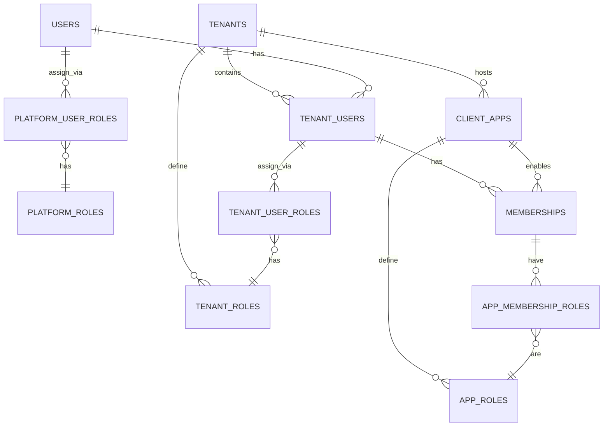

# T-111: Modelo ER Detallado

## Diagrama ER Completo (con Relaciones Existentes)



**Notas:**
- **Líneas NUEVAS (T-111):** `PLATFORM_USER_ROLES`, `TENANT_ROLES`, `TENANT_USER_ROLES` (en color rojo/naranja conceptual)
- **Líneas EXISTENTES (✅):** `MEMBERSHIPS`, `APP_ROLES`, `APP_MEMBERSHIP_ROLES` (funcionan ya)
- **Relaciones entre capas:** `USERS` → `TENANT_USERS` (global → org), `TENANT_USERS` → `MEMBERSHIPS` (org → app)

---

## 1. Tablas Nuevas

### 1.1 `platform_roles`

| Campo | Tipo | Restricciones | Descripción |
|---|---|---|---|
| `id` | UUID | PK, DEFAULT gen_random_uuid() | Identificador único |
| `code` | VARCHAR(50) | UNIQUE NOT NULL | Código único (ej: `KEYGO_ADMIN`) |
| `name` | VARCHAR(255) | NOT NULL | Nombre legible (ej: "Keygo Administrator") |
| `description` | TEXT | | Descripción detallada |
| `created_at` | TIMESTAMPTZ | DEFAULT CURRENT_TIMESTAMP | Audit |
| `updated_at` | TIMESTAMPTZ | DEFAULT CURRENT_TIMESTAMP | Audit |

**Índices:**
- UNIQUE(code)
- DEFAULT ordering: BY created_at DESC

**Roles base que seed debe crear:**
1. `KEYGO_ADMIN` — Administrador global de la plataforma
2. `KEYGO_ACCOUNT_ADMIN` — Administrador de cuenta/tenant
3. `KEYGO_USER` — Usuario final con acceso limitado

---

### 1.2 `platform_user_roles`

| Campo | Tipo | Restricciones | Descripción |
|---|---|---|---|
| `id` | UUID | PK, DEFAULT gen_random_uuid() | Identificador único |
| `user_id` | UUID | FK → users(id), NOT NULL | Usuario global |
| `platform_role_id` | UUID | FK → platform_roles(id), NOT NULL | Rol de plataforma |
| `assigned_at` | TIMESTAMPTZ | NOT NULL | Cuándo se asignó |
| `created_at` | TIMESTAMPTZ | DEFAULT CURRENT_TIMESTAMP | Audit |
| `updated_at` | TIMESTAMPTZ | DEFAULT CURRENT_TIMESTAMP | Audit |

**Constraints:**
- PRIMARY KEY (id)
- UNIQUE(user_id, platform_role_id) — Un usuario no puede tener el mismo rol 2 veces
- FOREIGN KEY (user_id) REFERENCES users(id) ON DELETE CASCADE
- FOREIGN KEY (platform_role_id) REFERENCES platform_roles(id) ON DELETE RESTRICT

**Índices:**
- ON user_id (búsquedas por usuario)
- ON platform_role_id (búsquedas por rol)
- ON (user_id, platform_role_id) [UNIQUE]

---

### 1.3 `tenant_roles`

| Campo | Tipo | Restricciones | Descripción |
|---|---|---|---|
| `id` | UUID | PK, DEFAULT gen_random_uuid() | Identificador único |
| `tenant_id` | UUID | FK → tenants(id), NOT NULL | Tenant propietario |
| `code` | VARCHAR(50) | NOT NULL | Código único dentro del tenant |
| `name` | VARCHAR(255) | NOT NULL | Nombre legible |
| `description` | TEXT | | Descripción |
| `active` | BOOLEAN | DEFAULT true | Si está activo para asignaciones nuevas |
| `created_at` | TIMESTAMPTZ | DEFAULT CURRENT_TIMESTAMP | Audit |
| `updated_at` | TIMESTAMPTZ | DEFAULT CURRENT_TIMESTAMP | Audit |

**Constraints:**
- PRIMARY KEY (id)
- UNIQUE(tenant_id, code) — Códigos únicos por tenant
- FOREIGN KEY (tenant_id) REFERENCES tenants(id) ON DELETE CASCADE
- CHECK (code ~ '^[A-Z_][A-Z0-9_]*$') — Formato de código

**Índices:**
- ON tenant_id
- ON (tenant_id, code) [UNIQUE]
- ON active WHERE active = true

**Roles base por tenant (en seed V26):**
- Tenant `keygo`: `KEYGO_ADMIN_INTERNAL`, `KEYGO_EDITOR`, `KEYGO_VIEWER`
- Tenant `demo`: `DEMO_ADMIN`, `DEMO_USER`, `DEMO_VIEWER`

---

### 1.4 `tenant_user_roles`

| Campo | Tipo | Restricciones | Descripción |
|---|---|---|---|
| `id` | UUID | PK, DEFAULT gen_random_uuid() | Identificador único |
| `tenant_user_id` | UUID | FK → tenant_users(id), NOT NULL | Usuario en tenant |
| `tenant_role_id` | UUID | FK → tenant_roles(id), NOT NULL | Rol de tenant |
| `assigned_at` | TIMESTAMPTZ | NOT NULL | Cuándo se asignó |
| `removed_at` | TIMESTAMPTZ | | Cuándo se revocó (soft delete) |
| `created_at` | TIMESTAMPTZ | DEFAULT CURRENT_TIMESTAMP | Audit |
| `updated_at` | TIMESTAMPTZ | DEFAULT CURRENT_TIMESTAMP | Audit |

**Constraints:**
- PRIMARY KEY (id)
- UNIQUE(tenant_user_id, tenant_role_id) WHERE removed_at IS NULL — Activos sin duplicados
- FOREIGN KEY (tenant_user_id) REFERENCES tenant_users(id) ON DELETE CASCADE
- FOREIGN KEY (tenant_role_id) REFERENCES tenant_roles(id) ON DELETE RESTRICT
- CHECK (removed_at IS NULL OR removed_at >= assigned_at)

**Índices:**
- ON tenant_user_id
- ON tenant_role_id
- ON (tenant_user_id, tenant_role_id) [UNIQUE WHERE removed_at IS NULL]
- ON removed_at (para soft deletes)

---

## 2. Relaciones Cruzadas

### Asignación de Roles: Capa de Plataforma

```sql
-- Encontrar todos los roles de un usuario en plataforma
SELECT pr.code, pr.name
FROM platform_user_roles pur
JOIN platform_roles pr ON pr.id = pur.platform_role_id
WHERE pur.user_id = ?
ORDER BY pur.assigned_at DESC;

-- Verificar si un usuario tiene rol
SELECT 1 FROM platform_user_roles
WHERE user_id = ? AND platform_role_id = ?;
```

### Asignación de Roles: Capa de Tenant

```sql
-- Encontrar todos los roles activos de un TenantUser
SELECT tr.code, tr.name
FROM tenant_user_roles tur
JOIN tenant_roles tr ON tr.id = tur.tenant_role_id
WHERE tur.tenant_user_id = ? AND tur.removed_at IS NULL
ORDER BY tur.assigned_at DESC;

-- Historial completo (incluyendo revocados)
SELECT tr.code, tur.assigned_at, tur.removed_at
FROM tenant_user_roles tur
JOIN tenant_roles tr ON tr.id = tur.tenant_role_id
WHERE tur.tenant_user_id = ?
ORDER BY tur.assigned_at DESC;
```

---

## 3. Ejemplo de Datos (Seed)

### Platform Roles
```
id: 11111111-1111-1111-1111-000000000001
code: KEYGO_ADMIN
name: Keygo Administrator
description: Full platform access

id: 11111111-1111-1111-1111-000000000002
code: KEYGO_ACCOUNT_ADMIN
name: Account Administrator
description: Manage tenant

id: 11111111-1111-1111-1111-000000000003
code: KEYGO_USER
name: Keygo User
description: Basic user access
```

### Platform User Roles (asignaciones)
```
user_id: (id de keygo_admin)       → platform_role_id: 11111111-1111-1111-1111-000000000001 (KEYGO_ADMIN)
user_id: (id de keygo_tenant_admin) → platform_role_id: 11111111-1111-1111-1111-000000000002 (KEYGO_ACCOUNT_ADMIN)
user_id: (id de keygo_user)         → platform_role_id: 11111111-1111-1111-1111-000000000003 (KEYGO_USER)
```

### Tenant Roles (ejemplo: tenant `keygo`)
```
id: 22222222-2222-2222-2222-000000000001
tenant_id: (id del tenant keygo)
code: KEYGO_ADMIN_INTERNAL
name: Internal Administrator
description: Admin de la plataforma desde dentro de keygo

id: 22222222-2222-2222-2222-000000000002
code: KEYGO_EDITOR
name: Editor

id: 22222222-2222-2222-2222-000000000003
code: KEYGO_VIEWER
name: Viewer
```

### Tenant User Roles (ejemplo: tenant `keygo`)
```
tenant_user_id: (id de keygo_admin en tenant keygo)
tenant_role_id: 22222222-2222-2222-2222-000000000001 (KEYGO_ADMIN_INTERNAL)
assigned_at: 2026-04-01 10:00:00
removed_at: NULL

tenant_user_id: (id de keygo_tenant_admin en tenant keygo)
tenant_role_id: 22222222-2222-2222-2222-000000000002 (KEYGO_EDITOR)
assigned_at: 2026-04-01 10:00:00
removed_at: NULL
```

---

## 4. Flujos Comunes

### Flujo 1: Verificar si Usuario es Admin Global
```java
// En controller/use case
boolean isGlobalAdmin = platformUserRolePort.hasRole(userId, "KEYGO_ADMIN");
```

### Flujo 2: Asignar Rol a Tenant Admin
```java
// En use case
void promoteTenantAdmin(TenantUserId tenantUserId, String roleCode) {
    TenantRole role = tenantRolePort.findByTenantAndCode(tenantUserId.tenantId(), roleCode);
    tenantUserRolePort.assignRole(tenantUserId.id(), role.id());
}
```

### Flujo 3: Revocar Rol a Usuario
```java
// Soft delete
void revokeTenantRole(TenantUserId tenantUserId, TenantRoleId roleId) {
    tenantUserRolePort.revokeRole(tenantUserId.id(), roleId.id());
    // Backend marca removed_at = NOW()
}
```

### Flujo 4: Listar Roles Activos de Usuario
```java
List<TenantRole> activeRoles = tenantUserRolePort.findActiveRolesForTenantUser(tenantUserId);
// Query WHERE removed_at IS NULL
```

---

## 5. Mapeos: Entidad → Modelo

### PlatformRoleEntity → PlatformRole

```java
PlatformRole domain = PlatformRole.builder()
    .id(entity.getId())
    .code(entity.getCode())
    .name(entity.getName())
    .description(entity.getDescription())
    .build();
```

### TenantRoleEntity → TenantRole

```java
TenantRole domain = TenantRole.builder()
    .id(entity.getId())
    .tenantId(entity.getTenant().getId())
    .code(entity.getCode())
    .name(entity.getName())
    .description(entity.getDescription())
    .active(entity.isActive())
    .build();
```

---

## 6. Notas Importantes

- **Soft deletes en tenant_user_roles:** Usar `removed_at IS NULL` para queries activas
- **Constraints CHECK:** Validar formato de código en DB
- **Índices compuestos:** Optimizar búsquedas frecuentes (user_id + role)
- **Cascadas:** `ON DELETE CASCADE` en plataforma, `ON DELETE RESTRICT` en tenant (proteger roles)
- **Sin permisos finos:** Las tablas almacenan **roles**, no permisos expandidos
- **Auditoría:** Todos los registros tienen `created_at` y `updated_at` para trazabilidad

---

## 7. Matriz de Relaciones: Existentes vs. Nuevas

### ✅ Relaciones Existentes (No Modificadas)

| Relación | Tabla 1 | Tabla 2 | Tipo | Cardinalidad | Estado |
|---|---|---|---|---|---|
| `users` → `tenant_users` | users | tenant_users | 1:N | 1 User → N TenantUsers | ✅ Existing |
| `tenants` → `tenant_users` | tenants | tenant_users | 1:N | 1 Tenant → N TenantUsers | ✅ Existing |
| `tenant_users` → `memberships` | tenant_users | memberships | 1:N | 1 TenantUser → N Memberships | ✅ Existing |
| `tenants` → `client_apps` | tenants | client_apps | 1:N | 1 Tenant → N ClientApps | ✅ Existing |
| `client_apps` → `memberships` | client_apps | memberships | 1:N | 1 ClientApp → N Memberships | ✅ Existing |
| `client_apps` → `app_roles` | client_apps | app_roles | 1:N | 1 ClientApp → N AppRoles | ✅ Existing |
| `memberships` → `membership_roles` (vía `app_role_id`) | memberships | app_roles | N:N | N Memberships → N AppRoles | ✅ Existing |

---

### 🆕 Relaciones Nuevas (T-111)

| Relación | Tabla 1 | Tabla 2 | Tipo | Cardinalidad | Estado |
|---|---|---|---|---|---|
| `users` → `platform_user_roles` | users | platform_user_roles | 1:N | 1 User → N PlatformUserRoles | 🆕 NEW |
| `platform_user_roles` → `platform_roles` | platform_user_roles | platform_roles | N:1 | N PlatformUserRoles → 1 PlatformRole | 🆕 NEW |
| `tenants` → `tenant_roles` | tenants | tenant_roles | 1:N | 1 Tenant → N TenantRoles | 🆕 NEW |
| `tenant_user_roles` → `tenant_roles` | tenant_user_roles | tenant_roles | N:1 | N TenantUserRoles → 1 TenantRole | 🆕 NEW |
| `tenant_users` → `tenant_user_roles` | tenant_users | tenant_user_roles | 1:N | 1 TenantUser → N TenantUserRoles | 🆕 NEW |

---

### Flujo Completo de Autorización (3 Capas)

```
CAPA 1: GLOBAL
┌─────────────────────────────────────────────────┐
│ User.email = "admin@example.com"                │
│   └─→ platform_user_roles.user_id               │
│        └─→ platform_roles.code = "KEYGO_ADMIN"  │
└─────────────────────────────────────────────────┘
              ↓
CAPA 2: TENANT
┌─────────────────────────────────────────────────┐
│ Tenant.slug = "acme"                            │
│   ├─→ tenant_users (admin@example.com en acme)  │
│   │    └─→ tenant_user_roles.tenant_user_id     │
│   │         └─→ tenant_roles.code = "ACME_ADMIN"│
│   │                                              │
│   └─→ client_apps (KeyGo UI en tenant acme)     │
└─────────────────────────────────────────────────┘
              ↓
CAPA 3: APP
┌─────────────────────────────────────────────────┐
│ ClientApp.name = "KeyGo UI"                     │
│   ├─→ memberships (admin@example.com en acme)   │
│   │    └─→ membership_roles / app_roles         │
│   │         └─→ APP_ROLE.code = "CONSOLE_ADMIN" │
│   │                                              │
│   └─→ client_apps (otra app en tenant acme)     │
│        └─→ memberships (admin puede estar aquí)│
│            └─→ roles específicos de esa app    │
└─────────────────────────────────────────────────┘
```

---

## 8. Validación de Integridad

### `users`
- ✅ Sin cambios
- Nueva relación: 1:N → platform_user_roles

### `tenant_users`
- ✅ Sin cambios
- Nueva relación: 1:N → tenant_user_roles

### `tenants`
- ✅ Sin cambios
- Nueva relación: 1:N → tenant_roles

### `client_apps` (AppRole)
- ✅ Sin cambios
- Relación existente: 1:N → app_roles (no modificada)

---

## 8. Validación de Integridad

```sql
-- Verificar: Ningún usuario tiene roles duplicados
SELECT user_id, COUNT(*) as cnt
FROM platform_user_roles
GROUP BY user_id
HAVING COUNT(*) != (SELECT COUNT(DISTINCT platform_role_id) FROM platform_user_roles WHERE user_id = platform_user_roles.user_id);

-- Verificar: No hay roles asignados de tenants que no existen
SELECT COUNT(*) FROM tenant_user_roles tur
WHERE NOT EXISTS (SELECT 1 FROM tenant_roles tr WHERE tr.id = tur.tenant_role_id);

-- Verificar: No hay tenant_user_roles para usuarios/tenants eliminados
SELECT COUNT(*) FROM tenant_user_roles tur
WHERE NOT EXISTS (SELECT 1 FROM tenant_users tu WHERE tu.id = tur.tenant_user_id);
```
