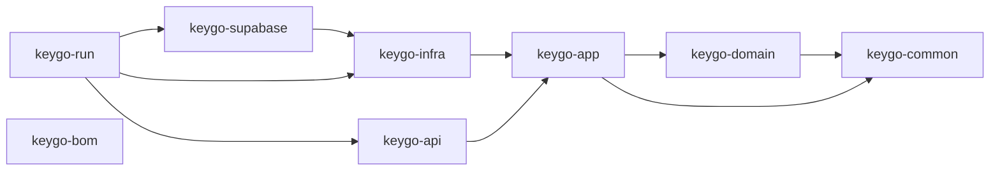
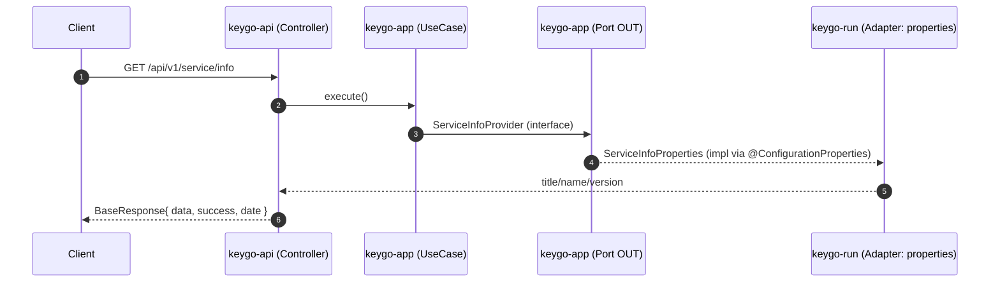
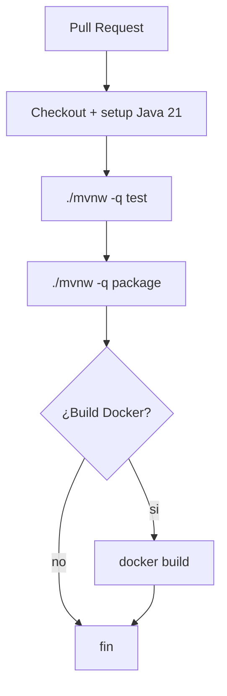

# Mejorar el contexto de Copilot en keygo-server con documentación e instrucciones

## Resumen ejecutivo

El repositorio `cmartinezs/keygo-server` es un proyecto **Java/Spring Boot multi-módulo (Maven)** con una arquitectura orientada a **Hexagonal (Ports & Adapters)**, donde `keygo-run` actúa como módulo de arranque/runnable.

La rama analizada contiene configuración moderna: **Spring Boot 4.0.3** y **Java 21**, y suma un módulo `keygo-supabase` con **Spring Data JPA + Flyway + PostgreSQL** además de scripts y un `docker-compose.yml` para levantar PostgreSQL y PgAdmin en local.

Para mejorar **de forma demostrable** el contexto que Copilot usa en **VS Code** e **IntelliJ**, el mecanismo más directo es añadir **instrucciones de repositorio** en `.github/copilot-instructions.md`, que ambas plataformas pueden leer para **Copilot Chat/Agentes** (no para sugerencias inline tradicionales).

Este informe entrega:

- Un análisis técnico del repo (estructura, stack, build/run, seguridad, infra y puntos críticos).
- Contenido **completo y listo para pegar** de: `README.md`, `ARCHITECTURE.md`, `AI_CONTEXT.md`, `CONTRIBUTING.md`, un `CLAUDE.md` opcional, y archivos Copilot recomendados (`.github/copilot-instructions.md` + prompt files).
- Diagramas Mermaid para arquitectura y CI/CD propuesto (el repo no muestra workflows CI actualmente).
- Una tabla comparativa y un checklist para validar que Copilot está indexando/inyectando el contexto en VS Code e IntelliJ (usando “References” y settings relevantes).

## Análisis del repositorio

El proyecto está definido como **parent POM** (`packaging=pom`) con módulos: `keygo-common`, `keygo-domain`, `keygo-app`, `keygo-infra`, `keygo-api`, `keygo-run`, `keygo-bom`, `keygo-supabase`.

### Stack, dependencias clave y build

- **Java 21** (propiedad `java.version`) y **Spring Boot 4.0.3** (parent).  
- `keygo-run` depende de `keygo-api`, `keygo-infra`, `keygo-supabase` y usa `spring-boot-starter` + `spring-boot-starter-validation`. Además configura **resource filtering** para interpolar valores `@project.*@` en `application.yml`.  
- `keygo-api` expone controladores REST y Actuator (`spring-boot-starter-web`, `spring-boot-starter-actuator`).  
- `keygo-supabase` añade `spring-boot-starter-data-jpa`, `spring-boot-starter-flyway`, driver `postgresql` y dependencias de test con Testcontainers (PostgreSQL + JUnit).  
- El contenedor Docker usa `eclipse-temurin:21` (JDK/JRE).  

### Configuración runtime, endpoints y convenciones de respuesta

- El `context-path` del server se define como `/${keygo.info.name}` (por defecto, `keygo-server` tras filtering).  
- Endpoints actuales (según controladores):
  - `GET /api/v1/service/info` (ServiceInfoController)  
  - `GET /api/v1/response-codes` (ResponseCodeController)  
  - Actuator: se exponen todos los endpoints (`management.endpoints.web.exposure.include: "*"`) lo cual es cómodo en dev pero riesgoso en prod.  
- La API estandariza respuestas con `BaseResponse<T>` (campos `date`, `success|failure`, `data`, más campos debug opcionales).  
- El repositorio incluye documentación interna extensa bajo `docs/…`, pero está dispersa; centralizar “cómo correr / cómo contribuir / cómo piensa el proyecto” en archivos raíz y en `.github/copilot-instructions.md` es lo que más mejora onboarding + Copilot.  

### Base de datos local y Supabase

- `keygo-supabase/docker-compose.yml` levanta PostgreSQL 15 y PgAdmin (puertos 5432 y 5050) con credenciales por defecto **solo para desarrollo**.  
- `application-supabase.yml` modela variables de entorno `SUPABASE_*` y configura datasource/JPA/Flyway; esto requiere activar el perfil `supabase` vía `SPRING_PROFILES_ACTIVE`.  
- Hay entidades JPA iniciales (`UserEntity`, `RoleEntity`, `PermissionEntity`) y repositorios `UserRepository`, `RoleRepository`.  

### Puntos críticos de seguridad/infra detectados

- **Actuator expuesto completo** (`include: "*"`) puede filtrar info sensible si se usa en ambientes no controlados; se recomienda limitar/asegurar por perfil.  
- El “bootstrap admin key” está pensado para proteger rutas `/api/**` mediante header `X-KEYGO-ADMIN` (y dejar públicas rutas de Actuator y Service Info).  
  - Sin embargo, el filtro compara `request.getRequestURI()` con prefijos como `"/api/"` y `"/actuator/"` configurados en `application.yml`. Con `context-path=/keygo-server`, el `requestURI` típicamente inicia con `/keygo-server/...`, lo que puede provocar que el matching no haga lo esperado (riesgo de “falsa seguridad” o reglas no aplicadas).  
- El valor por defecto de `KEYGO_ADMIN_KEY` es `changeMe`, lo que sirve para dev pero debe ser obligatorio cambiarlo en ambientes reales.  
- En `keygo-supabase` la guía/plantillas sugieren credenciales por defecto (p. ej. `postgres/postgres`, PgAdmin `admin`) — correcto para local, pero debe quedar explícito en docs y en instrucciones a Copilot (“no normalizar esto”).  

## Cómo mejorar el contexto que Copilot usa en VS Code e IntelliJ

### Instrucciones de repositorio para Copilot

- **VS Code** detecta automáticamente `.github/copilot-instructions.md` como instrucciones “always-on” para Copilot Chat en ese workspace. También soporta archivos `*.instructions.md` (con frontmatter `applyTo`) bajo ubicaciones como `.github/instructions`.  
- Estas instrucciones **no aplican a las sugerencias inline mientras tipeas** (inline completions), sino a interacciones de chat/edición asistida.  
- En **VS Code**, puedes controlar/diagnosticar la carga de instrucciones con settings tipo `github.copilot.chat.codeGeneration.useInstructionFiles`, `chat.instructionsFilesLocations`, `chat.includeApplyingInstructions`, y verificar en “References” qué instrucciones fueron aplicadas.  
- **IntelliJ / JetBrains IDEs** también soportan instrucciones en `.github/copilot-instructions.md` para el workspace, además de un archivo global `global-copilot-instructions.md` en rutas específicas por SO.  

### Prompt files reutilizables

- GitHub documenta “prompt files” (`*.prompt.md`) como una forma reusable de prompts (en **public preview**) disponible en VS Code, Visual Studio y JetBrains. Esto permite que el equipo comparta prompts “estándar” para tareas recurrentes (tests, docs, endpoints).  
- En VS Code, la referencia de settings indica que existe `chat.promptFilesLocations` y que por defecto se usa `.github/prompts`.  

### Archivos tipo CLAUDE.md: cuándo sirven

- Para Copilot (especialmente “agents”/coding agent) GitHub describe “agent instructions” compatibles con `AGENTS.md` y también con un `CLAUDE.md` único en la raíz del repo. Esto vuelve **razonable** mantener `CLAUDE.md` si además usas flujos basados en Claude/agentes, aunque para Copilot Chat lo principal sigue siendo `.github/copilot-instructions.md`.  

## Archivos propuestos listos para pegar

A continuación van los archivos **completos**. Están diseñados para:
- ser útiles para humanos,
- mejorar onboarding,
- y servir como “fuente de verdad” para Copilot (especialmente via `.github/copilot-instructions.md` y prompt files).

### README.md

````markdown
# KeyGo Server

Servidor backend para KeyGo, construido como monorepo **Maven multi-módulo** y basado en **Spring Boot**.

> **Objetivo del repo:** sentar una base sólida (arquitectura, convenciones y tooling) para evolucionar hacia un servicio de identidad/accesos (IAM) open source.

## Estado del proyecto

- El repositorio ya incluye:
  - Estructura hexagonal (Ports & Adapters / Hexagonal).
  - Endpoints base (Service Info y Response Codes).
  - Módulo `keygo-supabase` con configuración JPA/Flyway y docker-compose para DB local.
- Varias piezas están en etapa inicial (por ejemplo, CI/CD como workflows y algunos docs históricos desalineados con el código).

## Requisitos

- Java 21
- Docker (para DB local y/o containerización)
- (Opcional) IntelliJ IDEA / VS Code + GitHub Copilot

## Estructura del repo (alto nivel)

```
.
├── keygo-common/        # Utilidades compartidas
├── keygo-domain/        # Dominio (lógica de negocio pura)
├── keygo-app/           # Casos de uso y puertos (interfaces)
├── keygo-infra/         # Implementaciones/adaptadores (infra)
├── keygo-api/           # REST controllers + DTOs + handlers
├── keygo-supabase/      # Integración con Supabase: JPA/Flyway/scripts/compose
├── keygo-run/           # Spring Boot runnable (main + wiring + config)
├── docs/                # Documentación técnica histórica y guías por módulo
└── quick-start.sh       # Setup rápido: levanta DB local y corre migraciones
```

## Quick start (local dev con DB local)

### Levantar PostgreSQL local + PgAdmin

```bash
cd keygo-supabase
./scripts/dev-start.sh
```

- PostgreSQL: `localhost:5432` (db `keygo`, user `postgres`, pass `postgres`)
- PgAdmin: `http://localhost:5050` (email `admin@keygo.local`, pass `admin`)

> ⚠️ Credenciales por defecto: solo para desarrollo local.

### Configurar variables de entorno mínimas

Para habilitar Supabase/JPA:

```bash
export SPRING_PROFILES_ACTIVE="supabase,local"
export SUPABASE_URL="jdbc:postgresql://localhost:5432/keygo"
export SUPABASE_USER="postgres"
export SUPABASE_PASSWORD="postgres"
```

Para el bootstrap admin key (el filtro usa `X-KEYGO-ADMIN`):

```bash
export KEYGO_ADMIN_KEY="$(openssl rand -base64 32)"
```

### Compilar y ejecutar

```bash
./mvnw clean package -DskipTests

# opción 1: correr con Maven
./mvnw spring-boot:run -pl keygo-run

# opción 2: correr el jar
java -jar keygo-run/target/keygo-run-1.0-SNAPSHOT.jar
```

## URLs y endpoints útiles

> El servicio usa `context-path=/keygo-server` (por defecto).

Base URL:
- `http://localhost:8080/keygo-server`

Endpoints actuales:
- `GET /api/v1/service/info`
- `GET /api/v1/response-codes`

Actuator:
- `GET /actuator/health`

### Ejemplos con curl

```bash
curl -s http://localhost:8080/keygo-server/api/v1/service/info | jq
curl -s http://localhost:8080/keygo-server/api/v1/response-codes | jq
curl -s http://localhost:8080/keygo-server/actuator/health | jq
```

Si bootstrap está habilitado y el filtro aplica, los endpoints bajo `/api/` requieren:

```bash
curl -s http://localhost:8080/keygo-server/api/v1/response-codes \
  -H "X-KEYGO-ADMIN: $KEYGO_ADMIN_KEY" | jq
```

## Variables de entorno

### keygo-run (core)

- `PORT` (default: `8080`)
- `SPRING_PROFILES_ACTIVE` (default: `default`)
- `KEYGO_ADMIN_KEY` (default: `changeMe`)

### Supabase / DB

- `SUPABASE_URL` (ej: `jdbc:postgresql://localhost:5432/keygo`)
- `SUPABASE_USER`
- `SUPABASE_PASSWORD`

Opcionales (según `application-supabase.yml`):
- `SUPABASE_PROJECT_ID`, `SUPABASE_API_URL`, `SUPABASE_REST_URL`, etc.
- `SUPABASE_ANON_KEY`, `SUPABASE_SERVICE_KEY`, `SUPABASE_JWT_SECRET`

## Docker (app)

```bash
docker build -t keygo-server:dev .
docker run --rm -p 8080:8080 \
  -e SPRING_PROFILES_ACTIVE="default" \
  -e KEYGO_ADMIN_KEY="changeMe" \
  keygo-server:dev
```

> Nota: si sumas el perfil `supabase`, debes entregar `SUPABASE_URL/SUPABASE_USER/SUPABASE_PASSWORD` al contenedor.

## Documentación clave

- `ARCHITECTURE.md` — arquitectura, módulos, flujos y CI/CD propuesto.
- `AI_CONTEXT.md` — contexto “compacto” para Copilot/Claude y onboarding rápido.
- `CONTRIBUTING.md` — estándares de contribución, testing, PRs.
- `docs/` — documentación histórica y guías por módulo (lombok, supabase, bootstrap filter, etc).

## Licencia

AGPL-3.0 con términos comerciales adicionales (ver `LICENSE`).

## Contribuir

Lee `CONTRIBUTING.md` y usa PRs contra la rama principal de trabajo del repo.
````

### ARCHITECTURE.md

````markdown
# Arquitectura de KeyGo Server

## Propósito de este documento

Este documento centraliza la arquitectura y “cómo encaja todo” para:
- mantener consistencia entre módulos,
- acelerar onboarding,
- y mejorar la calidad de cambios generados por agentes (Copilot/Claude).

## Resumen técnico

- Build: Maven multi-módulo (monorepo).
- Runtime: Spring Boot (arranque en `keygo-run`).
- Arquitectura lógica: Hexagonal / Ports & Adapters.
- Persistencia (en progreso): `keygo-supabase` con Spring Data JPA + Flyway + PostgreSQL.

## Módulos y dependencias

### Mapa de módulos



### Responsabilidades por módulo

- **keygo-domain**: Dominio puro (idealmente sin Spring).
- **keygo-app**: Casos de uso + puertos (interfaces OUT).
- **keygo-infra**: Implementaciones de puertos (repositorios, adaptadores).
- **keygo-api**: REST controllers + DTOs + manejo de errores.
- **keygo-supabase**: Config de datasource/JPA/Flyway + entidades y repositorios Supabase.
- **keygo-run**: Spring Boot main + wiring + configuración (application.yml).
- **keygo-bom**: (placeholder) para gestión de versiones en el futuro si se requiere.

## Flujo HTTP típico

Ejemplo: `GET /keygo-server/api/v1/service/info`



## Configuración y perfiles

### keygo-run: configuración base

- `server.servlet.context-path` es `/${keygo.info.name}` (normalmente `/keygo-server`).
- `spring.profiles.active` se lee desde `SPRING_PROFILES_ACTIVE`.
- `keygo.bootstrap.*` define `admin-key` y prefijos para rutas.

### keygo-supabase: perfil supabase

`application-supabase.yml` contiene:
- `supabase.*` (url/user/password, api urls, keys)
- `spring.datasource.*` (PostgreSQL)
- `spring.jpa.*` (ddl-auto validate, schema default)
- `spring.flyway.*` (migraciones)

**Regla práctica:** para habilitar DB, incluir `supabase` en `SPRING_PROFILES_ACTIVE`.

## Seguridad y observabilidad

### Bootstrap Admin Key (modelo actual)

- Intención: proteger `/api/**` con header `X-KEYGO-ADMIN`.
- Actuator se usa para health/diagnóstico (revisar qué endpoints se exponen en prod).
- Recomendación: en producción:
  - limitar `management.endpoints.web.exposure.include`
  - obligar `KEYGO_ADMIN_KEY` fuerte
  - asegurar el matching del filtro con `context-path`

## Infra local: DB + herramientas

`keygo-supabase/docker-compose.yml` levanta:
- `postgres:15-alpine` (DB `keygo`)
- `dpage/pgadmin4` (admin UI)

Se controlan via scripts en `keygo-supabase/scripts/*.sh`.

## Testing

Estrategia recomendada:
- Unit tests:
  - *domain/app*: JUnit 5 + AssertJ + Mockito (sin Spring cuando se pueda).
  - *api/run*: tests unitarios de controllers/handlers/config.
- Integration tests:
  - *supabase*: Testcontainers PostgreSQL cuando se agreguen flujos reales de persistencia.

Comandos:
```bash
./mvnw test
./mvnw -pl keygo-supabase test
```

## CI/CD (propuesto)

El repo hoy no muestra workflows CI. Propuesta mínima para PRs:



Regla recomendada: “merge” solo si:
- build pasa
- tests pasan
- docs actualizados cuando cambien APIs/config.

## “Definition of Done” para cambios

- Compila: `./mvnw clean package`
- Tests: `./mvnw test`
- Sin secretos en commits (ni .env, ni keys).
- Endpoints documentados en README/ARCHITECTURE si cambian.
- Si hay migraciones nuevas: documentar y validar con Flyway.

````

### AI_CONTEXT.md

````markdown
# AI Context — KeyGo Server

Este archivo existe para que **Copilot/Claude/agentes** entiendan rápido el repo.

## TL;DR

- Proyecto: Java 21 + Spring Boot (multi-módulo Maven).
- Arranque: `keygo-run`.
- API: `keygo-api` (REST).
- Lógica: `keygo-app` (usecases) + `keygo-domain`.
- DB (en progreso): `keygo-supabase` (JPA + Flyway + PostgreSQL).

## Comandos esenciales

```bash
# build
./mvnw clean package

# tests
./mvnw test

# correr app
./mvnw spring-boot:run -pl keygo-run

# correr jar
java -jar keygo-run/target/keygo-run-1.0-SNAPSHOT.jar
```

## URLs (local)

Base:
- `http://localhost:8080/keygo-server`

Endpoints existentes:
- `GET /api/v1/service/info`
- `GET /api/v1/response-codes`
- `GET /actuator/health`

## DB local (para supabase)

```bash
cd keygo-supabase
./scripts/dev-start.sh
```

Variables mínimas:
```bash
export SPRING_PROFILES_ACTIVE="supabase,local"
export SUPABASE_URL="jdbc:postgresql://localhost:5432/keygo"
export SUPABASE_USER="postgres"
export SUPABASE_PASSWORD="postgres"
```

## Convenciones del proyecto

### Arquitectura (regla de dependencias)

- `domain` no debe depender de Spring.
- `app` define puertos/usecases y depende de `domain`.
- `infra` implementa puertos y depende de `app`.
- `api` llama usecases (depende de `app`) y devuelve `BaseResponse<T>`.
- `run` cablea todo (component scan y beans).

### Respuestas API

- Usar `BaseResponse<T>` con:
  - `success` (MessageResponse) para OK
  - `failure` (MessageResponse) para errores
  - `date` automático
- Códigos de negocio: `ResponseCode` (no duplicar HTTP status).

### Configuración

- `keygo-run/src/main/resources/application.yml` usa Maven resource filtering con `@project...@`.
- `server.servlet.context-path` por defecto es `/${keygo.info.name}` (ej: `/keygo-server`).
- Para supabase, la config extra viene en `keygo-supabase/src/main/resources/application-supabase.yml`.

## Seguridad (importante)

- `KEYGO_ADMIN_KEY` (default `changeMe`) no sirve para prod.
- Actuator está expuesto completo en config actual: revisar antes de prod.
- El filtro `BootstrapAdminKeyFilter` pretende proteger `/api/**` con `X-KEYGO-ADMIN`:
  - confirmar comportamiento real con `context-path` (no asumir).

## Prompts recomendados (Copilot/Claude)

### Prompt: agregar endpoint REST siguiendo hexagonal

**Objetivo:** nuevo endpoint en `keygo-api`, con usecase/puerto en `keygo-app` y test unitario.

**Prompt:**
> Agrega un endpoint `GET /api/v1/<recurso>/...` en `keygo-api` que devuelva `BaseResponse<T>`.  
> Crea el usecase en `keygo-app` y define un puerto OUT si hace falta.  
> Mantén `keygo-domain` libre de Spring.  
> Incluye tests unitarios (JUnit5 + Mockito/AssertJ) y actualiza documentación (README/ARCHITECTURE si aplica).  
> IMPORTANTE: recuerda que el base path real incluye `/keygo-server` por `context-path`.

### Prompt: agregar entidad JPA + repo en keygo-supabase

> Crea una entidad JPA nueva en `keygo-supabase` (con UUID, timestamps y naming consistente).  
> Agrega repository interface Spring Data.  
> Si requiere migración, agrega guía y valida con Flyway (sin hardcodear credenciales).

### Prompt: endurecer configuración para ambiente productivo (solo propuesta)

> Propón cambios de configuración por perfiles para limitar Actuator en prod y endurecer seguridad.  
> No cambies código directamente; entrega un plan y diffs sugeridos.

## “System message” sugerida para agentes externos

Si tu herramienta soporta system prompt (por ejemplo agentes basados en Claude), usa algo como:

> Eres un agente de ingeniería trabajando en un monorepo Maven multi-módulo (Java 21, Spring Boot).  
> Debes seguir arquitectura hexagonal (domain/app/infra/api/run).  
> Devuelve cambios mínimos y consistentes.  
> No introduzcas secretos.  
> Siempre incluye pasos de verificación (build/tests).  
> Documenta endpoints considerando `context-path=/keygo-server`.

````

### CLAUDE.md (opcional)

````markdown
# CLAUDE.md — Reglas para agentes (opcional)

Este archivo es para agentes que soportan reglas a nivel repo (Claude/otros agentes).
Si estás usando GitHub Copilot, la principal fuente de instrucciones es `.github/copilot-instructions.md`.

## Identidad del proyecto

- Repo: KeyGo Server (Java 21, Spring Boot, Maven multi-módulo).
- Arquitectura: Hexagonal / Ports & Adapters.
- Módulo runnable: `keygo-run`.

## Reglas de oro

1. No inventes estructura del repo: apóyate en módulos existentes (`keygo-api`, `keygo-app`, etc.).
2. Mantén `keygo-domain` libre de dependencias Spring.
3. Cualquier endpoint REST debe:
   - estar en `keygo-api`,
   - usar `BaseResponse<T>`,
   - emitir `ResponseCode` apropiado.
4. No asumas paths “root” sin `/keygo-server` (hay `context-path`).
5. No agregues secretos ni .env a Git.
6. Antes de dar por finalizado un cambio, sugiere comandos:
   - `./mvnw test`
   - `./mvnw clean package`

## Cómo trabajar cuando te piden implementar una feature

- Primero: describe el diseño mínimo (clases, módulos, flujos).
- Segundo: genera cambios pequeños por commit lógico.
- Tercero: agrega tests unitarios.
- Cuarto: actualiza README/ARCHITECTURE si cambian APIs/config.

## Conocimiento específico útil

- Supabase / DB está modelado en `keygo-supabase` y se habilita por perfil `supabase`.
- Hay scripts para DB local en `keygo-supabase/scripts/`.

## Ejemplo de prompt interno recomendado

> Implementa la feature X siguiendo hexagonal.  
> Asegúrate de que compile y tenga tests.  
> Si tocas endpoints, documenta y considera `/keygo-server` como context path.

````

### CONTRIBUTING.md

````markdown
# Contribuir a KeyGo Server

Gracias por contribuir.

## Requisitos locales

- Java 21
- Docker (para DB local / herramientas)
- `./mvnw` (Maven Wrapper incluido)

## Workflow recomendado

1. Crea un branch desde la rama principal de trabajo del repo.
2. Haz cambios pequeños y bien acotados.
3. Agrega/actualiza tests.
4. Asegura build verde.
5. Abre Pull Request.

## Build y tests

```bash
# build completo
./mvnw clean package

# correr tests
./mvnw test

# correr solo un módulo
./mvnw -pl keygo-api test
./mvnw -pl keygo-run test
./mvnw -pl keygo-supabase test
```

## Ejecutar la app

```bash
./mvnw spring-boot:run -pl keygo-run
```

El servicio usa `context-path=/keygo-server` por defecto (via `application.yml`).

## DB local / Supabase (dev)

Levantar PostgreSQL local + PgAdmin:

```bash
cd keygo-supabase
./scripts/dev-start.sh
```

Variables mínimas:

```bash
export SPRING_PROFILES_ACTIVE="supabase,local"
export SUPABASE_URL="jdbc:postgresql://localhost:5432/keygo"
export SUPABASE_USER="postgres"
export SUPABASE_PASSWORD="postgres"
```

## Convenciones de arquitectura

- `keygo-domain`: dominio puro (sin Spring).
- `keygo-app`: casos de uso + puertos (interfaces).
- `keygo-infra`: implementaciones/adaptadores.
- `keygo-api`: controllers/DTOs/handlers.
- `keygo-run`: arranque/wiring/config.
- `keygo-supabase`: JPA/Flyway/configs/scripts.

## Convenciones de API

- Usar `BaseResponse<T>` como envelope.
- Usar `ResponseCode` para códigos de negocio.
- Evitar mezclar HTTP status con códigos de negocio.
- Preferir endpoints versionados (`/api/v1/...`).

## Seguridad (mínimos)

- No commitear secretos (keys, tokens, passwords, `.env`).
- `KEYGO_ADMIN_KEY` debe ser fuerte en ambientes reales.
- No exponer Actuator completo en prod (proponer perfiles).

## Pull Request Checklist

- [ ] El cambio compila (`./mvnw clean package`)
- [ ] Tests pasan (`./mvnw test`)
- [ ] No hay secretos en el diff
- [ ] Documentación actualizada si aplica (README/ARCHITECTURE/docs)
- [ ] PR describe:
  - qué cambió
  - cómo se probó
  - riesgos / tradeoffs

## Licencia

AGPL-3.0 con términos comerciales adicionales (ver `LICENSE`).
````

### .github/copilot-instructions.md

````markdown
# Copilot Instructions (KeyGo Server)

Responde en español (es-US) por defecto, a menos que el usuario pida otro idioma.

## Contexto del repositorio

- Monorepo Maven multi-módulo (Java 21, Spring Boot).
- Módulo runnable: `keygo-run`.
- Arquitectura: Hexagonal / Ports & Adapters.
- Base path runtime incluye `context-path=/keygo-server`.

## Reglas de implementación

- NO pongas Spring en `keygo-domain`.
- Poner endpoints REST solo en `keygo-api` y devolver `BaseResponse<T>`.
- Evitar “inventar” endpoints: seguir `/api/v1/...`.
- Si agregas lógica, crear/usar usecases y puertos en `keygo-app`.
- Implementaciones concretas (repos/clients) van en `keygo-infra` o `keygo-supabase` según corresponda.
- Si usas DB:
  - Perfil `supabase` debe estar activo.
  - Variables: `SUPABASE_URL`, `SUPABASE_USER`, `SUPABASE_PASSWORD`.
- Seguridad:
  - Nunca introduzcas secretos en el repo.
  - No asumir que el filtro admin key funciona perfecto: validar con `context-path`.

## Convenciones de calidad

- Cambios pequeños y coherentes.
- Siempre incluir:
  - comandos de verificación (build/tests),
  - tests unitarios cuando sea posible,
  - actualización de docs si cambian APIs/config.

## Comandos por defecto

Usa Maven Wrapper:

- `./mvnw test`
- `./mvnw clean package`
- `./mvnw spring-boot:run -pl keygo-run`

## Nota sobre alcance

Estas instrucciones aplican a Copilot Chat / agentes. No necesariamente a sugerencias inline mientras se escribe.
````

### .github/prompts/add-endpoint.prompt.md

```markdown
# Add REST endpoint (Hexagonal)

Objetivo: crear un endpoint REST nuevo siguiendo la arquitectura del repo.

Instrucciones:
1. Crea el controller en `keygo-api` con rutas bajo `/api/v1/...`.
2. El controller debe devolver `BaseResponse<T>` y usar `ResponseCode`.
3. Crea/usa un usecase en `keygo-app`.
4. Define un puerto OUT si necesitas IO (DB/API externa).
5. Implementaciones concretas van en `keygo-infra` o `keygo-supabase`.
6. Agrega tests unitarios (JUnit5 + Mockito/AssertJ).
7. Considera `context-path=/keygo-server` al documentar y testear endpoints.

Entrega:
- Lista de clases nuevas/modificadas
- Código completo
- Tests
- Comandos para verificar (`./mvnw test`, `./mvnw clean package`)
```

### .github/prompts/write-tests.prompt.md

```markdown
# Write unit tests (KeyGo Server)

Genera tests unitarios enfocados y mantenibles.

Reglas:
- JUnit 5 + AssertJ + Mockito.
- Evitar Spring Test si no es necesario (preferir tests puros).
- Nombrar tests: `ClaseTest` y métodos descriptivos.
- Cubrir casos felices + edge cases + errores.

Entrega:
- Código de tests listo para pegar
- Explicación breve de qué está cubierto
- Cómo correr: `./mvnw test` (o `./mvnw -pl <modulo> test`)
```

### .github/prompts/supabase-entity.prompt.md

```markdown
# Add Supabase entity + repository

Objetivo: agregar una entidad JPA y su repository en `keygo-supabase`.

Reglas:
- UUID como PK.
- Timestamps (`created_at`, `updated_at`) coherentes.
- Índices donde tenga sentido.
- Repository Spring Data con métodos mínimos y claros.
- No hardcodear credenciales.
- Si se requieren migraciones: proponer estrategia Flyway (sin tocar prod).

Entrega:
- Código de entity + repository
- Recomendación de migración (si aplica)
- Tests unitarios básicos (si aplica)
```

## Tabla comparativa de archivos

| Archivo | Propósito | Tamaño estimado | Prioridad | Ubicación en repo |
|---|---|---:|---|---|
| `README.md` | Onboarding humano + comandos + endpoints + configuración | Mediano | Alta | Raíz |
| `ARCHITECTURE.md` | Arquitectura, módulos, flujos y CI/CD propuesto (Mermaid) | Mediano | Alta | Raíz |
| `AI_CONTEXT.md` | Contexto compacto para Copilot/Claude (comandos, reglas, prompts) | Mediano | Alta | Raíz |
| `CONTRIBUTING.md` | Normas de contribución, tests y PR checklist | Mediano | Alta | Raíz |
| `CLAUDE.md` (opcional) | Reglas específicas para agentes tipo Claude/otros | Corto | Media | Raíz |
| `.github/copilot-instructions.md` | Instrucciones “always-on” para Copilot Chat/agentes (VS Code + JetBrains) | Corto | Muy alta | `.github/` |
| `.github/prompts/*.prompt.md` | Prompt files reutilizables (VS Code + JetBrains, preview) | Corto | Media | `.github/prompts/` |

## Checklist para integrar en VS Code e IntelliJ y validar indexación

### VS Code

1. Asegura que estás abriendo el repo como workspace (carpeta raíz) y que los settings de workspace viven en `.vscode/settings.json` para single-folder workspaces.  
2. Crea/añade `.github/copilot-instructions.md` (y opcionalmente `.github/prompts/…`). VS Code detecta el archivo `.github/copilot-instructions.md` como instrucciones always-on.  
3. Verifica que el setting `github.copilot.chat.codeGeneration.useInstructionFiles` esté habilitado (por defecto suele estar `true` según la referencia).  
4. Verifica “locations” si usas instrucciones por carpeta: `chat.instructionsFilesLocations` (por defecto incluye `.github/instructions`).  
5. Si usas prompt files en `.github/prompts`, verifica `chat.promptFilesLocations` (la referencia incluye default `.github/prompts`).  
6. Validación práctica:
   - Abre Copilot Chat.
   - Pregunta algo que requiera reglas (p. ej. “agrega un endpoint en keygo-api usando BaseResponse”).
   - Revisa la sección **References** de la respuesta para confirmar que `.github/copilot-instructions.md` fue incluida. VS Code documenta esta verificación para instrucciones.  

**Snippet recomendado** (opcional) para `.vscode/settings.json` compartible en el repo (si tu equipo lo acepta):

```jsonc
{
  // Forzar idioma en chat (si quieres consistencia del equipo)
  "github.copilot.chat.localeOverride": "es",

  // Asegurar instrucciones del repo
  "github.copilot.chat.codeGeneration.useInstructionFiles": true,

  // Prompt files compartidos
  "chat.promptFilesLocations": {
    ".github/prompts": true
  }
}
```

(Estos keys aparecen documentados en la referencia de settings de Copilot en VS Code).  

### IntelliJ (JetBrains)

1. Instala/actualiza el plugin de Copilot y verifica que esté habilitado (status icon).  
2. Para instrucciones por workspace: crea `.github/copilot-instructions.md` en el repo (mismo archivo que VS Code). GitHub documenta que JetBrains lo usa como instrucciones del workspace.  
3. (Opcional) Para instrucciones globales (todas tus workspaces), crea `global-copilot-instructions.md` en la ruta que documenta GitHub para tu SO (macOS / Windows).  
4. Valida que se están aplicando:
   - Abre Copilot Chat en IntelliJ y solicita algo alineado al repo (p. ej., “dame el flujo hexagonal de este repo y dónde colocar un controller nuevo”).
   - Confirma que responde siguiendo reglas (idioma, BaseResponse, módulos).

> Nota: GitHub indica que la verificación de uso de custom instructions puede hacerse observando referencias (cuando el cliente las muestra).  

## Script opcional para añadir archivos y crear un PR

### Comandos exactos (clone)

```bash
git clone -b develop https://github.com/cmartinezs/keygo-server.git
cd keygo-server
```

### Script pequeño (no incluye el contenido; solo automatiza branch + commit + PR)

Guárdalo como `scripts/add-docs-pr.sh` (o ejecútalo manualmente). El script crea archivos vacíos si faltan; luego tú pegas el contenido desde esta respuesta.

```bash
#!/usr/bin/env bash
set -euo pipefail

BASE_BRANCH="${BASE_BRANCH:-develop}"
BRANCH="${BRANCH:-docs/copilot-context}"
REMOTE="${REMOTE:-origin}"

git fetch "$REMOTE" "$BASE_BRANCH"
git checkout "$BASE_BRANCH"
git pull --ff-only "$REMOTE" "$BASE_BRANCH"

git checkout -b "$BRANCH"

mkdir -p .github/prompts

# Archivos principales
for f in README.md ARCHITECTURE.md AI_CONTEXT.md CONTRIBUTING.md; do
  [ -f "$f" ] || : > "$f"
done

# Opcionales / recomendados
[ -f CLAUDE.md ] || : > CLAUDE.md
[ -f .github/copilot-instructions.md ] || : > .github/copilot-instructions.md
[ -f .github/prompts/add-endpoint.prompt.md ] || : > .github/prompts/add-endpoint.prompt.md
[ -f .github/prompts/write-tests.prompt.md ] || : > .github/prompts/write-tests.prompt.md
[ -f .github/prompts/supabase-entity.prompt.md ] || : > .github/prompts/supabase-entity.prompt.md

cat <<'MSG'

✅ Estructura creada.

Ahora:
1) Pega el contenido propuesto en cada archivo (desde el informe).
2) Ejecuta:

   git add README.md ARCHITECTURE.md AI_CONTEXT.md CONTRIBUTING.md CLAUDE.md \
     .github/copilot-instructions.md .github/prompts/*.prompt.md

   git commit -m "docs: improve Copilot context and onboarding"
   git push -u origin docs/copilot-context

3) Si tienes GitHub CLI:
   gh pr create --base develop --head docs/copilot-context \
     --title "docs: improve Copilot context" \
     --body "Adds central docs plus .github/copilot-instructions.md and prompt files."

MSG
```

### Recomendación práctica de verificación post-PR

Después de merge:
- En VS Code, abre un chat y confirma “References” contiene `.github/copilot-instructions.md`.  
- En VS Code revisa los settings y confirma que `github.copilot.chat.codeGeneration.useInstructionFiles` está habilitado.  
- En IntelliJ, abre el panel de Copilot, solicita un cambio y verifica que respete las reglas (idioma, módulos, BaseResponse y context-path).
