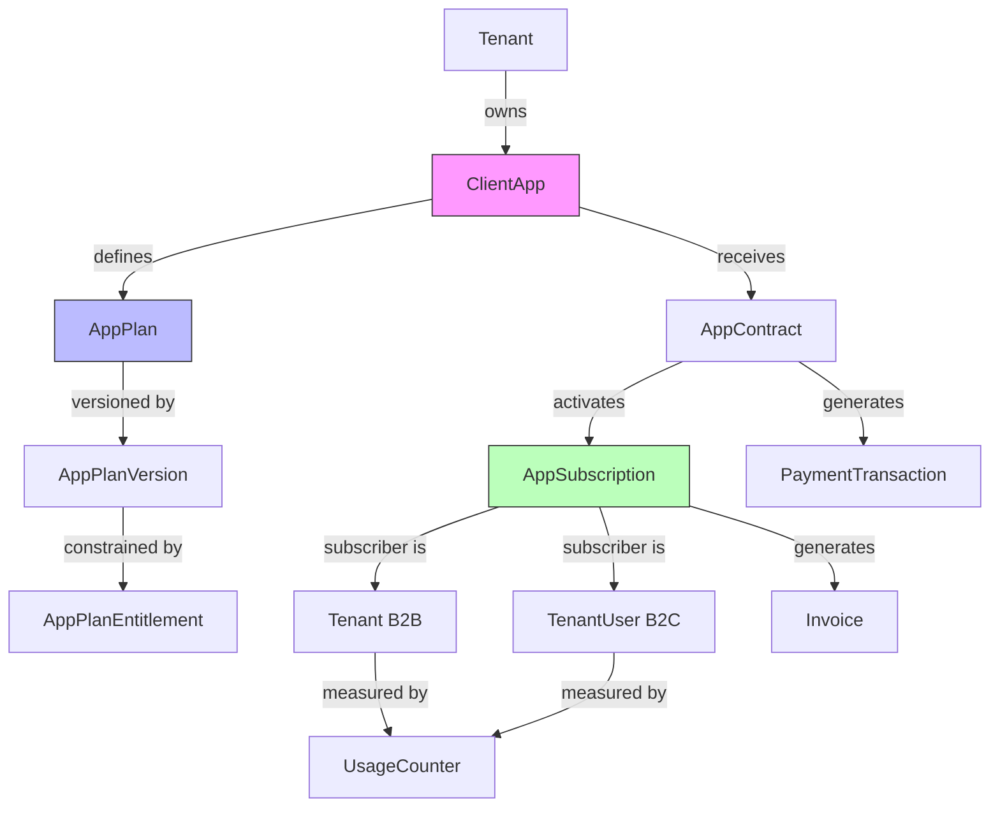
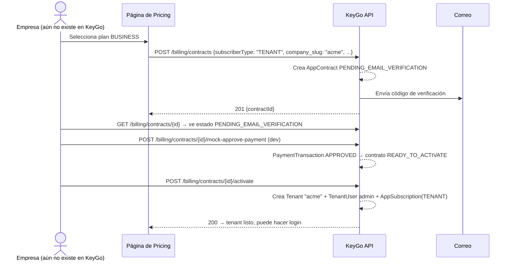
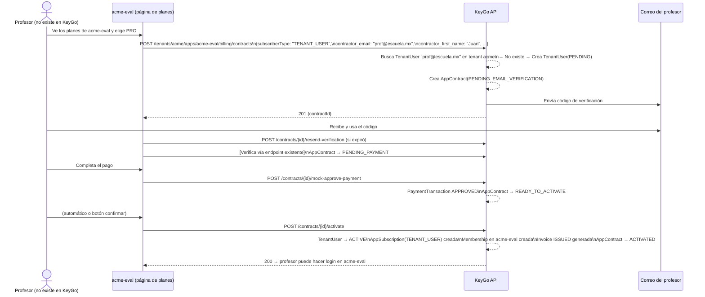
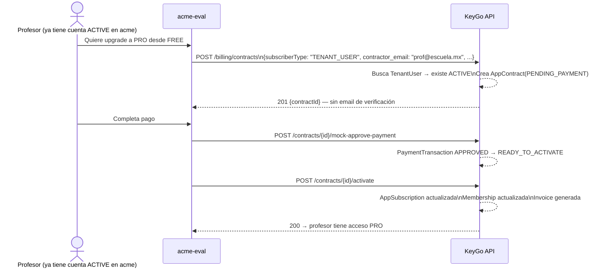
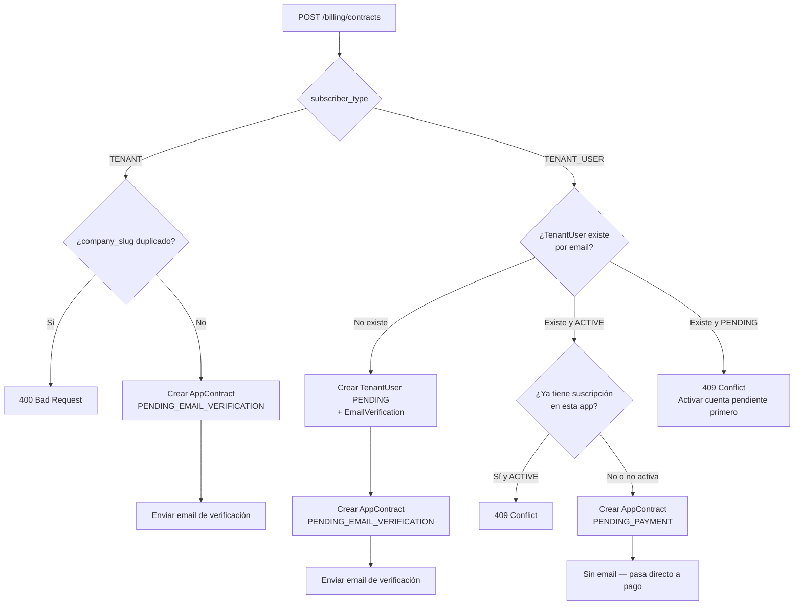
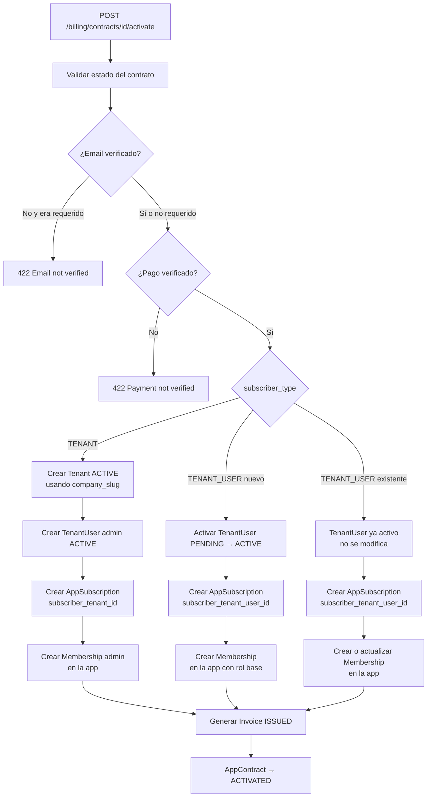
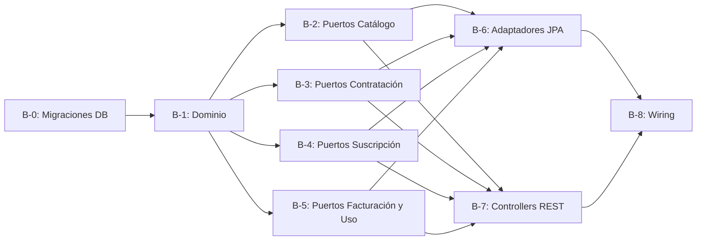

# Plan de Implementación — Módulo de Billing (Multi-App)

> **Referencia:** [`plan-billing-model.md`](./plan-billing-model.md)  
> **Fecha:** 2026-03-28  
> **Estado:** 📋 Borrador — pendiente de aprobación  
> **Revisión:** v2 — billing como servicio multi-app, no exclusivo de la plataforma

---

## Corrección arquitectónica respecto al borrador anterior

El borrador inicial trataba el billing como un módulo de plataforma (tenants pagan por usar KeyGo).
La arquitectura correcta es:

> **El billing es un servicio que KeyGo ofrece a cualquier `ClientApp` de cualquier `Tenant`.**  
> Cada app puede definir sus propios planes, y sus usuarios/tenants pueden suscribirse a ellos.  
> KeyGo en sí misma es una `ClientApp` registrada dentro del tenant `keygo`, y usa su propio  
> servicio de billing para cobrar a los tenants por el uso de la plataforma IAM.

Esto produce una arquitectura **multi-app** donde el billing se ancla al par `(Tenant, ClientApp)`,
igual que la autenticación.

---

## Resumen ejecutivo

| Dimensión | Valor |
|---|---|
| **Bounded context** | Billing — separado del IAM, mismo backend |
| **Entidad raíz** | `ClientApp` — cada app define su propio catálogo de planes |
| **Suscriptor** | Polimórfico: `Tenant` (B2B) o `TenantUser` (B2C) |
| **KeyGo como dogfood** | `keygo` tenant + `keygo-platform` app → planes de la plataforma IAM |
| **Backward compatible** | Sin planes definidos = sin límites (billing opcional por app) |
| **Migraciones** | V16 a V19 (4 scripts agrupados) |
| **Fases** | B-0 a B-8 (9 fases) |
| **Endpoints nuevos** | ~22 bajo `/api/v1/tenants/{slug}/apps/{clientId}/billing/...` |

---

## Modelo conceptual



---

## Contexto: Tenant B2B vs TenantUser B2C

Esta es la decisión más importante del modelo. Define **quién paga** y **qué límites se aplican**.

### ¿Qué es un suscriptor?

Un suscriptor es la entidad que firma el contrato, paga el plan y queda sujeta a sus límites.  
En KeyGo existen dos tipos posibles:

| Tipo | Entidad | Cuándo usarlo |
|---|---|---|
| `TENANT` | Organización completa (`tenants`) | La empresa como unidad paga el acceso a la app — B2B |
| `TENANT_USER` | Usuario individual (`tenant_users`) | Cada persona paga su propio acceso — B2C |

---

### TENANT — Modelo B2B (empresa como suscriptor)

**¿Qué significa?**  
La unidad de pago es el **Tenant completo**: una empresa contrata un plan y todos sus usuarios
dentro de ese tenant quedan cubiertos o limitados por ese plan. El administrador de la empresa
firma el contrato, no cada usuario individualmente.

**¿Cuándo aplicarlo?**  
Cuando la app vende **capacidad a una organización**, no a personas individuales:
- Número máximo de usuarios en la organización
- Número máximo de apps registradas
- Peticiones de API por mes para toda la empresa
- Acceso a features premium para toda la organización

**¿Cómo afecta al onboarding (`ActivateAppContractUseCase`)?**  
Al activar un contrato `TENANT`:
1. Se crea un **nuevo `Tenant`** con `status=ACTIVE` (usando `company_slug` como slug del tenant)
2. Se crea un **`TenantUser` admin** con el email del contratante
3. Se crea la **`AppSubscription`** apuntando al nuevo tenant (`subscriber_tenant_id`)
4. Se genera la **primera `Invoice`**

> Este es exactamente el flujo de onboarding de **KeyGo como plataforma**: cuando una empresa
> quiere usar KeyGo IAM, contrata el plan de `keygo-platform`, lo que crea su propio tenant en
> KeyGo y su usuario administrador.

**¿Cómo se validan los límites?**  
Los contadores y entitlements se aplican a nivel de **toda la organización**:

```sql
-- Contar usuarios del tenant para validar MAX_TENANT_USERS
SELECT COUNT(*) FROM tenant_users WHERE tenant_id = :tenantId;

-- Contador de uso en usage_counters
WHERE client_app_id = :appId AND subscriber_tenant_id = :tenantId AND metric_code = 'API_CALLS_PER_MONTH'
```

**¿Quién puede ver/gestionar la suscripción?**  
Cualquier usuario con rol `ADMIN_TENANT` en ese tenant (el administrador de la empresa).

**Ejemplos reales de este modelo:**

| App | Plan | Qué limita |
|---|---|---|
| `keygo-platform` | FREE (5 usuarios, 1 app) | IAM para startups pequeñas |
| `keygo-platform` | BUSINESS (100 usuarios, 10 apps) | IAM para empresas medianas |
| `acme-erp` | STARTER (50 usuarios, 5 módulos) | Acceso al ERP de Acme Corp |
| `mi-saas-b2b` | ENTERPRISE (ilimitado + SLA) | Plataforma colaborativa empresarial |

**Flujo de contratación B2B:**



---

### TENANT_USER — Modelo B2C (usuario individual como suscriptor)

**¿Qué significa?**  
La unidad de pago es un **usuario individual**. El tenant (la organización dueña de la app) ya
existe en KeyGo, pero **el usuario que se suscribe puede o no existir previamente** en ese tenant.
Cada persona tiene su propio plan con acceso diferente a la app.

**¿Cuándo aplicarlo?**  
Cuando la app vende **capacidad o acceso a personas individuales**:
- Plataforma de evaluaciones escolares (cada profesor paga su licencia)
- Almacenamiento personal en la nube
- Suscripción premium a contenido
- Licencia individual de software

---

#### Sub-caso A — Usuario nuevo (no existe en el ecosistema)

Este es el caso del **profesor que se quiere inscribir a `acme-eval` y no tiene cuenta**.

Al crear el contrato (`CreateAppContractUseCase`):
1. Se busca si existe un `TenantUser` con ese email en el tenant `acme`
2. **No existe** → se crea un `TenantUser` en estado `PENDING` (igual que auto-registro)
3. Se crea el `AppContract` en `PENDING_EMAIL_VERIFICATION`
4. Se envía email de verificación — este paso cubre **a la vez**: "verificar cuenta" + "confirmar intención de pago"

Al activar el contrato (`ActivateAppContractUseCase`):
1. Se valida email verificado + pago verificado
2. `TenantUser` pasa de `PENDING` → `ACTIVE`
3. Se crea la `AppSubscription` apuntando al usuario
4. Se crea una `Membership` en la app (acceso IAM al recurso)
5. Se genera la primera `Invoice ISSUED`

> El contrato **subsume el registro**: un usuario nuevo no necesita registrarse primero y
> luego suscribirse — el flujo de contratación hace ambas cosas en un solo paso.

**Flujo completo — Profesor nuevo:**



---

#### Sub-caso B — Usuario existente (ya tiene cuenta en el tenant)

El usuario ya existe como `TenantUser` en el tenant y quiere subir de plan o suscribirse
a una nueva app de ese mismo tenant.

Al crear el contrato (`CreateAppContractUseCase`):
1. Se busca `TenantUser` por email → **existe y está `ACTIVE`**
2. El contrato inicia directamente en `PENDING_PAYMENT` (se omite la verificación de email — ya está verificado)
3. El usuario procede directo al pago

Al activar el contrato (`ActivateAppContractUseCase`):
1. Se valida pago verificado
2. `TenantUser` ya existe — no se modifica
3. Se crea la `AppSubscription`
4. Se crea o actualiza la `Membership` en la app
5. Se genera la primera `Invoice`

**Flujo — Profesor con cuenta existente:**



---

#### ¿Qué es la `Membership` y por qué se crea aquí?

En KeyGo, `Membership` es el objeto que otorga acceso IAM a un usuario en una app específica.
**Sin `Membership`, el usuario existe pero no puede autenticarse en la app.**

Por eso, al activar cualquier contrato `TENANT_USER`, se debe crear (o confirmar) una `Membership`
entre el usuario y la app, con el rol base que el plan define (ej: `USUARIO_PRO`, `USUARIO_FREE`).

```
AppSubscription  →  define QUÉ puede hacer (límites del plan)
Membership       →  define SI puede entrar (acceso IAM a la app)
```

Ambos son necesarios. Un usuario puede tener `Membership` sin suscripción (acceso gratuito),
o suscripción sin `Membership` activa (acceso suspendido).

---

**¿Cómo se validan los límites?**  
Los contadores y entitlements se aplican a nivel de **ese usuario específico**:

```sql
-- Contador de uso en usage_counters (solo para ese usuario)
WHERE client_app_id = :appId AND subscriber_tenant_user_id = :userId AND metric_code = 'EVALUACIONES_POR_MES'
```

**¿Quién puede ver/gestionar la suscripción?**  
El propio usuario (con Bearer token) o el administrador del tenant (`ADMIN_TENANT`).

> ⚠️ **Consideración pendiente:** los endpoints actuales del plan usan `Bearer ADMIN_TENANT`.
> Para que el propio usuario vea su suscripción sin privilegios de admin,
> se necesitará una variante del endpoint con validación del propio JWT — propuesta post-MVP.

**Ejemplos reales de este modelo:**

| App | Plan | Qué limita |
|---|---|---|
| `acme-eval` | FREE (5 evaluaciones/mes) | Número de evaluaciones que crea el profesor |
| `acme-eval` | PRO (evaluaciones ilimitadas + reportes) | Acceso a features premium |
| `mi-saas-storage` | PRO (100 GB por usuario) | Almacenamiento personal |
| `content-platform` | BASIC (10 artículos/mes) | Consumo individual de contenido |

---

### Comparación directa

| Dimensión | TENANT (B2B) | TENANT_USER nuevo (B2C) | TENANT_USER existente (B2C) |
|---|---|---|---|
| **Quién paga** | La empresa | El usuario (nuevo) | El usuario (ya tiene cuenta) |
| **¿Crea `Tenant`?** | ✅ Sí — nuevo tenant | ❌ No | ❌ No |
| **¿Crea `TenantUser`?** | ✅ Sí — admin | ✅ Sí — PENDING → ACTIVE | ❌ No — ya existe |
| **¿Crea `Membership`?** | Opcional (rol admin) | ✅ Sí — acceso a la app | ✅ Sí — acceso/actualiza |
| **Estado inicial del contrato** | `PENDING_EMAIL_VERIFICATION` | `PENDING_EMAIL_VERIFICATION` | `PENDING_PAYMENT` |
| **Límites se aplican a** | Todo el tenant | Solo ese usuario | Solo ese usuario |
| **`company_slug` requerido** | ✅ Sí | ❌ No | ❌ No |
| **`usage_counters` scope** | `subscriber_tenant_id` | `subscriber_tenant_user_id` | `subscriber_tenant_user_id` |
| **Caso de uso KeyGo** | ✅ Plataforma IAM | App SaaS orientada a personas | App SaaS orientada a personas |

---

### Lógica de `CreateAppContractUseCase` — diagrama completo



---

### Lógica de `ActivateAppContractUseCase` — diagrama completo



---

### ¿Cómo decide el desarrollador cuál usar?

Al crear un plan con `POST /billing/plans`, el administrador de la app **no elige el tipo por plan**,
sino por app completa. La decisión se toma en el diseño del negocio:

```
¿Cobro a la empresa o a cada persona?
         │
         ├── A la empresa ──────────────► subscriber_type = TENANT
         │   (Ej: KeyGo, Salesforce, Slack teams, GitHub Orgs)
         │
         └── A cada persona ────────────► subscriber_type = TENANT_USER
             (Ej: Netflix, Spotify, Dropbox personal, GitHub individual)
```

En la práctica, cuando el usuario llena el formulario de contratación en la UI, el frontend
**fija el `subscriber_type`** según el diseño de la app — el usuario final no lo elige.

---

### Coexistencia de ambos tipos en el mismo tenant

Un tenant puede tener:
- Una suscripción `TENANT` hacia `keygo-platform` (paga por usar KeyGo IAM)
- Múltiples usuarios con suscripciones `TENANT_USER` hacia `acme-crm` (cada usuario paga su licencia del CRM de Acme)

Ambas coexisten sin conflicto porque `app_subscriptions.UNIQUE (client_app_id, subscriber_tenant_id)` y
`UNIQUE (client_app_id, subscriber_tenant_user_id)` son constraints independientes.

---

---

### Planes empresa vs planes individuales

Sí — **un plan tiene que declarar a quién está dirigido**. Un plan de empresa no tiene sentido
para un individuo (¿cuántos usuarios puede tener un profesor solo?), y viceversa.

Por eso `app_plans` tiene un campo `subscriber_type` que fija el tipo de suscriptor válido
para ese plan. La consecuencia directa es que **una misma `ClientApp` puede —y normalmente
debe— tener dos catálogos paralelos**.

**Ejemplo — `acme-eval`:**

| Plan | `subscriber_type` | Precio | Entitlements |
|---|---|---|---|
| `TEACHER_FREE` | `TENANT_USER` | $0/mes | 5 evaluaciones/mes, 30 alumnos |
| `TEACHER_PRO` | `TENANT_USER` | $99/mes | Ilimitadas, exportar PDF, reportes |
| `SCHOOL_STARTER` | `TENANT` | $500/mes | 20 profesores, 500 alumnos, soporte email |
| `SCHOOL_ENTERPRISE` | `TENANT` | $2,000/mes | Profesores ilimitados, SLA, API propia |

**Ejemplo — `keygo-platform`:**

| Plan | `subscriber_type` | Entitlements |
|---|---|---|
| `FREE` | `TENANT` | 5 usuarios, 1 app |
| `STARTER` | `TENANT` | 25 usuarios, 5 apps |
| `BUSINESS` | `TENANT` | 100 usuarios, 20 apps |
| `ENTERPRISE` | `TENANT` | Ilimitado, SLA, soporte dedicado |

> KeyGo solo vende planes empresa (`TENANT`) porque cobra por organización, no por persona.
> `acme-eval` vende ambos tipos porque tiene clientes individuales (profesores) **y** clientes
> institucionales (escuelas).

**Regla de validación (se aplica en `CreateAppContractUseCase`):**

```
contract.subscriberType  DEBE COINCIDIR CON  plan.subscriberType

Ejemplos:
  ✅ TEACHER_PRO (TENANT_USER) + contrato TENANT_USER → válido
  ❌ TEACHER_PRO (TENANT_USER) + contrato TENANT      → 400 Bad Request
  ✅ SCHOOL_STARTER (TENANT) + contrato TENANT        → válido
  ❌ SCHOOL_STARTER (TENANT) + contrato TENANT_USER   → 400 Bad Request
```

**¿Cómo filtra el frontend el catálogo?**  
El endpoint de catálogo acepta un query param `subscriberType` para que la página de precios
solo muestre los planes relevantes para el contexto:

```
GET /tenants/acme/apps/acme-eval/billing/catalog?subscriberType=TENANT_USER
→ devuelve TEACHER_FREE, TEACHER_PRO

GET /tenants/acme/apps/acme-eval/billing/catalog?subscriberType=TENANT
→ devuelve SCHOOL_STARTER, SCHOOL_ENTERPRISE

GET /tenants/acme/apps/acme-eval/billing/catalog
→ devuelve todos los planes públicos (ambos tipos)
```

---

**Ejemplo — KeyGo como dogfood:**

| Entidad | Valor |
|---|---|
| `Tenant` | `keygo` |
| `ClientApp` | `keygo-platform` (clientId) |
| `AppPlan` | `FREE`, `STARTER`, `BUSINESS`, `ENTERPRISE` — todos `subscriber_type = TENANT` |
| Suscriptor | `TENANT` — otro tenant se suscribe al plan |
| Tipo de contrato | Crea un nuevo `Tenant` + admin + suscripción |

**Ejemplo — App SaaS de un cliente:**

| Entidad | Valor |
|---|---|
| `Tenant` | `acme` |
| `ClientApp` | `acme-eval` |
| `AppPlan` INDIVIDUAL | `TEACHER_FREE`, `TEACHER_PRO` — `subscriber_type = TENANT_USER` |
| `AppPlan` EMPRESA | `SCHOOL_STARTER`, `SCHOOL_ENTERPRISE` — `subscriber_type = TENANT` |
| Suscriptor individual | `TENANT_USER` — el profesor |
| Suscriptor empresa | `TENANT` — la escuela como organización |

---

## Dependencias de fases



---

## Fase B-0 — Migraciones Flyway

> **Módulo:** `keygo-supabase`  
> **Prerequisito:** ninguno  
> **Próximo número disponible:** `V16`

### V16 — Catálogo de planes por app

**Archivo:** `V16__add_billing_catalog.sql`  
**Tablas:** `app_plans`, `app_plan_versions`, `app_plan_entitlements`

```sql
-- ── Catálogo de planes (por ClientApp) ───────────────────────────────────────
CREATE TABLE app_plans (
    id              UUID PRIMARY KEY DEFAULT gen_random_uuid(),
    client_app_id   UUID        NOT NULL REFERENCES client_apps(id) ON DELETE CASCADE,
    code            VARCHAR(50) NOT NULL,
    name            VARCHAR(100) NOT NULL,
    description     TEXT,
    -- Tipo de suscriptor al que está dirigido este plan.
    -- TENANT      → plan empresa  (escuela, empresa, organización)
    -- TENANT_USER → plan individual (profesor, empleado, usuario)
    -- Una ClientApp puede tener planes de ambos tipos en paralelo.
    subscriber_type VARCHAR(20) NOT NULL
                      CHECK (subscriber_type IN ('TENANT', 'TENANT_USER')),
    status          VARCHAR(20) NOT NULL DEFAULT 'ACTIVE'
                      CHECK (status IN ('ACTIVE', 'INACTIVE')),
    is_public       BOOLEAN     NOT NULL DEFAULT TRUE,
    created_at      TIMESTAMPTZ NOT NULL DEFAULT now(),
    updated_at      TIMESTAMPTZ NOT NULL DEFAULT now(),
    UNIQUE (client_app_id, code)
);

-- Índice compuesto para la consulta más frecuente: planes públicos por app y tipo de suscriptor
CREATE INDEX idx_app_plans_client_app_type ON app_plans(client_app_id, subscriber_type, status)
    WHERE is_public = TRUE;


-- ── Versiones de plan ─────────────────────────────────────────────────────────
CREATE TABLE app_plan_versions (
    id              UUID PRIMARY KEY DEFAULT gen_random_uuid(),
    app_plan_id     UUID          NOT NULL REFERENCES app_plans(id) ON DELETE RESTRICT,
    version         VARCHAR(20)   NOT NULL,
    currency        VARCHAR(3)    NOT NULL DEFAULT 'MXN',
    billing_period  VARCHAR(20)   NOT NULL
                      CHECK (billing_period IN ('MONTHLY', 'YEARLY', 'ONE_TIME')),
    base_price      NUMERIC(12,2) NOT NULL DEFAULT 0,
    setup_fee       NUMERIC(12,2) NOT NULL DEFAULT 0,
    trial_days      INT           NOT NULL DEFAULT 0,
    effective_from  DATE          NOT NULL,
    effective_to    DATE,
    status          VARCHAR(20)   NOT NULL DEFAULT 'ACTIVE'
                      CHECK (status IN ('ACTIVE', 'INACTIVE', 'DEPRECATED')),
    created_at      TIMESTAMPTZ   NOT NULL DEFAULT now(),
    UNIQUE (app_plan_id, version)
);

-- ── Entitlements (límites y features por versión) ─────────────────────────────
CREATE TABLE app_plan_entitlements (
    id                   UUID PRIMARY KEY DEFAULT gen_random_uuid(),
    app_plan_version_id  UUID         NOT NULL REFERENCES app_plan_versions(id) ON DELETE CASCADE,
    metric_code          VARCHAR(100) NOT NULL,
    metric_type          VARCHAR(20)  NOT NULL
                           CHECK (metric_type IN ('QUOTA', 'BOOLEAN', 'RATE')),
    limit_value          BIGINT,
    period_type          VARCHAR(20)  NOT NULL DEFAULT 'NONE'
                           CHECK (period_type IN ('NONE', 'DAY', 'MONTH')),
    enforcement_mode     VARCHAR(20)  NOT NULL DEFAULT 'HARD'
                           CHECK (enforcement_mode IN ('HARD', 'SOFT')),
    is_enabled           BOOLEAN      NOT NULL DEFAULT TRUE,
    UNIQUE (app_plan_version_id, metric_code)
);
```

**Seed mínimo (planes de la plataforma KeyGo en dev):**
> Se inserta contra el `client_app_id` del app `keygo-platform` del tenant `keygo` (creado en V14).
> El seed real se hace en un `V20__seed_billing_keygo_plans.sql` separado para no acoplar migraciones.

---

### V17 — Contratos de suscripción por app

**Archivo:** `V17__add_billing_contracts.sql`  
**Tabla:** `app_contracts`

```sql
-- ── Contratos de contratación (anclados a un ClientApp) ──────────────────────
--
-- subscriber_type = TENANT      → el suscriptor es un Tenant (B2B, p.ej. plataforma KeyGo)
--                                 Se requieren campos company_* y se crea un nuevo Tenant al activar.
-- subscriber_type = TENANT_USER → el suscriptor es un TenantUser existente (B2C)
--                                 No se crean entidades nuevas; solo la suscripción.
--
-- Exactamente uno de (subscriber_tenant_id, subscriber_tenant_user_id) debe ser no-nulo
-- tras la activación. Antes de activar, ambos son nulos.
CREATE TABLE app_contracts (
    id                        UUID PRIMARY KEY DEFAULT gen_random_uuid(),
    client_app_id             UUID         NOT NULL REFERENCES client_apps(id) ON DELETE RESTRICT,
    selected_plan_version_id  UUID         NOT NULL REFERENCES app_plan_versions(id) ON DELETE RESTRICT,
    billing_period            VARCHAR(20)  NOT NULL
                                CHECK (billing_period IN ('MONTHLY', 'YEARLY', 'ONE_TIME')),
    subscriber_type           VARCHAR(20)  NOT NULL
                                CHECK (subscriber_type IN ('TENANT', 'TENANT_USER')),
    -- Nullable hasta que se active el contrato
    subscriber_tenant_id      UUID         REFERENCES tenants(id) ON DELETE SET NULL,
    subscriber_tenant_user_id UUID         REFERENCES tenant_users(id) ON DELETE SET NULL,
    status                    VARCHAR(40)  NOT NULL DEFAULT 'PENDING_EMAIL_VERIFICATION'
                                CHECK (status IN (
                                    'PENDING_EMAIL_VERIFICATION',
                                    'PENDING_PAYMENT',
                                    'READY_TO_ACTIVATE',
                                    'ACTIVATED',
                                    'CANCELLED',
                                    'EXPIRED',
                                    'FAILED'
                                )),
    -- Datos del contratante (siempre presentes)
    contractor_email          VARCHAR(255) NOT NULL,
    contractor_first_name     VARCHAR(100) NOT NULL,
    contractor_last_name      VARCHAR(100) NOT NULL,
    -- Datos de empresa (solo cuando subscriber_type = TENANT)
    company_name              VARCHAR(200),
    company_slug              VARCHAR(100),
    company_tax_id            VARCHAR(100),
    company_address           TEXT,
    -- Trazabilidad
    email_verified_at         TIMESTAMPTZ,
    payment_verified_at       TIMESTAMPTZ,
    expires_at                TIMESTAMPTZ  NOT NULL,
    created_at                TIMESTAMPTZ  NOT NULL DEFAULT now(),
    updated_at                TIMESTAMPTZ  NOT NULL DEFAULT now(),
    -- Regla: si subscriber_type=TENANT, company_slug debe ser único
    CONSTRAINT chk_company_slug_unique UNIQUE (company_slug),
    -- Regla: exactamente un suscriptor tras la activación
    CONSTRAINT chk_single_subscriber CHECK (
        NOT (subscriber_tenant_id IS NOT NULL AND subscriber_tenant_user_id IS NOT NULL)
    )
);

CREATE INDEX idx_app_contracts_client_app_id    ON app_contracts(client_app_id);
CREATE INDEX idx_app_contracts_status           ON app_contracts(status);
CREATE INDEX idx_app_contracts_contractor_email ON app_contracts(contractor_email);
CREATE INDEX idx_app_contracts_subscriber_t     ON app_contracts(subscriber_tenant_id)
    WHERE subscriber_tenant_id IS NOT NULL;
CREATE INDEX idx_app_contracts_subscriber_u     ON app_contracts(subscriber_tenant_user_id)
    WHERE subscriber_tenant_user_id IS NOT NULL;
```

---

### V18 — Suscripciones y transacciones de pago

**Archivo:** `V18__add_billing_subscriptions.sql`  
**Tablas:** `app_subscriptions`, `payment_transactions`

```sql
-- ── Suscripciones (resultado de activar un contrato) ─────────────────────────
CREATE TABLE app_subscriptions (
    id                     UUID PRIMARY KEY DEFAULT gen_random_uuid(),
    client_app_id          UUID        NOT NULL REFERENCES client_apps(id) ON DELETE RESTRICT,
    app_plan_version_id    UUID        NOT NULL REFERENCES app_plan_versions(id) ON DELETE RESTRICT,
    contract_id            UUID        REFERENCES app_contracts(id) ON DELETE SET NULL,
    -- Suscriptor polimórfico (exactamente uno no-nulo)
    subscriber_tenant_id      UUID        REFERENCES tenants(id) ON DELETE RESTRICT,
    subscriber_tenant_user_id UUID        REFERENCES tenant_users(id) ON DELETE RESTRICT,
    status                 VARCHAR(20) NOT NULL DEFAULT 'PENDING'
                             CHECK (status IN (
                                 'PENDING', 'ACTIVE', 'PAST_DUE',
                                 'SUSPENDED', 'CANCELLED', 'EXPIRED'
                             )),
    current_period_start   TIMESTAMPTZ NOT NULL,
    current_period_end     TIMESTAMPTZ NOT NULL,
    cancel_at_period_end   BOOLEAN     NOT NULL DEFAULT FALSE,
    cancelled_at           TIMESTAMPTZ,
    next_billing_at        TIMESTAMPTZ,
    auto_renew             BOOLEAN     NOT NULL DEFAULT TRUE,
    created_at             TIMESTAMPTZ NOT NULL DEFAULT now(),
    updated_at             TIMESTAMPTZ NOT NULL DEFAULT now(),
    -- Un suscriptor solo puede tener una suscripción activa por app
    UNIQUE (client_app_id, subscriber_tenant_id),        -- B2B
    UNIQUE (client_app_id, subscriber_tenant_user_id),   -- B2C
    CONSTRAINT chk_sub_single_subscriber CHECK (
        NOT (subscriber_tenant_id IS NOT NULL AND subscriber_tenant_user_id IS NOT NULL)
    )
);

CREATE INDEX idx_app_subscriptions_client_app ON app_subscriptions(client_app_id);
CREATE INDEX idx_app_subscriptions_status     ON app_subscriptions(status);

-- ── Transacciones de pago ─────────────────────────────────────────────────────
CREATE TABLE payment_transactions (
    id               UUID PRIMARY KEY DEFAULT gen_random_uuid(),
    contract_id      UUID          REFERENCES app_contracts(id) ON DELETE SET NULL,
    subscription_id  UUID          REFERENCES app_subscriptions(id) ON DELETE SET NULL,
    provider         VARCHAR(50)   NOT NULL DEFAULT 'MOCK'
                       CHECK (provider IN ('MANUAL', 'MOCK', 'MERCADOPAGO', 'STRIPE', 'OTHER')),
    provider_reference VARCHAR(255),
    amount           NUMERIC(12,2) NOT NULL,
    currency         VARCHAR(3)    NOT NULL DEFAULT 'MXN',
    status           VARCHAR(20)   NOT NULL DEFAULT 'PENDING'
                       CHECK (status IN ('PENDING', 'APPROVED', 'REJECTED', 'CANCELLED', 'EXPIRED')),
    paid_at          TIMESTAMPTZ,
    raw_response     JSONB,
    created_at       TIMESTAMPTZ   NOT NULL DEFAULT now()
);

CREATE INDEX idx_payment_transactions_contract      ON payment_transactions(contract_id);
CREATE INDEX idx_payment_transactions_subscription  ON payment_transactions(subscription_id);
CREATE INDEX idx_payment_transactions_status        ON payment_transactions(status);
```

---

### V19 — Facturas y contadores de uso

**Archivo:** `V19__add_billing_invoices_and_usage.sql`  
**Tablas:** `invoices`, `usage_counters`

```sql
-- ── Facturas (snapshot histórico, nunca vista viva del plan) ──────────────────
CREATE TABLE invoices (
    id                        UUID PRIMARY KEY DEFAULT gen_random_uuid(),
    subscription_id           UUID          NOT NULL REFERENCES app_subscriptions(id) ON DELETE RESTRICT,
    invoice_number            VARCHAR(50)   NOT NULL UNIQUE,
    status                    VARCHAR(20)   NOT NULL DEFAULT 'DRAFT'
                                CHECK (status IN ('DRAFT', 'ISSUED', 'PAID', 'VOID', 'OVERDUE')),
    issue_date                DATE          NOT NULL,
    due_date                  DATE          NOT NULL,
    period_start              DATE          NOT NULL,
    period_end                DATE          NOT NULL,
    currency                  VARCHAR(3)    NOT NULL DEFAULT 'MXN',
    subtotal                  NUMERIC(12,2) NOT NULL,
    tax_amount                NUMERIC(12,2) NOT NULL DEFAULT 0,
    total                     NUMERIC(12,2) NOT NULL,
    -- Snapshots históricos (no cambiar aunque el plan cambie)
    billing_name_snapshot     VARCHAR(300),
    billing_tax_id_snapshot   VARCHAR(100),
    billing_address_snapshot  TEXT,
    plan_name_snapshot        VARCHAR(100),
    plan_version_snapshot     VARCHAR(20),
    pdf_url                   TEXT,
    created_at                TIMESTAMPTZ   NOT NULL DEFAULT now()
);

CREATE INDEX idx_invoices_subscription ON invoices(subscription_id);
CREATE INDEX idx_invoices_status        ON invoices(status);

-- ── Contadores de uso (scoped por app + suscriptor) ───────────────────────────
CREATE TABLE usage_counters (
    id                        UUID PRIMARY KEY DEFAULT gen_random_uuid(),
    client_app_id             UUID         NOT NULL REFERENCES client_apps(id) ON DELETE CASCADE,
    -- Suscriptor polimórfico (exactamente uno no-nulo)
    subscriber_tenant_id      UUID         REFERENCES tenants(id) ON DELETE CASCADE,
    subscriber_tenant_user_id UUID         REFERENCES tenant_users(id) ON DELETE CASCADE,
    metric_code               VARCHAR(100) NOT NULL,
    period_start              TIMESTAMPTZ  NOT NULL,
    period_end                TIMESTAMPTZ  NOT NULL,
    used_value                BIGINT       NOT NULL DEFAULT 0,
    updated_at                TIMESTAMPTZ  NOT NULL DEFAULT now(),
    UNIQUE (client_app_id, subscriber_tenant_id,      metric_code, period_start, period_end),
    UNIQUE (client_app_id, subscriber_tenant_user_id, metric_code, period_start, period_end),
    CONSTRAINT chk_uc_single_subscriber CHECK (
        NOT (subscriber_tenant_id IS NOT NULL AND subscriber_tenant_user_id IS NOT NULL)
    )
);

CREATE INDEX idx_usage_counters_app_tenant  ON usage_counters(client_app_id, subscriber_tenant_id);
CREATE INDEX idx_usage_counters_app_user    ON usage_counters(client_app_id, subscriber_tenant_user_id);
```

---

## Fase B-1 — Dominio puro

> **Módulo:** `keygo-domain`  
> **Prerequisito:** B-0  
> **Regla:** sin Spring, sin JPA, sin dependencias internas

### Paquete base: `io.cmartinezs.keygo.domain.billing`

**Enumeraciones:**

| Clase | Sub-paquete | Valores |
|---|---|---|
| `AppPlanStatus` | `catalog/model` | `ACTIVE`, `INACTIVE` |
| `AppPlanVersionStatus` | `catalog/model` | `ACTIVE`, `INACTIVE`, `DEPRECATED` |
| `BillingPeriod` | `catalog/model` | `MONTHLY`, `YEARLY`, `ONE_TIME` |
| `MetricType` | `catalog/model` | `QUOTA`, `BOOLEAN`, `RATE` |
| `PeriodType` | `catalog/model` | `NONE`, `DAY`, `MONTH` |
| `EnforcementMode` | `catalog/model` | `HARD`, `SOFT` |
| `ContractStatus` | `contracting/model` | `PENDING_EMAIL_VERIFICATION`, `PENDING_PAYMENT`, `READY_TO_ACTIVATE`, `ACTIVATED`, `CANCELLED`, `EXPIRED`, `FAILED` |
| `SubscriberType` | `subscription/model` | `TENANT`, `TENANT_USER` |
| `SubscriptionStatus` | `subscription/model` | `PENDING`, `ACTIVE`, `PAST_DUE`, `SUSPENDED`, `CANCELLED`, `EXPIRED` |
| `PaymentStatus` | `payment/model` | `PENDING`, `APPROVED`, `REJECTED`, `CANCELLED`, `EXPIRED` |
| `InvoiceStatus` | `invoice/model` | `DRAFT`, `ISSUED`, `PAID`, `VOID`, `OVERDUE` |

**Modelos de dominio:**

| Clase | Sub-paquete | Campos clave |
|---|---|---|
| `AppPlan` | `catalog/model` | `clientAppId`, `code`, `name`, `subscriberType` ⬅️, `status`, `isPublic` |
| `AppPlanVersion` | `catalog/model` | `appPlanId`, `version`, `billingPeriod`, `basePrice`, `currency`, `trialDays`, `effectiveFrom`, `effectiveTo` |
| `AppPlanEntitlement` | `catalog/model` | `appPlanVersionId`, `metricCode`, `metricType`, `limitValue`, `periodType`, `enforcementMode`, `isEnabled` |
| `AppContract` | `contracting/model` | `clientAppId`, `selectedPlanVersionId`, `subscriberType`, `status`, campos `contractor*`, campos `company*` (nullable), `emailVerifiedAt`, `paymentVerifiedAt` |
| `AppSubscription` | `subscription/model` | `clientAppId`, `appPlanVersionId`, `subscriberType`, `subscriberId` (UUID), `status`, `currentPeriod*`, `autoRenew`, `cancelAtPeriodEnd` |
| `EntitlementCheck` | `usage/model` | `metricCode`, `enforcementMode`, `currentValue`, `limitValue`, `allowed` (boolean) |

**Tests (JUnit 5 + AssertJ, sin Spring):**

- `AppPlanTest` — builder, campos requeridos, estado INACTIVE bloquea is_public
- `AppContractTest` — transiciones de estado válidas e inválidas (ej: no se puede activar sin email verificado)
- `AppSubscriptionTest` — transiciones de estado
- `EntitlementCheckTest` — HARD bloqueado, SOFT permitido, BOOLEAN activo/inactivo, sin límite = ilimitado

---

## Fase B-2 — Puertos y use cases: Catálogo

> **Módulo:** `keygo-app`  
> **Paquete:** `io.cmartinezs.keygo.app.billing.catalog`

### Puertos OUT

```java
// AppPlanRepositoryPort
List<AppPlan> findPublicByClientAppId(UUID clientAppId);
// Filtro por tipo — para catálogo diferenciado empresa/individual:
List<AppPlan> findPublicByClientAppIdAndSubscriberType(UUID clientAppId, SubscriberType type);
Optional<AppPlan> findByClientAppIdAndCode(UUID clientAppId, String code);
AppPlan save(AppPlan plan);

// AppPlanVersionRepositoryPort
List<AppPlanVersion> findActiveByAppPlanId(UUID appPlanId);
Optional<AppPlanVersion> findById(UUID id);
AppPlanVersion save(AppPlanVersion version);

// AppPlanEntitlementRepositoryPort
List<AppPlanEntitlement> findByAppPlanVersionId(UUID appPlanVersionId);
void saveAll(List<AppPlanEntitlement> entitlements);
```

### Use cases

| Clase | Auth | Entrada | Salida | Lógica |
|---|---|---|---|---|
| `GetAppPlanCatalogUseCase` | público | `tenantSlug, clientId, subscriberType?` | `List<AppPlanResult>` | Retorna planes públicos; si `subscriberType` es null, retorna todos; si está presente, filtra por tipo |
| `GetAppPlanUseCase` | público | `tenantSlug, clientId, planCode` | `AppPlanResult` | Detalle de un plan público con entitlements; lanza excepción si no existe o no es público |
| `CreateAppPlanUseCase` | ADMIN_TENANT | `CreateAppPlanCommand` | `AppPlanResult` | Crea plan (con `subscriberType`) + versión + entitlements en una transacción |
| `UpdateAppPlanUseCase` | ADMIN_TENANT | `UpdateAppPlanCommand` | `AppPlanResult` | Actualiza nombre, descripción, `is_public`; **`subscriberType` no es modificable** tras creación |
| `PublishAppPlanVersionUseCase` | ADMIN_TENANT | `PublishAppPlanVersionCommand` | `AppPlanVersionResult` | Crea nueva versión; marca la anterior como DEPRECATED |

**`CreateAppPlanCommand`** — record: `clientAppId`, `code`, `name`, `description`, **`subscriberType`**, `isPublic`, `version`, `billingPeriod`, `basePrice`, `currency`, `trialDays`, `effectiveFrom`, `entitlements: List<EntitlementDef>`

**`AppPlanResult`** — record: `AppPlan` (con `subscriberType`) + `List<AppPlanVersion>` + `List<AppPlanEntitlement>` (de la versión activa)

**Tests:**
- `GetAppPlanCatalogUseCaseTest` — sin filtro (devuelve todos), filtro `TENANT_USER` solo devuelve planes individuales, filtro `TENANT` solo devuelve planes empresa, excluye planes INACTIVE
- `GetAppPlanUseCaseTest` — plan TENANT encontrado, plan TENANT_USER encontrado, no encontrado → excepción
- `CreateAppPlanUseCaseTest` — éxito con `TENANT_USER`, éxito con `TENANT`, código duplicado → excepción
- `PublishAppPlanVersionUseCaseTest` — nueva versión activa, anterior pasa a DEPRECATED

---

## Fase B-3 — Puertos y use cases: Contratación

> **Módulo:** `keygo-app`  
> **Paquete:** `io.cmartinezs.keygo.app.billing.contracting`

### Puertos OUT

```java
// AppContractRepositoryPort
AppContract save(AppContract contract);
Optional<AppContract> findById(UUID id);
Optional<AppContract> findByClientAppIdAndCompanySlug(UUID clientAppId, String companySlug);
Optional<AppContract> findByClientAppIdAndContractorEmail(UUID clientAppId, String email);

// Reutiliza puertos ya existentes en keygo-app:
// TenantRepositoryPort      → crear Tenant (flujo TENANT)
// TenantUserRepositoryPort  → buscar/crear TenantUser (ambos flujos)
// MembershipRepositoryPort  → crear Membership al activar
```

### Use cases

| Clase | Auth | Entrada | Salida | Lógica principal |
|---|---|---|---|---|
| `CreateAppContractUseCase` | público | `CreateAppContractCommand` | `AppContractResult` | Ver detalle abajo — lógica bifurcada por `subscriberType` y existencia del usuario |
| `GetAppContractUseCase` | público | `contractId: UUID` | `AppContractResult` | Busca por ID; lanza excepción si no existe |
| `ResendContractVerificationUseCase` | público | `contractId: UUID` | `void` | Solo si status es `PENDING_EMAIL_VERIFICATION`; reenvía código vía `EmailNotificationPort` |
| `MockApprovePaymentUseCase` | público _(dev)_ | `contractId: UUID` | `AppContractResult` | Crea `PaymentTransaction APPROVED`; avanza status a `READY_TO_ACTIVATE`; respeta flag `keygo.billing.mock-payment-enabled` |
| `ActivateAppContractUseCase` | público | `contractId: UUID` | `AppContractResult` | Ver detalle abajo — lógica trifurcada |

---

#### Detalle: `CreateAppContractUseCase`

La lógica varía según `subscriberType` **y** si el usuario existe o no.  
**Antes** de evaluar esas ramas, se valida que el tipo del contrato sea compatible con el tipo del plan:

> **Regla:** `contract.subscriberType` debe coincidir con `plan.subscriberType`.  
> Si no coinciden → `400 Bad Request` (`INVALID_PLAN_SUBSCRIBER_TYPE`).

| Caso | Condición | Estado inicial contrato | ¿Crea `TenantUser`? |
|---|---|---|---|
| **TENANT** | `company_slug` no existe + plan es tipo `TENANT` | `PENDING_EMAIL_VERIFICATION` | No — se crea al activar |
| **TENANT_USER nuevo** | email no existe como `TenantUser` en el tenant + plan es tipo `TENANT_USER` | `PENDING_EMAIL_VERIFICATION` | ✅ Sí — `PENDING` (se activa al activar el contrato) |
| **TENANT_USER existente ACTIVE** | email ya tiene cuenta activa + plan es tipo `TENANT_USER` | `PENDING_PAYMENT` | ❌ No — ya existe |
| **TENANT_USER existente PENDING** | email tiene cuenta sin activar | `409 Conflict` — debe activar su cuenta primero | ❌ No |
| **Tipos incompatibles** | `contract.subscriberType ≠ plan.subscriberType` | `400 Bad Request` | ❌ No |

> Para el caso **TENANT_USER nuevo** (ej: el profesor que no existe en el ecosistema),
> `CreateAppContractUseCase` crea el `TenantUser(PENDING)` usando los campos `contractor_*`
> del formulario. La verificación de email del contrato cubre simultáneamente: confirmar
> la creación de cuenta + confirmar la intención de pago. **No se necesita un paso de
> registro previo separado.**

**`CreateAppContractCommand`** — record:

```java
UUID          clientAppId
UUID          planVersionId
BillingPeriod billingPeriod
SubscriberType subscriberType
String        contractorEmail
String        contractorFirstName
String        contractorLastName
// Solo para TENANT:
String        companyName         // nullable
String        companySlug         // nullable
String        companyTaxId        // nullable
String        companyAddress      // nullable
```

---

#### Detalle: `ActivateAppContractUseCase`

Valida que el contrato esté en `READY_TO_ACTIVATE` (email + pago verificados),
luego ejecuta la rama correspondiente:

**Rama TENANT:**
1. Crea `Tenant` con `company_slug` como slug y `status=ACTIVE`
2. Crea `TenantUser` admin con `status=ACTIVE` (email = `contractor_email`)
3. Crea `AppSubscription` con `subscriber_tenant_id`
4. Crea `Membership` del admin en la app (con rol admin o rol base que defina el plan)
5. Genera `Invoice ISSUED`
6. Contrato → `ACTIVATED`; registra `subscriber_tenant_id`

**Rama TENANT_USER nuevo** (usuario fue creado en `PENDING` al crear el contrato):
1. Activa el `TenantUser` `PENDING` → `ACTIVE`
2. Crea `AppSubscription` con `subscriber_tenant_user_id`
3. Crea `Membership` del usuario en la app (con rol base del plan)
4. Genera `Invoice ISSUED`
5. Contrato → `ACTIVATED`; registra `subscriber_tenant_user_id`

**Rama TENANT_USER existente** (usuario ya estaba `ACTIVE`):
1. `TenantUser` ya activo — no se toca
2. Crea `AppSubscription` con `subscriber_tenant_user_id`
3. Crea o actualiza `Membership` del usuario en la app
4. Genera `Invoice ISSUED`
5. Contrato → `ACTIVATED`; registra `subscriber_tenant_user_id`

**`AppContractResult`** — record: `AppContract` + `AppPlanVersion` snapshot + `AppSubscription` (si ya activada).

---

#### Tests de B-3

**`CreateAppContractUseCaseTest`:**
- `TENANT` — éxito, se crea contrato en `PENDING_EMAIL_VERIFICATION`
- `TENANT` — `company_slug` duplicado → 400
- `TENANT` + plan tipo `TENANT_USER` → 400 `INVALID_PLAN_SUBSCRIBER_TYPE`
- `TENANT_USER` nuevo — usuario no existe → crea `TenantUser PENDING` + contrato `PENDING_EMAIL_VERIFICATION`
- `TENANT_USER` existente ACTIVE — omite verificación, contrato en `PENDING_PAYMENT`
- `TENANT_USER` existente PENDING — 409 Conflict
- `TENANT_USER` + plan tipo `TENANT` → 400 `INVALID_PLAN_SUBSCRIBER_TYPE`
- `TENANT_USER` — ya tiene suscripción activa en esa app → 409 Conflict

**`ActivateAppContractUseCaseTest`:**
- `TENANT` — crea tenant + admin + suscripción + membership + factura
- `TENANT_USER` nuevo — activa usuario + crea suscripción + membership + factura
- `TENANT_USER` existente — no modifica usuario, crea suscripción + membership + factura
- Email no verificado (cuando era requerido) → 422
- Pago no verificado → 422
- Contrato ya `ACTIVATED` → 409 (idempotencia)

---

## Fase B-4 — Puertos y use cases: Suscripción

> **Módulo:** `keygo-app`  
> **Paquete:** `io.cmartinezs.keygo.app.billing.subscription`

### Puerto OUT

```java
// AppSubscriptionRepositoryPort
Optional<AppSubscription> findByClientAppIdAndSubscriberTenantId(UUID clientAppId, UUID tenantId);
Optional<AppSubscription> findByClientAppIdAndSubscriberUserId(UUID clientAppId, UUID userId);
AppSubscription save(AppSubscription subscription);
```

### Use cases

| Clase | Auth | Entrada | Salida | Lógica |
|---|---|---|---|---|
| `GetAppSubscriptionUseCase` | ADMIN_TENANT | `tenantSlug, clientId` | `AppSubscriptionResult` | Busca suscripción del tenant/usuario hacia el app |
| `UpdateAppSubscriptionUseCase` | ADMIN_TENANT | `UpdateAppSubscriptionCommand` | `AppSubscriptionResult` | PATCH: actualiza `autoRenew`, `cancelAtPeriodEnd` |
| `CancelAppSubscriptionUseCase` | ADMIN_TENANT | `tenantSlug, clientId` | `void` | Marca `cancelAtPeriodEnd=true`; no cancela inmediatamente |
| `RenewAppSubscriptionUseCase` | ADMIN | `tenantSlug, clientId` | `AppSubscriptionResult` | Manual: extiende `currentPeriodEnd` + genera nueva `Invoice` |

**`AppSubscriptionResult`** — record: `AppSubscription` + `AppPlanVersion` + `List<AppPlanEntitlement>`.

**Tests:**
- `GetAppSubscriptionUseCaseTest` — encontrada por tenant, encontrada por usuario, no encontrada → excepción
- `CancelAppSubscriptionUseCaseTest` — marca cancelación, suscripción no activa → excepción

---

## Fase B-5 — Puertos y use cases: Facturación y Uso

> **Módulo:** `keygo-app`  
> **Paquete:** `io.cmartinezs.keygo.app.billing`

### Puertos OUT

```java
// InvoiceRepositoryPort
Page<Invoice> findBySubscriptionId(UUID subscriptionId, Pageable pageable);
Optional<Invoice> findById(UUID id);
Invoice save(Invoice invoice);

// UsageCounterRepositoryPort
Map<String, Long> getCurrentUsage(UUID clientAppId, SubscriberType type, UUID subscriberId);
void increment(UUID clientAppId, SubscriberType type, UUID subscriberId, String metricCode, long delta);
// Atómico en PostgreSQL: UPDATE ... SET used_value = used_value + delta
```

### Use cases

| Clase | Auth | Entrada | Salida | Lógica |
|---|---|---|---|---|
| `ListAppInvoicesUseCase` | ADMIN_TENANT | `tenantSlug, clientId, page, size` | `PagedResult<Invoice>` | Lista facturas de la suscripción paginadas |
| `GetAppInvoiceUseCase` | ADMIN_TENANT | `invoiceId: UUID` | `Invoice` | Busca por ID; valida que pertenezca al tenant |
| `GetAppUsageUseCase` | ADMIN_TENANT | `tenantSlug, clientId` | `AppUsageResult` | Contadores del período activo |
| `GetAppLimitsUseCase` | ADMIN_TENANT | `tenantSlug, clientId` | `AppLimitsResult` | Entitlements del plan activo con uso actual |
| `CheckAppEntitlementUseCase` | interno | `clientAppId, subscriberType, subscriberId, metricCode` | `EntitlementCheck` | Compara uso vs límite; si no hay plan → `allowed=true` (backward compatible) |

> ⚠️ `CheckAppEntitlementUseCase` es **uso interno** — otros use cases lo llaman antes de operaciones
> sujetas a límites (ej: `CreateTenantUserUseCase` llamará `MAX_TENANT_USERS`).

**Tests:**
- `CheckAppEntitlementUseCaseTest` — HARD bloqueado, SOFT permitido, BOOLEAN activo/inactivo, sin suscripción → `allowed=true` (backward compatible), sin entitlement para la métrica → `allowed=true`
- `GetAppUsageUseCaseTest` — múltiples métricas en período activo

---

## Fase B-6 — Adaptadores JPA

> **Módulo:** `keygo-supabase`  
> **Paquete base:** `io.cmartinezs.keygo.supabase.billing`

### Entidades JPA

| Entidad | Tabla | Relaciones clave |
|---|---|---|
| `AppPlanEntity` | `app_plans` | `@ManyToOne(fetch=LAZY) → ClientAppEntity`; `@OneToMany(cascade=ALL) → AppPlanVersionEntity` |
| `AppPlanVersionEntity` | `app_plan_versions` | `@ManyToOne(fetch=LAZY) → AppPlanEntity`; `@OneToMany(cascade=ALL, orphanRemoval=true) → AppPlanEntitlementEntity` |
| `AppPlanEntitlementEntity` | `app_plan_entitlements` | `@ManyToOne(fetch=LAZY) → AppPlanVersionEntity` |
| `AppContractEntity` | `app_contracts` | `@ManyToOne(fetch=LAZY) → ClientAppEntity`; `@ManyToOne(fetch=LAZY) → AppPlanVersionEntity`; `@ManyToOne(fetch=LAZY) → TenantEntity` (nullable); `@ManyToOne(fetch=LAZY) → TenantUserEntity` (nullable) |
| `AppSubscriptionEntity` | `app_subscriptions` | `@ManyToOne(fetch=LAZY) → ClientAppEntity`; `@ManyToOne(fetch=LAZY) → AppPlanVersionEntity`; `@ManyToOne(fetch=LAZY) → AppContractEntity`; `@ManyToOne(fetch=LAZY) → TenantEntity` (nullable); `@ManyToOne(fetch=LAZY) → TenantUserEntity` (nullable) |
| `PaymentTransactionEntity` | `payment_transactions` | `@ManyToOne(fetch=LAZY) → AppContractEntity` (nullable); `@ManyToOne(fetch=LAZY) → AppSubscriptionEntity` (nullable) |
| `InvoiceEntity` | `invoices` | `@ManyToOne(fetch=LAZY) → AppSubscriptionEntity` |
| `UsageCounterEntity` | `usage_counters` | `@ManyToOne(fetch=LAZY) → ClientAppEntity`; `@ManyToOne(fetch=LAZY) → TenantEntity` (nullable); `@ManyToOne(fetch=LAZY) → TenantUserEntity` (nullable) |

**Regla Lombok:** `@Getter @Setter @Builder @NoArgsConstructor @AllArgsConstructor` — **nunca `@Data`**.

### Repositorios Spring Data JPA

| Repositorio | Métodos clave |
|---|---|
| `AppPlanJpaRepository` | `findByClientAppIdAndStatus()`, `findByClientAppIdAndCode()` |
| `AppPlanVersionJpaRepository` | `findByAppPlanIdAndStatus()`, `findById()` |
| `AppPlanEntitlementJpaRepository` | `findByAppPlanVersionId()` |
| `AppContractJpaRepository` | `findById()`, `findByClientAppIdAndCompanySlug()`, `findByClientAppIdAndContractorEmail()` |
| `AppSubscriptionJpaRepository` | `findByClientAppIdAndSubscriberTenantId()`, `findByClientAppIdAndSubscriberTenantUserId()` |
| `PaymentTransactionJpaRepository` | `findByContractId()`, `findBySubscriptionId()` |
| `InvoiceJpaRepository` | `findBySubscriptionId(UUID, Pageable)` |
| `UsageCounterJpaRepository` | query nativa UPDATE atómica + query de consolidación por período |

### Adaptadores

| Adaptador | Puerto |
|---|---|
| `AppPlanRepositoryAdapter` | `AppPlanRepositoryPort` |
| `AppPlanVersionRepositoryAdapter` | `AppPlanVersionRepositoryPort` |
| `AppPlanEntitlementRepositoryAdapter` | `AppPlanEntitlementRepositoryPort` |
| `AppContractRepositoryAdapter` | `AppContractRepositoryPort` |
| `AppSubscriptionRepositoryAdapter` | `AppSubscriptionRepositoryPort` |
| `InvoiceRepositoryAdapter` | `InvoiceRepositoryPort` |
| `UsageCounterRepositoryAdapter` | `UsageCounterRepositoryPort` |

### Mappers

Clase estática por dominio (sin Spring):  
`AppPlanPersistenceMapper`, `AppContractPersistenceMapper`, `AppSubscriptionPersistenceMapper`,
`InvoiceMapper`, `UsageCounterMapper`.

### Actualización de `SupabaseJpaConfig`

```java
@EntityScan(basePackages = {
    // ... paquetes existentes ...
    "io.cmartinezs.keygo.supabase.billing"   // ← agregar
})
@EnableJpaRepositories(basePackages = {
    // ... paquetes existentes ...
    "io.cmartinezs.keygo.supabase.billing"   // ← agregar
})
```

---

## Fase B-7 — Controllers REST

> **Módulo:** `keygo-api`  
> **Paquete base:** `io.cmartinezs.keygo.api.billing`

Todos los endpoints viven bajo `/api/v1/tenants/{tenantSlug}/apps/{clientId}/billing/`, lo que los
ancla al par `(Tenant, ClientApp)` y es consistente con el patrón existente de `TenantClientAppController`.

### Nuevos `ResponseCode`

```java
// Catálogo (admin + público)
APP_PLAN_CATALOG_RETRIEVED,
APP_PLAN_RETRIEVED,
APP_PLAN_CREATED,
APP_PLAN_UPDATED,
APP_PLAN_VERSION_PUBLISHED,

// Contratación
APP_CONTRACT_CREATED,
APP_CONTRACT_RETRIEVED,
APP_CONTRACT_EMAIL_RESENT,
APP_CONTRACT_PAYMENT_APPROVED,
APP_CONTRACT_ACTIVATED,
APP_INVALID_PLAN_SUBSCRIBER_TYPE,  // contrato y plan tienen subscriber_type incompatibles

// Suscripción
APP_SUBSCRIPTION_RETRIEVED,
APP_SUBSCRIPTION_UPDATED,
APP_SUBSCRIPTION_CANCELLED,
APP_SUBSCRIPTION_RENEWED,

// Facturación
APP_INVOICE_LIST_RETRIEVED,
APP_INVOICE_RETRIEVED,

// Uso
APP_USAGE_RETRIEVED,
APP_LIMITS_RETRIEVED,
```

### Mapa completo de endpoints

#### `AppBillingPlanController` — Catálogo de planes

| Método | Path | Auth | Descripción |
|---|---|---|---|
| `GET` | `/billing/catalog` | público | Planes públicos del app. Query param `subscriberType=TENANT\|TENANT_USER` (opcional) filtra por tipo |
| `GET` | `/billing/catalog/{planCode}` | público | Detalle de un plan público con entitlements |
| `GET` | `/billing/plans` | Bearer ADMIN_TENANT | Todos los planes del app (incluye privados, todos los tipos) |
| `POST` | `/billing/plans` | Bearer ADMIN_TENANT | Crear plan con `subscriberType` + versión inicial + entitlements |
| `PUT` | `/billing/plans/{planCode}` | Bearer ADMIN_TENANT | Actualizar nombre, descripción, `is_public` — `subscriberType` inmutable |
| `POST` | `/billing/plans/{planCode}/versions` | Bearer ADMIN_TENANT | Publicar nueva versión del plan |

**DTOs request:** `CreateAppPlanRequest` (incluye `subscriberType`), `UpdateAppPlanRequest`, `PublishPlanVersionRequest`  
**DTOs response:** `AppPlanData` (incluye `subscriberType`), `AppPlanVersionData`, `AppPlanEntitlementData`

> El frontend usa `?subscriberType=TENANT_USER` en la página de precios para profesores,  
> y `?subscriberType=TENANT` en la página de precios para escuelas/instituciones.

---

#### `AppBillingContractController` — Contratación

| Método | Path | Auth | Descripción |
|---|---|---|---|
| `POST` | `/billing/contracts` | público | Inicia un contrato de suscripción |
| `GET` | `/billing/contracts/{contractId}` | público | Estado del contrato |
| `POST` | `/billing/contracts/{contractId}/resend-verification` | público | Reenvía email de verificación |
| `POST` | `/billing/contracts/{contractId}/mock-approve-payment` | público _(dev flag)_ | Simula pago aprobado |
| `POST` | `/billing/contracts/{contractId}/activate` | público | Activa contrato → crea tenant/user + suscripción |

**DTOs request:** `CreateAppContractRequest`  
**DTOs response:** `AppContractData`

> ⚠️ `mock-approve-payment` lee `KeyGoBillingProperties.mockPaymentEnabled`; si es `false`
> responde `404 RESOURCE_NOT_FOUND` (el endpoint desaparece en prod).

---

#### `AppBillingSubscriptionController` — Suscripción

| Método | Path | Auth | Descripción |
|---|---|---|---|
| `GET` | `/billing/subscription` | Bearer ADMIN_TENANT | Suscripción activa del tenant/usuario hacia el app |
| `PATCH` | `/billing/subscription` | Bearer ADMIN_TENANT | Actualiza `autoRenew`, `cancelAtPeriodEnd` |
| `POST` | `/billing/subscription/cancel` | Bearer ADMIN_TENANT | Marca cancelación al fin del período |
| `POST` | `/billing/subscription/renew` | Bearer ADMIN | Renovación manual (solo ADMIN global) |

**DTOs response:** `AppSubscriptionData` (incluye plan + entitlements resumidos)

---

#### `AppBillingInvoiceController` — Facturación

| Método | Path | Auth | Descripción |
|---|---|---|---|
| `GET` | `/billing/invoices` | Bearer ADMIN_TENANT | Lista facturas paginadas |
| `GET` | `/billing/invoices/{invoiceId}` | Bearer ADMIN_TENANT | Detalle de factura |

**DTOs response:** `AppInvoiceData`

---

#### `AppBillingUsageController` — Uso y límites

| Método | Path | Auth | Descripción |
|---|---|---|---|
| `GET` | `/billing/usage` | Bearer ADMIN_TENANT | Uso actual por métrica en el período activo |
| `GET` | `/billing/limits` | Bearer ADMIN_TENANT | Límites del plan con uso actual y flag `allowed` |

**DTOs response:** `AppUsageData`, `AppLimitsData`

---

### Actualización del filtro de seguridad

Los endpoints de catálogo y contratación son **públicos** — se deben agregar a `KeyGoBootstrapProperties`:

```yaml
keygo:
  bootstrap:
    billing-catalog-path-suffix: /billing/catalog   # GET planes públicos
    billing-contracts-path-suffix: /billing/contracts # POST + GET + acciones
```

El resto de `/billing/` queda protegido por el flujo Bearer normal.

**Tests en `BootstrapAdminKeyFilterTest`:** agregar casos para los dos nuevos sufijos públicos.

---

### Tests de controllers

- `AppBillingPlanControllerTest`
  - 200 catálogo sin filtro — devuelve planes TENANT y TENANT_USER
  - 200 catálogo con `?subscriberType=TENANT_USER` — solo planes individuales
  - 200 catálogo con `?subscriberType=TENANT` — solo planes empresa
  - 404 plan no existe
  - 201 plan creado con `subscriberType=TENANT_USER`
  - 201 plan creado con `subscriberType=TENANT`
  - 401 sin Bearer para endpoints admin
- `AppBillingContractControllerTest`
  - 201 contrato TENANT con plan tipo TENANT — éxito
  - 201 contrato TENANT_USER nuevo con plan tipo TENANT_USER — éxito
  - 400 contrato TENANT con plan tipo TENANT_USER — tipos incompatibles (`APP_INVALID_PLAN_SUBSCRIBER_TYPE`)
  - 400 contrato TENANT_USER con plan tipo TENANT — tipos incompatibles
  - 409 slug duplicado
  - 200 activado
  - 404 mock-payment deshabilitado
- `AppBillingSubscriptionControllerTest` — 200 suscripción, 404 sin suscripción, 200 update, 200 cancel
- `AppBillingInvoiceControllerTest` — 200 paginado, 200 detalle, 404 no encontrada
- `AppBillingUsageControllerTest` — 200 uso, 200 límites con `allowed` correcto

---

## Fase B-8 — Wiring

> **Módulo:** `keygo-run`

### `application.yml` — sección `keygo.billing`

```yaml
keygo:
  billing:
    mock-payment-enabled: true      # false en prod — oculta el endpoint mock
    contract-expiry-hours: 48       # TTL de un contrato antes de expirar
    default-currency: MXN
  bootstrap:
    # Nuevos sufijos públicos de billing
    billing-catalog-path-suffix: /billing/catalog
    billing-contracts-path-suffix: /billing/contracts
```

### Nueva `@ConfigurationProperties`

**`KeyGoBillingProperties`** — lee `keygo.billing.*`:

```java
@ConfigurationProperties(prefix = "keygo.billing")
public class KeyGoBillingProperties {
    private boolean mockPaymentEnabled = false;
    private int contractExpiryHours = 48;
    private String defaultCurrency = "MXN";
}
```

### `ApplicationConfig` — beans de billing (~18 beans nuevos)

```java
// Catálogo
@Bean GetAppPlanCatalogUseCase, GetAppPlanUseCase, CreateAppPlanUseCase,
      UpdateAppPlanUseCase, PublishAppPlanVersionUseCase

// Contratación
@Bean CreateAppContractUseCase, GetAppContractUseCase,
      ResendContractVerificationUseCase, MockApprovePaymentUseCase,
      ActivateAppContractUseCase

// Suscripción
@Bean GetAppSubscriptionUseCase, UpdateAppSubscriptionUseCase,
      CancelAppSubscriptionUseCase, RenewAppSubscriptionUseCase

// Facturación
@Bean ListAppInvoicesUseCase, GetAppInvoiceUseCase

// Uso
@Bean GetAppUsageUseCase, GetAppLimitsUseCase, CheckAppEntitlementUseCase
```

---

## Resumen de archivos a crear/modificar

| Módulo | Tipo | Cantidad estimada |
|---|---|---|
| `keygo-supabase` | Migraciones SQL | 4 |
| `keygo-domain` | Enums (11) + modelos (6) | ~17 clases |
| `keygo-app` | Puertos (7) + use cases (16) + commands/results (~20) | ~43 clases |
| `keygo-supabase` | Entidades (8) + repos (8) + adapters (7) + mappers (5) | ~28 clases |
| `keygo-api` | Controllers (5) + DTOs (~15) + ResponseCodes | ~22 clases |
| `keygo-run` | Properties (1) + ApplicationConfig (modificar) | ~2 archivos |
| Tests | Un test class por clase de lógica | ~45 clases |

**Total estimado:** ~161 archivos nuevos / modificados.

> **Nota:** `ActivateAppContractUseCase` reutiliza `TenantRepositoryPort`, `TenantUserRepositoryPort`
> y `MembershipRepositoryPort` que ya existen en `keygo-app`. No se crean puertos nuevos para eso.

### Archivos modificados

| Archivo | Cambio |
|---|---|
| `keygo-api/ResponseCode.java` | +18 nuevos códigos |
| `keygo-run/config/ApplicationConfig.java` | +~18 `@Bean` nuevos |
| `keygo-run/resources/application.yml` | Sección `keygo.billing` + sufijos filtro |
| `keygo-supabase/config/SupabaseJpaConfig.java` | `@EntityScan` + `@EnableJpaRepositories` ampliados |
| `keygo-run/security/KeyGoBootstrapProperties.java` | 2 nuevos campos de sufijos públicos |

---

## Compatibilidad hacia atrás

> Apps y tenants existentes no tienen planes — el sistema los trata como **ilimitados**.

```java
// CheckAppEntitlementUseCase — regla de compatibilidad
if (subscription == null || entitlement == null) {
    return EntitlementCheck.unlimited(metricCode); // allowed=true, sin límite
}
```

No se necesita ninguna migración de datos ni cambio en el comportamiento de las apps existentes.

---

## Seed post-migraciones (V20 — separado)

Para tener planes de KeyGo disponibles en dev sin acoplar la migración al seed:

**Archivo:** `V20__seed_billing_keygo_plans.sql`  
**Prerequisito:** V14 (que crea el tenant `keygo` y app `keygo-ui`)

> Se agrega una app `keygo-platform` en V20 (o en V14 si se decide ampliar) y se crean los planes
> `FREE`, `STARTER`, `BUSINESS`, `ENTERPRISE` apuntando a su `client_app_id`.

---

## Orden de implementación sugerido

```
B-0  → Migraciones V16–V19 (+ V20 seed opcional)
B-1  → Dominio + tests de dominio
B-2  → Puertos/use cases catálogo + tests
B-3  → Puertos/use cases contratación + tests
B-4  → Puertos/use cases suscripción + tests
B-5  → Puertos/use cases facturación/uso + tests  (incluye CheckEntitlement)
B-6  → Entidades JPA + repos + adapters + mappers + tests
B-7  → Controllers + DTOs + ResponseCode + ajuste filtro + tests
B-8  → Wiring + properties + smoke test end-to-end
```

Cada fase pasa `./mvnw test` antes de iniciar la siguiente.

---

## Verificación final

```bash
./mvnw clean package              # build completo
./mvnw test                       # todos los tests
./mvnw -pl keygo-api test         # tests de controllers
./mvnw -pl keygo-app test         # tests de use cases
./mvnw -pl keygo-supabase test    # tests de adapters
./mvnw spring-boot:run -pl keygo-run  # smoke test con DB levantada
```

---

## Consideraciones de seguridad

| Punto | Riesgo | Acción |
|---|---|---|
| `mock-approve-payment` en prod | Aprobación de pagos sin validación real | `KeyGoBillingProperties.mockPaymentEnabled=false` en prod; responde `404` si está deshabilitado |
| `company_slug` único por app | `409 Conflict` permite enumerar slugs | Responder siempre `400 Bad Request` genérico |
| `subscriber_id` polimórfico | Sin FK real en la columna | `CheckAppEntitlementUseCase` siempre valida que el suscriptor exista antes de operar |
| `usage_counters.increment` concurrente | Race condition en contadores | Query nativa `UPDATE SET used_value = used_value + $delta WHERE ...` (atómico en PostgreSQL) |
| Facturas con RFC/datos fiscales | Datos sensibles en texto claro | Cifrar `billing_tax_id_snapshot` a futuro si aplica normativa |

---

## Propuestas post-MVP

| Horizonte | Propuesta |
|---|---|
| **Corto plazo** | `V20__seed_billing_keygo_plans.sql` con planes reales de KeyGo; test de integración para `ActivateAppContractUseCase` con Testcontainers |
| **Mediano plazo** | Integración con gateway de pago real (MercadoPago / Stripe) + webhook para actualizar `PaymentTransaction`; generación de PDF de facturas; `GET /billing/subscription` disponible también con Bearer de usuario (TENANT_USER) |
| **Largo plazo** | Motor de renovación automática (`@Scheduled` job); dunning (reintentos de cobro); factura electrónica CFDI México; billing multi-currency con tipo de cambio |

