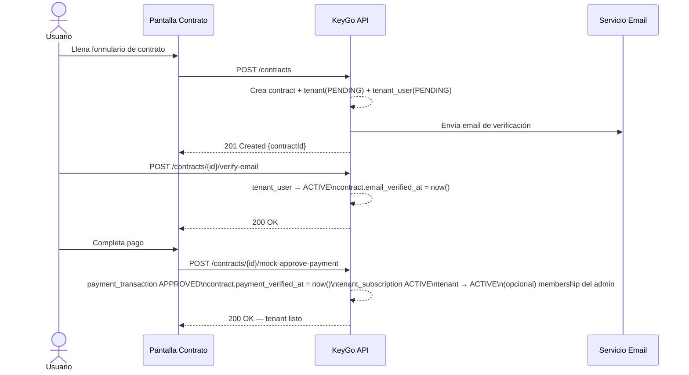

# Plan de Modelo de Billing — KeyGo Server

> **Objetivo:** proponer entidades, flujo y decisión de arquitectura para el módulo de billing/suscripciones, aterrizados sobre el modelo de datos actual, sin romper lo existente.

---

## Contexto

En el modelo actual, `memberships` ya significa **acceso del usuario a una app**, no _suscripción comercial_. Conviene separar ambos conceptos desde el nombre para que no se contamine el dominio.

La base actual (`tenants`, `tenant_users`, `client_apps`, `memberships`, `sessions`, `refresh_tokens`, `email_verifications`) da una base sólida para montar el flujo comercial encima sin romper lo existente.

---

## Decisión de arquitectura

**¿Mismo backend o microservicio separado?**

**Recomendación: misma REST API por ahora, como módulo/bounded context separado dentro del backend actual.**

### Razón

El alta comercial crea o afecta varias piezas que ya viven en el mismo dominio: `tenants`, `tenant_users`, `email_verifications`, y después probablemente una `membership` hacia la app de consola/admin. Además, el modelo actual ya soporta estados `PENDING`/`ACTIVE`/`SUSPENDED` en `tenants`, `tenant_users` y `memberships`, y ya hay `email_verifications` para activar usuario por verificación de correo. Eso calza muy bien con un onboarding comercial pendiente de email y pago.

### Bounded contexts internos

| Bounded Context | Responsabilidad |
|---|---|
| **catalog** | Planes y límites |
| **contracting** | Proceso de contratación / onboarding |
| **billing** | Suscripción, cobros, facturas |
| **usage** | Medición y validación de consumo |

> **Extraer a microservicio solo si aparecen de verdad:** múltiples gateways de pago, facturación electrónica compleja, prorrateos, dunning, notas de crédito, ERP externo, impuestos por país, o alto volumen de eventos de uso.

---

## Separación conceptual necesaria

| Concepto | Significado |
|---|---|
| **Plan** | Lo que se vende |
| **Contract / Subscription Order** | La solicitud inicial que nace desde la pantalla "Contrato" |
| **Tenant Subscription** | La suscripción activa y recurrente del tenant |
| **Membership** | Acceso de un usuario a una app concreta dentro del tenant _(concepto IAM, ya existente)_ |

> Esto evita mezclar acceso IAM con billing.

---

## Modelo de datos propuesto

### 1. `plans` — Catálogo visible en la web

| Campo | Notas |
|---|---|
| `id` | PK UUID |
| `code` | Único |
| `name` | |
| `description` | |
| `status` | `ACTIVE` \| `INACTIVE` |
| `is_public` | Visible en web |
| `created_at` | |
| `updated_at` | |

---

### 2. `plan_versions` — Versiones del plan

> ⚠️ **Importante:** no hacer que la suscripción apunte directo a `plans` porque el plan cambia en el tiempo. Así una suscripción queda congelada contra una versión concreta y no se rompe el histórico.

| Campo | Notas |
|---|---|
| `id` | PK UUID |
| `plan_id` | FK → `plans` |
| `version` | |
| `currency` | |
| `billing_period` | `MONTHLY` \| `YEARLY` |
| `base_price` | |
| `setup_fee` | |
| `trial_days` | |
| `effective_from` | |
| `effective_to` | |
| `status` | |

---

### 3. `plan_entitlements` — Límites y features por versión

| Campo | Notas |
|---|---|
| `id` | PK UUID |
| `plan_version_id` | FK → `plan_versions` |
| `metric_code` | Ver ejemplos abajo |
| `metric_type` | `QUOTA` \| `BOOLEAN` \| `RATE` |
| `limit_value` | |
| `period_type` | `NONE` \| `DAY` \| `MONTH` |
| `enforcement_mode` | `HARD` \| `SOFT` |
| `is_enabled` | |

**Ejemplos de `metric_code`:**

```
MAX_TENANT_USERS
MAX_CLIENT_APPS
MAX_ACTIVE_MEMBERSHIPS
AUTH_REQUESTS_PER_DAY
TOKEN_REQUESTS_PER_DAY
ALLOW_SSO
ALLOW_AUDIT_EXPORT
```

---

### 4. `contracts` — Solicitud inicial de contratación

> Representa lo que nace en la pantalla "Contrato". Da trazabilidad del proceso comercial, incluso si el tenant nunca termina activándose.

| Campo | Notas |
|---|---|
| `id` | PK UUID |
| `selected_plan_version_id` | FK → `plan_versions` |
| `billing_period` | |
| `status` | Ver estados abajo |
| `tenant_id` | Nullable — FK → `tenants` |
| `admin_user_id` | Nullable |
| `contractor_email` | |
| `contractor_first_name` | |
| `contractor_last_name` | |
| `company_name` | |
| `company_slug` | |
| `company_tax_id` | Nullable |
| `company_address` | Nullable |
| `email_verified_at` | Nullable |
| `payment_verified_at` | Nullable |
| `expires_at` | |
| `created_at` | |
| `updated_at` | |

**Estados del contrato:**

```
PENDING_EMAIL_VERIFICATION
PENDING_PAYMENT
READY_TO_ACTIVATE
ACTIVATED
CANCELLED
EXPIRED
FAILED
```

---

### 5. `tenant_subscriptions` — Suscripción real del tenant

| Campo | Notas |
|---|---|
| `id` | PK UUID |
| `tenant_id` | FK → `tenants` |
| `contract_id` | FK → `contracts` |
| `plan_version_id` | FK → `plan_versions` |
| `status` | Ver estados abajo |
| `current_period_start` | |
| `current_period_end` | |
| `cancel_at_period_end` | |
| `cancelled_at` | Nullable |
| `next_billing_at` | |
| `auto_renew` | |
| `created_at` | |
| `updated_at` | |

**Estados:**

```
PENDING
ACTIVE
PAST_DUE
SUSPENDED
CANCELLED
EXPIRED
```

---

### 6. `payment_transactions` — Transacciones de pago

> Aunque hoy el pago sea simulado, conviene crear la abstracción desde ya. Para el MVP, la "autovalidación de pago" puede ser un endpoint interno que genere una fila `APPROVED` con `provider = MOCK`.

| Campo | Notas |
|---|---|
| `id` | PK UUID |
| `contract_id` | Nullable — FK → `contracts` |
| `tenant_subscription_id` | Nullable — FK → `tenant_subscriptions` |
| `provider` | `MANUAL` \| `MOCK` \| `MERCADOPAGO` \| … |
| `provider_reference` | |
| `amount` | |
| `currency` | |
| `status` | Ver estados abajo |
| `paid_at` | Nullable |
| `raw_response` | Nullable (JSONB) |
| `created_at` | |

**Estados:**

```
PENDING
APPROVED
REJECTED
CANCELLED
EXPIRED
```

---

### 7. `invoices` — Facturas

> La factura debe ser un **snapshot histórico**, no una vista viva del plan. Los campos `*_snapshot` preservan los datos tal como estaban al momento de la factura.

| Campo | Notas |
|---|---|
| `id` | PK UUID |
| `tenant_subscription_id` | FK → `tenant_subscriptions` |
| `invoice_number` | |
| `status` | |
| `issue_date` | |
| `due_date` | |
| `period_start` | |
| `period_end` | |
| `currency` | |
| `subtotal` | |
| `tax_amount` | |
| `total` | |
| `billing_name_snapshot` | |
| `billing_tax_id_snapshot` | |
| `billing_address_snapshot` | |
| `plan_name_snapshot` | |
| `plan_version_snapshot` | |
| `pdf_url` | Nullable |
| `created_at` | |

---

### 8. `usage_counters` — Contadores de consumo

| Campo | Notas |
|---|---|
| `id` | PK UUID |
| `tenant_id` | FK → `tenants` |
| `metric_code` | |
| `period_start` | |
| `period_end` | |
| `used_value` | |
| `updated_at` | |

**Constraint:** `UNIQUE (tenant_id, metric_code, period_start, period_end)`

---

## Integración con el modelo actual

El modelo actual ya tiene `tenants`, `tenant_users`, `client_apps`, `memberships`, `membership_roles`, `sessions`, `refresh_tokens` y `email_verifications`.

- `memberships` define acceso del usuario a una app; un usuario necesita `membership ACTIVE` para autenticarse.
- `email_verifications` ya activa al usuario al verificar email.

### Flujo de onboarding comercial



**Pasos detallados:**

1. **Usuario llena la pantalla "Contrato"** → `POST /contracts`
   - Se crean: `contract`, `tenant` con `status = PENDING`, `tenant_user` admin con `status = PENDING`, registro en `email_verifications`

2. **Validación de email** → `tenant_user` pasa a `ACTIVE` según flujo actual; `contract.email_verified_at` se completa

3. **Pago aprobado** →
   - `contract.payment_verified_at` se completa
   - Se crea `tenant_subscription` en `ACTIVE`
   - `tenant` pasa a `ACTIVE`
   - _(Opcional)_ Se crea `membership` del admin hacia la app de consola con rol admin

---

## Validación de límites

### Límites estructurales

Se validan consultando o contando directamente sobre el modelo existente:

| Límite | Fuente |
|---|---|
| Cantidad de usuarios del tenant | `tenant_users` |
| Cantidad de apps del tenant | `client_apps` |
| Cantidad de memberships activas | `memberships` |

### Límites volumétricos

Se validan con contadores en `usage_counters`:

| Límite | `metric_code` |
|---|---|
| Peticiones de autenticación por día | `AUTH_REQUESTS_PER_DAY` |
| Tokens emitidos por día | `TOKEN_REQUESTS_PER_DAY` |
| Logins por día | _(metric_code propio)_ |

### Modos de enforcement

| Modo | Comportamiento |
|---|---|
| `HARD` | Bloquea la operación |
| `SOFT` | Permite pero registra alerta |
| `BOOLEAN` | Habilita o deshabilita una capability |

---

## Endpoints mínimos

### Catálogo

```
GET  /api/v1/plans
GET  /api/v1/plans/{planCode}
```

### Contratación

```
POST /api/v1/contracts
GET  /api/v1/contracts/{id}
POST /api/v1/contracts/{id}/resend-email-verification
POST /api/v1/contracts/{id}/mock-approve-payment
POST /api/v1/contracts/{id}/activate
```

### Suscripción

```
GET   /api/v1/tenants/{slug}/subscription
PATCH /api/v1/tenants/{slug}/subscription
POST  /api/v1/tenants/{slug}/subscription/cancel
POST  /api/v1/tenants/{slug}/subscription/renew
```

### Facturación

```
GET /api/v1/tenants/{slug}/invoices
GET /api/v1/invoices/{invoiceId}
```

### Uso y límites

```
GET /api/v1/tenants/{slug}/usage
GET /api/v1/tenants/{slug}/limits
```
