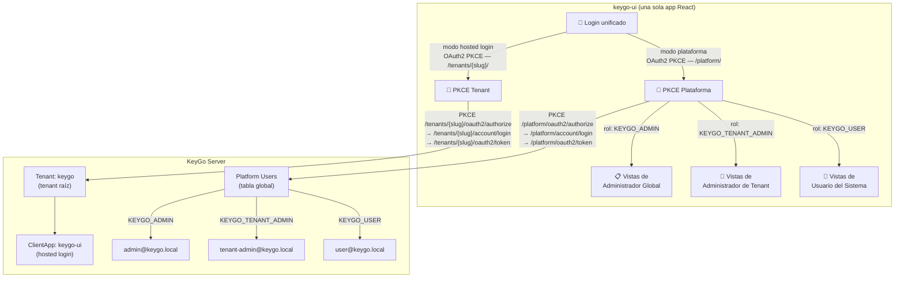
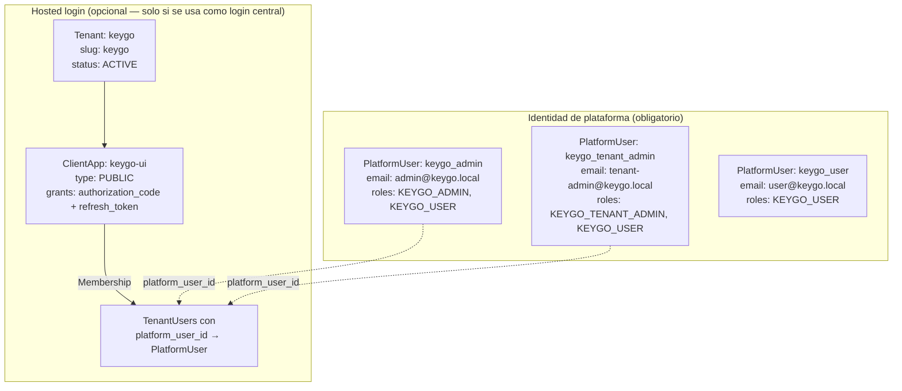
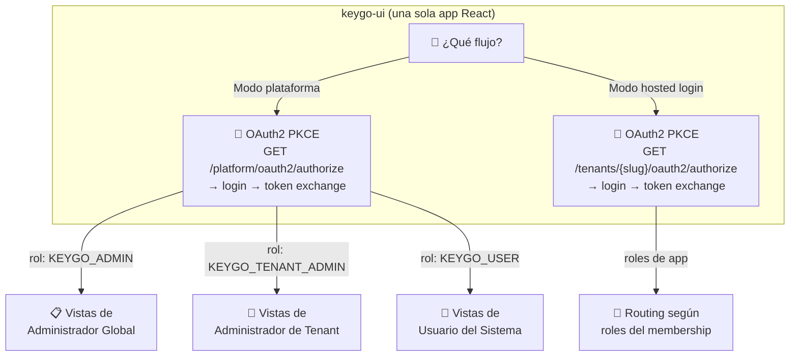
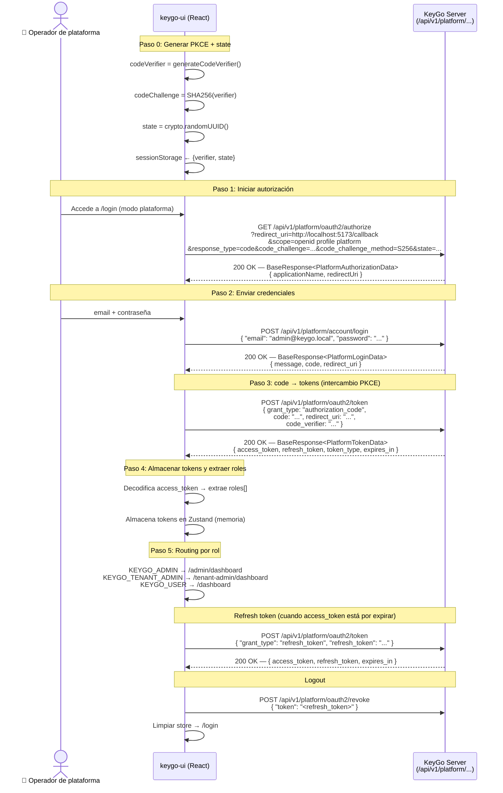
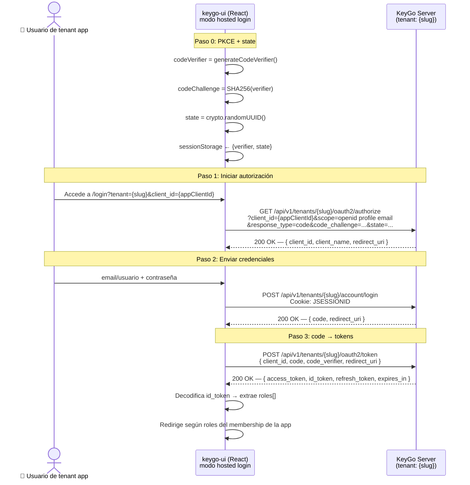
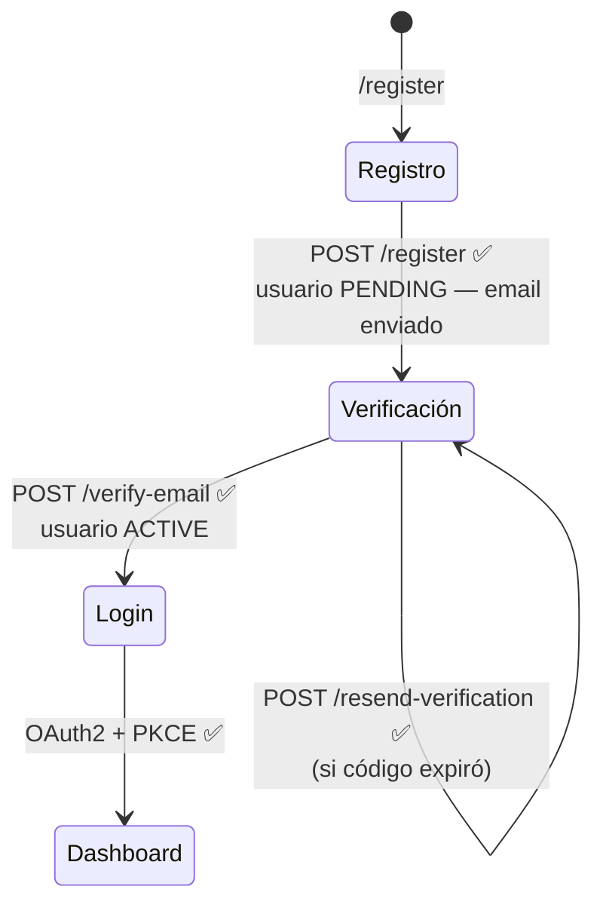
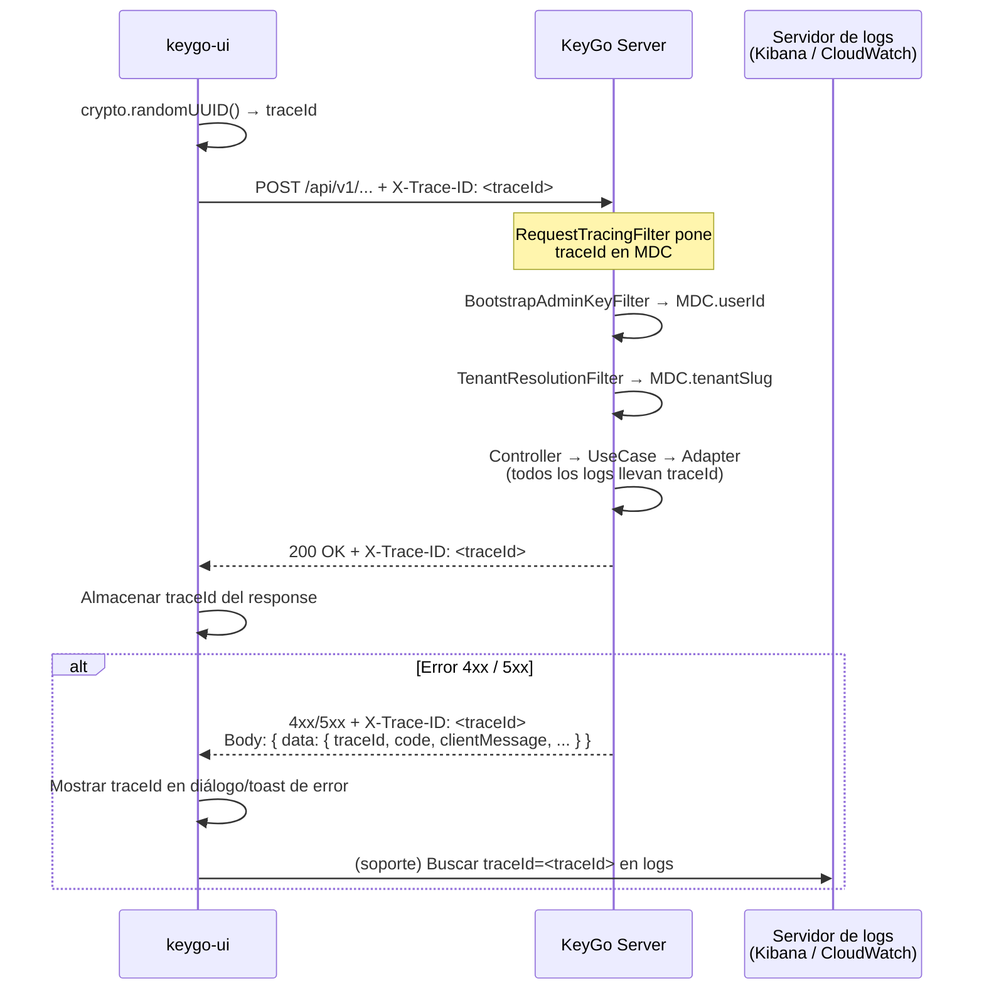
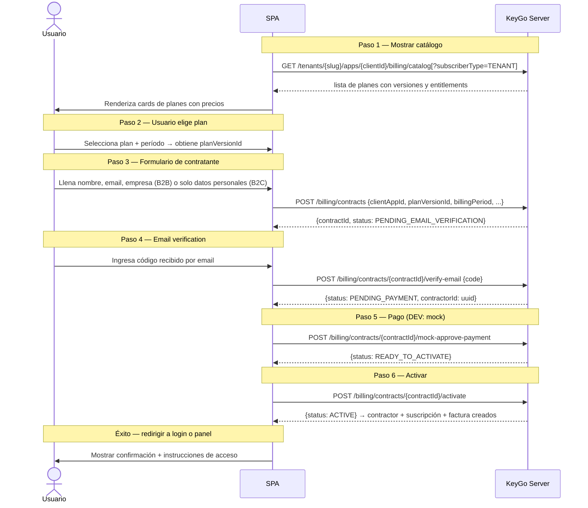

# Manual del Desarrollador Frontend — `keygo-ui`

> * **Audiencia:** Desarrolladores frontend que implementan la interfaz de usuario de KeyGo usando React. 
> * **Versión del backend:** KeyGo Server 1.0-SNAPSHOT (Fases 0-9b + Billing completadas, modelo contractor v2, respuestas de error mejoradas con `layer` + `fieldErrors`, Fase 10 pendiente).
> * **Fecha:** 2026-04-01
> * **Estado:** Documento vivo — se actualiza conforme avanza el backend.

---

## Tabla de contenidos

1. [Visión general y modelo unificado](#1-visión-general-y-modelo-unificado)
2. [Stack tecnológico recomendado](#2-stack-tecnológico-recomendado)
3. [Estructura del proyecto](#3-estructura-del-proyecto)
4. [Prerequisitos de backend para KeyGo-UI](#4-prerequisitos-del-backend-para-keygo-ui)
5. [Convenciones fundamentales del backend](#5-convenciones-fundamentales-del-backend)
6. [Flujos de autenticación — plataforma y tenant app](#6-flujos-de-autenticación--plataforma-y-tenant-app)
7. [Gestión de roles y routing condicional](#7-gestión-de-roles-y-routing-condicional)
8. [Vistas del rol `ADMIN` / `KEYGO_ADMIN` — Administrador Global de KeyGo](#8-vistas-del-rol-admin--administrador-global-de-keygo)
9. [Vistas del rol `ADMIN_TENANT` / `KEYGO_TENANT_ADMIN` — Administrador de Tenant](#9-vistas-del-rol-admin_tenant--administrador-de-tenant)
10. [Vistas del rol `USER_TENANT` / `KEYGO_USER` — Usuario del sistema](#10-vistas-del-rol-user_tenant--usuario-del-sistema)
11. [Perfil de usuario — compartido por todos los roles](#11-perfil-de-usuario--compartido-por-todos-los-roles)
12. [Gestión segura de tokens](#12-gestión-segura-de-tokens)
13. [Interceptores HTTP y manejo de errores](#13-interceptores-http-y-manejo-de-errores)
    - [13.4 Trazabilidad — header `X-Trace-ID`](#134-trazabilidad--header-x-trace-id)
14. [Inventario de endpoints — disponibles vs. pendientes](#14-inventario-de-endpoints--disponibles-vs-pendientes)
15. [Guía de mocking para features pendientes](#15-guía-de-mocking-para-features-pendientes)16. [Checklist de seguridad](#16-checklist-de-seguridad)
17. [Comandos de verificación del backend](#17-comandos-de-verificación-del-backend)
18. [Referencias](#18-referencias)

---

## 1. Visión general y modelo unificado

### 1.1. Una sola app, un solo login

`keygo-ui` debe entenderse en **dos modos complementarios**:

1. **Modo plataforma:** `keygo-ui` como aplicación React principal del SaaS. Usa **OAuth2 PKCE** contra los endpoints de plataforma (`/api/v1/platform/...`) para operadores y administradores. También existe un endpoint `direct-login` para uso desde API/CLI.
2. **Modo hosted login:** la misma UI de login reutilizada por otra SPA/app de otro tenant, usando el flujo **OAuth2/PKCE** con el `tenantSlug` + `client_id` + `redirect_uri` de la app origen.

Ambos modos usan el **mismo patrón PKCE** (generate verifier → authorize → login → token exchange). Lo que cambia es **la base de la URL** (`/platform/` vs `/tenants/{slug}/`) y **si se envía `client_id`**.



> Este diagrama representa ambos modos. Ambos usan **OAuth2 PKCE** pero contra endpoints distintos.
> En **modo plataforma**, `keygo-ui` ejecuta PKCE contra `/platform/` y autentica `platform_users`.
> En **modo hosted login**, la UI reutiliza el formulario de login pero ejecuta PKCE contra `/tenants/{slug}/` de la app origen.

### 1.2. Los tres roles (nombres actualizados)

| Rol nuevo | Rol legacy (aceptado) | ¿Quién es? | ¿Qué gestiona? |
|---|---|---|---|
| `KEYGO_ADMIN` | `ADMIN` | Operador del SaaS KeyGo (usuario de plataforma) | Todos los tenants, configuración global, usuarios de plataforma |
| `KEYGO_TENANT_ADMIN` | `ADMIN_TENANT` | Administrador de una organización | Su tenant: apps, usuarios, memberships, roles |
| `KEYGO_USER` | `USER_TENANT` | Cualquier usuario registrado en keygo-ui | Su perfil, contraseña, sesiones activas |

> ⚠️ **Compatibilidad:** el backend acepta **ambos** nombres (legacy y nuevo) en `@PreAuthorize`. Los JWT de plataforma emiten los nombres nuevos (`keygo_admin`, `keygo_tenant_admin`, `keygo_user`). El frontend debe reconocer ambos formatos durante la transición.

### 1.3. Modelo de autenticación — dos flujos diferenciados

Con la incorporación de la **capa de identidad de plataforma**, `keygo-ui` ahora utiliza **dos flujos de autenticación** según el contexto:

| Aspecto | Flujo de plataforma (KeyGo UI) | Flujo de tenant app (OAuth2/PKCE) |
|---|---|---|
| Caso de uso | Login de operadores de plataforma en `keygo-ui` | Login de usuarios de apps de tenant (hosted login o SPA propia) |
| Endpoints | `GET /platform/oauth2/authorize` → `POST /platform/account/login` → `POST /platform/oauth2/token` | `GET /tenants/{slug}/oauth2/authorize` → `POST /tenants/{slug}/account/login` → `POST /tenants/{slug}/oauth2/token` |
| Tipo de flujo | **OAuth2 Authorization Code + PKCE** | OAuth2 Authorization Code + PKCE |
| Alternativa API/CLI | `POST /platform/account/direct-login` (sin PKCE, para scripts/CLI) | — |
| Identidad | `platform_users` (tabla global, sin tenant) | `tenant_users` (scoped por tenant) |
| Roles en JWT | `keygo_admin`, `keygo_tenant_admin`, `keygo_user` | Roles de app vía memberships |
| Parámetro `client_id` | **No requerido** (implícito a la plataforma) | Requerido en authorize y token |
| Token refresh | `POST /api/v1/platform/oauth2/token` | `POST /tenants/{slug}/oauth2/token` |
| Token revoke | `POST /api/v1/platform/oauth2/revoke` | `POST /tenants/{slug}/oauth2/revoke` |
| Claims JWT | `sub`, `roles`, `email`, `type` — **sin** `tenant_slug`, `aud`, `scope` | `sub`, `roles`, `tenant_slug`, `aud`, `scope`, `iss` |

> ✅ **Estado actual:** ambos flujos usan el **mismo patrón PKCE** (generate verifier → authorize → login → token exchange). La diferencia es la base de la URL (`/platform/` vs `/tenants/{slug}/`) y la presencia de `client_id`.
>
> **Regla clave:** si el usuario accede a `keygo-ui` como operador/administrador de la plataforma, usa PKCE contra `/platform/`. Si `keygo-ui` presta su pantalla de login a una app de otro tenant, usa PKCE contra `/tenants/{slug}/` con el `client_id` de esa app. El endpoint `direct-login` existe exclusivamente para API/CLI — la SPA **nunca** lo usa.

---

## 2. Stack tecnológico recomendado

| Capa | Herramienta | Versión | Justificación |
|---|---|---|---|
| Bundler | **Vite** | 6.x | Build ultra rápido, HMR nativo, ESModules |
| Framework | **React** | 19.x | Ecosistema maduro, concurrent features |
| Lenguaje | **TypeScript** | 5.x | Tipado estricto para DTOs y ResponseCodes |
| Router | **React Router** | 7.x | Layouts anidados por rol, rutas tipadas, loaders |
| Estado global | **Zustand** | 5.x | Liviano, sin boilerplate, tokens en memoria |
| Fetching / caché | **TanStack Query** | 5.x | Invalidación automática, loading/error states |
| Formularios | **React Hook Form + Zod** | latest | Validación declarativa e inferida desde tipos |
| HTTP | **Axios** | 1.x | Interceptores para `Authorization: Bearer` |
| Estilos | **Tailwind CSS v4 + shadcn/ui** | latest | Accesibilidad, headless, personalizable |
| JWT (browser) | **jose** | 5.x | Verificación RS256 con JWKS + decodificación de claims |
| PKCE | **Web Crypto API** | nativo | Sin dependencias externas para SHA-256 + Base64URL |
| Testing | **Vitest + Testing Library + MSW** | latest | Mocks de API sin levantar servidor |

---

## 3. Estructura del proyecto

Una sola aplicación con layouts y rutas diferenciadas por rol:

```
keygo-ui/
├── src/
│   ├── auth/
│   │   ├── pkce.ts            # generateCodeVerifier, generateCodeChallenge, generateState
│   │   ├── tokenStore.ts      # Zustand store: accessToken, idToken, refreshToken, roles
│   │   ├── roleGuard.tsx      # <RoleGuard> y <AuthGuard> para proteger rutas
│   │   ├── refresh.ts         # Silent refresh automático (80% del TTL) — flujo tenant app
│   │   ├── platformRefresh.ts # Silent refresh para tokens de plataforma (§6.0b)
│   │   ├── jwksVerify.ts      # Verificación RS256 con jose + JWKS + decodeIdToken
│   │   ├── logout.ts          # POST /oauth2/revoke + limpiar store (flujo tenant app)
│   │   └── platformLogout.ts  # POST /platform/oauth2/revoke + limpiar store
│   │
│   ├── api/
│   │   ├── client.ts          # Instancia Axios base + interceptores + constantes
│   │   ├── platformUsers.ts   # Endpoints CRUD de usuarios de plataforma (KEYGO_ADMIN)
│   │   ├── tenants.ts         # Endpoints de Control Plane (ADMIN)
│   │   ├── clientApps.ts      # Endpoints de ClientApps (ADMIN_TENANT)
│   │   ├── users.ts           # Endpoints de Usuarios (ADMIN_TENANT)
│   │   ├── memberships.ts     # Endpoints de Memberships y Roles (ADMIN_TENANT)
│   │   └── userinfo.ts        # Endpoint UserInfo (todos)
│   │
│   ├── layouts/
│   │   ├── RootLayout.tsx         # Shell principal (topbar, sidebar adaptativo)
│   │   ├── AdminLayout.tsx        # Layout extendido para ADMIN
│   │   ├── TenantAdminLayout.tsx  # Layout para ADMIN_TENANT (provee ctx del tenant)
│   │   └── UserLayout.tsx         # Layout mínimo para USER_TENANT
│   │
│   ├── pages/
│   │   ├── login/
│   │   │   ├── LoginPage.tsx        # Formulario de credenciales (flujo tenant app — Pasos 0, 1 y 2)
│   │   │   ├── PlatformLoginPage.tsx # Login PKCE de plataforma (§6.0b)
│   │   │   └── CallbackPage.tsx     # Intercambio code → token (Paso 3) + routing por rol
│   │   ├── register/
│   │   │   ├── RegisterPage.tsx     # Auto-registro (público)
│   │   │   ├── VerifyEmailPage.tsx  # Verificar código recibido por email
│   │   │   └── ResendPage.tsx       # Reenviar código si expiró
│   │   ├── admin/                   # Solo accesible con rol ADMIN / KEYGO_ADMIN
│   │   │   ├── DashboardPage.tsx
│   │   │   ├── TenantsPage.tsx      # ⏳ Listar tenants (mock)
│   │   │   ├── CreateTenantPage.tsx
│   │   │   ├── TenantDetailPage.tsx
│   │   │   └── PlatformUsersPage.tsx # ✅ Gestión de platform_users (§8.6)
│   │   ├── tenant-admin/            # Accesible con ADMIN o ADMIN_TENANT
│   │   │   ├── DashboardPage.tsx
│   │   │   ├── AppsPage.tsx
│   │   │   ├── UsersPage.tsx
│   │   │   └── MembershipsPage.tsx
│   │   ├── user/
│   │   │   └── DashboardPage.tsx    # Dashboard para USER_TENANT
│   │   └── shared/                  # Todos los roles autenticados
│   │       ├── ProfilePage.tsx
│   │       ├── ChangePasswordPage.tsx  # ✅ backend listo
│   │       ├── SessionsPage.tsx        # ✅ backend listo
│   │       ├── NotificationPreferencesPage.tsx  # ✅ backend listo
│   │       └── AccessPage.tsx          # ✅ backend listo
│   │
│   ├── components/
│   │   ├── BaseResponseHandler.tsx   # Manejo centralizado de BaseResponse<T>
│   │   ├── RoleAwareNav.tsx          # Sidebar/menú adaptativo por rol
│   │   ├── PendingFeatureBadge.tsx   # Badge "Próximamente"
│   │   └── SecretRevealModal.tsx     # clientSecret — mostrar solo una vez
│   │
│   ├── hooks/
│   │   ├── useCurrentUser.ts    # UserInfo desde tokenStore + GET /userinfo
│   │   ├── useHasRole.ts        # Comprueba rol del JWT
│   │   └── useManagedTenant.ts  # Slug del tenant que gestiona el ADMIN_TENANT
│   │
│   ├── types/
│   │   ├── base.ts       # BaseResponse<T>, MessageResponse
│   │   ├── tenant.ts     # TenantData, CreateTenantRequest
│   │   ├── clientapp.ts  # ClientAppData, CreateClientAppRequest
│   │   ├── user.ts       # TenantUserData, CreateUserRequest
│   │   ├── auth.ts       # TokenData, PlatformTokenData, UserInfoData, KeyGoJwtClaims, PlatformJwtClaims
│   │   └── roles.ts      # AppRole enum + PlatformRole enum + helpers (isAdmin, isTenantAdmin)
│   │
│   ├── mocks/
│   │   ├── handlers.ts   # MSW — handlers para endpoints pendientes
│   │   └── browser.ts    # setupWorker de MSW
│   │
│   ├── router.tsx        # Definición de rutas + guardias por rol
│   ├── App.tsx
│   └── main.tsx
│
├── .env.local            # Variables de entorno locales (NO commitear)
├── vite.config.ts
└── package.json
```

---

## 4. Prerequisitos del backend para `keygo-ui`

KeyGo UI opera en **dos modos** que requieren pre-requisitos distintos:

| Modo             | Descripción                               | Prerequisito                                                |
|------------------|-------------------------------------------|-------------------------------------------------------------|
| **Plataforma**   | Admin global, gestión de tenants, billing | `platform_users` + `platform_roles` (pre-sembrados por V29) |
| **Hosted login** | Login page para apps de otros tenants     | Tenant `keygo` + ClientApp `keygo-ui` (opcional)            |

### 4.1. Estructura requerida en el backend



> **Nota:** la autenticación de plataforma (`/api/v1/platform/oauth2/authorize`) **no requiere** tenant ni ClientApp — usa la tabla `platform_users` directamente y valida redirect URIs contra la configuración `keygo.platform.allowed-redirect-uris`.

### 4.2. Setup inicial

> ⚠️ **Los usuarios de plataforma son pre-sembrados** por la migración `V29`. No es necesario crearlos manualmente. Solo ejecuta las migraciones Flyway.

```bash
BASE="http://localhost:8080/keygo-server/api/v1"

# ── Paso 0: los platform_users ya existen tras migrar ────────────────────────
# La migración V29 siembra estos usuarios en `platform_users`:
#   - admin@keygo.local      (KEYGO_ADMIN + KEYGO_USER)      — Admin global
#   - tenant-admin@keygo.local (KEYGO_TENANT_ADMIN + KEYGO_USER) — Admin de tenant
#   - user@keygo.local       (KEYGO_USER)                     — Usuario básico
#   - contractor@keygo.local (KEYGO_TENANT_ADMIN + KEYGO_USER) — Contractor
# Contraseña compartida (dev): Admin1234!

# ── Paso 1: obtener token de plataforma (direct-login, solo scripts/CLI) ─────
TOKEN=$(curl -s -X POST "$BASE/platform/account/direct-login" \
  -H "Content-Type: application/json" \
  -d '{"email":"admin@keygo.local","password":"Admin1234!"}' | jq -r '.data.access_token')
echo "TOKEN: $TOKEN"
# Nota: keygo-ui usa el flujo PKCE completo (authorize → login → token)

# ── Paso 2 (opcional): crear tenant keygo + ClientApp para hosted login ──────
# Solo necesario si keygo-ui opera como hosted login para apps de otros tenants.
curl -s -X POST "$BASE/tenants" \
  -H "Authorization: Bearer $TOKEN" -H "Content-Type: application/json" \
  -d '{"name":"KeyGo Platform","ownerEmail":"admin@keygo.local"}' | jq .

RESP=$(curl -s -X POST "$BASE/tenants/keygo/apps" \
  -H "Authorization: Bearer $TOKEN" -H "Content-Type: application/json" \
  -d '{
    "name": "KeyGo UI",
    "description": "SPA oficial de KeyGo — hosted login",
    "type": "PUBLIC",
    "grants": ["AUTHORIZATION_CODE","REFRESH_TOKEN"],
    "scopes": ["openid","profile","email"],
    "redirectUris": ["http://localhost:5173/callback"]
  }')
CLIENT_ID=$(echo "$RESP" | jq -r '.data.clientId')
echo "CLIENT_ID: $CLIENT_ID"   # Usa este valor en VITE_HOSTED_LOGIN_CLIENT_ID
```

### 4.3. Variables de entorno del frontend

```bash
# .env.local — NO commitear este archivo
VITE_KEYGO_BASE=http://localhost:8080/keygo-server

# ── Auth de plataforma (siempre requerido) ───────────────────────────────────
VITE_PLATFORM_REDIRECT_URI=http://localhost:5173/callback

# ── Hosted login para tenant apps (opcional) ─────────────────────────────────
VITE_HOSTED_LOGIN_TENANT_SLUG=keygo
VITE_HOSTED_LOGIN_CLIENT_ID=keygo-ui    # clientId del paso 2 del bootstrap

# MSW — mocks para endpoints pendientes (solo desarrollo)
VITE_MOCK_ENABLED=true
VITE_MOCK_ROLE=KEYGO_ADMIN    # KEYGO_ADMIN | KEYGO_TENANT_ADMIN | KEYGO_USER
VITE_MOCK_TENANT_SLUG=acme-corp
```

---

## 5. Convenciones fundamentales del backend

### 5.1. Envelope `BaseResponse<T>`

```typescript
// src/types/base.ts
export interface MessageResponse {
  code: string;
  message: string;
}

export interface BaseResponse<T = void> {
  date: string;
  success?: MessageResponse;
  failure?: MessageResponse;
  data?: T;
  debug?: MessageResponse;
  throwable?: string;
}

// Clasificacion del origen del error (campo `data.origin` en respuestas de error)
export type ErrorOrigin =
  | 'CLIENT_REQUEST'    // Error causado por la solicitud del cliente
  | 'BUSINESS_RULE'     // Regla de negocio que impide la operacion
  | 'SERVER_PROCESSING'; // Error interno del servidor

// Sub-clasificacion de errores de cliente (solo presente cuando origin === 'CLIENT_REQUEST')
export type ClientRequestCause =
  | 'USER_INPUT'        // Datos ingresados por el usuario (credenciales, campos de formulario)
  | 'CLIENT_TECHNICAL'; // Problema de integracion tecnica (cookie faltante, parametro mal construido)

/**
 * Error de validacion en un campo especifico.
 * Solo aparece en errores 400 INVALID_INPUT cuando se usa @Valid / @Validated en el backend.
 * El campo `rejectedValue` solo aparece en perfiles dev/local.
 */
export interface FieldValidationError {
  /** Nombre del campo (o parametro) que fallo validacion */
  field: string;
  /** Mensaje de validacion legible (ej: "must not be blank", "must be >= 1") */
  message: string;
  /** Valor que fue rechazado — solo presente en perfiles dev/local */
  rejectedValue?: unknown;
}

/**
 * Estructura del campo `data` en respuestas de error.
 * BaseResponse<ErrorData> — envelope de todos los errores de la API.
 *
 * Guia de uso:
 *  - origin === 'CLIENT_REQUEST' && clientRequestCause === 'USER_INPUT'
 *      → mostrar clientMessage junto al formulario/campo
 *      → si hay fieldErrors, mostrar cada error inline en su campo
 *  - origin === 'CLIENT_REQUEST' && clientRequestCause === 'CLIENT_TECHNICAL'
 *      → revisar integracion tecnica; NO mostrar como culpa del usuario
 *  - origin === 'BUSINESS_RULE'
 *      → mostrar clientMessage; ofrecer accion alternativa si aplica
 *  - origin === 'SERVER_PROCESSING'
 *      → mostrar mensaje generico de reintento; loguear en monitoreo
 *
 * Nota sobre `layer`: indica la capa arquitectonica donde ocurrio el error.
 *   Valores posibles: 'DOMAIN' | 'USE_CASE' | 'PORT' | 'CONTROLLER' | null
 *   Util para telemetria y diagnostico — no mostrar al usuario final.
 */
export interface ErrorData {
  /** ResponseCode del error (mismo valor que failure.code) */
  code: string;
  /**
   * Capa arquitectonica que origino el error.
   * Valores: 'DOMAIN' | 'USE_CASE' | 'PORT' | 'CONTROLLER'
   * Ausente si el error no proviene de una excepcion tipada KeyGo.
   * Util para telemetria — no mostrar al usuario.
   */
  layer?: string;
  /** Origen del error */
  origin: ErrorOrigin;
  /** Sub-causa de errores de cliente (ausente si origin != 'CLIENT_REQUEST') */
  clientRequestCause?: ClientRequestCause;
  /** Mensaje amigable en espanol listo para mostrar al usuario */
  clientMessage: string;
  /** Detalle tecnico del error — solo en perfiles dev/local */
  detail?: string;
  /** Nombre de la clase de excepcion — solo en perfiles dev/local */
  exception?: string;
  /**
   * Errores por campo — solo presente en errores 400 INVALID_INPUT con @Valid / @Validated.
   * Usar para mostrar mensajes inline junto a cada campo del formulario.
   */
  fieldErrors?: FieldValidationError[];
}

/** Alias tipado para respuestas de error de la API */
export type ErrorResponse = BaseResponse<ErrorData>;
```

**Ejemplo de error `400 INVALID_INPUT` con validación de campos (`@Valid`):**

```json
{
  "date": "2026-04-01T10:00:00Z",
  "failure": {
    "code": "INVALID_INPUT",
    "message": "Invalid input data provided"
  },
  "data": {
    "code": "INVALID_INPUT",
    "origin": "CLIENT_REQUEST",
    "clientRequestCause": "USER_INPUT",
    "clientMessage": "Revisa los datos enviados e intenta otra vez.",
    "fieldErrors": [
      { "field": "name", "message": "must not be blank" },
      { "field": "ownerEmail", "message": "must be a well-formed email address" }
    ]
  }
}
```

> ℹ️ `detail` y `exception` solo aparecen en perfiles **dev** y **local**. En producción quedan omitidos.  
> ℹ️ `layer` solo aparece si la excepción es una subclase de `KeyGoException` (excepciones tipadas del dominio/app). Para errores de Spring (`MethodArgumentNotValidException`, etc.) estará ausente.  
> ℹ️ `rejectedValue` dentro de `fieldErrors` solo aparece en perfiles **dev/local**.

### 5.2. Roles — enum

```typescript
// src/types/roles.ts

/** Roles legacy (aún aceptados por @PreAuthorize del backend) */
export const AppRole = {
  ADMIN:        'ADMIN',
  ADMIN_TENANT: 'ADMIN_TENANT',
  USER_TENANT:  'USER_TENANT',
} as const;

/** Roles de plataforma (nuevos, emitidos en JWT de platform_users) */
export const PlatformRole = {
  KEYGO_ADMIN:        'KEYGO_ADMIN',
  KEYGO_TENANT_ADMIN: 'KEYGO_TENANT_ADMIN',
  KEYGO_USER:         'KEYGO_USER',
} as const;

/** Unión de todos los roles reconocidos por la UI */
export const AllRoles = { ...AppRole, ...PlatformRole } as const;
export type AllRoleValue = typeof AllRoles[keyof typeof AllRoles];

/** Helpers para verificar equivalencias legacy ↔ nuevo */
export function isAdmin(role: string): boolean {
  return role === AppRole.ADMIN || role === PlatformRole.KEYGO_ADMIN;
}
export function isTenantAdmin(role: string): boolean {
  return role === AppRole.ADMIN_TENANT || role === PlatformRole.KEYGO_TENANT_ADMIN;
}
export function isUser(role: string): boolean {
  return role === AppRole.USER_TENANT || role === PlatformRole.KEYGO_USER;
}

export type AppRoleValue = typeof AppRole[keyof typeof AppRole];
```

### 5.3. Claims del JWT de KeyGo

Existen **dos estructuras de claims** según el flujo de autenticación:

#### 5.3.1. Claims del JWT de plataforma (`POST /platform/oauth2/token` o `POST /platform/account/direct-login`)

```typescript
// src/types/auth.ts
export interface PlatformJwtClaims {
  sub:     string;    // UUID del PlatformUser
  email:   string;
  roles:   string[];  // ["keygo_admin", "keygo_user"]
  type:    'access_token' | 'refresh_token';
  iat:     number;
  exp:     number;
  // ⚠️ NO tiene: tenant_slug, aud, scope, iss, client_id
}
```

Ejemplo de payload decodificado:

```json
{
  "sub": "00000000-0000-4000-a000-000000000001",
  "roles": ["keygo_admin", "keygo_user"],
  "email": "admin@keygo.local",
  "type": "access_token",
  "iat": 1712345678,
  "exp": 1712349278
}
```

#### 5.3.2. Claims del JWT de tenant app (OAuth2/PKCE)

```typescript
export interface KeyGoJwtClaims {
  sub:                 string;    // UUID del TenantUser (o client_id en M2M)
  email?:              string;
  name?:               string;
  preferred_username?: string;
  iss:                 string;    // "http://localhost:8080/keygo-server/api/v1/tenants/{slug}"
  aud:                 string;    // client_id (ej: "keygo-ui")
  iat:                 number;
  exp:                 number;
  scope:               string;
  roles?:              string[];  // ✅ Roles de app vía memberships
  tenant_slug?:        string;    // ✅ Access token admin: scope de tenant para autorización
}
```

### 5.4. URLs base

```typescript
// src/api/client.ts — constantes
export const KEYGO_BASE = import.meta.env.VITE_KEYGO_BASE;
export const API_V1     = `${KEYGO_BASE}/api/v1`;
export const TENANT     = import.meta.env.VITE_TENANT_SLUG ?? 'keygo';
export const CLIENT_ID  = import.meta.env.VITE_CLIENT_ID  ?? 'keygo-ui';

export const tenantUrl = (slug: string) => `${API_V1}/tenants/${slug}`;
export const appUrl    = (slug: string, clientId: string) =>
  `${tenantUrl(slug)}/apps/${clientId}`;
export const keygoUrl  = tenantUrl(TENANT);   // Atajo para tenant keygo
```

---

## 6. Flujos de autenticación — plataforma y tenant app

`keygo-ui` soporta **dos flujos de autenticación** independientes, ambos basados en **OAuth2 PKCE**. El frontend debe determinar cuál usar según el contexto:

| Flujo | Cuándo usarlo | Sección |
|---|---|---|
| **Plataforma: OAuth2 PKCE** | `keygo-ui` como app principal del SaaS (administradores, operadores) | §6.0b |
| **Tenant App: OAuth2/PKCE** | `keygo-ui` como hosted login para apps de otros tenants | §6.1–6.4 |



### 6.0. Dos flujos diferenciados

- **Flujo de plataforma (§6.0b):** `keygo-ui` ejecuta el flujo completo OAuth2 PKCE contra los endpoints `/api/v1/platform/`. Genera `code_verifier`/`code_challenge`, llama a `GET /platform/oauth2/authorize`, luego `POST /platform/account/login` para obtener un authorization code, y finalmente intercambia el code por tokens en `POST /platform/oauth2/token`. **No requiere `client_id` ni contexto de tenant.**

- **Flujo de tenant app (§6.1–6.4):** cuando `keygo-ui` actúa como hosted login para una app de otro tenant, sigue el mismo patrón PKCE pero contra `/api/v1/tenants/{slug}/`. Requiere `client_id` y `redirect_uri` de la app destino.

> 💡 **Nota:** existe `POST /api/v1/platform/account/direct-login` como alternativa **solo para API/CLI** (email+password → tokens en un solo paso, sin PKCE). La SPA **nunca** debe usar este endpoint.

### 6.0b. Flujo de plataforma: OAuth2 PKCE

Este flujo es el que usa `keygo-ui` para su login principal. Sigue el **mismo patrón PKCE** que el flujo de tenant app pero contra los endpoints `/api/v1/platform/` y **sin `client_id`**.



> 💡 **`direct-login` (solo API/CLI):** existe `POST /api/v1/platform/account/direct-login` que acepta email+password y retorna tokens en un solo paso, **sin PKCE**. Este endpoint es exclusivo para scripts, CLI y pruebas automatizadas. La SPA **nunca** debe usarlo porque no tiene protección contra ataques de intercepción.

#### Tipos TypeScript para el flujo de plataforma

```typescript
// src/types/auth.ts

// Respuesta del paso 1: authorize
export interface PlatformAuthorizationData {
  applicationName: string;
  redirectUri:     string;
}

// Respuesta del paso 2: login → authorization code
export interface PlatformLoginData {
  message:      string;
  code:         string;
  redirect_uri: string;
}

// Respuesta del paso 3: token exchange
export interface PlatformTokenData {
  access_token:  string;
  refresh_token: string;
  token_type:    'Bearer';
  expires_in:    number;   // segundos
}

export interface PlatformLoginRequest {
  email:    string;
  password: string;
}
```

#### Ejemplo de implementación: PlatformLoginPage (PKCE)

```typescript
// src/pages/login/PlatformLoginPage.tsx
import { useState, useEffect } from 'react';
import { useNavigate } from 'react-router-dom';
import { useTokenStore } from '@/auth/tokenStore';
import { API_V1 } from '@/api/client';
import { generateCodeVerifier, generateCodeChallenge, generateState } from '@/auth/pkce';
import type {
  PlatformAuthorizationData,
  PlatformLoginData,
  PlatformTokenData,
  PlatformJwtClaims,
} from '@/types/auth';
import type { BaseResponse, ErrorData } from '@/types/base';
import { isAdmin, isTenantAdmin } from '@/types/roles';
import { decodeJwt } from 'jose';

const REDIRECT_URI = import.meta.env.VITE_REDIRECT_URI
  ?? 'http://localhost:5173/callback';

export function PlatformLoginPage() {
  const [error, setError] = useState<string | null>(null);
  const [loading, setLoading] = useState(false);
  const [authorized, setAuthorized] = useState(false);
  const { setTokens } = useTokenStore();
  const navigate = useNavigate();

  // Paso 0 + 1: generar PKCE y llamar a authorize
  useEffect(() => {
    (async () => {
      const verifier  = generateCodeVerifier();
      const challenge = await generateCodeChallenge(verifier);
      const state     = generateState();

      sessionStorage.setItem('platform_pkce_verifier', verifier);
      sessionStorage.setItem('platform_pkce_state', state);

      const params = new URLSearchParams({
        redirect_uri:          REDIRECT_URI,
        scope:                 'openid profile platform',
        response_type:         'code',
        code_challenge:        challenge,
        code_challenge_method: 'S256',
        state,
      });

      const res = await fetch(
        `${API_V1}/platform/oauth2/authorize?${params}`
      );
      const body: BaseResponse<PlatformAuthorizationData> = await res.json();

      if (!res.ok || body.failure) {
        setError(body.failure?.message ?? 'Error al iniciar autorización');
        return;
      }
      setAuthorized(true);
    })();
  }, []);

  // Paso 2: enviar credenciales → obtener code
  // Paso 3: intercambiar code por tokens
  const handleSubmit = async (e: React.FormEvent<HTMLFormElement>) => {
    e.preventDefault();
    setLoading(true);
    setError(null);

    const fd = new FormData(e.currentTarget);

    // Paso 2: login → authorization code
    const loginRes = await fetch(`${API_V1}/platform/account/login`, {
      method: 'POST',
      headers: { 'Content-Type': 'application/json' },
      body: JSON.stringify({
        email:    fd.get('email'),
        password: fd.get('password'),
      }),
    });
    const loginBody: BaseResponse<PlatformLoginData> = await loginRes.json();

    if (!loginRes.ok || loginBody.failure) {
      setLoading(false);
      const errorData = loginBody.data as unknown as ErrorData | undefined;
      setError(errorData?.clientMessage ?? loginBody.failure?.message ?? 'Error de autenticación');
      return;
    }

    const { code, redirect_uri } = loginBody.data!;
    const verifier = sessionStorage.getItem('platform_pkce_verifier')!;

    // Paso 3: code → tokens (PKCE exchange)
    const tokenRes = await fetch(`${API_V1}/platform/oauth2/token`, {
      method: 'POST',
      headers: { 'Content-Type': 'application/json' },
      body: JSON.stringify({
        grant_type:    'authorization_code',
        code,
        redirect_uri,
        code_verifier: verifier,
      }),
    });
    const tokenBody: BaseResponse<PlatformTokenData> = await tokenRes.json();
    setLoading(false);

    if (!tokenRes.ok || tokenBody.failure) {
      setError(tokenBody.failure?.message ?? 'Error al obtener tokens');
      return;
    }

    // Limpiar PKCE de sessionStorage
    sessionStorage.removeItem('platform_pkce_verifier');
    sessionStorage.removeItem('platform_pkce_state');

    const { access_token, refresh_token, expires_in } = tokenBody.data!;
    const claims = decodeJwt(access_token) as PlatformJwtClaims;
    const roles = claims.roles ?? [];

    setTokens({
      accessToken: access_token,
      refreshToken: refresh_token,
      expiresIn: expires_in,
      roles,
    });

    schedulePlatformRefresh(expires_in);

    // Routing por rol de plataforma
    if (roles.some(isAdmin))            navigate('/admin/dashboard');
    else if (roles.some(isTenantAdmin)) navigate('/tenant-admin/dashboard');
    else                                navigate('/dashboard');
  };

  return (
    <div className="min-h-screen flex items-center justify-center">
      <form onSubmit={handleSubmit} className="w-full max-w-sm space-y-4 p-8 rounded-xl shadow">
        <h1 className="text-2xl font-bold text-center">KeyGo Platform</h1>
        {error && <p className="text-destructive text-sm">{error}</p>}
        {!authorized && !error && <p className="text-muted-foreground text-sm">Iniciando...</p>}
        <input name="email" type="email" placeholder="Email" required className="input" disabled={!authorized} />
        <input name="password" type="password" placeholder="Contraseña" required className="input" disabled={!authorized} />
        <button type="submit" disabled={loading || !authorized} className="btn btn-primary w-full">
          {loading ? 'Iniciando...' : 'Iniciar sesión'}
        </button>
      </form>
    </div>
  );
}
```

#### Refresh y logout de plataforma

```typescript
// src/auth/platformRefresh.ts
import { useTokenStore } from './tokenStore';
import { API_V1 } from '@/api/client';
import { decodeJwt } from 'jose';

let timer: ReturnType<typeof setTimeout> | null = null;

export function schedulePlatformRefresh(expiresIn: number) {
  if (timer) clearTimeout(timer);
  timer = setTimeout(async () => {
    const { refreshToken, setTokens, clearTokens } = useTokenStore.getState();
    if (!refreshToken) return;
    try {
      const res = await fetch(`${API_V1}/platform/oauth2/token`, {
        method: 'POST',
        headers: { 'Content-Type': 'application/json' },
        body: JSON.stringify({ grant_type: 'refresh_token', refresh_token: refreshToken }),
      });
      const body = await res.json();
      if (body.failure) throw new Error();
      const { access_token, refresh_token: newRT, expires_in } = body.data;
      const claims = decodeJwt(access_token) as { roles?: string[] };
      setTokens({
        accessToken: access_token,
        refreshToken: newRT,
        expiresIn: expires_in,
        roles: claims.roles ?? [],
      });
      schedulePlatformRefresh(expires_in);
    } catch {
      clearTokens();
      window.location.href = '/login';
    }
  }, expiresIn * 0.8 * 1000);
}

export async function platformLogout() {
  const { refreshToken, clearTokens } = useTokenStore.getState();
  if (refreshToken) {
    await fetch(`${API_V1}/platform/oauth2/revoke`, {
      method: 'POST',
      headers: { 'Content-Type': 'application/json' },
      body: JSON.stringify({ token: refreshToken }),
    }).catch(() => {});
  }
  clearTokens();
  window.location.href = '/login';
}
```

### 6.1. Flujo de tenant app: OAuth2/PKCE — diagrama base (modo hosted login)

> 📌 **Nota:** el flujo de plataforma (§6.0b) sigue **el mismo patrón PKCE** descrito aquí. Las diferencias son:
> - **Plataforma:** endpoints bajo `/api/v1/platform/`, sin `tenantSlug` ni `client_id` en la URL/params.
> - **Tenant app:** endpoints bajo `/api/v1/tenants/{slug}/`, requiere `client_id` en authorize y token exchange.
> - El componente `LoginPage` detecta qué flujo usar según el contexto. El componente `CallbackPage` envía el code al endpoint de token correcto.
> - Las utilidades PKCE (`generateCodeVerifier`, `generateCodeChallenge`, `generateState`) son **idénticas** para ambos flujos.



> **Nota:** Este flujo se usa exclusivamente cuando `keygo-ui` actúa como hosted login para una app de otro tenant. Para el login principal de `keygo-ui`, usar el flujo de plataforma (§6.0b).

### 6.2. Utilidades PKCE (flujo tenant app)

```typescript
// src/auth/pkce.ts
export function generateCodeVerifier(): string {
  const arr = new Uint8Array(64);
  crypto.getRandomValues(arr);
  return btoa(String.fromCharCode(...arr))
    .replace(/\+/g, '-').replace(/\//g, '_').replace(/=/g, '');
}

export async function generateCodeChallenge(verifier: string): Promise<string> {
  const data   = new TextEncoder().encode(verifier);
  const digest = await crypto.subtle.digest('SHA-256', data);
  return btoa(String.fromCharCode(...new Uint8Array(digest)))
    .replace(/\+/g, '-').replace(/\//g, '_').replace(/=/g, '');
}

export const generateState = () => crypto.randomUUID();
```

### 6.3. LoginPage — Pasos 0, 1 y 2 (flujo tenant app / hosted login)

> El siguiente ejemplo corresponde al **modo hosted login** donde `keygo-ui` presta su pantalla de login a una app de otro tenant.
> Para el login principal de operadores de plataforma, ver §6.0b (`PlatformLoginPage`).
> Si `keygo-ui` opera como hosted login central, el contexto OAuth debe resolverse dinámicamente y no desde constantes fijas.

```typescript
// src/pages/login/LoginPage.tsx
import { useState, useEffect } from 'react';
import { generateCodeVerifier, generateCodeChallenge, generateState } from '@/auth/pkce';
import { API_V1, TENANT, CLIENT_ID } from '@/api/client';
import type { ErrorData } from '@/types/base';

function resolveClientError(body: { failure?: { message?: string }; data?: ErrorData }): string {
  // Preferir siempre el mensaje de negocio/UI provisto por ErrorData
  return body.data?.clientMessage ?? body.failure?.message ?? 'No pudimos completar la solicitud.';
}

function isUserInputError(body: { data?: ErrorData }): boolean {
  return body.data?.origin === 'CLIENT_REQUEST' && body.data?.clientRequestCause === 'USER_INPUT';
}

export function LoginPage() {
  const [clientName, setClientName] = useState('KeyGo');
  const [error, setError] = useState<string | null>(null);
  const [loading, setLoading] = useState(false);
  const redirectUri = import.meta.env.VITE_REDIRECT_URI;

  // Pasos 0 y 1 al montar
  useEffect(() => {
    (async () => {
      const verifier = generateCodeVerifier();
      const challenge = await generateCodeChallenge(verifier);
      const state = generateState();
      sessionStorage.setItem('pkce_code_verifier', verifier);
      sessionStorage.setItem('oauth_state', state);

      const params = new URLSearchParams({
        client_id: CLIENT_ID,
        redirect_uri: redirectUri,
        scope: 'openid profile email',
        response_type: 'code',
        code_challenge: challenge,
        code_challenge_method: 'S256',
        state,
      });

      const res = await fetch(`${API_V1}/tenants/${TENANT}/oauth2/authorize?${params}`, {
        credentials: 'include', // cookie JSESSIONID
      });
      const body = await res.json();
      if (body.success) {
        setClientName(body.data?.client_name ?? 'KeyGo');
        return;
      }

      setError(resolveClientError(body));
    })();
  }, []);

  // Paso 2: enviar credenciales
  const handleSubmit = async (e: React.FormEvent<HTMLFormElement>) => {
    e.preventDefault();
    setLoading(true);
    setError(null);

    const fd = new FormData(e.currentTarget);
    const res = await fetch(`${API_V1}/tenants/${TENANT}/account/login`, {
      method: 'POST',
      credentials: 'include',
      headers: { 'Content-Type': 'application/json' },
      body: JSON.stringify({
        emailOrUsername: fd.get('emailOrUsername'),
        password: fd.get('password'),
      }),
    });
    const body = await res.json();
    setLoading(false);

    if (!res.ok || body.failure) {
      const message = resolveClientError(body);

      // USER_INPUT: mostrar inline en formulario
      if (isUserInputError(body)) {
        setError(message);
        return;
      }

      // CLIENT_TECHNICAL / BUSINESS_RULE / SERVER_PROCESSING: mismo mensaje al usuario,
      // pero conviene loguear la metadata para diagnóstico del equipo.
      console.error('Login error metadata', body.data);
      setError(message);
      return;
    }

    const { code } = body.data;
    const oauthState = sessionStorage.getItem('oauth_state');
    window.location.href = `${redirectUri}?code=${code}&state=${oauthState}`;
  };

  return (
    <div className="min-h-screen flex items-center justify-center">
      <form onSubmit={handleSubmit} className="w-full max-w-sm space-y-4 p-8 rounded-xl shadow">
        <h1 className="text-2xl font-bold text-center">Iniciar sesión en {clientName}</h1>
        {error && <p className="text-destructive text-sm">{error}</p>}
        <input name="emailOrUsername" type="text" placeholder="Email o usuario" required className="input" />
        <input name="password" type="password" placeholder="Contraseña" required className="input" />
        <button type="submit" disabled={loading} className="btn btn-primary w-full">
          {loading ? 'Iniciando...' : 'Iniciar sesión'}
        </button>
        <p className="text-center text-sm">
          ¿No tienes cuenta? <a href="/register" className="underline text-primary">Regístrate</a>
        </p>
        <p className="text-center text-sm">
          <a href="#" className="text-muted-foreground cursor-not-allowed" title="Próximamente">
            ¿Olvidaste tu contraseña?
          </a>
        </p>
      </form>
    </div>
  );
}
```

Notas prácticas para `LoginPage`:
- Si `data.origin=CLIENT_REQUEST` y `data.clientRequestCause=USER_INPUT`, el problema es de datos capturados por el usuario (ej. credenciales inválidas).
- Si `data.origin=CLIENT_REQUEST` y `data.clientRequestCause=CLIENT_TECHNICAL`, el problema es de integración de la UI (ej. cookie de sesión, parámetros OAuth, endpoint equivocado).
- Si `data.origin=BUSINESS_RULE`, la solicitud fue técnicamente correcta pero bloqueada por reglas del dominio (ej. email no verificado).
- Si `data.origin=SERVER_PROCESSING`, mostrar mensaje genérico y recomendar reintento.

### 6.4. CallbackPage — Paso 3 + routing por rol (flujo tenant app)

```typescript
// src/pages/login/CallbackPage.tsx
import { useEffect } from 'react';
import { useNavigate } from 'react-router-dom';
import { useTokenStore } from '@/auth/tokenStore';
import { decodeIdToken } from '@/auth/jwksVerify';
import { scheduleRefresh } from '@/auth/refresh';
import { API_V1, TENANT, CLIENT_ID } from '@/api/client';
import { AppRole } from '@/types/roles';
import type { ErrorData } from '@/types/base';

function loginErrorQuery(body: { data?: ErrorData; failure?: { code?: string } }): string {
  const origin = body.data?.origin ?? 'UNKNOWN';
  const cause = body.data?.clientRequestCause ?? 'N_A';
  const code = body.data?.code ?? body.failure?.code ?? 'UNKNOWN';
  return `code=${encodeURIComponent(code)}&origin=${encodeURIComponent(origin)}&cause=${encodeURIComponent(cause)}`;
}

export function CallbackPage() {
  const navigate = useNavigate();
  const { setTokens } = useTokenStore();

  useEffect(() => {
    const params = new URLSearchParams(window.location.search);
    const code = params.get('code');
    const state = params.get('state');
    const savedState = sessionStorage.getItem('oauth_state');
    const verifier = sessionStorage.getItem('pkce_code_verifier');

    if (!code || state !== savedState || !verifier) {
      navigate('/login?error=invalid_state');
      return;
    }

    (async () => {
      const res = await fetch(`${API_V1}/tenants/${TENANT}/oauth2/token`, {
        method: 'POST',
        headers: { 'Content-Type': 'application/json' },
        body: JSON.stringify({
          client_id: CLIENT_ID,
          code,
          code_verifier: verifier,
          redirect_uri: import.meta.env.VITE_REDIRECT_URI,
        }),
      });
      const body = await res.json();

      if (!res.ok || body.failure) {
        // En token exchange, la app debe reiniciar el flujo completo.
        const errorQuery = loginErrorQuery(body);
        navigate(`/login?error=token_exchange_failed&${errorQuery}`);
        return;
      }

      const { access_token, id_token, refresh_token, expires_in } = body.data;
      const claims = decodeIdToken(id_token);
      const roles = (claims.roles as string[]) ?? [];

      setTokens({
        accessToken: access_token,
        idToken: id_token,
        refreshToken: refresh_token,
        expiresIn: expires_in,
        roles,
      });
      scheduleRefresh(TENANT, CLIENT_ID, expires_in);

      sessionStorage.removeItem('pkce_code_verifier');
      sessionStorage.removeItem('oauth_state');

      if (roles.includes(AppRole.ADMIN)) navigate('/admin/dashboard');
      else if (roles.includes(AppRole.ADMIN_TENANT)) navigate('/tenant-admin/dashboard');
      else navigate('/dashboard');
    })();
  }, []);

  return (
    <div className="min-h-screen flex items-center justify-center">
      <p>Procesando autenticación...</p>
    </div>
  );
}
```

Nota de UX para callback:
- No intentar reutilizar un `authorization_code` previo: puede estar expirado o consumido.


## 7. Gestión de roles y routing condicional

### 7.1. Hook `useHasRole`

```typescript
// src/hooks/useHasRole.ts
import { useTokenStore } from '@/auth/tokenStore';
import { AppRole, PlatformRole, isAdmin, isTenantAdmin } from '@/types/roles';
import type { AllRoleValue } from '@/types/roles';

/**
 * Comprueba si el usuario tiene al menos uno de los roles indicados.
 * Acepta tanto roles legacy (ADMIN, ADMIN_TENANT, USER_TENANT) como
 * roles de plataforma (KEYGO_ADMIN, KEYGO_TENANT_ADMIN, KEYGO_USER).
 */
export function useHasRole(...roles: AllRoleValue[]): boolean {
  const { roles: userRoles } = useTokenStore();
  return roles.some(r => userRoles.includes(r));
}

/**
 * Variante semántica: verifica si el usuario es admin de plataforma,
 * aceptando tanto el rol legacy como el nuevo.
 */
export function useIsAdmin(): boolean {
  const { roles: userRoles } = useTokenStore();
  return userRoles.some(isAdmin);
}

export function useIsTenantAdmin(): boolean {
  const { roles: userRoles } = useTokenStore();
  return userRoles.some(r => isAdmin(r) || isTenantAdmin(r));
}
```

### 7.2. Hook `useManagedTenant` (ADMIN_TENANT)

```typescript
// src/hooks/useManagedTenant.ts
import { useTokenStore } from '@/auth/tokenStore';
import { TENANT } from '@/api/client';

/**
 * Retorna el slug de tenant efectivo para vistas ADMIN_TENANT.
 * Prioridad: claim `tenant_slug` en access_token, luego parseo de `iss`, y fallback a TENANT.
 */
export function useManagedTenant(): string {
  const { accessToken } = useTokenStore();
  if (!accessToken) return TENANT;

  try {
    const claims = decodeJwt(accessToken) as Record<string, unknown>;
    const explicit = claims.tenant_slug;
    if (typeof explicit === 'string' && explicit.length > 0) return explicit;

    const iss = claims.iss;
    if (typeof iss === 'string') {
      const marker = '/api/v1/tenants/';
      const idx = iss.indexOf(marker);
      if (idx >= 0) {
        const tail = iss.slice(idx + marker.length);
        return tail.split('/')[0] || TENANT;
      }
    }
  } catch {
    // Fallback seguro al tenant base configurado en frontend.
  }

  return TENANT;
}
```

### 7.3. Guardias de ruta

```typescript
// src/auth/roleGuard.tsx
import { Navigate } from 'react-router-dom';
import { useTokenStore } from './tokenStore';
import type { AppRoleValue } from '@/types/roles';

export function RoleGuard({ children, roles, redirectTo = '/dashboard' }:
  { children: React.ReactNode; roles: AppRoleValue[]; redirectTo?: string }) {
  const { isAuthenticated, hasRole } = useTokenStore();
  if (!isAuthenticated)              return <Navigate to="/login" replace />;
  if (!roles.some(r => hasRole(r))) return <Navigate to={redirectTo} replace />;
  return <>{children}</>;
}

export function AuthGuard({ children }: { children: React.ReactNode }) {
  const { isAuthenticated } = useTokenStore();
  return isAuthenticated ? <>{children}</> : <Navigate to="/login" replace />;
}
```

### 7.4. Router completo

```typescript
// src/router.tsx
import { createBrowserRouter, Navigate } from 'react-router-dom';
import { RoleGuard, AuthGuard } from '@/auth/roleGuard';
import { AppRole } from '@/types/roles';

export const router = createBrowserRouter([
  // ── Públicas ──────────────────────────────────────────────────────────────
  { path: '/login',               element: <LoginPage /> },
  { path: '/callback',            element: <CallbackPage /> },
  { path: '/register',            element: <RegisterPage /> },
  { path: '/verify-email',        element: <VerifyEmailPage /> },
  { path: '/resend-verification', element: <ResendPage /> },

  // ── Protegidas (cualquier rol) ─────────────────────────────────────────────
  {
    path: '/',
    element: <AuthGuard><RootLayout /></AuthGuard>,
    children: [
      // Compartidas por todos los roles
      { path: 'profile',         element: <ProfilePage /> },
      { path: 'change-password', element: <ChangePasswordPage /> },   // ✅ backend listo
      { path: 'sessions',        element: <SessionsPage /> },          // ✅ backend listo
      { path: 'notification-preferences', element: <NotificationPreferencesPage /> }, // ✅ backend listo
      { path: 'access',          element: <AccessPage /> },             // ✅ backend listo
      { path: 'dashboard',       element: <UserLayout><UserDashboard /></UserLayout> },

      // ── Rol ADMIN ────────────────────────────────────────────────────────
      {
        path: 'admin',
        element: <RoleGuard roles={[AppRole.ADMIN]}><AdminLayout /></RoleGuard>,
        children: [
          { index: true,                   element: <AdminDashboard /> },
          { path: 'dashboard',             element: <AdminDashboard /> },
          { path: 'tenants',               element: <TenantsPage /> },       // ⏳ mock
          { path: 'tenants/new',           element: <CreateTenantPage /> },
          { path: 'tenants/:slug',         element: <TenantDetailPage /> },
        ],
      },

      // ── Rol ADMIN o ADMIN_TENANT ─────────────────────────────────────────
      {
        path: 'tenant-admin',
        element: (
          <RoleGuard roles={[AppRole.ADMIN, AppRole.ADMIN_TENANT]}>
            <TenantAdminLayout />
          </RoleGuard>
        ),
        children: [
          { index: true,                              element: <TenantAdminDashboard /> },
          { path: 'dashboard',                        element: <TenantAdminDashboard /> },
          { path: 'apps',                             element: <AppsPage /> },
          { path: 'apps/new',                         element: <AppsPage action="create" /> },
          { path: 'apps/:clientId',                   element: <AppsPage action="detail" /> },
          { path: 'apps/:clientId/edit',              element: <AppsPage action="edit" /> },
          { path: 'apps/:clientId/rotate-secret',     element: <AppsPage action="rotate" /> },
          { path: 'apps/:clientId/roles',             element: <AppsPage action="roles" /> },
          { path: 'memberships',                      element: <MembershipsPage /> },
          { path: 'memberships/new',                  element: <MembershipsPage action="create" /> },
          { path: 'users',                            element: <UsersPage /> },
          { path: 'users/new',                        element: <UsersPage action="create" /> },
          { path: 'users/:userId',                    element: <UsersPage action="detail" /> },
          { path: 'users/:userId/edit',               element: <UsersPage action="edit" /> },
          { path: 'users/:userId/reset-password',     element: <UsersPage action="reset-password" /> },
        ],
      },
    ],
  },
  { path: '*', element: <Navigate to="/login" replace /> },
]);
```

### 7.5. Menú adaptativo por rol

```typescript
// src/components/RoleAwareNav.tsx
import { useIsAdmin, useIsTenantAdmin } from '@/hooks/useHasRole';
import { NavLink } from 'react-router-dom';

export function RoleAwareNav() {
  const isAdmin       = useIsAdmin();
  const isTenantAdmin = useIsTenantAdmin();

  return (
    <nav>
      {/* Todos los roles */}
      <NavLink to="/profile">Mi Perfil</NavLink>
      <NavLink to="/change-password">Cambiar contraseña</NavLink>
      <NavLink to="/sessions">Mis sesiones</NavLink>
      <NavLink to="/notification-preferences">Preferencias de notificación</NavLink>
      <NavLink to="/access">Mis accesos</NavLink>

      {/* ADMIN/KEYGO_ADMIN o ADMIN_TENANT/KEYGO_TENANT_ADMIN */}
      {isTenantAdmin && (
        <section>
          <h4>Administración del Tenant</h4>
          <NavLink to="/tenant-admin/apps">Aplicaciones</NavLink>
          <NavLink to="/tenant-admin/users">Usuarios</NavLink>
          <NavLink to="/tenant-admin/dashboard">Dashboard</NavLink>
        </section>
      )}

      {/* Solo ADMIN / KEYGO_ADMIN */}
      {isAdmin && (
        <section>
          <h4>Control de Plataforma</h4>
          <NavLink to="/admin/tenants">Tenants</NavLink>
          <NavLink to="/admin/platform-users">Usuarios de plataforma</NavLink>
          <NavLink to="/admin/dashboard">Dashboard Global</NavLink>
        </section>
      )}
    </nav>
  );
}
```

---

## 8. Vistas del rol `ADMIN` — Administrador Global de KeyGo

El `ADMIN` tiene acceso completo: puede gestionar cualquier tenant (accediendo a las vistas de
`tenant-admin` con cualquier slug), y tiene además las vistas de control de plataforma.
> `POST /api/v1/tenants/keygo/account/change-password` — ✅ Implementado  
### 8.1. Dashboard Global — `GET /service/info` ✅

```typescript
// src/pages/admin/DashboardPage.tsx
interface ServiceInfoData {
  title:       string;  // "KeyGo Server"
  name:        string;  // "keygo-server"
  version:     string;  // "1.0-SNAPSHOT"
  environment: string;  // "local" | "desa" | "prod" | "default"  ← NUEVO
  status:      string;  // "UP"  ← NUEVO
}

export function AdminDashboard() {
  const { data: info } = useQuery({
    queryKey: ['service-info'],
    queryFn:  () => apiClient.get<BaseResponse<ServiceInfoData>>('/service/info')
      .then(r => r.data.data),
  });

  const { data: stats } = useQuery({
    queryKey: ['platform-stats'],
    queryFn:  () => apiClient.get<BaseResponse<PlatformStatsData>>('/platform/stats')
      .then(r => r.data.data),
  });

  return (
    <div>
      <h1>Panel de Control — KeyGo Platform</h1>
      <StatGrid items={[
        { label: 'Versión',  value: info?.version },
        { label: 'Entorno',  value: info?.environment },
        { label: 'Estado',   value: info?.status },
      ]} />
      <StatGrid items={[
        { label: 'Tenants activos',    value: stats?.tenants.active },
        { label: 'Usuarios totales',   value: stats?.users.total },
        { label: 'Apps registradas',   value: stats?.apps.total },
        { label: 'Claves de firma',    value: stats?.signingKeys.active },
      ]} />
    </div>
  );
}
```

**Endpoint:** `GET /api/v1/service/info` — ✅ Disponible  
**Respuesta ampliada:** ahora incluye `environment` (perfil Spring activo) y `status` (`"UP"` siempre)

---

### 8.1b. Estadísticas de plataforma — `GET /platform/stats` ✅ NUEVO

> **Auth requerida:** `Authorization: Bearer <jwt>` con rol `ADMIN`.

```typescript
interface PlatformStatsData {
  tenants:     { total: number; active: number; suspended: number; pending: number };
  users:       { total: number; active: number; pending: number; suspended: number };
  apps:        { total: number };
  signingKeys: { active: number };
}
```

**Endpoint:** `GET /keygo-server/api/v1/platform/stats`  
**Auth:** `Authorization: Bearer <adminToken>`  
**ResponseCode:** `PLATFORM_STATS_RETRIEVED`

---

### 8.1c. Dashboard de plataforma — `GET /admin/platform/dashboard` ✅ NUEVO

> **Auth requerida:** `Authorization: Bearer <jwt>` con rol `ADMIN`.

```typescript
interface PlatformDashboardData {
  service:      { title: string; name: string; version: string; environment: string; status: string };
  security: {
    activeSigningKey: { kid: string; algorithm: string; activatedAt: string; ageDays: number } | null;
    counts: {
      activeSigningKeys: number; retiredSigningKeys: number; revokedSigningKeys: number;
      activeSessions: number; expiredSessions: number; terminatedSessions: number;
      activeRefreshTokens: number; usedRefreshTokens: number; expiredRefreshTokens: number; revokedRefreshTokens: number;
      pendingAuthorizationCodes: number; usedAuthorizationCodes: number; expiredAuthorizationCodes: number; revokedAuthorizationCodes: number;
    };
    alerts: Array<{ level: 'info' | 'warning' | 'error'; code: string; message: string }>;
  };
  tenants:     { total: number; active: number; pending: number; suspended: number; recentlyCreated: number };
  users:       { total: number; active: number; pending: number; suspended: number; recentlyCreated: number };
  apps:        { total: number; active: number; pending: number; suspended: number; publicCount: number; confidentialCount: number; withoutRedirectUris: number };
  memberships: { total: number; active: number; pending: number; suspended: number; usersWithoutMembership: number };
  registration: { pendingEmailVerifications: number; expiredPendingVerifications: number; recentRegistrations: number; recentVerifications: number };
  topology:    { avgUsersPerTenant: number; avgAppsPerTenant: number; avgMembershipsPerApp: number; tenantsWithoutApps: number; tenantsWithoutUsers: number };
  rankings: {
    topTenantsByUsers:     Array<{ slug: string; name: string; count: number }>;
    topAppsByMemberships:  Array<{ slug: string; name: string; tenantSlug: string; count: number }>;
  };
  pendingActions:  Array<{ type: string; count: number; route: string }>;
  recentActivity:  Array<{ type: string; label: string; occurredAt: string; route: string }>;
  quickActions:    Array<{ code: string; label: string; route: string }>;
}
```

**Endpoint:** `GET /keygo-server/api/v1/admin/platform/dashboard`  
**Auth:** `Authorization: Bearer <adminToken>`  
**ResponseCode:** `PLATFORM_DASHBOARD_RETRIEVED`

**Alerts posibles:**

| code | level | Condición |
|---|---|---|
| `NO_ACTIVE_SIGNING_KEY` | `error` | No hay ninguna signing key con status ACTIVE |
| `SIGNING_KEY_AGE_HIGH` | `warning` | La clave activa tiene más de 30 días |

---

### 8.2. Listar tenants ✅ — `GET /keygo-server/api/v1/tenants`

> **Auth requerida:** `Authorization: Bearer <jwt>` con rol `ADMIN`.
> **Query params:** todos en snake_case (`name_like`, no `nameLike`).

```typescript
interface TenantData {
  id: string; slug: string; name: string;
  ownerEmail: string; status: 'ACTIVE' | 'SUSPENDED' | 'PENDING';
}

interface PagedData<T> {
  content: T[];
  page: number;
  size: number;
  totalElements: number;
  totalPages: number;
  last: boolean;
}

interface ListTenantsParams {
  status?: 'ACTIVE' | 'SUSPENDED' | 'PENDING';
  name_like?: string;
  page?: number;
  size?: number;
}

const listTenants = (params?: ListTenantsParams) =>
  apiClient
    .get<BaseResponse<PagedData<TenantData>>>('/tenants', { params })
    .then(r => r.data);
```

**Ejemplo de respuesta:**
```json
{
  "success": { "code": "TENANT_LIST_RETRIEVED", "message": "Tenant list retrieved successfully" },
  "data": {
    "content": [
      { "id": "...", "name": "Acme Corp", "slug": "acme-corp", "ownerEmail": "admin@acme.com", "status": "ACTIVE" }
    ],
    "page": 0, "size": 20, "totalElements": 1, "totalPages": 1, "last": true
  }
}
```

---

### 8.3. Crear tenant — `POST /api/v1/tenants` ✅

```typescript
interface CreateTenantRequest { name: string; ownerEmail: string; }
interface TenantData {
  id: string; slug: string; name: string;
  status: 'ACTIVE' | 'SUSPENDED' | 'PENDING'; createdAt: string;
}

const createTenant = (data: CreateTenantRequest) =>
  apiClient.post<BaseResponse<TenantData>>('/tenants', data).then(r => r.data);
```

**Nota backend:** el `slug` se deriva automáticamente a partir de `name`.

---

### 8.4. Ver / Suspender tenant ✅

```typescript
const getTenant     = (slug: string) =>
  apiClient.get<BaseResponse<TenantData>>(`/tenants/${slug}`).then(r => r.data.data);

const suspendTenant = (slug: string) =>
  apiClient.put<BaseResponse<TenantData>>(`/tenants/${slug}/suspend`);
```

**Endpoints:** `GET /api/v1/tenants/{slug}` ✅ · `PUT /api/v1/tenants/{slug}/suspend` ✅

---

### 8.5. Reactivar tenant ✅ / Auditoría global ⏳

```typescript
// Reactivar tenant suspendido
apiClient.put<BaseResponse<TenantData>>(`/tenants/${slug}/activate`);
```

**Endpoint:** `PUT /api/v1/tenants/{slug}/activate` — ✅ **Disponible** (implementado 2026-03-28)  
**Auth:** `Authorization: Bearer <adminToken>` con rol `ADMIN` o `KEYGO_ADMIN`  
**ResponseCode:** `TENANT_ACTIVATED`  
> `GET /api/v1/platform/audit` — No implementado (**F-034**)

---

### 8.6. Gestión de usuarios de plataforma ✅ NUEVO

> **Auth requerida:** `Authorization: Bearer <jwt>` con rol `KEYGO_ADMIN` (o `ADMIN` legacy).

Los usuarios de plataforma (`platform_users`) son independientes de los `tenant_users`. Representan a los operadores del SaaS KeyGo.

```typescript
// src/api/platformUsers.ts
import { apiClient } from './client';
import type { BaseResponse } from '@/types/base';

export interface PlatformUserData {
  id: string;
  email: string;
  firstName: string;
  lastName: string;
  status: 'ACTIVE' | 'SUSPENDED' | 'PENDING';
  platformRoles: string[];   // ["KEYGO_ADMIN", "KEYGO_USER"]
  createdAt: string;
}

export interface CreatePlatformUserRequest {
  email: string;
  password: string;
  firstName: string;
  lastName: string;
}

// CRUD de usuarios de plataforma
export const createPlatformUser = (data: CreatePlatformUserRequest) =>
  apiClient.post<BaseResponse<PlatformUserData>>('/platform/users', data);

export const getPlatformUser = (userId: string) =>
  apiClient.get<BaseResponse<PlatformUserData>>(`/platform/users/${userId}`);

export const suspendPlatformUser = (userId: string) =>
  apiClient.put<BaseResponse<PlatformUserData>>(`/platform/users/${userId}/suspend`);

export const activatePlatformUser = (userId: string) =>
  apiClient.put<BaseResponse<PlatformUserData>>(`/platform/users/${userId}/activate`);

// Gestión de roles de plataforma
export const assignPlatformRole = (userId: string, roleCode: string) =>
  apiClient.post<BaseResponse<void>>(`/platform/users/${userId}/platform-roles`, { roleCode });

export const revokePlatformRole = (userId: string, roleCode: string) =>
  apiClient.delete<BaseResponse<void>>(`/platform/users/${userId}/platform-roles/${roleCode}`);
```

**Endpoints disponibles:**

| Caso de uso | Método | Endpoint | Auth | Estado |
|---|---|---|---|---|
| Crear usuario de plataforma | POST | `/api/v1/platform/users` | Bearer KEYGO_ADMIN | ✅ |
| Ver usuario de plataforma | GET | `/api/v1/platform/users/{userId}` | Bearer KEYGO_ADMIN | ✅ |
| Suspender usuario | PUT | `/api/v1/platform/users/{userId}/suspend` | Bearer KEYGO_ADMIN | ✅ |
| Activar usuario | PUT | `/api/v1/platform/users/{userId}/activate` | Bearer KEYGO_ADMIN | ✅ |
| Asignar rol de plataforma | POST | `/api/v1/platform/users/{userId}/platform-roles` | Bearer KEYGO_ADMIN | ✅ |
| Revocar rol de plataforma | DELETE | `/api/v1/platform/users/{userId}/platform-roles/{roleCode}` | Bearer KEYGO_ADMIN | ✅ |

**Vista sugerida (`/admin/platform-users`):**

```typescript
// src/pages/admin/PlatformUsersPage.tsx
import { useQuery, useMutation, useQueryClient } from '@tanstack/react-query';
import { getPlatformUser, suspendPlatformUser, activatePlatformUser,
         assignPlatformRole, revokePlatformRole } from '@/api/platformUsers';

export function PlatformUsersPage() {
  // Listar, crear, suspender/activar, asignar/revocar roles
  // Usar TanStack Query para caché e invalidación automática
  return (
    <div>
      <h1>Usuarios de Plataforma</h1>
      {/* Tabla con acciones: Suspender | Activar | Gestionar roles */}
    </div>
  );
}
```

> ℹ️ Los roles de plataforma válidos son: `KEYGO_ADMIN`, `KEYGO_TENANT_ADMIN`, `KEYGO_USER`.

---

## 9. Vistas del rol `ADMIN_TENANT` — Administrador de Tenant

El `ADMIN_TENANT` gestiona su tenant de alcance según el token de acceso:
se prioriza `tenant_slug` y, como fallback, se deriva desde `iss`.
(El rol `ADMIN` mantiene acceso global).

### 9.1. Contexto del tenant gestionado

```typescript
// src/layouts/TenantAdminLayout.tsx
import { useManagedTenant } from '@/hooks/useManagedTenant';
import { Outlet, createContext, useContext } from 'react';

export const TenantCtx = createContext({ tenantSlug: 'keygo' });
export const useTenantCtx = () => useContext(TenantCtx);

export function TenantAdminLayout() {
  const tenantSlug = useManagedTenant();
  return (
    <TenantCtx.Provider value={{ tenantSlug }}>
      <div className="layout">
        <Sidebar />
        <main><Outlet /></main>
      </div>
    </TenantCtx.Provider>
  );
}
```

### 9.2. Aplicaciones (ClientApps)

```typescript
// src/api/clientApps.ts
export interface ClientAppData {
  id: string; clientId: string; name: string;
  clientType: 'PUBLIC' | 'CONFIDENTIAL';
  status: 'ACTIVE' | 'INACTIVE';
  allowedGrants: string[]; allowedScopes: string[]; redirectUris: string[];
}

export interface CreateClientAppRequest {
  name: string; clientType: 'PUBLIC' | 'CONFIDENTIAL';
  allowedGrants: ('authorization_code' | 'refresh_token' | 'client_credentials')[];
  allowedScopes: string[]; redirectUris: string[];
  accessPolicy?: 'OPEN_JOIN' | 'CLOSED_APP';
}

export const listApps     = (slug: string) =>
  apiClient.get<BaseResponse<ClientAppData[]>>(`/tenants/${slug}/apps`).then(r => r.data.data ?? []);

export const createApp    = (slug: string, data: CreateClientAppRequest) =>
  apiClient.post<BaseResponse<ClientAppData & { clientSecret: string }>>(`/tenants/${slug}/apps`, data);
  // ⚠️ clientSecret — mostrar UNA SOLA VEZ con <SecretRevealModal />

export const getApp       = (slug: string, clientId: string) =>
  apiClient.get<BaseResponse<ClientAppData>>(`/tenants/${slug}/apps/${clientId}`);

export const updateApp    = (slug: string, clientId: string, data: Partial<CreateClientAppRequest>) =>
  apiClient.put<BaseResponse<ClientAppData>>(`/tenants/${slug}/apps/${clientId}`, data);

export const rotateSecret = (slug: string, clientId: string) =>
  apiClient.post<BaseResponse<{ clientId: string; clientSecret: string }>>(
    `/tenants/${slug}/apps/${clientId}/rotate-secret`
  );
  // ⚠️ Nuevo clientSecret — mostrar UNA SOLA VEZ
```

**Endpoints ✅:** `GET`, `POST`, `GET/{clientId}`, `PUT/{clientId}`, `POST/{clientId}/rotate-secret`

---

### 9.3. Usuarios

```typescript
// src/api/users.ts
export interface TenantUserData {
  id: string; email: string; username: string;
  displayName?: string; status: 'ACTIVE' | 'SUSPENDED' | 'PENDING';
  emailVerified: boolean; createdAt: string;
}

export const listUsers     = (slug: string) =>
  apiClient.get<BaseResponse<TenantUserData[]>>(`/tenants/${slug}/users`);
export const getUser       = (slug: string, userId: string) =>
  apiClient.get<BaseResponse<TenantUserData>>(`/tenants/${slug}/users/${userId}`);
export const createUser    = (slug: string, data: Omit<TenantUserData, 'id'|'createdAt'|'emailVerified'> & { password: string }) =>
  apiClient.post<BaseResponse<TenantUserData>>(`/tenants/${slug}/users`, data);
export const updateUser    = (slug: string, userId: string, data: { displayName?: string; username?: string }) =>
  apiClient.put<BaseResponse<TenantUserData>>(`/tenants/${slug}/users/${userId}`, data);
export const resetPassword = (slug: string, userId: string, newPassword: string) =>
  apiClient.post<BaseResponse<void>>(`/tenants/${slug}/users/${userId}/reset-password`, { newPassword });
```

**Disponibles ✅:** `GET`, `POST`, `GET/{userId}`, `PUT/{userId}`, `POST/{userId}/reset-password`  
**Pendientes ⏳:** `PUT/{userId}/suspend` (T-033) · `PUT/{userId}/activate` (T-033) · `GET/{userId}/sessions` (T-072)

---

### 9.4. Memberships y roles

```typescript
// src/api/memberships.ts
export const listMembershipsByApp = (slug: string, clientAppId: string) =>
  apiClient.get(`/tenants/${slug}/memberships`, { params: { clientAppId } });

export const listMembershipsByUser = (slug: string, userId: string) =>
  apiClient.get(`/tenants/${slug}/memberships`, { params: { userId } });

export const createMembership = (slug: string, payload: {
  userId: string;
  clientAppId: string;
  roleCodes: string[];
}) => apiClient.post(`/tenants/${slug}/memberships`, payload);

export const revokeMembership = (slug: string, membershipId: string) =>
  apiClient.delete(`/tenants/${slug}/memberships/${membershipId}`);

export const createRole = (slug: string, clientAppId: string, payload: {
  code: string;
  displayName?: string;
  description?: string;
}) => apiClient.post(`/tenants/${slug}/apps/${clientAppId}/roles`, payload);

export const listRoles = (slug: string, clientAppId: string) =>
  apiClient.get(`/tenants/${slug}/apps/${clientAppId}/roles`);
```

**Disponibles ✅:** `GET/POST/DELETE memberships` · `POST/GET roles`
**Pendientes ⏳:** `PUT/DELETE roles/{id}` · `POST memberships/{id}/roles`

---

## 10. Vistas del rol `USER_TENANT` — Usuario del sistema

### 10.1. Dashboard de usuario (`/dashboard`) ✅

```typescript
// src/pages/user/DashboardPage.tsx
import { useCurrentUser } from '@/hooks/useCurrentUser';

export function UserDashboard() {
  const { user } = useCurrentUser();
  return (
    <div>
      <h1>Bienvenido, {user?.name ?? user?.preferred_username}</h1>
      <QuickLinks items={[
        { href: '/profile',         label: 'Mi Perfil',          icon: '👤' },
        { href: '/change-password',           label: 'Cambiar contraseña',         icon: '🔑' },
        { href: '/sessions',                  label: 'Mis sesiones',               icon: '🖥️' },
        { href: '/notification-preferences',  label: 'Preferencias de notificación', icon: '🔔' },
        { href: '/access',                    label: 'Mis accesos',                icon: '🔐' },
      ]} />
    </div>
  );
}
```

---

### 10.2. Auto-registro (`/register`) ✅

```typescript
// El auto-registro crea un usuario en tenant=keygo, app=keygo-ui
const register = (data: { email: string; username: string; password: string; displayName?: string }) =>
  fetch(`${API_V1}/tenants/${TENANT}/apps/${CLIENT_ID}/register`, {
    method: 'POST', headers: { 'Content-Type': 'application/json' },
    body: JSON.stringify(data),
  }).then(r => r.json() as Promise<BaseResponse<void>>);
```

**Endpoint:** `POST /api/v1/tenants/keygo/apps/keygo-ui/register` — ✅ Disponible (público)

**Flujo:**



---

### 10.3. Verificación de email ✅

```typescript
const verifyEmail = (email: string, code: string) =>
  fetch(`${API_V1}/tenants/${TENANT}/apps/${CLIENT_ID}/verify-email`, {
    method: 'POST', headers: { 'Content-Type': 'application/json' },
    body: JSON.stringify({ email, code }),
  }).then(r => r.json());

const resendVerification = (email: string) =>
  fetch(`${API_V1}/tenants/${TENANT}/apps/${CLIENT_ID}/resend-verification`, {
    method: 'POST', headers: { 'Content-Type': 'application/json' },
    body: JSON.stringify({ email }),
  }).then(r => r.json());
```

> **Regla de negocio:** El reenvío solo funciona si el código anterior expiró (TTL: 30 min).

---

### 10.4. Olvidé mi contraseña ⏳ PENDIENTE BACKEND

> **Endpoints esperados:**
> - `POST /api/v1/tenants/keygo/account/forgot-password` (**pendiente**)
> - `POST /api/v1/tenants/keygo/account/reset-password` (**pendiente**)
>
> Mostrar link en `/login` pero redirigir a una página con mensaje "Disponible próximamente".

---

## 11. Perfil de usuario — compartido por todos los roles

### 11.1. Hook `useCurrentUser`

```typescript
// src/hooks/useCurrentUser.ts
import { useQuery } from '@tanstack/react-query';
import { useTokenStore } from '@/auth/tokenStore';
import { decodeIdToken } from '@/auth/jwksVerify';
import { apiClient, TENANT } from '@/api/client';
import type { BaseResponse } from '@/types/base';

export interface UserInfoData {
  sub: string; email: string; name?: string;
  preferred_username?: string; tenant_id: string;
  client_id: string; roles: string[]; scope: string;
}

export function useCurrentUser() {
  const { idToken, isAuthenticated } = useTokenStore();
  const localClaims = idToken ? decodeIdToken(idToken) : null;

  const { data: userInfo } = useQuery({
    queryKey: ['userinfo', TENANT],
    enabled:  isAuthenticated,
    staleTime: 5 * 60 * 1000,
    queryFn:  () => apiClient
      .get<BaseResponse<UserInfoData>>(`/tenants/${TENANT}/userinfo`)
      .then(r => r.data.data),
  });

  return {
    user:  userInfo ?? localClaims,
    roles: userInfo?.roles ?? (localClaims?.roles as string[] ?? []),
  };
}
```

**Endpoint:** `GET /api/v1/tenants/keygo/userinfo` — ✅ Disponible

---

### 11.2. Página de perfil (`/profile`) ✅

```typescript
// src/pages/shared/ProfilePage.tsx
export function ProfilePage() {
  const { user, roles } = useCurrentUser();
  const isAdmin         = useHasRole(AppRole.ADMIN);
  const isTenantAdmin   = useHasRole(AppRole.ADMIN_TENANT);

  return (
    <div className="max-w-xl mx-auto space-y-6">
      <h1>Mi Perfil</h1>
      <section className="card">
        <dl>
          <dt>Nombre</dt>  <dd>{user?.name ?? '—'}</dd>
          <dt>Email</dt>   <dd>{user?.email}</dd>
          <dt>Usuario</dt> <dd>{user?.preferred_username}</dd>
          <dt>Roles</dt>
          <dd>
            {roles.map(r => (
              <span key={r} className="badge">
                {r === AppRole.ADMIN        && '👑 Administrador Global'}
                {r === AppRole.ADMIN_TENANT && '🏢 Admin de Tenant'}
                {r === AppRole.USER_TENANT  && '👤 Usuario'}
              </span>
            ))}
          </dd>
        </dl>
      </section>
      <section className="card space-y-2">
        <a href="/change-password" className="btn btn-secondary">
          Cambiar contraseña
        </a>
        <a href="/sessions" className="btn btn-secondary">
          Mis sesiones
        </a>
        <a href="/notification-preferences" className="btn btn-secondary">
          Preferencias de notificación
        </a>
        <a href="/access" className="btn btn-secondary">
          Mis accesos
        </a>
        {isTenantAdmin && <a href="/tenant-admin/dashboard" className="btn btn-outline">Ir a administración →</a>}
        {isAdmin       && <a href="/admin/dashboard"        className="btn btn-outline">Ir al panel global →</a>}
      </section>
    </div>
  );
}
```

---

### 11.3. Cambiar contraseña / Mis sesiones / Preferencias / Acceso

> `POST /api/v1/tenants/keygo/account/change-password` — ✅ Implementado (Bearer token requerido; 403 si contraseña actual incorrecta)  
> `GET /api/v1/tenants/keygo/account/sessions` — ✅ Implementado (`is_current` por User-Agent+IP; solo sesiones ACTIVE)  
> `DELETE /api/v1/tenants/keygo/account/sessions/{sessionId}` — ✅ Implementado (idempotente; 200 siempre)  
> `GET /api/v1/tenants/keygo/account/notification-preferences` — ✅ Implementado (defaults si no existe registro)  
> `PATCH /api/v1/tenants/keygo/account/notification-preferences` — ✅ Implementado (upsert; rechaza campos desconocidos)  
> `GET /api/v1/tenants/keygo/account/access` — ✅ Implementado (membresías + roles por app)

---

## 12. Gestión segura de tokens

| Dato | Almacenamiento | Razón |
|---|---|---|
| `access_token` | Memoria (Zustand) | Nunca `localStorage` — riesgo XSS |
| `id_token` | Memoria (Zustand) | Ídem |
| `refresh_token` | Memoria (Zustand) o `sessionStorage` | Memoria es más seguro; `sessionStorage` sobrevive recarga |
| `pkce_code_verifier` | `sessionStorage` — eliminar tras el canje | Solo vive segundos |
| `oauth_state` | `sessionStorage` — eliminar tras callback | Anti-CSRF |
| `VITE_KEYGO_BASE` y `VITE_CLIENT_ID` | Variable de build (`.env.local`) | Evita hardcodear URLs/clientes por ambiente |

> **Nota para hosted login central:** si `keygo-ui` solo presta la pantalla de login a otra app, no debe guardar los tokens finales de esa app. En ese patron, `keygo-ui` solo reenvia `code` + `state`; la app origen es quien hace el canje, almacena tokens, programa refresh y ejecuta logout.

### 12.1. Silent refresh

```typescript
// src/auth/refresh.ts
import { useTokenStore } from './tokenStore';
import { decodeIdToken } from './jwksVerify';
import { API_V1, TENANT, CLIENT_ID } from '@/api/client';

let timer: ReturnType<typeof setTimeout> | null = null;

export function scheduleRefresh(tenant: string, clientId: string, expiresIn: number) {
  if (timer) clearTimeout(timer);
  timer = setTimeout(async () => {
    const { refreshToken, setTokens, clearTokens } = useTokenStore.getState();
    if (!refreshToken) return;
    try {
      const res  = await fetch(`${API_V1}/tenants/${tenant}/oauth2/token`, {
        method: 'POST', headers: { 'Content-Type': 'application/json' },
        body: JSON.stringify({ grant_type: 'refresh_token', refresh_token: refreshToken, client_id: clientId }),
      });
      const body = await res.json();
      if (body.failure) throw new Error();
      const { access_token, id_token, refresh_token: newRT, expires_in } = body.data;
      const roles = (decodeIdToken(id_token).roles as string[]) ?? [];
      setTokens({ accessToken: access_token, idToken: id_token, refreshToken: newRT, expiresIn: expires_in, roles });
      scheduleRefresh(tenant, clientId, expires_in);
    } catch {
      clearTokens();
      window.location.href = '/login';
    }
  }, expiresIn * 0.8 * 1000);
}
```

### 12.2. Logout

```typescript
// src/auth/logout.ts
export async function logout() {
  const { refreshToken, clearTokens } = useTokenStore.getState();
  if (refreshToken) {
    await fetch(`${API_V1}/tenants/${TENANT}/oauth2/revoke`, {
      method: 'POST', headers: { 'Content-Type': 'application/json' },
      body: JSON.stringify({ token: refreshToken, client_id: CLIENT_ID }),
    }).catch(() => {});
  }
  clearTokens();
  window.location.href = '/login';
}
```

**Endpoint:** `POST /api/v1/tenants/keygo/oauth2/revoke` — ✅ Disponible

---

## 13. Interceptores HTTP y manejo de errores

### 13.1. Cliente Axios unificado

```typescript
// src/api/client.ts
import axios from 'axios';
import { useTokenStore } from '@/auth/tokenStore';

export const KEYGO_BASE     = import.meta.env.VITE_KEYGO_BASE;
export const API_V1         = `${KEYGO_BASE}/api/v1`;
export const TENANT         = import.meta.env.VITE_TENANT_SLUG ?? 'keygo';
export const CLIENT_ID      = import.meta.env.VITE_CLIENT_ID  ?? 'keygo-ui';
export const TRACE_ID_HEADER = 'X-Trace-ID';

export const apiClient = axios.create({ baseURL: API_V1 });

apiClient.interceptors.request.use((config) => {
  const { accessToken } = useTokenStore.getState();

  // Bearer token para rutas protegidas
  if (accessToken) config.headers.Authorization = `Bearer ${accessToken}`;

  // Trace ID único por petición — correlación con logs del servidor (ver §13.4)
  config.headers[TRACE_ID_HEADER] = crypto.randomUUID();

  config.headers['Content-Type'] = 'application/json';
  return config;
});

apiClient.interceptors.response.use(
  (res) => res,
  (err) => {
    if (err.response?.status === 401) {
      useTokenStore.getState().clearTokens();
      window.location.href = '/login';
    }
    return Promise.reject(err);
  }
);
```

### 13.2. Manejo centralizado de `BaseResponse<T>`

```typescript
// src/components/BaseResponseHandler.tsx
import type { BaseResponse, ErrorData, FieldValidationError } from '@/types/base';

function formatUiError(errorData?: ErrorData, fallback?: string): string {
  if (!errorData) return fallback ?? 'No pudimos completar la solicitud.';

  // Mensaje canónico para UI, provisto por backend
  return errorData.clientMessage;
}

/** Renderiza los errores por campo si existen (validaciones @Valid del backend). */
function FieldErrors({ errors }: { errors: FieldValidationError[] }) {
  if (!errors.length) return null;
  return (
    <ul className="mt-1 space-y-0.5 text-xs">
      {errors.map((e, i) => (
        <li key={i} className="text-destructive">
          <span className="font-medium">{e.field}:</span> {e.message}
        </li>
      ))}
    </ul>
  );
}

export function BaseResponseHandler<T>({ response, isLoading, children }:
  { response?: BaseResponse<T | ErrorData>; isLoading: boolean; children: (d: T) => React.ReactNode }) {
  if (isLoading) return <div className="animate-pulse">Cargando...</div>;
  if (!response) return null;

  if (response.failure) {
    const errorData = response.data as ErrorData | undefined;
    const uiMessage = formatUiError(errorData, response.failure.message);

    return (
      <div className="alert-error">
        <p>{uiMessage}</p>
        {/* Errores por campo (validaciones @Valid) */}
        {errorData?.fieldErrors && errorData.fieldErrors.length > 0 && (
          <FieldErrors errors={errorData.fieldErrors} />
        )}
        {/* Ayuda al equipo dev sin exponer detalles técnicos en producción */}
        {errorData?.origin === 'CLIENT_REQUEST' && errorData?.clientRequestCause === 'CLIENT_TECHNICAL' && (
          <p className="text-xs opacity-80">Error de integración del cliente. Revisa sesión/cookies/parámetros.</p>
        )}
      </div>
    );
  }

  if (!response.data) return null;
  return <>{children(response.data as T)}</>;
}
```

**Patrón para formularios con validación por campo:**

```typescript
// Forma de integrar fieldErrors en un formulario React Hook Form
import { useForm } from 'react-hook-form';
import type { FieldValidationError } from '@/types/base';

function applyServerErrors<T extends Record<string, unknown>>(
  setError: ReturnType<typeof useForm>['setError'],
  fieldErrors: FieldValidationError[]
) {
  fieldErrors.forEach(({ field, message }) => {
    // setError acepta el nombre del campo y el mensaje del servidor
    setError(field as Parameters<typeof setError>[0], {
      type: 'server',
      message,
    });
  });
}

// Uso típico tras recibir error 400 con fieldErrors:
async function onSubmit(data: FormData) {
  try {
    await apiClient.post('/tenants', data);
  } catch (err) {
    const response = (err as AxiosError<ErrorResponse>).response?.data;
    if (response?.data?.fieldErrors?.length) {
      applyServerErrors(setError, response.data.fieldErrors);
    }
  }
}
```

Reglas rápidas de interpretación en frontend:
- `origin=CLIENT_REQUEST` + `clientRequestCause=USER_INPUT` → error del dato ingresado por el usuario. Si hay `fieldErrors`, mostrarlos inline en cada campo del formulario.
- `origin=CLIENT_REQUEST` + `clientRequestCause=CLIENT_TECHNICAL` → error técnico de integración UI/API. No culpar al usuario.
- `origin=BUSINESS_RULE` → regla de negocio bloquea operación válida. Mostrar `clientMessage` + CTA contextual.
- `origin=SERVER_PROCESSING` → falla interna del servidor. Mostrar mensaje genérico + reintento.
- `layer` → útil solo para telemetría (`DOMAIN`, `USE_CASE`, `PORT`). **Nunca mostrar al usuario.**

---

### 13.3. Mapeo completo de errores — excepción → HTTP → ResponseCode

El `GlobalExceptionHandler` del backend convierte cada excepción a un `BaseResponse<ErrorData>` con un ResponseCode específico. Esta tabla es la referencia definitiva para implementar manejo de errores en el frontend:

| Excepción backend | HTTP | `failure.code` | `data.origin` | `data.clientRequestCause` | Cuándo ocurre |
|---|---|---|---|---|---|
| `UnauthorizedException` | 401 | `AUTHENTICATION_REQUIRED` | `CLIENT_REQUEST` | `CLIENT_TECHNICAL` | Token ausente o inválido en el filtro |
| `InvalidCredentialsException` | 401 | `AUTHENTICATION_REQUIRED` | `CLIENT_REQUEST` | `USER_INPUT` | Credenciales incorrectas en login |
| `ClientAuthenticationException` | 401 | `AUTHENTICATION_REQUIRED` | `CLIENT_REQUEST` | `CLIENT_TECHNICAL` | `client_secret` incorrecto o app PUBLIC en M2M |
| `InvalidRefreshTokenException` | 401 | `AUTHENTICATION_REQUIRED` | `CLIENT_REQUEST` | `CLIENT_TECHNICAL` | Refresh token inválido |
| `RefreshTokenExpiredException` | 401 | `AUTHENTICATION_REQUIRED` | `CLIENT_REQUEST` | `CLIENT_TECHNICAL` | Refresh token expirado |
| `AccessDeniedException` | 403 | `INSUFFICIENT_PERMISSIONS` | `BUSINESS_RULE` | — | Rol insuficiente (`@PreAuthorize`) |
| `ScopeNotGrantedException` | 403 | `INSUFFICIENT_PERMISSIONS` | `BUSINESS_RULE` | — | Scope no otorgado al cliente |
| `TenantSuspendedException` | 403 | `BUSINESS_RULE_VIOLATION` | `BUSINESS_RULE` | — | Tenant suspendido |
| `UserSuspendedException` | 403 | `BUSINESS_RULE_VIOLATION` | `BUSINESS_RULE` | — | Usuario suspendido |
| `MembershipInactiveException` | 403 | `BUSINESS_RULE_VIOLATION` | `BUSINESS_RULE` | — | Membership inactivo |
| `UserPendingVerificationException` | 403 | `EMAIL_NOT_VERIFIED` | `BUSINESS_RULE` | — | Usuario aún no verificó email |
| `NoResourceFoundException` | 404 | `RESOURCE_NOT_FOUND` | `CLIENT_REQUEST` | `CLIENT_TECHNICAL` | URL no encontrada (Spring) |
| `TenantNotFoundException` | 404 | `RESOURCE_NOT_FOUND` | `CLIENT_REQUEST` | `CLIENT_TECHNICAL` | Tenant no existe |
| `ClientAppNotFoundException` | 404 | `RESOURCE_NOT_FOUND` | `CLIENT_REQUEST` | `CLIENT_TECHNICAL` | ClientApp no existe |
| `UserNotFoundException` | 404 | `RESOURCE_NOT_FOUND` | `CLIENT_REQUEST` | `CLIENT_TECHNICAL` | Usuario no encontrado |
| `MembershipNotFoundException` | 404 | `RESOURCE_NOT_FOUND` | `CLIENT_REQUEST` | `CLIENT_TECHNICAL` | Membership no encontrado |
| `ContractNotFoundException` | 404 | `CONTRACT_NOT_FOUND` | `CLIENT_REQUEST` | `CLIENT_TECHNICAL` | Contrato de billing no existe |
| `ProviderAppNotFoundException` | 404 | `PROVIDER_APP_NOT_FOUND` | `CLIENT_REQUEST` | `CLIENT_TECHNICAL` | App proveedora no encontrada |
| `PlanVersionNotFoundException` | 404 | `PLAN_VERSION_NOT_FOUND` | `CLIENT_REQUEST` | `CLIENT_TECHNICAL` | Versión de plan no encontrada |
| `SubscriptionNotFoundException` | 404 | `SUBSCRIPTION_NOT_FOUND` | `CLIENT_REQUEST` | `CLIENT_TECHNICAL` | Suscripción no encontrada |
| `IllegalArgumentException` | 400 | `INVALID_INPUT` | `CLIENT_REQUEST` | `USER_INPUT` | Argumento inválido (genérico) |
| `MethodArgumentNotValidException` | 400 | `INVALID_INPUT` | `CLIENT_REQUEST` | `USER_INPUT` | Validación `@Valid` → incluye `fieldErrors` |
| `ConstraintViolationException` | 400 | `INVALID_INPUT` | `CLIENT_REQUEST` | `USER_INPUT` | Validación `@Validated` en params → incluye `fieldErrors` |
| `MissingServletRequestParameterException` | 400 | `INVALID_INPUT` | `CLIENT_REQUEST` | `CLIENT_TECHNICAL` | Query param requerido ausente |
| `HttpMessageNotReadableException` | 400 | `INVALID_INPUT` | `CLIENT_REQUEST` | `CLIENT_TECHNICAL` | JSON malformado |
| `InvalidRedirectUriException` | 400 | `INVALID_INPUT` | `CLIENT_REQUEST` | `CLIENT_TECHNICAL` | `redirect_uri` no registrado |
| `UnsupportedGrantTypeException` | 400 | `INVALID_INPUT` | `CLIENT_REQUEST` | `CLIENT_TECHNICAL` | Grant type no soportado |
| `InvalidRoleAssignmentException` | 400 | `INVALID_INPUT` | `CLIENT_REQUEST` | `CLIENT_TECHNICAL` | Rol inválido en asignación |
| `InvalidAuthorizationCodeException` | 400 | `INVALID_INPUT` | `CLIENT_REQUEST` | `CLIENT_TECHNICAL` | Authorization code inválido |
| `AuthorizationCodeExpiredException` | 400 | `INVALID_INPUT` | `CLIENT_REQUEST` | `CLIENT_TECHNICAL` | Authorization code expirado |
| `InvalidPkceVerificationException` | 400 | `INVALID_INPUT` | `CLIENT_REQUEST` | `CLIENT_TECHNICAL` | PKCE `code_verifier` no coincide |
| `EmailVerificationInvalidException` | 400 | `INVALID_INPUT` | `CLIENT_REQUEST` | `USER_INPUT` | Código de verificación incorrecto o ya usado |
| `InvalidCommandFieldException` | 400 | `INVALID_INPUT` | `CLIENT_REQUEST` | `USER_INPUT` | Campo de comando inválido |
| `InvalidPaginationParamException` | 400 | `INVALID_INPUT` | `CLIENT_REQUEST` | `USER_INPUT` | Parámetros de paginación inválidos |
| `UnsupportedPkceMethodException` | 400 | `UNSUPPORTED_PKCE_METHOD` | `CLIENT_REQUEST` | `CLIENT_TECHNICAL` | Método PKCE no `S256` |
| `DuplicateUserException` | 409 | `DUPLICATE_RESOURCE` | `BUSINESS_RULE` | — | Email o username ya existe en el tenant |
| `DuplicateAppRoleException` | 409 | `DUPLICATE_RESOURCE` | `BUSINESS_RULE` | — | Código de rol ya existe en la app |
| `DuplicateMembershipException` | 409 | `DUPLICATE_RESOURCE` | `BUSINESS_RULE` | — | Membership ya existe |
| `DuplicatePlanCodeException` | 409 | `DUPLICATE_RESOURCE` | `BUSINESS_RULE` | — | Código de plan ya existe |
| `DuplicateTenantException` | 409 | `DUPLICATE_TENANT` | `BUSINESS_RULE` | — | Tenant con ese slug ya existe |
| `EmailVerificationStillActiveException` | 409 | `EMAIL_VERIFICATION_STILL_ACTIVE` | `BUSINESS_RULE` | — | Código de verificación vigente (resend prematuro) |
| `EmailVerificationExpiredException` | 422 | `EMAIL_VERIFICATION_EXPIRED` | `BUSINESS_RULE` | — | Código de verificación expirado |
| `ContractInvalidStateException` | 422 | `CONTRACT_INVALID_STATE` | `BUSINESS_RULE` | — | Contrato en estado incorrecto para la operación |
| `SubscriptionInvalidStateException` | 422 | `SUBSCRIPTION_INVALID_STATE` | `BUSINESS_RULE` | — | Suscripción no activa para cancelar |
| `ClientAppInactiveException` | 422 | `CLIENT_APP_INACTIVE` | `BUSINESS_RULE` | — | App cliente inactiva |
| `NoActiveSigningKeyException` | 503 | `OPERATION_FAILED` | `SERVER_PROCESSING` | — | Sin clave de firma activa |
| `HashingUnavailableException` | 503 | `EXTERNAL_SERVICE_ERROR` | `SERVER_PROCESSING` | — | Algoritmo de hash no disponible |
| `PortException` | 503 | `EXTERNAL_SERVICE_ERROR` | `SERVER_PROCESSING` | — | Fallo en puerto de salida (DB, SMTP, etc.) |
| `UseCaseException` | 500 | `OPERATION_FAILED` | `SERVER_PROCESSING` | — | Error en capa de use case |
| `Exception` (catch-all) | 500 | `OPERATION_FAILED` | `SERVER_PROCESSING` | — | Error inesperado |

> **Nota sobre `data.layer`:** para las excepciones tipadas de KeyGo (`KeyGoException`, `DomainException`, `UseCaseException`, `PortException`), el campo `layer` indica la capa: `DOMAIN`, `USE_CASE`, o `PORT`. Para excepciones de Spring (`MethodArgumentNotValidException`, `AccessDeniedException`, etc.) `layer` estará ausente.

---

### 13.4. Trazabilidad — header `X-Trace-ID`

#### ¿Qué es?

Cada petición que llega al servidor KeyGo recibe automáticamente un **trace ID**: un UUID que identifica de forma única ese ciclo de vida request/response. El trace ID se propaga a través del MDC de logs, por lo que **todas las líneas de log del servidor asociadas a esa petición comparten el mismo ID**. Esto permite al equipo de backend encontrar cualquier petición en segundos con un solo filtro en Kibana, CloudWatch o cualquier agregador de logs.

#### Contrato del header (simétrico)

| Dirección | Header | Comportamiento |
|---|---|---|
| **UI → Servidor** | `X-Trace-ID` | Si la UI envía este header, el servidor lo reutiliza como trace ID |
| **Servidor → UI** | `X-Trace-ID` | El servidor **siempre** responde con este header (el enviado por la UI, o uno generado) |
| **Body de error** | `data.traceId` | En respuestas de error (`BaseResponse<ErrorData>`), el campo `data.traceId` replica el mismo valor |

> **Regla de integración:** la UI **debe** generar y enviar `X-Trace-ID` en cada petición. Así, si el usuario reporta un error, el trace ID ya está en el log del frontend y el backend puede buscarlo directamente sin inspeccionar timestamps ni otras heurísticas.

#### Flujo completo



#### TypeScript — tipos actualizados

Agrega `traceId` a la definición de `ErrorData` en `src/types/base.ts`:

```typescript
// src/types/base.ts

export interface MessageResponse {
  code:    string;
  message: string;
}

export interface FieldValidationError {
  field:         string;
  message:       string;
  rejectedValue?: unknown;
}

export interface ErrorData {
  /** UUID que identifica esta petición en los logs del servidor. Usar para reportar errores al soporte. */
  traceId?:           string;
  code:               string;
  /** Capa arquitectónica de origen: DOMAIN | USE_CASE | PORT. Solo para telemetría, nunca mostrar al usuario. */
  layer?:             'DOMAIN' | 'USE_CASE' | 'PORT';
  origin?:            'CLIENT_REQUEST' | 'BUSINESS_RULE' | 'SERVER_PROCESSING';
  clientRequestCause?: 'USER_INPUT' | 'CLIENT_TECHNICAL';
  clientMessage:      string;
  detail?:            string;    // solo en modo técnico (dev/local)
  exception?:         string;    // solo en modo técnico (dev/local)
  fieldErrors?:       FieldValidationError[];
}

export interface BaseResponse<T> {
  date:     string;
  success?: MessageResponse;
  failure?: MessageResponse;
  data?:    T;
}
```

#### Implementación en el cliente Axios

Reemplaza `src/api/client.ts` con esta versión que incorpora trazabilidad completa:

```typescript
// src/api/client.ts
import axios, { type AxiosError } from 'axios';
import { useTokenStore } from '@/auth/tokenStore';
import type { BaseResponse, ErrorData } from '@/types/base';

export const KEYGO_BASE = import.meta.env.VITE_KEYGO_BASE;
export const API_V1     = `${KEYGO_BASE}/api/v1`;
export const TENANT     = import.meta.env.VITE_TENANT_SLUG ?? 'keygo';
export const CLIENT_ID  = import.meta.env.VITE_CLIENT_ID  ?? 'keygo-ui';

/** Nombre del header de trazabilidad — simétrico: mismo nombre en request y response. */
export const TRACE_ID_HEADER = 'X-Trace-ID';

export const apiClient = axios.create({ baseURL: API_V1 });

// ── Interceptor de REQUEST ────────────────────────────────────────────────────
// Genera un UUID por petición y lo envía como X-Trace-ID.
// Si el servidor lo recibe, lo reutiliza; si no, genera el suyo.
// En ambos casos, el response siempre trae X-Trace-ID de vuelta.
apiClient.interceptors.request.use((config) => {
  const { accessToken } = useTokenStore.getState();

  // Bearer token para rutas protegidas
  if (accessToken) config.headers.Authorization = `Bearer ${accessToken}`;

  // Trace ID único por petición — permite correlación con logs del servidor
  config.headers[TRACE_ID_HEADER] = crypto.randomUUID();

  config.headers['Content-Type'] = 'application/json';
  return config;
});

// ── Interceptor de RESPONSE ───────────────────────────────────────────────────
apiClient.interceptors.response.use(
  (res) => res,
  (err: AxiosError<BaseResponse<ErrorData>>) => {
    // Extraer traceId — disponible en header y también en body de error
    const traceId =
      err.response?.headers?.[TRACE_ID_HEADER.toLowerCase()] ??
      err.response?.data?.data?.traceId;

    if (err.response?.status === 401) {
      useTokenStore.getState().clearTokens();
      window.location.href = '/login';
      return Promise.reject(err);
    }

    // Log enriquecido para el equipo de desarrollo
    // En producción considera reemplazar console.error por Sentry/DataDog/etc.
    console.error(
      `[KeyGo] ${err.response?.status} ${err.config?.method?.toUpperCase()} ${err.config?.url}`,
      { traceId, errorData: err.response?.data?.data }
    );

    return Promise.reject(err);
  }
);
```

#### Cómo mostrar el `traceId` al usuario en errores graves

Cuando ocurre un error de servidor (`origin=SERVER_PROCESSING`), muestra el `traceId` para que el usuario pueda reportarlo al soporte:

```typescript
// src/components/BaseResponseHandler.tsx  (fragmento actualizado)
import { TRACE_ID_HEADER } from '@/api/client';
import type { BaseResponse, ErrorData } from '@/types/base';

export function ErrorAlert({ errorData, httpHeaders }: {
  errorData?: ErrorData;
  httpHeaders?: Record<string, string>;
}) {
  if (!errorData) return null;

  // traceId disponible en el body del error (fuente canónica)
  // o como fallback desde el header HTTP
  const traceId = errorData.traceId ?? httpHeaders?.[TRACE_ID_HEADER.toLowerCase()];

  const isServerError = errorData.origin === 'SERVER_PROCESSING';

  return (
    <div role="alert" className="alert-error space-y-1">
      <p>{errorData.clientMessage}</p>

      {/* Mostrar traceId solo en errores de servidor para que el usuario lo reporte */}
      {isServerError && traceId && (
        <p className="text-xs text-muted-foreground font-mono">
          ID de referencia: <span className="select-all">{traceId}</span>
        </p>
      )}
    </div>
  );
}
```

> **UX recomendada:** en errores `SERVER_PROCESSING`, añade un botón "Copiar ID" que llame a
> `navigator.clipboard.writeText(traceId)`. Así el usuario puede pegar el ID directamente en el
> ticket de soporte y el equipo de backend lo busca en los logs con un filtro exacto.

#### Integración con herramientas de monitoreo de frontend (Sentry / DataDog)

Si usas Sentry u otro APM en la UI, agrega el `traceId` del backend como contexto del error:

```typescript
// En el interceptor de response de Axios — después de extraer traceId:
import * as Sentry from '@sentry/react';

Sentry.withScope((scope) => {
  scope.setTag('keygo.traceId', traceId ?? 'unknown');
  scope.setTag('keygo.errorCode', err.response?.data?.data?.code ?? 'unknown');
  Sentry.captureException(err);
});
```

Esto vincula el evento de Sentry con la búsqueda en Kibana/CloudWatch usando el mismo `traceId`.

#### Referencia rápida

| Qué | Dónde | Cómo |
|---|---|---|
| Enviar trace ID al servidor | Interceptor de request | `config.headers['X-Trace-ID'] = crypto.randomUUID()` |
| Leer trace ID de la respuesta | Header HTTP | `response.headers['x-trace-id']` |
| Leer trace ID de un error | Body JSON | `error.response.data.data.traceId` |
| Mostrar al usuario | Solo en `SERVER_PROCESSING` | Texto "ID de referencia: `<uuid>`" con botón Copiar |
| Enviar a APM (Sentry, DD) | Interceptor de error | `scope.setTag('keygo.traceId', traceId)` |
| Logs del servidor | Kibana / CloudWatch | Filtrar por campo `traceId` (JSON) o `[<uuid>]` (consola local) |

---

## 14. Inventario de endpoints — disponibles vs. pendientes

### 14.0. Autenticación de plataforma (sin contexto de tenant) ✅ NUEVO

> Estos endpoints son para el login principal de `keygo-ui`. No requieren `tenantSlug` ni `client_id`.
> El flujo principal es **OAuth2 PKCE** (authorize → login → token). El endpoint `direct-login` es alternativa solo para API/CLI.

| Caso de uso | Método | Endpoint | Auth | `ResponseCode` | Estado |
|---|---|---|---|---|---|
| Iniciar autorización PKCE | GET | `/api/v1/platform/oauth2/authorize` | Público | `PLATFORM_AUTHORIZATION_INITIATED` | ✅ |
| Login de plataforma (→ code) | POST | `/api/v1/platform/account/login` | Público | `PLATFORM_LOGIN_SUCCESS` | ✅ |
| Intercambio code → tokens | POST | `/api/v1/platform/oauth2/token` | Público | `TOKEN_ISSUED` | ✅ |
| Login directo (API/CLI) | POST | `/api/v1/platform/account/direct-login` | Público | `PLATFORM_LOGIN_SUCCESS` | ✅ |
| Revocar token de plataforma | POST | `/api/v1/platform/oauth2/revoke` | Público | `TOKEN_REVOKED` | ✅ |

**Iniciar autorización — `GET /keygo-server/api/v1/platform/oauth2/authorize`:**

Query params:
- `redirect_uri` (requerido) — debe coincidir con `keygo.platform.allowed-redirect-uris` en config
- `scope` (requerido) — ej. `openid profile platform`
- `response_type` (requerido) — debe ser `code`
- `code_challenge` (requerido) — `BASE64URL(SHA256(code_verifier))`
- `code_challenge_method` (requerido) — debe ser `S256`
- `state` (opcional) — valor opaco para protección CSRF

Response (`BaseResponse<PlatformAuthorizationData>`):
```json
{
  "date": "2026-04-07T10:00:00Z",
  "success": { "code": "PLATFORM_AUTHORIZATION_INITIATED", "message": "..." },
  "data": {
    "applicationName": "KeyGo Platform",
    "redirectUri": "http://localhost:5173/callback"
  }
}
```

**Login de plataforma — `POST /keygo-server/api/v1/platform/account/login`:**

Request body:
```json
{ "email": "admin@keygo.local", "password": "Admin1234!" }
```

Response (`BaseResponse<PlatformLoginData>`):
```json
{
  "date": "2026-04-07T10:00:00Z",
  "success": { "code": "PLATFORM_LOGIN_SUCCESS", "message": "Platform login successful" },
  "data": {
    "message": "Login exitoso",
    "code": "abc123...",
    "redirect_uri": "http://localhost:5173/callback"
  }
}
```

**Intercambio PKCE — `POST /keygo-server/api/v1/platform/oauth2/token`:**

Request body (authorization_code):
```json
{
  "grant_type": "authorization_code",
  "code": "abc123...",
  "redirect_uri": "http://localhost:5173/callback",
  "code_verifier": "dBjftJeZ4CVP-mB92K27uhbUJU1p1r_wW1gFWFOEjXk"
}
```

Request body (refresh_token):
```json
{ "grant_type": "refresh_token", "refresh_token": "rt_..." }
```

Response (`BaseResponse<PlatformTokenData>`):
```json
{
  "date": "2026-04-07T10:00:00Z",
  "success": { "code": "TOKEN_ISSUED", "message": "Token issued" },
  "data": {
    "access_token": "eyJ...",
    "refresh_token": "rt_...",
    "token_type": "Bearer",
    "expires_in": 3600
  }
}
```

**Login directo — `POST /keygo-server/api/v1/platform/account/direct-login`:**

> ⚠️ Solo para API/CLI. La SPA **nunca** debe usar este endpoint.

Request body:
```json
{ "email": "admin@keygo.local", "password": "Admin1234!" }
```

Response (`BaseResponse<PlatformTokenData>`):
```json
{
  "date": "2026-04-07T10:00:00Z",
  "success": { "code": "PLATFORM_LOGIN_SUCCESS", "message": "Platform login successful" },
  "data": {
    "access_token": "eyJ...",
    "refresh_token": "rt_...",
    "token_type": "Bearer",
    "expires_in": 3600
  }
}
```

**Revocación de plataforma — `POST /keygo-server/api/v1/platform/oauth2/revoke`:**

Request body:
```json
{ "token": "rt_..." }
```

### 14.0.1. Gestión de usuarios de plataforma ✅ NUEVO

> Auth requerida: `Authorization: Bearer <jwt>` con rol `KEYGO_ADMIN` (o `ADMIN` legacy).

| Caso de uso | Método | Endpoint | Auth | Estado |
|---|---|---|---|---|
| Crear usuario de plataforma | POST | `/api/v1/platform/users` | Bearer KEYGO_ADMIN | ✅ |
| Ver usuario de plataforma | GET | `/api/v1/platform/users/{userId}` | Bearer KEYGO_ADMIN | ✅ |
| Suspender usuario | PUT | `/api/v1/platform/users/{userId}/suspend` | Bearer KEYGO_ADMIN | ✅ |
| Activar usuario | PUT | `/api/v1/platform/users/{userId}/activate` | Bearer KEYGO_ADMIN | ✅ |
| Asignar rol de plataforma | POST | `/api/v1/platform/users/{userId}/platform-roles` | Bearer KEYGO_ADMIN | ✅ |
| Revocar rol de plataforma | DELETE | `/api/v1/platform/users/{userId}/platform-roles/{roleCode}` | Bearer KEYGO_ADMIN | ✅ |

**Crear usuario — `POST /keygo-server/api/v1/platform/users`:**

Request body:
```json
{
  "email": "ops@keygo.local",
  "password": "SecurePass1!",
  "firstName": "Operador",
  "lastName": "KeyGo"
}
```

**Asignar rol — `POST /keygo-server/api/v1/platform/users/{userId}/platform-roles`:**

Request body:
```json
{ "roleCode": "KEYGO_TENANT_ADMIN" }
```

**Revocar rol — `DELETE /keygo-server/api/v1/platform/users/{userId}/platform-roles/KEYGO_TENANT_ADMIN`:**

Sin body. Respuesta `200 OK`.

### 14.1. Autenticación de tenant app (tenant: `keygo` o cualquier otro, todos los roles)

| Caso de uso | Método | Endpoint | Estado |
|---|---|---|---|
| OIDC Discovery | GET | `/api/v1/tenants/keygo/.well-known/openid-configuration` | ✅ |
| JWKS | GET | `/api/v1/tenants/keygo/.well-known/jwks.json` | ✅ |
| Iniciar autorización | GET | `/api/v1/tenants/keygo/oauth2/authorize` | ✅ |
| Login (credenciales) | POST | `/api/v1/tenants/keygo/account/login` | ✅ |
| Obtener tokens (auth_code) | POST | `/api/v1/tenants/keygo/oauth2/token` | ✅ |
| Renovar token (refresh) | POST | `/api/v1/tenants/keygo/oauth2/token` | ✅ |
| Revocar / Logout | POST | `/api/v1/tenants/keygo/oauth2/revoke` | ✅ |
| UserInfo | GET | `/api/v1/tenants/keygo/userinfo` | ✅ |
| Auto-registro | POST | `/api/v1/tenants/keygo/apps/keygo-ui/register` | ✅ |
| Verificar email | POST | `/api/v1/tenants/keygo/apps/keygo-ui/verify-email` | ✅ |
| Reenviar código | POST | `/api/v1/tenants/keygo/apps/keygo-ui/resend-verification` | ✅ |
| Ver mi perfil | GET | `/api/v1/tenants/keygo/account/profile` | ✅ — Bearer token, NO X-KEYGO-ADMIN |
| Editar mi perfil | PATCH | `/api/v1/tenants/keygo/account/profile` | ✅ — Bearer token, PATCH semántica, NO X-KEYGO-ADMIN |
| Olvidé contraseña | POST | `/api/v1/tenants/keygo/account/forgot-password` | ⏳ Pendiente |
| Reset contraseña | POST | `/api/v1/tenants/keygo/account/reset-password` | ⏳ Pendiente |
| Cambiar contraseña | POST | `/api/v1/tenants/keygo/account/change-password` | ✅ — Bearer token; 403 si contraseña actual incorrecta |
| Mis sesiones | GET | `/api/v1/tenants/keygo/account/sessions` | ✅ — Lista ACTIVE; `is_current` por User-Agent+IP; parser UA básico |
| Cerrar sesión remota | DELETE | `/api/v1/tenants/keygo/account/sessions/{id}` | ✅ — Idempotente; 200 siempre; ownership check (403 si otro usuario) |
| Preferencias de notificación | GET | `/api/v1/tenants/keygo/account/notification-preferences` | ✅ — Defaults si no existe registro; sin crear fila |
| Actualizar preferencias | PATCH | `/api/v1/tenants/keygo/account/notification-preferences` | ✅ — Upsert; rechaza campos desconocidos (400) |
| Vista de acceso | GET | `/api/v1/tenants/keygo/account/access` | ✅ — Membresías del usuario con roles por app; lista vacía si sin membresías |
| Conexiones vinculadas | GET | `/api/v1/tenants/keygo/account/connections` | ⏳ F-042 |

### 14.1.1. Patron recomendado: login central de `keygo-ui` para apps de otros tenants

Cuando otra UI (por ejemplo, una SPA de tenant `acme-corp`) quiere reutilizar el login de `keygo-ui`, el flujo recomendado es **hosted login**:

1. La app origen genera `state` + PKCE (`code_verifier`/`code_challenge`).
2. Redirige al login central de `keygo-ui` enviando el contexto OAuth2.
3. `keygo-ui` ejecuta `/oauth2/authorize` y luego `/account/login` para el `tenantSlug` recibido.
4. `keygo-ui` redirige al callback de la app origen con `code` + `state`.
5. La app origen canjea el code en `/oauth2/token` con `code_verifier`.

**No son endpoints nuevos**: se reutilizan los mismos endpoints OAuth2/OIDC ya existentes, pero parametrizados por tenant/app.

#### Que si se comparte

- El formulario de login y sus validaciones UX.
- La llamada `GET /oauth2/authorize` con el contexto recibido.
- La llamada `POST /account/login` reutilizando la `JSESSIONID` del paso anterior.

#### Que no se debe compartir ni "fijar" a `keygo`

- El `tenantSlug` efectivo del flujo.
- El `client_id` que recibira tokens.
- La `redirect_uri` de callback.
- El `code_verifier`, el `state` y el almacenamiento final de tokens.

**Regla de implementacion:** si la app destino es `acme-storefront`, el token final debe salir para `tenantSlug=acme-corp` y `client_id=acme-storefront`, aunque la pantalla visual sea la de `keygo-ui`.

| Etapa | Método | Endpoint (con `context-path`) | Auth requerida | Ejemplo minimo |
|---|---|---|---|---|
| Inicio de autorización | GET | `/keygo-server/api/v1/tenants/{tenantSlug}/oauth2/authorize` | Público (sin Bearer de borde) | `?client_id=...&redirect_uri=...&scope=openid%20profile&response_type=code&code_challenge=...&code_challenge_method=S256&state=...` |
| Login credenciales | POST | `/keygo-server/api/v1/tenants/{tenantSlug}/account/login` | Público (usa sesión HTTP previa) | body `{ "emailOrUsername": "...", "password": "..." }` + cookie `JSESSIONID` |
| Canje de código | POST | `/keygo-server/api/v1/tenants/{tenantSlug}/oauth2/token` | Público (valida grant interno) | body `{ "grant_type":"authorization_code", "client_id":"...", "code":"...", "code_verifier":"...", "redirect_uri":"..." }` |

Respuesta esperada en cada etapa:
- Envelope `BaseResponse<T>`.
- `success.code` esperado: `AUTHORIZATION_INITIATED` -> `LOGIN_SUCCESSFUL` -> `TOKEN_ISSUED`.
- En `GET /oauth2/authorize`, usar nombres OAuth2 en query params (`response_type`, no `responseType`).

#### Respuestas OK/NOK por etapa (contrato mínimo para frontend)

| Etapa | OK (`success.code`) | NOK (`failure.code`) más comunes | Campos `ErrorData` a inspeccionar |
|---|---|---|---|
| `/oauth2/authorize` | `AUTHORIZATION_INITIATED` | `RESOURCE_NOT_FOUND`, `INVALID_INPUT`, `BUSINESS_RULE_VIOLATION` | `origin`, `clientRequestCause`, `clientMessage` |
| `/account/login` | `LOGIN_SUCCESSFUL` | `AUTHENTICATION_REQUIRED`, `EMAIL_NOT_VERIFIED`, `BUSINESS_RULE_VIOLATION`, `INVALID_INPUT` | `origin`, `clientRequestCause`, `clientMessage` |
| `/oauth2/token` | `TOKEN_ISSUED` | `INVALID_INPUT`, `INSUFFICIENT_PERMISSIONS`, `OPERATION_FAILED`, `AUTHENTICATION_REQUIRED` | `origin`, `clientRequestCause`, `clientMessage` |

Ejemplo OK — `GET /oauth2/authorize`:

```json
{
  "date": "2026-03-26T10:00:00.000Z",
  "success": {
    "code": "AUTHORIZATION_INITIATED",
    "message": "Authorization flow initiated successfully"
  },
  "data": {
    "client_id": "keygo-ui",
    "client_name": "KeyGo UI",
    "redirect_uri": "http://localhost:5173/callback"
  }
}
```

Ejemplo NOK — `POST /account/login` por error de entrada de usuario:

```json
{
  "date": "2026-03-26T10:00:00.000Z",
  "failure": {
    "code": "AUTHENTICATION_REQUIRED",
    "message": "Authentication is required"
  },
  "data": {
    "code": "AUTHENTICATION_REQUIRED",
    "origin": "CLIENT_REQUEST",
    "clientRequestCause": "USER_INPUT",
    "clientMessage": "No pudimos validar tu sesión. Inicia sesión nuevamente."
  }
}
```

Ejemplo NOK — `POST /oauth2/token` por falla de servidor:

```json
{
  "date": "2026-03-26T10:00:00.000Z",
  "failure": {
    "code": "OPERATION_FAILED",
    "message": "Operation failed"
  },
  "data": {
    "code": "OPERATION_FAILED",
    "origin": "SERVER_PROCESSING",
    "clientMessage": "No pudimos completar la solicitud. Intenta de nuevo en unos minutos."
  }
}
```

---

### 14.1.2. Playbook operativo: errores OAuth2 con `ErrorData`

Este playbook define una regla unica para interpretar respuestas NOK en `/oauth2/authorize`, `/account/login` y `/oauth2/token`.

Regla madre:
- Si existe `data.clientMessage`, ese es el mensaje principal para UI.
- `failure.code` se usa para telemetria y branching tecnico.
- `origin` + `clientRequestCause` define quien debe corregir el problema.

#### Matriz de decision UI

| `origin` | `clientRequestCause` | Responsable | Accion UX recomendada |
|---|---|---|---|
| `CLIENT_REQUEST` | `USER_INPUT` | Usuario final | Mostrar error inline en formulario/campo y permitir reintento inmediato |
| `CLIENT_REQUEST` | `CLIENT_TECHNICAL` | Frontend/Integracion | Mostrar mensaje neutro, loguear metadata tecnica y corregir integracion |
| `BUSINESS_RULE` | — | Dominio/negocio | Mostrar `clientMessage` + CTA contextual (ej. verificar email, contactar admin) |
| `SERVER_PROCESSING` | — | Backend/infra | Mostrar mensaje de reintento, no culpar al usuario, reportar incidente |

#### Accion por etapa del flujo

| Endpoint | `failure.code` frecuentes | Lectura de `ErrorData` | Accion inmediata en UI | Accion tecnica |
|---|---|---|---|---|
| `GET /oauth2/authorize` | `RESOURCE_NOT_FOUND`, `INVALID_INPUT`, `BUSINESS_RULE_VIOLATION` | `CLIENT_REQUEST/CLIENT_TECHNICAL` = problema de integracion o parametros; `BUSINESS_RULE` = bloqueo de negocio | Mostrar `clientMessage`; bloquear submit de login hasta resolver | Revisar `tenantSlug`, `client_id`, `redirect_uri`, query params OAuth |
| `POST /account/login` | `AUTHENTICATION_REQUIRED`, `INVALID_INPUT`, `EMAIL_NOT_VERIFIED`, `BUSINESS_RULE_VIOLATION` | `USER_INPUT` = credenciales/datos de usuario; `CLIENT_TECHNICAL` = sesion/cookies; `BUSINESS_RULE` = regla de dominio | `USER_INPUT`: inline en formulario; `BUSINESS_RULE`: mensaje + CTA | Verificar `credentials: 'include'`, presencia de `JSESSIONID`, secuencia correcta `/authorize` -> `/account/login` |
| `POST /oauth2/token` | `INVALID_INPUT`, `INSUFFICIENT_PERMISSIONS`, `OPERATION_FAILED` | `CLIENT_REQUEST` suele indicar code/PKCE/redirect_uri invalidos; `SERVER_PROCESSING` indica falla interna | Reiniciar flujo completo desde login | No reusar `authorization_code`; regenerar PKCE y repetir flujo |

#### Snippet recomendado (clasificador de errores)

```typescript
import type { BaseResponse, ErrorData } from '@/types/base';

type AuthStage = 'AUTHORIZE' | 'LOGIN' | 'TOKEN';

type UiDecision = {
  userMessage: string;
  uiAction:
    | 'INLINE_FORM'
    | 'TOAST'
    | 'BUSINESS_BLOCK'
    | 'RESTART_OAUTH_FLOW'
    | 'RETRY_LATER';
  technicalAction?: string;
};

export function resolveAuthError(stage: AuthStage, response: BaseResponse<ErrorData>): UiDecision {
  const error = response.data;
  const fallback = response.failure?.message ?? 'No pudimos completar la solicitud.';
  const userMessage = error?.clientMessage ?? fallback;

  if (!error) {
    return { userMessage, uiAction: 'TOAST' };
  }

  if (error.origin === 'CLIENT_REQUEST' && error.clientRequestCause === 'USER_INPUT') {
    return { userMessage, uiAction: stage === 'LOGIN' ? 'INLINE_FORM' : 'TOAST' };
  }

  if (error.origin === 'CLIENT_REQUEST' && error.clientRequestCause === 'CLIENT_TECHNICAL') {
    return {
      userMessage,
      uiAction: stage === 'TOKEN' ? 'RESTART_OAUTH_FLOW' : 'TOAST',
      technicalAction: 'Revisar cookies/sesion, parametros OAuth y orden de llamadas',
    };
  }

  if (error.origin === 'BUSINESS_RULE') {
    return { userMessage, uiAction: 'BUSINESS_BLOCK' };
  }

  return {
    userMessage,
    uiAction: stage === 'TOKEN' ? 'RESTART_OAUTH_FLOW' : 'RETRY_LATER',
    technicalAction: 'Monitorear backend y reintentar segun politica de la UI',
  };
}
```

#### Runbook corto para incidentes en autenticacion

- Si falla `TOKEN`, reiniciar flujo completo (`/authorize` -> `/account/login` -> `/oauth2/token`).
- Si `origin=CLIENT_REQUEST` y `clientRequestCause=CLIENT_TECHNICAL`, no culpar al usuario: revisar integracion.
- Si `origin=BUSINESS_RULE`, mostrar CTA contextual y no ocultar el error con mensaje generico.
- Loguear siempre: `failure.code`, `data.origin`, `data.clientRequestCause`, `tenantSlug`, `client_id`.
- Mantener esta seccion alineada con `docs/api/AUTH_FLOW.md` (seccion "Manejo de errores") y con `§13.2` de esta guia.

Reglas rápidas de interpretación en frontend:
- `origin=CLIENT_REQUEST` + `clientRequestCause=USER_INPUT` → error del dato ingresado por el usuario.
- `origin=CLIENT_REQUEST` + `clientRequestCause=CLIENT_TECHNICAL` → error técnico de integración UI/API.
- `origin=BUSINESS_RULE` → regla de negocio bloquea operación válida.
- `origin=SERVER_PROCESSING` → falla interna del servidor.

---


## 14.2. Administración de tenant — `ADMIN` / `ADMIN_TENANT`

> Auth requerida: `Authorization: Bearer <jwt>` con rol `ADMIN`/`KEYGO_ADMIN` o `ADMIN_TENANT`/`KEYGO_TENANT_ADMIN` (scope validado por `tenant_slug` en claims).

#### 14.2.0. Plataforma global (solo `ADMIN` / `KEYGO_ADMIN`)

| Caso de uso | Método | Endpoint | Auth | Estado |
|---|---|---|---|---|
| Info del servicio | GET | `/api/v1/service/info` | Público | ✅ |
| Estadísticas de plataforma | GET | `/api/v1/platform/stats` | Bearer ADMIN/KEYGO_ADMIN | ✅ |
| Dashboard de plataforma | GET | `/api/v1/admin/platform/dashboard` | Bearer ADMIN/KEYGO_ADMIN | ✅ |
| Crear usuario de plataforma | POST | `/api/v1/platform/users` | Bearer KEYGO_ADMIN | ✅ |
| Ver usuario de plataforma | GET | `/api/v1/platform/users/{userId}` | Bearer KEYGO_ADMIN | ✅ |
| Suspender usuario de plataforma | PUT | `/api/v1/platform/users/{userId}/suspend` | Bearer KEYGO_ADMIN | ✅ |
| Activar usuario de plataforma | PUT | `/api/v1/platform/users/{userId}/activate` | Bearer KEYGO_ADMIN | ✅ |
| Asignar rol de plataforma | POST | `/api/v1/platform/users/{userId}/platform-roles` | Bearer KEYGO_ADMIN | ✅ |
| Revocar rol de plataforma | DELETE | `/api/v1/platform/users/{userId}/platform-roles/{roleCode}` | Bearer KEYGO_ADMIN | ✅ |

**Respuesta de `/platform/stats`:**
```json
{
  "tenants":    { "total": 10, "active": 7, "suspended": 2, "pending": 1 },
  "users":      { "total": 100, "active": 80, "pending": 15, "suspended": 5 },
  "apps":       { "total": 25 },
  "signingKeys": { "active": 2 }
}
```

**Respuesta de `/admin/platform/dashboard`** (`ResponseCode: PLATFORM_DASHBOARD_RETRIEVED`):

```json
{
  "date": "2026-03-28T13:15:30Z",
  "success": { "code": "PLATFORM_DASHBOARD_RETRIEVED", "message": "..." },
  "data": {
    "service": {
      "title": "KeyGo Server", "name": "keygo-server",
      "version": "1.0-SNAPSHOT", "environment": "local", "status": "UP"
    },
    "security": {
      "activeSigningKey": {
        "kid": "kg-2026-01", "algorithm": "RS256",
        "activatedAt": "2026-03-20T10:00:00Z", "ageDays": 8
      },
      "counts": {
        "activeSigningKeys": 1, "retiredSigningKeys": 2, "revokedSigningKeys": 0,
        "activeSessions": 91, "expiredSessions": 17, "terminatedSessions": 6,
        "activeRefreshTokens": 90, "usedRefreshTokens": 210,
        "expiredRefreshTokens": 14, "revokedRefreshTokens": 3,
        "pendingAuthorizationCodes": 2, "usedAuthorizationCodes": 150,
        "expiredAuthorizationCodes": 7, "revokedAuthorizationCodes": 0
      },
      "alerts": [
        { "level": "warning", "code": "SIGNING_KEY_AGE_HIGH", "message": "..." }
      ]
    },
    "tenants":     { "total": 52, "active": 42, "pending": 5, "suspended": 5, "recentlyCreated": 4 },
    "users":       { "total": 105, "active": 100, "pending": 5, "suspended": 0, "recentlyCreated": 8 },
    "apps": {
      "total": 52, "active": 48, "pending": 2, "suspended": 2,
      "publicCount": 29, "confidentialCount": 23, "withoutRedirectUris": 3
    },
    "memberships": {
      "total": 140, "active": 131, "pending": 4, "suspended": 5, "usersWithoutMembership": 6
    },
    "registration": {
      "pendingEmailVerifications": 5, "expiredPendingVerifications": 2,
      "recentRegistrations": 7, "recentVerifications": 5
    },
    "topology": {
      "avgUsersPerTenant": 2.02, "avgAppsPerTenant": 1.0, "avgMembershipsPerApp": 2.69,
      "tenantsWithoutApps": 3, "tenantsWithoutUsers": 1
    },
    "rankings": {
      "topTenantsByUsers": [{ "slug": "keygo", "name": "KeyGo", "count": 25 }],
      "topAppsByMemberships": [{ "slug": "keygo-ui", "name": "KeyGo UI", "tenantSlug": "keygo", "count": 25 }]
    },
    "pendingActions": [
      { "type": "TENANT_APPROVAL", "count": 5, "route": "/tenants?status=PENDING" },
      { "type": "EMAIL_VERIFICATION", "count": 5, "route": "/users?filter=pending_verification" },
      { "type": "USER_WITHOUT_MEMBERSHIP", "count": 6, "route": "/users?filter=no_membership" }
    ],
    "recentActivity": [
      { "type": "TENANT_CREATED", "label": "Tenant Acme Corp created",
        "occurredAt": "2026-03-28T10:00:00Z", "route": "/tenants/acme-corp" }
    ],
    "quickActions": [
      { "code": "CREATE_TENANT", "label": "Crear tenant", "route": "/tenants/new" },
      { "code": "CREATE_APP",    "label": "Registrar app", "route": "/apps/new" },
      { "code": "INVITE_USER",   "label": "Invitar usuario", "route": "/users/new" }
    ]
  }
}
```

**Alerts posibles:**

| `code` | `level` | Condición |
|---|---|---|
| `NO_ACTIVE_SIGNING_KEY` | `error` | No hay signing key con status ACTIVE |
| `SIGNING_KEY_AGE_HIGH` | `warning` | La clave activa tiene más de 30 días |

> ℹ️ **Nota de rendimiento:** el dashboard ejecuta ~9 queries GROUP BY en lugar de ~25 queries individuales.
> Es seguro llamarlo en cada carga del panel admin sin caché adicional para volúmenes medianos.

---

#### 14.2.1. Tenants (solo `ADMIN`)

| Caso de uso | Método | Endpoint | Auth | Estado |
|---|---|---|---|---|
| Listar tenants (paginado) | GET | `/api/v1/tenants?status=&name_like=&page=0&size=20&sort=&order=` | Bearer ADMIN | ✅ |
| Crear tenant | POST | `/api/v1/tenants` | Bearer ADMIN | ✅ |
| Ver tenant | GET | `/api/v1/tenants/{slug}` | Bearer ADMIN | ✅ |
| Suspender tenant | PUT | `/api/v1/tenants/{slug}/suspend` | Bearer ADMIN | ✅ |
| Reactivar tenant | PUT | `/api/v1/tenants/{slug}/activate` | Bearer ADMIN | ✅ |

**Query params de listado (todos snake_case):**

| Param | Tipo | Por defecto | Descripción |
|---|---|---|---|
| `status` | `ACTIVE\|SUSPENDED\|PENDING` | — | Filtro por estado |
| `name_like` | string | — | Búsqueda parcial en nombre (case-insensitive) |
| `page` | int | `0` | Página (base 0) |
| `size` | int | `20` | Tamaño (1–200) |
| `sort` | `name\|status\|createdAt` | — | Campo a ordenar (opcional) |
| `order` | `ASC\|DESC` | `ASC` | Dirección de ordenamiento |

---

#### 14.2.2. Aplicaciones (ClientApps)

| Caso de uso | Método | Endpoint | Auth | Estado |
|---|---|---|---|---|
| Listar apps (paginado) | GET | `/api/v1/tenants/{slug}/apps?status=&name_like=&page=0&size=20&sort=&order=` | Bearer ADMIN/ADMIN_TENANT | ✅ |
| Crear app | POST | `/api/v1/tenants/{slug}/apps` | Bearer ADMIN/ADMIN_TENANT | ✅ |
| Ver app | GET | `/api/v1/tenants/{slug}/apps/{clientId}` | Bearer ADMIN/ADMIN_TENANT | ✅ |
| Actualizar app | PUT | `/api/v1/tenants/{slug}/apps/{clientId}` | Bearer ADMIN/ADMIN_TENANT | ✅ |
| Rotar secret | POST | `/api/v1/tenants/{slug}/apps/{clientId}/rotate-secret` | Bearer ADMIN/ADMIN_TENANT | ✅ |

**Query params de listado (todos snake_case):**

| Param | Tipo | Por defecto | Descripción |
|---|---|---|---|
| `status` | `ACTIVE\|SUSPENDED` | — | Filtro por estado |
| `name_like` | string | — | Búsqueda parcial en nombre (case-insensitive) |
| `page` | int | `0` | Página (base 0) |
| `size` | int | `20` | Tamaño (1–200) |
| `sort` | `name\|status\|createdAt` | — | Campo a ordenar (opcional) |
| `order` | `ASC\|DESC` | `ASC` | Dirección de ordenamiento |

---

#### 14.2.3. Roles de app

| Caso de uso | Método | Endpoint | Auth | Estado |
|---|---|---|---|---|
| Listar roles (paginado) | GET | `/api/v1/tenants/{slug}/apps/{clientId}/roles?name_like=&page=0&size=20&sort=&order=` | Bearer ADMIN/ADMIN_TENANT | ✅ |
| Crear rol | POST | `/api/v1/tenants/{slug}/apps/{clientId}/roles` | Bearer ADMIN/ADMIN_TENANT | ✅ |

**Query params de listado (todos snake_case):**

| Param | Tipo | Por defecto | Descripción |
|---|---|---|---|
| `name_like` | string | — | Búsqueda parcial en nombre (case-insensitive) |
| `page` | int | `0` | Página (base 0) |
| `size` | int | `20` | Tamaño (1–200) |
| `sort` | `name\|createdAt` | — | Campo a ordenar (opcional) |
| `order` | `ASC\|DESC` | `ASC` | Dirección de ordenamiento |

---

#### 14.2.4. Usuarios

| Caso de uso | Método | Endpoint | Auth | Estado |
|---|---|---|---|---|
| Listar usuarios (paginado) | GET | `/api/v1/tenants/{slug}/users?status=&username_like=&email_like=&page=0&size=20&sort=&order=` | Bearer ADMIN/ADMIN_TENANT | ✅ |
| Crear usuario | POST | `/api/v1/tenants/{slug}/users` | Bearer ADMIN/ADMIN_TENANT | ✅ |
| Ver usuario | GET | `/api/v1/tenants/{slug}/users/{userId}` | Bearer ADMIN/ADMIN_TENANT | ✅ |
| Actualizar usuario | PUT | `/api/v1/tenants/{slug}/users/{userId}` | Bearer ADMIN/ADMIN_TENANT | ✅ |
| Reset contraseña | POST | `/api/v1/tenants/{slug}/users/{userId}/reset-password` | Bearer ADMIN/ADMIN_TENANT | ✅ |
| Suspender usuario | PUT | `/api/v1/tenants/{slug}/users/{userId}/suspend` | Bearer ADMIN/ADMIN_TENANT | ⏳ T-033 |
| Activar usuario | PUT | `/api/v1/tenants/{slug}/users/{userId}/activate` | Bearer ADMIN/ADMIN_TENANT | ⏳ T-033 |
| Ver sesiones del usuario | GET | `/api/v1/tenants/{slug}/users/{userId}/sessions` | Bearer ADMIN/ADMIN_TENANT | ⏳ Pendiente (T-072) |

**Query params de listado (todos snake_case):**

| Param | Tipo | Por defecto | Descripción |
|---|---|---|---|
| `status` | `ACTIVE\|INACTIVE` | — | Filtro por estado |
| `username_like` | string | — | Búsqueda parcial en nombre de usuario (case-insensitive) |
| `email_like` | string | — | Búsqueda parcial en email (case-insensitive) |
| `page` | int | `0` | Página (base 0) |
| `size` | int | `20` | Tamaño (1–200) |
| `sort` | `username\|email\|status\|createdAt` | — | Campo a ordenar (opcional) |
| `order` | `ASC\|DESC` | `ASC` | Dirección de ordenamiento |

---

#### 14.2.5. Memberships

| Caso de uso | Método | Endpoint | Auth | Estado |
|---|---|---|---|---|
| Listar memberships (paginado) | GET | `/api/v1/tenants/{slug}/memberships?user_id=&client_app_id=&page=0&size=20&sort=&order=` | Bearer ADMIN/ADMIN_TENANT | ✅ |
| Crear membership | POST | `/api/v1/tenants/{slug}/memberships` | Bearer ADMIN/ADMIN_TENANT | ✅ |
| Revocar membership | DELETE | `/api/v1/tenants/{slug}/memberships/{id}` | Bearer ADMIN/ADMIN_TENANT | ✅ |

**Query params de listado (todos snake_case):**

| Param | Tipo | Por defecto | Descripción |
|---|---|---|---|
| `user_id` | UUID string | — | Filtrar memberships por ID de usuario |
| `client_app_id` | UUID string | — | Filtrar memberships por ID de app |
| `page` | int | `0` | Página (base 0) |
| `size` | int | `20` | Tamaño (1–200) |
| `sort` | `createdAt` | — | Campo a ordenar (opcional) |
| `order` | `ASC\|DESC` | `ASC` | Dirección de ordenamiento |

---

## 14.3. Billing — Catálogo y contratación (público + ADMIN_TENANT)

> El flujo de contratación de billing es **autoservicio y público**; no requiere Bearer.  
> La gestión de suscripción y facturas requiere `Authorization: Bearer <jwt>` con rol `ADMIN` o `ADMIN_TENANT`.

### 14.3.1. Catálogo de planes (público)

**Catálogo por app (tenant-scoped):**

| Caso de uso | Método | Endpoint | Auth | `ResponseCode` | Estado |
|---|---|---|---|---|---|
| Listar catálogo de planes | GET | `/api/v1/tenants/{slug}/apps/{clientId}/billing/catalog` | Público | `APP_PLAN_CATALOG_RETRIEVED` | ✅ |
| Ver detalle de un plan | GET | `/api/v1/tenants/{slug}/apps/{clientId}/billing/catalog/{planCode}` | Público | `APP_PLAN_RETRIEVED` | ✅ |
| Crear plan (admin) | POST | `/api/v1/tenants/{slug}/apps/{clientId}/billing/plans` | Bearer ADMIN_TENANT | `APP_PLAN_CREATED` | ✅ |

**Catálogo de plataforma (sin contexto de tenant/app):** ✅ NUEVO

| Caso de uso | Método | Endpoint | Auth | `ResponseCode` | Estado |
|---|---|---|---|---|---|
| Listar planes de plataforma | GET | `/api/v1/platform/billing/catalog` | Público | `PLATFORM_PLAN_CATALOG_RETRIEVED` | ✅ |
| Ver detalle plan plataforma | GET | `/api/v1/platform/billing/catalog/{planCode}` | Público | `PLATFORM_PLAN_RETRIEVED` | ✅ |
| Ver suscripción plataforma | GET | `/api/v1/platform/billing/subscription` | Bearer KEYGO_ADMIN / KEYGO_TENANT_ADMIN | `PLATFORM_SUBSCRIPTION_RETRIEVED` | ✅ |
| Cancelar suscripción plataforma | POST | `/api/v1/platform/billing/subscription/cancel` | Bearer KEYGO_ADMIN / KEYGO_TENANT_ADMIN | `PLATFORM_SUBSCRIPTION_CANCELLED` | ✅ |
| Listar facturas plataforma | GET | `/api/v1/platform/billing/invoices` | Bearer KEYGO_ADMIN / KEYGO_TENANT_ADMIN | `PLATFORM_INVOICES_RETRIEVED` | ✅ |

> **Nota:** Los endpoints de plataforma usan `clientAppId IS NULL` para filtrar planes sin contexto de app.
> La autenticación se obtiene via `GET /platform/oauth2/authorize` → `POST /platform/account/login` → `POST /platform/oauth2/token`.

**Query param en listado:**

| Param | Tipo | Descripción |
|---|---|---|
| `subscriberType` | `TENANT` \| `TENANT_USER` | Filtrar por tipo de suscriptor (opcional) |

**Respuesta de `GET /billing/catalog`** (`ResponseCode: APP_PLAN_CATALOG_RETRIEVED`):

```json
{
  "date": "2026-03-29T10:00:00Z",
  "success": { "code": "APP_PLAN_CATALOG_RETRIEVED", "message": "App plan catalog retrieved successfully" },
  "data": [
    {
      "id": "plan-uuid",
      "clientAppId": "app-uuid",
      "code": "STARTER",
      "name": "Plan Starter",
      "description": "Plan básico para equipos pequeños",
      "subscriberType": "TENANT",
      "status": "ACTIVE",
      "isPublic": true,
      "versions": [
        {
          "id": "version-uuid",
          "version": "1.0",
          "currency": "MXN",
          "billingPeriod": "MONTHLY",
          "basePrice": 299.00,
          "setupFee": 0.00,
          "trialDays": 14,
          "effectiveFrom": "2026-04-01",
          "effectiveTo": null,
          "status": "ACTIVE"
        }
      ],
      "entitlements": [
        {
          "id": "entitlement-uuid",
          "metricCode": "MAX_USERS",
          "metricType": "QUOTA",
          "limitValue": 10,
          "periodType": "NONE",
          "enforcementMode": "HARD",
          "isEnabled": true
        }
      ]
    }
  ]
}
```

**Body de `POST /billing/plans`:**

```json
{
  "code": "STARTER",
  "name": "Plan Starter",
  "description": "Plan básico",
  "subscriberType": "TENANT",
  "isPublic": true,
  "version": "1.0",
  "billingPeriod": "MONTHLY",
  "basePrice": 299.00,
  "currency": "MXN",
  "trialDays": 14,
  "effectiveFrom": "2026-04-01",
  "entitlements": [
    {
      "metricCode": "MAX_USERS",
      "metricType": "QUOTA",
      "limitValue": 10,
      "periodType": "NONE",
      "enforcementMode": "HARD",
      "isEnabled": true
    }
  ]
}
```

### 14.3.2. Flujo de contratación self-service (público)

> **Billing model v2:** los endpoints de contratos ya **no** incluyen `{tenantSlug}/{clientId}` en el path.
> La app proveedora se identifica mediante `clientAppId` en el body del `POST`.
> Estos endpoints son totalmente públicos — la verificación de email y el pago protegen el flujo internamente.

| Caso de uso                         | Método | Endpoint                                                      | Auth          | `ResponseCode`                     | Estado |
|-------------------------------------|--------|---------------------------------------------------------------|---------------|------------------------------------|--------|
| Iniciar contrato                    | POST   | `/api/v1/billing/contracts`                                   | Público       | `APP_CONTRACT_CREATED`             | ✅      |
| Ver estado del contrato             | GET    | `/api/v1/billing/contracts/{contractId}`                      | Público       | `APP_CONTRACT_RETRIEVED`           | ✅      |
| **Restaurar onboarding**            | GET    | `/api/v1/billing/contracts/{contractId}/resume`               | Público       | `APP_CONTRACT_ONBOARDING_RESUMED`  | ✅      |
| Verificar email                     | POST   | `/api/v1/billing/contracts/{contractId}/verify-email`         | Público       | `APP_CONTRACT_EMAIL_VERIFIED`      | ✅      |
| **Reenviar código de verificación** | POST   | `/api/v1/billing/contracts/{contractId}/resend-verification`  | Público       | `APP_CONTRACT_VERIFICATION_RESENT` | ✅      |
| Simular pago aprobado (DEV)         | POST   | `/api/v1/billing/contracts/{contractId}/mock-approve-payment` | Público (DEV) | `APP_CONTRACT_PAYMENT_APPROVED`    | ✅      |
| Activar contrato                    | POST   | `/api/v1/billing/contracts/{contractId}/activate`             | Público       | `APP_CONTRACT_ACTIVATED`           | ✅      |

> `mock-approve-payment` solo funciona cuando `keygo.billing.mock-payment-enabled=true`. En producción devuelve `404 RESOURCE_NOT_FOUND`.

#### Endpoint: `GET /billing/contracts/{contractId}/resume`

Permite al frontend **restaurar el onboarding** cuando el usuario cierra la página y vuelve con el `contractId` guardado (p. ej. en `localStorage`).

Devuelve todos los datos del contrato más dos campos orientados a la UI:

| Campo | Tipo | Descripción |
|---|---|---|
| `next_action` | `string` | Qué pantalla mostrar (ver valores abajo) |
| `verification_code_expired` | `boolean` | Si el código de verificación ya expiró |

**Valores de `next_action`:**

| Valor | Pantalla a mostrar |
|---|---|
| `ENTER_VERIFICATION_CODE` | Pantalla de ingreso de código (código aún válido) |
| `REQUEST_NEW_CODE` | Botón de reenvío visible (código expirado) |
| `COMPLETE_PAYMENT` | Pantalla de pago |
| `ACTIVATE` | Botón de activación |
| `COMPLETE` | Pantalla de bienvenida / éxito |
| `CANCELLED` | Pantalla de error / contrato inactivo |

**Ejemplo de uso en React:**

```typescript
const resumeOnboarding = async (contractId: string) => {
  const res = await fetch(`${API_V1}/billing/contracts/${contractId}/resume`);
  const { data } = await res.json();

  switch (data.next_action) {
    case 'ENTER_VERIFICATION_CODE': return <VerifyEmailStep contractId={contractId} />;
    case 'REQUEST_NEW_CODE':        return <ResendCodeStep contractId={contractId} />;
    case 'COMPLETE_PAYMENT':        return <PaymentStep contractId={contractId} />;
    case 'ACTIVATE':                return <ActivateStep contractId={contractId} />;
    case 'COMPLETE':                return <SuccessStep />;
    default:                        return <ErrorStep reason={data.status} />;
  }
};
```

#### Endpoint: `POST /billing/contracts/{contractId}/resend-verification`

Reenvía el código de verificación al email del contratante. **No requiere body.**

**Comportamiento:**
- Si el código **todavía es válido** → reenvía el **mismo código** (el usuario simplemente no lo recibió)
- Si el código **ya expiró** → genera uno nuevo, actualiza el contrato y envía

Usar cuando `verification_code_expired === true` en la respuesta de `/resume`, o cuando el usuario reporta que no recibió el email.

```typescript
const resendCode = (contractId: string) =>
  fetch(`${API_V1}/billing/contracts/${contractId}/resend-verification`, { method: 'POST' })
    .then(r => r.json());
```

**Flujo UI paso a paso:**

1. Usuario ve el catálogo → selecciona plan → obtiene `planVersionId`
2. Llena formulario → `POST /api/v1/billing/contracts` → guardar `contractId` en `localStorage` → servidor envía email con código de 6 dígitos
3. **Si el usuario regresa después de cerrar la página:** `GET /billing/contracts/{contractId}/resume` → leer `next_action` → mostrar pantalla correcta
4. Usuario ingresa código → `POST /billing/contracts/{contractId}/verify-email` → estado pasa a `PENDING_PAYMENT`
   - **Si el código expiró o no llegó:** `POST /billing/contracts/{contractId}/resend-verification` → el servidor reenvía o regenera
5. Usuario paga → mock: `POST /billing/contracts/{contractId}/mock-approve-payment` → `READY_TO_ACTIVATE`
6. `POST /billing/contracts/{contractId}/activate` → contrato `ACTIVE`, suscripción y factura creadas

**Body de `POST /api/v1/billing/contracts` (B2B con empresa):**

```json
{
  "clientAppId": "uuid-de-la-client-app-proveedora",
  "planVersionId": "uuid-de-la-version",
  "billingPeriod": "MONTHLY",
  "contractorEmail": "admin@acme.com",
  "contractorFirstName": "Carlos",
  "contractorLastName": "Martínez",
  "companyName": "Acme Corp",
  "companyTaxId": "RFC123456XYZ",
  "companyAddress": "Av. Reforma 300, CDMX"
}
```

**Body de `POST /api/v1/billing/contracts` (B2C — persona física, sin empresa):**

```json
{
  "clientAppId": "uuid-de-la-client-app-proveedora",
  "planVersionId": "uuid-de-la-version",
  "billingPeriod": "MONTHLY",
  "contractorEmail": "usuario@example.com",
  "contractorFirstName": "Ana",
  "contractorLastName": "López"
}
```

> ⚠️ **Cambio v2:** ya no existe `subscriberType` ni `companySlug` en el body. La distinción B2B/B2C se
> infiere por la presencia o ausencia de `companyName`. El `clientAppId` va en el body (no en el path).

**Body de `POST /api/v1/billing/contracts/{contractId}/verify-email`:**

```json
{
  "code": "123456"
}
```

**Respuesta de `POST /api/v1/billing/contracts`** (`ResponseCode: APP_CONTRACT_CREATED`, HTTP 201):

```json
{
  "date": "2026-03-31T10:00:00Z",
  "success": { "code": "APP_CONTRACT_CREATED", "message": "App contract created successfully" },
  "data": {
    "id": "contract-uuid",
    "clientAppId": "app-uuid",
    "selectedPlanVersionId": "version-uuid",
    "billingPeriod": "MONTHLY",
    "status": "PENDING_EMAIL_VERIFICATION",
    "contractorEmail": "admin@acme.com",
    "contractorFirstName": "Carlos",
    "contractorLastName": "Martínez",
    "companyName": "Acme Corp",
    "contractorId": null,
    "emailVerified": false,
    "paymentVerified": false,
    "expiresAt": "2026-04-01T10:00:00Z",
    "createdAt": "2026-03-31T10:00:00Z"
  }
}
```

**Respuesta de `POST /api/v1/billing/contracts/{contractId}/verify-email`** (`ResponseCode: APP_CONTRACT_EMAIL_VERIFIED`, HTTP 200):

```json
{
  "date": "2026-03-31T10:05:00Z",
  "success": { "code": "APP_CONTRACT_EMAIL_VERIFIED", "message": "Contract email verified successfully" },
  "data": {
    "id": "contract-uuid",
    "clientAppId": "app-uuid",
    "selectedPlanVersionId": "version-uuid",
    "billingPeriod": "MONTHLY",
    "status": "PENDING_PAYMENT",
    "contractorEmail": "admin@acme.com",
    "contractorFirstName": "Carlos",
    "contractorLastName": "Martínez",
    "companyName": "Acme Corp",
    "contractorId": "contractor-uuid",
    "emailVerified": true,
    "paymentVerified": false,
    "expiresAt": "2026-04-01T10:00:00Z",
    "createdAt": "2026-03-31T10:00:00Z"
  }
}
```

> **Manejo de errores en verify-email:** `400 INVALID_INPUT` si el código es incorrecto o expiró. Mostrar mensaje "Código inválido o expirado" con opción de reiniciar el contrato.

**Máquina de estados del contrato:**

| Estado | Descripción |
|---|---|
| `PENDING_EMAIL_VERIFICATION` | Inicial — esperando verificación de email del contratante |
| `PENDING_PAYMENT` | Email verificado — esperando confirmación de pago |
| `READY_TO_ACTIVATE` | Pago verificado — listo para activar |
| `ACTIVE` | Activado — suscripción y factura creadas para el Contractor |
| `SUPERSEDED` | Reemplazado por un nuevo contrato (upgrade/downgrade) |
| `FINALIZED` | Ciclo de vida completado (suscripción terminada normalmente) |
| `EXPIRED` | TTL superado (24h por defecto) sin completar el flujo |
| `CANCELLED` | Cancelado manualmente antes de activarse |
| `FAILED` | Error en la activación |

### 14.3.3. Gestión de suscripción y facturas (Bearer ADMIN_TENANT)

> Auth requerida: `Authorization: Bearer <jwt>` con rol `ADMIN` o `ADMIN_TENANT` (scope de tenant validado).
>
> ⚠️ **Semántica de path variables (billing model v2):** en estos endpoints, `{tenantSlug}` es el slug del
> tenant del **suscriptor** (creado durante la activación del contrato, p. ej. `acme-corp`), y `{clientId}` es
> el `client_id` global de la app del **proveedor** (p. ej. `keygo-platform`). El suscriptor se identifica
> internamente via `contractorId` — no via `subscriberTenantId` / `subscriberTenantUserId`.

| Caso de uso | Método | Endpoint | Auth | `ResponseCode` | Estado |
|---|---|---|---|---|---|
| Ver suscripción activa | GET | `/api/v1/tenants/{tenantSlug}/apps/{clientId}/billing/subscription` | Bearer ADMIN/ADMIN_TENANT | `APP_SUBSCRIPTION_RETRIEVED` | ✅ |
| Cancelar al fin del período | POST | `/api/v1/tenants/{tenantSlug}/apps/{clientId}/billing/subscription/cancel` | Bearer ADMIN/ADMIN_TENANT | `APP_SUBSCRIPTION_CANCELLED` | ✅ |
| Listar facturas | GET | `/api/v1/tenants/{tenantSlug}/apps/{clientId}/billing/invoices` | Bearer ADMIN/ADMIN_TENANT | `APP_INVOICE_LIST_RETRIEVED` | ✅ |

**Ejemplo concreto:** empresa `acme-corp` que contrató el plan de `keygo-platform`:
- `GET /api/v1/tenants/acme-corp/apps/keygo-platform/billing/subscription` con Bearer JWT del admin de `acme-corp`

**Respuesta de `GET /billing/subscription`** — billing model v2 (`contractorId` en lugar de `subscriberTenantId`):

```json
{
  "date": "2026-03-31T10:00:00Z",
  "success": { "code": "APP_SUBSCRIPTION_RETRIEVED", "message": "App subscription retrieved successfully" },
  "data": {
    "id": "subscription-uuid",
    "clientAppId": "app-uuid",
    "appPlanVersionId": "version-uuid",
    "contractorId": "contractor-uuid",
    "status": "ACTIVE",
    "currentPeriodStart": "2026-03-31T10:00:00Z",
    "currentPeriodEnd": "2026-04-30T10:00:00Z",
    "cancelAtPeriodEnd": false,
    "nextBillingAt": "2026-04-30T10:00:00Z",
    "autoRenew": true,
    "createdAt": "2026-03-31T10:00:00Z"
  }
}
```

> ⚠️ **Cambio v2:** el campo `contractorId` reemplaza a `subscriberTenantId`, `subscriberTenantUserId` y
> `subscriberType` del modelo anterior. La relación ahora es: Subscription → Contractor → TenantUser.

**Respuesta de `GET /billing/invoices`:**

```json
{
  "date": "2026-03-31T10:00:00Z",
  "success": { "code": "APP_INVOICE_LIST_RETRIEVED", "message": "App invoice list retrieved successfully" },
  "data": [
    {
      "id": "invoice-uuid",
      "subscriptionId": "subscription-uuid",
      "invoiceNumber": "INV-A1B2C3D4",
      "status": "ISSUED",
      "issueDate": "2026-03-31",
      "dueDate": "2026-04-30",
      "periodStart": "2026-03-31",
      "periodEnd": "2026-04-30",
      "currency": "MXN",
      "subtotal": 299.00,
      "taxAmount": 0.00,
      "total": 299.00,
      "billingNameSnapshot": "Carlos Martínez",
      "planVersionSnapshot": "1.0",
      "pdfUrl": null,
      "createdAt": "2026-03-31T10:00:00Z"
    }
  ]
}
```

### 14.3.4. Errores frecuentes de billing

| `failure.code` | HTTP | Causa |
|---|---|---|
| `APP_PLAN_NOT_FOUND` / `APP_PLAN_VERSION_NOT_FOUND` | 404 | Plan o versión no existe o no es pública |
| `APP_CONTRACT_NOT_FOUND` | 404 | `contractId` inválido |
| `APP_SUBSCRIPTION_NOT_FOUND` | 404 | Sin suscripción activa para ese app+contractor |
| `APP_CONTRACT_NOT_READY` | 400 | Intento de activar con status != `READY_TO_ACTIVATE` |
| `INVALID_INPUT` | 400 | `clientAppId` inválido/no encontrado, campos requeridos faltantes, código de verificación incorrecto |
| `RESOURCE_NOT_FOUND` | 404 | `tenantSlug`, `clientId` o `clientAppId` no encontrado |
| `CONTRACTOR_NOT_FOUND` | 404 | Platform user no tiene contractor asociado (billing plataforma) |
| `SUBSCRIPTION_INVALID_STATE` | 422 | Suscripción no está activa (al intentar cancelar) |
| `AUTHENTICATION_REQUIRED` | 401 | Bearer token faltante (endpoints de suscripción/facturas) |
| `INSUFFICIENT_PERMISSIONS` | 403 | Rol insuficiente |

### 14.3.5. Guía de implementación del flujo de contratación en SPA



**Checklist de implementación en SPA:**

| # | Control | Detalle |
|---|---|---|
| 1 | Mostrar catálogo filtrado por tipo | Usar `?subscriberType=TENANT` o `TENANT_USER` según el producto |
| 2 | Guardar `planVersionId` (no `planId`) | El contrato referencia la versión, no el plan |
| 3 | Incluir `clientAppId` en body del POST | Billing model v2 — ya no va en el path |
| 4 | Guardar `contractId` en estado SPA | Necesario para verificar email, pago y activar |
| 5 | Polling de estado del contrato | `GET /billing/contracts/{id}` cada ~3s durante verificación de email y pago |
| 6 | Leer `contractorId` tras verify-email | Se asigna en la respuesta de `PENDING_PAYMENT` |
| 7 | No exponer `mock-approve-payment` en producción | Controlar con variable de entorno `VITE_BILLING_MOCK_ENABLED` |
| 8 | Manejar `status=EXPIRED` | Pedir al usuario que cree un nuevo contrato |
| 9 | Manejar `status=FAILED` | Mostrar error + CTA de contacto a soporte |
| 10 | Manejar `status=SUPERSEDED` | Contrato reemplazado por uno nuevo (upgrade/downgrade) |

### 15.1. Simular claims de rol en el JWT

```typescript
// src/auth/jwksVerify.ts
import { decodeJwt } from 'jose';
import type { KeyGoJwtClaims } from '@/types/auth';

export function decodeIdToken(idToken: string): KeyGoJwtClaims {
  const real = decodeJwt(idToken) as KeyGoJwtClaims;

  // Fallback de desarrollo para tokens de fixture sin roles.
  if (import.meta.env.DEV && !real.roles) {
    return {
      ...real,
      roles: [import.meta.env.VITE_MOCK_ROLE ?? 'USER_TENANT'],
      tenant_slug: import.meta.env.VITE_MOCK_TENANT_SLUG,
    };
  }
  return real;
}
```

### 15.2. Handlers MSW

```typescript
// src/mocks/handlers.ts
import { http, HttpResponse } from 'msw';
const B = `${import.meta.env.VITE_KEYGO_BASE}/api/v1`;

export const handlers = [
  // Listar tenants (F-033)
  http.get(`${B}/tenants`, () => HttpResponse.json({
    date: new Date().toISOString(),
    success: { code: 'RESOURCE_RETRIEVED', message: 'OK' },
    data: {
      content: [
        { id: 'uuid-1', slug: 'keygo',     name: 'KeyGo Platform', status: 'ACTIVE',    createdAt: '2026-01-01T00:00:00Z' },
        { id: 'uuid-2', slug: 'acme-corp', name: 'Acme Corp',      status: 'ACTIVE',    createdAt: '2026-01-15T10:00:00Z' },
        { id: 'uuid-3', slug: 'test-co',   name: 'Test Company',   status: 'SUSPENDED', createdAt: '2026-02-20T08:30:00Z' },
      ],
      totalElements: 3, page: 0, size: 20, totalPages: 1,
    },
  })),

  // Reactivar tenant
  http.put(`${B}/tenants/:slug/activate`, ({ params }) => HttpResponse.json({
    date: new Date().toISOString(),
    success: { code: 'RESOURCE_UPDATED', message: 'Tenant activated' },
    data: { slug: params.slug, status: 'ACTIVE' },
  })),

  // Listar roles de app
  http.get(`${B}/tenants/:slug/apps/:clientId/roles`, () => HttpResponse.json({
    date: new Date().toISOString(),
    success: { code: 'RESOURCE_RETRIEVED', message: 'OK' },
    data: [
      { id: 'r1', code: 'ADMIN',        name: 'Administrador Global' },
      { id: 'r2', code: 'ADMIN_TENANT', name: 'Admin de Tenant' },
      { id: 'r3', code: 'USER_TENANT',  name: 'Usuario' },
    ],
  })),

  // Suspender / Activar usuario (T-033)
  http.put(`${B}/tenants/:slug/users/:userId/suspend`, () => HttpResponse.json({
    date: new Date().toISOString(),
    success: { code: 'RESOURCE_UPDATED', message: 'User suspended' },
    data: { status: 'SUSPENDED' },
  })),
  http.put(`${B}/tenants/:slug/users/:userId/activate`, () => HttpResponse.json({
    date: new Date().toISOString(),
    success: { code: 'RESOURCE_UPDATED', message: 'User activated' },
    data: { status: 'ACTIVE' },
  })),

  // Cambiar contraseña (✅ implementado)
  http.post(`${B}/tenants/:slug/account/change-password`, () => HttpResponse.json({
    date: new Date().toISOString(),
    success: { code: 'OPERATION_SUCCESSFUL', message: 'Password changed' },
  })),

  // Olvidé contraseña (⏳ pendiente backend)
  http.post(`${B}/tenants/:slug/account/forgot-password`, () => HttpResponse.json({
    date: new Date().toISOString(),
    success: { code: 'OPERATION_SUCCESSFUL', message: 'Recovery email sent' },
  })),

  // Mis sesiones (✅ implementado)
  http.get(`${B}/tenants/:slug/account/sessions`, () => HttpResponse.json({
    date: new Date().toISOString(),
    success: { code: 'RESOURCE_RETRIEVED', message: 'OK' },
    data: [
      { id: 's1', status: 'ACTIVE', createdAt: '2026-03-23T10:00:00Z',
        userAgent: 'Chrome/124', ip: '192.168.1.1', current: true },
      { id: 's2', status: 'ACTIVE', createdAt: '2026-03-22T08:00:00Z',
        userAgent: 'Firefox/124', ip: '10.0.0.5', current: false },
    ],
  })),

  // ── Billing — handlers para endpoints ya implementados ───────────────────

  // Catálogo de planes (público)
  http.get(`${B}/tenants/:slug/apps/:clientId/billing/catalog`, () => HttpResponse.json({
    date: new Date().toISOString(),
    success: { code: 'APP_PLAN_CATALOG_RETRIEVED', message: 'App plan catalog retrieved successfully' },
    data: [
      {
        id: 'plan-uuid-1',
        clientAppId: 'app-uuid',
        code: 'STARTER',
        name: 'Plan Starter',
        description: 'Plan básico para equipos pequeños',
        subscriberType: 'TENANT',
        status: 'ACTIVE',
        isPublic: true,
        versions: [
          {
            id: 'version-uuid-1',
            version: '1.0',
            currency: 'MXN',
            billingPeriod: 'MONTHLY',
            basePrice: 299.00,
            setupFee: 0.00,
            trialDays: 14,
            effectiveFrom: '2026-04-01',
            effectiveTo: null,
            status: 'ACTIVE',
          },
        ],
        entitlements: [
          { id: 'e1', metricCode: 'MAX_USERS', metricType: 'QUOTA', limitValue: 10,
            periodType: 'NONE', enforcementMode: 'HARD', isEnabled: true },
        ],
      },
    ],
  })),

  // Detalle de plan (público)
  http.get(`${B}/tenants/:slug/apps/:clientId/billing/catalog/:planCode`, ({ params }) =>
    HttpResponse.json({
      date: new Date().toISOString(),
      success: { code: 'APP_PLAN_RETRIEVED', message: 'App plan retrieved successfully' },
      data: {
        id: 'plan-uuid-1', clientAppId: 'app-uuid', code: params.planCode,
        name: 'Plan Starter', subscriberType: 'TENANT', status: 'ACTIVE', isPublic: true,
        versions: [{ id: 'version-uuid-1', version: '1.0', currency: 'MXN',
          billingPeriod: 'MONTHLY', basePrice: 299.00, setupFee: 0.00,
          trialDays: 14, effectiveFrom: '2026-04-01', effectiveTo: null, status: 'ACTIVE' }],
        entitlements: [],
      },
    })
  ),

  // ── Billing contracts (billing model v2 — path: /api/v1/billing/contracts) ──

  // Iniciar contrato (público) — clientAppId en body, no en path
  http.post(`${B}/billing/contracts`, () =>
    HttpResponse.json({
      date: new Date().toISOString(),
      success: { code: 'APP_CONTRACT_CREATED', message: 'App contract created successfully' },
      data: {
        id: 'contract-uuid-mock',
        clientAppId: 'app-uuid',
        selectedPlanVersionId: 'version-uuid-1',
        billingPeriod: 'MONTHLY',
        status: 'PENDING_EMAIL_VERIFICATION',
        contractorEmail: 'admin@acme.com',
        contractorFirstName: 'Carlos',
        contractorLastName: 'Martínez',
        companyName: 'Acme Corp',
        contractorId: null,
        emailVerified: false,
        paymentVerified: false,
        expiresAt: new Date(Date.now() + 24 * 60 * 60 * 1000).toISOString(),
        createdAt: new Date().toISOString(),
      },
    }, { status: 201 })
  ),

  // Ver estado del contrato (público)
  http.get(`${B}/billing/contracts/:contractId`, ({ params }) =>
    HttpResponse.json({
      date: new Date().toISOString(),
      success: { code: 'APP_CONTRACT_RETRIEVED', message: 'App contract retrieved successfully' },
      data: {
        id: params.contractId,
        clientAppId: 'app-uuid',
        selectedPlanVersionId: 'version-uuid-1',
        billingPeriod: 'MONTHLY',
        status: 'PENDING_EMAIL_VERIFICATION',
        contractorEmail: 'admin@acme.com',
        contractorFirstName: 'Carlos',
        contractorLastName: 'Martínez',
        companyName: 'Acme Corp',
        contractorId: null,
        emailVerified: false,
        paymentVerified: false,
        expiresAt: new Date(Date.now() + 24 * 60 * 60 * 1000).toISOString(),
        createdAt: new Date().toISOString(),
      },
    })
  ),

  // Verificar email del contrato (público)
  http.post(`${B}/billing/contracts/:contractId/verify-email`, ({ params }) =>
    HttpResponse.json({
      date: new Date().toISOString(),
      success: { code: 'APP_CONTRACT_EMAIL_VERIFIED', message: 'Contract email verified successfully' },
      data: {
        id: params.contractId,
        clientAppId: 'app-uuid',
        selectedPlanVersionId: 'version-uuid-1',
        billingPeriod: 'MONTHLY',
        status: 'PENDING_PAYMENT',
        contractorEmail: 'admin@acme.com',
        contractorFirstName: 'Carlos',
        contractorLastName: 'Martínez',
        companyName: 'Acme Corp',
        contractorId: 'contractor-uuid-mock',
        emailVerified: true,
        paymentVerified: false,
        expiresAt: new Date(Date.now() + 24 * 60 * 60 * 1000).toISOString(),
        createdAt: new Date().toISOString(),
      },
    })
  ),

  // Mock approve payment [DEV] (público)
  http.post(`${B}/billing/contracts/:contractId/mock-approve-payment`,
    ({ params }) => HttpResponse.json({
      date: new Date().toISOString(),
      success: { code: 'APP_CONTRACT_PAYMENT_APPROVED', message: 'Payment approved (mock)' },
      data: { id: params.contractId, status: 'READY_TO_ACTIVATE',
        contractorId: 'contractor-uuid-mock',
        emailVerified: true, paymentVerified: true },
    })
  ),

  // Activar contrato (público)
  http.post(`${B}/billing/contracts/:contractId/activate`,
    ({ params }) => HttpResponse.json({
      date: new Date().toISOString(),
      success: { code: 'APP_CONTRACT_ACTIVATED', message: 'Contract activated successfully' },
      data: { id: params.contractId, status: 'ACTIVE',
        contractorId: 'contractor-uuid-mock',
        emailVerified: true, paymentVerified: true },
    })
  ),

  // Ver suscripción activa (Bearer) — billing model v2: contractorId en lugar de subscriberTenantId
  http.get(`${B}/tenants/:slug/apps/:clientId/billing/subscription`, () =>
    HttpResponse.json({
      date: new Date().toISOString(),
      success: { code: 'APP_SUBSCRIPTION_RETRIEVED', message: 'App subscription retrieved successfully' },
      data: {
        id: 'subscription-uuid-mock',
        clientAppId: 'app-uuid',
        appPlanVersionId: 'version-uuid-1',
        contractorId: 'contractor-uuid-mock',
        status: 'ACTIVE',
        currentPeriodStart: new Date().toISOString(),
        currentPeriodEnd: new Date(Date.now() + 30 * 24 * 60 * 60 * 1000).toISOString(),
        cancelAtPeriodEnd: false,
        nextBillingAt: new Date(Date.now() + 30 * 24 * 60 * 60 * 1000).toISOString(),
        autoRenew: true,
        createdAt: new Date().toISOString(),
      },
    })
  ),

  // Listar facturas (Bearer)
  http.get(`${B}/tenants/:slug/apps/:clientId/billing/invoices`, () =>
    HttpResponse.json({
      date: new Date().toISOString(),
      success: { code: 'APP_INVOICE_LIST_RETRIEVED', message: 'App invoice list retrieved successfully' },
      data: [
        {
          id: 'invoice-uuid-1',
          subscriptionId: 'subscription-uuid-mock',
          invoiceNumber: 'INV-A1B2C3D4',
          status: 'ISSUED',
          issueDate: '2026-03-31',
          dueDate: '2026-04-30',
          periodStart: '2026-03-31',
          periodEnd: '2026-04-30',
          currency: 'MXN',
          subtotal: 299.00,
          taxAmount: 0.00,
          total: 299.00,
          billingNameSnapshot: 'Carlos Martínez',
          planVersionSnapshot: '1.0',
          pdfUrl: null,
          createdAt: new Date().toISOString(),
        },
      ],
    })
  ),
];
```

```typescript
// src/mocks/browser.ts
import { setupWorker } from 'msw/browser';
import { handlers }    from './handlers';
export const worker = setupWorker(...handlers);
```

```typescript
// src/main.tsx
async function prepare() {
  if (import.meta.env.DEV && import.meta.env.VITE_MOCK_ENABLED === 'true') {
    const { worker } = await import('./mocks/browser');
    await worker.start({ onUnhandledRequest: 'bypass' });
  }
}
prepare().then(() =>
  ReactDOM.createRoot(document.getElementById('root')!).render(
    <React.StrictMode>
      <QueryClientProvider client={queryClient}>
        <RouterProvider router={router} />
      </QueryClientProvider>
    </React.StrictMode>
  )
);
```

---

## 16. Checklist de seguridad

### PKCE y flujo OAuth2

| ☑ | Control | Implementación |
|---|---|---|
| ☑ | PKCE `S256` siempre | `code_challenge_method: 'S256'` |
| ☑ | `state` aleatorio por sesión | `crypto.randomUUID()` |
| ☑ | Verificar `state` en callback | Comparar con `sessionStorage` antes de procesar |
| ☑ | Cookie de sesión entre Pasos 1 y 2 | `credentials: 'include'` en `fetch` |
| ☑ | Limpiar `sessionStorage` tras el canje | Eliminar `pkce_code_verifier` y `oauth_state` |
| ☑ | `redirect_uri` exacta — sin wildcards | Coincidencia exacta con el backend |
| ☑ | App `PUBLIC` para SPA | Sin `client_secret` en código del browser |

### Tokens y almacenamiento

| ☑ | Control | Implementación |
|---|---|---|
| ☑ | `access_token` solo en memoria | Zustand — nunca `localStorage` |
| ☑ | Nuevo `refresh_token` tras cada rotación | Reemplazar inmediatamente, descartar el anterior |
| ☑ | Silent refresh al 80% del TTL | `scheduleRefresh` |
| ☑ | Revocar refresh token al logout | `POST /oauth2/revoke` antes de limpiar |
| ☑ | HTTPS en producción | Configurar en proxy reverso |

### Roles y datos sensibles

| ☑ | Control | Implementación |
|---|---|---|
| ☑ | Rutas protegidas con `<RoleGuard />` | Redirige si el rol no es suficiente |
| ☑ | Seguridad admin Bearer-only | No usar ni almacenar `X-KEYGO-ADMIN` / `VITE_ADMIN_KEY` |
| ☑ | `clientSecret` mostrado una sola vez | `<SecretRevealModal />` con botón de copiar |
| ☑ | No loguear tokens en consola | Nunca `console.log(accessToken)` |
| ☑ | Rate limiting en formularios | Debounce 500ms + botón deshabilitado en submit |

---

## 17. Comandos de verificación del backend

```bash
# Iniciar DB
cd keygo-supabase && ./scripts/dev-start.sh

# Iniciar servidor
export SPRING_PROFILES_ACTIVE="supabase,local"
export SUPABASE_URL="jdbc:postgresql://localhost:5432/keygo"
export SUPABASE_USER="postgres"
export SUPABASE_PASSWORD="postgres"
./mvnw spring-boot:run -pl keygo-run

# Verificar
curl -H "Authorization: Bearer <access_token>" \
     http://localhost:8080/keygo-server/api/v1/service/info | jq .

# OIDC Discovery del tenant keygo
curl http://localhost:8080/keygo-server/api/v1/tenants/keygo/.well-known/openid-configuration | jq .

# Swagger UI
xdg-open http://localhost:8080/keygo-server/swagger-ui/index.html

# Tests
./mvnw test && ./mvnw clean package

# Iniciar frontend
cd keygo-ui && pnpm install && pnpm dev   # http://localhost:5173
```

---

## 18. Referencias

| Documento | Ruta | Relevancia |
|---|---|---|
| Flujo de Autenticación | `docs/api/AUTH_FLOW.md` | Flujo OAuth2/PKCE completo con diagramas |
| Flujo de Billing | `docs/api/BILLING_FLOW.md` | Flujo de contratación, catálogo, activación, suscripción |
| Superficie API | `docs/design/API_SURFACE.md` | Contratos de todos los endpoints por plano |
| Códigos de Respuesta | `docs/api/RESPONSE_CODES.md` | Filosofía y códigos del envelope `BaseResponse` |
| Roadmap | `ROADMAP.md` | Propuestas T-NNN y F-NNN — features pendientes |
| AGENTS.md | `AGENTS.md` | Inventario de endpoints y estado del backend |
| Swagger UI | `http://localhost:8080/keygo-server/swagger-ui/index.html` | Exploración interactiva |
| Colección Postman | `docs/postman/KeyGo-Server.postman_collection.json` | Requests con scripts de test |
| Signing & JWKS | `docs/operations/SIGNING_AND_JWKS.md` | Configuración de claves RSA |

---

*Manual actualizado por AI Agent — KeyGo Server 2026-04-07 — **Identidad de plataforma:** flujo OAuth2 PKCE completo para plataforma (`GET /platform/oauth2/authorize` → `POST /platform/account/login` → `POST /platform/oauth2/token`), endpoint `direct-login` como alternativa API/CLI, tabla `platform_users` separada de `tenant_users`, roles de plataforma (`KEYGO_ADMIN`, `KEYGO_TENANT_ADMIN`, `KEYGO_USER`) con backward compat para roles legacy, endpoints CRUD de usuarios de plataforma (`/api/v1/platform/users`), JWT de plataforma sin claims de tenant. §6 reestructurado — ambos flujos usan PKCE (plataforma vs tenant app). §14 ampliado con §14.0 (auth PKCE de plataforma, 5 endpoints) y §14.0.1 (gestión de platform users).*
*Actualizar cuando se implementen endpoints marcados ⏳ o cuando cambien la estructura de roles/claims.*

