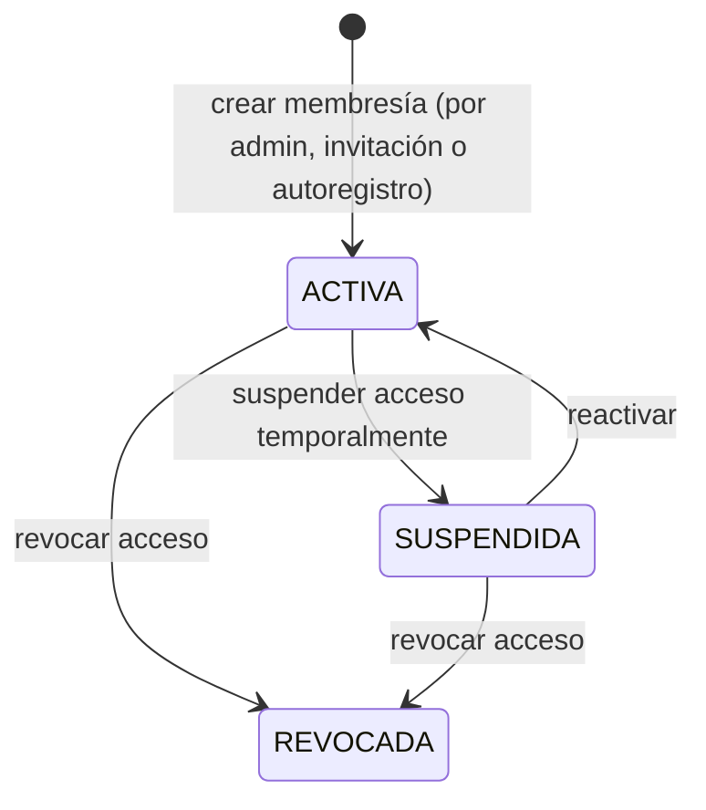
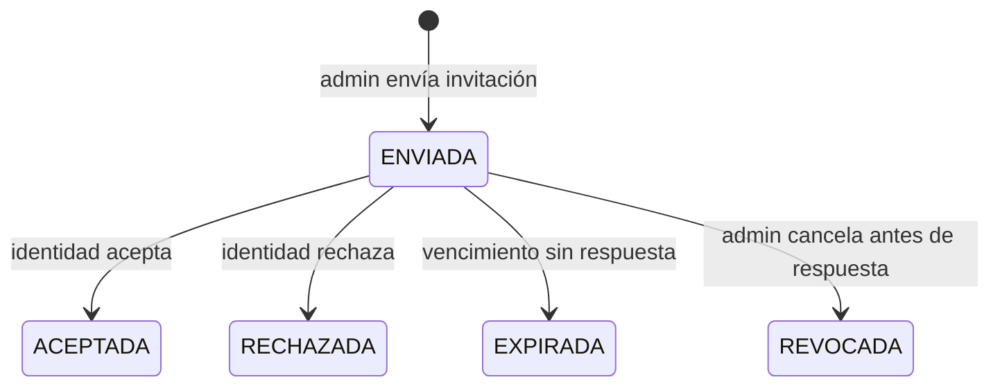

[← Índice](./README.md) | [< Anterior](./identity.md) | [Siguiente >](./organization.md)

---

# Access Control

## Contenido

- [Propósito](#propósito)
- [Conceptos clave](#conceptos-clave)
- [Ciclos de vida](#ciclos-de-vida)
- [Invariantes del contexto](#invariantes-del-contexto)
- [Relaciones con otros contextos](#relaciones-con-otros-contextos)
- [Eventos que produce](#eventos-que-produce)
- [Comentarios de los Revisores](#comentarios-de-los-revisores)

---

## Propósito

Access Control es el segundo contexto del Core Domain. Es el único responsable de responder a la pregunta: **¿qué puede hacer esta identidad en esta aplicación?**

**Responsabilidades de este contexto:**
- Gestionar roles y permisos dentro del contexto de cada aplicación cliente.
- Mantener las membresías: qué sujetos tienen acceso a qué aplicaciones y bajo qué roles.
- Gestionar el ciclo de vida de las invitaciones de incorporación.
- Proveer, en el momento de emisión de una sesión, los roles efectivos del sujeto en la aplicación correspondiente.
- Evaluar si un sujeto tiene permiso para ejecutar una operación específica.

**Fuera del alcance de este contexto:**
- Verificar la identidad del sujeto → Identity.
- Gestionar la existencia de usuarios o aplicaciones → Organization y Client Applications.
- Registrar los eventos para trazabilidad → Audit.

[↑ Volver al inicio](#access-control)

---

## Conceptos clave

### Sujeto

Una identidad autenticada, vista desde la perspectiva del control de acceso: alguien sobre quien se evalúan roles y permisos. El sujeto no es la identidad en sí — es una proyección de ella dentro de este contexto, identificada por su identificador de plataforma y el contexto de aplicación en el que opera.

### Rol

Agrupación con nombre de permisos, asignada a un sujeto dentro de un contexto específico. Existen tres tipos según su alcance:

| Tipo | Alcance | Quién lo gestiona |
|------|---------|-------------------|
| **Rol de aplicación** | Dentro de una aplicación cliente registrada en una organización | Administrador de Organización |
| **Rol de organización** | Sobre la organización en su conjunto | Definido por la plataforma; asignado al Administrador de Organización |
| **Rol de plataforma** | Transversal a toda la plataforma | Reservado al equipo de Keygo |

Un sujeto puede tener roles distintos en distintas aplicaciones de la misma organización. Los roles de aplicación son definidos por la organización y son específicos a cada aplicación.

### Permiso

Autorización granular que determina si un sujeto puede ejecutar una operación específica. Los permisos se agrupan en roles y se evalúan siempre en el contexto de una aplicación específica.

### Membresía

Relación entre un sujeto y una aplicación cliente dentro de la misma organización. Representa que el sujeto tiene acceso habilitado a esa aplicación, bajo los roles asignados. Sin membresía activa, el sujeto no puede usar la aplicación, aunque esté autenticado.

| Atributo | Descripción |
|----------|-------------|
| Sujeto | La identidad de plataforma que tiene el acceso |
| Aplicación | La aplicación cliente dentro de la organización |
| Roles activos | Lista de roles asignados al sujeto en esa aplicación |
| Estado | `ACTIVA` → `SUSPENDIDA` → `REVOCADA` |

### Invitación

Solicitud formal para que una identidad de plataforma se incorpore como miembro con acceso a una aplicación específica. El ciclo de vida de la invitación está controlado por este contexto.

### Roles efectivos

Conjunto de permisos resultante de expandir todos los roles asignados a un sujeto, aplicando la jerarquía de roles si existe. Los roles efectivos se calculan en el momento de emisión de la Credencial de Sesión y se embeben en ella. No se recalculan con cada evaluación.

### Ámbito de acceso

Conjunto de operaciones o recursos sobre los cuales un sujeto o una aplicación cliente está autorizado a actuar. Delimita el alcance de lo permitido, sin identificar a quien lo solicita.

[↑ Volver al inicio](#access-control)

---

## Ciclos de vida

### Membresía

### Invitación

[↑ Volver al inicio](#access-control)

---

## Invariantes del contexto

| # | Invariante |
|---|-----------|
| 1 | Una membresía solo puede existir entre un sujeto y una aplicación que pertenezcan a la misma organización. No existe membresía entre organizaciones distintas. |
| 2 | Un sujeto sin membresía activa en una aplicación no puede usar esa aplicación, aunque su identidad esté autenticada y activa en la plataforma. |
| 3 | Los roles se definen y asignan siempre dentro del contexto de una aplicación específica. Un rol sin aplicación asociada carece de significado en este contexto. |
| 4 | Los roles efectivos del sujeto se calculan en el momento de emisión de la Credencial de Sesión y quedan fijados en ella. Un cambio posterior de roles no invalida credenciales ya emitidas; la ventana de desfase aceptada es de 1 hora. |
| 5 | Solo el Administrador de Organización puede asignar o revocar roles a sujetos dentro de las aplicaciones de su organización. |
| 6 | Una invitación pendiente de respuesta solo puede estar en ese estado hasta su expiración. No puede enviarse una segunda invitación a la misma identidad para la misma aplicación si ya hay una pendiente. |
| 7 | Al suspenderse o eliminarse una organización, todas las membresías de esa organización se revocan en cascada. |
| 8 | Al suspenderse o eliminarse un sujeto en Organization, todas sus membresías activas quedan suspendidas hasta que la situación se resuelva. |

[↑ Volver al inicio](#access-control)

---

## Relaciones con otros contextos

| Contexto relacionado | Patrón | Descripción |
|---------------------|--------|-------------|
| **Identity** | Partnership | Identity produce la sesión autenticada; Access Control la enriquece con los roles efectivos del sujeto en la aplicación correspondiente. Ambos son Core Domain y evolucionan en coordinación. |
| **Organization** | Customer/Supplier (Organization upstream) | Organization publica la existencia y estado de usuarios y organización. Access Control mantiene su propio registro de sujetos elegibles y reacciona cuando un usuario es dado de baja o una organización es suspendida. |
| **Client Applications** | Customer/Supplier (Client Applications upstream) | Los roles existen dentro del contexto de una aplicación cliente. Sin la aplicación como referencia, un rol no tiene significado. Los ámbitos autorizados de la aplicación delimitan qué roles pueden definirse. |
| **Audit** | Published Language (Access Control publisher) | Access Control publica eventos de membresía, roles, permisos e invitaciones. Audit los persiste de forma inmutable. |

Ver [Mapa de Contextos](../context-map.md) para el diagrama completo de relaciones.

[↑ Volver al inicio](#access-control)

---

## Eventos que produce

| Evento | Descripción | Prioridad de auditoría |
|--------|-------------|----------------------|
| `MembresíaCreada` | Un sujeto fue incorporado con acceso a una aplicación. | Alta |
| `MembresíaSuspendida` | El acceso de un sujeto a una aplicación fue suspendido temporalmente. | Alta |
| `MembresíaReactivada` | El acceso suspendido de un sujeto fue restaurado. | Alta |
| `MembresíaRevocada` | El acceso de un sujeto a una aplicación fue eliminado. | Alta |
| `RolCreado` | Se definió un nuevo rol dentro de una aplicación. | Normal |
| `RolEliminado` | Un rol fue eliminado de una aplicación. | Alta |
| `RolAsignado` | Un rol fue asignado a un sujeto dentro de una aplicación. | Alta |
| `RolRevocado` | Un rol fue removido de un sujeto dentro de una aplicación. | Alta |
| `PermisoAgregadoAlRol` | Se añadió un permiso a un rol existente. | Normal |
| `PermisoRemovidoDelRol` | Se removió un permiso de un rol existente. | Normal |
| `InvitaciónEnviada` | Un administrador envió una invitación a una identidad para una aplicación. | Normal |
| `InvitaciónAceptada` | Una identidad aceptó la invitación y se creó su membresía. | Alta |
| `InvitaciónRechazada` | Una identidad rechazó la invitación. | Normal |
| `InvitaciónExpirada` | Una invitación venció sin respuesta. | Normal |
| `InvitaciónRevocada` | Un administrador canceló una invitación pendiente. | Normal |

[↑ Volver al inicio](#access-control)

---

## Comentarios de los Revisores

| Revisor | Tipo | Contenido |
|---------|------|-----------|
| — | — | Pendiente de revisión |

[↑ Volver al inicio](#access-control)

---

[← Índice](./README.md) | [< Anterior](./identity.md) | [Siguiente >](./organization.md)
