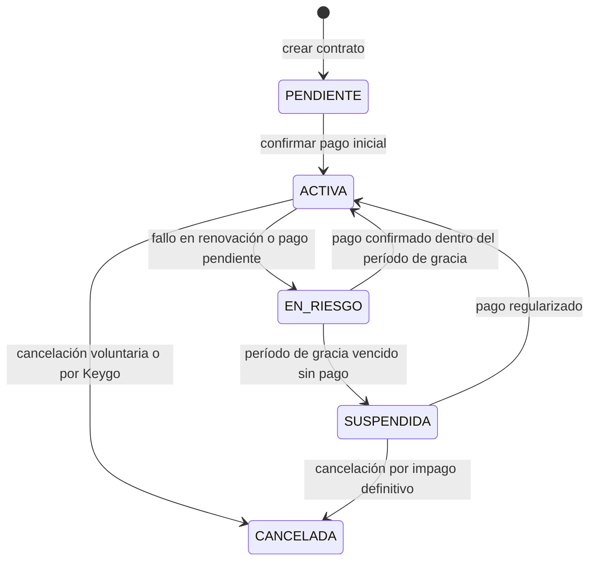
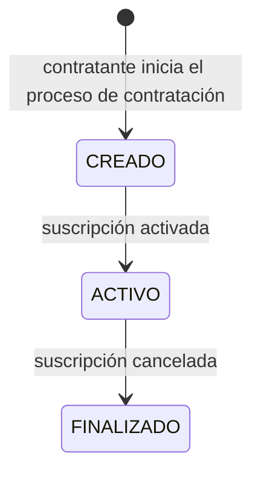

[← Índice](./README.md) | [< Anterior](./client-applications.md) | [Siguiente >](./audit.md)

---

# Billing

## Contenido

- [Propósito](#propósito)
- [Conceptos clave](#conceptos-clave)
- [Ciclos de vida](#ciclos-de-vida)
- [Invariantes del contexto](#invariantes-del-contexto)
- [Relaciones con otros contextos](#relaciones-con-otros-contextos)
- [Eventos que produce](#eventos-que-produce)
- [Comentarios de los Revisores](#comentarios-de-los-revisores)

---

## Propósito

Billing gestiona la relación comercial entre Keygo y cada organización: qué plan tiene contratado, qué capacidades habilita ese plan, cuánto está consumiendo la organización y cómo se factura ese consumo.

**Responsabilidades de este contexto:**
- Gestionar el contrato inicial y la activación de la suscripción que da origen a una organización.
- Mantener el estado de la suscripción activa de cada organización.
- Medir el consumo de recursos de cada organización contra los límites de su plan.
- Señalar a Organization cuando se alcanza un límite de uso para bloquear nuevas incorporaciones.
- Gestionar el ciclo de facturación y coordinarse con el proveedor de pago externo a través de una capa de traducción (ACL).

**Fuera del alcance de este contexto:**
- Bloquear directamente el acceso de usuarios → Organization lo aplica al recibir la señal.
- Gestionar la identidad o autenticación del contratante → Identity.
- Almacenar datos de pago sensibles → exclusivo del proveedor de pago externo.

[↑ Volver al inicio](#billing)

---

## Conceptos clave

### Plan

Configuración de límites y capacidades que Keygo ofrece a una organización: número máximo de usuarios activos, número máximo de aplicaciones cliente, volumen de operaciones por período. Los planes son definidos por el equipo de Keygo (KEYGO_ADMIN), no por las organizaciones.

### Contrato

Registro del acuerdo entre Keygo y una organización para acceder a un plan específico. El contrato es el punto de partida del flujo de contratación: sin contrato activo, no existe suscripción ni organización operativa. El `KEYGO_ACCOUNT_ADMIN` es la identidad que firma el contrato y, por ese acto, se convierte en Administrador de Organización.

### Suscripción

Estado activo de un plan en una organización. Determina qué capacidades están habilitadas en cada momento. Una organización tiene exactamente una suscripción activa. La suscripción se renueva periódicamente conforme al ciclo de facturación.

| Estado | Descripción |
|--------|-------------|
| `PENDIENTE` | Contrato creado, pago pendiente de confirmación. |
| `ACTIVA` | Pago confirmado; la organización opera con las capacidades del plan. |
| `EN_RIESGO` | Renovación pendiente o pago fallido; organización en período de gracia. |
| `SUSPENDIDA` | Período de gracia vencido; la organización queda inhabilitada. |
| `CANCELADA` | La organización o Keygo terminaron la relación comercial. |

### Límite de uso

Restricción cuantitativa impuesta por el plan activo. Cuando una organización alcanza un límite, Billing emite una señal que Organization utiliza para bloquear nuevas incorporaciones hasta que el plan sea ampliado o el consumo se reduzca.

### Medición de uso

Registro continuo del consumo de recursos de una organización contra los límites de su plan. Billing lo actualiza en respuesta a eventos de Organization (nuevos miembros, nuevas aplicaciones).

### Ciclo de facturación

Período durante el cual se acumula el consumo para efectos de cobro. Al cierre del ciclo se genera una factura y se inicia el proceso de cobro.

### Factura

Documento de cobro generado al cierre de cada ciclo de facturación. Refleja el consumo del período y el monto a cobrar según el plan activo.

### Anti-Corruption Layer (ACL) con el proveedor de pago

El proveedor de pago externo opera con su propio modelo y terminología. Billing nunca depende directamente de ese modelo; en su lugar, una capa de traducción convierte los eventos del proveedor (`payment.succeeded`, `subscription.deleted`) a eventos del dominio de Billing (`PagoConfirmado`, `SuscripciónCancelada`). Esto protege el modelo de dominio de Billing frente a cambios en el proveedor externo.

[↑ Volver al inicio](#billing)

---

## Ciclos de vida

### Suscripción

### Contrato

[↑ Volver al inicio](#billing)

---

## Invariantes del contexto

| # | Invariante |
|---|-----------|
| 1 | Una organización tiene exactamente una suscripción activa en todo momento. No puede haber dos suscripciones activas simultáneas para la misma organización. |
| 2 | La suscripción solo se activa tras la confirmación de pago. Billing no crea la organización directamente — emite el evento que Organization procesa para crearla. |
| 3 | Billing no almacena datos sensibles del medio de pago. Esa responsabilidad es exclusiva del proveedor externo. |
| 4 | Toda comunicación con el proveedor de pago pasa por la ACL. Ningún concepto del proveedor externo debe aparecer en el modelo de dominio de Billing. |
| 5 | Cuando se alcanza un límite de uso, Billing emite una señal a Organization. Organization es responsable de aplicar el bloqueo; Billing no bloquea directamente. |
| 6 | Al cancelarse una suscripción, se genera el evento correspondiente que puede desencadenar la suspensión de la organización en Organization. |
| 7 | La medición de uso se actualiza en respuesta a eventos de Organization, no mediante consultas periódicas. Si Organization no emite el evento, Billing no tiene forma de conocer el cambio. |

[↑ Volver al inicio](#billing)

---

## Relaciones con otros contextos

| Contexto relacionado | Patrón | Descripción |
|---------------------|--------|-------------|
| **Organization** | Customer/Supplier (Organization upstream) | Organization publica eventos de cambio en la composición del tenant (nuevos miembros, nuevas aplicaciones). Billing mide el consumo. Billing puede devolver señal de límite alcanzado; Organization la aplica. |
| **Proveedor de pago externo** | Anti-Corruption Layer (Billing construye la ACL) | El proveedor tiene su propio modelo. La ACL traduce sus eventos al dominio de Billing, protegiendo el modelo interno de cambios del proveedor. |
| **Audit** | Published Language (Billing publisher) | Billing publica eventos de contratos, suscripciones, facturas y pagos. Audit los persiste de forma inmutable. |
| **Platform** | Conformist (Platform lee de Billing) | Platform consume el estado de las suscripciones para visibilidad operativa global. No escribe en Billing. |

Ver [Mapa de Contextos](../context-map.md) para el diagrama completo de relaciones.

[↑ Volver al inicio](#billing)

---

## Eventos que produce

| Evento | Descripción | Prioridad de auditoría |
|--------|-------------|----------------------|
| `ContratoCreado` | Un contratante inició el proceso de contratación de un plan. | Alta |
| `ContratoActivado` | El pago inicial fue confirmado y la suscripción fue activada. | Alta |
| `SuscripciónActivada` | La suscripción de una organización pasó al estado activo. | Alta |
| `SuscripciónRenovada` | Un ciclo de facturación fue cerrado y la suscripción fue renovada exitosamente. | Normal |
| `SuscripciónEnRiesgo` | La renovación falló o hay un pago pendiente; la organización entró en período de gracia. | Alta |
| `SuscripciónSuspendida` | El período de gracia venció sin pago; la organización fue suspendida. | Crítica |
| `SuscripciónCancelada` | La relación comercial fue terminada. | Alta |
| `LímiteDeUsuariosAlcanzado` | La organización alcanzó el número máximo de usuarios de su plan. | Alta |
| `LímiteDeAplicacionesAlcanzado` | La organización alcanzó el número máximo de aplicaciones cliente de su plan. | Alta |
| `FacturaGenerada` | Se generó un documento de cobro al cierre del ciclo de facturación. | Normal |
| `PagoConfirmado` | El proveedor de pago confirmó la recepción de un cobro. | Alta |
| `PagoRechazado` | El proveedor de pago rechazó un intento de cobro. | Alta |

[↑ Volver al inicio](#billing)

---

## Comentarios de los Revisores

| Revisor | Tipo | Contenido |
|---------|------|-----------|
| — | — | Pendiente de revisión |

[↑ Volver al inicio](#billing)

---

[← Índice](./README.md) | [< Anterior](./client-applications.md) | [Siguiente >](./audit.md)
