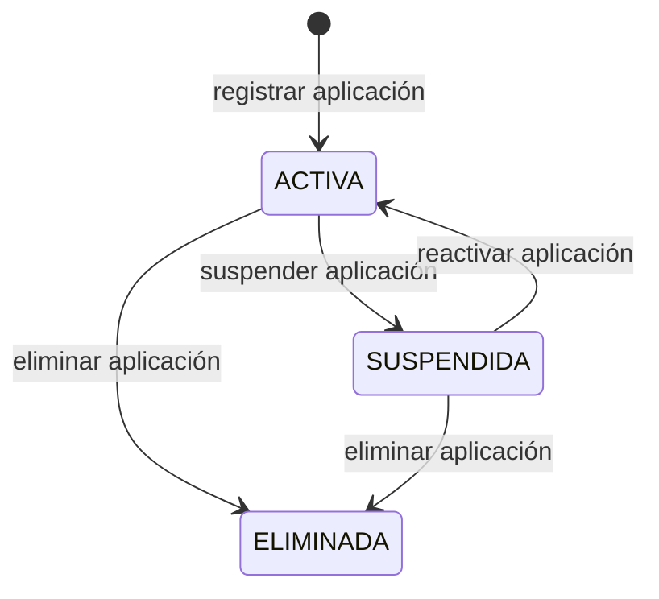
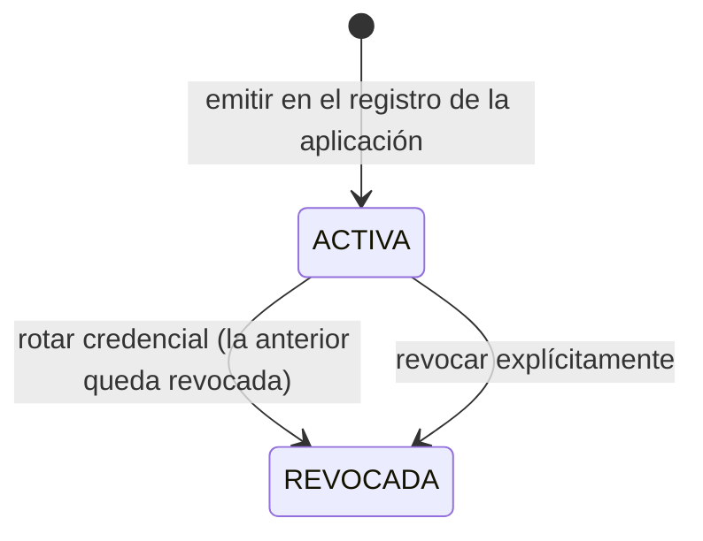

[← Índice](./README.md) | [< Anterior](./organization.md) | [Siguiente >](./billing.md)

---

# Client Applications

## Contenido

- [Propósito](#propósito)
- [Conceptos clave](#conceptos-clave)
- [Ciclos de vida](#ciclos-de-vida)
- [Invariantes del contexto](#invariantes-del-contexto)
- [Relaciones con otros contextos](#relaciones-con-otros-contextos)
- [Eventos que produce](#eventos-que-produce)
- [Comentarios de los Revisores](#comentarios-de-los-revisores)

---

## Propósito

Client Applications gestiona los sistemas externos que una organización registra en Keygo para delegar la autenticación y verificación de identidad de sus usuarios. Es el contexto que controla qué aplicaciones pueden iniciar flujos de autenticación y bajo qué condiciones.

**Responsabilidades de este contexto:**
- Registrar y gestionar el ciclo de vida de las aplicaciones cliente dentro de una organización.
- Emitir y rotar las credenciales de aplicación que identifican a cada app ante Keygo.
- Definir los ámbitos de acceso autorizados de cada aplicación.
- Mantener la política de incorporación de cada aplicación: cómo los usuarios pueden convertirse en miembros con acceso a ella.
- Publicar el estado de cada aplicación para que Identity y Access Control puedan reaccionar ante cambios.

**Fuera del alcance de este contexto:**
- Autenticar identidades → Identity.
- Gestionar roles y membresías de usuarios dentro de las aplicaciones → Access Control.
- Gestionar la pertenencia de usuarios a la organización → Organization.

[↑ Volver al inicio](#client-applications)

---

## Conceptos clave

### Aplicación cliente

Sistema externo registrado dentro de una organización que delega en Keygo la autenticación y verificación de identidad. Puede ser una aplicación web, móvil, API, o cualquier otro sistema capaz de participar en un flujo de autenticación.

| Atributo | Descripción |
|----------|-------------|
| Identificador único | Asignado en el registro; inmutable e incluido en cada flujo de autenticación. |
| Organización propietaria | La organización a la que pertenece. Una aplicación pertenece a exactamente una organización. |
| Nombre | Identificación legible de la aplicación. |
| Ámbitos autorizados | Conjunto de ámbitos que la plataforma permite a esta aplicación solicitar en nombre de sus usuarios. |
| Política de incorporación | Modalidad bajo la cual los usuarios pueden obtener acceso a la aplicación. |
| Estado | `ACTIVA` → `SUSPENDIDA` → `ELIMINADA`. |

### Credencial de aplicación

Par de identificador y secreto asignado a una aplicación cliente en el momento de su registro. Le permite identificarse ante Keygo para iniciar flujos de autenticación. No confundir con la credencial de usuario ni con la credencial de sesión.

| Atributo de diseño | Descripción |
|-------------------|-------------|
| Composición | Identificador público + secreto. El secreto se entrega una sola vez en el momento del registro o la rotación. |
| Almacenamiento | El secreto se almacena solo como hash. |
| Rotación | La credencial puede rotarse; la credencial anterior se invalida. |

### Ámbito autorizado

Subconjunto de ámbitos de acceso que la plataforma permite a una aplicación cliente solicitar en nombre de sus usuarios. Definido en el momento del registro y modificable por el Administrador de Organización. Un usuario no puede obtener más ámbitos de los que su aplicación tiene autorizados.

### Política de incorporación

Regla configurada en cada aplicación que determina cómo una identidad de plataforma puede obtener acceso a ella. Define cuatro modalidades:

| Modalidad | Descripción |
|-----------|-------------|
| **Sin autoregistro** | Solo el Administrador de Organización puede incorporar usuarios. No hay acción posible del usuario por su cuenta. |
| **Por invitación** | El administrador envía una invitación; el usuario debe aceptarla para obtener acceso. |
| **Validado por administrador** | El usuario solicita acceso; el administrador revisa y aprueba o rechaza. |
| **Autovalidado** | El usuario solicita acceso y lo obtiene de forma inmediata sin revisión manual. |

[↑ Volver al inicio](#client-applications)

---

## Ciclos de vida

### Aplicación cliente

### Credencial de aplicación

[↑ Volver al inicio](#client-applications)

---

## Invariantes del contexto

| # | Invariante |
|---|-----------|
| 1 | Una aplicación cliente pertenece a exactamente una organización. No puede transferirse entre organizaciones. |
| 2 | El secreto de la credencial de aplicación se almacena únicamente como hash. El valor original se entrega una sola vez — en el registro o en cada rotación. |
| 3 | Una aplicación en estado `SUSPENDIDA` o `ELIMINADA` no puede iniciar nuevos flujos de autenticación. Identity rechaza cualquier solicitud proveniente de una aplicación en ese estado. |
| 4 | Los ámbitos autorizados de una aplicación delimitan el máximo de ámbitos que sus usuarios pueden obtener. No se emiten credenciales de sesión con ámbitos que superen los autorizados de la aplicación. |
| 5 | La política de incorporación es configurable pero no retroactiva: cambiarla no afecta a los miembros que ya tienen acceso. |
| 6 | Al eliminarse una organización, todas sus aplicaciones cliente quedan eliminadas en cascada. Sus credenciales dejan de ser válidas de forma inmediata. |
| 7 | Una aplicación puede tener simultáneamente una sola credencial activa. La rotación invalida la credencial anterior en el momento en que se emite la nueva. |

[↑ Volver al inicio](#client-applications)

---

## Relaciones con otros contextos

| Contexto relacionado | Patrón | Descripción |
|---------------------|--------|-------------|
| **Identity** | Customer/Supplier (Client Applications upstream) | Identity verifica que la aplicación que inicia un flujo de autenticación está registrada y activa. Una aplicación dada de baja deja de poder iniciar flujos de forma inmediata. |
| **Access Control** | Customer/Supplier (Client Applications upstream) | Los roles en Access Control existen dentro del contexto de una aplicación. Los ámbitos autorizados de la aplicación delimitan qué roles pueden definirse para ella. Sin la aplicación como contexto, un rol no tiene significado. |
| **Audit** | Published Language (Client Applications publisher) | Client Applications publica eventos de registro, suspensión, eliminación y cambios de configuración de aplicaciones. Audit los persiste de forma inmutable. |
| **Organization** | Customer/Supplier (Organization upstream) | Una aplicación solo puede existir dentro de una organización activa. Si la organización es suspendida o eliminada, las aplicaciones quedan inoperativas en cascada. |

Ver [Mapa de Contextos](../context-map.md) para el diagrama completo de relaciones.

[↑ Volver al inicio](#client-applications)

---

## Eventos que produce

| Evento | Descripción | Prioridad de auditoría |
|--------|-------------|----------------------|
| `AplicaciónRegistrada` | Una nueva aplicación cliente fue dada de alta en la organización. | Alta |
| `AplicaciónSuspendida` | Una aplicación fue inhabilitada temporalmente. | Alta |
| `AplicaciónReactivada` | Una aplicación suspendida fue habilitada nuevamente. | Alta |
| `AplicaciónEliminada` | Una aplicación fue eliminada de la organización. | Alta |
| `CredencialDeAplicaciónRotada` | La credencial de una aplicación fue regenerada; la anterior quedó inválida. | Crítica |
| `ÁmbitosDeAplicaciónActualizados` | Los ámbitos autorizados de una aplicación fueron modificados. | Alta |
| `PolíticaDeIncorporaciónConfigurada` | La política de incorporación de una aplicación fue creada o modificada. | Normal |
| `UsuarioAutoregistradoEnAplicación` | Una identidad obtuvo acceso a la aplicación a través del flujo de autoregistro. | Normal |

[↑ Volver al inicio](#client-applications)

---

## Comentarios de los Revisores

| Revisor | Tipo | Contenido |
|---------|------|-----------|
| — | — | Pendiente de revisión |

[↑ Volver al inicio](#client-applications)

---

[← Índice](./README.md) | [< Anterior](./organization.md) | [Siguiente >](./billing.md)
