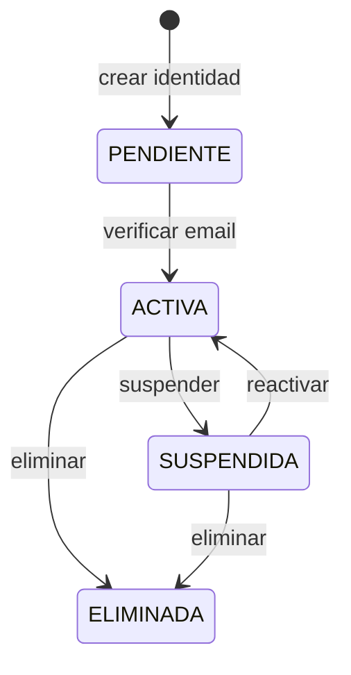
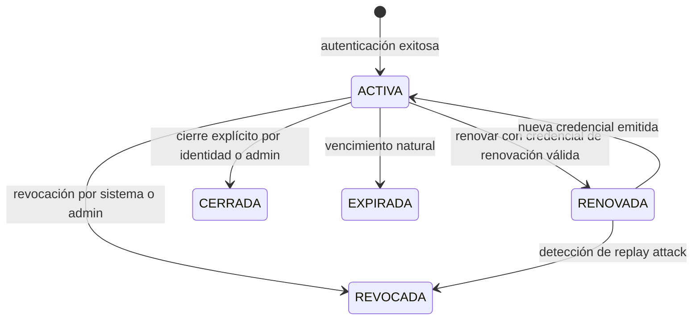
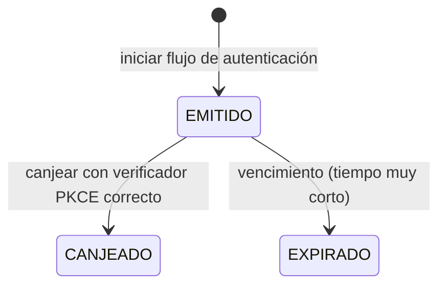
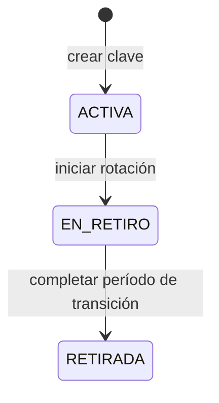

[← Índice](./README.md) | [Siguiente >](./access-control.md)

---

# Identity

## Contenido

- [Propósito](#propósito)
- [Conceptos clave](#conceptos-clave)
- [Ciclos de vida](#ciclos-de-vida)
- [Invariantes del contexto](#invariantes-del-contexto)
- [Relaciones con otros contextos](#relaciones-con-otros-contextos)
- [Eventos que produce](#eventos-que-produce)
- [Comentarios de los Revisores](#comentarios-de-los-revisores)

---

## Propósito

Identity es el contexto núcleo del sistema. Es el único responsable de responder a la pregunta: **¿quién eres y puedo confirmarlo?**

**Responsabilidades de este contexto:**
- Gestionar el ciclo de vida de las identidades de plataforma y sus credenciales de autenticación.
- Ejecutar el flujo de autenticación completo: desde la solicitud inicial hasta la emisión de credenciales.
- Administrar las sesiones activas: creación, renovación y revocación.
- Mantener las claves criptográficas usadas para firmar credenciales de sesión.
- Permitir a una identidad autogestionar su cuenta: contraseña, sesiones activas, conexiones externas y preferencias de notificación.

**Fuera del alcance de este contexto:**
- Qué puede hacer una identidad una vez autenticada → Access Control.
- A qué organizaciones pertenece una identidad → Organization.
- Qué aplicaciones tiene registradas una organización → Client Applications.

[↑ Volver al inicio](#identity)

---

## Conceptos clave

### Identidad

La entidad raíz del contexto. Representa a una persona dentro de Keygo a nivel de plataforma — independiente de a qué organizaciones pertenezca o qué aplicaciones use.

| Atributo | Descripción |
|----------|-------------|
| Identificador único | Asignado en el momento de creación; inmutable y no reutilizable. |
| Rol de plataforma | Obligatorio: `KEYGO_ADMIN`, `KEYGO_ACCOUNT_ADMIN` o `KEYGO_USER`. Una identidad sin rol es una inconsistencia que el sistema debe impedir. |
| Credencial | La contraseña de autenticación. Solo se almacena su hash; nunca el valor original. |
| Correo electrónico | Identificador de contacto; sujeto a verificación. |
| Conexiones externas | Lista de vínculos con proveedores de identidad externos. Una identidad puede tener varias conexiones simultáneas. |
| Preferencias de notificación | Configuración personal de comunicaciones. No afecta la lógica de autenticación ni de acceso. |
| Estado | `PENDIENTE` → `ACTIVA` → `SUSPENDIDA` → `ELIMINADA`. |

### Código de Autorización

Artefacto efímero que actúa como puente entre el inicio del flujo de autenticación y la emisión de credenciales. Es de un solo uso, tiene tiempo de vida muy corto y está vinculado al verificador PKCE del flujo que lo originó.

### Sesión

Estado activo producido por una autenticación exitosa. Agrupa la Credencial de Sesión y la Credencial de Renovación emitidas para ese evento de autenticación. Una identidad puede tener varias sesiones activas simultáneamente.

### Credencial de Sesión

Artefacto de corta duración emitido tras una autenticación exitosa. Contiene la identidad del sujeto y sus roles efectivos (incluyendo jerarquía) en el momento de la emisión. Es verificable por aplicaciones cliente sin consultar a Keygo, usando las claves públicas de firma expuestas por la plataforma.

| Atributo de diseño | Valor |
|-------------------|-------|
| Duración estándar | 1 hora |
| Rol de acceso embebido | Sí — fijado en el momento de emisión |
| Verificabilidad | Sin consulta directa a Keygo |

### Credencial de Renovación

Artefacto de larga duración que permite obtener una nueva Credencial de Sesión sin que la identidad deba autenticarse nuevamente. Se almacena únicamente como hash; el valor original se entrega una sola vez. Al usarse, se invalida y se emite una nueva (rotación).

| Atributo de diseño | Valor |
|-------------------|-------|
| Duración estándar | 30 días |
| Almacenamiento | Solo hash (SHA-256) |
| Uso | Un solo uso; se rota en cada uso |
| Detección de replay | Si se usa una credencial ya rotada, toda la cadena se revoca |

### Clave de Firma

Clave criptográfica usada para firmar las Credenciales de Sesión. Existe una clave activa por organización (tenant); si no existe una clave de tenant, se usa la clave global de Keygo como respaldo. Las claves pasan por un estado de retiro que garantiza que las credenciales ya emitidas siguen siendo verificables durante la transición.

[↑ Volver al inicio](#identity)

---

## Ciclos de vida

### Identidad

### Sesión

### Código de Autorización

### Clave de Firma

[↑ Volver al inicio](#identity)

---

## Invariantes del contexto

| # | Invariante |
|---|-----------|
| 1 | Toda identidad tiene exactamente un rol de plataforma. No existe identidad sin rol asignado. |
| 2 | El código de autorización es de un solo uso. Una vez canjeado, no puede volver a usarse — aunque no haya expirado. |
| 3 | El código de autorización está vinculado al verificador PKCE del flujo que lo generó. No puede ser canjeado con un verificador distinto. |
| 4 | La credencial de renovación se almacena únicamente como hash. El valor original se entrega una sola vez y nunca se recupera. |
| 5 | Al usarse una credencial de renovación, esta se invalida y se emite una nueva. Si el sistema detecta el uso de una credencial ya rotada, toda la cadena de sesiones de esa identidad se revoca de forma inmediata. |
| 6 | Una identidad suspendida no puede iniciar nuevos flujos de autenticación ni renovar sesiones existentes. |
| 7 | Al suspender una identidad, todas sus sesiones activas se revocan de forma inmediata. |
| 8 | Las claves en estado `RETIRADA` no pueden usarse para firmar nuevas credenciales. Las credenciales ya emitidas con esa clave siguen siendo verificables durante el período de transición definido. |
| 9 | La credencial de sesión embebe los roles efectivos en el momento de emisión. Un cambio posterior de roles no invalida credenciales ya emitidas; la ventana de desfase aceptada es de 1 hora. |
| 10 | La verificación PKCE es obligatoria en todo flujo de autenticación. El método preferido es S256; el método `plain` se acepta solo por compatibilidad y queda registrado. |

[↑ Volver al inicio](#identity)

---

## Relaciones con otros contextos

| Contexto relacionado | Patrón | Descripción |
|---------------------|--------|-------------|
| **Access Control** | Partnership | Access Control enriquece la sesión con los roles efectivos del sujeto en el momento de emisión. Ambos contextos son Core Domain y evolucionan en coordinación. |
| **Organization** | Customer/Supplier (Organization upstream) | Organization publica el estado de una identidad (suspendida, reactivada, eliminada). Identity reacciona revocando sesiones activas cuando una identidad queda inactiva en la organización. |
| **Client Applications** | Customer/Supplier (Client Applications upstream) | Identity verifica que la aplicación cliente que inicia un flujo de autenticación está registrada y activa antes de procesar la solicitud. Una aplicación dada de baja deja de poder iniciar flujos de forma inmediata. |
| **Audit** | Published Language (Identity publisher) | Identity publica eventos de sesión, autenticación, claves de firma y cambios de cuenta. Audit los persiste de forma inmutable sin transformarlos. |

Ver [Mapa de Contextos](../context-map.md) para el diagrama completo de relaciones.

[↑ Volver al inicio](#identity)

---

## Eventos que produce

| Evento | Descripción | Prioridad de auditoría |
|--------|-------------|----------------------|
| `SesiónIniciada` | Una autenticación fue exitosa y se emitieron credenciales. | Crítica |
| `SesiónCerrada` | La identidad o un administrador cerró una sesión explícitamente. | Alta |
| `SesiónRevocada` | El sistema o un administrador anuló una sesión activa antes de su expiración. | Crítica |
| `CadenaSesionesRevocada` | Todas las sesiones de una identidad fueron revocadas por detección de replay attack. | Crítica |
| `CredencialDeRenovaciónRotada` | Una credencial de renovación fue usada y reemplazada por una nueva. | Normal |
| `AtaqueDeReproducciónDetectado` | Se detectó el uso de una credencial de renovación ya rotada. | Crítica |
| `ContraseñaCambiada` | La identidad actualizó su contraseña. | Alta |
| `RecuperaciónDeContraseñaSolicitada` | La identidad inició el flujo de recuperación de contraseña. | Alta |
| `ContraseñaRestablecida` | La contraseña fue restablecida a través del flujo de recuperación. | Alta |
| `EmailVerificado` | La identidad confirmó su dirección de correo electrónico. | Normal |
| `ConexiónExternaVinculada` | Se vinculó un proveedor de identidad externo a la identidad. | Alta |
| `ConexiónExternaDesvinculada` | Se eliminó el vínculo con un proveedor de identidad externo. | Alta |
| `PreferenciasDeNotificaciónActualizadas` | La identidad modificó su configuración de comunicaciones. | Normal |
| `ClaveDeFirmaCreada` | Se generó una nueva clave criptográfica de firma para un tenant. | Alta |
| `ClaveDeFirmaRotada` | Una clave activa inició el proceso de retiro y una nueva tomó su lugar. | Alta |
| `ClaveDeFirmaRetirada` | Una clave completó el período de transición y quedó fuera de uso definitivo. | Alta |

[↑ Volver al inicio](#identity)

---

## Comentarios de los Revisores

| Revisor | Tipo | Contenido |
|---------|------|-----------|
| — | — | Pendiente de revisión |

[↑ Volver al inicio](#identity)

---

[← Índice](./README.md) | [Siguiente >](./access-control.md)
