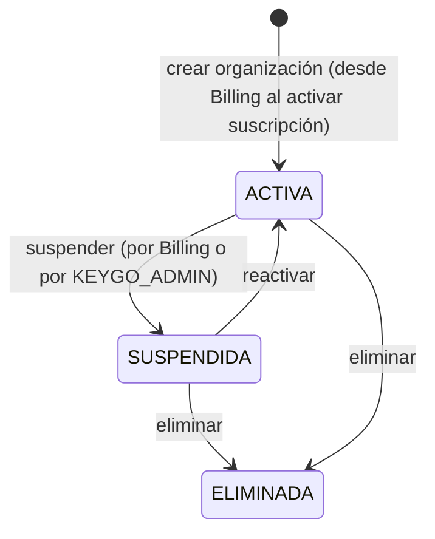
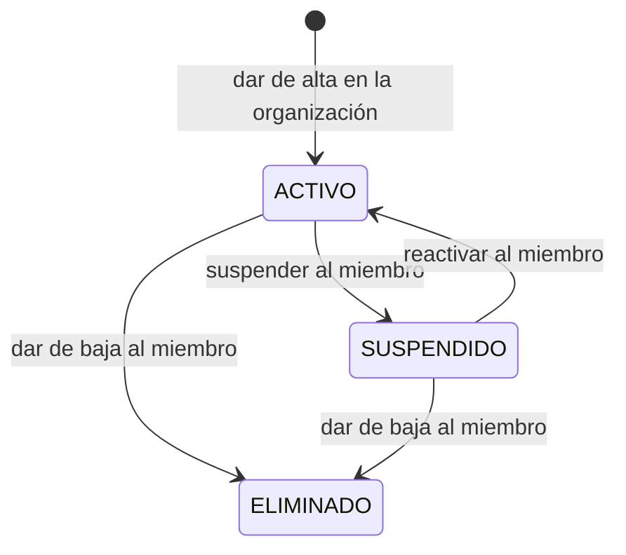

[← Índice](./README.md) | [< Anterior](./access-control.md) | [Siguiente >](./client-applications.md)

---

# Organization

## Contenido

- [Propósito](#propósito)
- [Conceptos clave](#conceptos-clave)
- [Ciclos de vida](#ciclos-de-vida)
- [Invariantes del contexto](#invariantes-del-contexto)
- [Relaciones con otros contextos](#relaciones-con-otros-contextos)
- [Eventos que produce](#eventos-que-produce)
- [Comentarios de los Revisores](#comentarios-de-los-revisores)

---

## Propósito

Organization gestiona la existencia y el ciclo de vida de las organizaciones (tenants) y de la pertenencia de las identidades de plataforma a ellas. Es el contexto que define quién forma parte de una organización y en qué estado.

**Responsabilidades de este contexto:**
- Crear, configurar, suspender y eliminar organizaciones.
- Gestionar la incorporación de identidades de plataforma como miembros de una organización.
- Mantener el estado de cada miembro dentro de su organización.
- Aplicar la restricción de aislamiento entre organizaciones.
- Recibir señales de Billing cuando se alcanzan límites de uso y bloquear nuevas incorporaciones en consecuencia.
- Notificar a Identity y Access Control cuando el estado de un miembro o de la organización cambia.

**Fuera del alcance de este contexto:**
- Autenticar identidades → Identity.
- Gestionar roles y permisos dentro de las aplicaciones → Access Control.
- Registrar aplicaciones cliente → Client Applications.
- Gestionar la relación comercial y los límites de plan → Billing.

[↑ Volver al inicio](#organization)

---

## Conceptos clave

### Organización

La unidad aislada de operación dentro de Keygo. Todo dato, usuario, aplicación, rol y sesión pertenece a exactamente una organización. El aislamiento entre organizaciones es una restricción de diseño absoluta de este contexto.

| Atributo | Descripción |
|----------|-------------|
| Identificador único | Asignado en creación; inmutable. |
| Nombre | Nombre comercial de la organización. |
| Dominio de correo | Dominio de email usado para identificar a usuarios de la organización (opcional). |
| Configuración de autenticación | Política de contraseñas, duración de sesión, número máximo de sesiones simultáneas. |
| Estado | `ACTIVA` → `SUSPENDIDA` → `ELIMINADA`. |

### Miembro

Una identidad de plataforma que pertenece a una organización. La misma identidad puede ser miembro de varias organizaciones simultáneamente; su estado en cada una es independiente. No confundir con *Membresía* (que es el acceso a una aplicación dentro de la organización, gestionado por Access Control).

| Atributo | Descripción |
|----------|-------------|
| Identidad de plataforma | Referencia por identificador al registro en Identity. |
| Organización | La organización a la que pertenece. |
| Estado | `ACTIVO` → `SUSPENDIDO` → `ELIMINADO`. |
| Fecha de incorporación | Cuándo fue dado de alta en la organización. |

### Administrador de Organización

Miembro con privilegios de gestión total sobre su organización: usuarios, roles, aplicaciones cliente y suscripción. Es siempre una identidad con rol de plataforma `KEYGO_ACCOUNT_ADMIN`. No puede actuar sobre otras organizaciones.

### Configuración de organización

Parámetros que cada organización define para controlar su operación: política de autenticación, nombre, dominio de correo permitido. Son propios de este contexto; Identity los respeta como entrada para sus validaciones.

### Aprovisionamiento

Proceso de incorporar una identidad de plataforma como miembro de una organización. En el MVP es exclusivamente iniciado por el Administrador de Organización. La identidad ya debe existir a nivel de plataforma para poder ser aprovisionada.

[↑ Volver al inicio](#organization)

---

## Ciclos de vida

### Organización

### Miembro

[↑ Volver al inicio](#organization)

---

## Invariantes del contexto

| # | Invariante |
|---|-----------|
| 1 | Ningún dato de una organización puede ser leído, referenciado o modificado por otra organización. El aislamiento es absoluto y se aplica como invariante en este contexto, no como filtro en la presentación. |
| 2 | Para dar de alta a un miembro en una organización, la identidad de plataforma correspondiente debe existir previamente en Identity. No se crean identidades en este contexto. |
| 3 | Una misma identidad puede ser miembro de varias organizaciones simultáneamente. Su estado (activo, suspendido) en cada organización es independiente. |
| 4 | Al suspenderse una organización, todos sus miembros activos quedan operativamente inhabilitados de forma automática. Identity revoca sus sesiones activas. |
| 5 | Al eliminarse una organización, todos sus datos se marcan como eliminados. No se borran físicamente; el histórico se preserva para auditoría. |
| 6 | Si Billing señala que se alcanzó el límite de usuarios del plan activo, Organization bloquea nuevas incorporaciones hasta que el plan sea ampliado o el límite se libere. |
| 7 | El Administrador de Organización es siempre un miembro con rol de plataforma `KEYGO_ACCOUNT_ADMIN`. Solo puede haber un administrador principal por organización; puede haber co-administradores designados. |
| 8 | Un miembro eliminado no puede ser reincorporado con el mismo identificador. La incorporación de la misma identidad de plataforma requiere un nuevo proceso de aprovisionamiento que produce un nuevo registro de miembro. |

[↑ Volver al inicio](#organization)

---

## Relaciones con otros contextos

| Contexto relacionado | Patrón | Descripción |
|---------------------|--------|-------------|
| **Identity** | Customer/Supplier (Organization upstream) | Organization publica el estado de sus miembros. Identity reacciona revocando sesiones cuando un miembro es suspendido o eliminado. |
| **Access Control** | Customer/Supplier (Organization upstream) | Organization publica altas y bajas de miembros. Access Control mantiene su registro de sujetos elegibles para membresías. Al eliminarse un miembro, Access Control revoca sus membresías activas. |
| **Billing** | Customer/Supplier (Organization upstream) | Organization publica eventos de cambio en la composición del tenant. Billing mide el consumo y puede devolver una señal de límite alcanzado que Organization respeta para bloquear nuevas incorporaciones. |
| **Audit** | Published Language (Organization publisher) | Organization publica eventos de ciclo de vida de organizaciones y miembros. Audit los persiste de forma inmutable. |
| **Platform** | Conformist (Organization downstream de Platform para acciones operativas) | Platform puede iniciar suspensiones o reactivaciones de organización a través de este contexto. Organization es el único punto de escritura; Platform no escribe directamente. |

Ver [Mapa de Contextos](../context-map.md) para el diagrama completo de relaciones.

[↑ Volver al inicio](#organization)

---

## Eventos que produce

| Evento | Descripción | Prioridad de auditoría |
|--------|-------------|----------------------|
| `OrganizaciónCreada` | Una nueva organización fue registrada en la plataforma. | Alta |
| `OrganizaciónSuspendida` | Una organización fue inhabilitada temporalmente. | Crítica |
| `OrganizaciónReactivada` | Una organización suspendida fue habilitada nuevamente. | Alta |
| `OrganizaciónEliminada` | Una organización fue marcada como eliminada. | Crítica |
| `ConfiguraciónDeOrganizaciónActualizada` | La configuración de autenticación u otros parámetros de la organización fueron modificados. | Alta |
| `UsuarioDadoDeAlta` | Una identidad de plataforma fue incorporada como miembro de la organización. | Alta |
| `UsuarioSuspendido` | Un miembro fue inhabilitado temporalmente dentro de la organización. | Alta |
| `UsuarioReactivado` | Un miembro suspendido fue habilitado nuevamente. | Alta |
| `UsuarioEliminado` | Un miembro fue dado de baja de la organización. | Alta |
| `ContraseñaRestablecimientoForzado` | El Administrador de Organización forzó el restablecimiento de contraseña de un miembro. | Alta |
| `LímiteDeUsuariosAlcanzado` | La organización alcanzó el número máximo de miembros permitido por su plan. | Alta |

[↑ Volver al inicio](#organization)

---

## Comentarios de los Revisores

| Revisor | Tipo | Contenido |
|---------|------|-----------|
| — | — | Pendiente de revisión |

[↑ Volver al inicio](#organization)

---

[← Índice](./README.md) | [< Anterior](./access-control.md) | [Siguiente >](./client-applications.md)
