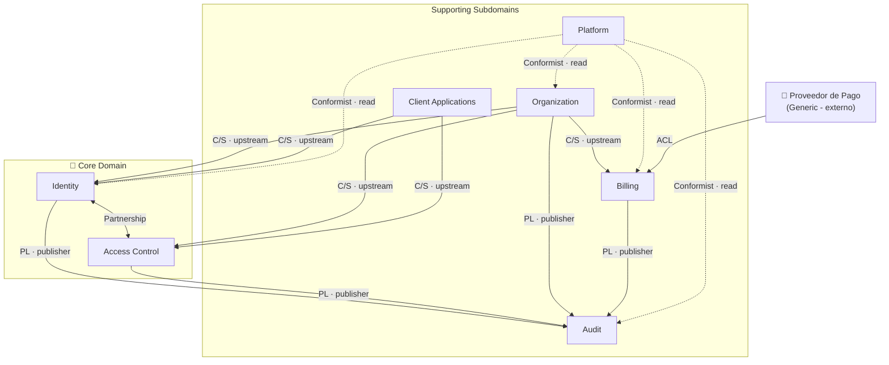
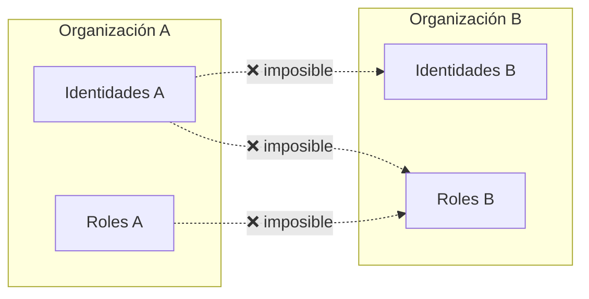

[← Índice](./README.md) | [< Anterior](./ubiquitous-language.md) | [Siguiente >](./domain-events.md)

---

# Mapa de Contextos

El mapa de contextos es el plano estratégico del sistema: muestra qué bounded contexts existen, cómo se relacionan y qué tipo de vínculo tienen. No describe implementación — describe dependencias, poder y flujo de información entre partes del dominio.

En DDD, las relaciones entre contextos no son neutras. Un contexto puede dictar el contrato (upstream) o tener que adaptarse a él (downstream). Saber quién es quién evita que los contextos se contaminen mutuamente.

## Contenido

- [Diagrama general](#diagrama-general)
- [Patrones de relación usados](#patrones-de-relación-usados)
- [Relaciones entre contextos](#relaciones-entre-contextos)
  - [Organization → Identity](#organization--identity)
  - [Organization → Access Control](#organization--access-control)
  - [Organization → Billing](#organization--billing)
  - [Client Applications → Identity](#client-applications--identity)
  - [Client Applications → Access Control](#client-applications--access-control)
  - [Identity ↔ Access Control](#identity--access-control)
  - [Todos los contextos → Audit](#todos-los-contextos--audit)
  - [Platform → Todos los contextos](#platform--todos-los-contextos)
  - [Proveedor de pago → Billing](#proveedor-de-pago--billing)
- [Restricción transversal: aislamiento](#restricción-transversal-aislamiento)
- [Comentarios de los Revisores](#comentarios-de-los-revisores)

---

## Diagrama general

Las flechas indican dirección upstream → downstream. El contexto en la cola de la flecha define el contrato; el de la punta se adapta. Las etiquetas indican el patrón de relación.

**Leyenda:**
- `C/S` — Customer/Supplier: el upstream define el contrato, el downstream consume
- `Partnership` — ambos contextos coordinan y evolucionan juntos
- `PL` — Published Language: el publisher expone eventos con un contrato formal
- `Conformist` — el downstream acepta el modelo del upstream tal como es
- `ACL` — Anti-Corruption Layer: el downstream traduce el modelo externo para proteger el propio

[↑ Volver al inicio](#mapa-de-contextos)

---

## Patrones de relación usados

| Patrón | Qué significa | Cuándo se usa |
|--------|---------------|---------------|
| **Customer/Supplier (C/S)** | El upstream (proveedor) define el contrato; el downstream (cliente) lo consume. El upstream tiene responsabilidad de no romper al downstream. | Cuando un contexto necesita datos de otro para operar, pero no tiene poder de cambiar el contrato. |
| **Partnership** | Dos contextos evolucionan juntos; cualquier cambio se coordina entre ambos. No hay upstream ni downstream claro. | Cuando dos contextos están tan integrados que uno no funciona sin el otro. Solo viable cuando son del mismo equipo o la misma persona. |
| **Published Language (PL)** | El publisher expone un contrato de eventos formal y estable. Los consumidores se suscriben sin acoplarse a los internos del publisher. | Para comunicación por eventos donde múltiples contextos consumen del mismo origen. |
| **Conformist** | El downstream acepta el modelo del upstream exactamente como es, sin traducción. | Cuando el downstream no tiene poder de negociar el contrato y el costo de una ACL no se justifica. |
| **Anti-Corruption Layer (ACL)** | El downstream construye una capa de traducción que convierte el modelo externo al propio. | En integraciones con sistemas externos cuyo modelo no debe contaminar el dominio propio. |

[↑ Volver al inicio](#mapa-de-contextos)

---

## Relaciones entre contextos

### Organization → Identity

| Campo | Detalle |
|-------|---------|
| **Patrón** | Customer/Supplier — Organization es upstream |
| **Qué provee Organization** | El estado de un usuario (activo, suspendido, eliminado) y la confirmación de que pertenece a una organización válida |
| **Qué necesita Identity** | Saber si una identidad tiene permitido autenticarse antes de emitir credenciales |
| **Contrato** | Organization publica el evento `UsuarioSuspendido` / `UsuarioReactivado` / `UsuarioEliminado`; Identity reacciona invalidando sesiones activas |
| **Riesgo** | Si Organization cambia el modelo de estados sin avisar, Identity puede emitir credenciales para identidades inactivas |

[↑ Volver al inicio](#mapa-de-contextos)

---

### Organization → Access Control

| Campo | Detalle |
|-------|---------|
| **Patrón** | Customer/Supplier — Organization es upstream |
| **Qué provee Organization** | La existencia de usuarios y aplicaciones cliente dentro de una organización |
| **Qué necesita Access Control** | Un usuario y una aplicación deben existir en la misma organización para que una membresía sea válida |
| **Contrato** | Organization publica `UsuarioDadoDeAlta`, `AplicaciónRegistrada`; Access Control mantiene su registro de sujetos y aplicaciones elegibles |
| **Riesgo** | Si un usuario es eliminado en Organization pero Access Control no lo sabe, el usuario podría mantener roles asignados sin existencia válida |

[↑ Volver al inicio](#mapa-de-contextos)

---

### Organization → Billing

| Campo | Detalle |
|-------|---------|
| **Patrón** | Customer/Supplier — Organization es upstream |
| **Qué provee Organization** | Eventos de cambio en la composición del tenant: alta de usuarios, registro de aplicaciones |
| **Qué necesita Billing** | Contabilizar el consumo de recursos para aplicar límites del plan activo |
| **Contrato** | Organization publica `UsuarioDadoDeAlta`, `AplicaciónRegistrada`; Billing mide y puede devolver señal de límite alcanzado |
| **Flujo inverso** | Billing puede notificar a Organization cuando se alcanza un límite; Organization bloquea nuevas altas en ese caso |

[↑ Volver al inicio](#mapa-de-contextos)

---

### Client Applications → Identity

| Campo | Detalle |
|-------|---------|
| **Patrón** | Customer/Supplier — Client Applications es upstream |
| **Qué provee Client Applications** | La existencia y validez de una aplicación cliente registrada, con su credencial de aplicación |
| **Qué necesita Identity** | Verificar que la aplicación que inicia un flujo de autenticación está registrada y activa antes de procesar la autenticación |
| **Contrato** | Identity consulta si una aplicación existe y está activa antes de emitir credenciales en su nombre |
| **Riesgo** | Una aplicación dada de baja debe dejar de poder iniciar flujos; Identity debe reflejar ese cambio sin demora |

[↑ Volver al inicio](#mapa-de-contextos)

---

### Client Applications → Access Control

| Campo | Detalle |
|-------|---------|
| **Patrón** | Customer/Supplier — Client Applications es upstream |
| **Qué provee Client Applications** | El contexto de aplicación dentro del cual se evalúan roles y permisos |
| **Qué necesita Access Control** | Los roles están definidos por aplicación; sin la aplicación como contexto, un rol no tiene significado |
| **Contrato** | Los ámbitos autorizados de una aplicación delimitan qué roles pueden existir en Access Control para esa aplicación |

[↑ Volver al inicio](#mapa-de-contextos)

---

### Identity ↔ Access Control

| Campo | Detalle |
|-------|---------|
| **Patrón** | Partnership — ambos son Core Domain |
| **Naturaleza** | Identity produce la sesión autenticada; Access Control enriquece esa sesión con los roles y permisos activos del sujeto en la aplicación correspondiente |
| **Coordinación** | Cuando se emite una Credencial de Sesión, Access Control provee la información de roles para que quede embebida. Cualquier cambio en la estructura de roles requiere coordinación con Identity para mantener la coherencia de las credenciales emitidas |
| **Por qué Partnership y no C/S** | Ninguno de los dos puede operar de forma completa sin el otro en el flujo de autenticación. Son el núcleo del sistema y evolucionan juntos |

[↑ Volver al inicio](#mapa-de-contextos)

---

### Todos los contextos → Audit

| Campo | Detalle |
|-------|---------|
| **Patrón** | Published Language — cada contexto es publisher; Audit es suscriptor |
| **Qué publican los contextos** | Eventos de seguridad y gobernanza en formato de dominio: `SesiónIniciada`, `RolAsignado`, `UsuarioSuspendido`, `LímiteAlcanzado`, etc. |
| **Qué hace Audit** | Persiste cada evento de forma inmutable, sin transformarlo. No reacciona ni genera efectos — solo registra |
| **Por qué PL y no Conformist** | Audit consume de múltiples contextos; cada uno publica un contrato explícito. Audit no acepta cualquier modelo — acepta eventos bien definidos |
| **Restricción clave** | Audit nunca modifica ni elimina registros. Es el único contexto que tiene esa garantía de inmutabilidad |

[↑ Volver al inicio](#mapa-de-contextos)

---

### Platform → Todos los contextos

| Campo | Detalle |
|-------|---------|
| **Patrón** | Conformist — Platform acepta los modelos de cada contexto tal como son |
| **Qué hace Platform** | Agrega visibilidad operativa sobre el estado del sistema: organizaciones activas, uso global, alertas |
| **Por qué Conformist** | Platform no tiene poder de negociar contratos con los demás contextos; consume lo que estos exponen. No vale la pena una ACL porque Platform no tiene un modelo de dominio propio que proteger |
| **Restricción** | Platform nunca escribe en los contextos que lee. Su rol es observacional y de acción operativa limitada (suspender, reactivar una organización a través de Organization) |

[↑ Volver al inicio](#mapa-de-contextos)

---

### Proveedor de pago → Billing

| Campo | Detalle |
|-------|---------|
| **Patrón** | Anti-Corruption Layer — Billing construye la capa de traducción |
| **Por qué ACL** | El proveedor de pago externo tiene su propio modelo (webhooks, estados de pago, suscripciones en su terminología). Ese modelo no debe contaminar el dominio de Billing |
| **Qué hace la ACL** | Traduce los eventos del proveedor (`payment.succeeded`, `subscription.deleted`) a eventos del dominio de Billing (`PagoConfirmado`, `SuscripciónCancelada`) |
| **Estado** | Fase futura (RF17). La ACL se diseña ahora para que Billing nunca dependa directamente del contrato del proveedor |

[↑ Volver al inicio](#mapa-de-contextos)

---

## Restricción transversal: aislamiento

El aislamiento entre organizaciones no es un contexto — es una restricción que todos los contextos deben respetar. Se representa como una regla transversal, no como una relación en el mapa.

**Regla**: ningún dato de una organización puede ser leído, referenciado o influenciado por otra organización, en ningún contexto, bajo ninguna circunstancia operativa normal. Esta restricción se aplica como invariante en cada contexto, no como un filtro en la capa de presentación.

[↑ Volver al inicio](#mapa-de-contextos)

---

## Comentarios de los Revisores

| Revisor | Tipo | Contenido |
|---------|------|-----------|
| — | — | Pendiente de revisión |

[↑ Volver al inicio](#mapa-de-contextos)

---

[← Índice](./README.md) | [< Anterior](./ubiquitous-language.md) | [Siguiente >](./domain-events.md)
