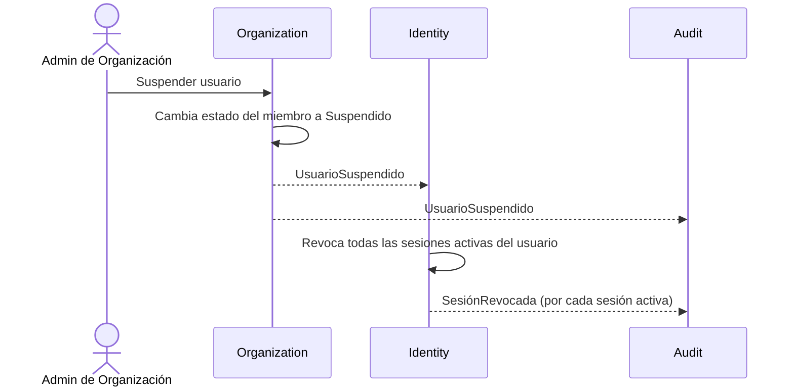
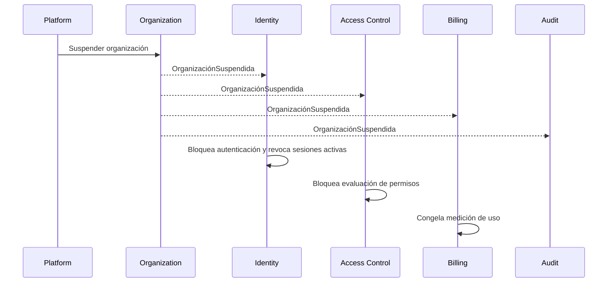
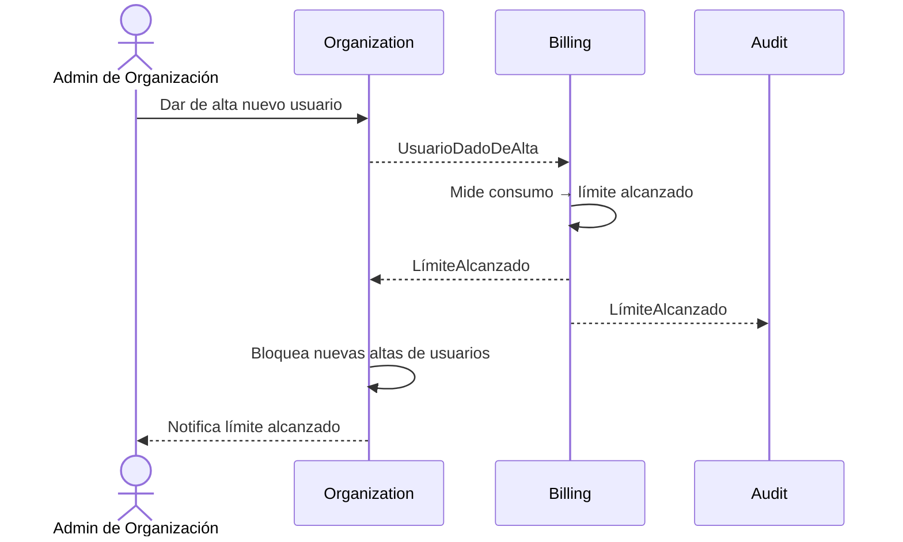
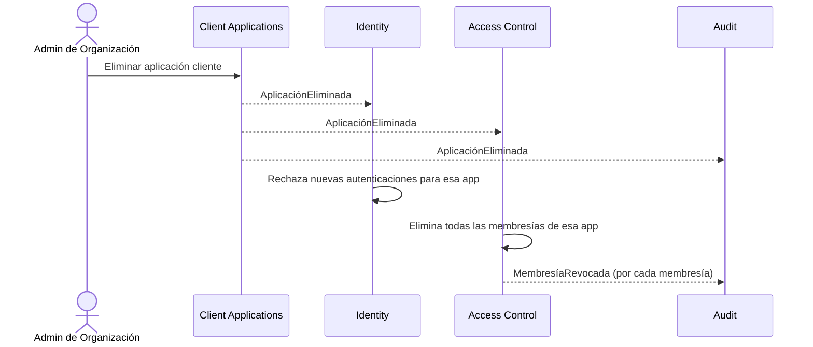
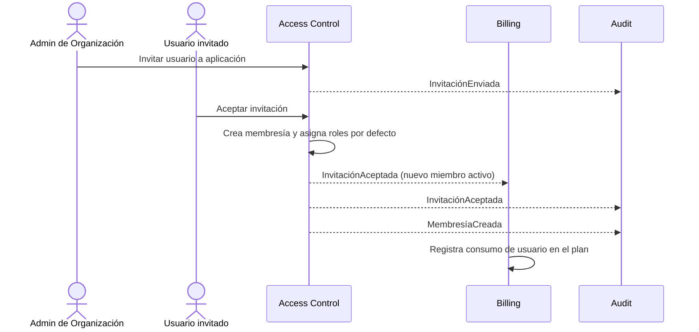
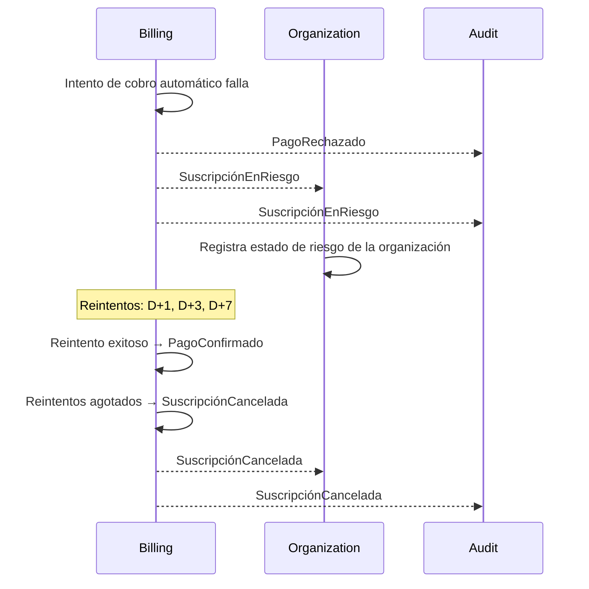
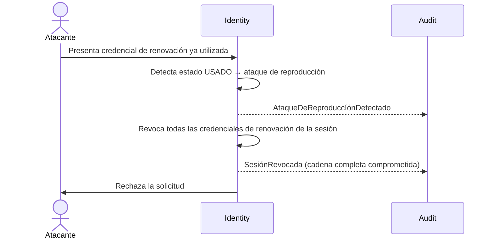
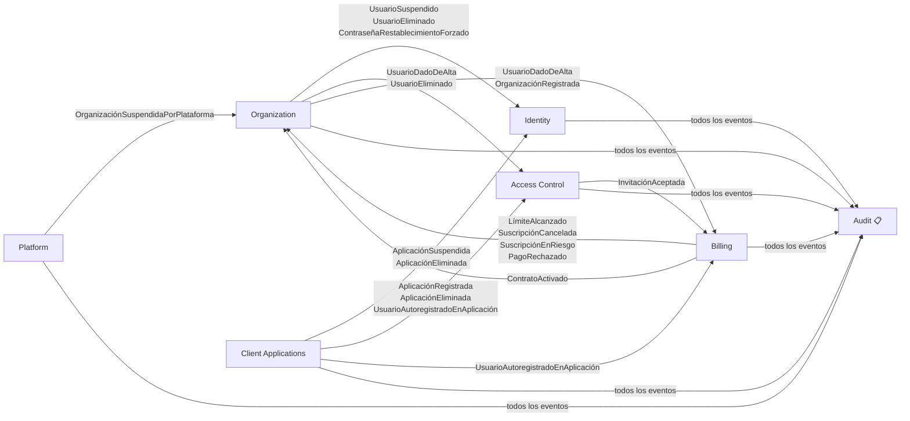

[← Índice](./README.md) | [< Anterior](./context-map.md) | [Siguiente >](./system-flows.md)

---

# Eventos de Dominio

Un evento de dominio es un hecho que ocurrió en el dominio y que el negocio considera relevante. Se nombra en pasado porque representa algo que ya sucedió — no una intención, no un comando, sino un hecho consumado. Los eventos son inmutables: una vez que ocurrieron, no se deshacen (se emite un nuevo evento que lo contrarresta).

Los eventos son el pegamento entre bounded contexts: permiten que un contexto reaccione a lo que ocurre en otro sin acoplarse directamente a su modelo interno.

## Contenido

- [Catálogo de eventos por contexto](#catálogo-de-eventos-por-contexto)
  - [Identity](#identity)
  - [Access Control](#access-control)
  - [Organization](#organization)
  - [Client Applications](#client-applications)
  - [Billing](#billing)
  - [Platform](#platform)
- [Flujos de eventos entre contextos](#flujos-de-eventos-entre-contextos)
  - [Flujo 1 — Usuario suspendido: reacción en cadena](#flujo-1--usuario-suspendido-reacción-en-cadena)
  - [Flujo 2 — Organización suspendida: aislamiento total](#flujo-2--organización-suspendida-aislamiento-total)
  - [Flujo 3 — Límite de plan alcanzado: bloqueo de altas](#flujo-3--límite-de-plan-alcanzado-bloqueo-de-altas)
  - [Flujo 4 — Aplicación eliminada: limpieza en Access Control](#flujo-4--aplicación-eliminada-limpieza-en-access-control)
  - [Flujo 5 — Invitación aceptada: membresía por invitación](#flujo-5--invitación-aceptada-membresía-por-invitación)
  - [Flujo 6 — Pago rechazado: inicio de proceso de dunning](#flujo-6--pago-rechazado-inicio-de-proceso-de-dunning)
  - [Flujo 7 — Ataque de reproducción detectado: revocación de cadena](#flujo-7--ataque-de-reproducción-detectado-revocación-de-cadena)
- [Diagrama de flujo de eventos](#diagrama-de-flujo-de-eventos)
- [Eventos que llegan a Audit](#eventos-que-llegan-a-audit)
- [Comentarios de los Revisores](#comentarios-de-los-revisores)

---

## Catálogo de eventos por contexto

Cada evento incluye:
- **Nombre**: en pasado, en español, sin abreviaturas
- **Qué lo origina**: la acción del dominio que lo produce
- **Datos que lleva**: información mínima que el evento porta (conceptual, no técnica)
- **Quién reacciona**: contextos que consumen este evento

### Identity

| Evento | Qué lo origina | Datos que lleva | Quién reacciona |
|--------|----------------|-----------------|-----------------|
| `AutenticaciónExitosa` | Credenciales válidas presentadas por una identidad | Identificador de identidad, identificador de organización, identificador de aplicación cliente, timestamp | Access Control, Audit |
| `AutenticaciónFallida` | Credenciales inválidas o identidad inexistente | Identificador de organización, identificador de aplicación cliente, motivo del fallo, timestamp | Audit |
| `SesiónIniciada` | Credencial de sesión emitida tras autenticación exitosa | Identificador de sesión, identificador de identidad, identificador de organización, identificador de aplicación cliente, fecha de expiración | Audit |
| `SesiónCerrada` | Cierre explícito iniciado por la identidad | Identificador de sesión, identificador de identidad, timestamp | Audit |
| `SesiónExpirada` | Fin natural del período de validez de la sesión | Identificador de sesión, identificador de identidad | Audit |
| `SesiónRevocada` | Invalidación anticipada por la identidad, el administrador o el sistema | Identificador de sesión, identificador de identidad, actor que revocó, motivo | Audit |
| `CredencialDeSesiónRenovada` | Credencial de renovación usada para obtener nueva credencial de sesión | Identificador de sesión, identificador de identidad | Audit |
| `ContraseñaCambiada` | Cambio de contraseña iniciado por la identidad | Identificador de identidad, identificador de organización | Audit |
| `ContraseñaRestablecida` | Restablecimiento por flujo de recuperación | Identificador de identidad, identificador de organización | Audit |
| `ClavesRotadas` | Sistema rota las claves criptográficas de firma | Identificador del conjunto de claves anterior, timestamp de expiración del conjunto anterior | Audit |
| `RecuperaciónDeContraseñaSolicitada` | Identidad inicia el flujo de recuperación de contraseña olvidada | Identificador de organización, identificador de aplicación cliente, timestamp | Audit |
| `EmailVerificado` | Identidad confirma su dirección de correo electrónico mediante el código enviado | Identificador de identidad, identificador de organización | Audit |
| `AtaqueDeReproduccíónDetectado` | Credencial de renovación en estado ya-utilizado es presentada nuevamente | Identificador de sesión, identificador de identidad, motivo | Audit |
| `ConexiónExternaVinculada` | Identidad vincula una cuenta de proveedor de identidad externo a su perfil | Identificador de identidad, identificador de organización, proveedor, identificador externo | Audit |
| `ConexiónExternaDesvinculada` | Identidad elimina el vínculo con un proveedor de identidad externo | Identificador de identidad, identificador de organización, proveedor, identificador de conexión | Audit |
| `PreferenciasDeNotificaciónActualizadas` | Identidad modifica sus preferencias de notificación | Identificador de identidad, identificador de organización, preferencias modificadas | Audit |

[↑ Volver al inicio](#eventos-de-dominio)

---

### Access Control

| Evento | Qué lo origina | Datos que lleva | Quién reacciona |
|--------|----------------|-----------------|-----------------|
| `MembresíaCreada` | Administrador otorga acceso a un usuario sobre una aplicación cliente | Identificador de sujeto, identificador de aplicación, identificador de organización | Audit |
| `MembresíaRevocada` | Administrador elimina el acceso de un usuario a una aplicación cliente | Identificador de sujeto, identificador de aplicación, identificador de organización | Audit |
| `RolAsignado` | Administrador vincula un rol a un sujeto en una aplicación | Identificador de sujeto, nombre del rol, identificador de aplicación | Audit |
| `RolRemovido` | Administrador desvincula un rol de un sujeto en una aplicación | Identificador de sujeto, nombre del rol, identificador de aplicación | Audit |
| `AccesoDenegado` | Evaluación de permisos resulta negativa para una operación | Identificador de sujeto, operación solicitada, identificador de aplicación, motivo | Audit |
| `InvitaciónEnviada` | Administrador invita a un usuario a una aplicación cliente | Identificador de invitación, identificador de sujeto, identificador de aplicación, identificador de organización, fecha de expiración | Audit |
| `InvitaciónAceptada` | Invitado acepta la invitación y obtiene membresía en la aplicación | Identificador de invitación, identificador de sujeto, identificador de aplicación, identificador de organización | Audit |
| `InvitaciónExpirada` | Período de validez de la invitación transcurrió sin ser aceptada | Identificador de invitación, identificador de aplicación, identificador de organización | Audit |
| `InvitaciónRevocada` | Administrador cancela una invitación pendiente antes de su expiración | Identificador de invitación, identificador de aplicación, identificador de organización, actor que revocó | Audit |

[↑ Volver al inicio](#eventos-de-dominio)

---

### Organization

| Evento | Qué lo origina | Datos que lleva | Quién reacciona |
|--------|----------------|-----------------|-----------------|
| `OrganizaciónRegistrada` | Alta de nueva organización en la plataforma | Identificador de organización, nombre, timestamp | Billing, Audit |
| `OrganizaciónActivada` | Organización habilitada para operar | Identificador de organización | Billing, Audit |
| `OrganizaciónSuspendida` | Organización inhabilitada temporalmente | Identificador de organización, motivo | Identity, Access Control, Billing, Audit |
| `OrganizaciónReactivada` | Organización restaurada tras suspensión | Identificador de organización | Billing, Audit |
| `OrganizaciónEliminada` | Organización dada de baja definitivamente | Identificador de organización | Identity, Access Control, Billing, Audit |
| `UsuarioDadoDeAlta` | Nuevo usuario aprovisionado en la organización | Identificador de usuario, identificador de organización | Access Control, Billing, Audit |
| `UsuarioSuspendido` | Usuario inhabilitado dentro de la organización | Identificador de usuario, identificador de organización, motivo | Identity, Audit |
| `UsuarioReactivado` | Usuario restaurado tras suspensión | Identificador de usuario, identificador de organización | Identity, Audit |
| `UsuarioEliminado` | Usuario dado de baja en la organización | Identificador de usuario, identificador de organización | Identity, Access Control, Billing, Audit |
| `ConfiguraciónActualizada` | Administrador modifica parámetros de la organización | Identificador de organización, parámetros modificados | Audit |
| `ContraseñaRestablecimientoForzado` | Administrador obliga a un usuario a restablecer su contraseña en el próximo acceso | Identificador de usuario, identificador de organización, actor que forzó | Identity, Audit |

[↑ Volver al inicio](#eventos-de-dominio)

---

### Client Applications

| Evento | Qué lo origina | Datos que lleva | Quién reacciona |
|--------|----------------|-----------------|-----------------|
| `AplicaciónRegistrada` | Nueva aplicación cliente dada de alta en una organización | Identificador de aplicación, identificador de organización, ámbitos autorizados | Access Control, Billing, Audit |
| `AplicaciónSuspendida` | Aplicación inhabilitada temporalmente | Identificador de aplicación, identificador de organización | Identity, Access Control, Audit |
| `AplicaciónReactivada` | Aplicación restaurada tras suspensión | Identificador de aplicación, identificador de organización | Identity, Audit |
| `AplicaciónEliminada` | Aplicación dada de baja definitivamente | Identificador de aplicación, identificador de organización | Identity, Access Control, Billing, Audit |
| `CredencialDeAplicaciónRotada` | Credencial de aplicación reemplazada por el administrador | Identificador de aplicación, identificador de organización | Audit |
| `PolíticaDeAutoregistroConfigurada` | Administrador define cómo los usuarios pueden autoregistrarse en la aplicación | Identificador de aplicación, identificador de organización, política configurada | Audit |
| `UsuarioAutoregistradoEnAplicación` | Usuario se registra autónomamente en una aplicación cliente sin invitación previa | Identificador de sujeto, identificador de aplicación, identificador de organización | Access Control, Billing, Audit |

[↑ Volver al inicio](#eventos-de-dominio)

---

### Billing

| Evento | Qué lo origina | Datos que lleva | Quién reacciona |
|--------|----------------|-----------------|-----------------|
| `SuscripciónActivada` | Plan asociado a una organización | Identificador de organización, nombre del plan, límites | Audit |
| `PlanCambiado` | Organización migra a otro plan | Identificador de organización, plan anterior, plan nuevo | Audit |
| `SuscripciónCancelada` | Suscripción terminada | Identificador de organización, motivo | Organization, Audit |
| `LímiteAlcanzado` | Consumo de un recurso llega al máximo del plan | Identificador de organización, tipo de recurso, límite | Organization, Audit |
| `UsoRegistrado` | Sistema contabiliza consumo de un recurso | Identificador de organización, tipo de recurso, cantidad | — |
| `ContratoCreado` | Alta de un contrato de suscripción en estado borrador | Identificador de contrato, identificador de organización, plan asociado | Audit |
| `ContratoActivado` | Contrato transiciona a estado activo e inicia la suscripción formal | Identificador de contrato, identificador de organización | Organization, Audit |
| `FacturaGenerada` | Sistema genera una factura al inicio de un ciclo de facturación | Identificador de factura, identificador de organización, monto, período de cobertura | Audit |
| `PagoConfirmado` | Proveedor de pago confirma la transacción de cobro | Identificador de factura, identificador de organización | Audit |
| `PagoRechazado` | Proveedor de pago rechaza la transacción de cobro | Identificador de factura, identificador de organización, motivo | Organization, Audit |
| `SuscripciónRenovada` | Sistema renueva automáticamente la suscripción al vencer el período activo | Identificador de organización, plan, nuevo período de cobertura | Audit |
| `SuscripciónEnRiesgo` | Pago fallido inicia el ciclo de reintento de cobro (proceso de dunning) | Identificador de organización, número de intento, fecha del próximo reintento | Organization, Audit |

[↑ Volver al inicio](#eventos-de-dominio)

---

### Platform

| Evento | Qué lo origina | Datos que lleva | Quién reacciona |
|--------|----------------|-----------------|-----------------|
| `OrganizaciónSuspendidaPorPlataforma` | Administrador de Plataforma suspende una organización | Identificador de organización, administrador actuante, motivo | Organization, Audit |
| `OrganizaciónReactivadaPorPlataforma` | Administrador de Plataforma reactiva una organización | Identificador de organización, administrador actuante | Organization, Audit |
| `UsuarioDePlataformaCreado` | Alta de un usuario administrador de plataforma | Identificador de usuario, actor que creó, timestamp | Audit |
| `UsuarioDePlataformaSuspendido` | Administrador inhabilita a un usuario de plataforma | Identificador de usuario, actor que suspendió, motivo | Audit |
| `UsuarioDePlataformaActivado` | Usuario de plataforma habilitado para operar tras creación o suspensión | Identificador de usuario, actor que activó | Audit |

[↑ Volver al inicio](#eventos-de-dominio)

---

## Flujos de eventos entre contextos

Estos son los flujos más críticos: eventos que cruzando una frontera de contexto desencadenan reacciones en otro.

### Flujo 1 — Usuario suspendido: reacción en cadena

Cuando un administrador suspende a un usuario, el efecto debe propagarse a Identity para invalidar sus sesiones activas.

### Flujo 2 — Organización suspendida: aislamiento total

Cuando una organización es suspendida, todos los contextos operacionales deben bloquear cualquier actividad de sus identidades.

### Flujo 3 — Límite de plan alcanzado: bloqueo de altas

Cuando Billing detecta que se alcanzó el límite de usuarios, Organization bloquea nuevas altas.

### Flujo 4 — Aplicación eliminada: limpieza en Access Control

Cuando una aplicación es eliminada, Access Control debe remover todas las membresías asociadas.

### Flujo 5 — Invitación aceptada: membresía por invitación

El flujo de invitación crea una membresía en Access Control y descuenta consumo en Billing.

### Flujo 6 — Pago rechazado: inicio de proceso de dunning

Cuando el cobro automático falla, Billing notifica a Organization y gestiona reintentos.

### Flujo 7 — Ataque de reproducción detectado: revocación de cadena

Cuando una credencial de renovación ya utilizada es presentada de nuevo, el sistema asume compromiso y revoca toda la cadena de sesión.

[↑ Volver al inicio](#eventos-de-dominio)

---

## Diagrama de flujo de eventos

Vista consolidada de todos los eventos que fluyen entre contextos.

[↑ Volver al inicio](#eventos-de-dominio)

---

## Eventos que llegan a Audit

Audit consume eventos de todos los contextos. Esta tabla muestra qué eventos son obligatoriamente auditables por su relevancia para seguridad y cumplimiento.

| Prioridad | Evento | Contexto origen | Justificación |
|-----------|--------|-----------------|---------------|
| 🔴 Crítica | `AutenticaciónFallida` | Identity | Detección de ataques de fuerza bruta |
| 🔴 Crítica | `AtaqueDeReproduccíónDetectado` | Identity | Compromiso de credencial activa — revocación inmediata requerida |
| 🔴 Crítica | `SesiónRevocada` | Identity | Trazabilidad de invalidaciones de acceso |
| 🔴 Crítica | `AccesoDenegado` | Access Control | Detección de intentos de acceso no autorizado |
| 🔴 Crítica | `UsuarioSuspendido` / `UsuarioEliminado` | Organization | Cambios en identidades activas |
| 🔴 Crítica | `ContraseñaRestablecimientoForzado` | Organization | Acción administrativa sobre credenciales de usuario |
| 🔴 Crítica | `OrganizaciónSuspendida` | Organization | Impacto total sobre un tenant |
| 🔴 Crítica | `RolAsignado` / `RolRemovido` | Access Control | Cambios en superficie de autorización |
| 🔴 Crítica | `InvitaciónRevocada` | Access Control | Cancelación de acceso antes de ser ejercido |
| 🟡 Alta | `SesiónIniciada` / `SesiónCerrada` | Identity | Historial de acceso por identidad |
| 🟡 Alta | `EmailVerificado` | Identity | Confirmación de titularidad de dirección de correo |
| 🟡 Alta | `MembresíaCreada` / `MembresíaRevocada` | Access Control | Control de acceso a aplicaciones |
| 🟡 Alta | `InvitaciónEnviada` / `InvitaciónAceptada` | Access Control | Flujo de incorporación de nuevos miembros |
| 🟡 Alta | `ContraseñaCambiada` / `ContraseñaRestablecida` | Identity | Cambios en credenciales de autenticación |
| 🟡 Alta | `AplicaciónRegistrada` / `AplicaciónEliminada` | Client Applications | Cambios en la superficie de integración |
| 🟡 Alta | `UsuarioAutoregistradoEnAplicación` | Client Applications | Alta de miembro por flujo autónomo — sin revisión previa del administrador |
| 🟡 Alta | `PagoRechazado` / `SuscripciónEnRiesgo` | Billing | Riesgo de continuidad del servicio para un tenant |
| 🟡 Alta | `UsuarioDePlataformaSuspendido` / `UsuarioDePlataformaActivado` | Platform | Cambios en operadores con acceso transversal |
| 🟢 Normal | `ClavesRotadas` | Identity | Auditoría de operaciones criptográficas |
| 🟢 Normal | `LímiteAlcanzado` | Billing | Trazabilidad de restricciones operativas |
| 🟢 Normal | `SuscripciónActivada` / `PlanCambiado` / `SuscripciónRenovada` | Billing | Cambios en capacidades habilitadas |
| 🟢 Normal | `ContratoCreado` / `ContratoActivado` | Billing | Ciclo de vida del acuerdo comercial |
| 🟢 Normal | `FacturaGenerada` / `PagoConfirmado` | Billing | Registro del ciclo de cobro |
| 🟢 Normal | `PolíticaDeAutoregistroConfigurada` | Client Applications | Cambios en la política de incorporación de usuarios |
| 🟢 Normal | `ConexiónExternaVinculada` / `ConexiónExternaDesvinculada` | Identity | Cambios en el conjunto de proveedores de identidad asociados |

[↑ Volver al inicio](#eventos-de-dominio)

---

## Comentarios de los Revisores

| Revisor | Tipo | Contenido |
|---------|------|-----------|
| — | — | Pendiente de revisión |

[↑ Volver al inicio](#eventos-de-dominio)

---

[← Índice](./README.md) | [< Anterior](./context-map.md) | [Siguiente >](./system-flows.md)
