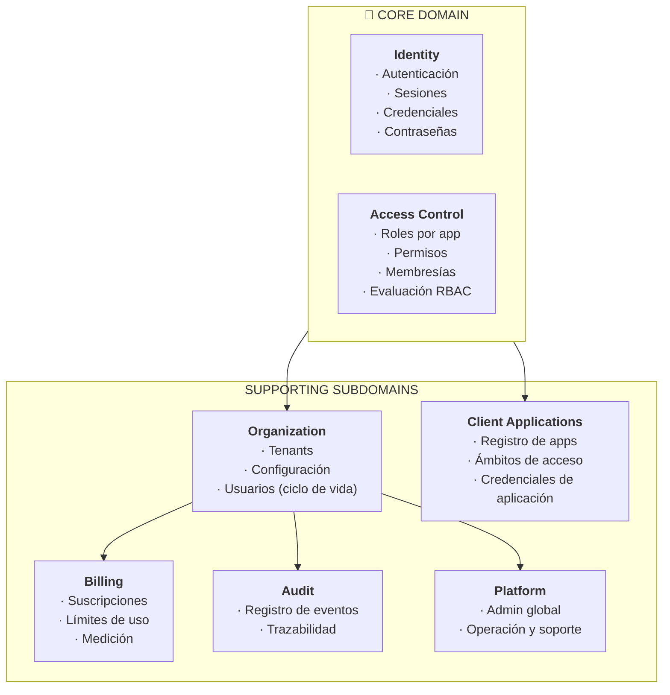

[← Índice](./README.md) | [Siguiente >](./ubiquitous-language.md)

---

# Diseño Estratégico

El diseño estratégico es el primer paso en DDD: antes de modelar entidades o flujos, se define **dónde está el valor real del sistema** y **qué partes del dominio merecen el mayor esfuerzo de modelado**. Esta decisión guía todo lo que viene después.

## Contenido

- [Domain Vision Statement](#domain-vision-statement)
- [Clasificación de Subdominios](#clasificación-de-subdominios)
- [Core Domain — Justificación](#core-domain--justificación)
- [Bounded Contexts candidatos](#bounded-contexts-candidatos)
- [Implicaciones para el modelado](#implicaciones-para-el-modelado)
- [Comentarios de los Revisores](#comentarios-de-los-revisores)

---

## Domain Vision Statement

> Keygo existe para ser la fuente única de verdad sobre **quién es una identidad, qué puede hacer y bajo qué condiciones opera**, dentro de cualquier ecosistema SaaS que no quiera construir ni mantener su propia infraestructura de identidad y acceso.
>
> La ventaja competitiva de Keygo no está en ser multi-tenant — esa es la forma en que sirve a múltiples organizaciones de forma segura y aislada. La ventaja está en la **capacidad de gestionar identidad, sesiones y control de acceso de forma delegada, segura y trazable**, con el nivel de granularidad que cada organización necesita.
>
> El sistema es exitoso cuando una organización puede conectar cualquier aplicación, definir sus reglas de acceso y confiar en que Keygo las enforce — sin escribir una línea de lógica de autenticación propia.

[↑ Volver al inicio](#diseño-estratégico)

---

## Clasificación de Subdominios

En DDD, no todos los subdominios merecen el mismo nivel de inversión. La clasificación determina dónde se aplica el modelado más profundo y dónde se prioriza la simplicidad o la compra de soluciones.

### Core Domain — El diferenciador

| Subdominio | Descripción |
|------------|-------------|
| **Identidad y Sesiones** | Autenticación de usuarios, emisión y verificación de credenciales de sesión, ciclo de vida de sesiones, renovación y revocación. Este es el núcleo del sistema: sin esto, Keygo no existe. |
| **Control de Acceso** | Definición y evaluación de roles, permisos y membresías por aplicación. Es donde Keygo entrega la granularidad que las organizaciones necesitan para delegar acceso con precisión. |

El Core Domain es donde vive la lógica que no se puede comprar, replicar con un framework genérico ni delegar. Es donde se concentra el mayor esfuerzo de modelado, los mejores nombres, las abstracciones más cuidadas.

### Supporting Subdomains — Necesarios, no diferenciadores

| Subdominio | Descripción |
|------------|-------------|
| **Organización** | Gestión del ciclo de vida de tenants: registro, configuración, activación, suspensión. Sin esto el modelo multi-tenant no funciona, pero no es donde está la ventaja competitiva. |
| **Aplicaciones Cliente** | Registro y configuración de sistemas externos que delegan autenticación en Keygo. Es el punto de entrada del ecosistema de integración. |
| **Auditoría y Trazabilidad** | Registro inmutable de eventos de seguridad y acceso. Necesario para cumplimiento normativo y soporte ante incidentes. |
| **Facturación y Suscripciones** | Gestión de planes, límites y ciclos de facturación por organización. Habilita el modelo de negocio, pero la lógica de cobro es delegable. |
| **Administración de Plataforma** | Backoffice del equipo operativo de Keygo: visibilidad global, gestión de organizaciones, soporte. |

### Generic Subdomains — Comprar o delegar

| Subdominio | Descripción |
|------------|-------------|
| **Procesamiento de pagos** | La integración con proveedores de pago (fase futura) es un caso de uso genérico. Ninguna ventaja competitiva en implementarlo desde cero. Se delega a un proveedor externo. |
| **Notificaciones** | Envío de emails transaccionales (verificación, recuperación de contraseña). Commodity — se consume un servicio externo. |

[↑ Volver al inicio](#diseño-estratégico)

---

## Core Domain — Justificación

La decisión de poner **Identidad + Control de Acceso** como Core Domain, y no Organización, responde a una pregunta simple: **¿qué es lo que Keygo hace que una organización no puede simplemente comprar o replicar fácilmente?**

- **Autenticación básica** la puede hacer cualquier librería. Keygo aporta el modelo **delegado y multi-tenant**: la organización configura sus políticas, y Keygo las enforce para todas sus aplicaciones.
- **RBAC básico** existe en cualquier framework. Keygo aporta el modelo **por-aplicación dentro del mismo tenant**: el mismo usuario puede tener roles distintos en distintas aplicaciones de su organización.
- **Multi-tenancy** es el medio, no el fin. Es lo que hace posible que Keygo sirva a muchas organizaciones de forma segura, pero no es lo que las organizaciones le compran.

Lo que las organizaciones le compran a Keygo es no tener que preocuparse por **quién entra, qué puede hacer y que eso quede registrado** — y eso vive en Identidad y Control de Acceso.

[↑ Volver al inicio](#diseño-estratégico)

---

## Bounded Contexts candidatos

Un Bounded Context es una frontera explícita dentro de la cual un modelo de dominio particular es válido y consistente. El mismo concepto ("Usuario") puede existir en varios contextos con modelos distintos — y eso es correcto y esperado.

**Nota sobre el concepto "Usuario" en múltiples contextos:**

| Contexto | Qué es "Usuario" aquí |
|----------|-----------------------|
| Identity | Una identidad con credenciales, con capacidad de autenticarse |
| Access Control | Un sujeto con roles y permisos asignados en cada aplicación |
| Organization | Un miembro del tenant con estado (activo, suspendido) y aprovisionamiento |
| Audit | Un actor cuyas acciones se registran |
| Billing | Una unidad de consumo que cuenta contra los límites del plan |

Esta multiplicidad es intencional y saludable en DDD. No se trata de inconsistencia — se trata de que cada contexto tiene su propia perspectiva del mismo actor, y esa perspectiva está bien delimitada.

[↑ Volver al inicio](#diseño-estratégico)

---

## Implicaciones para el modelado

Estas decisiones estratégicas tienen consecuencias directas sobre cómo se aborda el resto del diseño:

| Decisión | Implicación |
|----------|-------------|
| Identity + Access Control son Core | Son los contextos que se modelan con mayor profundidad: lenguaje más preciso, eventos más detallados, flujos más cuidados. |
| Organization es Supporting | Se modela con suficiente detalle para funcionar correctamente, sin sobre-ingeniería. |
| Billing es Supporting → Generic | El modelo de dominio de Billing es simple; la complejidad real está en la integración con el proveedor de pago (futuro). |
| Audit es Supporting | Su diseño prioriza inmutabilidad y consultabilidad, no riqueza de modelo. |
| Multi-tenancy es el medio | El aislamiento entre organizaciones es una restricción transversal, no un contexto en sí mismo. Todos los contextos la respetan. |
| Pagos y notificaciones son Generic | No se modelan en profundidad: se define el contrato de integración, no el modelo interno. |

[↑ Volver al inicio](#diseño-estratégico)

---

## Comentarios de los Revisores

| Revisor | Tipo | Contenido |
|---------|------|-----------|
| — | — | Pendiente de revisión |

[↑ Volver al inicio](#diseño-estratégico)

---

[← Índice](./README.md) | [Siguiente >](./ubiquitous-language.md)
