[← Índice](./README.md) | [< Anterior](./domain-events.md) | [Siguiente >](./process-decisions.md)

---

# Flujos del Sistema

Los flujos del sistema describen los procesos principales de Keygo en lenguaje del dominio: qué actores intervienen, qué pasos ocurren, qué eventos se producen y qué invariantes se deben cumplir. No describen implementación — describen comportamiento observable del sistema desde la perspectiva del dominio.

## Contenido

- [Flujos del Sistema](#flujos-del-sistema)
  - [Contenido](#contenido)
  - [Convenciones de lectura](#convenciones-de-lectura)
  - [Flujo 1 — Autenticación de usuario](#flujo-1--autenticación-de-usuario)
  - [Flujo 2 — Renovación de credencial de sesión](#flujo-2--renovación-de-credencial-de-sesión)
  - [Flujo 3 — Revocación de sesión](#flujo-3--revocación-de-sesión)
  - [Flujo 4 — Recuperación de contraseña](#flujo-4--recuperación-de-contraseña)
  - [Flujo 5 — Evaluación de acceso](#flujo-5--evaluación-de-acceso)
  - [Flujo 6 — Alta de usuario en organización](#flujo-6--alta-de-usuario-en-organización)
  - [Flujo 7 — Incorporación de miembro a aplicación por invitación](#flujo-7--incorporación-de-miembro-a-aplicación-por-invitación)
  - [Flujo 8 — Autoregistro en aplicación](#flujo-8--autoregistro-en-aplicación)
  - [Flujo 9 — Rotación de claves criptográficas](#flujo-9--rotación-de-claves-criptográficas)
  - [Flujo 10 — Alta de aplicación cliente](#flujo-10--alta-de-aplicación-cliente)
  - [Flujo 11 — Activación de suscripción](#flujo-11--activación-de-suscripción)
  - [Flujo 12 — Suspensión de organización por plataforma](#flujo-12--suspensión-de-organización-por-plataforma)
  - [Apéndice: Diagramas Técnicos Detallados (Sequence Diagrams)](#apéndice-diagramas-técnicos-detallados-sequence-diagrams)
    - [A. Flujo de Autenticación Completo (OAuth2/OIDC)](#a-flujo-de-autenticación-completo-oauth2oidc)
    - [B. Flujo de Renovación de Token (Refresh Token Rotation)](#b-flujo-de-renovación-de-token-refresh-token-rotation)
    - [C. Flujo de Gestión de Facturas y Pagos](#c-flujo-de-gestión-de-facturas-y-pagos)
    - [D. Flujo de Gestión de Tenants (Multi-Tenant Isolation)](#d-flujo-de-gestión-de-tenants-multi-tenant-isolation)
    - [E. Flujo de Self-Service Usuario (Profile + Sessions)](#e-flujo-de-self-service-usuario-profile--sessions)

---

## Convenciones de lectura

- **Actor** → quién inicia la acción
- **Precondición** → estado que debe existir antes de que el flujo pueda ocurrir
- **Pasos** → secuencia de acciones en lenguaje del dominio
- **Eventos producidos** → hechos que quedan registrados
- **Invariantes** → reglas que el sistema no puede violar bajo ninguna circunstancia
- **Variantes** → caminos alternativos o de error relevantes

[↑ Volver al inicio](#flujos-del-sistema)

---

## Flujo 1 — Autenticación de usuario

La autenticación es el proceso central de Keygo: verificar que una identidad es quien afirma ser y emitir credenciales que lo acrediten.

**Actor**: Aplicación cliente (en nombre de un usuario final)
**Precondiciones**:
- La aplicación cliente está registrada y activa en la organización
- La organización está activa
- El usuario existe y está activo en la organización

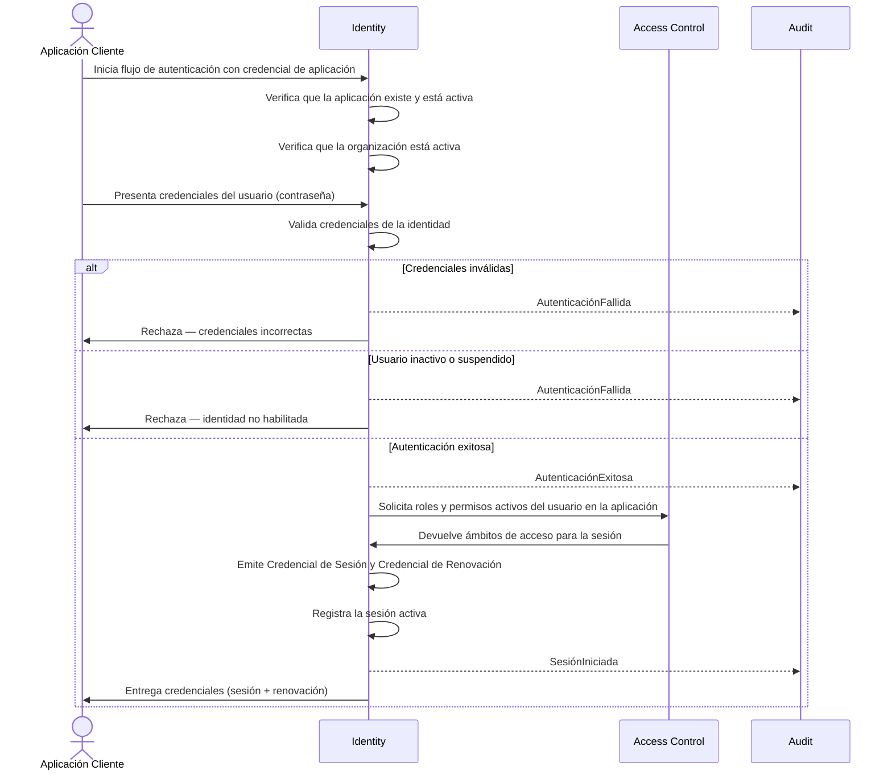
```mermaid
sequenceDiagram
    actor App as Aplicación Cliente
    participant ID as Identity
    participant AC as Access Control
    participant AUD as Audit

    App->>ID: Inicia flujo de autenticación con credencial de aplicación
    ID->>ID: Verifica que la aplicación existe y está activa
    ID->>ID: Verifica que la organización está activa
    App->>ID: Presenta credenciales del usuario (contraseña)
    ID->>ID: Valida credenciales de la identidad
    alt Credenciales inválidas
        ID-->>AUD: AutenticaciónFallida
        ID->>App: Rechaza — credenciales incorrectas
    else Usuario inactivo o suspendido
        ID-->>AUD: AutenticaciónFallida
        ID->>App: Rechaza — identidad no habilitada
    else Autenticación exitosa
        ID-->>AUD: AutenticaciónExitosa
        ID->>AC: Solicita roles y permisos activos del usuario en la aplicación
        AC->>ID: Devuelve ámbitos de acceso para la sesión
        ID->>ID: Emite Credencial de Sesión y Credencial de Renovación
        ID->>ID: Registra la sesión activa
        ID-->>AUD: SesiónIniciada
        ID->>App: Entrega credenciales (sesión + renovación)
    end
```

**Eventos producidos**: `AutenticaciónExitosa` o `AutenticaciónFallida`, `SesiónIniciada`

**Invariantes**:
- Una aplicación suspendida no puede iniciar flujos de autenticación
- Una organización suspendida bloquea toda autenticación de sus identidades
- Un usuario suspendido no puede autenticarse aunque sus credenciales sean correctas
- Los roles y permisos quedan embebidos en la Credencial de Sesión en el momento de emisión

**Variantes**:
- Si el usuario tiene activado el restablecimiento forzado de contraseña, el flujo redirige al cambio de contraseña antes de emitir credenciales
- Si el usuario no ha verificado su email, el sistema puede requerir verificación según la política de la organización

[↑ Volver al inicio](#flujos-del-sistema)

---

## Flujo 2 — Renovación de credencial de sesión

Permite obtener una nueva Credencial de Sesión sin que el usuario vuelva a autenticarse, usando la Credencial de Renovación activa.

**Actor**: Aplicación cliente (operación automática)
**Precondiciones**:
- La Credencial de Renovación existe y está en estado activo (no usada, no revocada, no expirada)
- La sesión asociada sigue activa

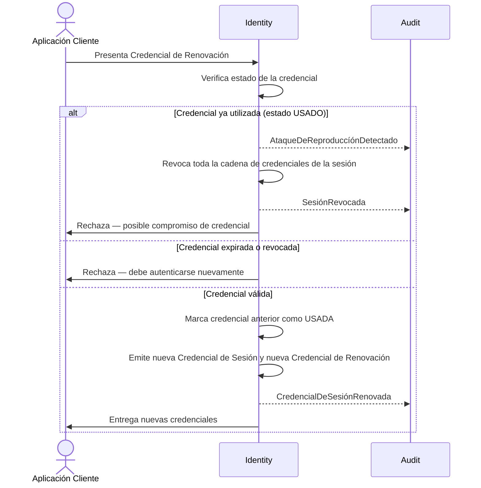
```mermaid
sequenceDiagram
    actor App as Aplicación Cliente
    participant ID as Identity
    participant AUD as Audit

    App->>ID: Presenta Credencial de Renovación
    ID->>ID: Verifica estado de la credencial
    alt Credencial ya utilizada (estado USADO)
        ID-->>AUD: AtaqueDeReproduccíónDetectado
        ID->>ID: Revoca toda la cadena de credenciales de la sesión
        ID-->>AUD: SesiónRevocada
        ID->>App: Rechaza — posible compromiso de credencial
    else Credencial expirada o revocada
        ID->>App: Rechaza — debe autenticarse nuevamente
    else Credencial válida
        ID->>ID: Marca credencial anterior como USADA
        ID->>ID: Emite nueva Credencial de Sesión y nueva Credencial de Renovación
        ID-->>AUD: CredencialDeSesiónRenovada
        ID->>App: Entrega nuevas credenciales
    end
```

**Eventos producidos**: `CredencialDeSesiónRenovada` o `AtaqueDeReproduccíónDetectado` + `SesiónRevocada`

**Invariantes**:
- Una Credencial de Renovación solo puede usarse una vez — al usarse se invalida y se emite una nueva
- Si una credencial ya utilizada se presenta de nuevo, se asume compromiso y se revoca toda la sesión
- El patrón de rotación garantiza que un atacante que roba una credencial de renovación usada no puede continuar la sesión

[↑ Volver al inicio](#flujos-del-sistema)

---

## Flujo 3 — Revocación de sesión

Invalidación anticipada de una sesión activa antes de su expiración natural.

**Actor**: Usuario final (revoca su propia sesión), Administrador de Organización (revoca sesiones de un usuario), Sistema (revoca por evento de dominio)
**Precondiciones**:
- La sesión existe y está activa

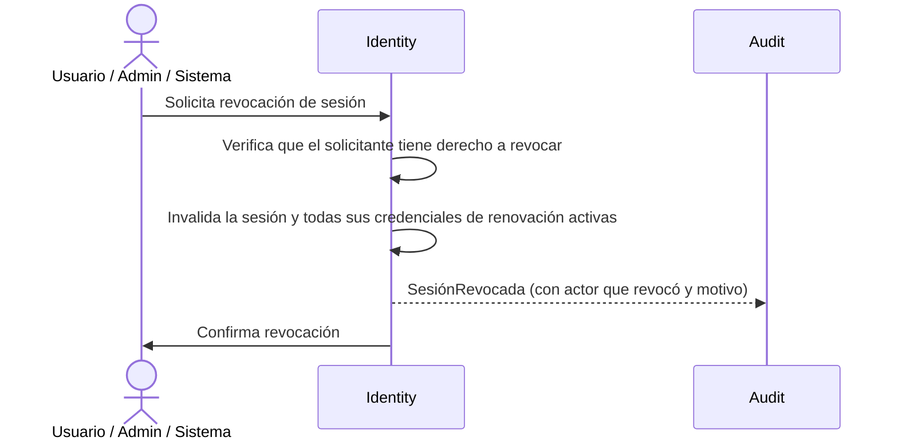
```mermaid
sequenceDiagram
    actor Solicitante as Usuario / Admin / Sistema
    participant ID as Identity
    participant AUD as Audit

    Solicitante->>ID: Solicita revocación de sesión
    ID->>ID: Verifica que el solicitante tiene derecho a revocar
    ID->>ID: Invalida la sesión y todas sus credenciales de renovación activas
    ID-->>AUD: SesiónRevocada (con actor que revocó y motivo)
    ID->>Solicitante: Confirma revocación
```

**Eventos producidos**: `SesiónRevocada`

**Invariantes**:
- Un usuario solo puede revocar sus propias sesiones
- Un Administrador de Organización puede revocar sesiones de usuarios de su organización
- Al revocar una sesión, todas sus Credenciales de Renovación quedan inválidas inmediatamente

**Variantes**:
- Revocación masiva: cuando un usuario es suspendido, todas sus sesiones activas se revocan en cadena
- Revocación por token: una aplicación cliente puede revocar una Credencial de Sesión específica sin revocar toda la sesión

[↑ Volver al inicio](#flujos-del-sistema)

---

## Flujo 4 — Recuperación de contraseña

Permite a una identidad restablecer su contraseña cuando no recuerda la actual.

**Actor**: Usuario final (sin sesión activa)
**Precondiciones**:
- La identidad existe en la organización y está activa

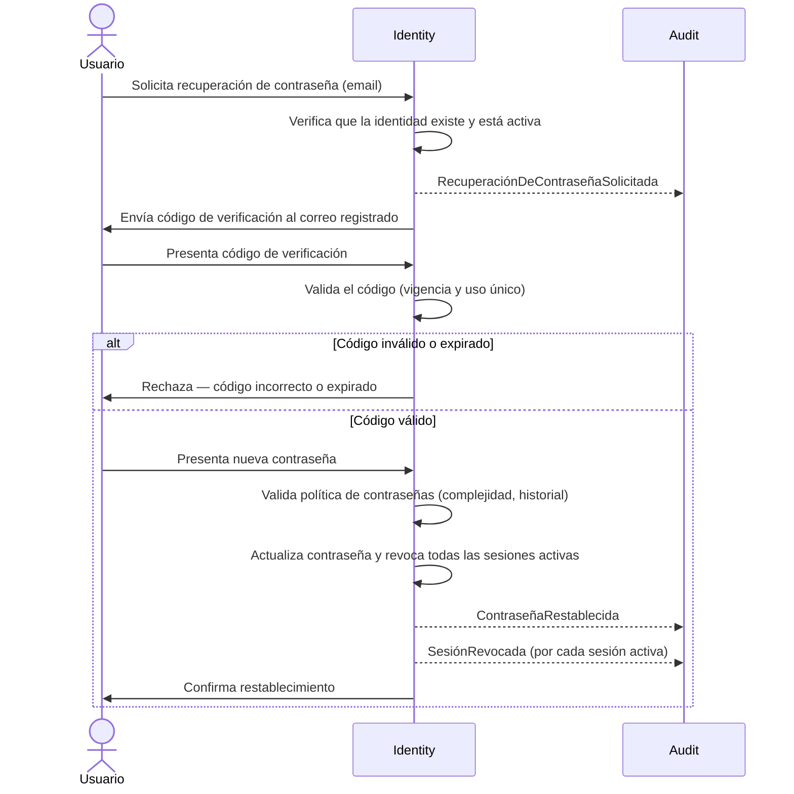
```mermaid
sequenceDiagram
    actor Usuario
    participant ID as Identity
    participant AUD as Audit

    Usuario->>ID: Solicita recuperación de contraseña (email)
    ID->>ID: Verifica que la identidad existe y está activa
    ID-->>AUD: RecuperaciónDeContraseñaSolicitada
    ID->>Usuario: Envía código de verificación al correo registrado

    Usuario->>ID: Presenta código de verificación
    ID->>ID: Valida el código (vigencia y uso único)
    alt Código inválido o expirado
        ID->>Usuario: Rechaza — código incorrecto o expirado
    else Código válido
        Usuario->>ID: Presenta nueva contraseña
        ID->>ID: Valida política de contraseñas (complejidad, historial)
        ID->>ID: Actualiza contraseña y revoca todas las sesiones activas
        ID-->>AUD: ContraseñaRestablecida
        ID-->>AUD: SesiónRevocada (por cada sesión activa)
        ID->>Usuario: Confirma restablecimiento
    end
```

**Eventos producidos**: `RecuperaciónDeContraseñaSolicitada`, `ContraseñaRestablecida`, `SesiónRevocada`

**Invariantes**:
- El código de recuperación tiene validez temporal limitada y es de un solo uso
- Al restablecer la contraseña, todas las sesiones activas se revocan — se fuerza nueva autenticación
- El sistema nunca revela si un email existe o no (responde igual para emails existentes y no existentes)

[↑ Volver al inicio](#flujos-del-sistema)

---

## Flujo 5 — Evaluación de acceso

Proceso por el cual el sistema determina si un sujeto puede ejecutar una operación en el contexto de una aplicación.

**Actor**: Sistema (proceso interno iniciado por la aplicación cliente al verificar la Credencial de Sesión)
**Precondiciones**:
- El sujeto tiene una Credencial de Sesión válida y vigente
- La aplicación cliente conoce la operación que el sujeto intenta ejecutar

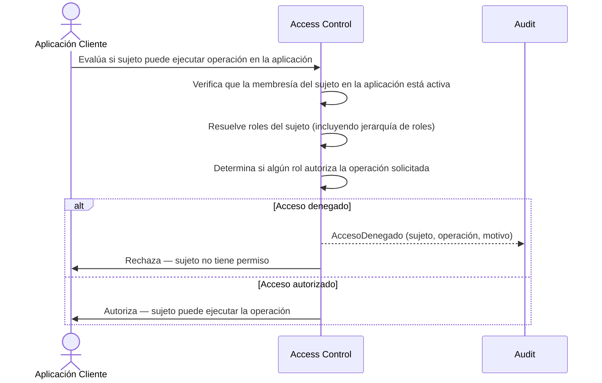
```mermaid
sequenceDiagram
    actor App as Aplicación Cliente
    participant AC as Access Control
    participant AUD as Audit

    App->>AC: Evalúa si sujeto puede ejecutar operación en la aplicación
    AC->>AC: Verifica que la membresía del sujeto en la aplicación está activa
    AC->>AC: Resuelve roles del sujeto (incluyendo jerarquía de roles)
    AC->>AC: Determina si algún rol autoriza la operación solicitada
    alt Acceso denegado
        AC-->>AUD: AccesoDenegado (sujeto, operación, motivo)
        AC->>App: Rechaza — sujeto no tiene permiso
    else Acceso autorizado
        AC->>App: Autoriza — sujeto puede ejecutar la operación
    end
```

**Eventos producidos**: `AccesoDenegado` (en caso de rechazo)

**Invariantes**:
- Un sujeto sin membresía activa en la aplicación no tiene ningún acceso, independientemente de sus roles en otras aplicaciones
- Los roles de una aplicación no tienen efecto en otra aplicación de la misma organización
- La resolución de jerarquía de roles es responsabilidad de Access Control, no de la aplicación cliente

**Nota de diseño**: La Credencial de Sesión lleva los ámbitos embebidos en el momento de emisión. Access Control evalúa sobre esos ámbitos para operaciones de coarse-grained. Para evaluaciones fine-grained (permisos específicos), la aplicación cliente consulta a Access Control en tiempo real.

[↑ Volver al inicio](#flujos-del-sistema)

---

## Flujo 6 — Alta de usuario en organización

Proceso de aprovisionamiento de un nuevo miembro en una organización.

**Actor**: Administrador de Organización
**Precondiciones**:
- La organización está activa
- El plan activo de la organización no ha alcanzado el límite de usuarios

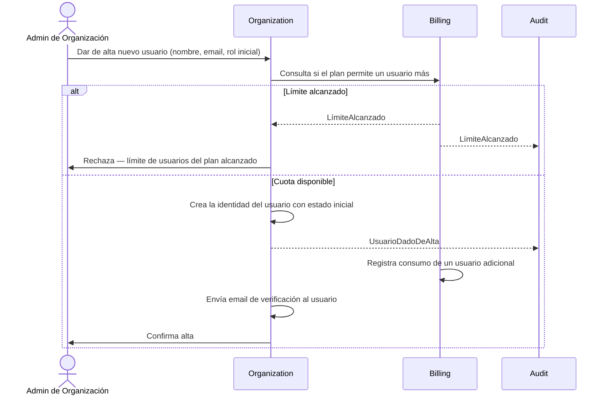
```mermaid
sequenceDiagram
    actor Admin as Admin de Organización
    participant ORG as Organization
    participant BIL as Billing
    participant AUD as Audit

    Admin->>ORG: Dar de alta nuevo usuario (nombre, email, rol inicial)
    ORG->>BIL: Consulta si el plan permite un usuario más
    alt Límite alcanzado
        BIL-->>ORG: LímiteAlcanzado
        BIL-->>AUD: LímiteAlcanzado
        ORG->>Admin: Rechaza — límite de usuarios del plan alcanzado
    else Cuota disponible
        ORG->>ORG: Crea la identidad del usuario con estado inicial
        ORG-->>AUD: UsuarioDadoDeAlta
        BIL->>BIL: Registra consumo de un usuario adicional
        ORG->>ORG: Envía email de verificación al usuario
        ORG->>Admin: Confirma alta
    end
```

**Eventos producidos**: `UsuarioDadoDeAlta`, `LímiteAlcanzado` (si aplica)

**Invariantes**:
- No se puede dar de alta un usuario si el plan activo ha alcanzado su límite
- El usuario se crea con email no verificado hasta que confirme su dirección
- El Administrador de Organización solo puede dar de alta usuarios en su propia organización

[↑ Volver al inicio](#flujos-del-sistema)

---

## Flujo 7 — Incorporación de miembro a aplicación por invitación

El Administrador invita a un usuario existente a una aplicación cliente. El usuario acepta y obtiene membresía.

**Actor**: Administrador de Organización (inicia), Usuario Final (acepta)
**Precondiciones**:
- El usuario existe y está activo en la organización
- La aplicación cliente está activa
- El usuario no tiene membresía activa en esa aplicación

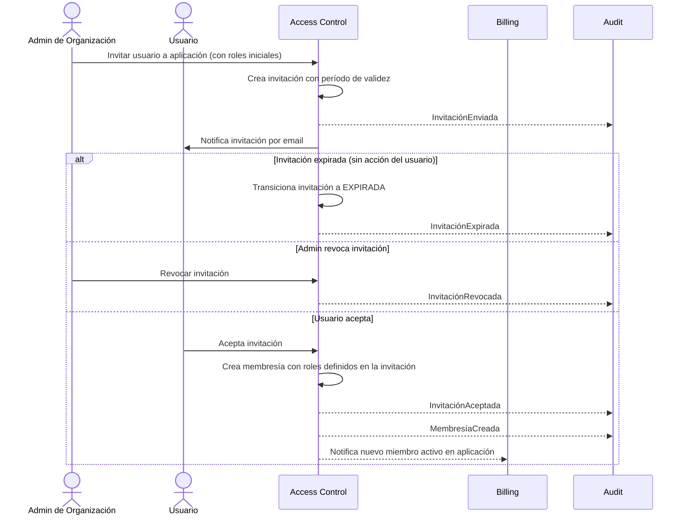
```mermaid
sequenceDiagram
    actor Admin as Admin de Organización
    actor Usuario
    participant AC as Access Control
    participant BIL as Billing
    participant AUD as Audit

    Admin->>AC: Invitar usuario a aplicación (con roles iniciales)
    AC->>AC: Crea invitación con período de validez
    AC-->>AUD: InvitaciónEnviada
    AC->>Usuario: Notifica invitación por email

    alt Invitación expirada (sin acción del usuario)
        AC->>AC: Transiciona invitación a EXPIRADA
        AC-->>AUD: InvitaciónExpirada
    else Admin revoca invitación
        Admin->>AC: Revocar invitación
        AC-->>AUD: InvitaciónRevocada
    else Usuario acepta
        Usuario->>AC: Acepta invitación
        AC->>AC: Crea membresía con roles definidos en la invitación
        AC-->>AUD: InvitaciónAceptada
        AC-->>AUD: MembresíaCreada
        AC-->>BIL: Notifica nuevo miembro activo en aplicación
    end
```

**Eventos producidos**: `InvitaciónEnviada`, `InvitaciónAceptada` + `MembresíaCreada`, o `InvitaciónExpirada`, o `InvitaciónRevocada`

**Invariantes**:
- Una invitación solo puede ser aceptada una vez
- Una invitación expirada no puede ser aceptada aunque el enlace esté disponible
- El Administrador puede cancelar una invitación pendiente en cualquier momento antes de que expire o sea aceptada

[↑ Volver al inicio](#flujos-del-sistema)

---

## Flujo 8 — Autoregistro en aplicación

Un usuario se registra autónomamente en una aplicación que permite el autoregistro, sin intervención del Administrador.

**Actor**: Usuario Final
**Precondiciones**:
- La aplicación tiene la política de autoregistro habilitada
- El usuario existe y está activo en la organización (o se da de alta simultáneamente según la política)

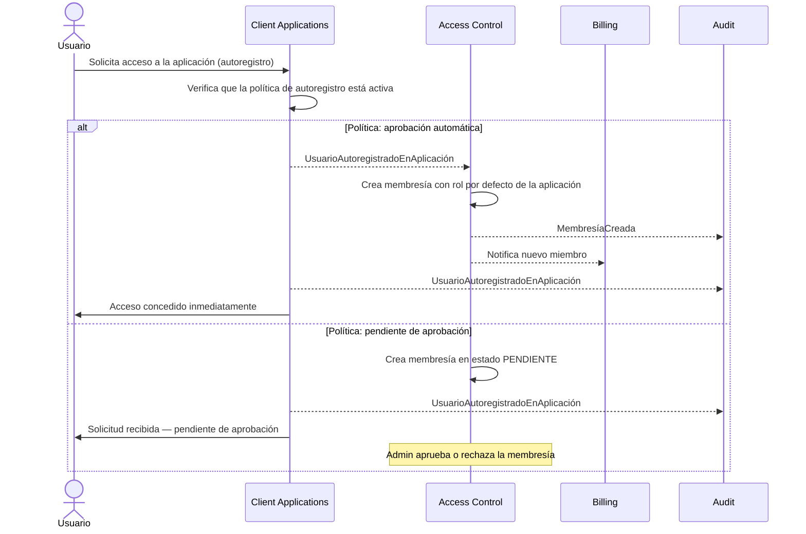
```mermaid
sequenceDiagram
    actor Usuario
    participant CA as Client Applications
    participant AC as Access Control
    participant BIL as Billing
    participant AUD as Audit

    Usuario->>CA: Solicita acceso a la aplicación (autoregistro)
    CA->>CA: Verifica que la política de autoregistro está activa
    alt Política: aprobación automática
        CA-->>AC: UsuarioAutoregistradoEnAplicación
        AC->>AC: Crea membresía con rol por defecto de la aplicación
        AC-->>AUD: MembresíaCreada
        AC-->>BIL: Notifica nuevo miembro
        CA-->>AUD: UsuarioAutoregistradoEnAplicación
        CA->>Usuario: Acceso concedido inmediatamente
    else Política: pendiente de aprobación
        AC->>AC: Crea membresía en estado PENDIENTE
        CA-->>AUD: UsuarioAutoregistradoEnAplicación
        CA->>Usuario: Solicitud recibida — pendiente de aprobación
        Note over AC: Admin aprueba o rechaza la membresía
    end
```

**Eventos producidos**: `UsuarioAutoregistradoEnAplicación`, `MembresíaCreada`

**Invariantes**:
- Si la política de autoregistro está deshabilitada, la solicitud es rechazada sin crear ningún estado
- El rol asignado automáticamente es el rol por defecto configurado en la aplicación
- El Administrador de Organización puede cambiar la política en cualquier momento

[↑ Volver al inicio](#flujos-del-sistema)

---

## Flujo 9 — Rotación de claves criptográficas

Proceso periódico mediante el cual el sistema reemplaza las claves de firma de Credenciales de Sesión sin invalidar las credenciales ya emitidas.

**Actor**: Sistema (proceso automatizado)
**Precondiciones**:
- Las claves actuales han alcanzado su período de rotación

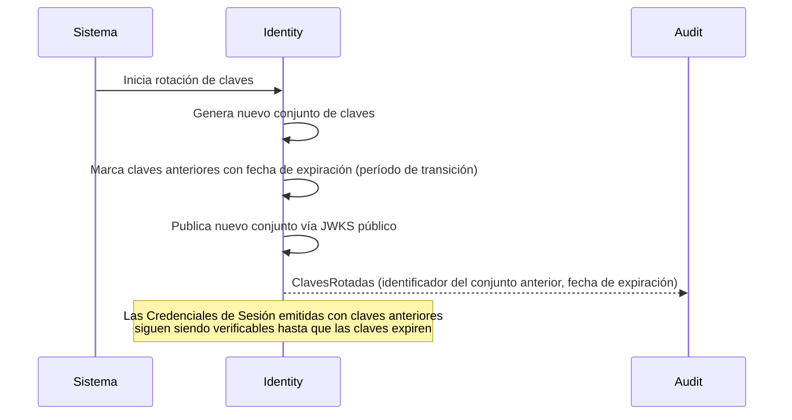
```mermaid
sequenceDiagram
    participant SYS as Sistema
    participant ID as Identity
    participant AUD as Audit

    SYS->>ID: Inicia rotación de claves
    ID->>ID: Genera nuevo conjunto de claves
    ID->>ID: Marca claves anteriores con fecha de expiración (período de transición)
    ID->>ID: Publica nuevo conjunto vía JWKS público
    ID-->>AUD: ClavesRotadas (identificador del conjunto anterior, fecha de expiración)
    Note over ID: Las Credenciales de Sesión emitidas con claves anteriores<br/>siguen siendo verificables hasta que las claves expiren
```

**Eventos producidos**: `ClavesRotadas`

**Invariantes**:
- Las Credenciales de Sesión emitidas con claves anteriores siguen siendo válidas durante el período de transición
- El período de transición debe ser mayor que la duración máxima de una Credencial de Sesión activa
- Las claves anteriores nunca se eliminan hasta que hayan expirado y ninguna credencial vigente las referencie

[↑ Volver al inicio](#flujos-del-sistema)

---

## Flujo 10 — Alta de aplicación cliente

Registro de un sistema externo que delegará autenticación en Keygo.

**Actor**: Administrador de Organización
**Precondiciones**:
- La organización está activa
- El plan activo permite registrar más aplicaciones

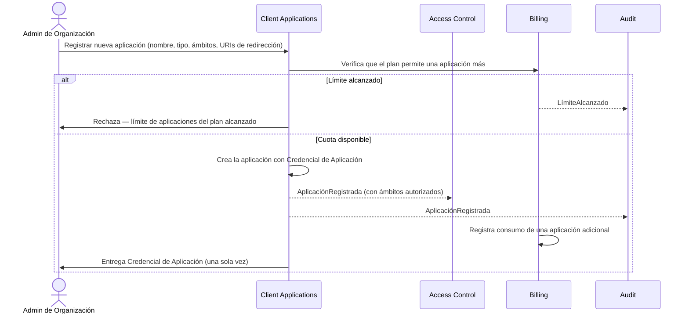
```mermaid
sequenceDiagram
    actor Admin as Admin de Organización
    participant CA as Client Applications
    participant AC as Access Control
    participant BIL as Billing
    participant AUD as Audit

    Admin->>CA: Registrar nueva aplicación (nombre, tipo, ámbitos, URIs de redirección)
    CA->>BIL: Verifica que el plan permite una aplicación más
    alt Límite alcanzado
        BIL-->>AUD: LímiteAlcanzado
        CA->>Admin: Rechaza — límite de aplicaciones del plan alcanzado
    else Cuota disponible
        CA->>CA: Crea la aplicación con Credencial de Aplicación
        CA-->>AC: AplicaciónRegistrada (con ámbitos autorizados)
        CA-->>AUD: AplicaciónRegistrada
        BIL->>BIL: Registra consumo de una aplicación adicional
        CA->>Admin: Entrega Credencial de Aplicación (una sola vez)
    end
```

**Eventos producidos**: `AplicaciónRegistrada`, `LímiteAlcanzado` (si aplica)

**Invariantes**:
- La Credencial de Aplicación se muestra una única vez al momento del registro — no se puede recuperar después
- Los ámbitos autorizados de la aplicación no pueden exceder los ámbitos disponibles en el plan
- Access Control inicializa el contexto de roles de la aplicación al registrarla

[↑ Volver al inicio](#flujos-del-sistema)

---

## Flujo 11 — Activación de suscripción

Proceso por el cual una organización activa un plan de Keygo mediante la creación y activación de un contrato.

**Actor**: Administrador de Organización
**Precondiciones**:
- La organización está registrada
- El email del contratante ha sido verificado

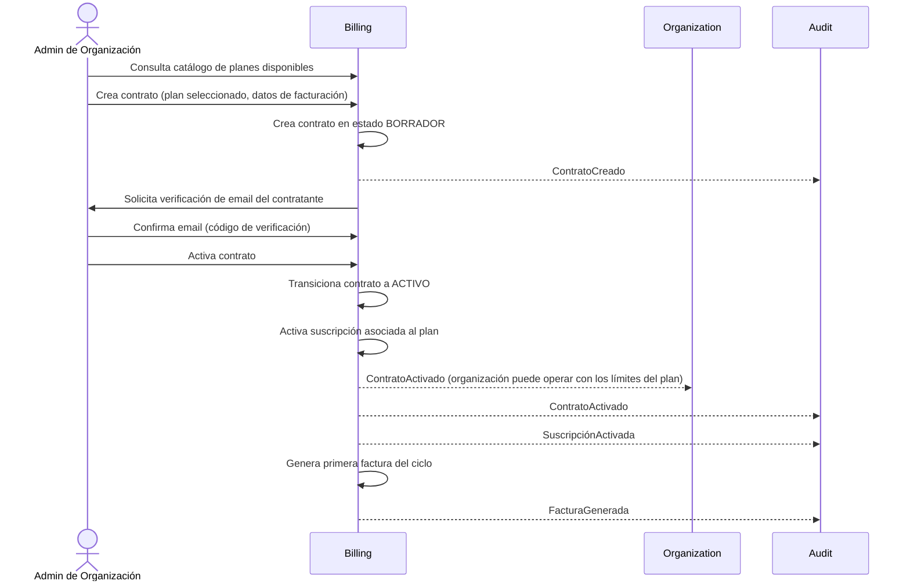
```mermaid
sequenceDiagram
    actor Admin as Admin de Organización
    participant BIL as Billing
    participant ORG as Organization
    participant AUD as Audit

    Admin->>BIL: Consulta catálogo de planes disponibles
    Admin->>BIL: Crea contrato (plan seleccionado, datos de facturación)
    BIL->>BIL: Crea contrato en estado BORRADOR
    BIL-->>AUD: ContratoCreado
    BIL->>Admin: Solicita verificación de email del contratante

    Admin->>BIL: Confirma email (código de verificación)
    Admin->>BIL: Activa contrato
    BIL->>BIL: Transiciona contrato a ACTIVO
    BIL->>BIL: Activa suscripción asociada al plan
    BIL-->>ORG: ContratoActivado (organización puede operar con los límites del plan)
    BIL-->>AUD: ContratoActivado
    BIL-->>AUD: SuscripciónActivada
    BIL->>BIL: Genera primera factura del ciclo
    BIL-->>AUD: FacturaGenerada
```

**Eventos producidos**: `ContratoCreado`, `ContratoActivado`, `SuscripciónActivada`, `FacturaGenerada`

**Invariantes**:
- Una organización solo puede tener una suscripción activa en cada momento
- El contrato no puede activarse sin verificación previa del email del contratante
- Los límites del plan entran en vigor en el momento de activación del contrato

[↑ Volver al inicio](#flujos-del-sistema)

---

## Flujo 12 — Suspensión de organización por plataforma

Cuando el equipo de Keygo suspende una organización por razones operativas o de incumplimiento, el efecto se propaga a todos los contextos.

**Actor**: Administrador de Plataforma
**Precondiciones**:
- La organización está activa

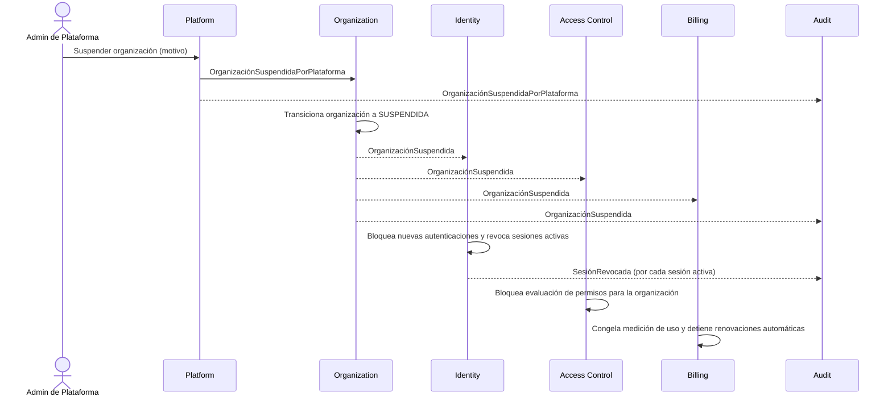
```mermaid
sequenceDiagram
    actor PLTAdmin as Admin de Plataforma
    participant PLT as Platform
    participant ORG as Organization
    participant ID as Identity
    participant AC as Access Control
    participant BIL as Billing
    participant AUD as Audit

    PLTAdmin->>PLT: Suspender organización (motivo)
    PLT->>ORG: OrganizaciónSuspendidaPorPlataforma
    PLT-->>AUD: OrganizaciónSuspendidaPorPlataforma

    ORG->>ORG: Transiciona organización a SUSPENDIDA
    ORG-->>ID: OrganizaciónSuspendida
    ORG-->>AC: OrganizaciónSuspendida
    ORG-->>BIL: OrganizaciónSuspendida
    ORG-->>AUD: OrganizaciónSuspendida

    ID->>ID: Bloquea nuevas autenticaciones y revoca sesiones activas
    ID-->>AUD: SesiónRevocada (por cada sesión activa)
    AC->>AC: Bloquea evaluación de permisos para la organización
    BIL->>BIL: Congela medición de uso y detiene renovaciones automáticas
```

**Eventos producidos**: `OrganizaciónSuspendidaPorPlataforma`, `OrganizaciónSuspendida`, `SesiónRevocada` (múltiples)

**Invariantes**:
- Toda acción del Administrador de Plataforma queda registrada con su identidad y motivo
- La suspensión es inmediata — no hay período de gracia para sesiones activas
- El Administrador de Plataforma no puede ver ni modificar datos de negocio de la organización — solo operar su estado

[↑ Volver al inicio](#flujos-del-sistema)

---

## Apéndice: Diagramas Técnicos Detallados (Sequence Diagrams)

Esta sección contiene diagramas técnicos de secuencia que complementan los flujos del dominio, mostrando cómo los actores internos y externos interactúan con el sistema en detalle. Útiles para developers, QA, y diseño de APIs.

### A. Flujo de Autenticación Completo (OAuth2/OIDC)

Detalle técnico del flujo de autenticación incluyendo Authorization Code + PKCE, Token Exchange, Refresh Token Rotation y Logout.

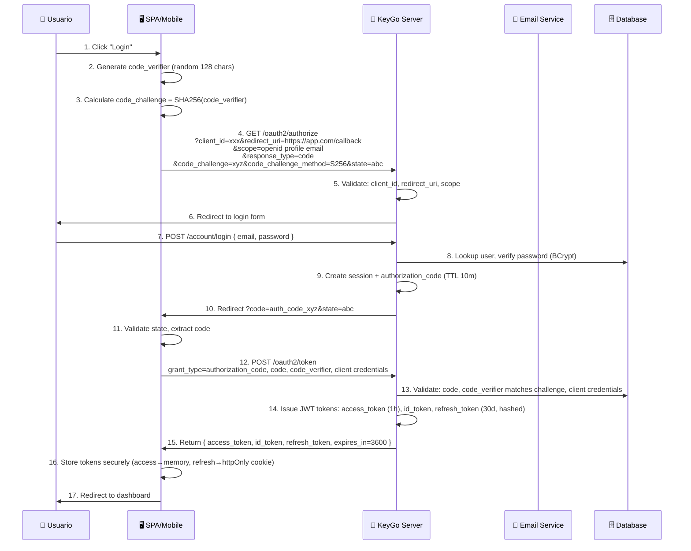
```mermaid
sequenceDiagram
    participant User as 👤 Usuario
    participant SPA as 🖥️ SPA/Mobile
    participant KeyGo as 🔐 KeyGo Server
    participant Email as 📧 Email Service
    participant DB as 🗄️ Database

    User->>SPA: 1. Click "Login"
    SPA->>SPA: 2. Generate code_verifier (random 128 chars)
    SPA->>SPA: 3. Calculate code_challenge = SHA256(code_verifier)
    
    SPA->>KeyGo: 4. GET /oauth2/authorize<br/>?client_id=xxx&redirect_uri=https://app.com/callback<br/>&scope=openid profile email<br/>&response_type=code<br/>&code_challenge=xyz&code_challenge_method=S256&state=abc
    
    KeyGo->>KeyGo: 5. Validate: client_id, redirect_uri, scope
    KeyGo->>User: 6. Redirect to login form
    User->>KeyGo: 7. POST /account/login { email, password }
    
    KeyGo->>DB: 8. Lookup user, verify password (BCrypt)
    KeyGo->>KeyGo: 9. Create session + authorization_code (TTL 10m)
    KeyGo->>SPA: 10. Redirect ?code=auth_code_xyz&state=abc
    
    SPA->>SPA: 11. Validate state, extract code
    SPA->>KeyGo: 12. POST /oauth2/token<br/>grant_type=authorization_code, code, code_verifier, client credentials
    
    KeyGo->>DB: 13. Validate: code, code_verifier matches challenge, client credentials
    KeyGo->>KeyGo: 14. Issue JWT tokens: access_token (1h), id_token, refresh_token (30d, hashed)
    KeyGo->>SPA: 15. Return { access_token, id_token, refresh_token, expires_in=3600 }
    
    SPA->>SPA: 16. Store tokens securely (access→memory, refresh→httpOnly cookie)
    SPA->>User: 17. Redirect to dashboard
```

**Key Points:**
- PKCE prevents authorization code interception
- Tokens issued from backend only (not frontend)
- Refresh token hashed in database (SHA-256)
- Session created for audit trail

---

### B. Flujo de Renovación de Token (Refresh Token Rotation)

Detalle de la rotación segura de refresh tokens, incluyendo detección automática de replay attacks (T-035).

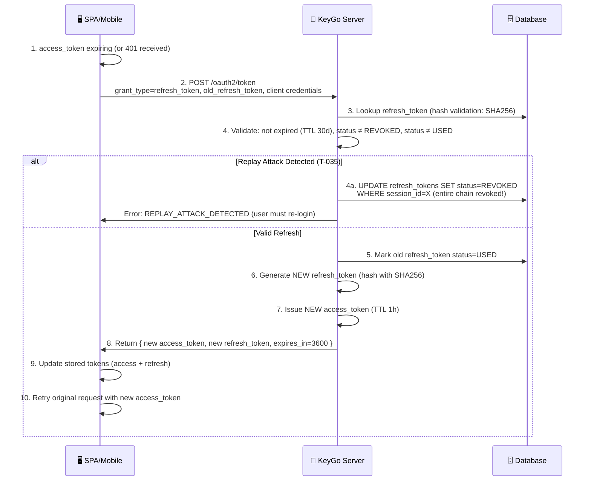
```mermaid
sequenceDiagram
    participant SPA as 🖥️ SPA/Mobile
    participant KeyGo as 🔐 KeyGo Server
    participant DB as 🗄️ Database

    SPA->>SPA: 1. access_token expiring (or 401 received)
    SPA->>KeyGo: 2. POST /oauth2/token<br/>grant_type=refresh_token, old_refresh_token, client credentials
    
    KeyGo->>DB: 3. Lookup refresh_token (hash validation: SHA256)
    KeyGo->>KeyGo: 4. Validate: not expired (TTL 30d), status ≠ REVOKED, status ≠ USED
    
    alt Replay Attack Detected (T-035)
        KeyGo->>DB: 4a. UPDATE refresh_tokens SET status=REVOKED<br/>WHERE session_id=X (entire chain revoked!)
        KeyGo->>SPA: Error: REPLAY_ATTACK_DETECTED (user must re-login)
    else Valid Refresh
        KeyGo->>DB: 5. Mark old refresh_token status=USED
        KeyGo->>KeyGo: 6. Generate NEW refresh_token (hash with SHA256)
        KeyGo->>KeyGo: 7. Issue NEW access_token (TTL 1h)
        KeyGo->>SPA: 8. Return { new access_token, new refresh_token, expires_in=3600 }
        SPA->>SPA: 9. Update stored tokens (access + refresh)
        SPA->>SPA: 10. Retry original request with new access_token
    end
```

**Key Points:**
- Previous token marked USED, new token issued
- Replay detection revokes entire session chain
- Tokens refreshed in background before expiration
- Support for offline_access scope

---

### C. Flujo de Gestión de Facturas y Pagos

Detalle completo de: catálogo → suscripción → factura → pago → renovación automática.

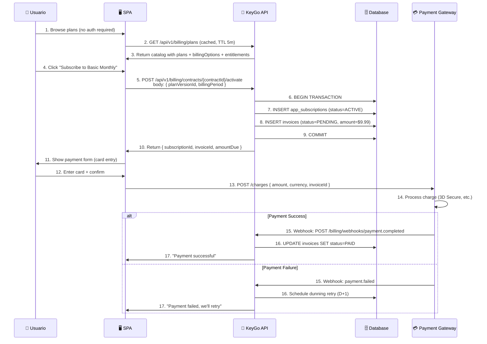
```mermaid
sequenceDiagram
    participant User as 👤 Usuario
    participant SPA as 🖥️ SPA
    participant KeyGo as 🔐 KeyGo API
    participant DB as 🗄️ Database
    participant Gateway as 💳 Payment Gateway

    User->>SPA: 1. Browse plans (no auth required)
    SPA->>KeyGo: 2. GET /api/v1/billing/plans (cached, TTL 5m)
    KeyGo->>SPA: 3. Return catalog with plans + billingOptions + entitlements
    
    User->>SPA: 4. Click "Subscribe to Basic Monthly"
    SPA->>KeyGo: 5. POST /api/v1/billing/contracts/{contractId}/activate<br/>body: { planVersionId, billingPeriod }
    
    KeyGo->>DB: 6. BEGIN TRANSACTION
    KeyGo->>DB: 7. INSERT app_subscriptions (status=ACTIVE)
    KeyGo->>DB: 8. INSERT invoices (status=PENDING, amount=$9.99)
    KeyGo->>DB: 9. COMMIT
    
    KeyGo->>SPA: 10. Return { subscriptionId, invoiceId, amountDue }
    SPA->>User: 11. Show payment form (card entry)
    
    User->>SPA: 12. Enter card + confirm
    SPA->>Gateway: 13. POST /charges { amount, currency, invoiceId }
    Gateway->>Gateway: 14. Process charge (3D Secure, etc.)
    
    alt Payment Success
        Gateway->>KeyGo: 15. Webhook: POST /billing/webhooks/payment.completed
        KeyGo->>DB: 16. UPDATE invoices SET status=PAID
        KeyGo->>SPA: 17. "Payment successful"
    else Payment Failure
        Gateway->>KeyGo: 15. Webhook: payment.failed
        KeyGo->>DB: 16. Schedule dunning retry (D+1)
        KeyGo->>SPA: 17. "Payment failed, we'll retry"
    end
```

**Key Points:**
- Catalog cached at T-099 (TTL 5m)
- Webhook-driven payment processing
- Dunning engine handles retries (T-090)
- Auto-renewal every 30 days (T-085)

---

### D. Flujo de Gestión de Tenants (Multi-Tenant Isolation)

Detalle de creación de tenant, usuario, app con aislamiento completo.

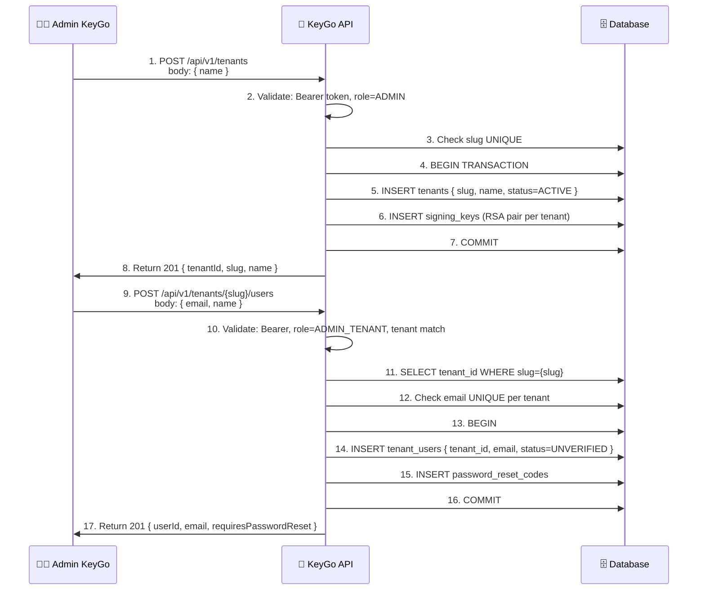
```mermaid
sequenceDiagram
    participant Admin as 👨‍💼 Admin KeyGo
    participant API as 🔐 KeyGo API
    participant DB as 🗄️ Database

    Admin->>API: 1. POST /api/v1/tenants<br/>body: { name }
    API->>API: 2. Validate: Bearer token, role=ADMIN
    API->>DB: 3. Check slug UNIQUE
    
    API->>DB: 4. BEGIN TRANSACTION
    API->>DB: 5. INSERT tenants { slug, name, status=ACTIVE }
    API->>DB: 6. INSERT signing_keys (RSA pair per tenant)
    API->>DB: 7. COMMIT
    
    API->>Admin: 8. Return 201 { tenantId, slug, name }
    
    Admin->>API: 9. POST /api/v1/tenants/{slug}/users<br/>body: { email, name }
    API->>API: 10. Validate: Bearer, role=ADMIN_TENANT, tenant match
    
    API->>DB: 11. SELECT tenant_id WHERE slug={slug}
    API->>DB: 12. Check email UNIQUE per tenant
    
    API->>DB: 13. BEGIN
    API->>DB: 14. INSERT tenant_users { tenant_id, email, status=UNVERIFIED }
    API->>DB: 15. INSERT password_reset_codes
    API->>DB: 16. COMMIT
    
    API->>Admin: 17. Return 201 { userId, email, requiresPasswordReset }
```

**Key Points:**
- Tenant isolation enforced via tenant_id in all queries
- JWT claims include tenant slug (iss=https://keygo/.../tenants/{slug})
- Admin operations scoped to single tenant
- Signing keys rotated per tenant (not global)

---

### E. Flujo de Self-Service Usuario (Profile + Sessions)

Detalle de GET/PATCH profile, lista de sesiones ativas, revocación de device.

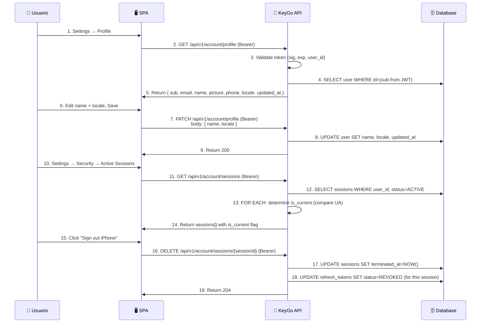
```mermaid
sequenceDiagram
    participant User as 👤 Usuario
    participant SPA as 🖥️ SPA
    participant API as 🔐 KeyGo API
    participant DB as 🗄️ Database

    User->>SPA: 1. Settings → Profile
    SPA->>API: 2. GET /api/v1/account/profile (Bearer)
    API->>API: 3. Validate token (sig, exp, user_id)
    API->>DB: 4. SELECT user WHERE id=(sub from JWT)
    API->>SPA: 5. Return { sub, email, name, picture, phone, locale, updated_at }
    
    User->>SPA: 6. Edit name + locale, Save
    SPA->>API: 7. PATCH /api/v1/account/profile (Bearer)<br/>body: { name, locale }
    API->>DB: 8. UPDATE user SET name, locale, updated_at
    API->>SPA: 9. Return 200
    
    User->>SPA: 10. Settings → Security → Active Sessions
    SPA->>API: 11. GET /api/v1/account/sessions (Bearer)
    API->>DB: 12. SELECT sessions WHERE user_id, status=ACTIVE
    API->>API: 13. FOR EACH: determine is_current (compare UA)
    API->>SPA: 14. Return sessions[] with is_current flag
    
    User->>SPA: 15. Click "Sign out iPhone"
    SPA->>API: 16. DELETE /api/v1/account/sessions/{sessionId} (Bearer)
    API->>DB: 17. UPDATE sessions SET terminated_at=NOW()
    API->>DB: 18. UPDATE refresh_tokens SET status=REVOKED (for this session)
    API->>SPA: 19. Return 204
```

**Key Points:**
- Profile updates reflected in next token issuance
- Sessions tracked with UA/IP for device identification
- Session termination revokes all tokens from that device
- Self-service, no admin approval needed

---

[← Índice](./README.md) | [< Anterior](./domain-events.md) | [Siguiente >](./process-decisions.md)
