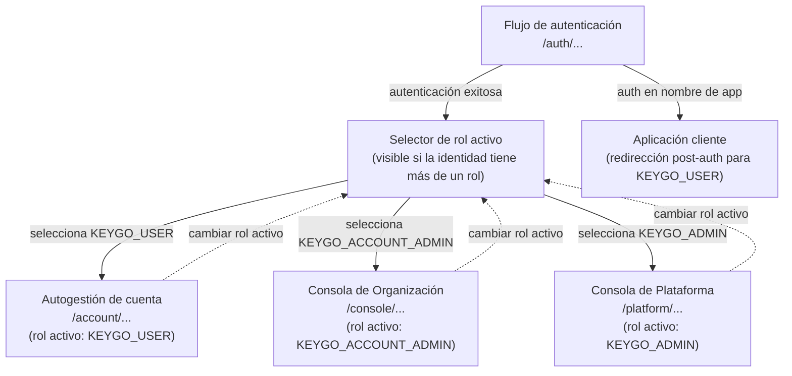
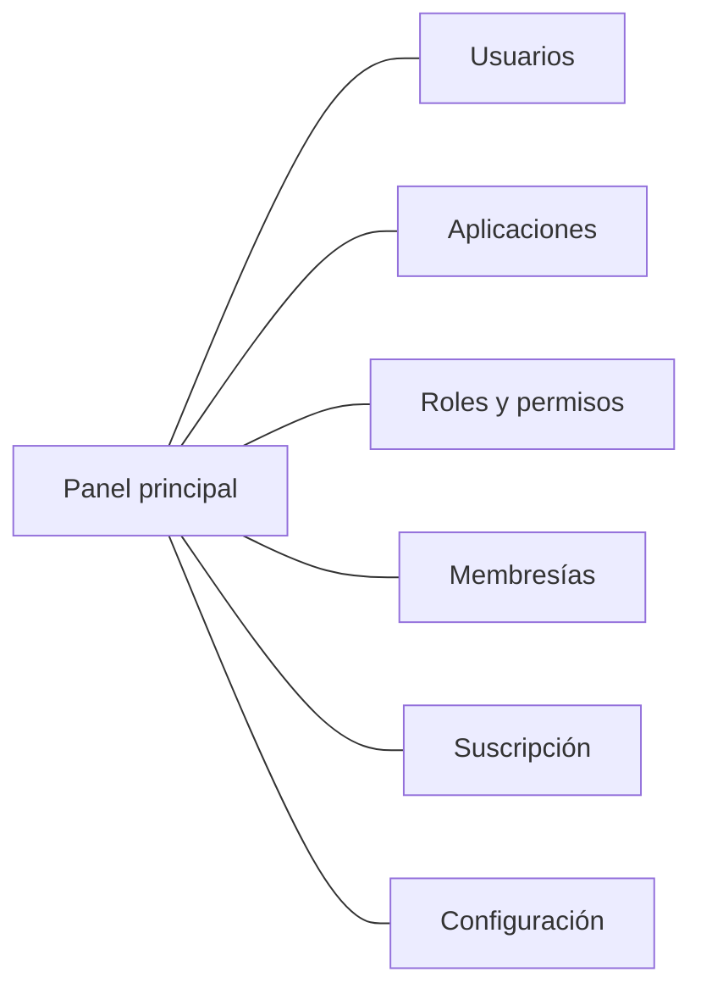
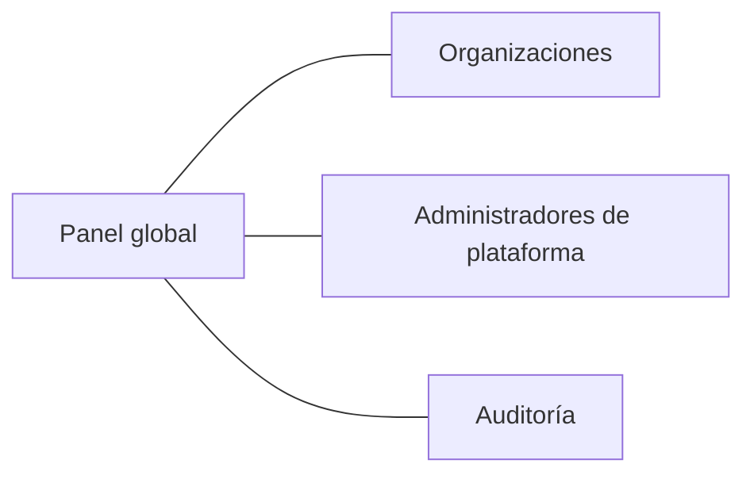

[← Índice](./README.md) | [< Anterior](./design-system.md) | [Siguiente >](./ux-decisions.md)

---

# Inventario de Pantallas

Este documento describe las pantallas que componen cada portal de Keygo, los flujos de navegación entre ellas y el propósito de cada sección. No prescribe implementación visual — ese nivel de detalle vive en los mockups y el sistema de diseño.

## Contenido

- [Mapa general de navegación](#mapa-general-de-navegación)
- [Flujo de autenticación](#flujo-de-autenticación)
- [Autogestión de cuenta](#autogestión-de-cuenta)
- [Consola de Organización](#consola-de-organización)
- [Consola de Plataforma](#consola-de-plataforma)
- [Pantallas de error y estado](#pantallas-de-error-y-estado)
- [Comentarios de los Revisores](#comentarios-de-los-revisores)

---

## Mapa general de navegación

Tras la autenticación, la interfaz muestra el selector de rol si la identidad tiene más de un rol disponible. El rol activo puede cambiarse en cualquier momento sin cerrar sesión — la interfaz carga el contexto correspondiente al nuevo rol seleccionado. Un `KEYGO_USER` puro no ve el selector.

[↑ Volver al inicio](#inventario-de-pantallas)

---

## Flujo de autenticación

Pantallas que intervienen en el proceso de verificación de identidad. Son las mismas para cualquier destino; la redirección post-autenticación varía.

| Pantalla | Propósito | Actores |
|----------|-----------|---------|
| **Inicio de sesión** | Ingreso de credenciales (email + contraseña). Punto de entrada para todos los flujos. | Cualquier identidad |
| **Verificación de segundo factor** | Presentada cuando la política de la organización requiere un segundo factor. | Cualquier identidad con 2FA activo |
| **Solicitud de recuperación de contraseña** | El usuario ingresa su email para recibir el enlace de recuperación. | Cualquier identidad |
| **Restablecimiento de contraseña** | Formulario para ingresar la nueva contraseña, accedido desde el enlace de recuperación. | Cualquier identidad con enlace válido |
| **Error de autenticación** | Comunica el motivo por el que no se pudo completar la autenticación (credenciales incorrectas, cuenta suspendida, aplicación inactiva). | Cualquier identidad |

[↑ Volver al inicio](#inventario-de-pantallas)

---

## Autogestión de cuenta

Superficie accesible para **toda identidad autenticada** independientemente de su rol de plataforma (`KEYGO_ADMIN`, `KEYGO_ACCOUNT_ADMIN` o `KEYGO_USER`). Es el único lugar donde un `KEYGO_USER` interactúa directamente con Keygo fuera del flujo de autenticación — no accede a la Consola de Organización ni a la Consola de Plataforma.

Las pantallas de esta sección son responsabilidad del contexto Identity: gestionan la cuenta de la propia identidad, no datos de la organización.

| Pantalla | Propósito | Actores |
|----------|-----------|---------|
| **Mi perfil** | Nombre, dirección de correo y datos personales de la identidad. | Todos |
| **Cambio de contraseña** | Formulario para establecer una nueva contraseña, previa verificación de la contraseña actual. | Todos |
| **Sesiones activas** | Lista de sesiones abiertas (dispositivo, fecha de inicio, última actividad). Permite cerrar cualquier sesión individual o todas las sesiones excepto la actual. | Todos |
| **Conexiones externas** | Proveedores de identidad externos vinculados a la cuenta. Permite añadir y desvincular conexiones. | Todos |
| **Preferencias de notificación** | Qué comunicaciones del sistema desea recibir y por qué canal. | Todos |

[↑ Volver al inicio](#inventario-de-pantallas)

---

## Consola de Organización

Portal para `KEYGO_ACCOUNT_ADMIN` y, en las secciones que correspondan según sus permisos, para `KEYGO_USER` con roles de administración delegada.

### Estructura de navegación

### Pantallas por sección

#### Panel principal

| Pantalla | Propósito |
|----------|-----------|
| **Resumen de organización** | Vista general: número de usuarios activos, aplicaciones registradas, estado de la suscripción y alertas activas (límites próximos, usuarios suspendidos). |

#### Usuarios

| Pantalla | Propósito |
|----------|-----------|
| **Lista de usuarios** | Todos los miembros de la organización con su estado (activo, suspendido). Acciones disponibles: dar de alta, filtrar, buscar. |
| **Detalle de usuario** | Atributos del miembro, sus membresías activas (qué aplicaciones usa), historial de estado. Acciones: suspender, reactivar, dar de baja, forzar restablecimiento de contraseña. |
| **Alta de usuario** | Formulario para incorporar una nueva identidad como miembro de la organización. |

#### Aplicaciones

| Pantalla | Propósito |
|----------|-----------|
| **Lista de aplicaciones** | Todas las aplicaciones cliente registradas en la organización con su estado. |
| **Detalle de aplicación** | Atributos de la aplicación, ámbitos autorizados, política de incorporación activa y credencial (solo el identificador; el secreto nunca se muestra después del registro). |
| **Registro de aplicación** | Formulario para dar de alta una nueva aplicación cliente. Al completarse, muestra la credencial de aplicación una única vez. |
| **Rotación de credencial** | Flujo de confirmación para rotar la credencial de una aplicación. Muestra el nuevo secreto una única vez. |

#### Roles y permisos

| Pantalla | Propósito |
|----------|-----------|
| **Lista de roles** | Roles definidos en cada aplicación de la organización. |
| **Detalle de rol** | Permisos asignados al rol y sujetos que lo tienen actualmente. |
| **Creación / edición de rol** | Formulario para definir un rol con nombre y permisos. |

#### Membresías

| Pantalla | Propósito |
|----------|-----------|
| **Lista de membresías** | Qué usuarios tienen acceso a qué aplicaciones, con su conjunto de roles activos. Filtrables por usuario o por aplicación. |
| **Detalle de membresía** | Roles activos de un sujeto en una aplicación. Acciones: asignar rol, revocar rol, suspender membresía, revocar membresía. |
| **Invitaciones pendientes** | Invitaciones enviadas que aún no han recibido respuesta, con la opción de revocarlas. |

#### Suscripción

| Pantalla | Propósito |
|----------|-----------|
| **Estado de suscripción** | Plan activo, fecha de renovación, uso actual contra límites (usuarios, aplicaciones), historial de facturas. |
| **Cambio de plan** | Flujo para seleccionar un plan distinto. Requiere confirmación con impacto de costos. |

#### Configuración de organización

| Pantalla | Propósito |
|----------|-----------|
| **Configuración general** | Nombre de la organización, dominio de correo permitido. |
| **Política de autenticación** | Requisitos de contraseña, duración de sesión, número máximo de sesiones simultáneas. |

[↑ Volver al inicio](#inventario-de-pantallas)

---

## Consola de Plataforma

Portal exclusivo para `KEYGO_ADMIN`. Proporciona visibilidad global y capacidad de operación de soporte. No es una interfaz de gestión de un tenant específico.

### Estructura de navegación

### Pantallas por sección

#### Panel global

| Pantalla | Propósito |
|----------|-----------|
| **Vista global** | Estado del sistema: total de organizaciones activas, alertas operativas (suscripciones en riesgo, organizaciones suspendidas, anomalías de uso). |

#### Organizaciones

| Pantalla | Propósito |
|----------|-----------|
| **Lista de organizaciones** | Todas las organizaciones del sistema con su estado (activa, suspendida) y datos de uso (plan, número de usuarios, suscripción). |
| **Detalle de organización** | Información operativa de la organización: administrador de contacto, estado de suscripción, resumen de uso. Acciones de soporte disponibles: suspender, reactivar. |
| **Confirmación de operación de soporte** | Diálogo previo a cualquier operación de soporte. Requiere motivo explícito. Informa que la acción quedará registrada. |

#### Administradores de plataforma

| Pantalla | Propósito |
|----------|-----------|
| **Lista de administradores** | Identidades con rol `KEYGO_ADMIN` activas en la plataforma. |
| **Alta de administrador** | Formulario para crear una nueva identidad `KEYGO_ADMIN`. |
| **Suspensión de administrador** | Flujo para inhabilitar a un `KEYGO_ADMIN`. Requiere confirmación. |

#### Auditoría

| Pantalla | Propósito |
|----------|-----------|
| **Consulta de auditoría** | Búsqueda y filtrado del registro de auditoría de cualquier organización. El acceso queda registrado automáticamente. |

[↑ Volver al inicio](#inventario-de-pantallas)

---

## Pantallas de error y estado

| Pantalla | Cuándo se muestra |
|----------|-------------------|
| **Sin acceso** | El usuario autenticado intenta acceder a una sección para la que no tiene permiso en este contexto. Explica el motivo y el rol necesario. |
| **Sesión expirada** | La sesión del usuario expiró o fue revocada. Lo redirige al flujo de autenticación. |
| **Organización suspendida** | La organización del usuario fue suspendida. No puede operar hasta que se resuelva. Muestra información de contacto de soporte. |
| **Límite alcanzado** | La organización alcanzó un límite de su plan. Bloquea la acción que lo requiere e informa cómo ampliar el plan. |
| **Error de sistema** | Error inesperado del sistema. No muestra detalles técnicos al usuario. Ofrece la opción de reintentar o de reportar el problema. |

[↑ Volver al inicio](#inventario-de-pantallas)

---

## Comentarios de los Revisores

| Revisor | Tipo | Contenido |
|---------|------|-----------|
| — | — | Pendiente de revisión |

[↑ Volver al inicio](#inventario-de-pantallas)

---

[← Índice](./README.md) | [< Anterior](./design-system.md) | [Siguiente >](./ux-decisions.md)
