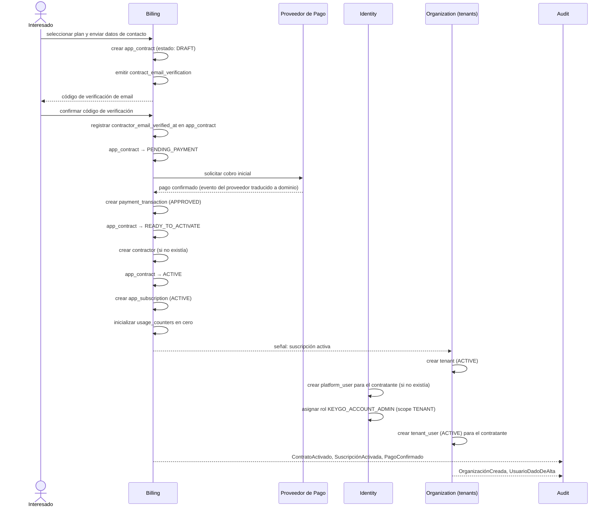
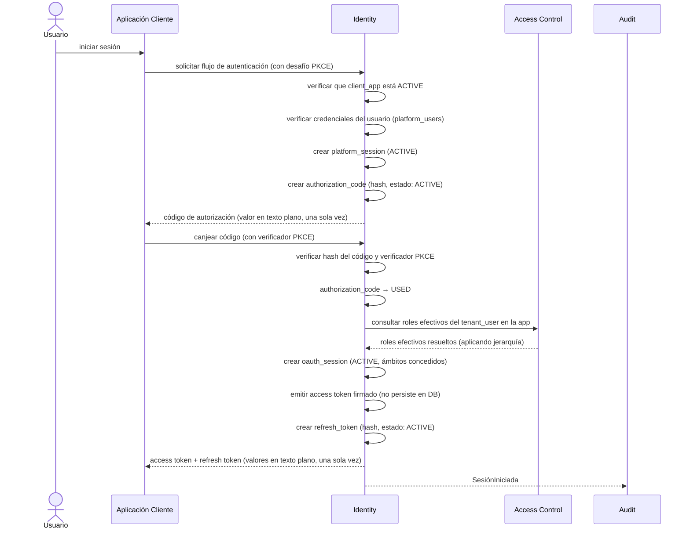
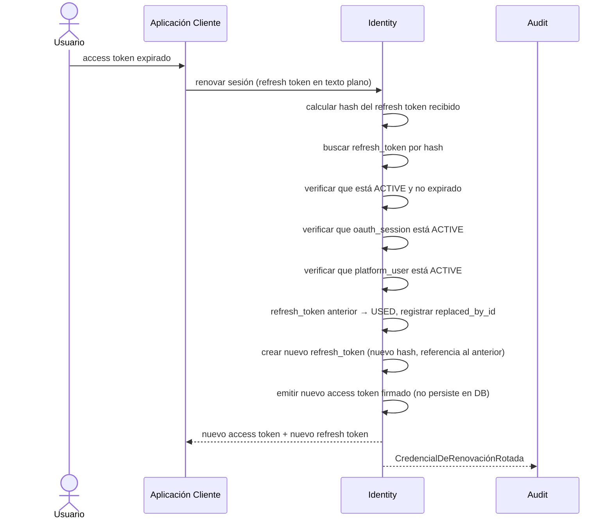
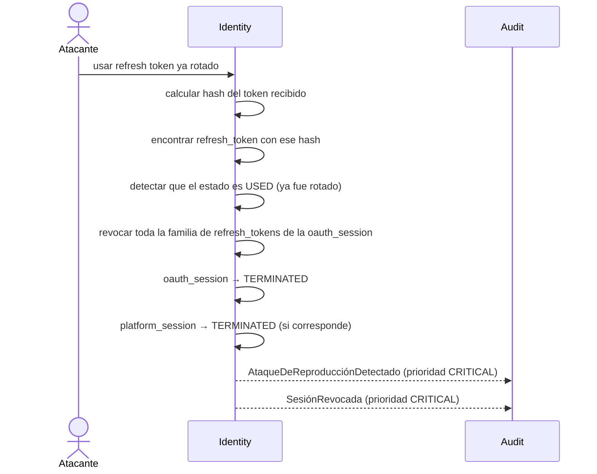
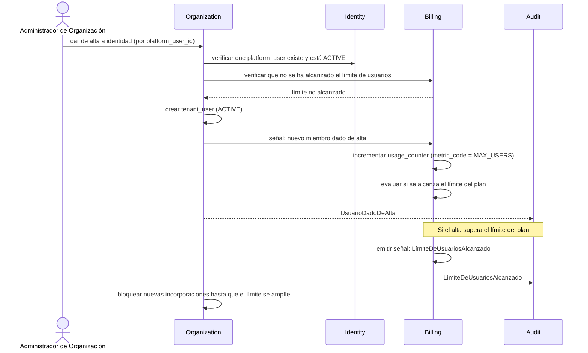
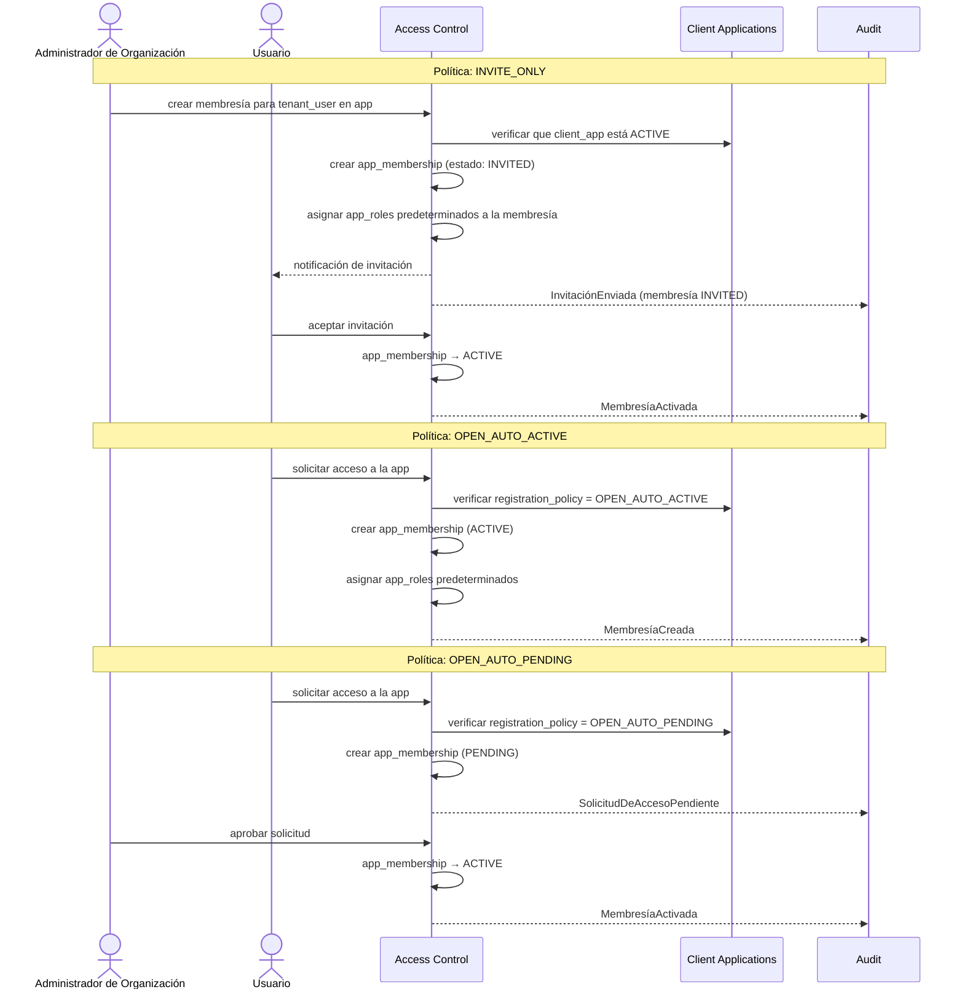
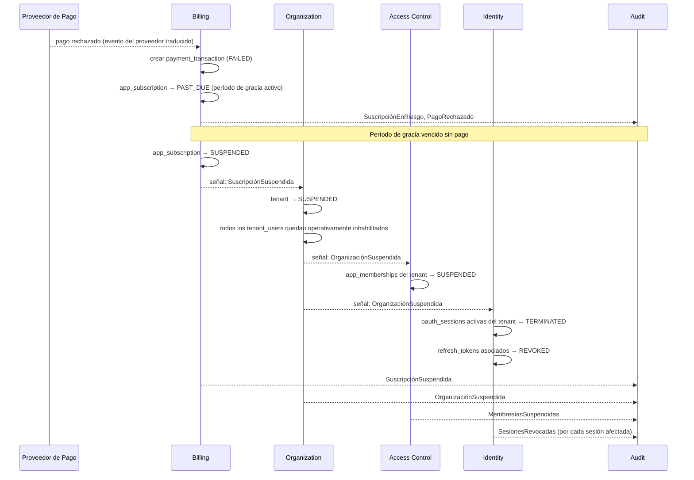
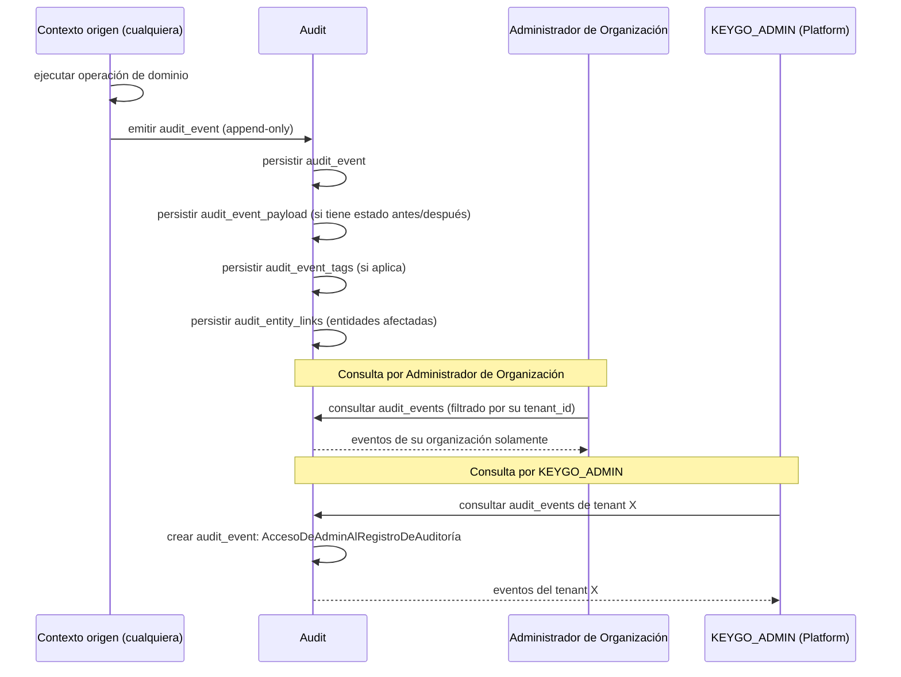

[← Índice](./README.md) | [< Anterior](./relationships.md)

---

# Flujos de Datos

Descripción de cómo la información se crea, transforma y mueve a través del sistema durante las operaciones principales. Cada flujo muestra qué entidades participan, en qué orden, y qué produce como resultado.

## Contenido

- [Flujo 1: Contratación y activación de organización](#flujo-1-contratación-y-activación-de-organización)
- [Flujo 2: Autenticación](#flujo-2-autenticación)
- [Flujo 3: Renovación de sesión](#flujo-3-renovación-de-sesión)
- [Flujo 4: Revocación por detección de replay attack](#flujo-4-revocación-por-detección-de-replay-attack)
- [Flujo 5: Incorporación de miembro al tenant](#flujo-5-incorporación-de-miembro-al-tenant)
- [Flujo 6: Incorporación de usuario a una aplicación](#flujo-6-incorporación-de-usuario-a-una-aplicación)
- [Flujo 7: Suspensión de organización por impago](#flujo-7-suspensión-de-organización-por-impago)
- [Flujo 8: Registro de auditoría](#flujo-8-registro-de-auditoría)
- [Flujo 9: Contratación de plan por usuario de una app](#flujo-9-contratación-de-plan-por-usuario-de-una-app)

---

## Flujo 1: Contratación y activación de organización

Describe cómo se crea un contratante, un tenant operativo y su suscripción activa a partir del proceso de contratación. El flujo se inicia antes de que exista una cuenta de plataforma.



**Entidades creadas:** `app_contract`, `contract_email_verification`, `contractor`, `payment_transaction`, `app_subscription`, `usage_counters`, `tenant`, `platform_user` (si nuevo), `platform_user_roles`, `tenant_user`.

**Estado final:** El tenant está operativo. El contratante tiene una suscripción activa y es el Administrador de Organización de ese tenant.

[↑ Volver al inicio](#flujos-de-datos)

---

## Flujo 2: Autenticación

Describe cómo una identidad obtiene sus credenciales de acceso a través de una aplicación cliente registrada. El flujo produce una `platform_session`, una `oauth_session` y un `refresh_token`. El acceso token (credencial de sesión) se emite firmado y no se persiste en la base de datos.



**Entidades creadas:** `platform_session`, `authorization_code`, `oauth_session`, `refresh_token`.

**Estado final:** El usuario tiene una sesión de plataforma y una sesión OAuth activas. El access token embebe los roles efectivos fijados en el momento de emisión. El refresh token se almacena como hash.

[↑ Volver al inicio](#flujos-de-datos)

---

## Flujo 3: Renovación de sesión

Describe cómo se obtiene un nuevo access token sin que el usuario deba autenticarse nuevamente. La Credencial de Renovación se rota en cada uso.



**Entidades afectadas:** `refresh_token` anterior (→ USED, `replaced_by_id` apunta al nuevo), nuevo `refresh_token` (ACTIVE).

**Estado final:** La sesión OAuth sigue activa con un nuevo par de tokens. El refresh token anterior queda invalidado y encadenado al nuevo mediante `replaced_by_id`.

[↑ Volver al inicio](#flujos-de-datos)

---

## Flujo 4: Revocación por detección de replay attack

Describe la respuesta del sistema cuando se detecta el uso de un refresh token que ya había sido rotado. La cadena `replaced_by_id` permite reconstruir la familia de tokens comprometida.



**Entidades afectadas:** Todos los `refresh_token` de la `oauth_session` afectada (→ REVOKED), `oauth_session` (→ TERMINATED).

**Estado final:** La identidad pierde la sesión afectada. Debe re-autenticarse. El evento queda registrado con severidad crítica. La cadena de `replaced_by_id` permite al equipo de seguridad reconstruir la secuencia del ataque.

[↑ Volver al inicio](#flujos-de-datos)

---

## Flujo 5: Incorporación de miembro al tenant

Describe cómo el Administrador de Organización da de alta a una identidad de plataforma existente como miembro del tenant.



**Entidades creadas:** `tenant_user`.
**Entidades afectadas:** `usage_counters` (incremento de `MAX_USERS`).

**Estado final:** La identidad es miembro activo del tenant. Si el alta supera el límite del plan, las nuevas incorporaciones quedan bloqueadas.

[↑ Volver al inicio](#flujos-de-datos)

---

## Flujo 6: Incorporación de usuario a una aplicación

Describe cómo un miembro del tenant obtiene acceso a una aplicación cliente. El camino depende de la `registration_policy` de la app.



**Entidades creadas:** `app_membership`, `app_membership_roles` (con roles predeterminados).

**Estado final:** El usuario tiene una membresía activa en la aplicación. En la próxima autenticación, sus roles efectivos incluirán los de esta membresía.

[↑ Volver al inicio](#flujos-de-datos)

---

## Flujo 7: Suspensión de organización por impago

Describe cómo se propaga la suspensión de una organización a través del sistema cuando la suscripción entra en impago definitivo.



**Entidades afectadas:** `app_subscription` (→ SUSPENDED), `tenant` (→ SUSPENDED), `app_memberships` del tenant (→ SUSPENDED), `oauth_sessions` activas (→ TERMINATED), `refresh_tokens` (→ REVOKED).

**Estado final:** El tenant está inhabilitado. Ningún miembro puede autenticarse ni usar las aplicaciones de ese tenant. Todos los eventos quedan registrados en Audit con severidad CRITICAL.

[↑ Volver al inicio](#flujos-de-datos)

---

## Flujo 8: Registro de auditoría

Describe cómo cada operación del sistema produce un evento inmutable en el registro de auditoría.



**Entidades creadas por cada operación:** `audit_event`, opcionalmente `audit_event_payload`, `audit_event_tags`, `audit_entity_links`.

**Invariantes del flujo:**
- `audit_events`, `audit_event_payloads`, `audit_event_tags` y `audit_entity_links` son append-only: ninguna fila puede ser modificada o eliminada, por ningún actor, bajo ninguna circunstancia.
- El aislamiento es obligatorio: el Administrador de Organización solo accede a los eventos de su tenant.
- Todo acceso de un `KEYGO_ADMIN` al registro de un tenant genera automáticamente un nuevo `audit_event` dentro del registro de ese tenant.
- El orden cronológico se determina por `occurred_at` (cuándo ocurrió), no por `created_at` (cuándo se persistió).

[↑ Volver al inicio](#flujos-de-datos)

---

## Flujo 9: Contratación de plan por usuario de una app

Describe cómo un usuario final contrata un plan ofrecido por una aplicación cliente. El flujo produce una `app_billing_account` (si no existía), un `app_contract` y una `app_subscription` activa, y vincula la membresía existente del usuario con su cuenta de billing.

```mermaid
sequenceDiagram
    actor Usuario
    participant AccessControl as Access Control
    participant Billing
    participant Audit

    Usuario->>AccessControl: iniciar flujo de contratación de plan
    AccessControl->>AccessControl: verificar que app_membership del usuario está ACTIVE
    AccessControl->>Billing: consultar catálogo de planes activos de la app

    Billing-->>AccessControl: versiones de plan disponibles con opciones de facturación
    AccessControl-->>Usuario: presentar catálogo de planes

    Usuario->>Billing: seleccionar versión de plan y cadencia de facturación
    Billing->>Billing: crear app_billing_account (si no existe; máximo una por usuario+app)
    Billing->>Billing: crear app_contract (estado: DRAFT)
    Billing->>Billing: emitir contract_email_verification
    Billing-->>Usuario: código de verificación de email de contacto

    Usuario->>Billing: confirmar código de verificación
    Billing->>Billing: app_contract → PENDING_PAYMENT

    Note over Billing, Audit: La app cliente gestiona el cobro externamente y notifica al sistema

    Billing->>Billing: crear payment_transaction (APPROVED)
    Billing->>Billing: app_contract → ACTIVE
    Billing->>Billing: crear app_subscription (ACTIVE)

    Billing-->>AccessControl: señal: suscripción activada
    AccessControl->>AccessControl: app_membership.app_billing_account_id → id de la cuenta
    AccessControl-->>Audit: MembresíaVinculadaACuentaDeBilling

    Note over Billing, Audit: Derechos disponibles en la próxima emisión de sesión OAuth

    Billing-->>Audit: ContratoActivado, SuscripciónActivada
```

**Entidades creadas:** `app_billing_account` (si es primera contratación del usuario en esa app), `contract_email_verification`, `app_contract`, `payment_transaction`, `app_subscription`.

**Entidades afectadas:** `app_membership.app_billing_account_id` (vinculado al activarse la suscripción).

**Estado final:** El usuario tiene una suscripción activa al plan seleccionado. La membresía queda vinculada a su cuenta de billing de app. En la próxima autenticación (o renovación de sesión OAuth), los derechos del plan quedan embebidos en el contexto de sesión según RF24.

[↑ Volver al inicio](#flujos-de-datos)

---

[← Índice](./README.md) | [< Anterior](./relationships.md)
