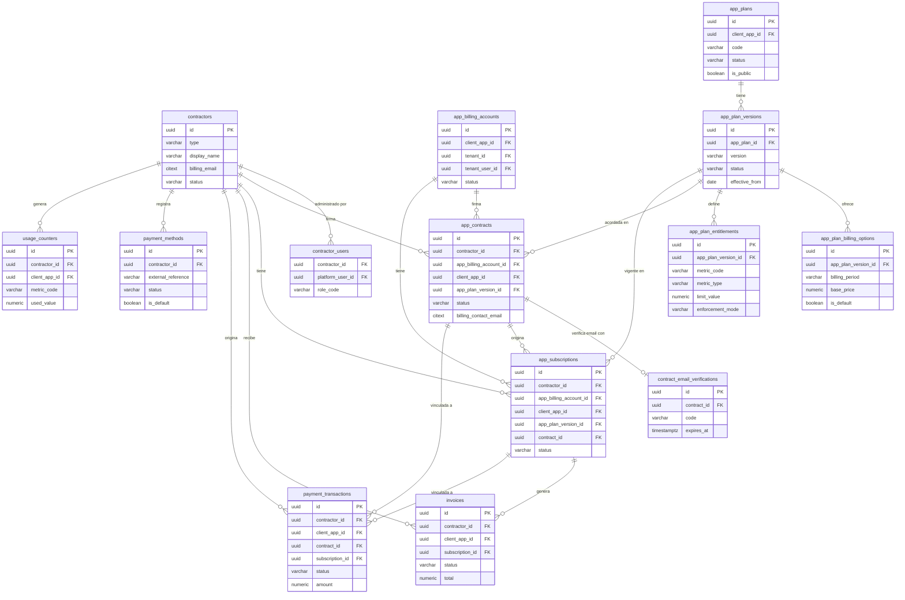

[← Índice](./README.md) | [< Anterior](./entities.md) | [Siguiente >](./data-flows.md)

---

# Relaciones (ERD)

Diagramas de entidades y relaciones del dominio de Keygo, organizados por contexto. Las referencias entre contextos son por identificador técnico — no existe acceso directo entre modelos de contextos distintos.

## Contenido

- [Identity y Platform RBAC](#identity-y-platform-rbac)
- [Organization](#organization)
- [Client Applications y Access Control](#client-applications-y-access-control)
- [Billing](#billing)
- [Audit](#audit)
- [Relaciones entre contextos](#relaciones-entre-contextos)

---

## Identity y Platform RBAC

```mermaid
erDiagram
    platform_users {
        uuid id PK
        citext email
        varchar password_hash
        varchar status
        timestamptz email_verified_at
    }
    email_verifications {
        uuid id PK
        uuid platform_user_id FK
        varchar code
        timestamptz expires_at
        timestamptz used_at
    }
    password_reset_tokens {
        uuid id PK
        uuid platform_user_id FK
        varchar token_hash
        timestamptz expires_at
        timestamptz used_at
    }
    platform_user_notification_preferences {
        uuid id PK
        uuid platform_user_id FK
        boolean security_alerts_email
        boolean billing_alerts_email
    }
    platform_activity_events {
        uuid id PK
        uuid platform_user_id FK
        uuid tenant_id FK
        varchar event_type
        timestamptz occurred_at
    }
    platform_sessions {
        uuid id PK
        uuid platform_user_id FK
        varchar status
        timestamptz expires_at
        varchar login_method
    }
    oauth_sessions {
        uuid id PK
        uuid platform_session_id FK
        uuid platform_user_id FK
        uuid tenant_id FK
        uuid tenant_user_id FK
        uuid client_app_id FK
        uuid signing_key_id FK
        varchar status
    }
    authorization_codes {
        uuid id PK
        varchar code_hash
        uuid platform_session_id FK
        uuid platform_user_id FK
        uuid tenant_id FK
        uuid client_app_id FK
        varchar status
    }
    refresh_tokens {
        uuid id PK
        varchar token_hash
        uuid oauth_session_id FK
        uuid platform_user_id FK
        uuid client_app_id FK
        uuid replaced_by_id FK
        varchar status
    }
    signing_keys {
        uuid id PK
        uuid tenant_id FK
        varchar kid
        varchar status
    }
    platform_roles {
        uuid id PK
        varchar code
        varchar display_name
    }
    platform_role_hierarchy {
        uuid child_role_id PK_FK
        uuid parent_role_id FK
    }
    platform_user_roles {
        uuid id PK
        uuid platform_user_id FK
        uuid role_id FK
        varchar scope_type
        uuid contractor_id FK
        uuid tenant_id FK
    }

    platform_users ||--o{ email_verifications : "solicita"
    platform_users ||--o{ password_reset_tokens : "solicita"
    platform_users ||--|| platform_user_notification_preferences : "configura"
    platform_users ||--o{ platform_activity_events : "genera"
    platform_users ||--o{ platform_sessions : "abre"
    platform_sessions ||--o{ oauth_sessions : "origina"
    platform_sessions ||--o{ authorization_codes : "contiene"
    oauth_sessions ||--o{ refresh_tokens : "emite"
    refresh_tokens ||--o| refresh_tokens : "reemplazado por"
    signing_keys ||--o{ oauth_sessions : "firma"
    signing_keys ||--o{ refresh_tokens : "referenciado en"
    platform_users ||--o{ platform_user_roles : "recibe"
    platform_roles ||--o{ platform_user_roles : "asignado en"
    platform_roles ||--o| platform_role_hierarchy : "es hijo en"
    platform_roles ||--o{ platform_role_hierarchy : "es padre en"
```

| Relación | Cardinalidad | Descripción |
|----------|-------------|-------------|
| Identidad → Sesión de Plataforma | 1 a muchos | Una identidad puede tener múltiples sesiones abiertas simultáneamente. |
| Sesión de Plataforma → Sesión OAuth | 1 a muchos | Una sesión de plataforma puede originar sesiones OAuth en distintas apps y tenants. |
| Sesión OAuth → Credencial de Renovación | 1 a muchos | Una sesión OAuth emite tokens de renovación a lo largo de su ciclo. |
| Credencial de Renovación → Credencial de Renovación | 1 a 0..1 | Referencia al token que la reemplazó en la rotación; nulo si no fue rotado. |
| Clave de Firma → Sesión OAuth | 1 a muchos | La clave usada para firmar tokens de esa sesión. |
| Identidad → Verificación de Email | 1 a 0..1 | Solo puede haber un código activo por identidad. |
| Identidad → Token de Recuperación | 1 a 0..1 | Solo puede haber un token activo por identidad. |
| Identidad → Preferencias de Notificación | 1 a 1 | Exactamente un registro por identidad. |
| Rol de Plataforma → Jerarquía | 1 a 0..1 | Un rol puede tener exactamente un rol padre. |

[↑ Volver al inicio](#relaciones-erd)

---

## Organization

```mermaid
erDiagram
    tenants {
        uuid id PK
        varchar slug
        varchar name
        varchar status
        uuid contractor_id FK
        boolean is_internal_reserved
    }
    tenant_users {
        uuid id PK
        uuid tenant_id FK
        uuid platform_user_id FK
        varchar local_username
        varchar status
    }
    tenant_roles {
        uuid id PK
        uuid tenant_id FK
        varchar code
        varchar display_name
    }
    tenant_role_hierarchy {
        uuid child_role_id PK_FK
        uuid parent_role_id FK
        uuid tenant_id FK
    }
    tenant_user_roles {
        uuid tenant_user_id FK
        uuid tenant_id FK
        uuid role_id FK
    }
    tenant_billing_profiles {
        uuid id PK
        uuid tenant_id FK
        varchar billing_type
        varchar billing_email
        boolean is_default
    }

    tenants ||--o{ tenant_users : "contiene"
    tenants ||--o{ tenant_roles : "define"
    tenants ||--o{ tenant_billing_profiles : "registra"
    tenant_roles ||--o| tenant_role_hierarchy : "es hijo en"
    tenant_roles ||--o{ tenant_role_hierarchy : "es padre en"
    tenant_users ||--o{ tenant_user_roles : "recibe"
    tenant_roles ||--o{ tenant_user_roles : "asignado en"
```

| Relación | Cardinalidad | Descripción |
|----------|-------------|-------------|
| Organización → Miembro | 1 a muchos | Un tenant contiene múltiples miembros. |
| Organización → Rol de Organización | 1 a muchos | Un tenant define su propio catálogo de roles. |
| Organización → Perfil de Facturación | 1 a muchos | Un tenant puede tener múltiples perfiles; uno predeterminado. |
| Rol de Organización → Jerarquía | 1 a 0..1 | Un rol puede tener exactamente un rol padre dentro del mismo tenant. |
| Miembro → Asignación de Rol | 1 a muchos | Un miembro puede tener múltiples roles en su tenant. |

[↑ Volver al inicio](#relaciones-erd)

---

## Client Applications y Access Control

```mermaid
erDiagram
    client_apps {
        uuid id PK
        uuid tenant_id FK
        varchar client_id
        varchar name
        varchar type
        varchar status
        varchar registration_policy
    }
    client_redirect_uris {
        uuid id PK
        uuid client_app_id FK
        varchar uri
    }
    client_allowed_grants {
        uuid id PK
        uuid client_app_id FK
        varchar grant_type
    }
    client_allowed_scopes {
        uuid id PK
        uuid client_app_id FK
        varchar scope
    }
    app_roles {
        uuid id PK
        uuid tenant_id FK
        uuid client_app_id FK
        varchar code
        boolean is_default
    }
    app_role_hierarchy {
        uuid child_role_id PK_FK
        uuid parent_role_id FK
        uuid client_app_id FK
    }
    app_memberships {
        uuid id PK
        uuid tenant_id FK
        uuid tenant_user_id FK
        uuid client_app_id FK
        uuid app_billing_account_id FK
        varchar status
    }
    app_membership_roles {
        uuid membership_id FK
        uuid client_app_id FK
        uuid role_id FK
    }

    client_apps ||--o{ client_redirect_uris : "registra"
    client_apps ||--o{ client_allowed_grants : "habilita"
    client_apps ||--o{ client_allowed_scopes : "autoriza"
    client_apps ||--o{ app_roles : "define"
    client_apps ||--o{ app_memberships : "tiene accesos en"
    app_roles ||--o| app_role_hierarchy : "es hijo en"
    app_roles ||--o{ app_role_hierarchy : "es padre en"
    app_memberships ||--o{ app_membership_roles : "tiene asignados"
    app_roles ||--o{ app_membership_roles : "asignado en"
```

| Relación | Cardinalidad | Descripción |
|----------|-------------|-------------|
| Aplicación Cliente → URI de Redirección | 1 a muchos | Una app puede registrar múltiples URIs exactas. |
| Aplicación Cliente → Tipo de Flujo | 1 a muchos | Una app puede tener habilitados múltiples tipos de flujo. |
| Aplicación Cliente → Ámbito Autorizado | 1 a muchos | Una app puede tener habilitados múltiples ámbitos. |
| Aplicación Cliente → Rol de Aplicación | 1 a muchos | Los roles existen siempre en el alcance de una app. |
| Aplicación Cliente → Membresía | 1 a muchos | Una app puede tener múltiples miembros con acceso. |
| Rol de Aplicación → Jerarquía | 1 a 0..1 | Un rol puede tener exactamente un rol padre dentro de la misma app. |
| Membresía → Asignación de Rol | 1 a muchos | Una membresía puede tener múltiples roles de esa app. |

[↑ Volver al inicio](#relaciones-erd)

---

## Billing



| Relación | Cardinalidad | Descripción |
|----------|-------------|-------------|
| Contratante → Contrato | 1 a muchos | Billing de plataforma (Keygo→tenant). Solo uno activo por contratante+app simultáneamente. |
| Contratante → Suscripción | 1 a muchos | Como máximo una suscripción activa por contratante+app. |
| Cuenta de Billing de App → Contrato | 1 a muchos | Billing de app (tenant's app→usuario final). Solo uno activo por cuenta+app simultáneamente. |
| Cuenta de Billing de App → Suscripción | 1 a muchos | Como máximo una suscripción activa por cuenta+app. |
| Versión de Plan → Opción de Facturación | 1 a muchos | Una versión puede ofrecer múltiples cadencias de cobro. |
| Versión de Plan → Derecho | 1 a muchos | Una versión define uno o más derechos/límites. |
| Contrato → Suscripción | 1 a muchos | Un contrato puede originar múltiples suscripciones a lo largo del tiempo (renovaciones). |
| Suscripción → Factura | 1 a muchos | Una factura por ciclo de facturación. |
| Plan → Versión | 1 a muchos | Un plan puede tener múltiples versiones históricas. |

[↑ Volver al inicio](#relaciones-erd)

---

## Audit

```mermaid
erDiagram
    audit_events {
        uuid id PK
        timestamptz occurred_at
        varchar actor_type
        uuid actor_platform_user_id FK
        uuid tenant_id FK
        varchar event_type
        varchar event_outcome
        varchar severity
    }
    audit_event_payloads {
        uuid audit_event_id PK_FK
        jsonb before_state
        jsonb after_state
        jsonb diff_payload
    }
    audit_event_tags {
        uuid audit_event_id FK
        varchar tag
    }
    audit_entity_links {
        uuid id PK
        uuid audit_event_id FK
        varchar linked_entity_type
        uuid linked_entity_id
        varchar relation_type
    }

    audit_events ||--o| audit_event_payloads : "tiene payload"
    audit_events ||--o{ audit_event_tags : "etiquetado con"
    audit_events ||--o{ audit_entity_links : "vincula entidades"
```

| Relación | Cardinalidad | Descripción |
|----------|-------------|-------------|
| Evento → Payload | 1 a 0..1 | Los payloads se almacenan separados para mantener consultas sobre eventos eficientes. |
| Evento → Etiqueta | 1 a muchos | Un evento puede tener múltiples etiquetas de búsqueda. |
| Evento → Enlace de Entidad | 1 a muchos | Un evento puede impactar múltiples entidades del sistema. |

[↑ Volver al inicio](#relaciones-erd)

---

## Relaciones entre contextos

Las entidades de distintos bounded contexts se referencian únicamente por identificador técnico. No existe acceso directo entre modelos de contextos distintos.

| Referencia (columna) | Contexto origen | Contexto destino | Descripción |
|----------------------|----------------|-----------------|-------------|
| `platform_sessions.platform_user_id` | Identity | Identity | La sesión de plataforma pertenece a una identidad. |
| `oauth_sessions.platform_session_id` | Identity | Identity | La sesión OAuth se deriva de una sesión de plataforma. |
| `oauth_sessions.tenant_id` | Identity | Organization | La sesión OAuth opera en el contexto de un tenant. |
| `oauth_sessions.tenant_user_id` | Identity | Organization | La sesión OAuth está vinculada al miembro del tenant. |
| `oauth_sessions.client_app_id` | Identity | Client Applications | La sesión OAuth opera para una app específica. |
| `oauth_sessions.signing_key_id` | Identity | Identity | La clave usada para firmar tokens de esta sesión. |
| `refresh_tokens.oauth_session_id` | Identity | Identity | El token de renovación pertenece a una sesión OAuth. |
| `signing_keys.tenant_id` | Identity | Organization | Una clave puede ser de un tenant específico; nulo = clave global. |
| `platform_user_roles.contractor_id` | Platform RBAC | Billing | El rol se asigna en el contexto de un contratante. |
| `platform_user_roles.tenant_id` | Platform RBAC | Organization | El rol se asigna en el contexto de un tenant. |
| `tenant_users.platform_user_id` | Organization | Identity | El miembro referencia la identidad de plataforma. |
| `tenant_users.tenant_id` | Organization | Organization | El miembro pertenece a un tenant. |
| `tenants.contractor_id` | Organization | Billing | El tenant pertenece a un contratante. |
| `client_apps.tenant_id` | Client Applications | Organization | La app pertenece a un tenant. |
| `app_roles.tenant_id` | Access Control | Organization | El rol existe en el contexto del tenant de la app. |
| `app_roles.client_app_id` | Access Control | Client Applications | El rol existe dentro de una app específica. |
| `app_memberships.tenant_id` | Access Control | Organization | La membresía está dentro de un tenant. |
| `app_memberships.tenant_user_id` | Access Control | Organization | La membresía pertenece a un miembro del tenant. |
| `app_memberships.client_app_id` | Access Control | Client Applications | La membresía da acceso a una app específica. |
| `app_memberships.app_billing_account_id` | Access Control | Billing | Cuenta de billing de app del usuario; nulo si la app no tiene planes. |
| `app_billing_accounts.client_app_id` | Billing | Client Applications | La cuenta de billing pertenece a una app específica. |
| `app_billing_accounts.tenant_id` | Billing | Organization | La cuenta de billing existe dentro de un tenant. |
| `app_billing_accounts.tenant_user_id` | Billing | Organization | La cuenta de billing pertenece a un miembro del tenant. |
| `app_plans.client_app_id` | Billing | Client Applications | El plan puede pertenecer a una app; nulo = plan de plataforma. |
| `app_contracts.contractor_id` | Billing | Billing | Ancla de billing de plataforma; mutuamente excluyente con `app_billing_account_id`. |
| `app_contracts.app_billing_account_id` | Billing | Billing | Ancla de billing de app; mutuamente excluyente con `contractor_id`. |
| `app_contracts.client_app_id` | Billing | Client Applications | El contrato es para una app específica. |
| `app_subscriptions.contractor_id` | Billing | Billing | Ancla de billing de plataforma; mutuamente excluyente con `app_billing_account_id`. |
| `app_subscriptions.app_billing_account_id` | Billing | Billing | Ancla de billing de app; mutuamente excluyente con `contractor_id`. |
| `app_subscriptions.client_app_id` | Billing | Client Applications | La suscripción está vinculada a una app. |
| `audit_events.actor_platform_user_id` | Audit | Identity | La identidad que originó el evento. |
| `audit_events.actor_tenant_user_id` | Audit | Organization | El miembro del tenant que actuó. |
| `audit_events.tenant_id` | Audit | Organization | El tenant del contexto del evento. |
| `audit_events.contractor_id` | Audit | Billing | El contratante del contexto del evento. |
| `audit_events.client_app_id` | Audit | Client Applications | La app del contexto del evento. |
| `audit_events.platform_session_id` | Audit | Identity | La sesión de plataforma activa al momento del evento. |
| `audit_events.oauth_session_id` | Audit | Identity | La sesión OAuth activa al momento del evento. |

[↑ Volver al inicio](#relaciones-erd)

---

[← Índice](./README.md) | [< Anterior](./entities.md) | [Siguiente >](./data-flows.md)
