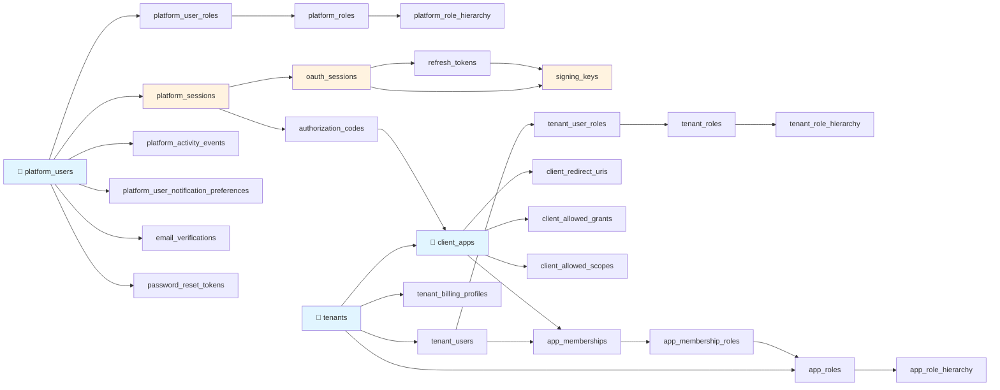
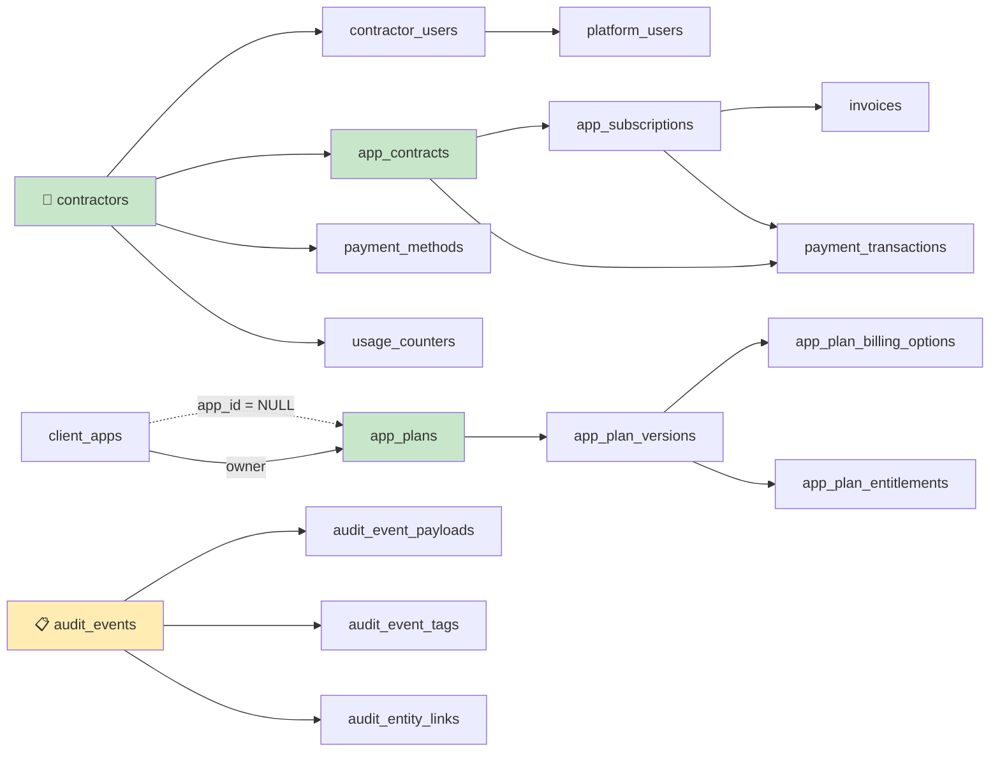

[← Índice](./README.md) | [< Anterior](./api-versioning-strategy.md)

---

# Database Schema

Modelo de datos de KeyGo Server, incluyendo Entity-Relationship Diagram (ERD), migraciones Flyway, convenciones de nombrado e invariantes críticas.

**Fuente de verdad física:** `keygo-supabase/src/main/resources/db/migration/`  
**Status:** `hibernate.ddl-auto=validate` (Flyway es autoridad)  
**Baseline activo:** V1 → V33+

## Contenido

- [Vista General](#vista-general)
- [Entity-Relationship Diagram (ERD)](#entity-relationship-diagram-erd)
- [Dominios Principales](#dominios-principales)
- [Invariantes Críticas](#invariantes-críticas)
- [Migraciones Flyway](#migraciones-flyway)
- [Índices y Performance](#índices-y-performance)

---

## Vista General

| Rango Migraciones | Dominio | Tablas Principales |
|---|---|---|
| **V1–V2** | Foundation | Bootstrap schema, extensiones (`pgcrypto`, `citext`), helpers |
| **V3–V10** | Identity / Access / OAuth | Usuarios, tenants, apps, sesiones, tokens, claves de firma |
| **V11** | Audit | Ledger append-only `audit_events` con payloads |
| **V12–V15** | Billing | Contractors, catálogo, contratos, suscripciones, facturas |
| **V16–V20+** | Seeds, evolutions | Datos de desarrollo, evolución de catálogo |

---

## Entity-Relationship Diagram (ERD)

### Dominio 1: Identity, Tenants, Apps, Auth



### Dominio 2: Billing & Audit



[↑ Volver al inicio](#database-schema)

---

## Dominios Principales

### 1. Foundation (V1–V2)

**Extensiones PostgreSQL:**
- `pgcrypto` — UUID generation, hashing utilities
- `citext` — Case-insensitive text comparisons

**Helper Functions:**
```sql
-- Auto-update updated_at on row modification
CREATE FUNCTION update_updated_at_column() RETURNS TRIGGER AS $$
BEGIN
  NEW.updated_at = NOW();
  RETURN NEW;
END;
$$ LANGUAGE plpgsql;

-- Prevent updates/deletes on append-only tables (audit trail)
CREATE FUNCTION prevent_append_only_mutation() RETURNS TRIGGER AS $$
BEGIN
  RAISE EXCEPTION 'Audit events are immutable';
END;
$$ LANGUAGE plpgsql;
```

---

### 2. Identity & Tenants (V3–V7)

#### platform_users (Global Identity Root)

```sql
CREATE TABLE platform_users (
  id UUID PRIMARY KEY DEFAULT gen_random_uuid(),
  email CITEXT UNIQUE NOT NULL,
  password_hash TEXT NOT NULL,
  full_name VARCHAR(255),
  status TEXT NOT NULL DEFAULT 'ACTIVE'  -- PENDING, ACTIVE, SUSPENDED, RESET_PASSWORD, DELETED
  CHECK (status IN ('PENDING', 'ACTIVE', 'SUSPENDED', 'RESET_PASSWORD', 'DELETED')),
  email_verified BOOLEAN DEFAULT FALSE,
  phone_number VARCHAR(20),
  created_at TIMESTAMP NOT NULL DEFAULT NOW(),
  updated_at TIMESTAMP NOT NULL DEFAULT NOW(),
  deleted_at TIMESTAMP
);

CREATE TRIGGER update_platform_users_updated_at
BEFORE UPDATE ON platform_users
FOR EACH ROW EXECUTE FUNCTION update_updated_at_column();

CREATE INDEX idx_platform_users_email ON platform_users(LOWER(email)) WHERE deleted_at IS NULL;
```

**Invariantes:**
- Email es **globally unique** (CITEXT = case-insensitive)
- Una persona = uno y solo un `platform_user`
- `status` con trigger de validación

#### tenants (Organization Boundary)

```sql
CREATE TABLE tenants (
  id UUID PRIMARY KEY DEFAULT gen_random_uuid(),
  slug TEXT UNIQUE NOT NULL,  -- my-company, acme-corp
  name VARCHAR(255) NOT NULL,
  status TEXT NOT NULL DEFAULT 'ACTIVE',
  contractor_id UUID REFERENCES contractors(id),  -- Optional: links to billing
  is_internal_reserved BOOLEAN DEFAULT FALSE,
  created_at TIMESTAMP NOT NULL DEFAULT NOW(),
  updated_at TIMESTAMP NOT NULL DEFAULT NOW(),
  deleted_at TIMESTAMP
);

CREATE INDEX idx_tenants_slug ON tenants(slug) WHERE deleted_at IS NULL;
```

**Invariantes:**
- `slug` es unique, immutable
- Soft-delete via `deleted_at`
- Multi-tenancy boundary: todos os queries filtran por tenant

#### tenant_users (Membership)

```sql
CREATE TABLE tenant_users (
  id UUID PRIMARY KEY DEFAULT gen_random_uuid(),
  tenant_id UUID NOT NULL REFERENCES tenants(id),
  platform_user_id UUID NOT NULL REFERENCES platform_users(id),
  local_username VARCHAR(255),  -- Optional: different username per tenant
  email_verified BOOLEAN DEFAULT FALSE,
  status TEXT NOT NULL DEFAULT 'ACTIVE',
  created_at TIMESTAMP NOT NULL DEFAULT NOW(),
  updated_at TIMESTAMP NOT NULL DEFAULT NOW(),
  deleted_at TIMESTAMP,
  UNIQUE (tenant_id, platform_user_id) WHERE deleted_at IS NULL
);

CREATE INDEX idx_tenant_users_tenant ON tenant_users(tenant_id) WHERE deleted_at IS NULL;
CREATE INDEX idx_tenant_users_platform_user ON tenant_users(platform_user_id) WHERE deleted_at IS NULL;
```

**Invariantes:**
- Compound unique key: `(tenant_id, platform_user_id)` per tenant
- Un usuario puede pertenecer a múltiples tenants

---

### 3. OAuth & Sessions (V3–V9)

#### client_apps (OAuth Applications)

```sql
CREATE TABLE client_apps (
  id UUID PRIMARY KEY DEFAULT gen_random_uuid(),  -- Internal PK
  client_id TEXT UNIQUE NOT NULL,  -- OAuth client_id (public)
  tenant_id UUID NOT NULL REFERENCES tenants(id),
  client_secret_hash TEXT NOT NULL,  -- Never store plaintext
  type TEXT NOT NULL DEFAULT 'CONFIDENTIAL',  -- PUBLIC or CONFIDENTIAL
  name VARCHAR(255) NOT NULL,
  redirect_uris TEXT[] NOT NULL,  -- Array of allowed redirect URIs
  status TEXT NOT NULL DEFAULT 'DRAFT',
  created_at TIMESTAMP NOT NULL DEFAULT NOW(),
  updated_at TIMESTAMP NOT NULL DEFAULT NOW()
);

CREATE UNIQUE INDEX idx_client_apps_client_id ON client_apps(client_id);
CREATE INDEX idx_client_apps_tenant ON client_apps(tenant_id);
```

#### refresh_tokens (Rotation with Replay Detection - T-035)

```sql
CREATE TABLE refresh_tokens (
  id UUID PRIMARY KEY DEFAULT gen_random_uuid(),
  session_id UUID NOT NULL REFERENCES oauth_sessions(id),
  token_hash TEXT NOT NULL UNIQUE,  -- SHA-256 of refresh_token value
  status TEXT NOT NULL DEFAULT 'ACTIVE',
  -- ACTIVE: usable
  -- USED: rotated to new token
  -- REVOKED: compromised/logged out
  CHECK (status IN ('ACTIVE', 'USED', 'REVOKED')),
  replaced_by_id UUID REFERENCES refresh_tokens(id),  -- Chain for rotation
  created_at TIMESTAMP NOT NULL DEFAULT NOW(),
  expires_at TIMESTAMP NOT NULL,  -- TTL: 30 days
  updated_at TIMESTAMP NOT NULL DEFAULT NOW(),
  revoked_reason TEXT  -- 'LOGOUT', 'REPLAY_DETECTED', 'COMPROMISE'
);

CREATE INDEX idx_refresh_tokens_session ON refresh_tokens(session_id);
CREATE INDEX idx_refresh_tokens_hash ON refresh_tokens(token_hash);
```

**Replay Attack Detection (T-035):**
```sql
-- Trigger: if status = USED and called again → revoke entire chain
CREATE TRIGGER prevent_refresh_token_replay
BEFORE UPDATE ON refresh_tokens
FOR EACH ROW
WHEN (OLD.status = 'USED' AND NEW.status = 'USED')
EXECUTE FUNCTION revoke_refresh_token_chain();
```

#### signing_keys (JWT Key Rotation)

```sql
CREATE TABLE signing_keys (
  id UUID PRIMARY KEY DEFAULT gen_random_uuid(),
  kid TEXT NOT NULL,  -- Key ID (public)
  tenant_id UUID REFERENCES tenants(id),  -- NULL = platform-level key
  algorithm TEXT NOT NULL DEFAULT 'RS256',
  public_key TEXT NOT NULL,
  private_key_encrypted TEXT NOT NULL,  -- Encrypted at rest
  status TEXT NOT NULL DEFAULT 'ACTIVE',
  rotated_at TIMESTAMP NOT NULL DEFAULT NOW(),
  expires_at TIMESTAMP NOT NULL,  -- Key validity period
  created_at TIMESTAMP NOT NULL DEFAULT NOW()
);

CREATE UNIQUE INDEX idx_signing_keys_kid ON signing_keys(kid);
CREATE INDEX idx_signing_keys_tenant ON signing_keys(tenant_id) WHERE status = 'ACTIVE';
```

---

### 4. Audit Ledger (V11)

#### audit_events (Append-Only)

```sql
CREATE TABLE audit_events (
  id UUID PRIMARY KEY DEFAULT gen_random_uuid(),
  actor_type TEXT NOT NULL,  -- 'PLATFORM_USER', 'TENANT_USER', 'SYSTEM'
  actor_id UUID NOT NULL,
  action TEXT NOT NULL,  -- 'USER_CREATED', 'CONTRACT_ACTIVATED', 'REPLAY_ATTACK_DETECTED'
  resource_type TEXT NOT NULL,  -- 'User', 'Tenant', 'RefreshToken'
  resource_id UUID,
  status TEXT NOT NULL DEFAULT 'SUCCESS',  -- SUCCESS, FAILURE
  error_message TEXT,
  created_at TIMESTAMP NOT NULL DEFAULT NOW()
);

CREATE TRIGGER prevent_audit_mutation
BEFORE UPDATE OR DELETE ON audit_events
FOR EACH ROW EXECUTE FUNCTION prevent_append_only_mutation();

CREATE INDEX idx_audit_events_created ON audit_events(created_at DESC);
CREATE INDEX idx_audit_events_actor ON audit_events(actor_id);
CREATE INDEX idx_audit_events_resource ON audit_events(resource_type, resource_id);
```

---

### 5. Billing (V12–V15)

#### contractors (Billing Root)

```sql
CREATE TABLE contractors (
  id UUID PRIMARY KEY DEFAULT gen_random_uuid(),
  name VARCHAR(255) NOT NULL,
  email CITEXT UNIQUE NOT NULL,
  status TEXT NOT NULL DEFAULT 'DRAFT',
  created_at TIMESTAMP NOT NULL DEFAULT NOW(),
  updated_at TIMESTAMP NOT NULL DEFAULT NOW()
);
```

#### app_plans (Catalog)

```sql
CREATE TABLE app_plans (
  id UUID PRIMARY KEY DEFAULT gen_random_uuid(),
  client_app_id UUID REFERENCES client_apps(id),  -- NULL = platform-level plan
  name VARCHAR(255) NOT NULL,
  created_at TIMESTAMP NOT NULL DEFAULT NOW(),
  updated_at TIMESTAMP NOT NULL DEFAULT NOW()
);
```

#### invoices (Billing Execution)

```sql
CREATE TABLE invoices (
  id UUID PRIMARY KEY DEFAULT gen_random_uuid(),
  app_subscription_id UUID NOT NULL REFERENCES app_subscriptions(id),
  amount_cents BIGINT NOT NULL,  -- Store as cents to avoid float precision issues
  currency VARCHAR(3) NOT NULL DEFAULT 'USD',
  status TEXT NOT NULL DEFAULT 'PENDING',  -- PENDING, PAID, FAILED, CANCELLED
  due_date DATE NOT NULL,
  paid_at TIMESTAMP,
  created_at TIMESTAMP NOT NULL DEFAULT NOW(),
  updated_at TIMESTAMP NOT NULL DEFAULT NOW()
);

CREATE INDEX idx_invoices_subscription ON invoices(app_subscription_id);
CREATE INDEX idx_invoices_status ON invoices(status) WHERE status IN ('PENDING', 'FAILED');
```

---

## Invariantes Críticas

### Multi-Tenancy Isolation

**Regla 1:** Todos los queries filtran explícitamente por `tenant_id`

```sql
-- ✅ BIEN: Explicit tenant filter
SELECT * FROM tenant_users 
WHERE tenant_id = $1 AND status = 'ACTIVE';

-- ❌ MAL: Sin filter de tenant (breach!)
SELECT * FROM tenant_users WHERE email = $1;
```

**Regla 2:** Foreign keys compuestos previenen cross-tenant access

```sql
-- ❌ NO PERMITIDO: tenant_user_id de otro tenant
INSERT INTO app_memberships (tenant_user_id, client_app_id)
VALUES (user_from_tenant_A, app_from_tenant_B);  -- Trigger invalida
```

### Soft Deletes

Todas las tablas con datos de usuario tienen `deleted_at`:

```sql
CREATE INDEX idx_tenants_deleted ON tenants(deleted_at);
-- Query siempre: WHERE deleted_at IS NULL
```

### Hashing Secrets

**Nunca** persisten en plaintext:

```sql
-- ❌ NUNCA:
INSERT INTO refresh_tokens (token_value) VALUES ('refresh-token-secret');

-- ✅ SIEMPRE:
INSERT INTO refresh_tokens (token_hash) VALUES (SHA256('refresh-token-secret'));
```

---

## Migraciones Flyway

### Convención de Nomenclatura

```
V{VERSION}__{DESCRIPTION}.sql

Ejemplos:
- V1__foundation.sql
- V3__identity_bootstrap.sql
- V34__add_geolocation_to_sessions.sql
```

### Próxima Migración: V34

**Convención:**
```sql
-- V34__{your-change-description}.sql
BEGIN TRANSACTION;

-- Paso 1: ALTER o CREATE
ALTER TABLE sessions ADD COLUMN geolocation_country VARCHAR(2);

-- Paso 2: Crear índice si es necesario
CREATE INDEX idx_sessions_geolocation ON sessions(geolocation_country);

-- Paso 3: Actualizar aplicación antes de deploying cambios de código
UPDATE sessions SET geolocation_country = 'US' WHERE ip LIKE '1.%.%';

COMMIT;
```

**Regla de Immutability:** Una migración nunca se cambia después de que se ejecutó en producción.

---

## Índices y Performance

### Critical Indexes

| Tabla | Columna(s) | Razón |
|-------|-----------|-------|
| `platform_users` | `email` | Login, unique constraint |
| `tenants` | `slug` | URL path resolution |
| `tenant_users` | `(tenant_id, platform_user_id)` | Membership lookup |
| `client_apps` | `tenant_id` | App discovery |
| `refresh_tokens` | `token_hash` | Rotation lookup |
| `audit_events` | `created_at DESC` | Log queries |
| `invoices` | `(status, due_date)` | Dunning retry queries |

### Soft-Delete Indexes

```sql
-- Solo índex sobre registros activos (no deleted)
CREATE INDEX idx_tenants_active ON tenants(slug) WHERE deleted_at IS NULL;
```

---

## References

- **PostgreSQL Docs:** https://www.postgresql.org/docs/
- **Flyway Migration:** https://flywaydb.org/
- **Multi-Tenancy Patterns:** See `architecture.md` § Multi-Tenancy
- **Audit Trail:** See `03-design/domain-events.md`

---

[← Índice](./README.md) | [< Anterior](./api-versioning-strategy.md)
