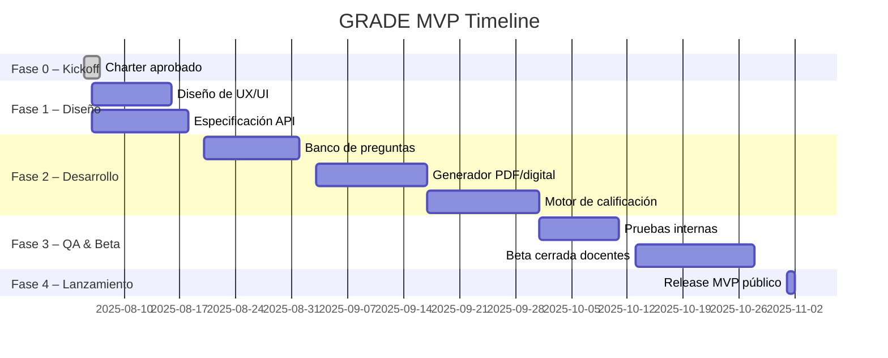

# Product Charter — GRADE MVP

> :warning: **Advertencia**
> 
> Este documento es un _draft_ y está sujeto a cambios. Por lo tanto, no debe ser compartido fuera del equipo de desarrollo hasta que se considere finalizado.
> Favor, considere apoyar en la revisión y actualización de este documento para reflejar los avances y cambios en el proyecto.

> **Versión:** 0.1 • _Última actualización: 2025-08-02_

---

## 1. Resumen Ejecutivo
GRADE permitirá a cualquier docente independiente **generar, aplicar y calificar** evaluaciones de forma automática, sin depender de licencias institucionales costosas.  
El MVP se centra en cubrir el flujo básico de una prueba (banco de preguntas → evaluación PDF/digital → calificación automática → reporte) para validar la propuesta de valor y sentar las bases técnicas.

---

## 2. Alcance Funcional (MVP)

| # | Capability | Descripción de la funcionalidad |
|---|------------|---------------------------------|
| 1 | **Bancos de preguntas** | Crear, editar y versionar preguntas con calificación automática (VF, selección múltiple). Metadatos pedagógicos obligatorios. |
| 2 | **Generación de evaluaciones** | Seleccionar preguntas, parametrizar puntaje y exportar a PDF o formato digital web-safe. |
| 3 | **Calificación automática** | Ingesta de respuestas (archivo CSV, formulario web o escaneo OCR) y cálculo de nota (1-7 o rango configurable). |
| 4 | **Reportes básicos** | • Promedio por evaluación y tasa de aprobación • Distribución de notas (histograma) • Índice de dificultad por pregunta • Cobertura de resultados de aprendizaje |
| 5 | **Gestión de cuentas** | Registro, login y plan de suscripción (Free tier / Plan básico). |
| 6 | **Seguridad de datos** | Cifrado en tránsito y reposo; roles Docente / Guest; bitácora de acciones críticas. |

### Fuera de Alcance en MVP
- Integraciones SIS, pagos masivos, Single-Sign-On institucional.
- Analítica avanzada (dashboards comparativos, IA generativa de ítems).
- Interfaces específicas para estudiantes o apoderados.

---

## 3. Público Objetivo

| Persona | Pain point actual | Cómo lo resuelve GRADE |
|---------|-------------------|------------------------|
| **Docente independiente** | Corrección manual consume mucho tiempo y requiere software caro. | Calificación automática + reportes básicos gratuitos. |
| **Profesor adjunto** | No tiene acceso al sistema institucional fuera del campus. | Genera evaluaciones en PDF y corrige desde cualquier lugar. |

---

## 4. Métricas Clave

| Métrica | Meta 6 m | Meta 12 m |
|---------|----------|-----------|
| Docentes activos mensuales (MAU) | 200 | 500 |
| % de pruebas calificadas en < 24 h | 50 % | 80 % |
| NPS docente | +30 | +40 |

*Estas metas están alineadas con los Objetivos Estratégicos definidos en la Visión.*

---

## 5. Supuestos y Dependencias

1. El motor OCR alcanzará ≥ 95 % de precisión en el formato de plantilla PDF definido.
2. El canal de pago seleccionado (Stripe) soporta suscripciones de bajo monto en los países objetivo.
3. Los usuarios iniciales disponen de conexión a internet para subir sus evaluaciones digitalizadas.

---

## 6. Riesgos y Mitigaciones

| Riesgo | Impacto | Prob. | Mitigación |
|--------|---------|-------|------------|
| Baja adopción del OCR | Alto | Media | Ofrecer formulario web para cargar respuestas mientras se mejora OCR. |
| Costos de infraestructura en picos de uso | Medio | Media | Limitar tamaño de archivos en Free tier; usar auto-scaling con alertas. |
| Fugas de datos sensibles | Alto | Baja | Cifrado AES-256, escaneos de vulnerabilidades mensuales, bitácora inmutable. |

---

## 7. Roadmap Tentativo (Timeline MVP)
> **Nota:** Las fechas son estimadas y están sujetas a cambios según el progreso del proyecto.

## 8. Equipo y Responsables
| Rol           | Responsable | FTE | Notas                                |
| ------------- | ----------- | --- | ------------------------------------ |
| Product Owner | *TBD*       | 0.5 | Define backlog y priorización.       |
| Tech Lead     | *TBD*       | 1.0 | Arquitectura y revisiones de código. |
| Dev Backend   | *TBD*       | 2.0 | API, base de datos, OCR integración. |
| Dev Frontend  | *TBD*       | 1.0 | Vue/React; PDF export.               |
| UX/UI         | *TBD*       | 0.5 | Prototipos y pruebas con usuarios.   |
| QA            | *TBD*       | 0.5 | Casos de prueba, automatización.     |

## 9. Aprobación
| Nombre                         | Rol                 | Estado | Fecha      |
| ------------------------------ | ------------------- | ------ | ---------- |
| \_\_\_\_\_\_\_\_\_\_\_\_\_\_\_ | Sponsor             | ☐      | **/**/2025 |
| \_\_\_\_\_\_\_\_\_\_\_\_\_\_\_ | Engineering Manager | ☐      | **/**/2025 |
| \_\_\_\_\_\_\_\_\_\_\_\_\_\_\_ | Product Owner       | ☐      | **/**/2025 |
