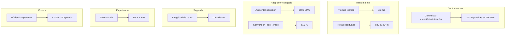

# Visión y propósito del Sistema
## Contenido
A continuación se detalla el contenido del documento "Visión y Propósito del Sistema"

- [Contexto](#contexto)
- [Visión](#visión)
- [Propósito](#propósito)
- [Objetivos Estratégicos](#objetivos-estratégicos)
  - [1. Centralizar el ciclo de evaluaciones](#1-centralizar-el-ciclo-de-evaluaciones)
  - [2. Potenciar un banco de preguntas estandarizado y reutilizable](#2-potenciar-un-banco-de-preguntas-estandarizado-y-reutilizable)
  - [3. Acelerar la calificación automática](#3-acelerar-la-calificación-automática)
  - [4. Salvaguardar la integridad y la seguridad académica](#4-salvaguardar-la-integridad-y-la-seguridad-académica)
  - [5. Facilitar integración fluida y escalabilidad](#5-facilitar-integración-fluida-y-escalabilidad)
  - [6. Optimizar la eficiencia operativa](#6-optimizar-la-eficiencia-operativa)
  - [7. Escalar la adopción y la sostenibilidad económica](#7-escalar-la-adopción-y-la-sostenibilidad-económica)
  - [8. Garantizar una experiencia de usuario sobresaliente](#8-garantizar-una-experiencia-de-usuario-sobresaliente)
- [Capacidades Claves](#capacidades-claves)
- [Comentarios de los Revisores](#comentarios-de-los-revisores)
  - [Maximiliano Toledo](#maximiliano-toledo)
  - [Rodrigo Ulloa](#rodrigo-ulloa)
  - [Paolo Vilches](#paolo-vilches)
## Contexto

La plataforma propuesta es un servicio centralizado para la generación, distribución y **calificación automática** de evaluaciones, concebido para unificar el ciclo completo de pruebas dentro del ecosistema educativo de Wanku. Al consolidar en un único punto el banco de preguntas, la creación de exámenes, la emisión de PDFs y la calificación, cada aplicación académica se apoya en un flujo homogéneo, seguro y eficiente. Esta centralización simplifica la administración, el monitoreo y la escalabilidad de la suite, habilitando los objetivos estratégicos descritos en la sección siguiente.

## Visión
> _“Ser la plataforma que dispone de evaluaciones de alta calidad al alcance de cada docente, sin barreras económicas ni técnicas.”_

## Propósito
> GRADE nace para **democratizar** la creación, distribución y **calificación automática** de evaluaciones, ofreciendo a docentes individuales un flujo completo y homogéneo que hoy solo está disponible mediante costosos acuerdos institucionales. Al centralizar el proceso, reducimos la carga administrativa del profesorado y garantizamos estándares de calidad y seguridad en la medición del aprendizaje.

---

## Objetivos Estratégicos

Los **objetivos estratégicos** convierten la visión de GRADE en resultados concretos y medibles. Funcionan como una brújula: señalan dónde debemos estar dentro de un periodo definido (en nuestro caso, los primeros 12 meses de operación) y permiten evaluar si las decisiones diarias del equipo nos acercan o alejan de ese destino.  
Cada objetivo se acompaña de uno o más **KPI** (Key Performance Indicators) que cuantifican el progreso y facilitan discusiones basadas en datos, no en percepciones. Alcanzar estas metas confirmará que el producto entrega valor real a los docentes, opera de forma segura y sostenible, y genera la tracción necesaria para futuras etapas.

### 1. Centralizar el ciclo de evaluaciones
> **Qué buscamos:** que GRADE sea la fuente única de verdad para la creación y calificación de pruebas.  
**Por qué es estratégico:** sin masa crítica la plataforma no genera consistencia ni datos valiosos para analítica.  
**KPI:** ≥ 80 % de las evaluaciones creadas y calificadas dentro de GRADE al cabo de 12 meses.

### 2. Potenciar un banco de preguntas estandarizado y reutilizable
> **Qué buscamos:** que los docentes reutilicen ítems versionados en vez de crear preguntas aisladas.  
**Por qué es estratégico:** acelera el diseño de pruebas y mantiene coherencia curricular.  
**KPI:** ≥ 70 % de las preguntas usadas en nuevas evaluaciones provienen del banco existente, reduciendo en ≥ 30 % el tiempo medio de diseño durante el primer año.

### 3. Acelerar la calificación automática
> **Qué buscamos:** procesamiento ágil y feedback casi inmediato.  
**Por qué es estratégico:** la rapidez percibida es clave para la adopción y la satisfacción.  
> **KPIs:**
> - ≤ 5 min de tiempo técnico medio de procesamiento por prueba.
> - ≥ 80 % de las notas publicadas en ≤ 24 h desde la entrega.

### 4. Salvaguardar la integridad y la seguridad académica
> **Qué buscamos:** cero incidentes graves y disciplina operativa continua.  
**Por qué es estratégico:** la confianza institucional es frágil; un fallo de seguridad pone en riesgo todo el proyecto.  
**KPIs:**
> - 0 incidentes de seguridad clasificados como graves.
> - 100 % de auditorías de seguridad trimestrales completadas y sin hallazgos críticos.

### 5. Facilitar integración fluida y escalabilidad
> **Qué buscamos:** que GRADE se conecte sin fricciones con otros sistemas y resista picos de uso.  
**Por qué es estratégico:** multiplica el valor de la plataforma y evita cuellos de botella en épocas de exámenes.  
> **KPIs:**
> - Al menos 3 integraciones externas certificadas (LMS, portal del estudiante, analytics) durante el primer año.
> - SLA de disponibilidad API ≥ 99,9 % en periodos pico.

### 6. Optimizar la eficiencia operativa
> **Qué buscamos:** minimizar costos y tareas manuales para sostener el modelo freemium.  
> **Por qué es estratégico:** la viabilidad financiera depende de márgenes saludables pese al crecimiento de usuarios gratuitos.  
> **KPIs:**
> - Costo de infraestructura < 0,05 USD por prueba procesada.
> - Reducción ≥ 30 % en pasos manuales declarados por docentes respecto a su flujo actual.

### 7. Escalar la adopción y la sostenibilidad económica
> **Qué buscamos:** tracción de mercado y conversión suficiente para financiar la evolución del producto.  
**Por qué es estratégico:** sin usuarios activos ni ingresos el proyecto queda en piloto.  
> **KPIs:**
> - ≥ 500 docentes activos mensuales (MAU) al mes 12.
> - ≥ 15 % de conversión de la capa gratuita al plan pago.

### 8. Garantizar una experiencia de usuario sobresaliente
> **Qué buscamos:** que los docentes recomienden GRADE de forma orgánica.  
> **Por qué es estratégico:** un alto NPS reduce el costo de adquisición y guía las prioridades de producto.  
> **KPI:** NPS ≥ +40 de docentes al final del primer año.

---
## Capacidades Claves
> :warning: **¡ATENCIÓN!**: Esta sección corresponde a la antigua versión de "Objetivos estratégicos", que luego de una revisión se transformó en "Capacidades Claves". Esto quedará aquí como respaldo de la evolución del documento. Sin embargo, deberá ser movido a la sección correspondiente en su momento.
> 
> Se solicita no eliminar esta sección hasta que se realice la migración completa a las capacidades claves. Si eso se ha realizado y el contenido aún está aquí, por favor, elimine esta nota, junto con el contenido de esta sección.

### Centralización del ciclo de evaluaciones
Consolidar en un único servicio todo el flujo de vida de una prueba: creación (selección de preguntas y objetivos), publicación (PDF descargable / impresión), aplicación y corrección automática. Esta centralización elimina herramientas dispersas, reduce la duplicidad de esfuerzos y asegura una experiencia homogénea para docentes y estudiantes.

### Banco de preguntas estandarizado y trazable
Disponer de un repositorio de ítems (Verdadero / Falso, selección múltiple y variantes autocorregibles) con metadatos pedagógicos: unidad, dificultad, resultados de aprendizaje, ~~rúbricas~~ y puntaje. Cada pregunta debe quedar versionada y vinculada a su historial de uso, de modo que —al reutilizarla— se mantenga la coherencia curricular y se facilite el análisis de desempeño a lo largo del tiempo.

### Motor de calificación automatizada configurable
Implementar un componente que procese las evaluaciones respondidas (escaneo de PDF impreso, foto o carga digital) y calcule:

* respuestas correctas / incorrectas,
* puntaje total,
* conversión a nota (1 – 7) según umbrales ajustables por asignatura (p. ej. aprobación al 60 %).

El motor debe registrar evidencias y soportar futuras extensiones (nuevos tipos de preguntas u OCR mejorado).

### Seguridad e integridad académica
Garantizar que los contenidos de las pruebas, los resultados y la información personal viajen cifrados y permanezcan íntegros. Incluir controles de acceso basados en roles docentes / administradores y auditoría de todas las operaciones sensibles: creación, edición, publicación y calificación. Esto refuerza la confianza institucional y previene fraudes o filtraciones.

### Integración fluida y escalabilidad
Exponer interfaces estandarizadas (REST / GraphQL / eventos) para que otras aplicaciones de Wanku —portal del estudiante, panel de analytics, sistema de seguimiento académico— consuman o actualicen información sin fricciones. La arquitectura debe escalar horizontalmente para soportar picos de uso (temporadas de exámenes) sin degradar el rendimiento ni comprometer la seguridad.

### Eficiencia operativa y facilidad de mantenimiento
Reducir la carga manual de los docentes (generar, imprimir, calificar) y del equipo de soporte (menos sistemas que mantener). Automatizar tareas repetitivas, ofrecer paneles de monitoreo y proporcionar herramientas de administración sencillas que permitan ajustes de configuración (umbral de aprobación, nuevas rúbricas) sin intervención de desarrollo.

## Comentarios de los Revisores
### Maximiliano Toledo
| Tipo de comentario | Contenido |
| ------------------ | --------- |
| Ideas Valiosas    | - La integración a otros servicios educativos. - La idea de seguridad basada en cifrado y roles. - Motor de calificación que procesa las respuestas ya sea escaneo, foto o carga digital. - El requisito de flexibilidad del motor de calificaciones para futuras mejoras. - Versionar preguntas y vincularlas a un historial de uso. - Consolidar un solo servicio para el flujo de vida de las evaluaciones. |
| Mejoras           | No se ha identificados mejoras al contenido. |
| Descartar         | No hay contenido para descartar. |
| Dudas             | Sin dudas sobre lo propuesto hasta el momento. |
| Incongruencias    | Página es bastante sólida y con ideas alineadas; por ende, no se encuentran mayores incongruencias. |

### Rodrigo Ulloa
| Tipo de comentario | Contenido |
| ------------------ | --------- |
| Ideas Valiosas    | La unificación del flujo (creación, distribución y corrección) elimina redundancias y asegura coherencia pedagógica. |
| Mejoras           | Incluir un mapa de integración con servicios existentes, ej: ¿cómo se sincronizarán las notas con el sistema de seguimiento académico? |
| Descartar         | Nada que descartar. |
| Dudas             | Una escuela usa solo el banco de preguntas al inicio. |
| Incongruencias    | Se promete corrección automatizada, pero no se aclara si habrá espacio para ajustes manuales, ej: revisión de respuestas ambiguas. |
### Paolo Vilches
| Tipo de comentario  | Contenido |
| ------------------- | --------- |
| Ideas valiosas      | - Uso de metadatos pedagógicos en cada pregunta, facilitando el análisis a la larga - Paneles de monitoreo y configuración accesible, que reducen dependencia de equipo técnico - Interfaces REST/GraphQL y eventos, que permiten integración fluida con otros módulos |
| Mejoras             | - Especificar cómo se manejarán preguntas con más de una respuesta válida o preguntas abiertas - Especificar qué métricas mostrará el panel de analytics |
| Descartar           | Sin contenido que descartar |
| Dudas               | - Cómo se hará la edición de ítems ya versionados manteniendo la coherencia histórica - Cómo diferenciará el sistema los errores técnicos, como escaneo mal hecho y errores del estudiante - Cuál será el límite entre funciones centrales y periféricas |
| Incongruencias      | Sin incongruencias que considerar |

[< Anterior](context.md) | [Inicio](README.md) | [Siguiente >](scope.md)