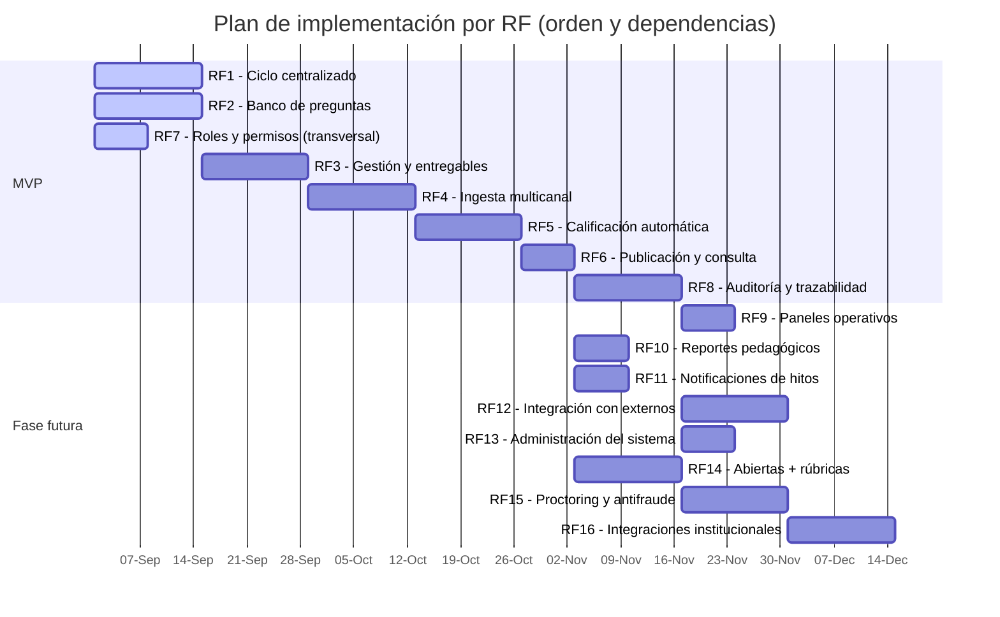
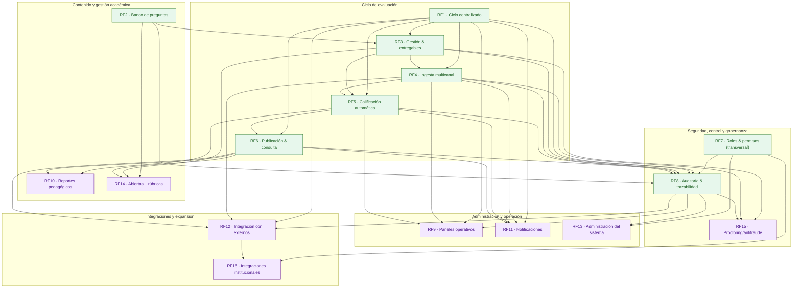

# Alcance del MVP

> El siguiente cuadro resume los requerimientos funcionales (RF) definidos para GRADE, indicando cuáles están incluidos en el **MVP** y cuáles se planifican para fases futuras. También se detallan las dependencias entre RF, los roles impactados y la criticidad de cada uno.

| Categoría                  | RF   | Nombre resumido                                | Dependiente de…      | Rol impactado              | Criticidad |
|-----------------------------|------|-----------------------------------------------|----------------------|----------------------------|------------|
| **Ciclo de evaluación**    | RF1  | Ciclo de evaluación centralizado              | —                    | Docente, Coordinador       | MVP        |
|                             | RF3  | Gestión de evaluaciones y entregables         | RF1, RF2             | Docente, Coordinador       | MVP        |
|                             | RF4  | Ingesta de respuestas multicanal              | RF1, RF3             | Docente                    | MVP        |
|                             | RF5  | Calificación automática de ítems objetivos    | RF1, RF3, RF4        | Docente                    | MVP        |
|                             | RF6  | Publicación y consulta de resultados          | RF1, RF5             | Docente, Coordinador       | MVP        |
| **Contenido y gestión**     | RF2  | Banco centralizado de preguntas               | —                    | Administrador, Coordinador | MVP        |
|                             | RF10 | Reportes pedagógicos básicos                  | RF5, RF6             | Docente, Coordinador       | Futuro     |
|                             | RF14 | Preguntas abiertas y rúbricas                 | RF2, RF3, RF6        | Docente                    | Futuro     |
| **Seguridad y gobernanza**  | RF7  | Roles y permisos                              | RF1                  | Administrador              | MVP        |
|                             | RF8  | Auditoría y trazabilidad                      | RF1–RF7              | Administrador              | MVP        |
|                             | RF15 | Proctoring y antifraude                       | RF3, RF4, RF8        | Administrador, Coordinador | Futuro     |
| **Administración y operación** | RF9  | Paneles operativos y métricas                 | RF1, RF4, RF5, RF8   | Administrador              | Futuro     |
|                             | RF11 | Notificaciones de hitos                       | RF1, RF4, RF5, RF6   | Docente, Administrador     | Futuro     |
|                             | RF13 | Administración del sistema                    | RF7, RF8             | Administrador              | Futuro     |
| **Integraciones y expansión** | RF12 | Integración con sistemas externos             | RF1, RF4, RF6, RF8   | Administrador, Integrador  | Futuro     |
|                             | RF16 | Integraciones institucionales avanzadas       | RF7, RF12            | Administrador, Integrador  | Futuro     |

## Gantt referencial

> **Importante** Las fechas son solo referenciales y no representan lo que realmente se hará en el proyecto. Es solo graficar las dependencias y el orden de implementación sugerido.

## Vista de dependencias

La siguiente gráfica ilustra las dependencias entre los requerimientos funcionales (RF) de GRADE, agrupados por categorías. La flecha A → B indica que B depende de A (B va después de A).

---

[Inicio](../README.md#alcance-del-mvp)