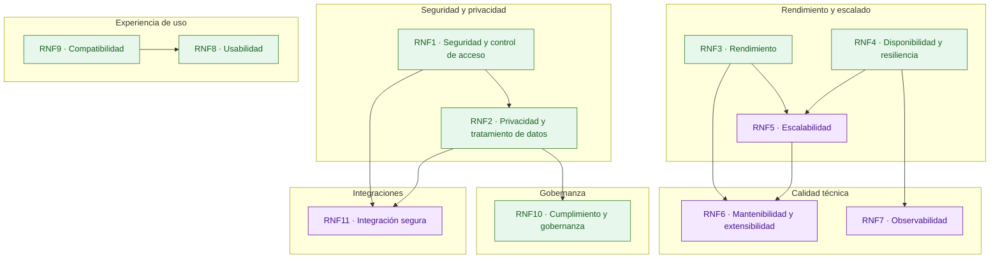

# Alcance del MVP

El alcance del MVP de GRADE incluye los siguientes requisitos no funcionales (RNF), organizados por categoría, con sus dependencias y criticidad:

| Categoría                 | RNF   | Nombre resumido                   | Dependiente de…           | Criticidad |
|----------------------------|-------|-----------------------------------|---------------------------|------------|
| **Seguridad y privacidad** | RNF1  | Seguridad y control de acceso     | RF7, RF8                  | MVP        |
|                            | RNF2  | Privacidad y tratamiento de datos | RF6, RF8, RNF1            | MVP        |
| **Rendimiento y escalado** | RNF3  | Rendimiento                       | RF4, RF5, RF6, RF10       | MVP        |
|                            | RNF4  | Disponibilidad y resiliencia      | RF4, RF5, RF6, RF8        | MVP        |
|                            | RNF5  | Escalabilidad                     | RF4, RF5, RF6, RNF3, RNF4 | Futuro     |
| **Calidad técnica**        | RNF6  | Mantenibilidad y extensibilidad   | RF2–RF6, RNF3, RNF5, RNF7 | Futuro     |
|                            | RNF7  | Observabilidad                    | RF4, RF5, RF9, RNF4       | Futuro     |
| **Experiencia de uso**     | RNF8  | Usabilidad                        | RF1–RF6, RNF9             | MVP        |
|                            | RNF9  | Compatibilidad                    | RNF8, RF11                | MVP        |
| **Gobernanza**             | RNF10 | Cumplimiento y gobernanza         | RF7, RF8, RNF2            | MVP        |
| **Integraciones**          | RNF11 | Mecanismos de integración segura  | RF12, RF16, RNF1, RNF2, RF8 | Futuro   |

## Vista de dependencias

La siguiente gráfica ilustra las dependencias entre los requerimientos funcionales (RF) de GRADE, agrupados por categorías. La flecha A → B indica que B depende de A (B va después de A).

---

[Inicio](../README.md#alcance-del-mvp)