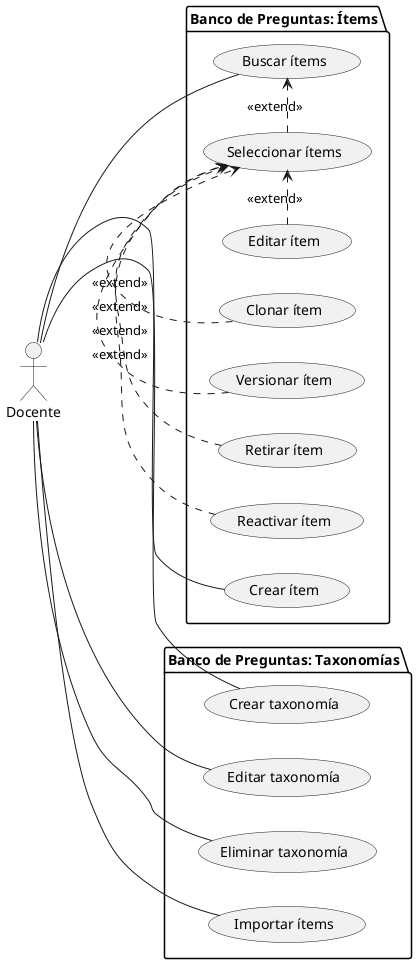
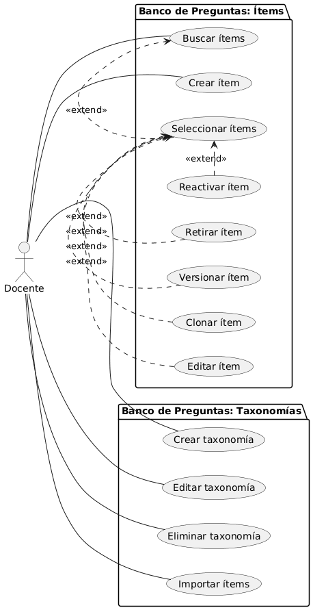
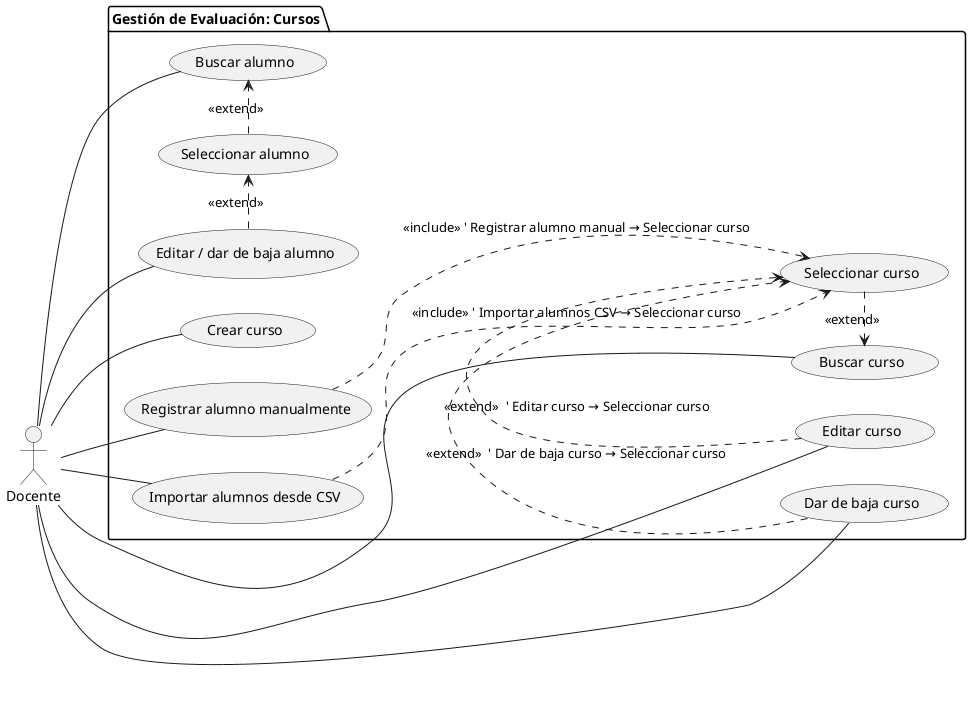
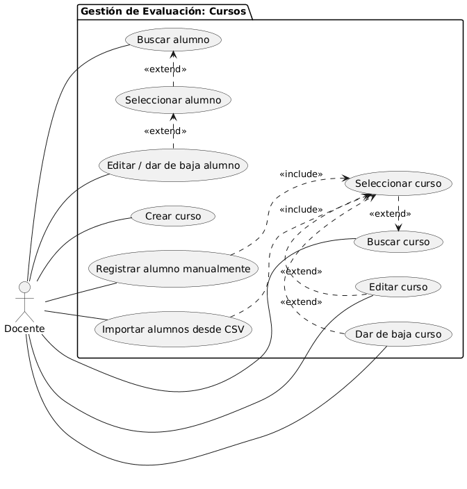
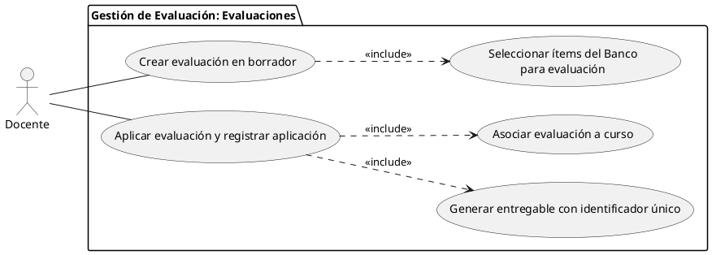
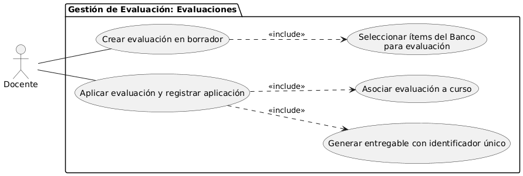
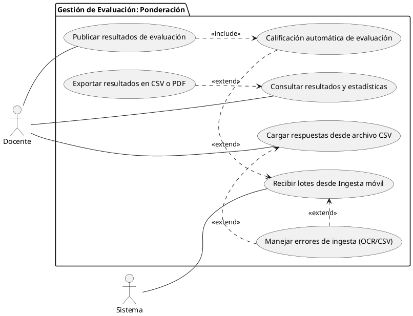
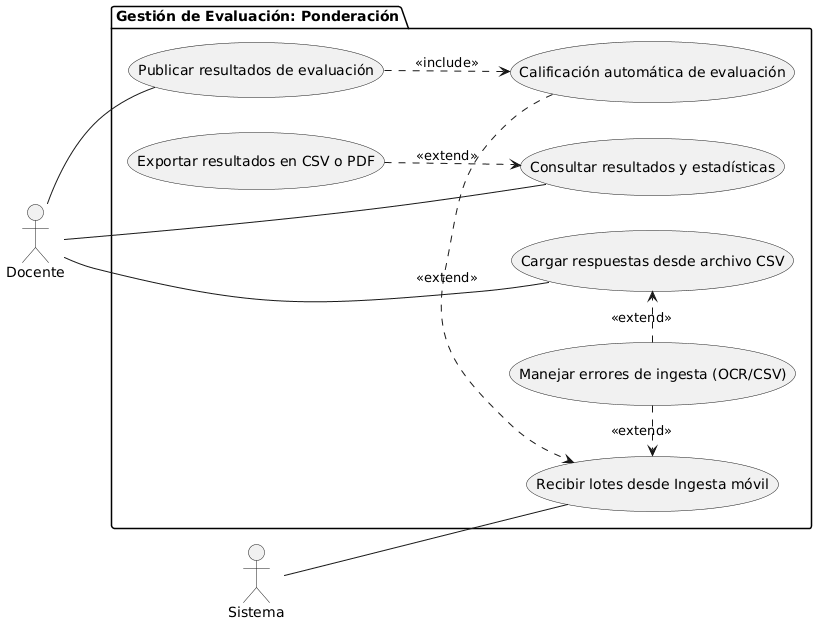

# Diagramas de Casos de Uso

## Banco de Preguntas

```plantuml
@startuml
left to right direction

actor Docente

package "Banco de Preguntas: Taxonomías" {
  usecase "Crear taxonomía" as UCBP11
  usecase "Editar taxonomía" as UCBP12
  usecase "Eliminar taxonomía" as UCBP13
  usecase "Importar ítems" as UCBP14
}

package "Banco de Preguntas: Ítems" {
  usecase "Buscar ítems" as UCBP07
  usecase "Seleccionar ítems" as UCBP08
  usecase "Crear ítem" as UCBP01
  usecase "Editar ítem" as UCBP02
  usecase "Clonar ítem" as UCBP03
  usecase "Versionar ítem" as UCBP04
  usecase "Retirar ítem" as UCBP05
  usecase "Reactivar ítem" as UCBP06
}


UCBP08 .> UCBP07 : <<extend>>
UCBP02 .> UCBP08 : <<extend>>
UCBP03 .> UCBP08 : <<extend>>
UCBP04 .> UCBP08 : <<extend>>
UCBP05 .> UCBP08 : <<extend>>
UCBP06 .> UCBP08 : <<extend>>

Docente -- UCBP01
Docente -- UCBP07
Docente -- UCBP11
Docente -- UCBP12
Docente -- UCBP13
Docente -- UCBP14

@enduml
```

---

## Gestión de Evaluaciones

```plantuml
@startuml
left to right direction

actor Docente

package "Gestión de Evaluación: Cursos" {

  ' ==== Casos principales (provistos) ====
  usecase "Crear curso" as UCGE01
  usecase "Editar curso" as UCGE02
  usecase "Dar de baja curso" as UCGE03
  usecase "Registrar alumno manualmente" as UCGE04
  usecase "Importar alumnos desde CSV" as UCGE05
  usecase "Editar / dar de baja alumno" as UCGE06

  ' ==== Soportes de navegación (intermedios) ====
  usecase "Buscar curso" as NAV_Curso_Buscar
  usecase "Seleccionar curso" as NAV_Curso_Seleccionar
  usecase "Buscar alumno" as NAV_Alumno_Buscar
  usecase "Seleccionar alumno" as NAV_Alumno_Seleccionar
}

' ==== Vínculos de actor ====
Docente -- UCGE01
Docente -- UCGE02
Docente -- UCGE03
Docente -- UCGE04
Docente -- UCGE05
Docente -- UCGE06

' (Opcionalmente, el Docente también interactúa con los pasos de navegación)
Docente -- NAV_Curso_Buscar
Docente -- NAV_Alumno_Buscar

' ==== Relaciones entre casos ====
' Navegación de cursos
NAV_Curso_Seleccionar .> NAV_Curso_Buscar : <<extend>>

' Acciones sobre cursos requieren selección previa
UCGE02 .> NAV_Curso_Seleccionar : <<extend>>  ' Editar curso → Seleccionar curso
UCGE03 .> NAV_Curso_Seleccionar : <<extend>>  ' Dar de baja curso → Seleccionar curso

' Registrar/Importar alumnos requieren tener un curso seleccionado
UCGE04 ..> NAV_Curso_Seleccionar : <<include>> ' Registrar alumno manual → Seleccionar curso
UCGE05 ..> NAV_Curso_Seleccionar : <<include>> ' Importar alumnos CSV → Seleccionar curso

' Navegación de alumnos
NAV_Alumno_Seleccionar .> NAV_Alumno_Buscar : <<extend>>

' Editar/dar de baja alumno requiere seleccionar alumno (y, por contexto, curso ya seleccionado)
UCGE06 .> NAV_Alumno_Seleccionar : <<extend>>
@enduml

```

```plantuml
@startuml
left to right direction

actor Docente

package "Gestión de Evaluación: Evaluaciones" {
  usecase "Crear evaluación en borrador" as UCGE07
  usecase "Seleccionar ítems del Banco\npara evaluación" as UCGE08
  usecase "Generar entregable con identificador único" as UCGE09
  usecase "Asociar evaluación a curso" as UCGE10
  usecase "Aplicar evaluación y registrar aplicación" as UCGE11
}

' Vínculos con el actor
Docente -- UCGE07
Docente -- UCGE11

' Relaciones entre CU (solo los originales)
' Construcción de la evaluación en borrador incluye selección de ítems y generación del entregable
UCGE07 ..> UCGE08 : <<include>>

' Para aplicar una evaluación, debe estar asociada a un curso y contar con entregable
UCGE11 ..> UCGE10 : <<include>>
UCGE11 ..> UCGE09 : <<include>>

@enduml
```

```plantuml
@startuml
left to right direction

actor Docente

package "Gestión de Evaluación: Ponderación" {
  usecase "Cargar respuestas desde archivo CSV" as UCGE12
  usecase "Recibir lotes desde Ingesta móvil" as UCGE13
  usecase "Calificación automática de evaluación" as UCGE14
  usecase "Manejar errores de ingesta (OCR/CSV)" as UCGE15
  usecase "Publicar resultados de evaluación" as UCGE16
  usecase "Consultar resultados y estadísticas" as UCGE17
  usecase "Exportar resultados en CSV o PDF" as UCGE18
}

Docente -- UCGE12
Sistema -- UCGE13
Docente -- UCGE16
Docente -- UCGE17

UCGE15 .> UCGE12 : <<extend>>
UCGE15 .> UCGE13 : <<extend>>
UCGE14 .> UCGE13 : <<extend>>
UCGE16 ..> UCGE14 : <<include>>
UCGE18 ..> UCGE17 : <<extend>>

@enduml
```
