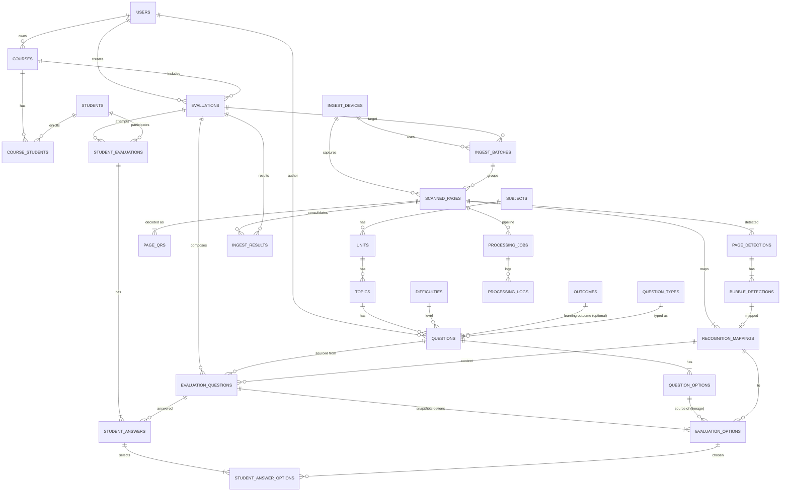

# Diagrama general de Base de Datos

A continuación se presenta un diagrama Entidad-Relación (ER) general que integra los tres módulos principales del sistema GRADE: Banco de Preguntas, Gestión de Evaluaciones e Ingesta Móvil. Este diagrama ilustra las entidades clave, sus atributos principales y las relaciones entre ellas, proporcionando una visión global de la estructura de datos del sistema.

