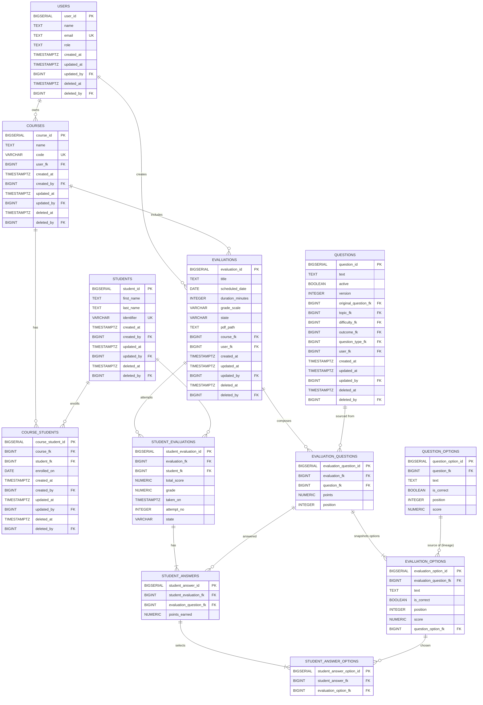

# Gestión de Evaluaciones – Análisis del MER

[Volver](../README.md)

> El módulo **Gestión de Evaluaciones** orquesta el ciclo completo de una prueba: planificación, composición a partir del *Question Bank*, publicación/aplicación a un curso, recolección de respuestas y cálculo de puntajes/notas. El diseño prioriza **3FN**, **trazabilidad** y **separación de responsabilidades** con el banco de preguntas.
> Se agrega un **snapshot de las opciones** (`evaluation_options`) y se actualizan las referencias en `student_answers` para preservar la consistencia histórica.
>
> **Auditoría:** Este módulo implementa el sistema de [auditoría soft](../AUDIT.md) estándar de GRADE. Las tablas principales incluyen campos `created_at`, `created_by`, `updated_at`, `updated_by`, `deleted_at`, `deleted_by` para trazabilidad completa. Ver excepciones por tablas de detalle en [AUDIT.md](../AUDIT.md): `evaluation_questions`, `evaluation_options`, `student_answers`, `student_answer_options` no llevan auditoría propia (heredan del padre funcional).

---

## Modelo conceptual (resumen)

- **Users**: autores/gestores de evaluaciones (docentes/coordinadores).
- **Courses**: contenedores académicos (asignatura + grupo/curso).
- **Students** y **CourseStudents**: estudiantes y su matrícula en cursos.
- **Evaluations**: pruebas planificadas (estado: `Draft`/`Published`/`Applied`/`Graded`/`Archived`).
- **EvaluationQuestions**: ítems seleccionados desde *Questions*, con puntaje y orden propios.
- **EvaluationOptions**: snapshot de las opciones de cada pregunta en esa evaluación (con trazabilidad al banco).
- **StudentEvaluations**: intento/rendición de un estudiante en una evaluación.
- **StudentAnswers**: respuesta por pregunta (referencia a `QuestionOptions`) y puntaje obtenido.
- **StudentAnswerOptions**: alternativas seleccionadas por el estudiante (1 en TF/SC, múltiples en MC).
- **(Opcional futuro)** Rubrics/ScoringPolicies: políticas de conversión a nota o crédito parcial.

> Las tablas referencian al *Question Bank* (especialmente `questions` y `question_options`) **sin duplicar semántica**.

---

## Especificación de Entidades y Atributos

> Convenciones: **tablas en inglés (plural)**, **campos en inglés (singular)**, **PK = `$table_id`**, **FK = `$table_fk`**. Tipos/tamaños pensados para PostgreSQL.

### 1) `users` — *Usuarios del sistema*
**Descripción extendida:** Personas con acceso al sistema que crean/gestionan evaluaciones. Se usa para autoría, propiedad y auditoría.

| Campo      | Largo       | Descripción                           | Restricciones           | Clave |
|------------|-------------|---------------------------------------|-------------------------|-------|
| user_id    | BIGSERIAL   | Identificador del usuario             | NOT NULL                | PK    |
| name       | TEXT        | Nombre completo                       | NOT NULL                | -     |
| email      | TEXT        | Correo único                          | NOT NULL, UNIQUE        | -     |
| role       | TEXT        | Rol (Teacher/Coordinator/Admin, etc.) | NOT NULL                | -     |
| created_at | TIMESTAMPTZ | Fecha/hora de creación                | NOT NULL, DEFAULT now() | -     |
| updated_at | TIMESTAMPTZ | Fecha/hora de última modificación     | NULL                    | -     |
| updated_by | BIGINT      | Usuario que realizó la última modificación | FK → `users.user_id` ON DELETE SET NULL | FK |
| deleted_at | TIMESTAMPTZ | Fecha/hora de eliminación (soft delete) | NULL                  | -     |
| deleted_by | BIGINT      | Usuario que realizó la eliminación    | FK → `users.user_id` ON DELETE SET NULL | FK |

> **Nota:** Esta tabla es compartida con el módulo de Banco de Preguntas. Los campos de auditoría son consistentes en todo el sistema GRADE.

---

### 2) `courses` — *Cursos/Secciones académicas*
**Descripción extendida:** Contenedor académico (asignatura+paralelo/grupo) donde se publican y aplican evaluaciones.

| Campo      | Largo       | Descripción                            | Restricciones                                     | Clave |
|------------|-------------|----------------------------------------|---------------------------------------------------|-------|
| course_id  | BIGSERIAL   | Identificador del curso                | NOT NULL                                          | PK    |
| name       | TEXT        | Nombre del curso (p.ej., "Science 5A") | NOT NULL                                          | -     |
| code       | VARCHAR(64) | Código único institucional             | NOT NULL, UNIQUE                                  | -     |
| user_fk    | BIGINT      | Docente responsable/owner              | NOT NULL, FK → `users.user_id` ON DELETE RESTRICT | FK    |
| created_at | TIMESTAMPTZ | Fecha/hora de creación                 | NOT NULL, DEFAULT now()                           | -     |
| created_by | BIGINT      | Usuario que creó el registro           | NOT NULL, FK → `users.user_id` ON DELETE RESTRICT | FK    |
| updated_at | TIMESTAMPTZ | Fecha/hora de última modificación      | NULL                                              | -     |
| updated_by | BIGINT      | Usuario que realizó la última modificación | FK → `users.user_id` ON DELETE SET NULL       | FK    |
| deleted_at | TIMESTAMPTZ | Fecha/hora de eliminación (soft delete) | NULL                                             | -     |
| deleted_by | BIGINT      | Usuario que realizó la eliminación     | FK → `users.user_id` ON DELETE SET NULL           | FK    |

---

### 3) `students` — *Estudiantes*
**Descripción extendida:** Personas evaluadas. Se almacena un identificador institucional para unicidad y trazabilidad.

| Campo      | Largo       | Descripción                                     | Restricciones                                     | Clave |
|------------|-------------|-------------------------------------------------|---------------------------------------------------|-------|
| student_id | BIGSERIAL   | Identificador del estudiante                    | NOT NULL                                          | PK    |
| first_name | TEXT        | Nombres                                         | NOT NULL                                          | -     |
| last_name  | TEXT        | Apellidos                                       | NOT NULL                                          | -     |
| identifier | VARCHAR(64) | Identificador institucional (RUT/legajo/código) | NOT NULL, UNIQUE                                  | -     |
| created_at | TIMESTAMPTZ | Fecha/hora de creación                          | NOT NULL, DEFAULT now()                           | -     |
| created_by | BIGINT      | Usuario que creó el registro                    | NOT NULL, FK → `users.user_id` ON DELETE RESTRICT | FK    |
| updated_at | TIMESTAMPTZ | Fecha/hora de última modificación               | NULL                                              | -     |
| updated_by | BIGINT      | Usuario que realizó la última modificación      | FK → `users.user_id` ON DELETE SET NULL           | FK    |
| deleted_at | TIMESTAMPTZ | Fecha/hora de eliminación (soft delete)         | NULL                                              | -     |
| deleted_by | BIGINT      | Usuario que realizó la eliminación              | FK → `users.user_id` ON DELETE SET NULL           | FK    |

---

### 4) `course_students` — *Matrícula en curso*
**Descripción extendida:** Pertenencia de un estudiante a un curso en un período. Evita duplicidades de inscripción.

| Campo             | Largo       | Descripción                       | Restricciones                                                 | Clave |
|-------------------|-------------|-----------------------------------|---------------------------------------------------------------|-------|
| course_student_id | BIGSERIAL   | Identificador de la matrícula     | NOT NULL                                                      | PK    |
| course_fk         | BIGINT      | Curso                             | NOT NULL, FK → `courses.course_id` ON DELETE RESTRICT         | FK    |
| student_fk        | BIGINT      | Estudiante                        | NOT NULL, FK → `students.student_id` ON DELETE RESTRICT       | FK    |
| enrolled_on       | DATE        | Fecha de inscripción              | NOT NULL, DEFAULT CURRENT_DATE                                | -     |
| created_at        | TIMESTAMPTZ | Fecha/hora de creación            | NOT NULL, DEFAULT now()                                       | -     |
| created_by        | BIGINT      | Usuario que creó el registro      | NOT NULL, FK → `users.user_id` ON DELETE RESTRICT             | FK    |
| updated_at        | TIMESTAMPTZ | Fecha/hora de última modificación | NULL                                                          | -     |
| updated_by        | BIGINT      | Usuario que realizó la última modificación | FK → `users.user_id` ON DELETE SET NULL              | FK    |
| deleted_at        | TIMESTAMPTZ | Fecha/hora de eliminación (soft delete) | NULL                                                    | -     |
| deleted_by        | BIGINT      | Usuario que realizó la eliminación | FK → `users.user_id` ON DELETE SET NULL                      | FK    |

> **Regla:** `UNIQUE (course_fk, student_fk)` donde `deleted_at IS NULL`.

---

### 5) `evaluations` — *Evaluaciones/Pruebas*
**Descripción extendida:** Entidad principal de evaluación. Define planificación/estado, y referencia al artefacto entregable (PDF/QR).

| Campo            | Largo       | Descripción                                       | Restricciones                                                                  | Clave |
|------------------|-------------|---------------------------------------------------|--------------------------------------------------------------------------------|-------|
| evaluation_id    | BIGSERIAL   | Identificador de la evaluación                    | NOT NULL                                                                       | PK    |
| title            | TEXT        | Título                                            | NOT NULL                                                                       | -     |
| scheduled_date   | DATE        | Fecha programada                                  | NOT NULL                                                                       | -     |
| duration_minutes | INTEGER     | Duración en minutos                               | NOT NULL, CHECK (duration_minutes > 0)                                         | -     |
| grade_scale      | VARCHAR(64) | Escala (p.ej., `0-100_to_1-7`)                    | NOT NULL                                                                       | -     |
| state            | VARCHAR(16) | `Draft`/`Published`/`Applied`/`Graded`/`Archived` | NOT NULL, CHECK (state IN ('Draft','Published','Applied','Graded','Archived')) | -     |
| pdf_path         | TEXT        | Ruta/URL del entregable (PDF con QR/código)       | NULLABLE                                                                       | -     |
| course_fk        | BIGINT      | Curso al que pertenece                            | NOT NULL, FK → `courses.course_id` ON DELETE RESTRICT                          | FK    |
| user_fk          | BIGINT      | Creador/gestor                                    | NOT NULL, FK → `users.user_id` ON DELETE RESTRICT                              | FK    |
| created_at       | TIMESTAMPTZ | Fecha/hora de creación                            | NOT NULL, DEFAULT now()                                                        | -     |
| updated_at       | TIMESTAMPTZ | Fecha/hora de última modificación                 | NULL                                                                           | -     |
| updated_by       | BIGINT      | Usuario que realizó la última modificación        | FK → `users.user_id` ON DELETE SET NULL                                        | FK    |
| deleted_at       | TIMESTAMPTZ | Fecha/hora de eliminación (soft delete)           | NULL                                                                           | -     |
| deleted_by       | BIGINT      | Usuario que realizó la eliminación                | FK → `users.user_id` ON DELETE SET NULL                                        | FK    |

> **Regla de edición:** solo en `state = 'Draft'` se modifica la composición (ver triggers sugeridos).  
> **Nota importante:** `user_fk` representa el **creador** de la evaluación (equivalente a `created_by`, ver "Casos especiales" en [AUDIT.md](../AUDIT.md)). Para modificaciones se usa `updated_by`.

---

### 6) `evaluation_questions` — *Composición de evaluación*
**Descripción extendida:** Asocia preguntas del *Question Bank* a una evaluación con puntaje y orden específicos (sin copiar pregunta).

| Campo                  | Largo        | Descripción                             | Restricciones                                                | Clave |
|------------------------|--------------|-----------------------------------------|--------------------------------------------------------------|-------|
| evaluation_question_id | BIGSERIAL    | Identificador del ítem en la evaluación | NOT NULL                                                     | PK    |
| evaluation_fk          | BIGINT       | Evaluación                              | NOT NULL, FK → `evaluations.evaluation_id` ON DELETE CASCADE | FK    |
| question_fk            | BIGINT       | Pregunta (Question Bank)                | NOT NULL, FK → `questions.question_id` ON DELETE RESTRICT    | FK    |
| points                 | NUMERIC(6,2) | Puntaje asignado                        | NOT NULL, CHECK (points > 0)                                 | -     |
| position               | INTEGER      | Orden visual en la evaluación           | NOT NULL, CHECK (position >= 1)                              | -     |

> **Reglas:** `UNIQUE (evaluation_fk, question_fk)` y `UNIQUE (evaluation_fk, position)`.

---

### 7) `evaluation_options` — *Opciones congeladas*
**Descripción extendida:** Copia de las opciones (`question_options`) tal como existían al momento de **publicar** la evaluación. Esto asegura que cambios posteriores en el banco (nuevas alternativas, correcciones) no alteren aplicaciones pasadas.

| Campo                  | Largo        | Descripción                             | Restricciones                                                                  | Clave |
|------------------------|--------------|-----------------------------------------|--------------------------------------------------------------------------------|-------|
| evaluation_option_id   | BIGSERIAL    | Identificador de la opción congelada    | NOT NULL                                                                       | PK    |
| evaluation_question_fk | BIGINT       | Pregunta de la evaluación               | NOT NULL, FK → `evaluation_questions.evaluation_question_id` ON DELETE CASCADE | FK    |
| text                   | TEXT         | Texto de la opción                      | NOT NULL                                                                       | -     |
| is_correct             | BOOLEAN      | Marca si la opción es correcta          | NOT NULL                                                                       | -     |
| position               | INTEGER      | Orden visual en la lista                | NOT NULL, CHECK (position >= 1)                                                | -     |
| score                  | NUMERIC(6,3) | Puntaje parcial (crédito parcial en MC) | NULLABLE                                                                       | -     |
| question_option_fk     | BIGINT       | Referencia a la opción fuente del banco | NULLABLE, FK → `question_options.question_option_id`                           | FK    |

> **Reglas:** replican las del banco — TF debe tener 2 y 1 correcta, SC ≥2 y 1 correcta, MC ≥2 y ≥1 correcta. Estas validaciones deben aplicarse en esta tabla también.

---

### 8) `student_evaluations` — *Rendición del estudiante*
**Descripción extendida:** Representa un **intento** de un estudiante sobre una evaluación, registrando puntaje total, nota y metadatos.

| Campo                 | Largo        | Descripción                                        | Restricciones                                                  | Clave |
|-----------------------|--------------|----------------------------------------------------|----------------------------------------------------------------|-------|
| student_evaluation_id | BIGSERIAL    | Identificador del intento                          | NOT NULL                                                       | PK    |
| evaluation_fk         | BIGINT       | Evaluación                                         | NOT NULL, FK → `evaluations.evaluation_id` ON DELETE CASCADE   | FK    |
| student_fk            | BIGINT       | Estudiante                                         | NOT NULL, FK → `students.student_id` ON DELETE RESTRICT        | FK    |
| total_score           | NUMERIC(8,3) | Puntaje total obtenido                             | NOT NULL, DEFAULT 0, CHECK (total_score >= 0)                  | -     |
| grade                 | NUMERIC(5,2) | Nota final                                         | NULLABLE                                                       | -     |
| taken_on              | TIMESTAMPTZ  | Fecha/hora de rendición                            | NULLABLE                                                       | -     |
| attempt_no            | INTEGER      | Nº de intento si hay múltiples                     | NULLABLE, CHECK (attempt_no IS NULL OR attempt_no >= 1)        | -     |
| state                 | VARCHAR(16)  | Estado del intento (`InProgress/Submitted/Graded`) | NULLABLE, CHECK (state IN ('InProgress','Submitted','Graded')) | -     |

> **Reglas:**
> - Un intento: `UNIQUE (evaluation_fk, student_fk)`; múltiples: `UNIQUE (evaluation_fk, student_fk, attempt_no)`.
> - **Pertenencia**: (`evaluation.course_fk`, `student_fk`) debe existir en `course_students` (trigger de validación).

---

### 9) `student_answers` — *Respuestas del estudiante por pregunta*
**Descripción extendida:** Una fila por cada `evaluation_question` contestada por el estudiante. Guarda el puntaje total obtenido en esa pregunta (sea por una opción única o por varias).

| Campo                  | Largo        | Descripción                        | Restricciones                                                                  | Clave |
|------------------------|--------------|------------------------------------|--------------------------------------------------------------------------------|-------|
| student_answer_id      | BIGSERIAL    | Identificador de la respuesta      | NOT NULL                                                                       | PK    |
| student_evaluation_fk  | BIGINT       | Intento del estudiante             | NOT NULL, FK → `student_evaluations.student_evaluation_id` ON DELETE CASCADE   | FK    |
| evaluation_question_fk | BIGINT       | Pregunta de la evaluación          | NOT NULL, FK → `evaluation_questions.evaluation_question_id` ON DELETE CASCADE | FK    |
| points_earned          | NUMERIC(6,3) | Puntaje obtenido por esta pregunta | NOT NULL, DEFAULT 0, CHECK (points_earned >= 0)                                | -     |

> **Reglas:**
> - `UNIQUE (student_evaluation_fk, evaluation_question_fk)`.
> - **Cota superior**: `points_earned ≤ evaluation_questions.points` (trigger).

---

### 10) `student_answer_options` — *Selección de alternativas*
**Descripción extendida:** Permite registrar qué opciones congeladas (`evaluation_options`) eligió un estudiante. Soporta TF/SC (1 fila) y MC (varias filas).

| Campo                    | Largo     | Descripción                   | Restricciones                                                               | Clave |
|--------------------------|-----------|-------------------------------|-----------------------------------------------------------------------------|-------|
| student_answer_option_id | BIGSERIAL | Identificador de la selección | NOT NULL                                                                    | PK    |
| student_answer_fk        | BIGINT    | Respuesta del estudiante      | NOT NULL, FK → `student_answers.student_answer_id` ON DELETE CASCADE        | FK    |
| evaluation_option_fk     | BIGINT    | Opción elegida (snapshot)     | NOT NULL, FK → `evaluation_options.evaluation_option_id` ON DELETE RESTRICT | FK    |

---

## Integridad y reglas de negocio (síntesis)

### Estados y edición
- **Solo `Draft`**: se pueden agregar/quitar `evaluation_questions`.
- `Published`: estructura congelada (se permite distribución PDF/QR).
- `Applied`: se registran `student_evaluations` y `student_answers`.
- `Graded`: intentos calificados; se fija `grade`.
- `Archived`: cierre administrativo (no editable).

> **Trigger recomendado:** impedir `INSERT/UPDATE/DELETE` en `evaluation_questions` si `evaluations.state <> 'Draft'`.

### Pertenencia y cobertura
- Al crear `student_evaluations`, validar que el estudiante **esté matriculado** en el curso de la evaluación (`course_students`). *(Trigger)*

### Composición y puntajes
- `evaluation_questions.points > 0` y `position >= 1`.
- `student_answers.points_earned >= 0` y **≤** puntos de la pregunta correspondiente. *(Trigger)*
- Para TF/SC: exactamente **una** `evaluation_option_fk` marcada por respuesta.
- Para MC: por simplicidad, una fila por pregunta; la lógica de conjunto correcto/penalizaciones se aplica en MS y se refleja en `points_earned`. *(Alternativa avanzada: tabla puente)*

### Intentos
- Definir si es **único** o **múltiple** por evaluación/estudiante. Ajustar UNIQUE y `attempt_no` según política.

### Conversión a nota
- `grade` se calcula en MS (según `grade_scale`) y se persiste.

### Auditoría y soft delete
- Tablas principales (`users`, `courses`, `students`, `course_students`, `evaluations`) implementan auditoría completa.
- Usar soft delete (`deleted_at`, `deleted_by`) en lugar de eliminación física.
- Consultas deben filtrar `deleted_at IS NULL` para obtener registros activos.

---

## Índices sugeridos

- `evaluations (course_fk, state, scheduled_date)` → listados por curso/estado/fecha.
- `evaluations (deleted_at)` WHERE `deleted_at IS NOT NULL` → soft delete.
- `evaluation_questions (evaluation_fk, position)` → armado de pauta.
- `student_evaluations (evaluation_fk, student_fk)` / `(evaluation_fk, student_fk, attempt_no)` → recuperación rápida.
- `student_answers (student_evaluation_fk, evaluation_question_fk)` → corrección/consulta puntual.
- Índices sobre FKs usados en joins frecuentes (`question_fk`, `evaluation_option_fk`).
- Índices de auditoría:
  - `courses (deleted_at)` WHERE `deleted_at IS NOT NULL`
  - `students (deleted_at)` WHERE `deleted_at IS NOT NULL`
  - `course_students (deleted_at)` WHERE `deleted_at IS NOT NULL`

---

## Trazabilidad clave

- **Ítems usados:** `evaluation_questions.question_fk` indica dónde se utilizó cada pregunta del banco.
- **Desempeño por pregunta:** `student_answers` + `evaluation_options.is_correct` permiten tasas de acierto y análisis de dificultad real.
- **Desempeño por curso/tema:** `evaluations.course_fk` + jerarquía curricular transitiva desde `questions.topic_fk` (Topic → Unit → Subject).
- **Auditoría completa:** Campos de auditoría permiten rastrear quién creó, modificó o eliminó cada registro.

---

## Flujos típicos (alto nivel)

1. **Planificar** → `Evaluations.state = 'Draft'`; componer `evaluation_questions` (puntaje/orden).
2. **Publicar** → `state = 'Published'`; congelar opciones en `evaluation_options`; generar `pdf_path` (QR/código).
3. **Aplicar** → registrar `student_evaluations`; ingesta alimenta `student_answers` y `student_answer_options`.
4. **Calificar** → calcular `points_earned`/`total_score` → convertir a `grade` → `state = 'Graded'`.
5. **Archivar** → cierre y bloqueo de cambios (`'Archived'`).

---

## Beneficios del diseño

- **3FN y modularidad**: composición desacoplada del banco; total trazabilidad.
- **Escalabilidad**: estructuras separadas permiten componer/corregir sin bloquear.
- **Robustez**: invariantes críticas aseguradas en BD; reglas cambiantes van al MS.
- **Reportabilidad**: navegación clara por curso, evaluación, pregunta y respuesta.
- **Auditoría completa**: Trazabilidad de todas las operaciones con soft delete.

---

## Extensiones futuras (cuando se requieran)

- **Rubrics/ScoringPolicies**: conversión parametrizable `total_score → grade` y crédito parcial MC.
- **Answer audits**: logs de overrides y correcciones manuales.
- **Blueprints**: selección automática de ítems (por dificultad/outcome).
- **Proctoring**: ventanas/ubicaciones, intentos máximos, versiones A/B.
- **Tabla de auditoría centralizada**: Para registrar historial completo de cambios (fase futura).

---

## Ejemplo de trazabilidad (navegación)
```
Course "Science 5A"
└── Evaluation "Planets Quiz" (Published → Applied → Graded)
    ├── EvaluationQuestions: [Q#12(pts=2,pos=1), Q#34(pts=3,pos=2), ...]
    ├── EvaluationOptions: snapshot de opciones al momento de publicar
    ├── StudentEvaluations (Juan, Ana, ...)
    │   └── StudentAnswers (por pregunta: opciones elegidas, puntos_earned)
    │       └── StudentAnswerOptions (alternativas seleccionadas)
    └── PDF deliverable con QR #EV-2025-09-13-XYZ
```

---

## MER

- [Script de creación SQL (PostgreSQL)](DDL.sql)
- [Triggers y funciones](TRIGGERS.sql)
- [Datos de prueba](DATA_TEST.sql)
- [Consultas de prueba](QUERY_TEST.sql)
- [Guía de Auditoría Soft](../AUDIT.md)



[Subir](#gestión-de-evaluaciones--análisis-del-mer)

