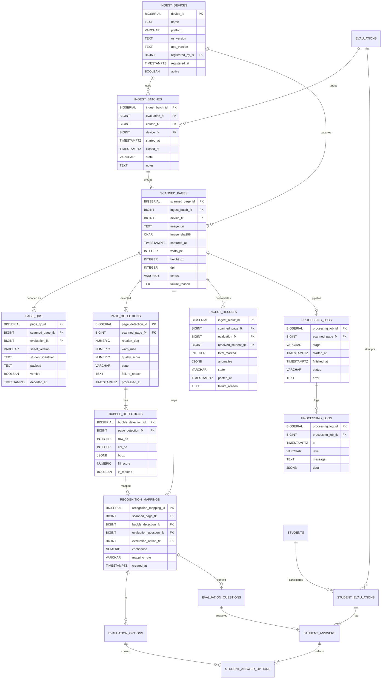

# Ingesta Móvil – Análisis del MER

[Volver](../README.md)

> El módulo de **Ingesta Móvil (Mobile Ingest)** captura, procesa y consolida respuestas provenientes de hojas físicas escaneadas/fotografiadas con la app móvil. Se encarga de: leer el **QR/código** del instrumento, detectar marcas/burbujas, mapear a **`evaluation_options`** (snapshot), y persistir resultados en **`student_answers`** y **`student_answer_options`** con auditoría e idempotencia.
>
> El diseño prioriza **3FN**, **trazabilidad extremo a extremo**, **idempotencia** (evitar duplicados por reintentos) y **auditoría de procesamiento**. Se alinea y no duplica semántica del **Banco de Preguntas** ni de **Gestión de Evaluaciones**.
>
> **Auditoría:** Este módulo adopta el sistema de [auditoría soft](../AUDIT.md) estándar de GRADE donde aplica a entidades de negocio. No obstante, la mayoría de sus tablas son de procesamiento/log (inmutables o históricas) y, por diseño, no implementan `soft delete` ni `created_by/updated_by`; su trazabilidad se registra con marcas específicas del pipeline (`registered_at`, `captured_at`, `decoded_at`, `started_at`, `finished_at`, etc.). Ver detalles y excepciones en [AUDIT.md](../AUDIT.md).

---

## Modelo conceptual (resumen)

- **IngestDevices**: dispositivos móviles registrados que realizan capturas.
- **IngestBatches**: sesiones/lotes de captura (p. ej., un curso o evaluación en un bloque horario).
- **ScannedPages**: archivos/imágenes ingresadas (1 por página/hoja), con metadatos y huellas (hash) para idempotencia.
- **PageQRs**: datos decodificados del QR/código en la página (enlaza a Evaluation y versión de layout).
- **PageDetections**: normalización geométrica (marcas de alineación), estado y métricas de calidad.
- **BubbleDetections**: detección por burbuja (posición, score de relleno/confianza) previa a la interpretación semántica.
- **RecognitionMappings**: mapeo de burbujas detectadas a `evaluation_options` (snapshot) y, por transitividad, a `evaluation_questions`.
- **IngestResults**: consolidación por estudiante/pregunta (por página o por lote) y enlace a `student_evaluations`/`student_answers`.
- **ProcessingJobs/Logs**: pipeline de procesamiento y auditoría técnica.

> La composición pedagógica/estructura (preguntas/opciones) proviene de Evaluations (`evaluation_questions` + `evaluation_options`). Mobile Ingest no redefine preguntas, solo consume su layout y produce respuestas trazables.

---

## Especificación de Entidades y Atributos

> Convenciones: tablas en inglés (plural), **PK** = `$table_id`, **FK** = `$table_fk`, tipos para PostgreSQL.

### 1) `ingest_devices` — Dispositivos móviles
Descripción: Dispositivos autorizados para capturar (p. ej., teléfono del docente/proctor).

| Campo            | Largo       | Descripción                                  | Restricciones                                   | Clave |
|------------------|-------------|----------------------------------------------|-------------------------------------------------|-------|
| device_id        | BIGSERIAL   | Identificador del dispositivo                | NOT NULL                                        | PK    |
| name             | TEXT        | Nombre del dispositivo                       | NOT NULL                                        | -     |
| platform         | VARCHAR(32) | Plataforma                                   | NOT NULL, CHECK (platform IN ('ios','android','other')) | -     |
| os_version       | TEXT        | Versión del sistema operativo                | NULLABLE                                        | -     |
| app_version      | TEXT        | Versión de la app                            | NULLABLE                                        | -     |
| registered_by_fk | BIGINT      | Usuario que registró el dispositivo          | NOT NULL, FK → `users.user_id`                  | FK    |
| registered_at    | TIMESTAMPTZ | Fecha/hora de registro                       | NOT NULL, DEFAULT now()                         | -     |
| active           | BOOLEAN     | Vigente/activo                               | NOT NULL, DEFAULT TRUE                          | -     |

---

### 2) `ingest_batches` — Sesión/Lote de captura
Descripción: Agrupa capturas relacionadas (misma evaluación, curso o bloque temporal).

| Campo           | Largo       | Descripción                     | Restricciones                                                                 | Clave |
|-----------------|-------------|---------------------------------|-------------------------------------------------------------------------------|-------|
| ingest_batch_id | BIGSERIAL   | Identificador del lote          | NOT NULL                                                                      | PK    |
| evaluation_fk   | BIGINT      | Evaluación objetivo             | NOT NULL, FK → `evaluations.evaluation_id`                                    | FK    |
| course_fk       | BIGINT      | Curso de la evaluación          | NOT NULL, FK → `courses.course_id`                                            | FK    |
| device_fk       | BIGINT      | Dispositivo que inició el lote  | NOT NULL, FK → `ingest_devices.device_id`                                     | FK    |
| started_at      | TIMESTAMPTZ | Inicio del lote                 | NOT NULL, DEFAULT now()                                                       | -     |
| closed_at       | TIMESTAMPTZ | Cierre del lote                 | NULLABLE                                                                      | -     |
| state           | VARCHAR(16) | Estado del lote                 | NOT NULL, DEFAULT 'Open', CHECK (state IN ('Open','Processing','Closed'))     | -     |
| notes           | TEXT        | Notas                           | NULLABLE                                                                      | -     |

> Regla: `course_fk` debe coincidir con `evaluations.course_fk` (trigger de validación).

---

### 3) `scanned_pages` — Páginas/imágenes capturadas
Descripción: Una fila por imagen/página capturada.

| Campo           | Largo       | Descripción                     | Restricciones                                                                                   | Clave |
|-----------------|-------------|---------------------------------|-------------------------------------------------------------------------------------------------|-------|
| scanned_page_id | BIGSERIAL   | Identificador de la página      | NOT NULL                                                                                        | PK    |
| ingest_batch_fk | BIGINT      | Lote al que pertenece           | NOT NULL, FK → `ingest_batches.ingest_batch_id`                                                 | FK    |
| device_fk       | BIGINT      | Dispositivo que capturó         | NOT NULL, FK → `ingest_devices.device_id`                                                       | FK    |
| image_uri       | TEXT        | Ruta/URL del objeto             | NOT NULL                                                                                        | -     |
| image_sha256    | CHAR(64)    | Huella para idempotencia        | NOT NULL, UNIQUE                                                                                | -     |
| captured_at     | TIMESTAMPTZ | Fecha/hora de captura           | NOT NULL, DEFAULT now()                                                                         | -     |
| width_px        | INTEGER     | Ancho (px)                      | NOT NULL, CHECK (width_px > 0)                                                                  | -     |
| height_px       | INTEGER     | Alto (px)                       | NOT NULL, CHECK (height_px > 0)                                                                 | -     |
| dpi             | INTEGER     | DPI                             | NULLABLE, CHECK (dpi IS NULL OR dpi > 0)                                                        | -     |
| status          | VARCHAR(16) | Estado de procesamiento         | NOT NULL, DEFAULT 'Queued', CHECK (status IN ('Queued','Decoded','Failed'))                     | -     |
| failure_reason  | TEXT        | Motivo de falla (si aplica)     | NULLABLE                                                                                        | -     |

> Reglas: `UNIQUE (image_sha256)` para idempotencia. Índice por `(ingest_batch_fk, captured_at)`.

---

### 4) `page_qrs` — Decodificación de QR/código
Descripción: Resultado de la lectura del QR/código que identifica la evaluación, versión de layout y opcionalmente al estudiante.

| Campo             | Largo       | Descripción                                           | Restricciones                                   | Clave |
|-------------------|-------------|-------------------------------------------------------|-------------------------------------------------|-------|
| page_qr_id        | BIGSERIAL   | Identificador del QR leído                            | NOT NULL                                        | PK    |
| scanned_page_fk   | BIGINT      | Página de origen                                      | NOT NULL, FK → `scanned_pages.scanned_page_id`  | FK    |
| evaluation_fk     | BIGINT      | Evaluación identificada                               | NOT NULL, FK → `evaluations.evaluation_id`      | FK    |
| sheet_version     | VARCHAR(32) | Versión/plantilla de impresión                        | NOT NULL                                        | -     |
| student_identifier| TEXT        | Código del estudiante (si QR personalizado)           | NULLABLE                                        | -     |
| payload           | TEXT        | Payload (JSON/string con claims firmadas)             | NOT NULL                                        | -     |
| verified          | BOOLEAN     | Resultado de verificación/firma del QR                | NOT NULL, DEFAULT FALSE                         | -     |
| decoded_at        | TIMESTAMPTZ | Fecha/hora de decodificación                          | NOT NULL, DEFAULT now()                         | -     |

> Regla: si `student_identifier` está presente, debe resolverse a `students.identifier` durante la consolidación (no aquí).

---

### 5) `page_detections` — Normalización/estado de detección
Descripción: Datos geométricos/estado de la detección de marcadores y la preparación para leer burbujas.

| Campo             | Largo        | Descripción                                         | Restricciones                                                                                  | Clave |
|-------------------|--------------|-----------------------------------------------------|------------------------------------------------------------------------------------------------|-------|
| page_detection_id | BIGSERIAL    | Identificador de la detección de página            | NOT NULL                                                                                       | PK    |
| scanned_page_fk   | BIGINT       | Página analizada                                   | NOT NULL, FK → `scanned_pages.scanned_page_id`                                                 | FK    |
| rotation_deg      | NUMERIC(6,2) | Rotación estimada en grados                         | NULLABLE                                                                                       | -     |
| warp_mse          | NUMERIC(10,4)| Error cuadrático medio del warping                  | NULLABLE                                                                                       | -     |
| quality_score     | NUMERIC(5,2) | Métrica de calidad (0..100)                         | NULLABLE, CHECK (quality_score IS NULL OR (quality_score >= 0 AND quality_score <= 100))       | -     |
| state             | VARCHAR(16)  | Estado del procesamiento                            | NOT NULL, DEFAULT 'Ready', CHECK (state IN ('Ready','BubblesDetected','Failed'))               | -     |
| failure_reason    | TEXT         | Motivo de falla                                     | NULLABLE                                                                                       | -     |
| processed_at      | TIMESTAMPTZ  | Marca de fin de procesamiento                       | NULLABLE                                                                                       | -     |

---

### 6) `bubble_detections` — Detección por burbuja
Descripción: Fila por burbuja detectada en la página, antes del mapeo semántico.

| Campo               | Largo        | Descripción                                  | Restricciones                                     | Clave |
|---------------------|--------------|----------------------------------------------|---------------------------------------------------|-------|
| bubble_detection_id | BIGSERIAL    | Identificador de la burbuja detectada        | NOT NULL                                          | PK    |
| page_detection_fk   | BIGINT       | Detección de página a la que pertenece       | NOT NULL, FK → `page_detections.page_detection_id`| FK    |
| row_no              | INTEGER      | Fila (1..n)                                  | NOT NULL, CHECK (row_no >= 1)                     | -     |
| col_no              | INTEGER      | Columna (1..n)                               | NOT NULL, CHECK (col_no >= 1)                     | -     |
| bbox                | JSONB        | Caja [x,y,w,h] en coordenadas normalizadas   | NOT NULL                                          | -     |
| fill_score          | NUMERIC(5,3) | Intensidad/score de relleno                  | NOT NULL, CHECK (fill_score >= 0)                 | -     |
| is_marked           | BOOLEAN      | Marcada por umbral (true/false)              | NOT NULL                                          | -     |

> Regla: índices por `(page_detection_fk)` y `(is_marked, fill_score)` para filtros.

---

### 7) `recognition_mappings` — Mapeo a `evaluation_options`
Descripción: Traduce burbujas detectadas a opciones congeladas del instrumento.

| Campo                  | Largo        | Descripción                                        | Restricciones                                                                      | Clave |
|------------------------|--------------|----------------------------------------------------|------------------------------------------------------------------------------------|-------|
| recognition_mapping_id | BIGSERIAL    | Identificador del mapeo                            | NOT NULL                                                                           | PK    |
| scanned_page_fk        | BIGINT       | Página de origen                                   | NOT NULL, FK → `scanned_pages.scanned_page_id`                                     | FK    |
| bubble_detection_fk    | BIGINT       | Burbuja detectada                                  | NOT NULL, FK → `bubble_detections.bubble_detection_id`                             | FK    |
| evaluation_question_fk | BIGINT       | Pregunta de la evaluación                          | NOT NULL, FK → `evaluation_questions.evaluation_question_id`                       | FK    |
| evaluation_option_fk   | BIGINT       | Opción seleccionada (snapshot)                     | NOT NULL, FK → `evaluation_options.evaluation_option_id`                           | FK    |
| confidence             | NUMERIC(5,3) | Confianza del mapeo (0..1)                         | NOT NULL, CHECK (confidence >= 0 AND confidence <= 1)                              | -     |
| mapping_rule           | VARCHAR(32)  | Regla/algoritmo empleado (e.g., 'grid','ocr-fallback') | NOT NULL                                                                       | -     |
| created_at             | TIMESTAMPTZ  | Fecha/hora del mapeo                               | NOT NULL, DEFAULT now()                                                            | -     |

> Reglas: `UNIQUE (bubble_detection_fk)` (una burbuja mapea a una opción), y consistencia: `evaluation_option_fk` debe pertenecer a la misma `evaluation_question_fk`.

---

### 8) `ingest_results` — Consolidación semántica
Descripción: Resultado consolidado por estudiante/página para su posterior escritura en Evaluations.

| Campo              | Largo       | Descripción                                         | Restricciones                                                                              | Clave |
|--------------------|-------------|-----------------------------------------------------|--------------------------------------------------------------------------------------------|-------|
| ingest_result_id   | BIGSERIAL   | Identificador del resultado                         | NOT NULL                                                                                   | PK    |
| scanned_page_fk    | BIGINT      | Página fuente                                       | NOT NULL, FK → `scanned_pages.scanned_page_id`                                             | FK    |
| evaluation_fk      | BIGINT      | Evaluación                                          | NOT NULL, FK → `evaluations.evaluation_id`                                                 | FK    |
| resolved_student_fk| BIGINT      | Estudiante resuelto                                 | NULLABLE, FK → `students.student_id`                                                       | FK    |
| total_marked       | INTEGER     | Cantidad de burbujas marcadas                       | NOT NULL, DEFAULT 0, CHECK (total_marked >= 0)                                             | -     |
| anomalies          | JSONB       | Anomalías detectadas                                | NULLABLE                                                                                   | -     |
| state              | VARCHAR(16) | Estado de publicación                               | NOT NULL, DEFAULT 'Ready', CHECK (state IN ('Ready','Posted','Failed'))                    | -     |
| posted_at          | TIMESTAMPTZ | Fecha/hora de publicación a Evaluations             | NULLABLE                                                                                   | -     |
| failure_reason     | TEXT        | Motivo de falla                                     | NULLABLE                                                                                   | -     |

> Regla: `resolved_student_fk` se obtiene por `page_qrs.student_identifier` o por flujo manual. Validar pertenencia a curso de la evaluación antes de postear.

---

### 9) `processing_jobs` — Pipeline y auditoría técnica
Descripción: Un job por etapa (decode, detect, map, post), con logs detallados.

| Campo              | Largo       | Descripción                             | Restricciones                                                                                 | Clave |
|--------------------|-------------|-----------------------------------------|-----------------------------------------------------------------------------------------------|-------|
| processing_job_id  | BIGSERIAL   | Identificador del job                   | NOT NULL                                                                                      | PK    |
| scanned_page_fk    | BIGINT      | Página asociada                         | NOT NULL, FK → `scanned_pages.scanned_page_id`                                                | FK    |
| stage              | VARCHAR(16) | Etapa del pipeline                      | NOT NULL, CHECK (stage IN ('Decode','Detect','Map','Post'))                                   | -     |
| started_at         | TIMESTAMPTZ | Inicio del job                          | NOT NULL, DEFAULT now()                                                                       | -     |
| finished_at        | TIMESTAMPTZ | Fin del job                             | NULLABLE                                                                                      | -     |
| status             | VARCHAR(16) | Estado del job                          | NOT NULL, DEFAULT 'Running', CHECK (status IN ('Running','Succeeded','Failed','Skipped'))     | -     |
| error              | TEXT        | Error (si aplica)                       | NULLABLE                                                                                      | -     |

### 10) `processing_logs` — Logs por job

| Campo             | Largo       | Descripción                  | Restricciones                                                      | Clave |
|-------------------|-------------|------------------------------|--------------------------------------------------------------------|-------|
| processing_log_id | BIGSERIAL   | Identificador del log        | NOT NULL                                                           | PK    |
| processing_job_fk | BIGINT      | Job asociado                 | NOT NULL, FK → `processing_jobs.processing_job_id`                 | FK    |
| ts                | TIMESTAMPTZ | Marca de tiempo              | NOT NULL, DEFAULT now()                                            | -     |
| level             | VARCHAR(8)  | Nivel                        | NOT NULL, CHECK (level IN ('INFO','WARN','ERROR','DEBUG'))         | -     |
| message           | TEXT        | Mensaje                      | NOT NULL                                                           | -     |
| data              | JSONB       | Datos adicionales (opcional) | NULLABLE                                                           | -     |

---

## Integridad y reglas de negocio (síntesis)

- **Idempotencia**: `scanned_pages.image_sha256` único; reintentos no duplican registros. Al postear, usar upsert idempotente hacia `student_answers` / `student_answer_options` por `(student_evaluation_fk, evaluation_question_fk)`.
- **Alineación con Evaluations**: Todo mapeo debe referenciar `evaluation_questions` y sus `evaluation_options` (snapshot). No se usan `question_options` directamente.
- **Pertenencia**: Antes de postear resultados, validar que `resolved_student_fk` esté matriculado en el `course_fk` de la evaluación (vía `course_students`).
- **Cardinalidad por tipo**: Para TF/SC, consolidación debe producir a lo sumo 1 `evaluation_option_fk` por `evaluation_question_fk`; para MC, varias opciones son válidas. Las reglas de puntaje viven en MS, pero la selección se refleja en `student_answer_options`.
- **Calidad de imagen**: Si `quality_score` < umbral operativo, marcar `ingest_results.state = 'Failed'` y no postear.
- **Confianza mínima**: `recognition_mappings.confidence` debe superar un umbral; si hay conflicto, registrar en `anomalies` y requerir revisión.

---

## Publicación hacia Gestión de Evaluaciones

- Crear o recuperar `student_evaluations` (único intento por defecto): `UNIQUE (evaluation_fk, student_fk)`.
- Para cada `evaluation_question_fk` detectada:
  - Upsert en `student_answers (student_evaluation_fk, evaluation_question_fk)` y calcular `points_earned` en MS.
  - Reemplazar/actualizar `student_answer_options` con las `evaluation_option_fk` consolidadas.
- Actualizar `ingest_results.state = 'Posted'` y `posted_at` al completar.

---

## Índices sugeridos

- `scanned_pages (ingest_batch_fk, captured_at)`; `scanned_pages (image_sha256)` único.
- `page_qrs (evaluation_fk, decoded_at)`.
- `bubble_detections (page_detection_fk)`.
- `recognition_mappings (evaluation_question_fk)` y `(evaluation_option_fk)`.
- `ingest_results (evaluation_fk, resolved_student_fk)`.
- FKs frecuentes para joins (device_fk, ingest_batch_fk, scanned_page_fk).

---

## Trazabilidad clave

- De una selección final a la imagen: `student_answer_options → recognition_mappings → bubble_detections → scanned_pages.image_uri`.
- De la imagen a la evaluación: `scanned_pages → page_qrs.evaluation_fk`.
- De la opción a su origen pedagógico: `recognition_mappings.evaluation_option_fk → evaluation_options.question_option_fk → question_options`.

---

## Flujos típicos (alto nivel)

1. Capturar imagen con app → crear `scanned_pages` (hash, metadatos).
2. Decodificar QR → `page_qrs` (evaluation, sheet_version, estudiante opcional).
3. Detectar marcadores y normalizar → `page_detections`.
4. Detectar burbujas → `bubble_detections` (is_marked, fill_score).
5. Mapear burbujas a opciones → `recognition_mappings` (confianza, regla).
6. Consolidar por estudiante/página → `ingest_results` (anomalías y conteos).
7. Publicar a Evaluations → upsert `student_evaluations`, `student_answers`, `student_answer_options`.
8. Auditar pipeline → `processing_jobs` + `processing_logs`.

---

## MER

- [Script de creación SQL (PostgreSQL)](DDL.sql)
- [Triggers y funciones](TRIGGERS.sql)
- [Datos de prueba](DATA_TEST.sql)
- [Consultas de prueba](QUERY_TEST.sql)

[Subir](#ingesta-móvil--análisis-del-mer)