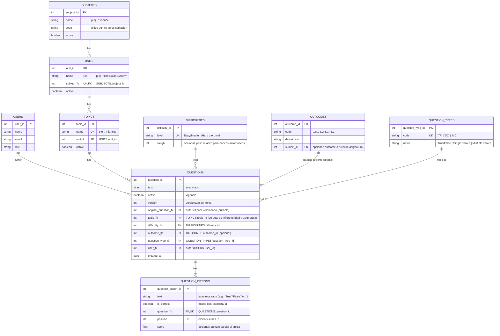

# Banco de preguntas – Análisis del MER

[Volver](../README.md)

> El **Banco de Preguntas** centraliza ítems reutilizables y los alinea con la jerarquía curricular. El diseño prioriza **3FN**, **consistencia pedagógica** (tipos de pregunta y outcomes) y **trazabilidad** (versionado e historial).

---

## Modelo conceptual (resumen)

- **Users**: autores/propietarios de preguntas.
- **Subjects → Units → Topics**: jerarquía curricular.
- **QuestionTypes**: catálogo de tipos (`TF`, `SC`, `MC`).
- **Difficulties**: catálogo de dificultad (y peso opcional).
- **Outcomes**: resultados de aprendizaje (alineación curricular).
- **Questions**: ítems; referencia a *Topic*, tipo, dificultad, outcome y autor; con versionado.
- **QuestionOptions**: alternativas por pregunta (incluye TF/SC/MC) y marca de correctas.

> La **pregunta** referencia solo al **Topic**; a partir de ahí se **infieren** Unit y Subject (evitando redundancia y cumpliendo 3FN).

---

## Especificación de Entidades y Atributos

> Convenciones: **tablas en inglés (plural)**, **campos en inglés (singular)**, **PK = `$table_id`**, **FK = `$table_fk`**. Tipos/largos propuestos para PostgreSQL.

### 1) `users` — *Autores y administradores*
**Descripción extendida:** Personas con acceso que **crean** y **mantienen** preguntas. Se usa para trazabilidad de autoría.

| Campo      | Largo       | Descripción                           | Restricciones           | Clave |
|------------|-------------|---------------------------------------|-------------------------|-------|
| user_id    | BIGSERIAL   | Identificador del usuario             | NOT NULL                | PK    |
| name       | TEXT        | Nombre completo                       | NOT NULL                | -     |
| email      | TEXT        | Correo único                          | NOT NULL, UNIQUE        | -     |
| role       | TEXT        | Rol (Teacher/Coordinator/Admin, etc.) | NOT NULL                | -     |
| created_at | TIMESTAMPTZ | Fecha/hora de creación                | NOT NULL, DEFAULT now() | -     |
| updated_at | TIMESTAMPTZ | Fecha/hora de última modificación     | NULL                    | -     |
| updated_by | BIGINT      | Usuario que realizó la última modificación | FK → `users.user_id` ON DELETE SET NULL | FK |
| deleted_at | TIMESTAMPTZ | Fecha/hora de eliminación (soft delete) | NULL                  | -     |
| deleted_by | BIGINT      | Usuario que realizó la eliminación    | FK → `users.user_id` ON DELETE SET NULL | FK |

> **Soft delete:** Cuando `deleted_at` no es NULL, el registro se considera eliminado lógicamente.

---

### 2) `subjects` — *Asignaturas*
**Descripción extendida:** Nivel curricular más alto (p.ej., *Science*). Aglutina unidades y tópicos.

| Campo      | Largo       | Descripción                  | Restricciones             | Clave |
|------------|-------------|------------------------------|---------------------------|-------|
| subject_id | BIGSERIAL   | Identificador de asignatura  | NOT NULL                  | PK    |
| name       | TEXT        | Nombre                       | NOT NULL                  | -     |
| code       | VARCHAR(64) | Código único                 | NOT NULL, UNIQUE          | -     |
| active     | BOOLEAN     | Vigencia                     | NOT NULL, DEFAULT TRUE    | -     |
| created_at | TIMESTAMPTZ | Fecha/hora de creación       | NOT NULL, DEFAULT now()   | -     |
| created_by | BIGINT      | Usuario que creó el registro | NOT NULL, FK → `users.user_id` ON DELETE RESTRICT | FK |
| updated_at | TIMESTAMPTZ | Fecha/hora de última modificación | NULL                | -     |
| updated_by | BIGINT      | Usuario que realizó la última modificación | FK → `users.user_id` ON DELETE SET NULL | FK |
| deleted_at | TIMESTAMPTZ | Fecha/hora de eliminación (soft delete) | NULL          | -     |
| deleted_by | BIGINT      | Usuario que realizó la eliminación | FK → `users.user_id` ON DELETE SET NULL | FK |

> **Soft delete:** Cuando `deleted_at` no es NULL, el registro se considera eliminado lógicamente.

---

### 3) `units` — *Unidades*
**Descripción extendida:** División temática dentro de una asignatura (p.ej., *The Solar System*). Evita duplicados por asignatura.

| Campo      | Largo       | Descripción                   | Restricciones                                           | Clave |
|------------|-------------|-------------------------------|---------------------------------------------------------|-------|
| unit_id    | BIGSERIAL   | Identificador de unidad       | NOT NULL                                                | PK    |
| name       | TEXT        | Nombre de unidad              | NOT NULL                                                | -     |
| subject_fk | BIGINT      | Asignatura a la que pertenece | NOT NULL, FK → `subjects.subject_id` ON DELETE RESTRICT | FK    |
| active     | BOOLEAN     | Vigencia                      | NOT NULL, DEFAULT TRUE                                  | -     |
| created_at | TIMESTAMPTZ | Fecha/hora de creación        | NOT NULL, DEFAULT now()                                 | -     |
| created_by | BIGINT      | Usuario que creó el registro  | NOT NULL, FK → `users.user_id` ON DELETE RESTRICT      | FK    |
| updated_at | TIMESTAMPTZ | Fecha/hora de última modificación | NULL                                            | -     |
| updated_by | BIGINT      | Usuario que realizó la última modificación | FK → `users.user_id` ON DELETE SET NULL | FK |
| deleted_at | TIMESTAMPTZ | Fecha/hora de eliminación (soft delete) | NULL                                  | -     |
| deleted_by | BIGINT      | Usuario que realizó la eliminación | FK → `users.user_id` ON DELETE SET NULL    | FK    |

> **Regla:** `UNIQUE (subject_fk, name)`.  
> **Soft delete:** Cuando `deleted_at` no es NULL, el registro se considera eliminado lógicamente.

---

### 4) `topics` — *Tópicos*
**Descripción extendida:** Subtema específico dentro de una unidad (p.ej., *Planets*). Evita duplicados por unidad.

| Campo      | Largo       | Descripción               | Restricciones                                     | Clave |
|------------|-------------|---------------------------|---------------------------------------------------|-------|
| topic_id   | BIGSERIAL   | Identificador de tópico   | NOT NULL                                          | PK    |
| name       | TEXT        | Nombre del tópico         | NOT NULL                                          | -     |
| unit_fk    | BIGINT      | Unidad a la que pertenece | NOT NULL, FK → `units.unit_id` ON DELETE RESTRICT | FK    |
| active     | BOOLEAN     | Vigencia                  | NOT NULL, DEFAULT TRUE                            | -     |
| created_at | TIMESTAMPTZ | Fecha/hora de creación    | NOT NULL, DEFAULT now()                           | -     |
| created_by | BIGINT      | Usuario que creó el registro | NOT NULL, FK → `users.user_id` ON DELETE RESTRICT | FK |
| updated_at | TIMESTAMPTZ | Fecha/hora de última modificación | NULL                                      | -     |
| updated_by | BIGINT      | Usuario que realizó la última modificación | FK → `users.user_id` ON DELETE SET NULL | FK |
| deleted_at | TIMESTAMPTZ | Fecha/hora de eliminación (soft delete) | NULL                            | -     |
| deleted_by | BIGINT      | Usuario que realizó la eliminación | FK → `users.user_id` ON DELETE SET NULL | FK |

> **Regla:** `UNIQUE (unit_fk, name)`.  
> **Soft delete:** Cuando `deleted_at` no es NULL, el registro se considera eliminado lógicamente.

---

### 5) `question_types` — *Tipos de pregunta*
**Descripción extendida:** Catálogo fijo que determina las **reglas de opciones** y **corrección**.

| Campo            | Largo       | Descripción               | Restricciones    | Clave |
|------------------|-------------|---------------------------|------------------|-------|
| question_type_id | BIGSERIAL   | Identificador del tipo    | NOT NULL         | PK    |
| code             | VARCHAR(8)  | Código (`TF`, `SC`, `MC`) | NOT NULL, UNIQUE | -     |
| name             | VARCHAR(64) | Descripción legible       | NOT NULL         | -     |

> Reglas de negocio: **TF** (2 opciones, 1 correcta), **SC** (≥2, 1 correcta), **MC** (≥2, ≥1 correcta).

---

### 6) `difficulties` — *Dificultades*
**Descripción extendida:** Clasificación de dificultad del ítem, con un **peso** opcional para construir bancos automáticos.

| Campo         | Largo       | Descripción                    | Restricciones                         | Clave |
|---------------|-------------|--------------------------------|---------------------------------------|-------|
| difficulty_id | BIGSERIAL   | Identificador de dificultad    | NOT NULL                              | PK    |
| level         | VARCHAR(32) | Nivel (Easy/Medium/Hard, etc.) | NOT NULL, UNIQUE                      | -     |
| weight        | INTEGER     | Peso relativo (opcional)       | CHECK (weight IS NULL OR weight >= 0) | -     |

---

### 7) `outcomes` — *Resultados de aprendizaje*
**Descripción extendida:** Declaraciones de logro curricular (p.ej., *SCI-5.2*), para trazabilidad pedagógica y reportes.

| Campo       | Largo       | Descripción                        | Restricciones                                 | Clave |
|-------------|-------------|------------------------------------|-----------------------------------------------|-------|
| outcome_id  | BIGSERIAL   | Identificador del outcome          | NOT NULL                                      | PK    |
| code        | VARCHAR(64) | Código único (p.ej., *LO-SCI-5.2*) | NOT NULL, UNIQUE                              | -     |
| description | TEXT        | Descripción del resultado          | NOT NULL                                      | -     |
| subject_fk  | BIGINT      | (Opc.) Asignatura asociada         | FK → `subjects.subject_id` ON DELETE RESTRICT | FK    |
| active      | BOOLEAN     | Vigencia del resultado de aprendizaje | NOT NULL, DEFAULT TRUE                     | -     |
| created_at  | TIMESTAMPTZ | Fecha/hora de creación             | NOT NULL, DEFAULT now()                       | -     |
| created_by  | BIGINT      | Usuario que creó el registro       | NOT NULL, FK → `users.user_id` ON DELETE RESTRICT | FK |
| updated_at  | TIMESTAMPTZ | Fecha/hora de última modificación  | NULL                                          | -     |
| updated_by  | BIGINT      | Usuario que realizó la última modificación | FK → `users.user_id` ON DELETE SET NULL | FK |
| deleted_at  | TIMESTAMPTZ | Fecha/hora de eliminación (soft delete) | NULL                                     | -     |
| deleted_by  | BIGINT      | Usuario que realizó la eliminación | FK → `users.user_id` ON DELETE SET NULL       | FK    |

> **Soft delete:** Cuando `deleted_at` no es NULL, el registro se considera eliminado lógicamente.

---

### 8) `questions` — *Preguntas (ítems)*
**Descripción extendida:** Unidad central del banco. Referencia **Topic**, **Tipo**, **Dificultad**, (opc.) **Outcome** y **Autor**. Soporta **versionado** y **vigencia**.

| Campo                | Largo       | Descripción                                    | Restricciones                                                       | Clave |
|----------------------|-------------|------------------------------------------------|---------------------------------------------------------------------|-------|
| question_id          | BIGSERIAL   | Identificador de la pregunta                   | NOT NULL                                                            | PK    |
| text                 | TEXT        | Enunciado                                      | NOT NULL                                                            | -     |
| active               | BOOLEAN     | Vigencia del ítem                              | NOT NULL, DEFAULT TRUE                                              | -     |
| version              | INTEGER     | Versión del ítem                               | NOT NULL, DEFAULT 1, CHECK (version >= 1)                           | -     |
| original_question_fk | BIGINT      | (Opc.) Referencia a la versión raíz (auto-ref) | FK → `questions.question_id` ON DELETE RESTRICT                     | FK    |
| topic_fk             | BIGINT      | Tópico al que pertenece                        | NOT NULL, FK → `topics.topic_id` ON DELETE RESTRICT                 | FK    |
| difficulty_fk        | BIGINT      | Dificultad                                     | NOT NULL, FK → `difficulties.difficulty_id` ON DELETE RESTRICT      | FK    |
| outcome_fk           | BIGINT      | (Opc.) Outcome asociado                        | FK → `outcomes.outcome_id` ON DELETE SET NULL                       | FK    |
| question_type_fk     | BIGINT      | Tipo de pregunta                               | NOT NULL, FK → `question_types.question_type_id` ON DELETE RESTRICT | FK    |
| user_fk              | BIGINT      | Autor (creador de esta versión)               | NOT NULL, FK → `users.user_id` ON DELETE RESTRICT                   | FK    |
| created_at           | TIMESTAMPTZ | Fecha/hora de creación                         | NOT NULL, DEFAULT now()                                             | -     |
| updated_at           | TIMESTAMPTZ | Fecha/hora de última modificación              | NULL                                                                | -     |
| updated_by           | BIGINT      | Usuario que realizó la última modificación     | FK → `users.user_id` ON DELETE SET NULL                             | FK    |
| deleted_at           | TIMESTAMPTZ | Fecha/hora de eliminación (soft delete)        | NULL                                                                | -     |
| deleted_by           | BIGINT      | Usuario que realizó la eliminación             | FK → `users.user_id` ON DELETE SET NULL                             | FK    |

> **Índice recomendado:** `(topic_fk, active)` para búsquedas por cápsula curricular y vigencia.  
> **Nota importante:** `user_fk` representa el **autor/creador** de esta versión específica. Para versionado, cada nueva versión registra quién la creó. Las modificaciones in-place (no recomendadas) se registran en `updated_by`.  
> **Soft delete:** Cuando `deleted_at` no es NULL, el registro se considera eliminado lógicamente.

---

### 9) `question_options` — *Alternativas por pregunta*
**Descripción extendida:** Almacena **todas** las opciones de cada pregunta, incluyendo TF (True/False). Permite **crédito parcial** con `score` (útil en MC) y define la(s) **correcta(s)**.

| Campo              | Largo        | Descripción                    | Restricciones                                            | Clave |
|--------------------|--------------|--------------------------------|----------------------------------------------------------|-------|
| question_option_id | BIGSERIAL    | Identificador de la opción     | NOT NULL                                                 | PK    |
| text               | TEXT         | Texto/etiqueta de la opción    | NOT NULL                                                 | -     |
| is_correct         | BOOLEAN      | Marca si la opción es correcta | NOT NULL, DEFAULT FALSE                                  | -     |
| position           | INTEGER      | Orden visual (1..n)            | NOT NULL, CHECK (position >= 1)                          | -     |
| score              | NUMERIC(6,3) | Crédito parcial (opcional)     | CHECK (score IS NULL OR score >= 0)                      | -     |
| question_fk        | BIGINT       | Pregunta a la que pertenece    | NOT NULL, FK → `questions.question_id` ON DELETE CASCADE | FK    |

> **Reglas de unicidad:**
> - `UNIQUE (question_fk, text)` (evita duplicar textos dentro de la misma pregunta)
> - `UNIQUE (question_fk, position)` (posiciones estables)

---

## Integridad y reglas de negocio (síntesis)

- **Jerarquía curricular sin duplicidad**:
    - `UNIQUE (subject_fk, name)` en **Units**; `UNIQUE (unit_fk, name)` en **Topics**.
- **Tipos de pregunta y cardinalidad de opciones**:
    - **TF**: exactamente **2** opciones y **1** correcta.
    - **SC**: **≥2** opciones y **1** correcta.
    - **MC**: **≥2** opciones y **≥1** correcta.
    - *Implementación recomendada:* **constraint triggers DEFERRABLE** sobre `question_options`, que validan al **COMMIT** (útil en cargas en lote).
- **Versionado de preguntas**:
    - `original_question_fk` permite mantener la línea histórica de un ítem cuando se publica una nueva versión (la política de cuándo versionar vive en MS).
- **Vigencia**:
    - `active` permite ocultar ítems sin borrarlos, preservando referencias históricas.
- **Auditoría soft (Soft Audit)**:
    - Todas las tablas principales incluyen campos de auditoría: `created_at`, `created_by`, `updated_at`, `updated_by`, `deleted_at`, `deleted_by`.
    - **Soft delete**: Los registros nunca se eliminan físicamente; se marcan con `deleted_at` y `deleted_by`.
    - **Trazabilidad completa**: Se registra quién y cuándo realizó cada operación (creación, modificación, eliminación lógica).
    - **Nota sobre `questions`**: El campo `user_fk` representa el autor/creador de cada versión. Para ediciones in-place (no recomendadas), se usa `updated_by`.

---

## Auditoría Soft (Soft Audit)

El sistema implementa **auditoría soft** mediante campos de trazabilidad en todas las tablas principales:

### Campos de auditoría implementados

| Campo        | Tipo        | Propósito                                        | Restricciones |
|--------------|-------------|--------------------------------------------------|---------------|
| `created_at` | TIMESTAMPTZ | Fecha/hora de creación del registro              | NOT NULL, DEFAULT now() |
| `created_by` | BIGINT      | Usuario que creó el registro                     | NOT NULL (salvo en `questions` que usa `user_fk`) |
| `updated_at` | TIMESTAMPTZ | Fecha/hora de última modificación                | NULL (NULL = nunca modificado) |
| `updated_by` | BIGINT      | Usuario que realizó la última modificación       | NULL (NULL = nunca modificado) |
| `deleted_at` | TIMESTAMPTZ | Fecha/hora de eliminación lógica (soft delete)   | NULL (NULL = no eliminado) |
| `deleted_by` | BIGINT      | Usuario que realizó la eliminación lógica        | NULL (NULL = no eliminado) |

### Tablas con auditoría completa

- ✅ `users`
- ✅ `subjects`
- ✅ `units`
- ✅ `topics`
- ✅ `outcomes`
- ✅ `questions` (nota: usa `user_fk` como `created_by`)
- ⚠️ `question_options` — Sin auditoría propia; hereda trazabilidad de la pregunta padre

### Tablas sin auditoría (catálogos estáticos)

- `question_types` — Catálogo fijo, rara vez cambia
- `difficulties` — Catálogo de configuración inicial

### Soft Delete (Eliminación Lógica)

En lugar de eliminar físicamente registros (`DELETE FROM table`), se marcan como eliminados:

```sql
-- En lugar de:
-- DELETE FROM questions WHERE question_id = 123;

-- Se hace:
UPDATE questions
SET deleted_at = now(),
    deleted_by = :current_user_id
WHERE question_id = 123;
```

**Ventajas:**
- ✅ **Trazabilidad completa**: Se sabe quién y cuándo eliminó un registro
- ✅ **Recuperación**: Los datos se pueden "deshacer" fácilmente
- ✅ **Integridad referencial preservada**: Las relaciones FK siguen siendo válidas
- ✅ **Auditoría histórica**: Los reportes pueden incluir datos eliminados si es necesario

### Consultas considerando soft delete

Para obtener solo registros activos (no eliminados):

```sql
-- Listar preguntas no eliminadas
SELECT * FROM questions
WHERE deleted_at IS NULL
  AND active = true;

-- Listar todas las preguntas (incluidas eliminadas)
SELECT *,
       CASE WHEN deleted_at IS NOT NULL THEN 'DELETED' ELSE 'ACTIVE' END as status
FROM questions;
```

### Triggers automáticos recomendados

Para automatizar el llenado de campos de auditoría:

```sql
-- Ejemplo: Trigger para updated_at/updated_by
CREATE OR REPLACE FUNCTION update_audit_fields()
RETURNS TRIGGER AS $$
BEGIN
    NEW.updated_at = now();
    NEW.updated_by = current_setting('app.current_user_id')::BIGINT;
    RETURN NEW;
END;
$$ LANGUAGE plpgsql;

-- Aplicar a cada tabla con auditoría
CREATE TRIGGER trg_questions_update_audit
    BEFORE UPDATE ON questions
    FOR EACH ROW
    EXECUTE FUNCTION update_audit_fields();
```

### Consideraciones de implementación

1. **A nivel de aplicación**: Configurar el contexto del usuario actual en cada transacción:
   ```sql
   SET LOCAL app.current_user_id = '123';
   ```

2. **Consultas por defecto**: Siempre filtrar por `deleted_at IS NULL` en consultas normales

3. **Índices**: Agregar índices para soft delete:
   ```sql
   CREATE INDEX idx_questions_deleted ON questions (deleted_at) WHERE deleted_at IS NOT NULL;
   CREATE INDEX idx_subjects_deleted ON subjects (deleted_at) WHERE deleted_at IS NOT NULL;
   ```

4. **Vistas**: Crear vistas que filtren automáticamente los registros eliminados:
   ```sql
   CREATE VIEW active_questions AS
   SELECT * FROM questions WHERE deleted_at IS NULL;
   ```

### Futuro: Auditoría centralizada

Esta implementación de auditoría soft es el **primer paso**. En el futuro se puede complementar con:
- **Tabla de auditoría centralizada** (`audit_log`) para registrar todos los cambios con valores anteriores/nuevos
- **Event sourcing** para reconstruir el estado completo en cualquier punto del tiempo
- **Integración con sistemas externos** de auditoría y cumplimiento normativo

---

## Índices sugeridos

- `questions (topic_fk, active)` → listados por cápsula/vigencia.
- `question_options (question_fk)` → soporte a validaciones/corrección.
- (Opc.) FTS: `text_tsv` con índice GIN si la búsqueda textual es crítica.

---

## Trazabilidad clave

- **Curricular:** `questions.topic_fk → topics.unit_fk → units.subject_fk`.
- **Pedagógica:** `questions.outcome_fk` vincula el ítem con un resultado de aprendizaje para reportes.
- **Autoría:** `questions.user_fk` + `created_at`.
- **Histórica:** `questions.original_question_fk` para navegar versiones.

---

## Flujos típicos (alto nivel)

1. **Autoría**: crear `question` (tipo, dificultad, outcome opcional) + `question_options`.
2. **Validación**: triggers garantizan cardinalidad de opciones según `question_types`.
3. **Versionado** (cuando aplica): clonar a nueva `version`, enlazar `original_question_fk`, ajustar opciones.
4. **Publicación/uso**: evaluaciones referencian `questions` (y *congelan* opciones en su propio dominio, si se usa `evaluation_options` en Evaluations).

---

## Beneficios del diseño

- **3FN estricta**: sin redundancia curricular ni repetición de metadatos.
- **Modelo unificado de opciones**: mismo flujo para TF/SC/MC (sin excepciones ad hoc).
- **Escalable y robusto**: constraints + triggers garantizan invariantes en cualquier canal de entrada.
- **Alineación curricular y analítica**: outcomes y jerarquía habilitan reportes de logro y cobertura.
- **Trazabilidad y mantenimiento**: versionado y vigencia facilitan evolución del banco sin perder historia.

---

## Extensiones futuras (cuando se requieran)

- **Tags/Metadatos** adicionales de preguntas (p.ej., tiempo estimado, recursos asociados).
- **Plantillas** para ítems parametrizados (cloze, matching, etc.).
- **Banco multi-idioma** (tabla de localización de `text`/`options`).
- **Desempeño empírico** de ítems (dificultad/discriminación calculadas desde resultados).

---

## Ejemplo de trazabilidad curricular

```
Subject: Science
└── Unit: The Solar System
    └── Topic: Planets
        └── Question: "How many planets are in the Solar System?"
            └── Outcome: SCI-5.2 "Identify and count the planets in the Solar System"
```

## MER

- [Script de creación PostgreSQL](DDL.sql)
- [Triggers y funciones](TRIGGERS.sql)
- [Datos de prueba](DATA_TEST.sql)



[Subir](#banco-de-preguntas--análisis-del-mer)