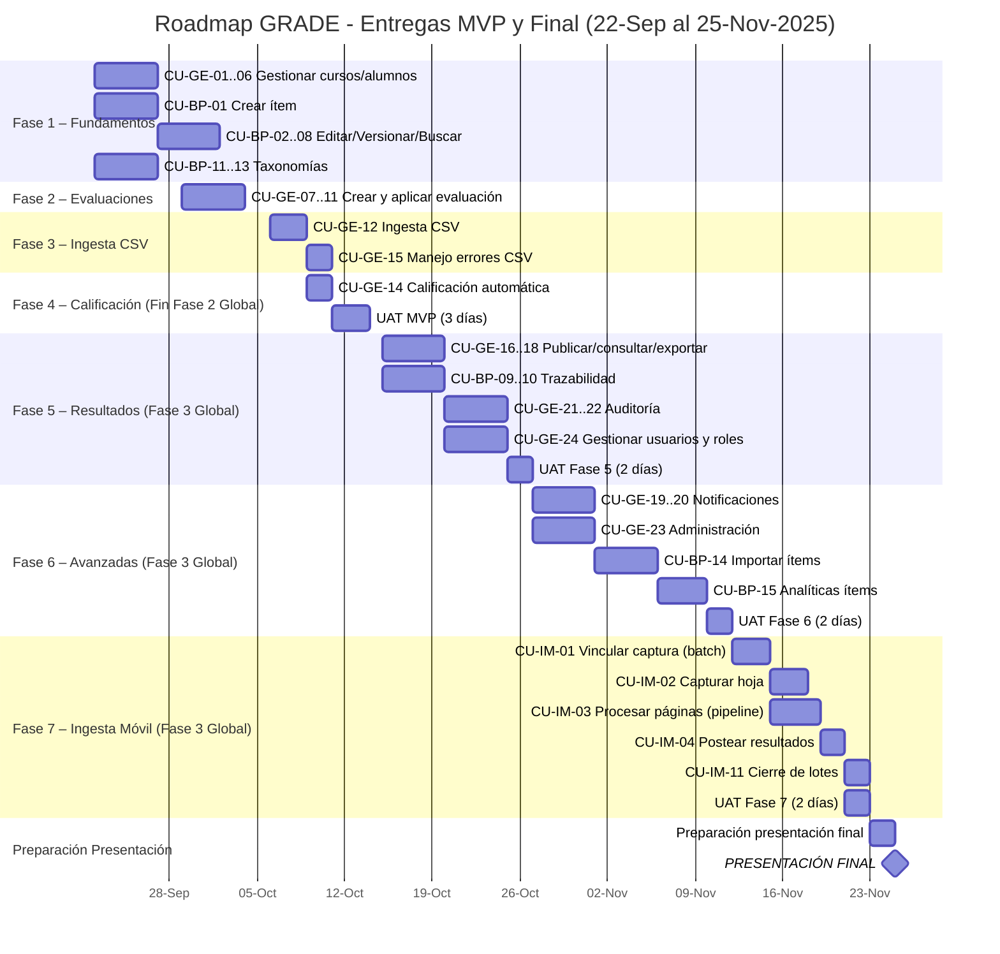

# Priorización de Casos de Uso (CU) en GRADE por Dependencias

Para planificar la implementación de GRADE, conviene seguir el orden sugerido por la documentación oficial, basándose en **dependencias funcionales**. A continuación se describe la secuencia recomendada de desarrollo de los **escenarios** y **CUs** (Casos de Uso), desde los fundamentales hasta los avanzados, indicando qué puede hacerse en paralelo y qué debe esperar a componentes previos.

---

## Matriz de Completitud de Casos de Uso por Fase

| #  | Caso de Uso                                             | Fase 1 | Fase 2 | Fase 3 | Fase 4 | Fase 5 | Fase 6 | Fase 7 |
|----|---------------------------------------------------------|:------:|:------:|:------:|:------:|:------:|:------:|:------:|
| 1  | CU-GE-01 Crear curso                                    |   ✅    |        |        |        |        |        |        |
| 2  | CU-GE-02 Editar curso                                   |   ✅    |        |        |        |        |        |        |
| 3  | CU-GE-03 Dar de baja curso                              |   ✅    |        |        |        |        |        |        |
| 4  | CU-GE-04 Registrar alumno manualmente                   |   ✅    |        |        |        |        |        |        |
| 5  | CU-GE-05 Importar alumnos desde CSV                     |   ✅    |        |        |        |        |        |        |
| 6  | CU-GE-06 Editar / dar de baja alumno                    |   ✅    |        |        |        |        |        |        |
| 7  | CU-BP-01 Crear ítem nuevo en el Banco de Preguntas      |   ✅    |        |        |        |        |        |        |
| 8  | CU-BP-02 Versionar ítem                                 |   ✅    |        |        |        |        |        |        |
| 9  | CU-BP-03 Clonar ítem                                    |   ✅    |        |        |        |        |        |        |
| 10 | CU-BP-04 Editar ítem (No recomendado)                   |   ✅    |        |        |        |        |        |        |
| 11 | CU-BP-05 Retirar ítem                                   |   ✅    |        |        |        |        |        |        |
| 12 | CU-BP-06 Reactivar ítem                                 |   ✅    |        |        |        |        |        |        |
| 13 | CU-BP-07 Buscar ítems                                   |   ✅    |        |        |        |        |        |        |
| 14 | CU-BP-08 Seleccionar ítems                              |   ✅    |        |        |        |        |        |        |
| 15 | CU-BP-11 Crear elemento de taxonomía curricular         |   ✅    |        |        |        |        |        |        |
| 16 | CU-BP-12 Editar elemento de taxonomía curricular        |   ✅    |        |        |        |        |        |        |
| 17 | CU-BP-13 Eliminar elemento de taxonomía curricular      |   ✅    |        |        |        |        |        |        |
| 18 | CU-GE-07 Crear evaluación en borrador                   |        |   ✅    |        |        |        |        |        |
| 19 | CU-GE-08 Seleccionar ítems del Banco para evaluación    |        |   ✅    |        |        |        |        |        |
| 20 | CU-GE-09 Generar entregable con identificador único     |        |   ✅    |        |        |        |        |        |
| 21 | CU-GE-10 Asociar evaluación a curso                     |        |   ✅    |        |        |        |        |        |
| 22 | CU-GE-11 Aplicar evaluación y registrar                 |        |   ✅    |        |        |        |        |        |
| 23 | CU-GE-12 Cargar respuestas desde archivo CSV            |        |        |   ✅    |        |        |        |        |
| 24 | CU-GE-15 Manejar errores de ingesta (OCR/CSV)           |        |        |   ✅    |        |        |        |        |
| 25 | CU-GE-14 Calificación automática de evaluación          |        |        |        |   ✅    |        |        |        |
| 26 | CU-GE-16 Publicar resultados de evaluación              |        |        |        |        |   ✅    |        |        |
| 27 | CU-GE-17 Consultar resultados y estadísticas            |        |        |        |        |   ✅    |        |        |
| 28 | CU-GE-18 Exportar resultados en CSV o PDF               |        |        |        |        |   ✅    |        |        |
| 29 | CU-BP-09 Consultar trazabilidad de ítem                 |        |        |        |        |   ✅    |        |        |
| 30 | CU-BP-10 Generar reporte de trazabilidad                |        |        |        |        |   ✅    |        |        |
| 31 | CU-GE-21 Consultar historial de auditoría               |        |        |        |        |   ✅    |        |        |
| 32 | CU-GE-22 Exportar historial de auditoría                |        |        |        |        |   ✅    |        |        |
| 33 | CU-GE-24 Gestionar usuarios y roles                     |        |        |        |        |   ✅    |        |        |
| 34 | CU-GE-19 Enviar notificaciones de hitos                 |        |        |        |        |        |   ✅    |        |
| 35 | CU-GE-20 Configurar preferencias de notificación        |        |        |        |        |        |   ✅    |        |
| 36 | CU-GE-23 Configurar parámetros globales                 |        |        |        |        |        |   ✅    |        |
| 37 | CU-BP-14 Importar ítems desde planilla CSV              |        |        |        |        |        |   ✅    |        |
| 38 | CU-BP-15 Consultar analítica avanzada de ítems          |        |        |        |        |        |   ✅    |        |
| 39 | CU-IM-01 Vincular captura con evaluación                |        |        |        |        |        |        |   ✅    |
| 40 | CU-IM-02 Capturar hoja de respuestas                    |        |        |        |        |        |        |   ✅    |
| 41 | CU-IM-03 Procesar y validar páginas capturadas          |        |        |        |        |        |        |   ✅    |
| 42 | CU-IM-04 Postear resultados de ingesta a calificaciones |        |        |        |        |        |        |   ✅    |
| 43 | CU-IM-11 Cierre y consolidación de lotes                |        |        |        |        |        |        |   ✅    |

### Resumen por Fase

- **Fase 1 (Fundamentos)**: 17 CUs - Base del sistema (Cursos, Alumnos, Banco de Preguntas, Taxonomías)
- **Fase 2 (Evaluaciones)**: 5 CUs - Creación y programación
- **Fase 3 (Ingesta CSV)**: 2 CUs - Carga de respuestas
- **Fase 4 (Calificación)**: 1 CU - Corrección automática
- **Fase 5 (Resultados)**: 9 CUs - Publicación, trazabilidad y gestión de usuarios
- **Fase 6 (Avanzadas)**: 5 CUs - Funcionalidades complementarias
- **Fase 7 (Ingesta Móvil)**: 5 CUs - Canal móvil

**Total**: 44 Casos de Uso

**Hito MVP (Fase 2 Global)**: Completar Fases 1-4 (25 CUs) 🎯  
**Hito Entrega Final (Fase 3 Global)**: Completar Fases 5-7 (19 CUs adicionales) 🏁

### CUs excluidos del roadmap (OUT-OF-SCOPE)

Los siguientes CUs existen en el repositorio pero están fuera del alcance actual:

**Roles y Permisos:**
- **RF7**: Gestión de roles y permisos (transversal - se implementará de forma básica en CU-GE-24)

**Integraciones Externas:**
- **CU-GE-25**: Gestionar credenciales de integración
- **CU-GE-26**: Consumir API externa de GRADE

**Ingesta Móvil:**
- **CU-GE-13**: Recibir y procesar lotes desde Ingesta móvil (funcionalidad cubierta por CU-IM-04)
- **CU-IM-05**: Operación offline y sincronización automática
- **CU-IM-06**: Monitoreo en tiempo real y notificaciones inteligentes  
- **CU-IM-07**: Gestión de dispositivos móviles
- **CU-IM-08**: Resolución manual de identidades
- **CU-IM-09**: Administración de anomalías y excepciones
- **CU-IM-10**: Configuración de templates de evaluación
- **CU-IM-12**: Ingesta por CSV/Web (canal alternativo)

---

# Roadmap de Ejecución de CUs (GRADE)
_Período total: 22 de septiembre – 25 de noviembre (9 semanas)_

**Entrega MVP (Fases 1-4 CUs / Fase 2 Global)**: 22 de septiembre – 14 de octubre (3 semanas)  
**Entrega Final (Fases 5-7 CUs / Fase 3 Global)**: 15 de octubre – 23 de noviembre (6 semanas)  
**Presentación Final**: 25 de noviembre de 2025

---

## Hitos clave

### Entrega MVP (Fases 1-4 CUs / Fase 2 Global del Proyecto)
- **22-Sep-2025**: Inicio desarrollo
- **29-Sep-2025**: Fin Fase 1 (Fundamentos) - 17 CUs ✓
- **04-Oct-2025**: Fin Fase 2 (Evaluaciones) - 5 CUs ✓
- **08-Oct-2025**: Fin Fase 3 (Ingesta CSV) - 2 CUs ✓
- **10-Oct-2025**: Fin Fase 4 (Calificación) - 1 CU ✓
- **14-Oct-2025**: **🎯 FIN FASE 2 GLOBAL / MVP COMPLETO** (25 CUs)

### Entrega Final (Fases 5-7 CUs / Fase 3 Global del Proyecto)
- **15-Oct-2025**: **Inicio Fase 3 Global del Proyecto**
- **27-Oct-2025**: Fin Fase 5 (Resultados y Trazabilidad) - 7 CUs
- **12-Nov-2025**: Fin Fase 6 (Funcionalidades Avanzadas) - 5 CUs
- **23-Nov-2025**: Fin Fase 7 (Ingesta Móvil) - 5 CUs adicionales
- **23-Nov-2025**: **🏁 FIN FASE 3 GLOBAL / ENTREGA FINAL** (42 CUs totales)
- **25-Nov-2025**: **📊 PRESENTACIÓN FINAL**

**Total general**: 42 CUs implementados en 9 semanas (63 días)
- **MVP (Fase 2 Global)**: 25 CUs en 3 semanas
- **Entrega Final (Fase 3 Global)**: 17 CUs adicionales en 6 semanas

---

# Tabla de Priorización de Casos de Uso (GRADE)

| Fase  | Escenario / CU | Descripción breve | Dependencias |
|-------|----------------|------------------|--------------|
| **1** Fundamentos | **S-GE-01** (CU-GE-01, 02, 03) | Crear curso / Editar curso / Dar de baja curso | Ninguna |
|       | **S-GE-02** (CU-GE-04, 05, 06) | Registrar alumno manualmente / Importar alumnos desde CSV / Editar o dar de baja alumno | Ninguna |
|       | **S-BP-01** (CU-BP-01) | Crear ítem nuevo en el Banco de Preguntas | Ninguna |
|       | **S-BP-02** (CU-BP-02, 03, 04) | Versionar ítem / Clonar ítem / Editar ítem (No recomendado) | CU-BP-01 |
|       | **S-BP-03** (CU-BP-05, 06) | Retirar ítem / Reactivar ítem | CU-BP-01 |
|       | **S-BP-04** (CU-BP-07, 08) | Buscar ítems / Seleccionar ítems | CU-BP-01..06 |
|       | **S-BP-06** (CU-BP-11, 12, 13) | Crear elemento de taxonomía curricular / Editar elemento / Eliminar elemento | Ninguna |
| **2** Evaluaciones & Entregables | **S-GE-03** (CU-GE-07, 08) | Crear evaluación en borrador / Seleccionar ítems del Banco para evaluación | Cursos, alumnos e ítems disponibles |
|       | **S-GE-04** (CU-GE-09) | Generar entregable con identificador único | CU-GE-07, 08 |
|       | **S-GE-05** (CU-GE-10) | Asociar evaluación a curso | CU-GE-07 |
|       | **S-GE-06** (CU-GE-11) | Aplicar evaluación y registrar | CU-GE-10 |
| **3** Ingesta CSV | **S-GE-07** (CU-GE-12) | Cargar respuestas desde archivo CSV | CU-GE-11 |
|       | **S-GE-10** (CU-GE-15) | Manejar errores de ingesta (OCR/CSV) | CU-GE-12 |
| **4** Calificación | **S-GE-09** (CU-GE-14) | Calificación automática de evaluación | CU-GE-12 |
| **5** Resultados & Trazabilidad | **S-GE-11** (CU-GE-16, 17) | Publicar resultados de evaluación / Consultar resultados y estadísticas | CU-GE-14 |
|       | **S-GE-12** (CU-GE-18) | Exportar resultados en CSV o PDF | CU-GE-16 |
|       | **S-BP-05** (CU-BP-09, 10) | Consultar trazabilidad de ítem / Generar reporte de trazabilidad | CU-GE-16+ |
|       | **S-GE-14** (CU-GE-21, 22) | Consultar historial de auditoría / Exportar historial de auditoría | Todos los anteriores |
|       | **S-GE-15** (CU-GE-24) | Gestionar usuarios y roles | Todos los anteriores |
| **6** Funcionalidades Avanzadas | **S-GE-13** (CU-GE-19, 20) | Enviar notificaciones de hitos / Configurar preferencias de notificación | CU-GE-16+ |
|       | **S-GE-15** (CU-GE-23) | Configurar parámetros globales | Todos los anteriores |
|       | **S-BP-07** (CU-BP-14) | Importar ítems desde planilla CSV | CU-BP-01+ |
|       | **S-BP-08** (CU-BP-15) | Consultar analítica avanzada de ítems | CU-BP-01+, CU-GE-14+ |
| **7** Ingesta Móvil | **S-IM-01** (CU-IM-01) | Vincular captura con evaluación | CU-GE-09, CU-GE-11 |
|       | **S-IM-02** (CU-IM-02) | Capturar hoja de respuestas | CU-IM-01 |
|       | **S-IM-03** (CU-IM-03) | Procesar y validar páginas capturadas | CU-IM-02 |
|       | **S-IM-04** (CU-IM-04) | Postear resultados de ingesta a calificaciones | CU-IM-03 |
|       | **S-IM-11** (CU-IM-11) | Cierre y consolidación de lotes | CU-IM-04 |

---

## Fase 5 – Publicación de Resultados y Trazabilidad

Finalmente, con las evaluaciones calificadas, se implementan las funciones de **cierre del ciclo** (**RF6** y **RF8**).

- **Publicar y consultar resultados (S-GE-11)**
    - CU-GE-16 Publicar resultados de evaluación
    - CU-GE-17 Consultar resultados y estadísticas
    - CU-GE-18 Exportar resultados en CSV o PDF (S-GE-12)

- **Trazabilidad y auditoría**
    - **S-BP-05** Trazabilidad de ítems (CU-BP-09 Consultar trazabilidad de ítem, CU-BP-10 Generar reporte de trazabilidad)
    - **S-GE-14** Auditoría del sistema (CU-GE-21 Consultar historial de auditoría, CU-GE-22 Exportar historial de auditoría)

- **Gestión de usuarios y roles**
    - **S-GE-15** Gestionar usuarios y roles (CU-GE-24)
    - Implementación básica de gestión de usuarios, roles y permisos necesaria para el sistema

---

