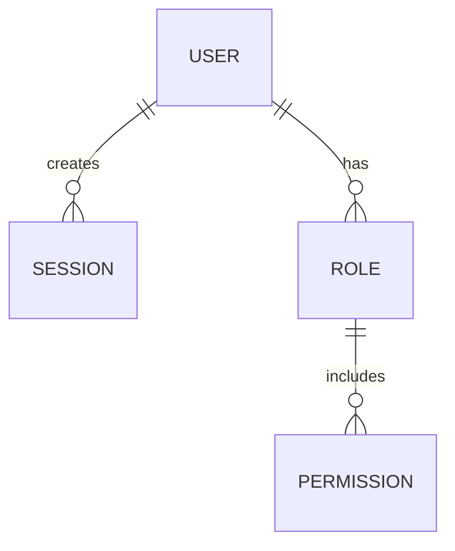

# Guía de Flujo de Trabajo con IA

Cómo trabajar **en la práctica** con Claude (o similar) para generar documentación completa, fase a fase.

---

## Tabla de contenido

- [Flujo general](#flujo-general)
- [Preparación (Día 1)](#preparación-día-1)
- [Discovery (Día 2-3)](#discovery-día-2-3)
- [Requirements (Día 4-5)](#requirements-día-4-5)
- [Design (Día 6-7)](#design-día-6-7)
- [Data Model (Día 8)](#data-model-día-8)
- [Planning (Día 9)](#planning-día-9)
- [Development & más (Día 10+)](#development--más-día-10)
- [Validación y mantenimiento](#validación-y-mantenimiento)
- [Troubleshooting avanzado](#troubleshooting-avanzado)

---

## Flujo General

```
┌─────────────────────────────────────────────────────────┐
│ 1. PREPARAR: Recopila información del producto         │
│    (20-30 min)                                           │
└──────────────────────────┬──────────────────────────────┘
                           ↓
┌─────────────────────────────────────────────────────────┐
│ 2. PROMPT INICIAL: Crea doc de contexto para IA        │
│    (5 min — copiar/editar INSTRUCTIONS-FOR-AI.md)      │
└──────────────────────────┬──────────────────────────────┘
                           ↓
┌─────────────────────────────────────────────────────────┐
│ 3. GENERAR: Pasa prompt + template a Claude            │
│    (1-5 min por doc, esperas la respuesta)              │
└──────────────────────────┬──────────────────────────────┘
                           ↓
┌─────────────────────────────────────────────────────────┐
│ 4. VALIDAR: Revisa checklist, ajusta si es necesario   │
│    (5-15 min por doc)                                   │
└──────────────────────────┬──────────────────────────────┘
                           ↓
┌─────────────────────────────────────────────────────────┐
│ 5. GUARDAR: Acepta doc, renombra de TEMPLATE-* a real  │
│    (1 min)                                              │
└──────────────────────────┬──────────────────────────────┘
                           ↓
┌─────────────────────────────────────────────────────────┐
│ 6. SIGUIENTE: Siguiente fase (repeat 2-5)             │
└─────────────────────────────────────────────────────────┘
```

---

## Preparación (Día 1)

### Paso 1: Recopila información clave

Antes de abrir Claude, prepara estos documentos:

```
📋 INFO PRODUCTO (copiar en un doc de texto)

Nombre: [tu producto]
Problema: [qué problema resuelve, 2-3 oraciones claras]
Usuarios: [quién lo usa, 2-3 perfiles principales]
Mercado: [contexto, competencia, oportunidad]
Restricciones: [limites legales, técnicos, de negocio si existen]
Stack: [Backend, Frontend, BD, Infra — para fases 6+]

Contexto adicional:
- Documentación existente: [¿tienes documentos previos? Links]
- Stakeholders: [quién aprueba qué]
- Timeline: [¿hay deadline?]
- Success metrics: [cómo sabes que ganaste]
```

**Ejemplo práctico para "Keygo"**:

```
Nombre: Keygo
Problema: Equipos de desarrollo pierden 2+ horas/día en gestión
         de sesiones y permisos — no hay single source of truth
Usuarios: 
  - Desarrolladores (construyen features)
  - DevOps/Platform Engineers (mantienen infraestructura)
  - PM/Managers (auditoría, control)
Mercado: Compite con soluciones caseras, scripts ad-hoc, 
         o herramientas genéricas (Vault, etc.) que son muy complejas
Restricciones: Debe integrar con infraestructura existente (K8s, cloud)
Stack: Backend: Go + gRPC, Frontend: React, DB: PostgreSQL, Infra: K8s
```

### Paso 2: Crea estructura local

En tu máquina:

```bash
# Opción 1: Copiar la plantilla completa
cp -r ddd-hexagonal-ai-template/ /tu/proyecto/docs

# Opción 2: Si ya tienes la plantilla, actualiza nombre:
cd ddd-hexagonal-ai-template
# Renombra MACRO-PLAN.md y archivos TEMPLATE-
```

### Paso 3: Prepara tu session con IA

Abre Claude Code o claude.ai. **Importante**: En una sesión de Claude:

1. Crea un documento/conversación llamado `[PRODUCTO]-docs-generation`
2. Pega el "INFO PRODUCTO" arriba como contexto permanente
3. Guarda la conversación para reutilizar contexto

```markdown
# 🎯 CONTEXTO DEL PROYECTO [KEYGO]

[Pegue info-producto aquí]

---

# Documentos a Generar

- [ ] 01-discovery/context-motivation.md
- [ ] 01-discovery/system-vision.md
- [ ] ... (lista todos los documentos que necesitas)

---

# Próximo paso: Discovery
```

---

## Discovery (Día 2-3)

### Documento 1.1: Context & Motivation

**Tarea**: Generar `01-discovery/context-motivation.md`

#### Tu prompt (copiar y adaptar):

```markdown
# Contexto del Producto

[PEGA INFO PRODUCTO aquí]

---

# Tarea

Genera el archivo "01-discovery/context-motivation.md" 
basándote en la plantilla adjunta.

---

# Plantilla

[COPIAR COMPLETO desde TEMPLATE-context-motivation.md]

---

# Requisitos Específicos

## Contenido
- Extensión: 2000-2500 palabras
- Sections obligatorias:
  1. **Problema Concreto**: ¿Cuál es el problema real? (no "usuarios necesitan X", sino "equipos pierden 2h/día porque...")
  2. **Contexto de Mercado**: Competencia, tendencias, por qué ahora
  3. **Motivación Estratégica**: Por qué es importante para el negocio
  4. **Actores e Impactados**: Quién gana/pierde si hacemos esto
  5. **Riesgos Iniciales**: Qué podría salir mal (técnico, negocio, usuario)
  6. **Oportunidades**: Si funciona, qué ganamos
  7. **Supuestos Clave**: Qué damos por verdadero (ej: "usuarios quieren X" — pero ¿lo sabe IA o lo debe asumir?)

## Estilo
- Agnóstico: NO mencionar tecnologías (no "Kubernetes", no "React", no "gRPC")
- Reemplaza "bases de datos" por "almacenamiento de información"
- Reemplaza "API REST" por "interfaz de integración"
- Accesible a no-técnicos (PM, ejecutivos deben entender)
- Narrativo pero profesional (no vendedor)

## Datos Concretos
- Si menciono "equipos pierden 2h/día", ¿es verdad o estimación? (sé específico)
- Incluir números reales (mercado, usuarios, competencia)
- Citar ejemplos de competidores si existen (Vault, 1Password, etc.)

---

# Validación

Después de escribir, asegúrate de que:

- [ ] Responde claramente "¿Cuál es el problema?"
- [ ] Diferencia entre "problema" (qué está mal) vs "visión" (cómo arreglarlo)
- [ ] No prescribe soluciones técnicas
- [ ] Incluye análisis de riesgos concretos (no "podría fallar", sino "podría fallar porque X")
- [ ] Todas las secciones están presentes
- [ ] Párrafos no exceden 4 líneas
- [ ] Lenguaje claro (0 jargon sin explicar)
```

#### Cómo usar:

1. **Copiar prompt arriba** (adapta números/contexto)
2. **Abre Claude**
3. **Pega el prompt**
4. **Espera respuesta** (1-3 minutos típicamente)
5. **Copia el markdown generado** a `01-discovery/context-motivation.md`

#### Validación rápida (checklist):

```
✅ Sección "Problema": ¿Está claro cuál es el problema específico?
✅ Sección "Mercado": ¿Se entiende competencia y oportunidad?
✅ Sin tecnología: ¿No hay menciones de "database", "API", "framework"?
✅ Números concretos: ¿Hay datos reales? (no solo "muchos usuarios")
✅ Riesgos: ¿Están documentados? ¿Tienen explicación?
✅ Tono: ¿Es profesional pero narrativo (no aburrido)?
```

**Si falla algún check**: Usa `PEDIR AJUSTE` (ver abajo).

---

### Documento 1.2: System Vision

**Tarea**: Generar `01-discovery/system-vision.md`

#### Tu prompt (copiar y adaptar):

```markdown
# Contexto de Fase Anterior

[Haz un resumen breve de context-motivation.md — 2-3 párrafos]

Problema identificado: [1 línea]
Oportunidad: [1 línea]

---

# Tarea

Genera "01-discovery/system-vision.md" basándote en la plantilla.

---

# Plantilla

[COPIAR COMPLETO desde TEMPLATE-system-vision.md]

---

# Requisitos

## Contenido
- Extensión: 1500-2000 palabras
- Secciones obligatorias:
  1. **Visión a Largo Plazo** (3-5 años): ¿Cuál es el futuro aspiracional?
  2. **¿Qué es [PRODUCTO]?** (definición clara, 200 palabras)
  3. **¿Qué NO es?** (límites explícitos — qué nunca haremos)
  4. **Principios Rectores** (3-5 valores/principios que guían decisiones)
  5. **Beneficios Esperados** (para usuarios, negocio, equipo)
  6. **Diferenciación** (cómo nos diferenciamos de competencia)
  7. **Success Metrics** (cómo sabremos que ganamos — deben ser medibles)

## Estilo
- Agnóstico (sin tecnología)
- Inspiracional pero realista (no "utopía")
- Tangible (ej: "equipos ahorran 5 horas/semana" es mejor que "será revolucionario")

---

# Validación

Después de escribir:

- [ ] ¿Es diferente de context-motivation (uno es problema, otro es visión)?
- [ ] ¿Límites explícitos? (qué NO es)
- [ ] ¿Success metrics son medibles?
- [ ] ¿Beneficios son cuantitativos si es posible?
- [ ] ¿Tono inspirador pero honesto?
```

**Nota**: Este documento es el "norte" — la meta. Conecta problema (discovery 1.1) con solución (requirements, design).

---

### Documento 1.3: Actors & Needs

**Tarea**: Generar dos documentos:
- `01-discovery/actors.md`
- `01-discovery/needs-expectations.md`

#### Tu prompt (copiar y adaptar):

```markdown
# Contexto

[Resumen de vision + context-motivation]

---

# Tarea

Genera dos documentos:
1. "01-discovery/actors.md"
2. "01-discovery/needs-expectations.md"

---

# Plantilla

[COPIAR TEMPLATE-actors.md]
[COPIAR TEMPLATE-needs-expectations.md]

---

# Documento 1: Actors (1500 palabras)

## Contenido obligatorio

Para cada actor (4-7 actores principales):
1. **Nombre/Rol**: (ej: "Platform Engineer")
2. **¿Quién es?**: Perfil, edad, experiencia típica
3. **¿Qué hace actualmente?** (sin tu producto)
4. **Dolor de cabeza**: Qué le frustra hoy
5. **Incentivos**: Qué le importa (dinero, tiempo, reconocimiento, etc.)
6. **Restricciones**: Limitaciones que tiene (políticas, licencias, conocimiento)
7. **Relación con otros actores**: Cómo interactúa

## Estilo
- User-centric (personas reales, no abstracciones)
- Agnóstico
- Incluir ejemplos: "Es lunes 9am, Juan debe configurar permisos para nuevo DevOps..."

---

# Documento 2: Needs & Expectations (2000 palabras)

## Contenido obligatorio

Para cada actor:
1. **Necesidad 1**: Qué necesita, por qué es importante
2. **Expectativa**: Cómo espera que se resuelva (alto nivel)
3. **Alternativas actuales**: Qué hace hoy (manual, herramientas, scripts)
4. **Problemas con alternativas**: Por qué no funciona
5. **Conflicto con otros actores**: Si hay (ej: DevOps quiere X, Developer quiere Y)
6. **Criterio de éxito**: Cómo sabría que esto funciona

Incluir tabla de priorización (Must / Should / Could)

## Estilo
- Concreto (no "usuarios necesitan mejor UX" → "usuarios necesitan hallar la sección de permisos en <5 segundos")
- Agnóstico

---

# Validación

Después de escribir:

- [ ] ¿Cubren todos los stakeholders identificados?
- [ ] ¿Cada dolor de cabeza tiene un "por qué" específico?
- [ ] ¿Las necesidades conectan con requisitos posteriores?
- [ ] ¿Hay conflictos documentados y explicados?
- [ ] ¿Los ejemplos son concretos?
```

---

## Requirements (Día 4-5)

### Documento 2.1: Glossary

**Tarea**: Generar `02-requirements/glossary.md`

#### Tu prompt:

```markdown
# Contexto

[Discovery completado]

Dominios identificados: [ej: Identity, Authorization, Billing]

---

# Tarea

Genera "02-requirements/glossary.md" con términos del dominio.

---

# Plantilla

[COPIAR TEMPLATE-glossary.md]

---

# Requisitos

## Contenido
- 30-50 términos clave del dominio + técnicos
- Por cada término:
  1. **Término** (palabra clave)
  2. **Definición** (1-2 frases claras)
  3. **Contexto** (cuándo/dónde se usa)
  4. **Sinónimos** (si existen)
  5. **Relacionado con** (otros términos)
  6. **Ejemplo** (caso concreto)

## Importante
- Agnóstico: "token de sesión" NO "JWT token"
- Autoexplicativo: todo término debe definirse sin usar otros no-definidos
- Inclusivo: tanto términos de negocio como técnicos

## Ejemplos esperados (adaptados a tu dominio)

| Término | Definición | Ej |
|---------|-----------|-----|
| Sesión | Estado de usuario autenticado | "Juan inició sesión a las 9am" |
| Permiso | Autorización para realizar acción | "Admin tiene permiso para crear usuarios" |
| Rol | Conjunto de permisos | "DevOps = crear secrets + ver logs" |

---

# Validación

- [ ] ¿30-50 términos?
- [ ] ¿Todo término se entiende sin definiciones externas?
- [ ] ¿Cubre vocabulario de negocio Y técnico?
- [ ] ¿Ejemplos son claros?
```

---

### Documento 2.2: Functional & Non-Functional Requirements

**Tarea**: Generar documentos individuales de requisitos

#### Paso 1: Prepara lista base

Antes de pedirle a IA, **TÚ** haz una lista rápida de qué debe hacer el sistema:

```
REQUISITOS FUNCIONALES (RF)

RF-001: Usuario puede iniciar sesión
RF-002: Admin puede crear nueva sesión
RF-003: Usuario puede ver misiones activas
RF-004: Sistema revoca sesión expirada
...

REQUISITOS NO-FUNCIONALES (RNF)

RNF-001: Latencia máxima de request: 500ms
RNF-002: Disponibilidad: 99.9%
RNF-003: Soportar 10k usuarios simultáneos
...
```

#### Paso 2: Prompt para IA

```markdown
# Contexto

[Discovery + Glossary]

---

# Lista de Requisitos a Detallar

## Funcionales (RF)
- RF-001: Usuario puede iniciar sesión
- RF-002: Admin puede crear nueva sesión
- RF-003: Usuario puede ver misiones activas
...

## No-Funcionales (RNF)
- RNF-001: Latencia máxima de request: 500ms
- RNF-002: Disponibilidad: 99.9%
...

---

# Tarea

Para cada RF/RNF, genera documento individual:
- "02-requirements/functional/rf-001-user-authentication.md"
- "02-requirements/non-functional/rnf-001-latency.md"
...

---

# Plantilla por Requisito

[COPIAR TEMPLATE-rf-template.md]
[COPIAR TEMPLATE-rnf-template.md]

---

# Estructura Obligatoria (POR CADA RF)

1. **ID y Nombre** (RF-001: User Authentication)
2. **Descripción** (qué debe hacer el sistema — máx 100 palabras)
3. **Justificación** (por qué es importante — conectar con Discovery/Needs)
4. **Criterios de Aceptación** (Gherkin: Given/When/Then)
   ```gherkin
   Scenario: User can log in with valid credentials
     Given a user with email "juan@example.com"
     When they enter password "secure123"
     Then they are authenticated
     And they see their dashboard
   ```
5. **Dependencias** (¿Necesita otros RF?)
6. **Riesgos/Consideraciones** (qué puede salir mal)
7. **Notas de Implementación** (agnósticas, pero contexto útil)

---

# Requisitos Especiales

## Agnóstico
NO: "El sistema debe usar JWT para tokens"
SÍ: "El sistema debe generar tokens seguros con expiración"

## Verificable
NO: "El sistema debe ser rápido"
SÍ: "El sistema debe responder en <500ms al 99th percentile"

## Conectado
Cada RF debe conectar con al menos una Necesidad del Discovery

---

# Validación

- [ ] ¿Cada RF es independiente (se puede entender solo)?
- [ ] ¿Criterios de aceptación son verificables?
- [ ] ¿No hay tecnología prescrita?
- [ ] ¿Conecta con necesidades identificadas?
- [ ] ¿Riesgos son específicos (no genéricos)?
```

---

### Documento 2.3: Priority Matrix & Scope Boundaries

**Tarea**: Generar `02-requirements/priority-matrix.md` y `scope-boundaries.md`

#### Tu prompt:

```markdown
# Contexto

[Todos los RF/RNF generados]

MVP tentativo: [ej: "RF-001, RF-003, RF-004"]

---

# Tarea

Genera dos documentos:
1. "02-requirements/priority-matrix.md"
2. "02-requirements/scope-boundaries.md"

---

# Documento 1: Priority Matrix

Usa matriz MoSCoW:
- **Must**: Absolutamente necesario para MVP (no se puede hacer sin esto)
- **Should**: Importante pero no bloqueador (v1.1)
- **Could**: Bonito tener (roadmap futuro)
- **Won't**: Explícitamente fuera de alcance (descartado)

Tabla esperada:

| ID | Nombre | Categoría | Justificación | Esfuerzo |
|----|--------|-----------|---------------|----------|
| RF-001 | User Auth | Must | Core del producto | Alto |
| RF-005 | Analytics | Should | Útil para PM | Medio |

---

# Documento 2: Scope Boundaries

## Contenido obligatorio

1. **MVP Definido**: Qué es el MVP exacto (RF Must + algunos Should)
2. **Dentro de Alcance** (MVP):
   - RF-001, RF-002, ...
   - Razón: core functionality

3. **Explícitamente FUERA de Alcance**:
   - RF-015: Machine Learning
   - Razón: requiere 6 meses de investigación
   - Cuándo: v2.0 (Q3 2026)

4. **Dependencias Externas**: [ej: "Requiere integración con Vault — equipo Platform debe proporcionar credenciales"]

---

# Validación

- [ ] ¿MVP es claro? (¿alguien lo entiende sin preguntar?)
- [ ] ¿Los límites son explícitos? (no solo lo no mencionado)
- [ ] ¿Las razones son claras?
```

---

## Design (Día 6-7)

### Documento 3.1: Strategic Design (Bounded Contexts)

**Tarea**: Generar `03-design/strategic-design.md`

#### Tu prompt:

```markdown
# Contexto

[Requirements completados]

Dominios identificados (del glossary): Identity, Authorization, Audit

---

# Tarea

Genera "03-design/strategic-design.md" con modelo DDD.

---

# Plantilla

[COPIAR TEMPLATE-strategic-design.md]

---

# Estructura Obligatoria

1. **Domain Vision Statement** (por qué estos contextos, qué problema resuelven juntos)

2. **Subdomain Classification**:
   
   | Dominio | Tipo | Razón |
   |---------|------|-------|
   | Identity | Core | Diferenciación (somos los mejores en gestión de identidad) |
   | Authorization | Core | Diferenciación (nuestro modelo de permisos es innovador) |
   | Audit | Supporting | Necesario pero no diferenciador |
   
3. **Bounded Contexts** (1 sección por contexto):
   - **Identity Context**
     - Propósito: Gestionar autenticación y perfil de usuario
     - Lenguaje Ubicuo: Sesión, Usuario, Credencial, Authenticación
     - Agregados Raíz: Usuario (root), Sesión (entidad)
     - Responsabilidad: Solo autenticación, NO autorización

   - **Authorization Context**
     - Propósito: Gestionar qué usuario puede hacer qué
     - Lenguaje Ubicuo: Rol, Permiso, Recurso, Política
     - Agregados Raíz: Rol, Recurso
     - Responsabilidad: Solo autorización, NO autenticación

   - **Audit Context**
     - Propósito: Registrar quién hizo qué cuándo
     - Lenguaje Ubicuo: Evento, Actua, Resultado
     - Responsabilidad: Log inmutable

4. **Interfaces Entre Contextos**:
   - Identity → Authorization: "cuando usuario se autentica, Authorization obtiene su lista de roles"
   - Identity → Audit: "cuando usuario se autentica, Audit registra el evento"

---

# Importante

- DDD-centric (usa vocabulario: Bounded Context, Agregado, Lenguaje Ubicuo)
- Agnóstico (no "PostgreSQL", no "gRPC")
- Justificado (por qué estos límites y no otros)

---

# Validación

- [ ] ¿Cada contexto tiene una responsabilidad única?
- [ ] ¿Lenguaje ubicuo es distinto por contexto?
- [ ] ¿Agregados son claros?
- [ ] ¿Interfaces están documentadas?
```

---

### Documento 3.2: System Flows

**Tarea**: Generar `03-design/system-flows.md`

#### Tu prompt:

```markdown
# Contexto

[Strategic Design + Requirements]

---

# Tarea

Genera "03-design/system-flows.md" documentando flujos principales.

---

# Plantilla

[COPIAR TEMPLATE-system-flows.md]

---

# Flujos a Documentar (mínimo 5-8)

Por cada flujo:
1. **Nombre y Descripción** (qué ocurre)
2. **Actores Involucrados** (quién, qué sistema)
3. **Pasos** (orden de acciones):
   ```
   1. Usuario abre navegador
   2. Sistema carga página de login
   3. Usuario ingresa credenciales
   4. [Decision] ¿Credenciales válidas?
      → Sí: Crear sesión, redirigir a dashboard
      → No: Mostrar error, permitir reintentar
   ```
4. **Diagrama** (Mermaid sequence o flowchart)
5. **Casos Alternos** (qué si el usuario cancela, reintentos fallidos, etc.)
6. **Contextos Involucrados** (qué Bounded Contexts participan)

---

# Ejemplo Esperado

## Flujo 1: User Login

1. **Descripción**: Usuario inicia sesión
2. **Actores**: Usuario, Identity Context, Authorization Context, Audit Context
3. **Pasos**:
   1. Usuario abre login page
   2. Ingresa email + password
   3. Identity Context valida credenciales
   4. [Success] Generate session token
   5. Authorization Context carga roles del usuario
   6. Audit Context registra login
   7. Usuario ve dashboard con opciones permitidas

4. **Diagrama**:
   ```mermaid
   sequenceDiagram
     User->>Identity: POST /login (email, pwd)
     Identity->>Identity: validate credentials
     Identity->>Authorization: GET roles for user
     Authorization->>Authorization: load roles from DB
     Identity->>Audit: log "user login"
     Audit->>Audit: store event
     Identity->>User: return session token
   ```

---

# Validación

- [ ] ¿Cubren todos los RF principales?
- [ ] ¿Contextos de dominio están documentados?
- [ ] ¿Diagramas son legibles?
- [ ] ¿Casos alternos están documentados?
```

---

### Documento 3.3: Bounded Context Models

**Tarea**: Generar modelos de dominio por contexto

#### Tu prompt:

```markdown
# Contexto

[Strategic Design completado]

Bounded Contexts: Identity, Authorization, Audit

---

# Tarea

Genera modelos de dominio para cada contexto:
- "03-design/bounded-contexts/identity.md"
- "03-design/bounded-contexts/authorization.md"
- "03-design/bounded-contexts/audit.md"

---

# Estructura por Contexto (ejemplo: Identity)

## 1. Propósito y Responsabilidad
   Gestionar autenticación y perfil de usuario.

## 2. Lenguaje Ubicuo (10-15 términos)
   - Sesión: estado de usuario autenticado
   - Usuario: identidad única
   - Credencial: par email/password o similar
   - [etc]

## 3. Agregados Principales
   
   | Agregado | Root | Entidades | Value Objects |
   |----------|------|-----------|----------------|
   | Usuario | Usuario (ID: UUID) | Perfil | Email, Password (hashed) |
   | Sesión | Sesión (ID: UUID) | - | Token, ExpiresAt |

## 4. Invariantes de Dominio
   - Un usuario NO puede tener dos sesiones activas simultáneamente
   - Email debe ser único
   - Sesión expira en 24 horas

## 5. Eventos de Dominio
   - UserAuthenticated
   - SessionCreated
   - SessionExpired
   - CredentialsUpdated

## 6. Interfaces (cómo se comunica)
   - Incoming: POST /login (username, password)
   - Outgoing: Calls Authorization.getPermissions(userId)
   - Events published: UserAuthenticated, SessionExpired

## 7. Decisiones de Diseño
   - ¿Por qué no guardamos sesiones en memoria? → Necesitamos distribuir
   - ¿Por qué email es el identificador? → [razón de negocio]

---

# Validación

- [ ] ¿Se entiende la responsabilidad clara?
- [ ] ¿Eventos son eventos de NEGOCIO, no técnicos?
- [ ] ¿Invariantes son explícitas?
- [ ] ¿Las interfaces están claras?
```

---

## Data Model (Día 8)

### Documento 5.1: Entities & Relationships

**Tarea**: Generar `04-data-model/entities.md` y `relationships.md`

#### Tu prompt:

```markdown
# Contexto

[Design completado — Strategic Design + Bounded Contexts]

---

# Tarea

Genera dos documentos:
1. "04-data-model/entities.md"
2. "04-data-model/relationships.md"

---

# Documento 1: Entities

## Estructura por Entidad

| Entidad | Atributos | Restricciones | Origen |
|---------|-----------|----------------|---------|
| User | id (UUID), email (string, unique), name (string), createdAt | Email debe ser válido | RF-001 (User Auth) |
| Session | id (UUID), userId (FK), token (string), expiresAt | Token debe ser único | RF-001 |
| Role | id (UUID), name (string), description | Name único per context | RF-003 |

## Contenido por Entidad (1 sección c/u)
1. **Nombre y Descripción**
2. **Atributos** (nombre, tipo, requerido/opcional, restricciones)
3. **Invariantes** (qué siempre debe cumplirse)
4. **Origen** (de qué RF viene)
5. **Notas especiales** (ej: soft delete, auditable, temporal)

---

# Documento 2: Relationships

## Diagrama ERD



## Tabla de Relaciones

| De | A | Tipo | Obligatoria | Justificación |
|----|---|------|-------------|----------------|
| User | Session | 1:N | No | Usuario puede tener 0+ sesiones activas |
| User | Role | M:N | No | Usuario puede tener múltiples roles |
| Role | Permission | M:N | Sí | Cada rol DEBE tener al menos 1 permiso |

---

# Importante

- Agnóstico de DB: no "SERIAL", no "VARCHAR(255)"
- Basado en entidades de dominio (del Design)
- Justificado (cada relación debe apoyar un flujo)

---

# Validación

- [ ] ¿Cada entidad es un concepto del dominio?
- [ ] ¿Relaciones soportan los flujos de system-flows.md?
- [ ] ¿ERD es legible?
```

---

## Planning (Día 9)

### Documento 6: Roadmap & Epics

**Tarea**: Generar `05-planning/roadmap.md` y `epics.md`

#### Tu prompt:

```markdown
# Contexto

[Requirements + Design + Data Model completados]

MVP: [RF-001, RF-002, RF-003, ...]

---

# Tarea

Genera dos documentos:
1. "05-planning/roadmap.md" (6-12 meses)
2. "05-planning/epics.md" (descomposición de RF en epics)

---

# Documento 1: Roadmap

## Estructura

```
## Phase 1: MVP (Q2 2026, 8 semanas)
- Objetivo: Usuarios pueden autenticarse y gestionar sesiones
- RF Inclusos: RF-001, RF-002, RF-003, RF-004
- Resultado: Producto mínimo viable
- Equipo: 2 Backend + 1 Frontend
- Riesgos: Integración con Vault (dependencia externa)

## Phase 2: Advanced Auth (Q3 2026, 6 semanas)
- Objetivo: Multi-factor authentication, SSO
- RF Nuevos: RF-010, RF-011
- Dependencias: Phase 1 debe estar en producción
- Resultado: Soporte para empresas grandes

## Phase 3: Analytics & Insights (Q4 2026+)
- Objetivo: PM y ejecutivos entienden uso del sistema
- RF Nuevos: RF-020, RF-021
- Depenencias: Phase 1 + 2
- Resultado: Dashboards de adoption
```

---

# Documento 2: Epics

Agrupar RF por capacidad/feature:

```
## Epic 1: User Authentication
- RF-001: User login
- RF-002: User registration
- RF-004: Password reset
- Prioridad: Must
- Estimación: 21 story points
- Duración: 3 semanas

## Epic 2: Session Management
- RF-003: View active sessions
- RF-005: Revoke session
- RF-006: Auto-logout on expiry
- Prioridad: Must
- Estimación: 13 story points
```

---

# Validación

- [ ] ¿MVP es claro y alcanzable en timeline?
- [ ] ¿Dependencias están explícitas?
- [ ] ¿Epics son independientes (o dependencias documentadas)?
```

---

## Development & más (Día 10+)

A partir de aquí, el stack técnico es específico. Pero el patrón es igual:

```markdown
# Stack técnico (proporciona a IA)

Backend: Go 1.21, gRPC, PostgreSQL
Frontend: React 19, TypeScript, Vite
Infrastructure: Kubernetes, Docker, GitHub Actions

---

# Tarea

Genera "06-development/architecture.md" y "api-reference.md"

[Sigue estructura de INSTRUCTIONS-FOR-AI.md — Fase 7]
```

**Nota**: Fase 6-12 son técnicas — incluye nombres de herramientas, patrones de código, etc.

---

## Validación y Mantenimiento

### Post-Generación: Validación Integral

Después de generar cada documento:

```
✅ CHECKLIST POST-GENERACIÓN

Content
- [ ] Responde la pregunta central de la fase
- [ ] Incluye todas las secciones requeridas
- [ ] Tiene suficiente detalle (ni muy poco, ni excesivo)
- [ ] Ejemplos concretos (no solo teoría)

Style
- [ ] Accesible a la audiencia (técnicos, PM, ejecutivos)
- [ ] Profesional pero no pretencioso
- [ ] Párrafos cortos (max 4 líneas)

Consistency
- [ ] Mantiene tono de documentos previos
- [ ] Usa términos del glossary (no nuevas palabras sin definir)
- [ ] Referencias cruzadas funcionan

Agnóstico (fases 1-5)
- [ ] No menciona frameworks/lenguajes/BD
- [ ] Describe "qué", no "cómo"

Format
- [ ] Markdown válido
- [ ] Titulos en jerarquía correcta (H1, H2, H3)
- [ ] Listas y tablas bien formadas
- [ ] Diagramas son legibles
```

### Pedir Ajustes a IA

Si algún check falla:

```markdown
# Ajuste

El documento "context-motivation.md" tiene un problema:

**Problema**: Menciona "base de datos relacional" pero debería ser agnóstico

**Cambio Solicitado**: 
Reemplaza la sección "Data Storage" para:
- Remover menciones a BD específica
- Usar lenguaje agnóstico ("almacenamiento de información")
- Mantener todo lo demás igual

[PEGA PÁRRAFO PROBLEMÁTICO]
```

IA entiende el contexto y hace el ajuste rápido.

---

### Mantener Viva la Documentación

Una vez completada:

```
📋 RITUAL SEMANAL (15 minutos)

1. ¿Hubo cambios de arquitectura/scope esta semana?
   → Sí: Actualiza documentos correspondientes

2. ¿Hay decisiones nuevas?
   → Sí: Documenta en ADRs (Architecture Decision Records)

3. ¿Hay feedback de stakeholders?
   → Sí: Incorpora en requirements/design

4. Commit cambios:
   git commit -m "docs: update [documento] — [cambio breve]"
```

---

## Troubleshooting Avanzado

### Problema: IA genera contenido genérico

**Síntoma**: Documento podría aplicarse a cualquier producto

**Causa raíz**: Contexto insuficiente

**Solución**:

```markdown
# Instrucción Explícita

Este documento es para [PRODUCTO ESPECÍFICO].

DEBE incluir ejemplos específicos:
- [ejemplo 1 de tu producto]
- [ejemplo 2 de tu producto]
- [ejemplo 3 de tu producto]

NO use ejemplos genéricos de "un usuario". Use [TU AUDIENCIA ESPECÍFICA].

---

[Repite el prompt con MÁS contexto]
```

### Problema: Documentos inconsistentes entre fases

**Síntoma**: Discovery dice X, pero Design dice Y

**Causa raíz**: IA generó sin ver documentos previos

**Solución**:

```markdown
# Contexto de Fases Anteriores

[COPIA RELEVANTE de discovery.md]
[COPIA RELEVANTE de requirements.md]

---

Asegúrate de que el nuevo documento:
- Usa los MISMOS términos (del glossary)
- No contradice decisiones previas
- Conecta explícitamente (ej: "Este design implementa RF-001")
```

### Problema: IA olvida secciones

**Síntoma**: Documento es más corto de lo esperado, faltan secciones

**Causa raíz**: Prompt poco estructurado

**Solución**:

```markdown
# Este documento DEBE incluir

1. [Sección 1]
2. [Sección 2]
3. [Sección 3]
...

Si alguna sección falta, el documento es incompleto.

Verifica ANTES de responder:
- ¿Están todas las secciones?
- ¿Cada sección tiene suficiente detalle?
```

### Problema: Extensión incorrecta

**Síntoma**: Documento es muy corto (500 palabras) o muy largo (5000)

**Causa raíz**: Expectativa no clara

**Solución**:

```markdown
# Requisito de Extensión

Extensión: 2000-2500 palabras exactamente

Cómo contar: [Copia el documento generado aquí y cuenta: wc -w]

Si está fuera de rango:
- Muy corto: expande cada sección con más detalle/ejemplos
- Muy largo: reduce párrafos largos a 2-3 líneas, elimina redundancia
```

---

## Resumen: Flujo Completo

```
Día 1: Preparación (INFO PRODUCTO)
       ↓
Día 2-3: Discovery (3 docs)
         ↓
Día 4-5: Requirements (3 docs)
         ↓
Día 6-7: Design (3 docs)
         ↓
Día 8: Data Model (2 docs)
       ↓
Día 9: Planning (2 docs)
       ↓
Día 10+: Development & Post-Production (6+ docs)
         ↓
Validación Integral & Mantenimiento
```

**Tiempo total**: 10-15 días de trabajo (con IA)  
**Esfuerzo humano**: ~20-30 horas (lectura, validación, ajustes)

---

[← HOME](../README.md)
