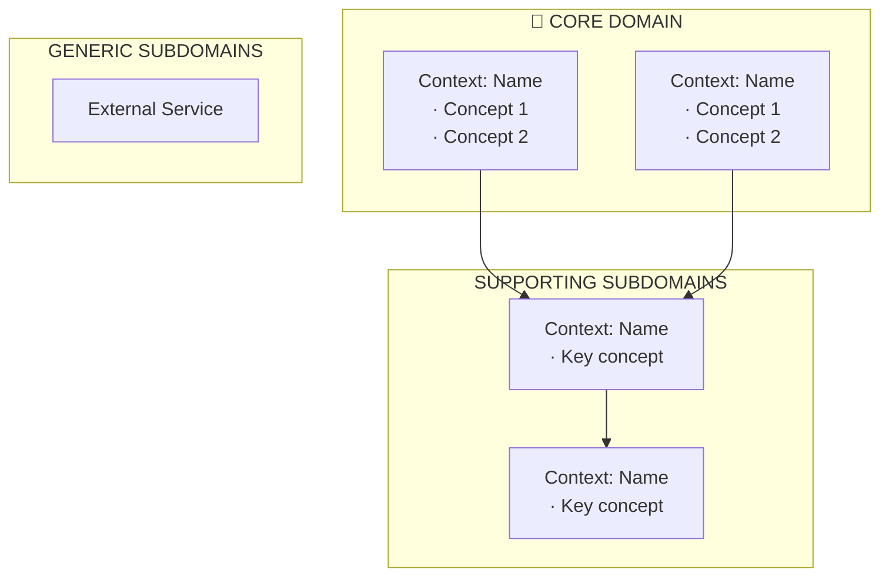

[← Index](./README.md) | [< Previous] | [Next >](./TEMPLATE-008-system-flows.md)

---

# Strategic Design Template

**What This Is**: The DDD strategic design phase — before modeling entities or flows, defining where the real value lies and which parts of the domain deserve the deepest modeling effort.

**How to Use**: Use after Discovery (Phase 1) and before any detailed modeling. This defines boundaries and priorities that guide everything else.

**Why It Matters**: Not all subdomains are equal. Strategic design tells you where to invest heavily (core domain) vs. where to simplify (generic subdomains). Without this, teams over-engineer commodity features and under-invest in differentiators.

**When to Use**: For complex domains using DDD approach. Skip for simple MVPs.

**Owner**: Architect + Domain Expert

---

## Contents

- [Domain Vision Statement](#domain-vision-statement)
- [Subdomain Classification](#subdomain-classification)
- [Core Domain Justification](#core-domain-justification)
- [Bounded Contexts Candidates](#bounded-contexts-candidates)
- [Implications for Modeling](#implications-for-modeling)
- [Completion Checklist](#completion-checklist)

---

## Domain Vision Statement

> [PRODUCT NAME] exists to be [core value proposition].
>
> [Differentiating factor] is not [common feature] — that's the means. The real value is [unique capability].
>
> The system is successful when [desired outcome for users].

### Example: Authentication Platform

> Keygo exists to be the single source of truth about **who an identity is, what they can do, and under what conditions**, within any SaaS ecosystem that doesn't want to build or maintain its own identity and access infrastructure.
>
> Multi-tenancy is not the differentiator — that's the form. The value is **delegated, secure, and auditable identity, session, and access management** with the granularity each organization needs.
>
> The system is successful when an organization can connect any application, define its access rules, and trust that Keygo enforces them — without writing a single line of authentication logic.

---

## Subdomain Classification

In DDD, not all subdomains deserve equal investment. Classification determines where deep modeling applies.

### Core Domain — The Differentiator

| Subdomain | Description |
|----------|------------|
| **[Subdomain 1]** | [What it does — this is where the competitive advantage lives] |

Core Domain is where you can't buy, replicate with a generic framework, or delegate. Deepest modeling, best names, most careful abstractions.

### Supporting Subdomains — Necessary, Not Differentiators

| Subdomain | Description |
|----------|------------|
| **[Subdomain A]** | [What it does] — needed to function, but not competitive advantage |
| **[Subdomain B]** | [What it does] |
| **[Subdomain C]** | [What it does] |

### Generic Subdomains — Buy or Delegate

| Subdomain | Description |
|----------|------------|
| **[Subdomain X]** | [What it does] — commodity, consume external service |
| **[Subdomain Y]** | [What it does] — generic, no competitive value |

---

## Core Domain Justification

Ask: **What does the system do that a customer can't just buy or replicate easily?**

- [Answer 1]: [Why it's not commodity]
- [Answer 2]: [Why it's not delegable]

What customers buy is [core value] — and that lives in [Core Domain subdomains].

---

## Bounded Contexts Candidates

A Bounded Context is an explicit boundary within which a domain model is valid and consistent. The same concept may exist in multiple contexts with different meanings — that's correct.

### Same Term, Different Contexts

| Term | In Context A | In Context B | In Context C |
|------|-------------|-------------|-------------|
| **User** | [Meaning here] | [Meaning here] | [Meaning here] |
| **Account** | [Meaning here] | [Meaning here] | [Meaning here] |
| **Role** | [Meaning here] | [Meaning here] | [Meaning here] |

This multiplicity is intentional and healthy in DDD. Each context has its own perspective.

---

## Implications for Modeling

These strategic decisions have direct consequences:

| Decision | Implication |
|----------|-------------|
| **[Core] are Core Domains** | Most deep modeling: precise language, detailed events, careful flows |
| **[Subdomain] is Supporting** | Model sufficiently to work, avoid over-engineering |
| **[Subdomain] is Generic** | Simple integration contract, not deep domain modeling |
| Multi-tenancy is the means | Isolation is a cross-cutting constraint, not a context itself |
| External services are Generic | Define integration contract, not internal model |

---

## Completion Checklist

### Deliverables

- [ ] Domain Vision Statement defined
- [ ] Subdomains classified (Core / Supporting / Generic)
- [ ] Core Domain justified (why it's core)
- [ ] Bounded Contexts identified
- [ ] Cross-context term ambiguities resolved
- [ ] Modeling implications documented

### Sign-Off

- [ ] **Prepared by**: [Architect], [Date]
- [ ] **Reviewed by**: [Domain Expert], [Date]
- [ ] **Approved by**: [Tech Lead], [Date]

---

[← Index](./README.md) | [< Previous] | [Next >](./TEMPLATE-008-system-flows.md)