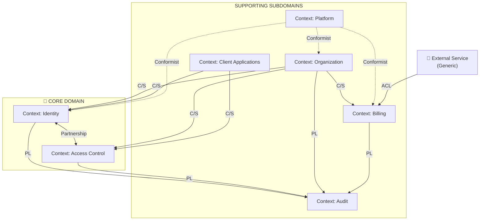
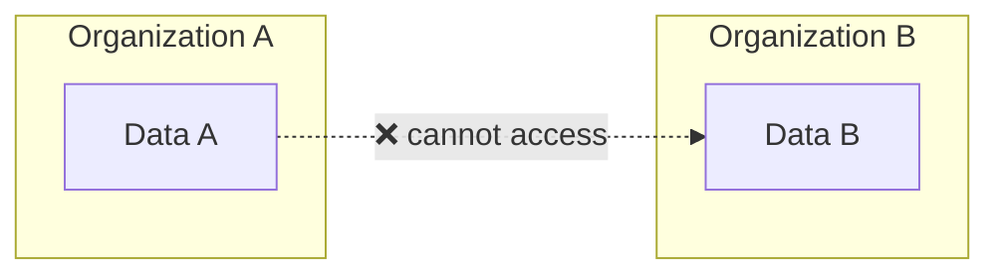

[← Index](./README.md) | [< Previous](./TEMPLATE-012-domain-events.md)

---

# Context Map Template

**What This Is**: The strategic map of the system showing which bounded contexts exist, how they relate, and what kind of relationship each has. Not implementation details — relationships, power, and information flow between domain parts.

**How to Use**: Map each bounded context and its relationships using DDD patterns: Customer/Supplier, Partnership, Published Language, Conformist, Anti-Corruption Layer.

**Why It Matters**: In DDD, context relationships aren't neutral. One context can dictate terms (upstream) or have to adapt to them (downstream). Knowing who sets the rules prevents contamination between contexts.

**When to Use**: Multiple bounded contexts, microservices, or multiple teams working on different parts.

**Owner**: Architect + Domain Expert

**Diagram Convention**: Mermaid → PlantUML → ASCII (see root README.md)

---

## Contents

- [Context Map Diagram](#context-map-diagram)
- [Relationship Patterns](#relationship-patterns)
- [Relationships by Context](#relationships-by-context)
- [Cross-Cutting Constraint](#cross-cutting-constraint)
- [Completion Checklist](#completion-checklist)

---

## Context Map Diagram

Arrows indicate upstream → downstream direction. The context at the arrow tail defines the contract; the one at the head adapts.

---

## Relationship Patterns

| Pattern | Meaning | When to Use |
|---------|---------|-------------|
| **Customer/Supplier (C/S)** | Upstream defines contract; downstream consumes. Upstream has responsibility not to break downstream. | When a context needs data from another but can't change the contract. |
| **Partnership** | Two contexts evolve together; changes coordinated. No clear upstream/downstream. | When two contexts are so integrated that one can't function without the other. |
| **Published Language (PL)** | Publisher exposes formal, stable event contract. Consumers subscribe without coupling. | Event-driven communication where multiple contexts consume. |
| **Conformist** | Downstream accepts upstream model exactly as-is, no translation. | When downstream has no power to negotiate and ACL cost isn't justified. |
| **Anti-Corruption Layer (ACL)** | Downstream builds translation layer to convert external model to its own. | Integrations with external systems whose model shouldn't contaminate domain. |

---

## Relationships by Context

### Context: [Context A] → [Context B]

| Field | Detail |
|-------|--------|
| **Pattern** | [Pattern used] |
| **What Context A provides** | [What it exposes] |
| **What Context B needs** | [What it consumes] |
| **Contract** | [How they communicate] |
| **Risk** | [What could go wrong] |

### Example: Organization → Identity

| Field | Detail |
|-------|--------|
| **Pattern** | Customer/Supplier — Organization is upstream |
| **What Organization provides** | User state (active, suspended, deleted) and confirmation that user belongs to valid organization |
| **What Identity needs** | Know if an identity is allowed to authenticate before issuing credentials |
| **Contract** | Organization publishes events (UserSuspended, UserReactivated, UserDeleted); Identity reacts by invalidating active sessions |
| **Risk** | If Organization changes state model without notice, Identity might issue credentials for inactive users |

---

## Cross-Cutting Constraint

[Constraint name] is not a context — it's a cross-cutting constraint that all contexts must respect. Represented as a rule, not a relationship.

**[Constraint Rule]**: No data from one [unit] can be read, referenced, or influenced by another [unit] under any normal operational circumstance. This constraint applies as an invariant in each context, not as a presentation-layer filter.

---

## Completion Checklist

### Deliverables

- [ ] Bounded contexts identified and named
- [ ] Context relationships mapped
- [ ] Pattern for each relationship documented
- [ ] Contracts defined (how they communicate)
- [ ] Risks identified
- [ ] Cross-cutting constraints documented
- [ ] Visual diagram created

### Sign-Off

- [ ] **Prepared by**: [Architect], [Date]
- [ ] **Reviewed by**: [Domain Expert], [Date]
- [ ] **Approved by**: [Tech Lead], [Date]

---

[← Index](./README.md) | [< Previous](./TEMPLATE-012-domain-events.md)