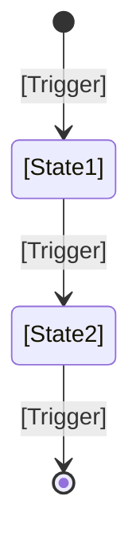
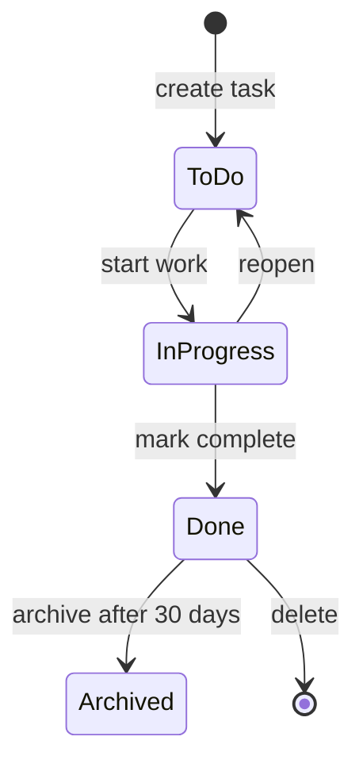

[← Back to Index](./README.md)

---

# Bounded Context Template

Create one file per bounded context using this template. Replace placeholders (`[...]`) with your context-specific information.

**Diagram Convention**: Mermaid → PlantUML → ASCII (see root README.md)

---

## Contents

- [Context Purpose](#context-purpose)
- [Core Responsibilities](#core-responsibilities)
- [Why This Is a Separate Context](#why-this-is-aseparate-context)
- [Out of Scope](#out-of-scope)
- [Context Invariants](#context-invariants)
- [Lifecycle Diagrams](#lifecycle-diagrams)
- [Ubiquitous Language](#ubiquitous-language)
- [Aggregates](#aggregates)
- [Entities](#entities)
- [Value Objects](#value-objects)
- [Domain Services](#domain-services)
- [Ports (Integration Boundaries)](#ports-integration-boundaries)
- [Domain Events](#domain-events)
- [Context Relationships](#context-relationships)
- [Reviewer Comments](#reviewer-comments)
- [Completion Checklist](#completion-checklist)
- [Sign-Off](#sign-off)

---

## Context Purpose

**Context Name**: [Your Context Name]

**Strategic Type**: Core / Supporting / Generic

**One-sentence purpose**: [What business capability does this context own?]

**Example**: "Create, assign, and track tasks with priority and status through their lifecycle"

---

## Core Responsibilities

List 3–5 key responsibilities this context owns:

- [Responsibility 1]
- [Responsibility 2]
- [Responsibility 3]

**Example** (Task Management context):
- Create and edit tasks
- Assign tasks to team members
- Track task status and progress
- Set priorities and due dates

### Why This Is a Separate Context

Explain what makes this a natural boundary. Why doesn't this belong in another context?

**Example**: "Task Management is separate because task creation/assignment follows different rules than collaboration (comments/mentions). Teams can work on tasks independently from comment threads."

### Out of Scope

What this context does NOT do. Be explicit — it clarifies boundaries and prevents scope creep.

| What This Context Does NOT Do | Why It Doesn't Belong Here |
|---|---|
| [Concept/Responsibility 1] | [Which context owns it?] |
| [Concept/Responsibility 2] | [Which context owns it?] |

**Example** (Task Management):
| Out of Scope | Owner |
|---|---|
| Authenticate users | Identity |
| Manage organization membership | Organization |
| Store application configuration | Client Applications |

---

## Ubiquitous Language

Define terms that have *specific meanings only in this context*. (Other contexts may use the same terms differently.)

### Core Concepts

Detailed definitions of the most important concepts in this context.

**[Concept 1]**: [What it is and why it matters in this context]

| Attribute | Description |
|-----------|-------------|
| [Attribute 1] | [What it represents] |
| [Attribute 2] | [What it represents] |

**[Concept 2]**: [What it is and why it matters in this context]

| Attribute | Description |
|-----------|-------------|
| [Attribute 1] | [What it represents] |
| [Attribute 2] | [What it represents] |

| Term | Definition in This Context | Example |
|------|---|---|
| **[Term 1]** | [What does it mean here?] | [Concrete example] |
| **[Term 2]** | [What does it mean here?] | [Concrete example] |
| **[Term 3]** | [What does it mean here?] | [Concrete example] |

**Example** (Task Management context):
| Term | Definition | Example |
|------|---|---|
| Task | A unit of work with clear ownership and completion criteria | "Update landing page hero" |
| Priority | Relative importance (High/Medium/Low) for sequencing work | High-priority tasks appear in sprint backlog |
| Assignee | The person responsible for completing the task | Alice is assigned to "Update landing page" |

### Shared Terms Across Contexts

If the same term appears in multiple contexts with *different* meanings, document the differences:

| Term | Meaning Here | Meaning in [Other Context] |
|------|---|---|
| **[Shared Term]** | [How we use it] | [How they use it] |

**Example**: "User" = person in Task Management, but "User" = account holder in Billing (one person can have multiple accounts)

---

## Context Invariants

Business rules that must always be true at the context level, beyond individual aggregates.

| # | Invariant |
|---|-----------|
| 1 | [Invariant that always holds true in this context] |
| 2 | [Another invariant] |
| 3 | [Third invariant] |

**Example** (Task Management):
| # | Invariant |
|---|-----------|
| 1 | A task must have at least one assignee or be unassigned. |
| 2 | A completed task cannot be reverted to "To Do" after 7 days. |
| 3 | Only team members with "Edit" permission can modify task priority. |

---

## Lifecycle Diagrams

State machines showing the possible states and transitions for key entities in this context.

### [Entity Name] Lifecycle



**Example** (Task lifecycle):


---

## Aggregates

**Aggregates** are clusters of entities that form consistency boundaries. One aggregate = one transaction.

### Aggregate 1: [Aggregate Root Name]

**Purpose**: [What does this aggregate do? What invariants does it maintain?]

**Structure**:
```
[AggregateRoot] (Aggregate Root)
├── [Entity 1]
│   └── [Value Object]
├── [Entity 2]
│   └── [Value Object]
└── [Collection of something]
```

**Example** (Task aggregate in Task Management):
```
Task (Aggregate Root)
├── TaskId (Value Object: unique identifier)
├── Title (String)
├── Description (String)
├── AssignedTo (UserId, Value Object)
├── Status (Value Object: "To Do", "In Progress", "Done")
├── Priority (Value Object: "High", "Medium", "Low")
├── CreatedAt (Timestamp)
├── Comments (Collection of Comment entities)
│   ├── CommentId
│   ├── Author
│   └── Text
└── Attachments (Collection of Attachment entities)
    ├── AttachmentId
    └── FileUrl
```

**Invariants** (rules that must always be true):
- [Invariant 1]
- [Invariant 2]
- [Invariant 3]

**Example**: Task must have a title, must have exactly one status, cannot be assigned to multiple people simultaneously

**Lifecycle** (what states can this aggregate be in?):
- [State 1]
- [State 2]
- [State 3]
- [State 4]

**Example**: Created → In Progress → Completed → Archived (or Deleted)

---

### Aggregate 2 (if exists): [Second Aggregate Root Name]

Follow the same structure as Aggregate 1.

---

## Entities

**Entities** are domain objects with identity (a specific instance matters, not just the data).

### [Entity Name]

| Field | Type | Constraints | Purpose |
|-------|------|---|---|
| `id` | UUID | PK, Not Null | Unique identifier for this entity |
| `[field2]` | [type] | [constraints] | [What does it represent?] |
| `[field3]` | [type] | [constraints] | [What does it represent?] |
| `createdAt` | Timestamp | Not Null | Record creation time |
| `updatedAt` | Timestamp | Nullable | Last modification time |

**Example** (Comment entity in Task Management):
| Field | Type | Constraints | Purpose |
|-------|------|---|---|
| `id` | UUID | PK, Not Null | Unique comment ID |
| `taskId` | UUID | FK → Task, Not Null | Which task this comment belongs to |
| `authorId` | UUID | FK → User, Not Null | Who wrote the comment |
| `text` | String | Not Null, Max 5000 chars | Comment body |
| `createdAt` | Timestamp | Not Null | When comment was posted |
| `editedAt` | Timestamp | Nullable | Last edit timestamp |

### [Second Entity Name] (if exists)

Follow the same structure.

---

## Value Objects

**Value Objects** are immutable, have no identity, and are defined by their data.

| Name | Description | Examples |
|------|---|---|
| **[Name 1]** | [What it represents] | [Valid values or examples] |
| **[Name 2]** | [What it represents] | [Valid values or examples] |
| **[Name 3]** | [What it represents] | [Valid values or examples] |

**Example** (Task Management context):
| Name | Description | Examples |
|------|---|---|
| **TaskId** | Unique identifier for a task | UUID: `f47ac10b-58cc-4372-a567-0e02b2c3d479` |
| **Priority** | Task importance level | "High", "Medium", "Low" |
| **TaskStatus** | State of the task | "To Do", "In Progress", "Done", "Cancelled" |
| **UserId** | Reference to a user | UUID: `a1b2c3d4-e5f6-47g8-h9i0-j1k2l3m4n5o6` |

---

## Domain Services

**Domain Services** orchestrate logic that doesn't fit naturally in an aggregate.

### Service 1: [Service Name]

**When would you use this?** [Describe the scenario]

**Operations**:
- **[Operation 1]**: [What it does] → Input: `[...]` → Output: `[...]`
- **[Operation 2]**: [What it does] → Input: `[...]` → Output: `[...]`

**Why not in an Aggregate?**
- [Reason 1]
- [Reason 2]

**Example** (Task Management):

**Service**: TaskAssignmentService

**When**: When assigning a task, we need to check organization limits, audit the change, and send a notification

**Operations**:
- **AssignTask** → Input: TaskId, UserId → Output: Assignment confirmation
- **UnassignTask** → Input: TaskId → Output: Confirmation
- **GetAssignableUsers** → Input: TaskId → Output: List of eligible assignees based on permissions

**Why separate**: Assignment logic involves checking multiple aggregates (Task, User, Organization), audit logging, and notifications—too complex for the Task aggregate alone

### Service 2 (if exists): [Second Service Name]

Follow the same structure.

---

## Ports (Integration Boundaries)

**Ports** define how external systems interact with this context. Think of ports as the API or contract.

### Input Ports (Commands — External Systems Ask This Context To Do Something)

| Port Name | Purpose | Input | Output |
|---|---|---|---|
| **[Command 1]** | [What action?] | [Data needed] | [What's returned] |
| **[Command 2]** | [What action?] | [Data needed] | [What's returned] |
| **[Query 1]** | [What data?] | [Filters] | [Entities returned] |

**Example** (Task Management context):
| Port Name | Purpose | Input | Output |
|---|---|---|---|
| **CreateTask** | User creates a task | Title, description, assignee | TaskId, created task |
| **AssignTask** | Reassign task to different person | TaskId, UserId | Updated task |
| **CompleteTask** | Mark task as done | TaskId | Task with status="Done" |
| **ListTasksByAssignee** | Fetch all tasks for a person | UserId, filters | List of tasks |
| **GetTaskById** | Fetch specific task | TaskId | Full task with all details |

### Output Ports (Repositories & External Dependencies — This Context Needs From Others)

| Port Name | Purpose | When Used | Returns |
|---|---|---|---|
| **[Repository 1]** | [What it persists] | [When used] | [Data structure] |
| **[External Service Call]** | [What it provides] | [When used] | [Data returned] |
| **[Event Publisher]** | [What events] | [When to publish] | [Success/failure] |

**Example** (Task Management context):
| Port Name | Purpose | When Used | Returns |
|---|---|---|---|
| **TaskRepository** | Persist/retrieve tasks | Create, update, query | Task entity or list |
| **OrganizationContext** | Check org limits, permissions | Before assigning task | User eligibility, limits |
| **NotificationPort** | Send notifications | After task creation/assignment | Confirmation of send |
| **AuditPort** | Log all changes | After any modification | Audit record ID |
| **EventPublisher** | Publish domain events | After state changes | Event published ✓ |

---

## Domain Events

**Events** are facts this context publishes that matter to other contexts.

| Event Name | Trigger | Payload (What's Included) | Consumed By |
|---|---|---|---|
| **[Event 1]** | [When does it happen?] | [What data?] | [Which contexts listen?] |
| **[Event 2]** | [When does it happen?] | [What data?] | [Which contexts listen?] |
| **[Event 3]** | [When does it happen?] | [What data?] | [Which contexts listen?] |

**Example** (Task Management context):
| Event Name | Trigger | Payload | Consumed By |
|---|---|---|---|
| **TaskCreated** | New task created | TaskId, title, createdBy, createdAt | Notification (send email), Reporting (analytics) |
| **TaskAssigned** | Task assigned to person | TaskId, assignedTo, assignedAt | Notification (alert assignee), Reporting (burndown) |
| **TaskCompleted** | Task marked as done | TaskId, completedAt | Notification, Reporting (metrics), Billing (usage) |
| **TaskCommented** | Comment added | TaskId, commentId, author, text | Collaboration (thread), Notification (mention alerts) |

---

## Context Relationships

### Upstream Dependencies (Who We Depend On)

| Context | Integration Method | Why We Call Them | Data Exchanged |
|---|---|---|---|
| **[Context 1]** | Command / Query / Event | [What do they provide?] | [What data?] |
| **[Context 2]** | Command / Query / Event | [What do they provide?] | [What data?] |

**Example** (Task Management):
| Context | Integration | Why | Data |
|---|---|---|---|
| **Organization** | Query: "Is this user in the org?" | Permission check before assigning | UserId, OrgId → allowed/denied |
| **User** | Query: "Get user details" | Display assignee info | UserId → name, email, avatar |
| **Notification** | Command: "Send email" | Alert on task assignment | TaskId, UserId, recipient email |

### Downstream Consumers (Who Depends On Us)

| Context | Integration Method | What They Use | Data Format |
|---|---|---|---|
| **[Context 1]** | Subscribes to events / Calls our API | [What do they need?] | [What we provide?] |
| **[Context 2]** | Subscribes to events / Calls our API | [What do they need?] | [What we provide?] |

**Example** (Task Management):
| Context | Integration | What They Use | Data |
|---|---|---|---|
| **Reporting** | Subscribes to: TaskCreated, TaskCompleted | Metrics, burndown charts | Event payload + timestamps |
| **Notification** | Subscribes to: TaskAssigned, TaskCommented | Sends alerts | Event details (who, what, when) |
| **Billing** | Subscribes to: TaskCreated | Usage counting for seat limits | Count of tasks per org per month |

### Strategic Pattern

The integration pattern this context uses with its neighbors:

- **Upstream**: [Customer/Supplier / Conformist / Partnership] — [Explain briefly]
- **Downstream**: [Published Language / Customer/Supplier / Conformist] — [Explain briefly]

**Example**: "Task Management uses Customer/Supplier with Organization (we depend on them for permissions). It uses Published Language with Notification (we publish, they subscribe)."

---

## Reviewer Comments

Feedback from domain experts and architects during review.

| Reviewer | Type | Content |
|---------|------|---------|
| [Name] | [Clarification / Question / Concern] | [Feedback received] |
| [Name] | [Suggestion / Correction] | [Feedback received] |

**Example**:
| Reviewer | Type | Content |
|---------|------|---------|
| Domain Expert | Clarification | "Should tasks support subtasks?" Added as separate entity under Task aggregate. |
| Tech Lead | Concern | "Priority changes need audit trail." Added invariant #3. |

---

## Completion Checklist

- [ ] **Purpose & Type** defined and reviewed
- [ ] **Core Responsibilities** listed (3–5 items)
- [ ] **Why a separate context?** explained
- [ ] **Out of Scope** defined (what this context does NOT do)
- [ ] **Ubiquitous Language** defined with examples
- [ ] **Core Concepts** detailed with attributes
- [ ] **Context Invariants** documented (not just aggregate invariants)
- [ ] **Lifecycle Diagrams** drawn with Mermaid state diagrams
- [ ] **Aggregates** sketched with structure and invariants
- [ ] **Entities** documented with fields and constraints
- [ ] **Value Objects** identified
- [ ] **Domain Services** listed with operations
- [ ] **Input Ports** (commands/queries) defined
- [ ] **Output Ports** (repositories/dependencies) defined
- [ ] **Domain Events** listed and named after business facts (not "TaskWasCreated" but "TaskCreated")
- [ ] **Upstream/Downstream** relationships mapped
- [ ] **Strategic Pattern** (Customer/Supplier, Partnership, etc.) identified
- [ ] **Integration Diagram** sketched
- [ ] **Reviewer Comments** added during review cycle
- [ ] **Team reviewed & validated** this boundary

---

## Sign-Off

- [ ] **Prepared by**: [Name], [Date]
- [ ] **Reviewed by**: [Domain Expert/Architect], [Date]
- [ ] **Approved by**: [Tech Lead/Architecture], [Date]

---

[← Back to Index](./README.md)
