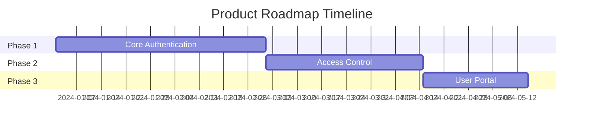

[← Index](./README.md) | [< Previous](./README.md) | [Next >](./TEMPLATE-015-epics.md)

---

# Roadmap

## Purpose

The roadmap defines **when** capabilities are delivered and **in what order**. It connects the product vision to execution by breaking the project into phases with clear milestones.

## What This Document Describes

1. The philosophy behind delivery order
2. Phase definitions with timelines
3. Capabilities delivered per phase
4. Milestones and success criteria
5. Assumptions and risks

## Diagram Convention

Use a Gantt-style diagram to visualize the timeline:



---

## Philosophy

### Why Phases, Not a Big Bang

A phased approach:
- **Manages risk**: Each phase produces something usable
- **Enables feedback**: Stakeholders see progress early
- **Creates clear checkpoints**: Decision points for go/no-go
- **Enables learning**: Team velocity improves with each phase

### Delivery Principles

1. **First, what enables everything else**: Core capabilities delivered first
2. **Each phase is self-sufficient**: A phase should work without requiring the next
3. **Dependencies are explicit**: Know what blocks what

---

## Phase Definition Template

```markdown
## Phase: [Version/Name]

**Timeline**: [Start] - [End] (or [Duration])

**Goal**: What this phase achieves for users and business

**Target Users**: Who benefits from this phase

### Capabilities Delivered

| Capability | Description | Related Requirements |
|------------|-------------|----------------------|
| [Name] | [Brief description] | [RF-XX, RF-XX] |
| [Name] | [Brief description] | [RF-XX] |

### Success Criteria

- [ ] Criterion that proves the phase is complete
- [ ] Another success indicator

### Dependencies

- [ ] What this phase requires from previous phases
- [ ] External dependencies

### Out of Scope

- [ ] What is explicitly NOT delivered in this phase
```

---

## Timeline Summary

| Phase | Timeline | Key Deliverables | Target Version |
|-------|----------|-----------------|----------------|
| Phase 1 / MVP | Q1 2024 | Core capabilities | v0.1 |
| Phase 2 | Q2 2024 | Enhanced features | v0.2 |
| Phase 3 | Q3 2024 | Full product | v1.0 |
| Phase 4+ | Q4 2024+ | Enterprise features | v1.x |

---

## Example: Authentication Platform

### Phase 1: MVP (Q1 2024)

**Goal**: A functional authentication system that verifies user credentials

**Target Users**: SaaS applications needing auth

**Capabilities**:

| Capability | Description | Related RFs |
|------------|-------------|--------------|
| Organization Management | Create and configure tenants | RF01, RF02 |
| User Management | Directory of users per organization | RF03 |
| Authentication | Login, logout, password change | RF04, RF05 |
| Session Management | Token issuance and validation | RF11, RF12, RF14 |

**Success Criteria**:
- [ ] An organization can onboard users
- [ ] Users can authenticate and maintain session
- [ ] API responds < 200ms p95

**Out of Scope**:
- User portal (delivered in Phase 3)
- Federation (delivered in Phase 4)

---

### Phase 2: Access Control (Q2 2024)

**Goal**: Define what each user can do in each application

**Capabilities**:

| Capability | Description | Related RFs |
|------------|-------------|--------------|
| Application Registry | Register external apps | RF06, RF07 |
| Role Definition | Define roles per application | RF09 |
| Membership | User-application-role association | RF08, RF10 |
| Access Verification | Validate session credentials | RF12 |

**Dependencies**:
- Requires Phase 1 complete

---

### Phase 3: User Portal (Q3 2024)

**Goal**: Self-service UI for organizations and users

**Capabilities**:

| Capability | Description | Related RFs |
|------------|-------------|--------------|
| Organization Portal | UI for org management | RF01, RF02, RF20 |
| User Portal | Login, profile, recovery flows | RF03, RF04, RF05 |
| Public Verification | Self-service endpoint | RF13 |
| App Configuration | UI for app registration | RF06, RF07 |

**Dependencies**:
- Requires Phase 1 and Phase 2 complete

---

## Milestone Planning

### Milestone Types

| Type | Purpose | Example |
|------|---------|---------|
| **Internal** | Team checkpoints | Alpha, Beta |
| **External** | User-facing releases | Launch, Release |
| **Decision** | Go/no-go decisions | MVP complete |

### Milestone Template

```markdown
### Milestone: [Name]

**Date**: [Target date]
**Type**: Internal / External / Decision
**Description**: What happens at this milestone
**Criteria**: How we know we're ready
```

---

## Success Criteria Template

Each phase needs measurable success criteria:

```markdown
### Phase Success Criteria

- [ ] Metric 1: [Target value]
- [ ] Metric 2: [Target value]
- [ ] User feedback: [Satisfaction target]
- [ ] Technical: [Performance target]
```

---

## Assumptions and Risks

### Assumptions

| Assumption | Implication |
|------------|--------------|
| [Team has capacity for parallel work] | [Phases can overlap] |
| [Early users tolerate limitations] | [MVP can ship with basic UI] |

### Risks

| Risk | Probability | Impact | Mitigation |
|------|-------------|--------|------------|
| [Complexity delays delivery] | [Medium] | [High] | [Prioritize core features first] |
| [No multi-tenancy experience] | [Medium] | [Medium] | [Architecture spike before phase 1] |

---

## Step-by-Step Guide

1. **Review requirements**: Use Scope Matrix from Requirements Phase
2. **Define phases**: Group capabilities by dependency
3. **Set timeline**: Assign dates to each phase
4. **Define milestones**: Key checkpoints within phases
5. **Write success criteria**: Measurable outcomes per phase
6. **Document assumptions**: What we believe to be true
7. **Identify risks**: What could go wrong
8. **Review with stakeholders**: Align on plan

---

## Tips

1. **Keep MVP small**: Focus on core value proposition
2. **Set clear milestones**: Know what success looks like
3. **Add buffer**: Plans change; build in padding
4. **Communicate often**: Roadmap is a living document
5. **Review quarterly**: Adjust based on feedback
6. **Trace to requirements**: Every capability maps to a requirement

---

[← Index](./README.md) | [< Previous](./README.md) | [Next >](./TEMPLATE-015-epics.md)