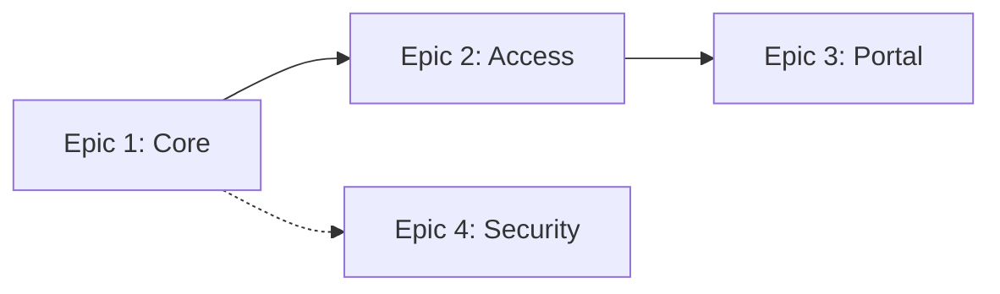

[← Index](./README.md) | [< Previous](./TEMPLATE-014-roadmap.md) | [Next >](./TEMPLATE-016-versioning-strategy.md)

---

# Epics

## Purpose

An **epic** is a **deliverable unit of work** that groups related features. It bridges high-level requirements and sprint-ready user stories.

## What This Document Describes

1. The epic structure and attributes
2. User story format and acceptance criteria
3. Estimation approach
4. Dependencies and risks
5. Example epics

## Diagram Convention

Use a flowchart to visualize epic dependencies:



---

## Philosophy

### Why Epics

Epics provide:
- **Grouping**: Related features delivered together
- **Estimability**: Can estimate as a whole
- **Progress tracking**: Epic completion = tangible progress
- **Ownership**: Clear accountability

### Epic vs. Feature vs. Story

| Level | Description | Typical Size |
|-------|-------------|---------------|
| **Epic** | Major initiative | 3-6 sprints |
| **Feature** | Specific capability | 1-2 sprints |
| **Story** | Smallest deliverable | 1-5 days |

---

## Epic Structure Template

```markdown
## Epic: [Epic Name]

**Description**: What this epic accomplishes

**Business Value**: Why this matters for the business

**Target Users**: Who benefits

**Priority**: P0 (Critical) / P1 (High) / P2 (Medium)

**Estimated Size**: [X] sprints ([Y] story points)

**Timeline**: Sprint [N] - Sprint [M]

### Related Requirements

| Requirement | Type | Description |
|--------------|------|-------------|
| RF-XX | Functional | [Description] |
| RNF-XX | Non-functional | [Description] |

### User Stories

#### Story 1: [Title]
As a [user type], I can [action] so that [benefit].

**Acceptance Criteria**:
- [ ] Criterion 1
- [ ] Criterion 2

**Estimate**: [X] points
**Priority**: P0/P1/P2

---

#### Story 2: [Title]
...

### Epic Acceptance Criteria

- [ ] All stories completed
- [ ] Code reviewed and merged
- [ ] Automated tests passing
- [ ] Documentation updated

### Dependencies

- [ ] Dependency 1 (from another epic)
- [ ] Dependency 2 (external)

### Risks and Mitigations

| Risk | Impact | Mitigation |
|------|--------|-------------|
| [Risk 1] | [Impact] | [Mitigation] |

### Out of Scope

- [ ] Feature explicitly not delivered
```

---

## User Story Format

### Standard Format

```
As a [user type],
I can [action],
so that [benefit].
```

### Example

```
As a team member,
I can assign a task to another team member,
so that work is distributed based on expertise.
```

### Breaking Down Complex Stories

If a story is too large:
1. Split by user action: "Create X" → "View X" → "Edit X" → "Delete X"
2. Split by variation: "Basic flow" → "Advanced flow"
3. Split by data: "Single item" → "Bulk operation"

---

## Acceptance Criteria

### Why It Matters

Acceptance criteria (AC):
- Define "done" for developers
- Enable automatic test generation
- Provide clear scope boundaries
- Enable stakeholder verification

### AC Template

```markdown
**Acceptance Criteria**:
- [ ] [Testable condition 1]
- [ ] [Testable condition 2]
- [ ] [Performance condition, if applicable]
- [ ] [Security condition, if applicable]
```

### Examples

```
**Acceptance Criteria**:
- [ ] Task can be assigned to any project member
- [ ] Assignee receives notification within 5 minutes
- [ ] Previous assignee is notified of the change
- [ ] Assignment is visible in task details
- [ ] History of assignments is logged
```

---

## Estimation

### T-Shirt Sizes

| Size | Complexity | Story Points |
|------|------------|-------------|
| **S** | Simple, well-understood | 1-2 |
| **M** | Moderate complexity | 3-5 |
| **L** | Complex, some unknowns | 8-13 |
| **XL** | Very large, many unknowns | 13-21 |

### Velocity Considerations

- **New team**: Estimate conservatively (assume 50% velocity)
- **Known domain**: Use historical velocity
- **Unknown domain**: Add research spikes before estimating

---

## Example: Authentication Epic

```
## Epic: User Authentication

**Description**: Enable users to authenticate and maintain sessions

**Business Value**: Without authentication, no other feature is usable

**Target Users**: All users of the system

**Priority**: P0

**Estimated Size**: 3 sprints (21 points)

**Timeline**: Sprint 1 - Sprint 3

### Related Requirements

| Requirement | Type |
|--------------|------|
| RF03 | Functional |
| RF04 | Functional |
| RF05 | Functional |
| RF11 | Functional |
| RF12 | Functional |
| RNF01 | Non-functional |

### User Stories

#### Story 1: User Registration
As a new user, I can register with email and password so that I can access the system.

**Acceptance Criteria**:
- [ ] Email is required and validated
- [ ] Password must meet complexity requirements
- [ ] User receives confirmation email
- [ ] User record created in database

**Estimate**: 3 points

---

#### Story 2: User Login
As a registered user, I can log in with email and password so that I access my account.

**Acceptance Criteria**:
- [ ] Valid credentials return success
- [ ] Invalid credentials return error
- [ ] Session token is issued
- [ ] Failed attempts are logged

**Estimate**: 3 points

---

### Epic Acceptance Criteria

- [ ] All 5 authentication stories complete
- [ ] Code reviewed and merged
- [ ] All tests passing
- [ ] API documentation updated

### Dependencies

- [ ] Requires Organization Management (Epic 1)
- [ ] Requires Session Service (in this epic)

### Risks

| Risk | Impact | Mitigation |
|------|--------|-------------|
| Password reset edge cases | Medium | Define clear rules upfront |
```

---

## Dependency Management

### Types of Dependencies

| Type | Description | Example |
|------|-------------|----------|
| **Internal** | Between epics in this project | Epic 2 requires Epic 1 |
| **External** | Outside the project | API waiting for team X |
| **Infrastructure** | Technical dependencies | DB schema must be ready |

### Dependency Matrix

| Epic | Depends On | Blocked By |
|------|------------|------------|
| Epic 1 | - | - |
| Epic 2 | Epic 1 | - |
| Epic 3 | Epic 2 | Epic 1 |

---

## Step-by-Step Guide

1. **Review roadmap**: Understand phase timelines
2. **Group requirements**: Features that go together
3. **Write epic**: Description, value, priority
4. **Break into stories**: Each feature → story
5. **Write acceptance criteria**: For each story
6. **Estimate size**: T-shirt or story points
7. **Identify dependencies**: What's needed first
8. **Document risks**: What could go wrong

---

## Tips

1. **User story format**: "As a [user], I [action] so that [benefit]"
2. **Keep stories small**: Aim for 1-5 day stories
3. **AC are tests**: Developers should use them to verify
4. **Add buffer**: Reserve capacity for bugs, tech debt
5. **Review regularly**: Adjust based on team velocity

---

[← Index](./README.md) | [< Previous](./TEMPLATE-014-roadmap.md) | [Next >](./TEMPLATE-016-versioning-strategy.md)