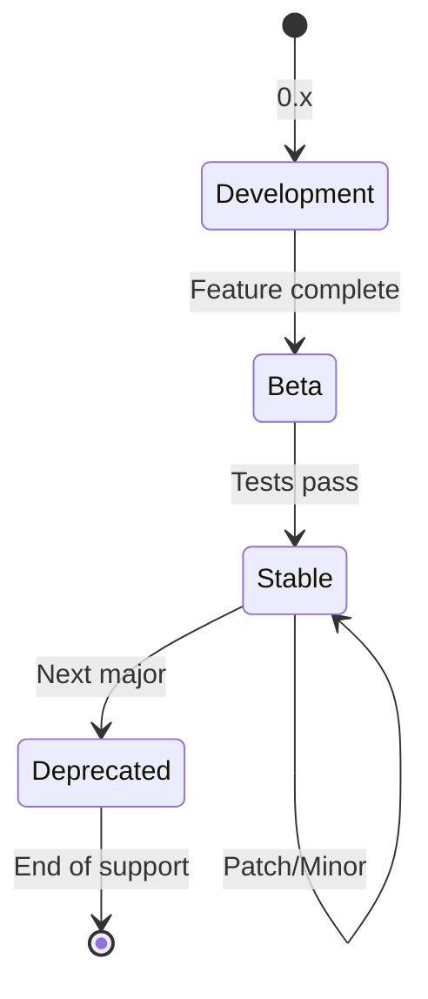

[← Index](./README.md) | [< Previous](./TEMPLATE-015-epics.md) | [Next >](../06-development/README.md)

---

# Versioning Strategy

## Purpose

The versioning strategy defines **how software versions are numbered**, **when releases happen**, and **how breaking changes are handled**. It enables clear communication with stakeholders and consumers.

## What This Document Describes

1. Version format and meaning (semantic versioning)
2. Release lifecycle phases
3. Compatibility rules
4. Communication and deprecation process
5. Support policy

## Diagram Convention

Use a state diagram to visualize version lifecycle:



---

## Philosophy

### Why Versioning Matters

Without versioning:
- Consumers don't know what's safe to use
- Breaking changes cause production incidents
- Communication about changes is ambiguous
- Support boundaries are unclear

### Core Principles

1. **Never break stable without migration path**: Consumers need time to adapt
2. **Version aggressively until stable**: Use 0.x for experimental APIs
3. **Deprecate first, remove second**: Never remove in the same release

---

## Semantic Versioning

### Format

```
MAJOR.MINOR.PATCH
```

| Component | Meaning | When to Change |
|-----------|---------|----------------|
| **MAJOR** | Breaking changes | Contract incompatibility |
| **MINOR** | New features | Backward-compatible additions |
| **PATCH** | Bug fixes | No contract changes |

### Examples

| Change | New Version |
|--------|-------------|
| Add new endpoint | 1.1.0 |
| Add optional field to response | 1.1.1 |
| Remove field from response | 2.0.0 |
| Change field type | 2.0.0 |
| Fix security vulnerability | 1.0.1 |

---

## Pre-release Versions

### Format

```
MAJOR.MINOR.PATCH-suffix.N
```

| Suffix | Meaning | Stability |
|--------|---------|-----------|
| **-alpha.N** | Early testing | Low |
| **-beta.N** | Feature complete | Medium |
| **-rc.N** | Release candidate | High |

### Progression

```
0.1.0 → 0.1.1 → 0.2.0 (development)
         ↓
      0.1.0-beta.1 → 0.1.0-beta.2
                        ↓
                     0.1.0-rc.1 → 0.1.0-rc.2
                                   ↓
                                1.0.0 (stable)
```

---

## Release Lifecycle

### Phase Definition

| Phase | Version | Guarantee | Duration |
|-------|---------|-----------|----------|
| **Development** | 0.x | None | Until MVP |
| **Beta** | 0.x-beta | 1 sprint notice | 2-4 weeks |
| **Stable** | 1.x | Full backward compatibility | 6+ months |
| **Deprecated** | 1.x (feature 2.x) | Maintenance only | Until next major |
| **Legacy** | Old major | Security patches | 3-12 months |

### Promotion Rules

| From | To | Requirements |
|------|----|---------------|
| 0.x | 1.0 | All MVP requirements implemented, tests passing, docs complete |
| 1.x | 2.0 | 1+ month in stable without critical incidents |

---

## Compatibility Rules

### What Is Compatible

| Change | Compatible? | Example |
|--------|--------------|---------|
| **Add field** | ✅ Yes | `{ "id": "1" }` → `{ "id": "1", "name": "Jane" }` |
| **Add endpoint** | ✅ Yes | New `GET /v1/users/invite` |
| **Add enum value** | ✅ Yes | `"role": "admin"` → add `"superadmin"` |
| **Add optional param** | ✅ Yes | New `?filter=` parameter |

### What Is NOT Compatible

| Change | Compatible? | Example |
|--------|--------------|---------|
| **Remove field** | ❌ No | Remove `"phone"` from response |
| **Rename field** | ❌ No | `"username"` → `"login"` |
| **Change type** | ❌ No | `"id": "string"` → `"id": "number"` |
| **Change semantics** | ❌ No | `"active": true` now means different thing |
| **Restrict values** | ❌ No | `"status": "any"` → `"status": "active"` |

### Golden Rule

> **If existing consumers break, it's a breaking change.**

---

## Version in URLs

### Endpoint Format

```
GET /v1/resource
POST /v1/resource
PATCH /v1/resource/{id}
```

### Header Alternative

For clients that cannot include version in URL:

```
Accept: application/vnd.product.v1+json
```

---

## Communication Strategy

### Changelog Format

Every release includes:

1. **Release date**
2. **Version type** (Major/Minor/Patch)
3. **New features**
4. **Breaking changes** (if any)
5. **Deprecations**
6. **Bug fixes**

### Notification Timing

| Release Type | Channel | Timing |
|--------------|---------|--------|
| **Patch** | GitHub Releases | Post-deploy |
| **Minor** | GitHub Releases + Email | 1 week before |
| **Major** | GitHub Releases + Email + Direct | 1 month before + migration guide |

---

## Deprecation Process

### Deprecation Headers

```http
HTTP/1.1 299 Feature Deprecated
Deprecation: true
Sunset: Mon, 01 Jan 2025 00:00:00 GMT
Link: <https://api.example.com/v2/resource>; rel="successor-version"
```

| Header | Purpose |
|--------|----------|
| **Deprecation** | Indicates feature will be removed |
| **Sunset** | Date when feature will be removed |
| **Link** | URL to successor version |

### Deprecation Timeline

```
Release N:   Feature marked as deprecated
Release N+1: Feature still works (with warning)
Release N+2: Feature removed (new major)
```

---

## Support Policy

### Version Support Matrix

| Version | Status | Support Level |
|---------|--------|---------------|
| Latest | Stable | Full: features + bug fixes |
| Previous | Stable | Bug fixes only (3 months) |
| Deprecated | Legacy | Security patches only |
| Older | Unsupported | None |

### Example Policy

```
- Latest version (1.x): Full support
- Previous version (0.x): 3 months bug fixes only
- Older: Critical security patches only (case by case)
```

---

## Step-by-Step Guide

1. **Define version format**: MAJOR.MINOR.PATCH
2. **Set lifecycle phases**: Development → Beta → Stable → Deprecated
3. **Define compatibility rules**: What's breaking, what's not
4. **Set release schedule**: Monthly, quarterly, etc.
5. **Define deprecation process**: How to remove features
6. **Set support policy**: How long each version is supported
7. **Document communication**: How to announce changes

---

## Tips

1. **Start with 0.x**: Don't commit to stability until APIs are proven
2. **Document every change**: Consumers need changelog
3. **Give migration time**: Major changes need 1+ month notice
4. **Test compatibility**: Automate breaking change detection
5. **Communicate proactively**: Don't surprise consumers

---

[← Index](./README.md) | [< Previous](./TEMPLATE-015-epics.md) | [Next >](../06-development/README.md)