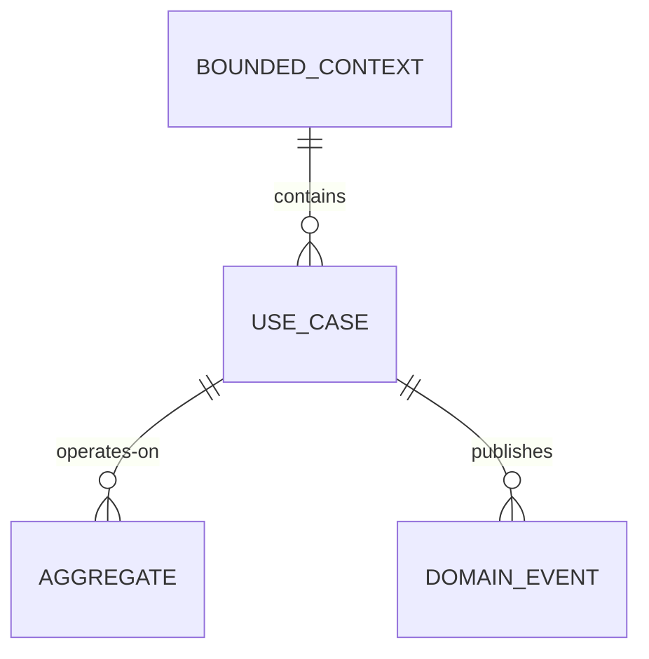

[← Index](./README.md) | [< Previous](./TEMPLATE-016-versioning-strategy.md) | [Next >](./TEMPLATE-017-use-cases-catalog.md)

---

# Use Cases Catalog

## Purpose

The Use Cases Catalog provides a **complete inventory of user interactions** mapped to bounded contexts, aggregates, domain events, and requirements. It is the single source of truth for implementation and testing.

## What This Document Describes

1. Use case structure per bounded context
2. Preconditions, main flow, postconditions
3. Variants and error handling
4. Mapping to requirements, aggregates, and events
5. Traceability matrix

## Diagram Convention

Use a table to show context-to-use-case mapping:



---

## Philosophy

### Why Use Cases

Use cases bridge the gap between:
- **Requirements** (what) → Implementation (how)
- **Design** (bounded contexts) → Testing (flows)
- **Stories** (user perspective) → Code (API endpoints)

Without use cases:
- Developers guess the flow
- Testers miss edge cases
- Traceability is lost

### Structure per Context

Each bounded context gets:
- Context description
- List of use cases (UC-XX)
- Mapping to aggregates
- Actor definitions

---

## Use Case Template

```markdown
### UC-XX: [Use Case Name]

**Reference**: RF-XX  
**Bounded Context**: [Context Name]  
**Aggregate**: [Aggregate Root Name]

**Actors**:
- Primary: [Who initiates]
- Secondary: [Who participates]

**Preconditions**:
- [Condition 1]
- [Condition 2]

**Main Flow**:
1. [Step 1]
2. [Step 2]
3. [Step 3]

**Postconditions**:
- [Condition 1]
- [Condition 2]

**Domain Events Published**:
- [Event name](event_details)

**Variants**:
- **V1a**: [Condition] → [Result]
- **V1b**: [Condition] → [Result]

**Related Proposals**:
- [Proposal ID](link)

---

## Field Definitions

| Field | Description |
|-------|-------------|
| **Reference** | Maps to requirement (RF-XX) |
| **Bounded Context** | Domain context this UC belongs to |
| **Aggregate** | Aggregate root this UC operates on |
| **Actors** | Primary (initiates) and secondary (participates) |
| **Preconditions** | What must be true before the flow starts |
| **Main Flow** | Happy path steps |
| **Postconditions** | What must be true after successful completion |
| **Domain Events** | Events published on success |
| **Variants** | Alternative paths and error cases |
| **Related Proposals** | Development proposals implementing this UC |

---

## Example: Authentication Context

### UC-A1: Authorize with Code + PKCE

**Reference**: RF-A1  
**Bounded Context**: Authentication  
**Aggregate Root**: `AuthorizationCode`

**Actors**:
- Primary: User (not authenticated)
- Secondary: Client Application

**Preconditions**:
- Client application registered in system
- `redirect_uri` in allowed list
- `code_challenge` valid (43-128 chars, base64url)

**Main Flow**:
1. Client initiates `GET /api/v1/tenants/{slug}/oauth2/authorize?client_id=X&redirect_uri=Y&scope=Z&code_challenge=...&code_challenge_method=S256`
2. System validates parameters (client_id, redirect_uri, scope)
3. System generates `AuthorizationCode` (TTL 10 min, associated to challenge)
4. System returns `code` to client

**Postconditions**:
- `AuthorizationCode` created in database with status `ACTIVE`
- Client has `code` for next step (UC-A2)
- Event: `AuthorizationCodeGenerated(code_id, client_id, redirect_uri, scope, code_challenge)`

**Variants**:
- **V1a**: Client not registered → reject 400
- **V1b**: Redirect URI mismatch → reject 400
- **V1c**: Invalid scope → reject 400

---

## Traceability Matrix

### UC ↔ RF ↔ Aggregate ↔ Event

| Use Case | Requirement | Aggregate Root | Domain Events |
|---------|-------------|---------------|----------------|
| UC-A1 | RF-A1 | AuthorizationCode | AuthorizationCodeGenerated |
| UC-A2 | RF-A2 | RefreshToken, Session | SessionCreated |
| UC-A3 | RF-A3 | RefreshToken | TokenRefreshed |
| UC-T1 | RF-T1 | Organization | OrganizationCreated |
| ... | ... | ... | ... |

---

## Step-by-Step Guide

1. **Identify bounded contexts** from Design phase
2. **List all user interactions** for each context
3. **Write each use case** with full template
4. **Map to requirements** (RF-XX)
5. **Map to aggregates** (from Data Model)
6. **Define domain events** (from Design)
7. **Document variants** (error paths)
8. **Create traceability matrix**
9. **Review with stakeholders**

---

## Tips

1. **One use case per primary actor goal**: Don't combine multiple flows
2. **Preconditions are testable**: Each should be verifiable
3. **Postconditions enable testing**: Tests should verify these
4. **Variants document edge cases**: These become test cases
5. **Keep flows linear**: Avoid branching in main flow
6. **Version with requirements**: Update when RFs change

---

[← Index](./README.md) | [< Previous](./TEMPLATE-016-versioning-strategy.md) | [Next >](./TEMPLATE-017-use-cases-catalog.md)