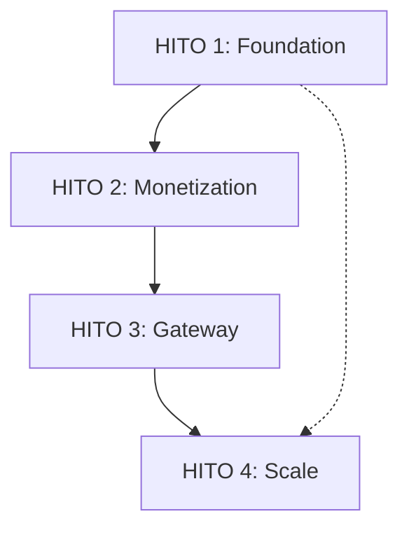

[← Index](./README.md) | [< Previous](./TEMPLATE-017-use-cases-catalog.md) | [Next >](./TEMPLATE-018-milestones-proposals.md)

---

# Milestones & Proposals

## Purpose

The Milestones & Proposals document provides a **detailed execution plan** with specific work items (proposals), effort estimates, dependencies, and deliverabs. It is the single source of truth for development planning and resource allocation.

## What This Document Describes

1. Strategic objectives by time horizon
2. Milestones with timelines
3. Proposals with IDs, effort, and dependencies
4. Deliverables per milestone
5. Consolidated summary

## Diagram Convention

Use a flowchart to show milestone dependencies:



---

## Philosophy

### Why Proposals

Epics define "what" (features), but proposals define "how much work" and "who does it":
- **Proposal**: Specific task with estimate (e.g., "Add scope filtering to /userinfo")
- **Effort**: Hours or story points
- **Dependencies**: What must be done first
- **Deliverable**: Concrete output

### Proposal Types

| Type | Prefix | Description |
|------|--------|-------------|
| **Task** | T-NNN | Feature, bug fix, configuration |
| **Variant** | V-NNN | Alternative implementation |
| **Feature** | F-NNN | New capability |

---

## Milestone Template

```markdown
## HITO N: [Milestone Name]

**Period**: [Start Date] - [End Date]  
**Objective**: What this milestone achieves  
**Priority**: P0 (Critical) / P1 (High) / P2 (Medium)  
**Total Effort**: [X] hours (~[Y] dev-days)

### Proposals Included

| ID | Type | Proposal | Status | Effort | Blocker | Context |
|----|------|----------|--------|--------|---------|---------|
| T-XXX | Task | [Description] | 🔲 | [X]h | — | [Area] |
| V-XXX | Variant | [Description] | 🔲 | [X]h | T-XXX | [Area] |
| F-XXX | Feature | [Description] | 🔲 | [X]h | — | [Area] |

### Deliverables

- [ ] Deliverable 1
- [ ] Deliverable 2

### Execution Plan

1. **Week 1**: [Tasks]
2. **Week 2**: [Tasks]
```

---

## Proposal Template

```markdown
### T-XXX: [Proposal Title]

**Type**: Task / Variant / Feature  
**Status**: 🔲 Not Started / 🟡 In Progress / ✅ Complete  
**Effort**: [X] hours  
**Priority**: P0 / P1 / P2  
**Context**: [Area: AUTH, TENANTS, BILLING, etc.]

**Description**: What this proposal accomplishes

**Preconditions**:
- [Condition 1]

**Deliverables**:
- [ ] Deliverable 1
- [ ] Deliverable 2

**Dependencies**:
- [ ] T-XXX (must complete first)

**Testing**:
- Unit tests: [N]
- Integration tests: [N]

**Related Use Cases**:
- [UC-XX](link)

**Notes**:
- [Additional context]
```

---

## Strategic Objectives Template

```markdown
### Objectives by Horizon

| Horizon | Objective | Status | Capability Added |
|---------|-----------|--------|-----------------|
| **Short Term (4 weeks)** | [Objective 1] | 🟡 In progress | X of Y (Z%) |
| **Medium Term (8 weeks)** | [Objective 2] | 🔲 Not started | + X = Y (Z%) |
| **Long Term (16 weeks)** | [Objective 3] | 🔲 Not started | + X = Y (Z%) |
```

---

## Example: Short Horizon

### HITO 1: Foundation & Security (P0 — 4 weeks)

**Period**: 2026-04-05 to 2026-05-03  
**Objective**: MVP with secure foundation and documentation  
**Priority**: 🔴 CRITICAL (P0)  
**Total Effort**: 51 hours (~6 dev-days)

### Proposals

| ID | Type | Proposal | Status | Effort | Blocker |
|----|------|----------|--------|--------|---------|
| T-030 | Task | Fix broken Markdown references | 🔲 | 4h | — |
| T-031 | Task | Automate link checking in CI | 🔲 | 6h | T-030 |
| T-023 | Task | Configure lint/checkstyle | 🔲 | 8h | — |
| T-051 | Task | Endpoint authorization matrix | 🔲 | 12h | — |
| T-035 | Task | Replay attack detection | 🔲 | 6h | — |
| T-043 | Task | Scope filtering in /userinfo | 🔲 | 6h | — |

### Deliverables

- Core security: Replay attack detection, scope filtering
- Code quality: Lint automation, authorization matrix
- Documentation: Use cases catalog, capability matrix

---

## Dependencies Matrix

| Proposal | Depends On | Blocked By |
|----------|------------|------------|
| T-031 | T-030 | — |
| T-051 | — | — |
| V-067 | — | — |
| T-035 | — | — |

---

## Consolidated Summary

| Milestone | Priority | Period | Effort | Proposals |
|-----------|----------|--------|--------|-----------|
| HITO 1 | P0 | Q2 2024 | 51h | 9 |
| HITO 2 | P1 | Q2-Q3 2024 | 81h | 12 |
| HITO 3 | P1 | Q3 2024 | 94h | 10 |
| HITO 4 | P1 | Q4 2024 | 96h | 8 |
| **Total** | | | **322h** | **37** |

---

## Step-by-Step Guide

1. **Define horizons**: Short/medium/long term
2. **Create milestones**: Each objective
3. **Break into proposals**: Specific tasks
4. **Estimate effort**: Hours per proposal
5. **Identify dependencies**: What's blocked by what
6. **Assign priorities**: P0/P1/P2
7. **Consolidate**: Summary table
8. **Review with team**: Validate estimates

---

## Tips

1. **Break big proposals**: If > 12h, split into smaller
2. **Add buffer**: 20% for unexpected issues
3. **Track dependencies**: Use a matrix
4. **Review weekly**: Adjust based on progress
5. **Keep proposals atomic**: One clear deliverable

---

[← Index](./README.md) | [< Previous](./TEMPLATE-017-use-cases-catalog.md) | [Next >](./TEMPLATE-018-milestones-proposals.md)